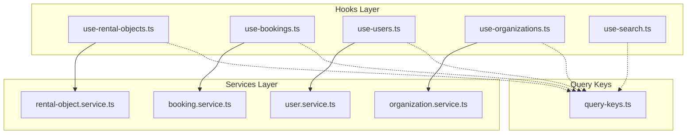
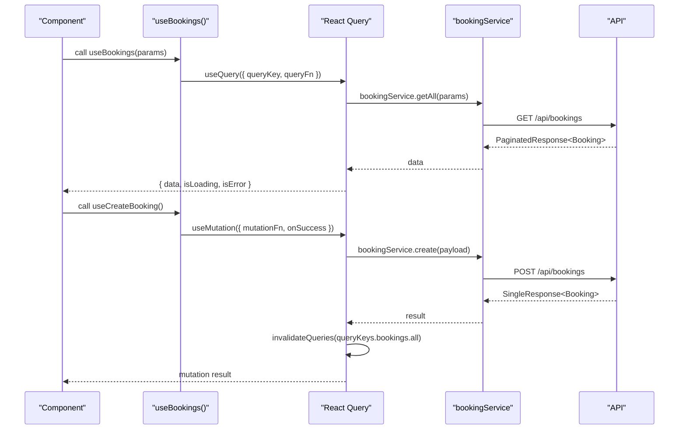
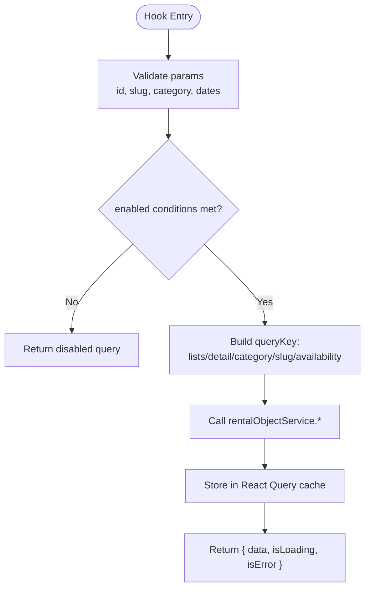
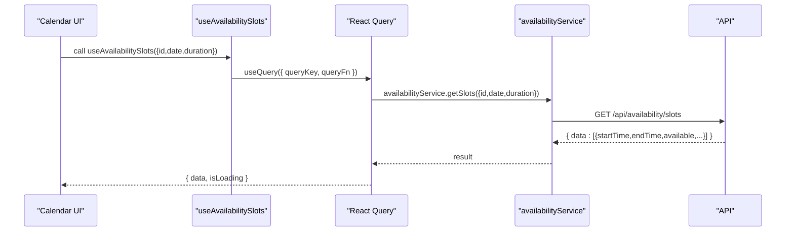
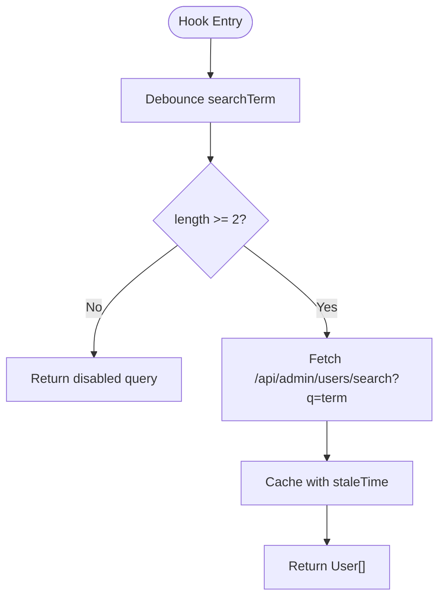
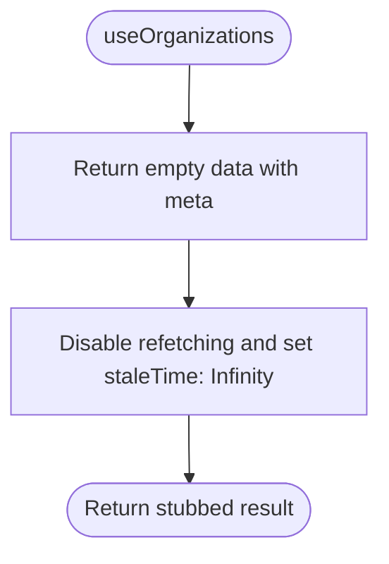
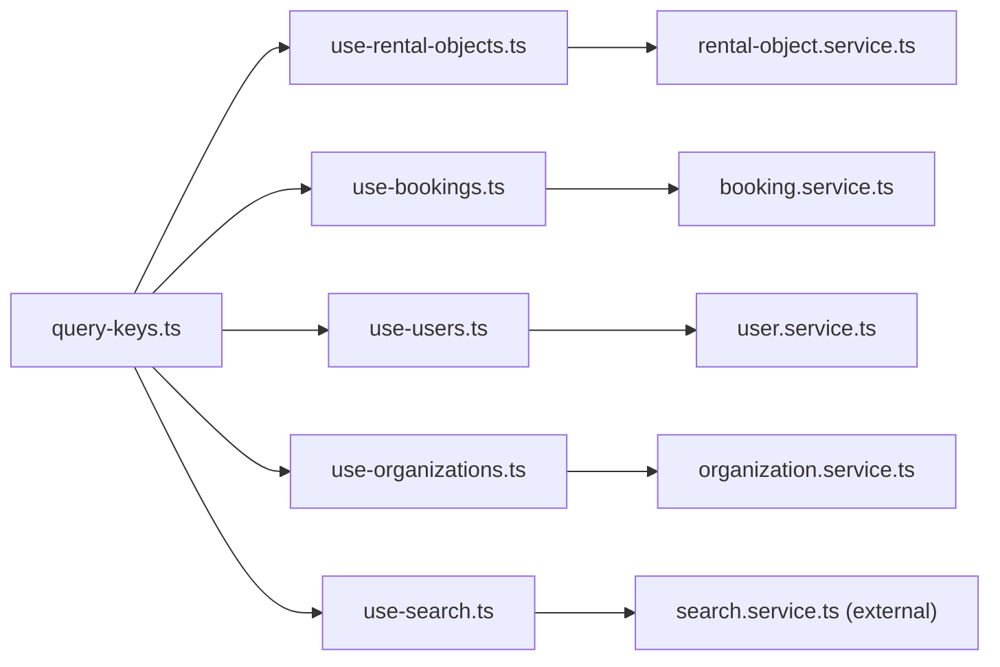

# Domain Entity Hooks

<cite>
**Referenced Files in This Document**
- [use-rental-objects.ts](file://packages/client-sdk/src/hooks/use-rental-objects.ts)
- [rental-object.service.ts](file://packages/client-sdk/src/services/rental-object.service.ts)
- [query-keys.ts](file://packages/client-sdk/src/hooks/query-keys.ts)
- [use-bookings.ts](file://packages/client-sdk/src/hooks/use-bookings.ts)
- [booking.service.ts](file://packages/client-sdk/src/services/booking.service.ts)
- [use-users.ts](file://packages/client-sdk/src/hooks/use-users.ts)
- [user.service.ts](file://packages/client-sdk/src/services/user.service.ts)
- [use-organizations.ts](file://packages/client-sdk/src/hooks/use-organizations.ts)
- [organization.service.ts](file://packages/client-sdk/src/services/organization.service.ts)
- [use-search.ts](file://packages/client-sdk/src/hooks/use-search.ts)
</cite>

## Table of Contents
1. [Introduction](#introduction)
2. [Project Structure](#project-structure)
3. [Core Components](#core-components)
4. [Architecture Overview](#architecture-overview)
5. [Detailed Component Analysis](#detailed-component-analysis)
6. [Dependency Analysis](#dependency-analysis)
7. [Performance Considerations](#performance-considerations)
8. [Troubleshooting Guide](#troubleshooting-guide)
9. [Conclusion](#conclusion)

## Introduction
This document explains the domain entity-specific React Query hooks for rental objects, bookings, users, and organizations. It covers CRUD operations, search, availability, pricing, and specialized queries. It also documents query key patterns, caching strategies, optimistic updates, pagination, filtering, sorting, and performance optimization techniques with cache invalidation patterns.

## Project Structure
The hooks are organized by domain entity under the client SDK’s hooks directory. Each domain exposes:
- A set of React Query hooks for data fetching and mutations
- A strongly typed query keys factory for cache key management
- A service layer that encapsulates API calls

**Diagram sources**
- [use-rental-objects.ts](file://packages/client-sdk/src/hooks/use-rental-objects.ts#L1-L479)
- [use-bookings.ts](file://packages/client-sdk/src/hooks/use-bookings.ts#L1-L356)
- [use-users.ts](file://packages/client-sdk/src/hooks/use-users.ts#L1-L358)
- [use-organizations.ts](file://packages/client-sdk/src/hooks/use-organizations.ts#L1-L131)
- [use-search.ts](file://packages/client-sdk/src/hooks/use-search.ts#L1-L141)
- [rental-object.service.ts](file://packages/client-sdk/src/services/rental-object.service.ts#L1-L300)
- [booking.service.ts](file://packages/client-sdk/src/services/booking.service.ts#L1-L497)
- [user.service.ts](file://packages/client-sdk/src/services/user.service.ts#L1-L150)
- [organization.service.ts](file://packages/client-sdk/src/services/organization.service.ts#L1-L261)
- [query-keys.ts](file://packages/client-sdk/src/hooks/query-keys.ts#L1-L568)

**Section sources**
- [use-rental-objects.ts](file://packages/client-sdk/src/hooks/use-rental-objects.ts#L1-L479)
- [use-bookings.ts](file://packages/client-sdk/src/hooks/use-bookings.ts#L1-L356)
- [use-users.ts](file://packages/client-sdk/src/hooks/use-users.ts#L1-L358)
- [use-organizations.ts](file://packages/client-sdk/src/hooks/use-organizations.ts#L1-L131)
- [use-search.ts](file://packages/client-sdk/src/hooks/use-search.ts#L1-L141)
- [query-keys.ts](file://packages/client-sdk/src/hooks/query-keys.ts#L1-L568)

## Core Components
- Rental Objects: Full CRUD, availability, stats, categories, media uploads, and combined list view.
- Bookings: Listing, detail, pricing calculation, recurring previews, calendar events, allocations, and admin approvals.
- Users: Admin user listing, detail, organization/tenant scoping, create/update/delete, suspend/reinstate, role assignment/removal, bulk invites, and stats.
- Organizations: Stubbed MinSide hooks with future backend integration.
- Search: Global search, typeahead, saved filters, recent searches, and export.

**Section sources**
- [use-rental-objects.ts](file://packages/client-sdk/src/hooks/use-rental-objects.ts#L47-L479)
- [use-bookings.ts](file://packages/client-sdk/src/hooks/use-bookings.ts#L29-L356)
- [use-users.ts](file://packages/client-sdk/src/hooks/use-users.ts#L26-L358)
- [use-organizations.ts](file://packages/client-sdk/src/hooks/use-organizations.ts#L31-L131)
- [use-search.ts](file://packages/client-sdk/src/hooks/use-search.ts#L26-L141)

## Architecture Overview
The hooks layer composes React Query with a typed query keys factory and a service layer. Mutations invalidate related cache keys to keep views consistent. Services encapsulate HTTP requests and DTOs.

**Diagram sources**
- [use-bookings.ts](file://packages/client-sdk/src/hooks/use-bookings.ts#L29-L170)
- [booking.service.ts](file://packages/client-sdk/src/services/booking.service.ts#L49-L92)
- [query-keys.ts](file://packages/client-sdk/src/hooks/query-keys.ts#L112-L127)

**Section sources**
- [use-bookings.ts](file://packages/client-sdk/src/hooks/use-bookings.ts#L29-L170)
- [booking.service.ts](file://packages/client-sdk/src/services/booking.service.ts#L49-L92)
- [query-keys.ts](file://packages/client-sdk/src/hooks/query-keys.ts#L112-L127)

## Detailed Component Analysis

### Rental Objects Hooks
- Query keys:
  - Lists: [rental-objects, "list", params]
  - Details: [rental-objects, "detail", id]
  - By slug: [rental-objects, "slug", slug]
  - Categories/subcategories: [rental-objects, "categories", ...]
  - Availability/stats/calendar-config: nested under detail key
  - Public variants: prefixed with ["public", ...]
- Queries:
  - useRentalObjects(params) — paginated list with filters
  - useRentalObjectsByCategory(category, params) — filtered by category
  - useRentalObject(id) — detail by id
  - useRentalObjectBySlug(slug) — detail by slug
  - useRentalObjectCategories() — cached categories
  - useRentalObjectSubcategories(category) — cached subcategories
  - useRentalObjectAvailability(id, params) — availability windowed by params
  - useRentalObjectStats(id) — stats per object
  - useRentalObjectCalendarConfig(id) — calendar behavior config
  - useBookingTimeModes() — cached time modes
  - usePublic* variants for anonymous access
  - useFeaturedRentalObjects(), usePublicCities(), usePublicMunicipalities()
- Mutations:
  - useCreateRentalObject(), useUpdateRentalObject(id,data), useDeleteRentalObject(id)
  - usePublishRentalObject(id), useArchiveRentalObject(id), useUnpublishRentalObject(id), useRestoreRentalObject(id), useDuplicateRentalObject(id)
  - useUploadRentalObjectMedia({id,files,options?}), useDeleteRentalObjectMedia({rentalObjectId,mediaId})
- Combined list view:
  - useRentalObjectsList(options) — returns data, pagination, totals, and current page

**Diagram sources**
- [use-rental-objects.ts](file://packages/client-sdk/src/hooks/use-rental-objects.ts#L47-L102)
- [rental-object.service.ts](file://packages/client-sdk/src/services/rental-object.service.ts#L70-L99)

**Section sources**
- [use-rental-objects.ts](file://packages/client-sdk/src/hooks/use-rental-objects.ts#L26-L479)
- [rental-object.service.ts](file://packages/client-sdk/src/services/rental-object.service.ts#L62-L215)
- [query-keys.ts](file://packages/client-sdk/src/hooks/query-keys.ts#L81-L92)

### Bookings Hooks
- Query keys:
  - bookings: [bookings, "list"/"detail"/"my"/"recurring", params]
  - calendar: [calendar, "events"/"slots", params]
  - allocations: [allocations, "list", params]
  - pricing: [bookings, "pricing", rentalObjectId, start, end]
  - payment reconciliation/history: [bookings, "paymentReconciliation"/"paymentHistory", ...]
- Queries:
  - useBookings(params) — paginated list
  - useBooking(id, options) — detail
  - useMyBookings(params) — current user’s bookings
  - useRecurringBookings() — recurring list
  - useBookingPricing(rentalObjectId, start, end) — pricing breakdown
  - useCalendarEvents(params) — calendar events
  - useAvailabilitySlots({rentalObjectId, date, duration?}) — available slots
  - useAllocations(params) — allocations list
  - usePaymentReconciliation(params) — reconciliation report
  - usePaymentHistory(bookingId) — payment transactions
  - useApproveBooking()/useRejectBooking() — admin actions
  - useRecurringPreview(hash) — preview occurrences
  - useCreateRecurringBooking() — create recurring series
- Mutations:
  - useCreateBooking(), useUpdateBooking(id,data), useConfirmBooking(id), useCancelBooking(id,data?), useCompleteBooking(id), useDeleteBooking(id)
  - useCreateAllocation(), useDeleteAllocation(id)

**Diagram sources**
- [use-bookings.ts](file://packages/client-sdk/src/hooks/use-bookings.ts#L189-L195)
- [booking.service.ts](file://packages/client-sdk/src/services/booking.service.ts#L432-L439)

**Section sources**
- [use-bookings.ts](file://packages/client-sdk/src/hooks/use-bookings.ts#L29-L356)
- [booking.service.ts](file://packages/client-sdk/src/services/booking.service.ts#L49-L340)
- [query-keys.ts](file://packages/client-sdk/src/hooks/query-keys.ts#L112-L142)

### Users Hooks
- Query keys:
  - users: [users, "list"/"detail"/"byOrg"/"byTenant"/"search"/"stats", params]
- Queries:
  - useUsers(query?) — admin list with filters
  - useUser(id) — detail
  - useUsersByOrganization(organizationId) — scoped list
  - useUsersByTenant(tenantId) — scoped list
  - useUserStats() — cached stats
  - useSearchUsers(searchTerm) — debounced search
- Mutations:
  - useCreateUser(), useUpdateUser(id,data), useDeleteUser(id)
  - useSuspendUser(id,reason?), useReinstateUser(id)
  - useAssignRole(userId,data), useRemoveRole(userId,roleId)
  - useBulkInviteUsers({emails,roleId?,organizationId?})

**Diagram sources**
- [use-users.ts](file://packages/client-sdk/src/hooks/use-users.ts#L344-L357)
- [user.service.ts](file://packages/client-sdk/src/services/user.service.ts#L128-L134)

**Section sources**
- [use-users.ts](file://packages/client-sdk/src/hooks/use-users.ts#L26-L358)
- [user.service.ts](file://packages/client-sdk/src/services/user.service.ts#L26-L134)
- [query-keys.ts](file://packages/client-sdk/src/hooks/query-keys.ts#L169-L184)

### Organizations Hooks
- Current state: stubbed for MinSide with disabled queries and infinite stale time.
- Future scope: organizations list/detail, members, branding, and membership management.

**Diagram sources**
- [use-organizations.ts](file://packages/client-sdk/src/hooks/use-organizations.ts#L31-L50)

**Section sources**
- [use-organizations.ts](file://packages/client-sdk/src/hooks/use-organizations.ts#L31-L131)
- [organization.service.ts](file://packages/client-sdk/src/services/organization.service.ts#L35-L136)

### Search Hooks
- Query keys:
  - search: [search, "results"/"typeahead"/"recent"/"savedFilters", params]
- Queries:
  - useGlobalSearch(params) — global search results
  - useTypeahead(params) — live suggestions with short staleTime
  - useSavedFilters(params?), useSavedFilter(id)
  - useRecentSearches(params?)
- Mutations:
  - useCreateSavedFilter(), useUpdateSavedFilter(id,data), useDeleteSavedFilter(id)
  - useExportResults(params)

**Section sources**
- [use-search.ts](file://packages/client-sdk/src/hooks/use-search.ts#L26-L141)
- [query-keys.ts](file://packages/client-sdk/src/hooks/query-keys.ts#L64-L75)

## Dependency Analysis
- Hooks depend on:
  - query-keys.ts for deterministic cache keys
  - service classes for API calls
- Coupling:
  - Low within domains; services encapsulate HTTP concerns
  - Tight coupling avoided via centralized query keys
- External dependencies:
  - React Query for caching, invalidation, and background updates
  - TanStack Query keys for strong typing

**Diagram sources**
- [query-keys.ts](file://packages/client-sdk/src/hooks/query-keys.ts#L1-L568)
- [use-rental-objects.ts](file://packages/client-sdk/src/hooks/use-rental-objects.ts#L1-L479)
- [use-bookings.ts](file://packages/client-sdk/src/hooks/use-bookings.ts#L1-L356)
- [use-users.ts](file://packages/client-sdk/src/hooks/use-users.ts#L1-L358)
- [use-organizations.ts](file://packages/client-sdk/src/hooks/use-organizations.ts#L1-L131)
- [use-search.ts](file://packages/client-sdk/src/hooks/use-search.ts#L1-L141)
- [rental-object.service.ts](file://packages/client-sdk/src/services/rental-object.service.ts#L1-L300)
- [booking.service.ts](file://packages/client-sdk/src/services/booking.service.ts#L1-L497)
- [user.service.ts](file://packages/client-sdk/src/services/user.service.ts#L1-L150)
- [organization.service.ts](file://packages/client-sdk/src/services/organization.service.ts#L1-L261)

**Section sources**
- [query-keys.ts](file://packages/client-sdk/src/hooks/query-keys.ts#L1-L568)
- [use-rental-objects.ts](file://packages/client-sdk/src/hooks/use-rental-objects.ts#L1-L479)
- [use-bookings.ts](file://packages/client-sdk/src/hooks/use-bookings.ts#L1-L356)
- [use-users.ts](file://packages/client-sdk/src/hooks/use-users.ts#L1-L358)
- [use-organizations.ts](file://packages/client-sdk/src/hooks/use-organizations.ts#L1-L131)
- [use-search.ts](file://packages/client-sdk/src/hooks/use-search.ts#L1-L141)

## Performance Considerations
- Stale times:
  - Categories, subcategories, time modes, and public lists use cached stale times to reduce network requests.
- Enabling conditions:
  - Queries are enabled only when required parameters are present (e.g., id, slug, dates).
- Debouncing:
  - Typeahead and user search are debounced to avoid excessive requests.
- Pagination and filtering:
  - All list endpoints accept pagination and filter parameters; pass them to hooks to constrain payloads.
- Sorting:
  - Sorting is supported via query params exposed by services; pass sort fields to hooks.
- Image compression:
  - Media upload hook optionally compresses images before upload to reduce payload sizes.

**Section sources**
- [use-rental-objects.ts](file://packages/client-sdk/src/hooks/use-rental-objects.ts#L115-L127)
- [use-rental-objects.ts](file://packages/client-sdk/src/hooks/use-rental-objects.ts#L388-L389)
- [use-rental-objects.ts](file://packages/client-sdk/src/hooks/use-rental-objects.ts#L362-L367)
- [use-bookings.ts](file://packages/client-sdk/src/hooks/use-bookings.ts#L70-L76)
- [use-users.ts](file://packages/client-sdk/src/hooks/use-users.ts#L344-L357)
- [use-rental-objects.ts](file://packages/client-sdk/src/hooks/use-rental-objects.ts#L409-L431)

## Troubleshooting Guide
- Queries not updating after mutation:
  - Ensure onSuccess handlers invalidate appropriate query keys (lists, detail, calendar).
- Infinite refetch loops:
  - Verify enabled conditions and parameter shapes; avoid enabling when params are missing.
- Stale data:
  - Adjust staleTime or use manual invalidation for frequently changing resources.
- Typeahead spam:
  - Confirm debounce threshold and minimum query length.
- Media upload failures:
  - Check file types and compression options; fallback gracefully if compression fails.

**Section sources**
- [use-bookings.ts](file://packages/client-sdk/src/hooks/use-bookings.ts#L86-L139)
- [use-users.ts](file://packages/client-sdk/src/hooks/use-users.ts#L110-L171)
- [use-rental-objects.ts](file://packages/client-sdk/src/hooks/use-rental-objects.ts#L143-L176)
- [use-rental-objects.ts](file://packages/client-sdk/src/hooks/use-rental-objects.ts#L428-L431)

## Conclusion
These domain entity hooks provide a cohesive, strongly typed, and cache-aware interface for rental objects, bookings, users, and organizations. They leverage centralized query keys, precise invalidation, and service abstractions to support robust UIs with good performance and maintainability. As the organizations hooks are currently stubbed, plan to integrate backend endpoints and enable queries accordingly.