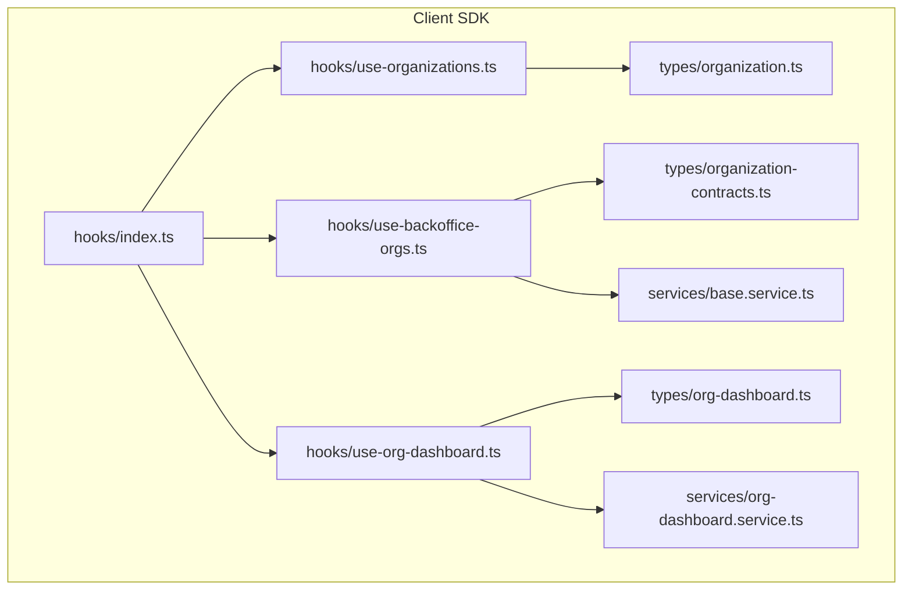
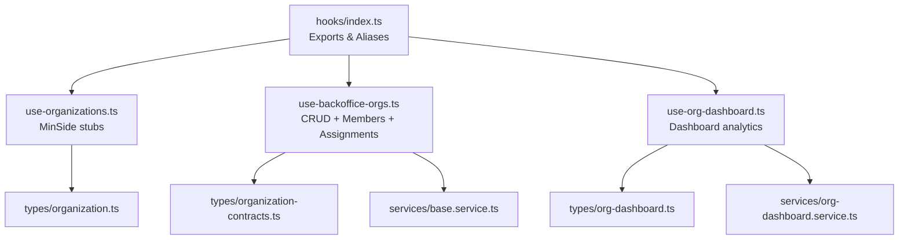
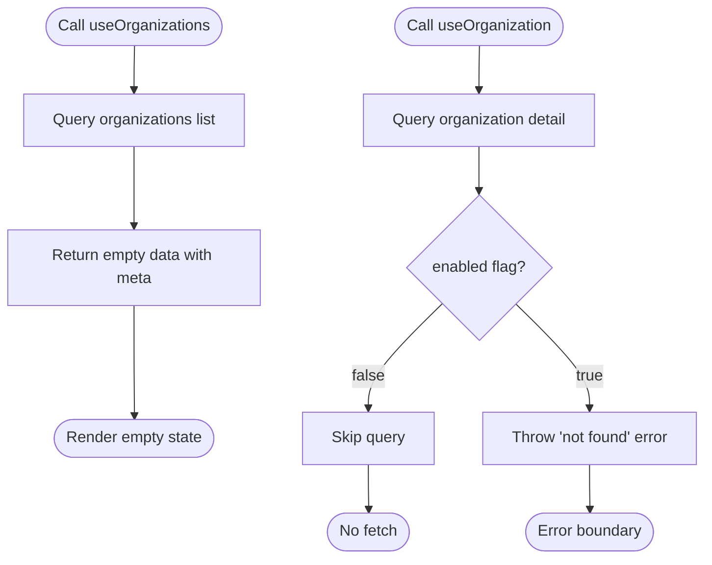
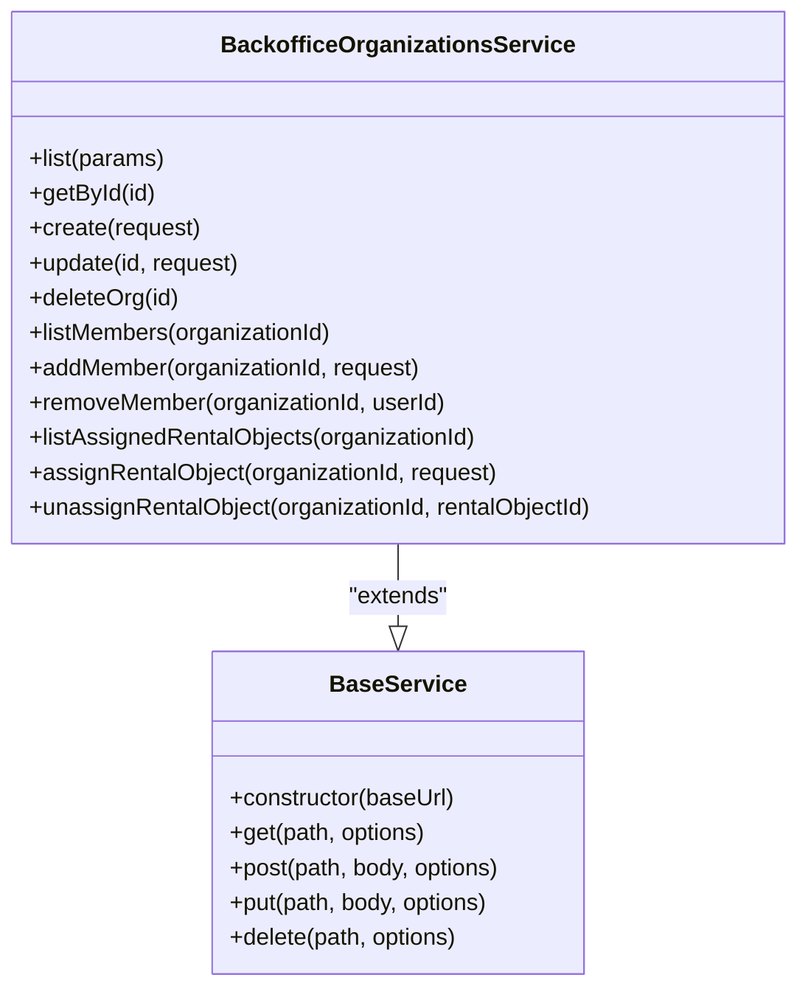
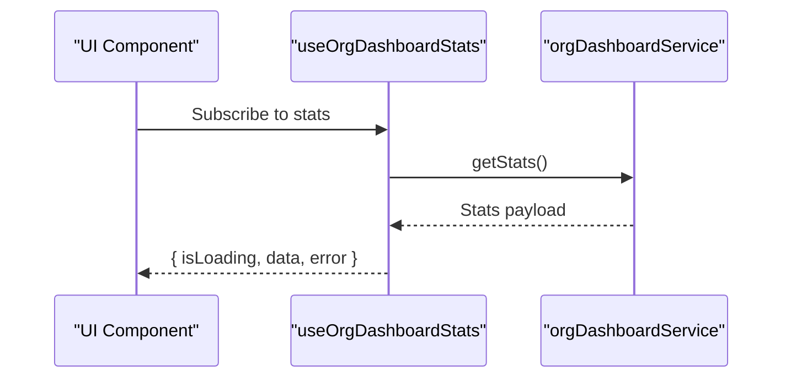
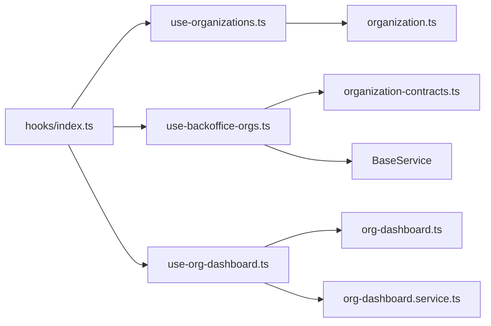

# Organizations Hooks

<cite>
**Referenced Files in This Document**
- [use-organizations.ts](file://packages/client-sdk/src/hooks/use-organizations.ts)
- [use-backoffice-orgs.ts](file://packages/client-sdk/src/hooks/use-backoffice-orgs.ts)
- [use-org-dashboard.ts](file://packages/client-sdk/src/hooks/use-org-dashboard.ts)
- [index.ts](file://packages/client-sdk/src/hooks/index.ts)
- [organization-contracts.ts](file://packages/client-sdk/src/types/organization-contracts.ts)
- [organization.ts](file://packages/client-sdk/src/types/organization.ts)
- [org-dashboard.ts](file://packages/client-sdk/src/types/org-dashboard.ts)
- [base.service.ts](file://packages/client-sdk/src/services/base.service.ts)
- [org-dashboard.service.ts](file://packages/client-sdk/src/services/org-dashboard.service.ts)
- [use-users.ts](file://packages/client-sdk/src/hooks/use-users.ts)
- [use-tenant-admin-users.ts](file://packages/client-sdk/src/hooks/use-tenant-admin-users.ts)
- [use-rbac.ts](file://packages/client-sdk/src/hooks/use-rbac.ts)
- [use-billing.ts](file://packages/client-sdk/src/hooks/use-billing.ts)
- [use-search.ts](file://packages/client-sdk/src/hooks/use-search.ts)
- [use-realtime.ts](file://packages/client-sdk/src/hooks/use-realtime.ts)
</cite>

## Table of Contents
1. [Introduction](#introduction)
2. [Project Structure](#project-structure)
3. [Core Components](#core-components)
4. [Architecture Overview](#architecture-overview)
5. [Detailed Component Analysis](#detailed-component-analysis)
6. [Dependency Analysis](#dependency-analysis)
7. [Performance Considerations](#performance-considerations)
8. [Troubleshooting Guide](#troubleshooting-guide)
9. [Conclusion](#conclusion)
10. [Appendices](#appendices)

## Introduction
This document provides comprehensive documentation for organization-related React Query hooks across the monorepo. It focuses on:
- Organization listing and detail retrieval
- Organization member management and role assignment
- Organization hierarchy and scope assignment
- Organization settings, branding, and tenant configuration
- Organization onboarding workflows, member invitations, and administrative role management
- Organization analytics, usage tracking, and billing integration
- Organization search and filtering, member directory functionality
- Real-time organization state synchronization

The documentation consolidates the current implementation state, highlights stubbed functionality, and provides guidance for extending hooks as backend APIs become available.

## Project Structure
The organization hooks are primarily located in the client SDK under the hooks directory. They rely on shared types and services for contracts, organization models, and dashboard features.

**Diagram sources**
- [use-organizations.ts](file://packages/client-sdk/src/hooks/use-organizations.ts#L1-L131)
- [use-backoffice-orgs.ts](file://packages/client-sdk/src/hooks/use-backoffice-orgs.ts#L1-L214)
- [use-org-dashboard.ts](file://packages/client-sdk/src/hooks/use-org-dashboard.ts#L1-L74)
- [index.ts](file://packages/client-sdk/src/hooks/index.ts#L1-L817)
- [organization.ts](file://packages/client-sdk/src/types/organization.ts)
- [organization-contracts.ts](file://packages/client-sdk/src/types/organization-contracts.ts)
- [org-dashboard.ts](file://packages/client-sdk/src/types/org-dashboard.ts)
- [base.service.ts](file://packages/client-sdk/src/services/base.service.ts)
- [org-dashboard.service.ts](file://packages/client-sdk/src/services/org-dashboard.service.ts)

**Section sources**
- [use-organizations.ts](file://packages/client-sdk/src/hooks/use-organizations.ts#L1-L131)
- [use-backoffice-orgs.ts](file://packages/client-sdk/src/hooks/use-backoffice-orgs.ts#L1-L214)
- [use-org-dashboard.ts](file://packages/client-sdk/src/hooks/use-org-dashboard.ts#L1-L74)
- [index.ts](file://packages/client-sdk/src/hooks/index.ts#L178-L240)

## Core Components
This section outlines the primary organization hooks and their responsibilities, including current stub status and intended behavior.

- useOrganizations (MinSide stub): Lists organizations for a user with pagination metadata. Currently returns empty data until backend endpoints are implemented.
- useOrganization (MinSide stub): Retrieves a single organization detail. Currently disabled and throws an error until backend is ready.
- useOrganizationMembers (MinSide stub): Lists members of an organization. Disabled until backend endpoints are available.
- useAddOrganizationMember (MinSide stub): Adds a member to an organization. Stub returns unchanged data until backend is ready.
- useRemoveOrganizationMember (MinSide stub): Removes a member from an organization. Stub returns success until backend is ready.
- useUpdateOrganizationMember (MinSide stub): Updates a member’s role or attributes. Stub returns unchanged data until backend is ready.
- useBackofficeOrganizations: Lists partner/municipal organizations with configurable filters and pagination.
- useBackofficeOrganization: Fetches a specific organization by ID with optional enablement.
- useCreateBackofficeOrganization: Creates a new organization via mutation with cache invalidation.
- useUpdateBackofficeOrganization: Updates an existing organization via mutation with cache invalidation.
- useDeleteBackofficeOrganization: Deletes an organization via mutation with cache invalidation.
- useBackofficeOrganizationMembers: Lists members of a backoffice-managed organization.
- useAddBackofficeOrganizationMember: Adds a member to a backoffice-managed organization with cache invalidation.
- useRemoveBackofficeOrganizationMember: Removes a member from a backoffice-managed organization with cache invalidation.
- useBackofficeAssignedRentalObjects: Lists rental objects assigned to an organization.
- useAssignRentalObjectToOrg: Assigns a rental object to an organization with cache invalidation.
- useUnassignRentalObjectFromOrg: Unassigns a rental object from an organization with cache invalidation.
- useOrgDashboardStats: Fetches organization dashboard statistics for assigned rental objects.
- useOrgPendingItems: Retrieves pending items requiring approval for assigned objects.
- useOrgCalendarPreview: Provides calendar previews for assigned objects.
- useOrgAlerts: Fetches operational alerts for assigned objects.
- useAssignedRentalObjects: Lists assigned rental objects for the organization.
- useUpdateOrganizationBranding (stub): Updates organization branding (logo, color) with a local mutation.
- useVerifyOrganization (stub): Verifies organization against external registry with a local mock response.

**Section sources**
- [use-organizations.ts](file://packages/client-sdk/src/hooks/use-organizations.ts#L25-L131)
- [use-backoffice-orgs.ts](file://packages/client-sdk/src/hooks/use-backoffice-orgs.ts#L93-L214)
- [use-org-dashboard.ts](file://packages/client-sdk/src/hooks/use-org-dashboard.ts#L25-L74)
- [index.ts](file://packages/client-sdk/src/hooks/index.ts#L178-L240)

## Architecture Overview
The organization hooks follow a consistent pattern:
- Query keys encapsulate caching and invalidation strategies.
- Service classes abstract HTTP requests for backoffice operations.
- Dashboard hooks depend on dedicated service methods for analytics and calendar previews.
- Aliases provide compatibility between MinSide and Backoffice naming conventions.

**Diagram sources**
- [use-organizations.ts](file://packages/client-sdk/src/hooks/use-organizations.ts#L1-L131)
- [use-backoffice-orgs.ts](file://packages/client-sdk/src/hooks/use-backoffice-orgs.ts#L1-L214)
- [use-org-dashboard.ts](file://packages/client-sdk/src/hooks/use-org-dashboard.ts#L1-L74)
- [index.ts](file://packages/client-sdk/src/hooks/index.ts#L178-L240)
- [organization-contracts.ts](file://packages/client-sdk/src/types/organization-contracts.ts)
- [organization.ts](file://packages/client-sdk/src/types/organization.ts)
- [org-dashboard.ts](file://packages/client-sdk/src/types/org-dashboard.ts)
- [base.service.ts](file://packages/client-sdk/src/services/base.service.ts)
- [org-dashboard.service.ts](file://packages/client-sdk/src/services/org-dashboard.service.ts)

## Detailed Component Analysis

### MinSide Organization Hooks (Stubs)
These hooks are currently stubbed and intended for MinSide users. They return placeholder data or disabled queries until backend endpoints are implemented.

**Diagram sources**
- [use-organizations.ts](file://packages/client-sdk/src/hooks/use-organizations.ts#L31-L66)

Key behaviors:
- useOrganizations: Returns empty data and disables refetching; useful for UI scaffolding.
- useOrganization: Disabled by default; throws an error when invoked.
- useOrganizationMembers: Disabled until organizationId is present; returns empty list.
- Mutations (add/remove/update member): Return unchanged data locally; replace with real API calls when endpoints are ready.

**Section sources**
- [use-organizations.ts](file://packages/client-sdk/src/hooks/use-organizations.ts#L25-L131)

### Backoffice Organization Management Hooks
Backoffice hooks implement full CRUD operations, member management, and rental object assignments via a service layer.

**Diagram sources**
- [use-backoffice-orgs.ts](file://packages/client-sdk/src/hooks/use-backoffice-orgs.ts#L21-L71)
- [base.service.ts](file://packages/client-sdk/src/services/base.service.ts)

Hook-level responsibilities:
- useBackofficeOrganizations: Lists organizations with configurable filters.
- useBackofficeOrganization: Fetches a single organization with optional enablement.
- useCreateBackofficeOrganization: Creates an organization and invalidates related queries.
- useUpdateBackofficeOrganization: Updates an organization and invalidates detail/list caches.
- useDeleteBackofficeOrganization: Deletes an organization and invalidates list cache.
- useBackofficeOrganizationMembers: Lists members with optional enablement.
- useAddBackofficeOrganizationMember: Adds a member and invalidates members cache.
- useRemoveBackofficeOrganizationMember: Removes a member and invalidates members cache.
- useBackofficeAssignedRentalObjects: Lists assigned rental objects with optional enablement.
- useAssignRentalObjectToOrg: Assigns an object and invalidates assignments cache.
- useUnassignRentalObjectFromOrg: Unassigns an object and invalidates assignments cache.

**Section sources**
- [use-backoffice-orgs.ts](file://packages/client-sdk/src/hooks/use-backoffice-orgs.ts#L93-L214)

### Organization Dashboard Hooks
Dashboard hooks provide analytics and operational insights for organizations.

**Diagram sources**
- [use-org-dashboard.ts](file://packages/client-sdk/src/hooks/use-org-dashboard.ts#L25-L33)
- [org-dashboard.service.ts](file://packages/client-sdk/src/services/org-dashboard.service.ts)

Supported dashboards:
- useOrgDashboardStats: Organization-level KPIs for assigned rental objects.
- useOrgPendingItems: Pending bookings requiring approval.
- useOrgCalendarPreview: Upcoming availability/calendar previews.
- useOrgAlerts: Operational alerts for assigned objects.
- useAssignedRentalObjects: List of assigned rental objects.

**Section sources**
- [use-org-dashboard.ts](file://packages/client-sdk/src/hooks/use-org-dashboard.ts#L25-L74)

### Organization Settings, Branding, and Tenant Configuration
- useUpdateOrganizationBranding (stub): Local mutation to update branding attributes (logo, primary color).
- useVerifyOrganization (stub): Mock verification against external registry.
- Tenant branding and integration settings are available via tenant admin hooks.

**Section sources**
- [index.ts](file://packages/client-sdk/src/hooks/index.ts#L223-L239)
- [use-tenant-admin-users.ts](file://packages/client-sdk/src/hooks/use-tenant-admin-users.ts#L611-L643)

### Organization Hierarchy, Member Management, and Role Assignment
- Backoffice member management: Add/remove members and invalidate caches accordingly.
- RBAC integration: Effective roles and permissions are managed via RBAC hooks; organization membership ties into scope assignment and access grants.
- Scope assignment: Set organization scope and manage delegated access.

**Section sources**
- [use-backoffice-orgs.ts](file://packages/client-sdk/src/hooks/use-backoffice-orgs.ts#L147-L177)
- [use-rbac.ts](file://packages/client-sdk/src/hooks/use-rbac.ts#L680-L721)
- [use-scope-assignment.ts](file://packages/client-sdk/src/hooks/use-scope-assignment.ts#L645-L668)

### Administrative Role Management
- Backoffice role management: Assign/remove roles and scopes for users within organizations.
- Bulk operations: Bulk invite users, assign roles, and manage deactivation/reactivation.

**Section sources**
- [use-users.ts](file://packages/client-sdk/src/hooks/use-users.ts#L252-L268)
- [use-tenant-admin-users.ts](file://packages/client-sdk/src/hooks/use-tenant-admin-users.ts#L621-L643)

### Organization Analytics, Usage Tracking, and Billing Integration
- Organization dashboard analytics: Stats, pending items, calendar preview, alerts.
- Billing integration: Organization billing summaries and invoices are exposed via billing hooks.

**Section sources**
- [use-org-dashboard.ts](file://packages/client-sdk/src/hooks/use-org-dashboard.ts#L25-L74)
- [use-billing.ts](file://packages/client-sdk/src/hooks/use-billing.ts#L526-L538)

### Organization Search and Filtering, Member Directory Functionality
- Global search and filtering: Implemented via search hooks for cross-domain discovery.
- Member directory: Backoffice user management exposes listing and search capabilities.

**Section sources**
- [use-search.ts](file://packages/client-sdk/src/hooks/use-search.ts#L485-L496)
- [use-users.ts](file://packages/client-sdk/src/hooks/use-users.ts#L252-L268)

### Real-Time Organization State Synchronization
- Realtime hooks: WebSocket-based updates for bookings, rental objects, calendar, messages, notifications, audit, and monitoring.
- Use these hooks to keep organization state synchronized without polling.

**Section sources**
- [use-realtime.ts](file://packages/client-sdk/src/hooks/use-realtime.ts#L300-L313)

## Dependency Analysis
The organization hooks depend on shared types and services. The exports index aggregates and re-exports hooks for consumption across applications.

**Diagram sources**
- [index.ts](file://packages/client-sdk/src/hooks/index.ts#L178-L240)
- [use-backoffice-orgs.ts](file://packages/client-sdk/src/hooks/use-backoffice-orgs.ts#L1-L214)
- [use-organizations.ts](file://packages/client-sdk/src/hooks/use-organizations.ts#L1-L131)
- [use-org-dashboard.ts](file://packages/client-sdk/src/hooks/use-org-dashboard.ts#L1-L74)
- [organization-contracts.ts](file://packages/client-sdk/src/types/organization-contracts.ts)
- [organization.ts](file://packages/client-sdk/src/types/organization.ts)
- [org-dashboard.ts](file://packages/client-sdk/src/types/org-dashboard.ts)
- [base.service.ts](file://packages/client-sdk/src/services/base.service.ts)
- [org-dashboard.service.ts](file://packages/client-sdk/src/services/org-dashboard.service.ts)

**Section sources**
- [index.ts](file://packages/client-sdk/src/hooks/index.ts#L178-L240)

## Performance Considerations
- Stale-time and refetch controls: MinSide stubs disable refetching and set infinite stale time to avoid unnecessary network calls during development.
- Cache invalidation: Backoffice hooks invalidate targeted query keys after mutations to keep UI state consistent.
- Pagination and filtering: Dashboard and organization listing hooks accept parameters to limit payload sizes and improve responsiveness.

[No sources needed since this section provides general guidance]

## Troubleshooting Guide
Common issues and resolutions:
- MinSide hooks not loading data: Confirm that the enabled flags and query keys are correctly configured; stubs intentionally return empty data.
- Backoffice mutations not updating UI: Ensure queryClient invalidation is triggered for affected query keys (lists, details, members, assignments).
- Dashboard analytics not appearing: Verify that the orgDashboardService methods are reachable and that query keys match expected shapes.
- Realtime updates not reflected: Confirm WebSocket connections and subscription hooks are active and that events are mapped to correct query keys.

**Section sources**
- [use-organizations.ts](file://packages/client-sdk/src/hooks/use-organizations.ts#L31-L66)
- [use-backoffice-orgs.ts](file://packages/client-sdk/src/hooks/use-backoffice-orgs.ts#L113-L140)
- [use-org-dashboard.ts](file://packages/client-sdk/src/hooks/use-org-dashboard.ts#L25-L33)
- [use-realtime.ts](file://packages/client-sdk/src/hooks/use-realtime.ts#L300-L313)

## Conclusion
The organization hooks provide a robust foundation for managing organizations, members, and analytics across MinSide and Backoffice contexts. While MinSide hooks are currently stubbed for development continuity, Backoffice hooks implement full CRUD, member management, and assignment workflows. As backend endpoints mature, the stubs can be progressively replaced with real API integrations while leveraging the established query keys and service patterns.

[No sources needed since this section summarizes without analyzing specific files]

## Appendices

### Hook Aliases and Compatibility
- useDeleteOrganization, useCreateOrganization, useUpdateOrganization, and useOrganizationDetail are exported as aliases for Backoffice hooks to maintain compatibility.

**Section sources**
- [index.ts](file://packages/client-sdk/src/hooks/index.ts#L215-L221)