# Rental Objects Hooks

<cite>
**Referenced Files in This Document**
- [use-rental-objects.ts](file://packages/client-sdk/src/hooks/use-rental-objects.ts)
- [index.ts](file://packages/client-sdk/src/hooks/index.ts)
- [rental-object.service.ts](file://packages/client-sdk/src/services/rental-object.service.ts)
- [rental-object.ts](file://packages/client-sdk/src/types/rental-object.ts)
- [image-compression.ts](file://packages/client-sdk/src/utils/image-compression.ts)
- [query-keys.ts](file://packages/client-sdk/src/hooks/query-keys.ts)
- [rental-object.controller.ts](file://apps/api/src/modules/rental-objects/rental-object.controller.ts)
- [rental-object.service.ts](file://apps/api/src/modules/rental-objects/rental-object.service.ts)
</cite>

## Table of Contents
1. [Introduction](#introduction)
2. [Project Structure](#project-structure)
3. [Core Components](#core-components)
4. [Architecture Overview](#architecture-overview)
5. [Detailed Component Analysis](#detailed-component-analysis)
6. [Dependency Analysis](#dependency-analysis)
7. [Performance Considerations](#performance-considerations)
8. [Troubleshooting Guide](#troubleshooting-guide)
9. [Conclusion](#conclusion)

## Introduction
This document provides comprehensive documentation for the rental object-specific React Query hooks that power CRUD operations, specialized actions (publish/unpublish/archive/restore), availability queries, categories, media uploads, and public endpoints. It explains query key patterns, caching strategies, optimistic updates, pagination, and real-time cache invalidation. Examples include category-based filtering, slug-based lookups, availability queries, media upload hooks with image compression, and performance optimization via selective query enabling.

## Project Structure
The rental object hooks live in the client SDK and are organized under a dedicated hooks module. They integrate with a service layer that communicates with the API, and leverage a centralized query keys factory for cache management.

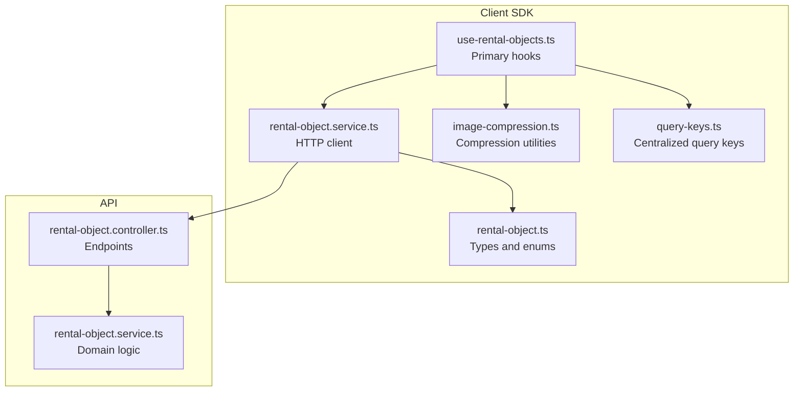

**Diagram sources**
- [use-rental-objects.ts](file://packages/client-sdk/src/hooks/use-rental-objects.ts#L1-L479)
- [rental-object.service.ts](file://packages/client-sdk/src/services/rental-object.service.ts#L1-L300)
- [rental-object.ts](file://packages/client-sdk/src/types/rental-object.ts#L1-L525)
- [image-compression.ts](file://packages/client-sdk/src/utils/image-compression.ts#L1-L180)
- [query-keys.ts](file://packages/client-sdk/src/hooks/query-keys.ts#L1-L568)
- [rental-object.controller.ts](file://apps/api/src/modules/rental-objects/rental-object.controller.ts#L171-L201)
- [rental-object.service.ts](file://apps/api/src/modules/rental-objects/rental-object.service.ts#L33-L149)

**Section sources**
- [use-rental-objects.ts](file://packages/client-sdk/src/hooks/use-rental-objects.ts#L1-L479)
- [index.ts](file://packages/client-sdk/src/hooks/index.ts#L78-L111)

## Core Components
This section summarizes the primary hooks and their responsibilities.

- useRentalObjects(params?): List rental objects with optional filters and pagination.
- useRentalObject(id?): Fetch a single rental object by ID.
- useRentalObjectBySlug(slug?): Fetch a rental object by slug.
- useRentalObjectsByCategory(category, params?): Filter by category with optional additional filters.
- usePublicRentalObjects(params?) and usePublicRentalObjectsList(params?): Public list endpoints (no auth).
- usePublicRentalObject(id?) and usePublicRentalObjectBySlug(slug?): Public detail endpoints.
- useRentalObjectCategories() and useRentalObjectSubcategories(category?): Category and subcategory metadata.
- useCreateRentalObject(), useUpdateRentalObject(), useDeleteRentalObject(): CRUD mutations.
- usePublishRentalObject(), useUnpublishRentalObject(), useArchiveRentalObject(), useRestoreRentalObject(): Lifecycle mutations.
- useRentalObjectAvailability(id, params) and usePublicRentalObjectAvailability(id, params): Availability queries.
- useRentalObjectStats(id?), useRentalObjectCalendarConfig(id?): Analytics and calendar configuration.
- useUploadRentalObjectMedia() and useDeleteRentalObjectMedia(): Media management with optional compression.
- useRentalObjectsList(options): Convenience hook bundling list data, pagination, and totals.

Caching and invalidation:
- Query keys are structured to enable precise cache invalidation after mutations.
- Categories and time modes use staleTime to cache metadata efficiently.
- Availability queries are enabled only when required parameters are present.

**Section sources**
- [use-rental-objects.ts](file://packages/client-sdk/src/hooks/use-rental-objects.ts#L47-L102)
- [use-rental-objects.ts](file://packages/client-sdk/src/hooks/use-rental-objects.ts#L111-L129)
- [use-rental-objects.ts](file://packages/client-sdk/src/hooks/use-rental-objects.ts#L138-L251)
- [use-rental-objects.ts](file://packages/client-sdk/src/hooks/use-rental-objects.ts#L260-L288)
- [use-rental-objects.ts](file://packages/client-sdk/src/hooks/use-rental-objects.ts#L308-L346)
- [use-rental-objects.ts](file://packages/client-sdk/src/hooks/use-rental-objects.ts#L405-L448)
- [use-rental-objects.ts](file://packages/client-sdk/src/hooks/use-rental-objects.ts#L461-L478)

## Architecture Overview
The hooks layer orchestrates React Query operations, while the service layer encapsulates HTTP requests. The API exposes endpoints for rental objects, availability, categories, and media management.

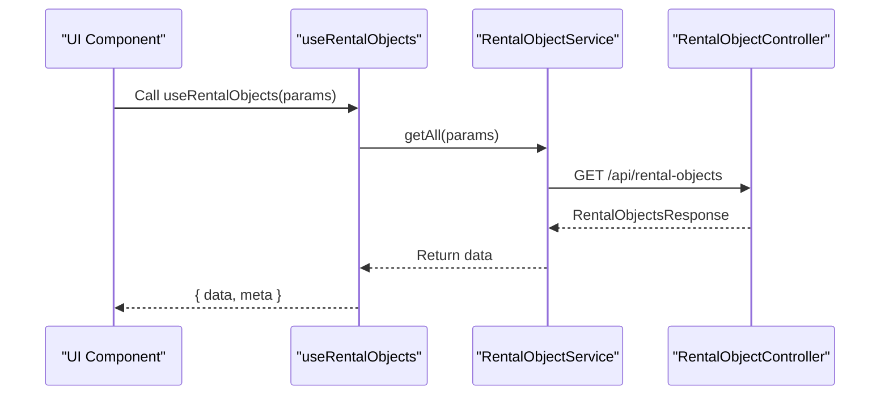

**Diagram sources**
- [use-rental-objects.ts](file://packages/client-sdk/src/hooks/use-rental-objects.ts#L47-L52)
- [rental-object.service.ts](file://packages/client-sdk/src/services/rental-object.service.ts#L70-L75)
- [rental-object.controller.ts](file://apps/api/src/modules/rental-objects/rental-object.controller.ts#L1-L201)

## Detailed Component Analysis

### Query Keys and Caching Strategy
- Centralized query keys factory ensures consistent cache keys across the app.
- Lists use queryKey arrays that include the full parameter set, enabling precise cache hits.
- Detail queries include the rental object ID.
- Availability and stats are scoped under detail keys.
- Categories and time modes are cached with staleTime to reduce network requests.

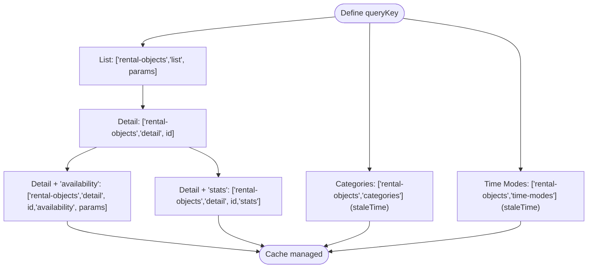

**Diagram sources**
- [query-keys.ts](file://packages/client-sdk/src/hooks/query-keys.ts#L81-L92)
- [use-rental-objects.ts](file://packages/client-sdk/src/hooks/use-rental-objects.ts#L115-L116)
- [use-rental-objects.ts](file://packages/client-sdk/src/hooks/use-rental-objects.ts#L297-L298)

**Section sources**
- [query-keys.ts](file://packages/client-sdk/src/hooks/query-keys.ts#L81-L92)
- [use-rental-objects.ts](file://packages/client-sdk/src/hooks/use-rental-objects.ts#L115-L116)
- [use-rental-objects.ts](file://packages/client-sdk/src/hooks/use-rental-objects.ts#L297-L298)

### CRUD Hooks
- useRentalObjects(params?): Paginated listing with optional filters.
- useRentalObject(id?): Detail fetch with enabled guard.
- useRentalObjectBySlug(slug?): Slug-based lookup with enabled guard.
- useCreateRentalObject(): Creates a new rental object and invalidates list queries.
- useUpdateRentalObject(): Updates and invalidates both detail and list caches.
- useDeleteRentalObject(): Deletes and invalidates list cache.

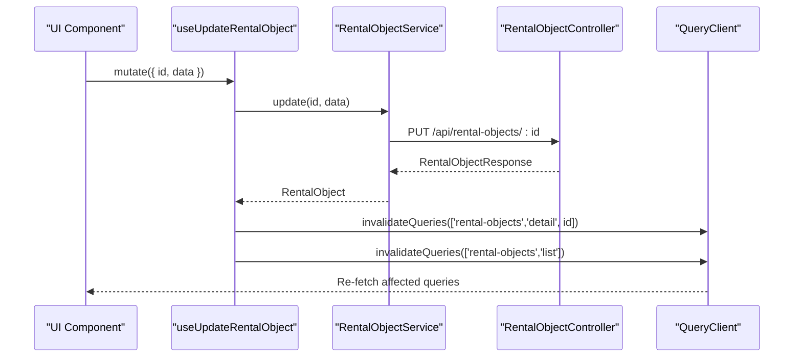

**Diagram sources**
- [use-rental-objects.ts](file://packages/client-sdk/src/hooks/use-rental-objects.ts#L152-L162)
- [rental-object.service.ts](file://packages/client-sdk/src/services/rental-object.service.ts#L111-L113)
- [rental-object.controller.ts](file://apps/api/src/modules/rental-objects/rental-object.controller.ts#L1-L201)

**Section sources**
- [use-rental-objects.ts](file://packages/client-sdk/src/hooks/use-rental-objects.ts#L47-L102)
- [use-rental-objects.ts](file://packages/client-sdk/src/hooks/use-rental-objects.ts#L138-L177)
- [rental-object.service.ts](file://packages/client-sdk/src/services/rental-object.service.ts#L70-L120)

### Lifecycle Mutations (Publish/Unpublish/Archive/Restore/Duplicate)
- usePublishRentalObject(id): Sets status to published and invalidates detail/list.
- useUnpublishRentalObject(id): Sets status to draft and invalidates detail/list.
- useArchiveRentalObject(id): Archives and invalidates detail/list.
- useRestoreRentalObject(id): Restores and invalidates detail/list.
- useDuplicateRentalObject(id): Duplicates and invalidates list.

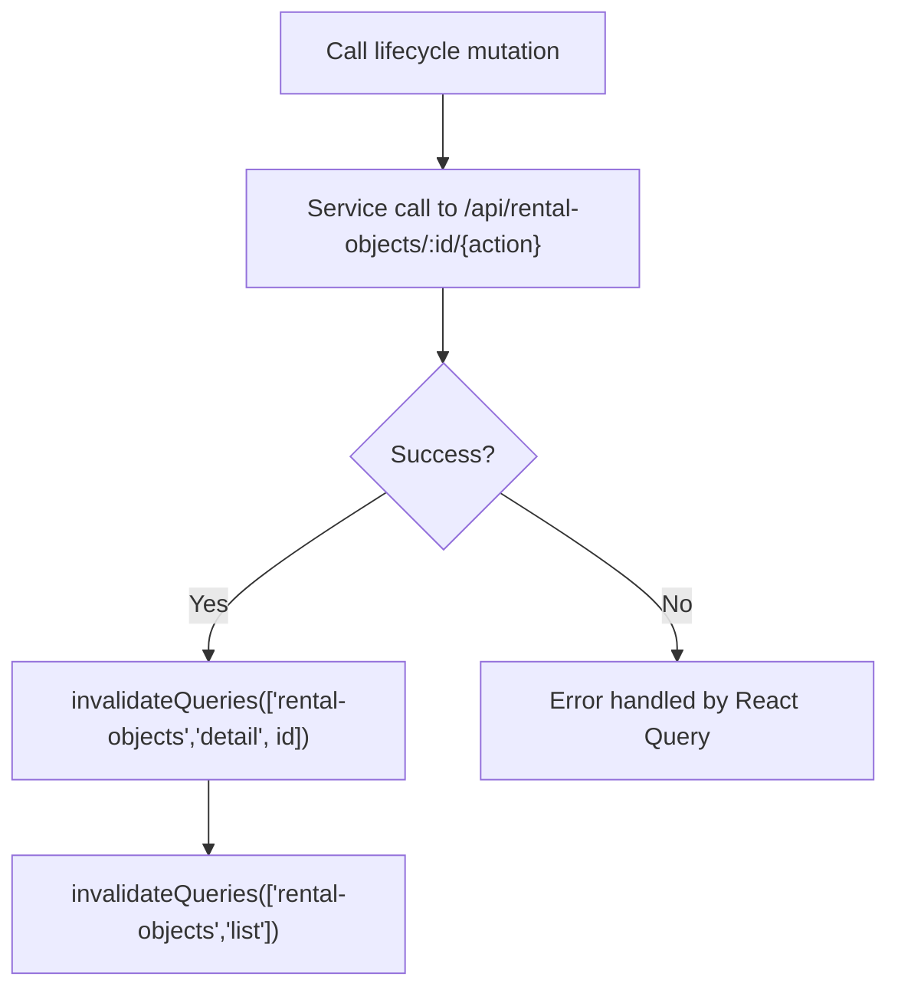

**Diagram sources**
- [use-rental-objects.ts](file://packages/client-sdk/src/hooks/use-rental-objects.ts#L182-L222)
- [rental-object.service.ts](file://packages/client-sdk/src/services/rental-object.service.ts#L125-L154)
- [rental-object.controller.ts](file://apps/api/src/modules/rental-objects/rental-object.controller.ts#L1-L201)

**Section sources**
- [use-rental-objects.ts](file://packages/client-sdk/src/hooks/use-rental-objects.ts#L182-L222)
- [rental-object.service.ts](file://packages/client-sdk/src/services/rental-object.service.ts#L125-L154)

### Availability Queries
- useRentalObjectAvailability(id, params): Fetches availability for a rental object with date range and optional duration.
- usePublicRentalObjectAvailability(id, params): Public availability endpoint.
- Both queries are enabled only when required parameters are present.

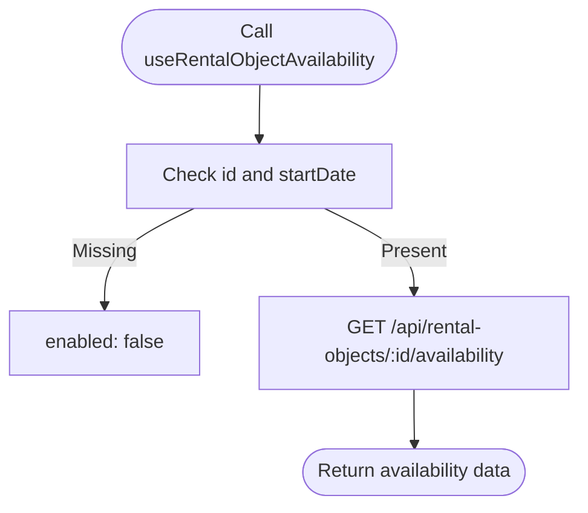

**Diagram sources**
- [use-rental-objects.ts](file://packages/client-sdk/src/hooks/use-rental-objects.ts#L260-L266)
- [use-rental-objects.ts](file://packages/client-sdk/src/hooks/use-rental-objects.ts#L340-L346)
- [rental-object.service.ts](file://packages/client-sdk/src/services/rental-object.service.ts#L195-L199)

**Section sources**
- [use-rental-objects.ts](file://packages/client-sdk/src/hooks/use-rental-objects.ts#L260-L266)
- [use-rental-objects.ts](file://packages/client-sdk/src/hooks/use-rental-objects.ts#L340-L346)
- [rental-object.service.ts](file://packages/client-sdk/src/services/rental-object.service.ts#L195-L199)

### Categories and Time Modes
- useRentalObjectCategories(): Retrieves available categories with 1-hour staleTime.
- useRentalObjectSubcategories(category): Retrieves subcategories with 1-hour staleTime.
- useBookingTimeModes(): Retrieves booking time modes with 1-hour staleTime.

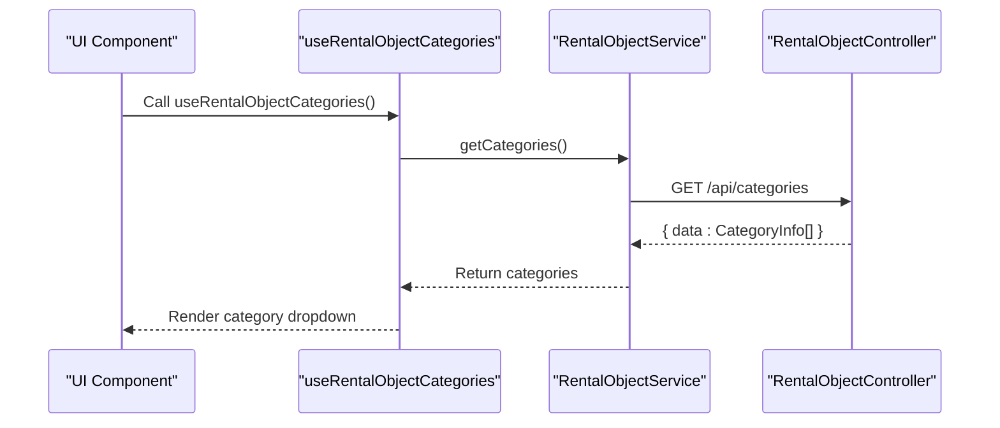

**Diagram sources**
- [use-rental-objects.ts](file://packages/client-sdk/src/hooks/use-rental-objects.ts#L111-L117)
- [use-rental-objects.ts](file://packages/client-sdk/src/hooks/use-rental-objects.ts#L122-L129)
- [use-rental-objects.ts](file://packages/client-sdk/src/hooks/use-rental-objects.ts#L293-L299)
- [rental-object.service.ts](file://packages/client-sdk/src/services/rental-object.service.ts#L174-L183)
- [rental-object.controller.ts](file://apps/api/src/modules/rental-objects/rental-object.controller.ts#L1-L201)

**Section sources**
- [use-rental-objects.ts](file://packages/client-sdk/src/hooks/use-rental-objects.ts#L111-L129)
- [use-rental-objects.ts](file://packages/client-sdk/src/hooks/use-rental-objects.ts#L293-L299)
- [rental-object.service.ts](file://packages/client-sdk/src/services/rental-object.service.ts#L174-L183)

### Media Upload Hooks
- useUploadRentalObjectMedia(): Uploads media with optional compression. Images are compressed using browser-image-compression with sensible defaults; non-image files pass through. On success, detail cache is invalidated.
- useDeleteRentalObjectMedia(): Removes media and invalidates detail cache.

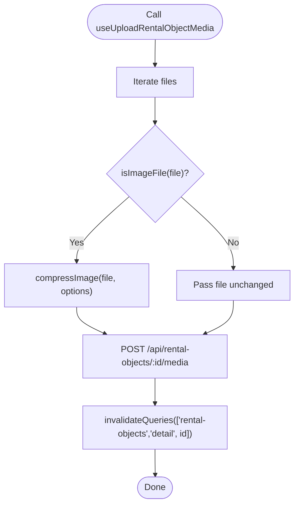

**Diagram sources**
- [use-rental-objects.ts](file://packages/client-sdk/src/hooks/use-rental-objects.ts#L405-L432)
- [image-compression.ts](file://packages/client-sdk/src/utils/image-compression.ts#L26-L50)
- [rental-object.service.ts](file://packages/client-sdk/src/services/rental-object.service.ts#L160-L162)
- [rental-object.controller.ts](file://apps/api/src/modules/rental-objects/rental-object.controller.ts#L171-L191)

**Section sources**
- [use-rental-objects.ts](file://packages/client-sdk/src/hooks/use-rental-objects.ts#L405-L448)
- [image-compression.ts](file://packages/client-sdk/src/utils/image-compression.ts#L12-L17)
- [rental-object.service.ts](file://packages/client-sdk/src/services/rental-object.service.ts#L160-L169)

### Public Endpoints
- usePublicRentalObjects(params?) and usePublicRentalObjectsList(params?): Public listing endpoints.
- usePublicRentalObject(id?) and usePublicRentalObjectBySlug(slug?): Public detail endpoints.
- usePublicRentalObjectAvailability(id, params): Public availability.
- usePublicRentalObjectCategories(), usePublicCities(), usePublicMunicipalities(), useFeaturedRentalObjects(): Public metadata and featured listings with short staleTime for freshness.

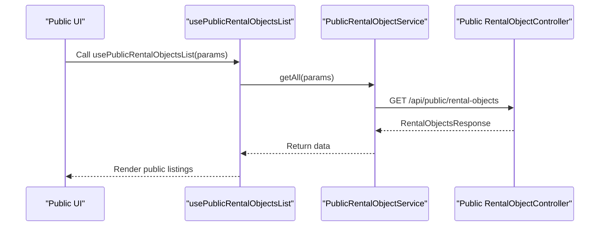

**Diagram sources**
- [use-rental-objects.ts](file://packages/client-sdk/src/hooks/use-rental-objects.ts#L308-L313)
- [use-rental-objects.ts](file://packages/client-sdk/src/hooks/use-rental-objects.ts#L318-L335)
- [use-rental-objects.ts](file://packages/client-sdk/src/hooks/use-rental-objects.ts#L340-L346)
- [use-rental-objects.ts](file://packages/client-sdk/src/hooks/use-rental-objects.ts#L351-L357)
- [use-rental-objects.ts](file://packages/client-sdk/src/hooks/use-rental-objects.ts#L362-L368)
- [use-rental-objects.ts](file://packages/client-sdk/src/hooks/use-rental-objects.ts#L384-L390)
- [rental-object.service.ts](file://packages/client-sdk/src/services/rental-object.service.ts#L229-L233)
- [rental-object.controller.ts](file://apps/api/src/modules/rental-objects/rental-object.controller.ts#L1-L201)

**Section sources**
- [use-rental-objects.ts](file://packages/client-sdk/src/hooks/use-rental-objects.ts#L308-L390)
- [rental-object.service.ts](file://packages/client-sdk/src/services/rental-object.service.ts#L229-L294)

### Pagination and Filtering Examples
- Category-based filtering: useRentalObjectsByCategory(category, params) with enabled guard.
- Slug-based lookup: useRentalObjectBySlug(slug) with enabled guard.
- Availability queries: useRentalObjectAvailability(id, { startDate, endDate, duration? }) with enabled guard.
- Public endpoints: usePublicRentalObjectsList(params) mirrors listing parameters for public consumption.
- useRentalObjectsList(options) provides a convenience wrapper that exposes data, pagination, and totals.

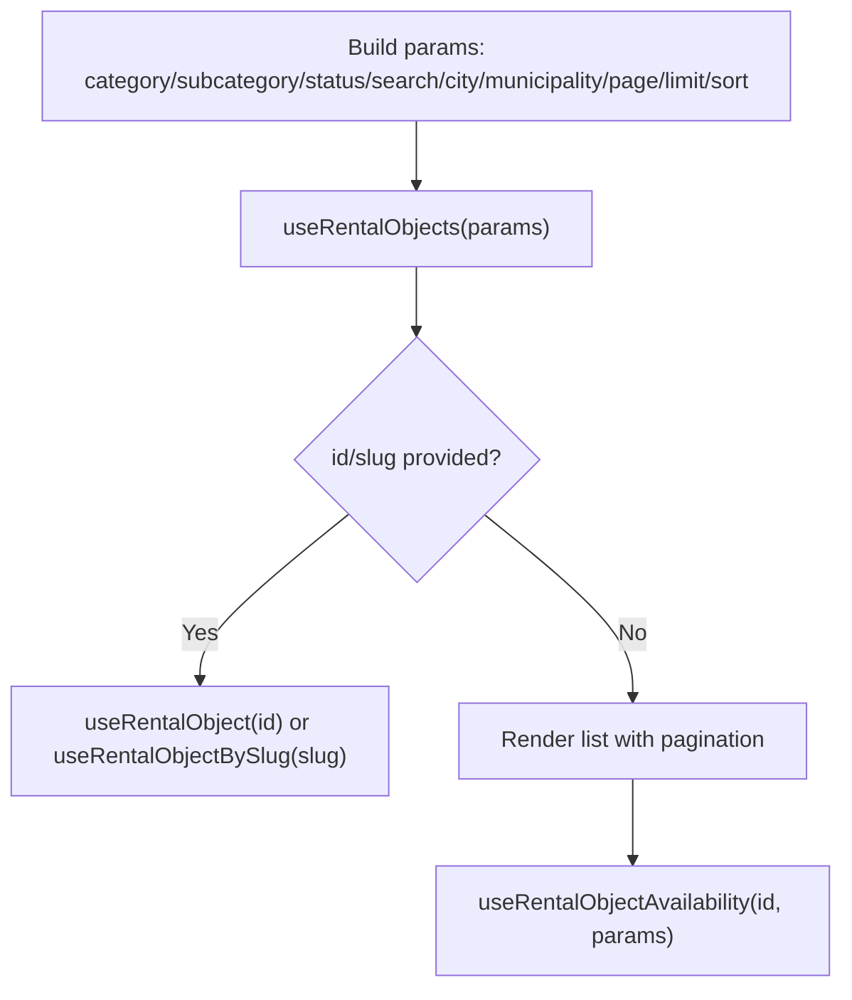

**Diagram sources**
- [use-rental-objects.ts](file://packages/client-sdk/src/hooks/use-rental-objects.ts#L57-L66)
- [use-rental-objects.ts](file://packages/client-sdk/src/hooks/use-rental-objects.ts#L96-L102)
- [use-rental-objects.ts](file://packages/client-sdk/src/hooks/use-rental-objects.ts#L260-L266)
- [use-rental-objects.ts](file://packages/client-sdk/src/hooks/use-rental-objects.ts#L461-L478)

**Section sources**
- [use-rental-objects.ts](file://packages/client-sdk/src/hooks/use-rental-objects.ts#L57-L66)
- [use-rental-objects.ts](file://packages/client-sdk/src/hooks/use-rental-objects.ts#L96-L102)
- [use-rental-objects.ts](file://packages/client-sdk/src/hooks/use-rental-objects.ts#L260-L266)
- [use-rental-objects.ts](file://packages/client-sdk/src/hooks/use-rental-objects.ts#L461-L478)

## Dependency Analysis
The hooks depend on React Query for caching and mutations, the service layer for HTTP communication, and the centralized query keys factory for cache key management. The service layer depends on the API controller and domain service.

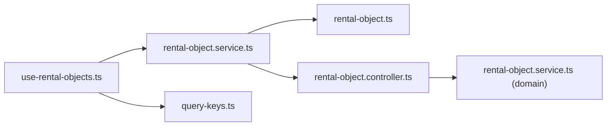

**Diagram sources**
- [use-rental-objects.ts](file://packages/client-sdk/src/hooks/use-rental-objects.ts#L1-L479)
- [rental-object.service.ts](file://packages/client-sdk/src/services/rental-object.service.ts#L1-L300)
- [query-keys.ts](file://packages/client-sdk/src/hooks/query-keys.ts#L1-L568)
- [rental-object.controller.ts](file://apps/api/src/modules/rental-objects/rental-object.controller.ts#L1-L201)
- [rental-object.service.ts](file://apps/api/src/modules/rental-objects/rental-object.service.ts#L33-L149)

**Section sources**
- [index.ts](file://packages/client-sdk/src/hooks/index.ts#L78-L111)
- [use-rental-objects.ts](file://packages/client-sdk/src/hooks/use-rental-objects.ts#L1-L479)

## Performance Considerations
- Selective query enabling: Many detail and availability hooks use enabled guards to avoid unnecessary network calls until required parameters are present.
- StaleTime for metadata: Categories, subcategories, time modes, and public metadata use staleTime to cache efficiently and reduce API load.
- Precise cache invalidation: After mutations, only the affected query keys are invalidated (detail and/or list), minimizing re-fetch overhead.
- Image compression: Media uploads optionally compress images to reduce payload size and improve upload performance.
- Pagination: Listing hooks support page and limit parameters to control data volume.

[No sources needed since this section provides general guidance]

## Troubleshooting Guide
- Query not updating after mutation: Ensure the mutation’s onSuccess invalidates the correct query keys (detail and/or list).
- Availability not loading: Confirm that id and startDate are provided; availability hooks are enabled only when required parameters are present.
- Slug-based lookup failing: Verify slug is provided and matches the backend-generated slug.
- Media upload errors: Compression failures are surfaced as upload errors; confirm file types and sizes adhere to validation rules.
- Public endpoints unauthorized: Public endpoints are designed for unauthenticated access; ensure the correct public hook is used.

**Section sources**
- [use-rental-objects.ts](file://packages/client-sdk/src/hooks/use-rental-objects.ts#L158-L161)
- [use-rental-objects.ts](file://packages/client-sdk/src/hooks/use-rental-objects.ts#L264-L266)
- [use-rental-objects.ts](file://packages/client-sdk/src/hooks/use-rental-objects.ts#L414-L422)
- [image-compression.ts](file://packages/client-sdk/src/utils/image-compression.ts#L42-L49)

## Conclusion
The rental object hooks provide a robust, cache-efficient, and developer-friendly interface for managing rental objects across the application. With structured query keys, precise invalidation, selective enabling, and built-in media compression, they support scalable UIs and reliable user experiences. Public endpoints, availability queries, and category metadata further enhance flexibility for diverse use cases.