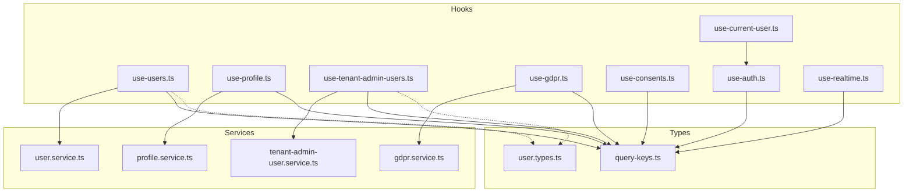
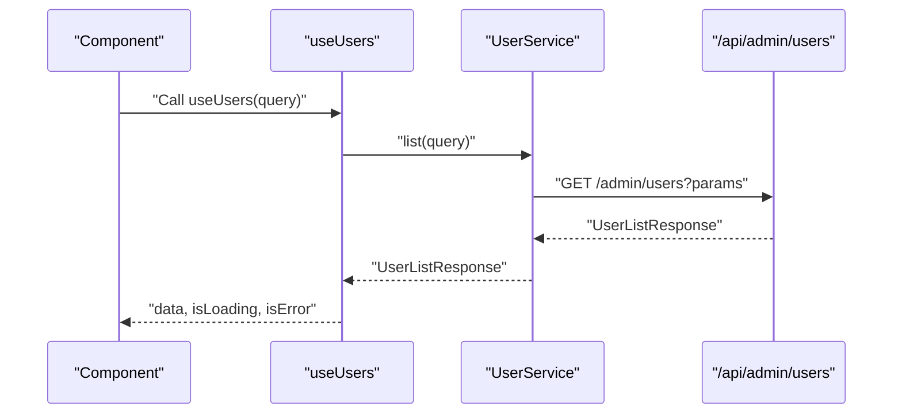
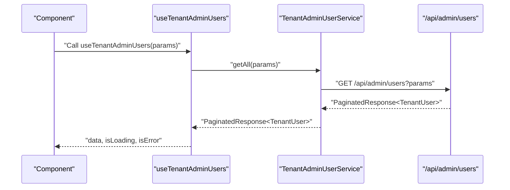
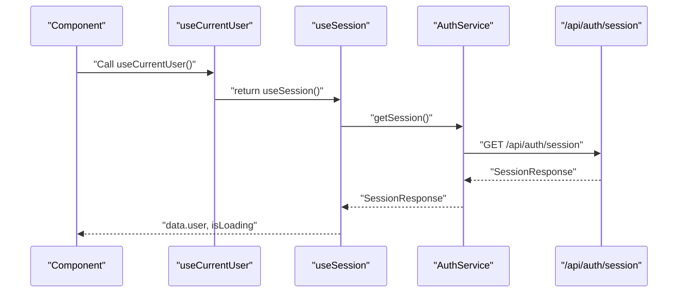
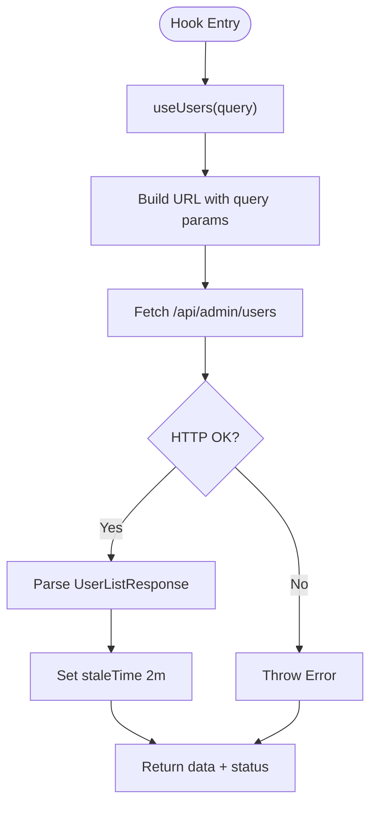
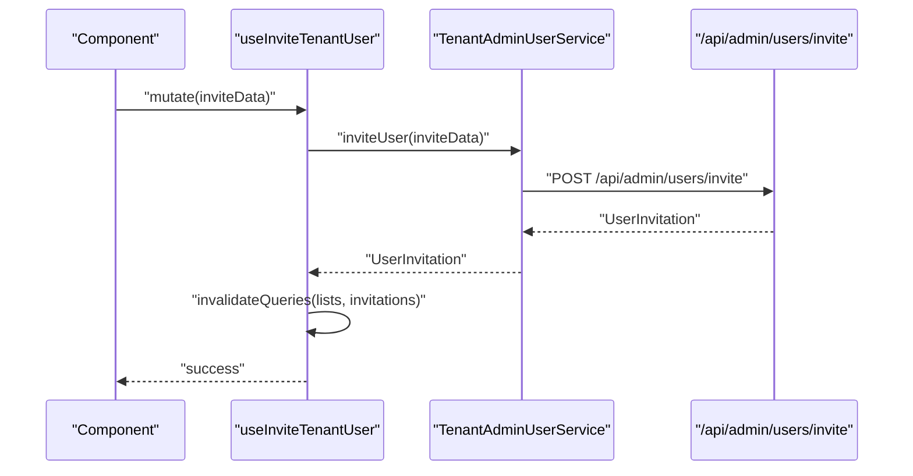
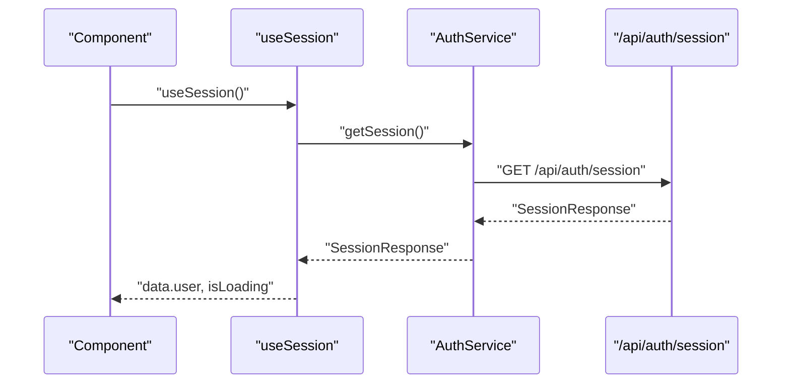
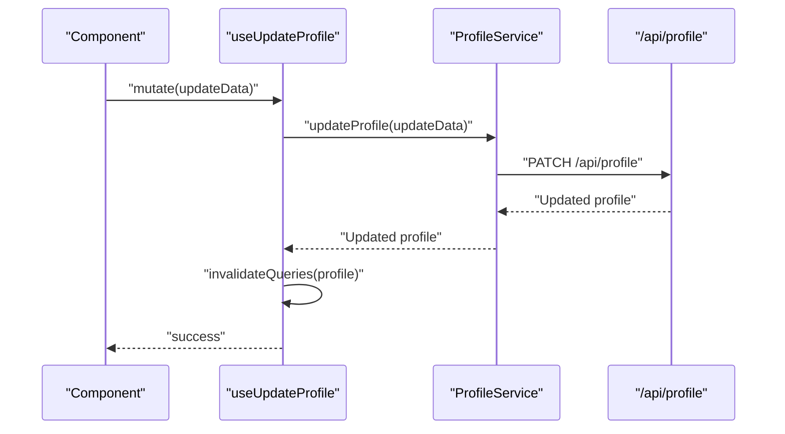
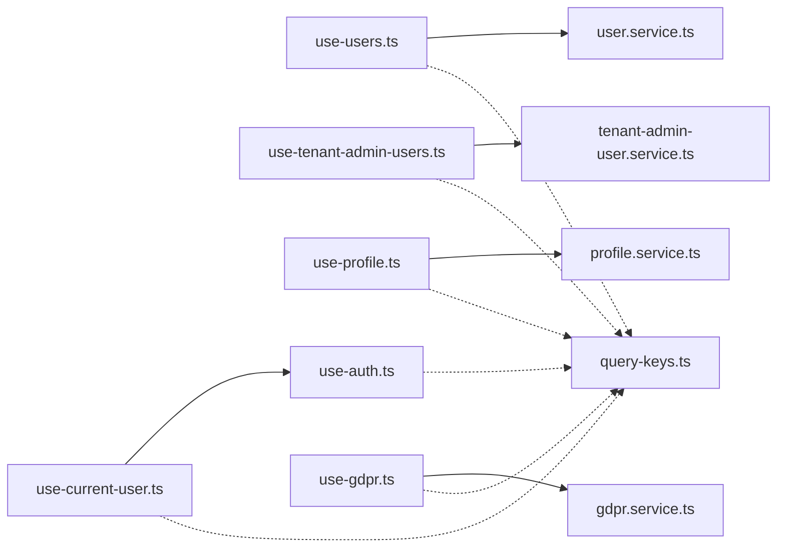

# Users Hooks

<cite>
**Referenced Files in This Document**
- [use-users.ts](file://packages/client-sdk/src/hooks/use-users.ts)
- [use-user.ts](file://packages/client-sdk/src/hooks/use-user.ts)
- [use-current-user.ts](file://packages/client-sdk/src/hooks/use-current-user.ts)
- [use-tenant-admin-users.ts](file://packages/client-sdk/src/hooks/use-tenant-admin-users.ts)
- [use-profile.ts](file://packages/client-sdk/src/hooks/use-profile.ts)
- [use-gdpr.ts](file://packages/client-sdk/src/hooks/use-gdpr.ts)
- [use-consents.ts](file://packages/client-sdk/src/hooks/use-consents.ts)
- [use-auth.ts](file://packages/client-sdk/src/hooks/use-auth.ts)
- [use-realtime.ts](file://packages/client-sdk/src/hooks/use-realtime.ts)
- [query-keys.ts](file://packages/client-sdk/src/hooks/query-keys.ts)
- [user.types.ts](file://packages/client-sdk/src/types/user.types.ts)
- [user.service.ts](file://packages/client-sdk/src/services/user.service.ts)
- [tenant-admin-user.service.ts](file://packages/client-sdk/src/services/tenant-admin-user.service.ts)
- [profile.service.ts](file://packages/client-sdk/src/services/profile.service.ts)
- [gdpr.service.ts](file://packages/client-sdk/src/services/gdpr.service.ts)
</cite>

## Table of Contents
1. [Introduction](#introduction)
2. [Project Structure](#project-structure)
3. [Core Components](#core-components)
4. [Architecture Overview](#architecture-overview)
5. [Detailed Component Analysis](#detailed-component-analysis)
6. [Dependency Analysis](#dependency-analysis)
7. [Performance Considerations](#performance-considerations)
8. [Troubleshooting Guide](#troubleshooting-guide)
9. [Conclusion](#conclusion)

## Introduction
This document provides comprehensive documentation for user-related React Query hooks across the monorepo. It focuses on:
- Admin user management hooks (useUsers, useUser, useCreateUser, useUpdateUser, useDeleteUser, and related administrative operations)
- Current user/session retrieval (useCurrentUser)
- Profile management (useProfile, useUpdateProfile)
- Tenant-admin user operations (useTenantAdminUsers, useInviteTenantUser, role/organization/scope assignments, activity logs)
- User search and filtering
- Organization membership queries
- User activity tracking
- Invitation workflows
- Preference management (stubbed)
- Authentication state and session handling
- Real-time presence indicators
- Privacy and consent management (GDPR hooks and consent stubs)

## Project Structure
The user-related hooks live in the client SDK under packages/client-sdk/src/hooks and are backed by services and types defined alongside them. Administrative user operations are primarily exposed via dedicated hooks and services, while tenant-admin scoped operations are encapsulated in separate hooks and services.

**Diagram sources**
- [use-users.ts](file://packages/client-sdk/src/hooks/use-users.ts#L1-L358)
- [use-current-user.ts](file://packages/client-sdk/src/hooks/use-current-user.ts#L1-L24)
- [use-profile.ts](file://packages/client-sdk/src/hooks/use-profile.ts#L1-L63)
- [use-tenant-admin-users.ts](file://packages/client-sdk/src/hooks/use-tenant-admin-users.ts#L1-L380)
- [use-gdpr.ts](file://packages/client-sdk/src/hooks/use-gdpr.ts#L1-L112)
- [use-consents.ts](file://packages/client-sdk/src/hooks/use-consents.ts#L1-L83)
- [use-auth.ts](file://packages/client-sdk/src/hooks/use-auth.ts#L1-L188)
- [use-realtime.ts](file://packages/client-sdk/src/hooks/use-realtime.ts#L1-L244)
- [user.service.ts](file://packages/client-sdk/src/services/user.service.ts#L1-L150)
- [tenant-admin-user.service.ts](file://packages/client-sdk/src/services/tenant-admin-user.service.ts#L1-L320)
- [profile.service.ts](file://packages/client-sdk/src/services/profile.service.ts)
- [gdpr.service.ts](file://packages/client-sdk/src/services/gdpr.service)
- [user.types.ts](file://packages/client-sdk/src/types/user.types.ts#L1-L152)
- [query-keys.ts](file://packages/client-sdk/src/hooks/query-keys.ts#L1-L568)

**Section sources**
- [use-users.ts](file://packages/client-sdk/src/hooks/use-users.ts#L1-L358)
- [use-tenant-admin-users.ts](file://packages/client-sdk/src/hooks/use-tenant-admin-users.ts#L1-L380)
- [use-profile.ts](file://packages/client-sdk/src/hooks/use-profile.ts#L1-L63)
- [use-current-user.ts](file://packages/client-sdk/src/hooks/use-current-user.ts#L1-L24)
- [use-auth.ts](file://packages/client-sdk/src/hooks/use-auth.ts#L1-L188)
- [use-gdpr.ts](file://packages/client-sdk/src/hooks/use-gdpr.ts#L1-L112)
- [use-consents.ts](file://packages/client-sdk/src/hooks/use-consents.ts#L1-L83)
- [use-realtime.ts](file://packages/client-sdk/src/hooks/use-realtime.ts#L1-L244)
- [user.types.ts](file://packages/client-sdk/src/types/user.types.ts#L1-L152)
- [user.service.ts](file://packages/client-sdk/src/services/user.service.ts#L1-L150)
- [tenant-admin-user.service.ts](file://packages/client-sdk/src/services/tenant-admin-user.service.ts#L1-L320)
- [profile.service.ts](file://packages/client-sdk/src/services/profile.service.ts)
- [gdpr.service.ts](file://packages/client-sdk/src/services/gdpr.service)
- [query-keys.ts](file://packages/client-sdk/src/hooks/query-keys.ts#L1-L568)

## Core Components
- Admin user management hooks: useUsers, useUser, useCreateUser, useUpdateUser, useDeleteUser, suspend/reinstate, assign/remove roles, bulk invite, search, and stats.
- Tenant-admin user management hooks: paginated listing, single user detail, effective permissions, activity log, invitations, role/organization/scope assignment, deactivation/reactivation/suspension, and bulk operations.
- Current user/session: useCurrentUser aliases useSession.
- Profile: useProfile and useUpdateProfile.
- Preferences: stubbed hooks useUserPreferences and useUpdateUserPreferences.
- Authentication: useSession, useLogin, useLogout, useRefreshToken, and Vipps OAuth hooks.
- Real-time: connection and event subscriptions for notifications and other domains.
- Privacy/consents: GDPR hooks and consent stubs.

**Section sources**
- [use-users.ts](file://packages/client-sdk/src/hooks/use-users.ts#L26-L358)
- [use-tenant-admin-users.ts](file://packages/client-sdk/src/hooks/use-tenant-admin-users.ts#L45-L380)
- [use-current-user.ts](file://packages/client-sdk/src/hooks/use-current-user.ts#L21-L23)
- [use-profile.ts](file://packages/client-sdk/src/hooks/use-profile.ts#L26-L63)
- [use-user.ts](file://packages/client-sdk/src/hooks/use-user.ts#L38-L157)
- [use-auth.ts](file://packages/client-sdk/src/hooks/use-auth.ts#L15-L102)
- [use-realtime.ts](file://packages/client-sdk/src/hooks/use-realtime.ts#L17-L244)
- [use-gdpr.ts](file://packages/client-sdk/src/hooks/use-gdpr.ts#L21-L112)
- [use-consents.ts](file://packages/client-sdk/src/hooks/use-consents.ts#L36-L83)

## Architecture Overview
The user management architecture separates concerns:
- Admin operations: useUsers and related mutations call the UserService, which performs HTTP requests to admin endpoints.
- Tenant-admin operations: useTenantAdminUsers and related mutations call TenantAdminUserService, which performs HTTP requests to tenant-admin endpoints.
- Current user/session: useCurrentUser delegates to useSession, which fetches the session via AuthService.
- Profile: useProfile and useUpdateProfile call ProfileService.
- Privacy: useGdpr* hooks call GdprService; consent stubs provide a placeholder until backend is ready.
- Real-time: useRealtime* hooks integrate with the realtime client to invalidate queries and update UI state.

**Diagram sources**
- [use-users.ts](file://packages/client-sdk/src/hooks/use-users.ts#L26-L37)
- [user.service.ts](file://packages/client-sdk/src/services/user.service.ts#L26-L28)

**Diagram sources**
- [use-tenant-admin-users.ts](file://packages/client-sdk/src/hooks/use-tenant-admin-users.ts#L45-L54)
- [tenant-admin-user.service.ts](file://packages/client-sdk/src/services/tenant-admin-user.service.ts#L135-L139)

**Diagram sources**
- [use-current-user.ts](file://packages/client-sdk/src/hooks/use-current-user.ts#L21-L23)
- [use-auth.ts](file://packages/client-sdk/src/hooks/use-auth.ts#L15-L22)

## Detailed Component Analysis

### Admin User Management Hooks (useUsers, useUser, useCreateUser, useUpdateUser, useDeleteUser)
- Queries:
  - useUsers: Lists users with optional filters (page, limit, search, status, role, organizationId, tenantId, sortBy, sortOrder). Uses query keys under users.lists and caches for 2 minutes.
  - useUser: Fetches a single user by ID with enabled guard and 2-minute staleness.
  - useUsersByOrganization: Lists users by organizationId.
  - useUsersByTenant: Lists users by tenantId.
  - useSearchUsers: Debounced search by term (minimum length 2) with 1-minute staleness.
  - useUserStats: Retrieves user counts by status and role.
- Mutations:
  - useCreateUser: POST /api/admin/users with error parsing and cache invalidation/invalidate of user lists and detail cache population.
  - useUpdateUser: PATCH /api/admin/users/:id with similar cache invalidation.
  - useDeleteUser: DELETE /api/admin/users/:id with cache removal.
  - useSuspendUser: PATCH /api/admin/users/:id/suspend.
  - useReinstateUser: PATCH /api/admin/users/:id/reinstate.
  - useAssignRole: POST /api/admin/users/:userId/roles.
  - useRemoveRole: DELETE /api/admin/users/:userId/roles/:roleId.
  - useBulkInviteUsers: POST /api/admin/users/invite-bulk with bulk result structure.

**Diagram sources**
- [use-users.ts](file://packages/client-sdk/src/hooks/use-users.ts#L26-L37)

**Section sources**
- [use-users.ts](file://packages/client-sdk/src/hooks/use-users.ts#L26-L358)
- [user.types.ts](file://packages/client-sdk/src/types/user.types.ts#L55-L79)
- [user.service.ts](file://packages/client-sdk/src/services/user.service.ts#L26-L134)
- [query-keys.ts](file://packages/client-sdk/src/hooks/query-keys.ts#L169-L184)

### Tenant-Admin User Management Hooks (useTenantAdminUsers, useInviteTenantUser, role/organization/scope assignments)
- Queries:
  - useTenantAdminUsers: Paginated listing with filters (role, status, organizationId, search, sortBy, sortOrder).
  - useTenantAdminUser: Detail by id with enabled guard.
  - useUserEffectivePermissions: Calculates effective permissions for a user.
  - useUserActivity: Activity log with pagination and date range filters.
  - useUserInvitations: Pending/expired invitations with pagination.
- Mutations:
  - useInviteTenantUser: Invites a user with role and optional organization.
  - useResendInvitation and useCancelInvitation: Manage invitations lifecycle.
  - useAssignUserRole: Assign role to user.
  - useAssignUserToOrganization and useRemoveUserFromOrganization: Manage organization membership.
  - useAssignUserScopes: Delegate scopes (organization/rental_object/category) with permissions.
  - useDeactivateTenantUser, useReactivateTenantUser, useSuspendUser, useUnsuspendUser: Lifecycle management.
  - Bulk operations: useBulkInviteUsers, useBulkDeactivateUsers, useBulkAssignRole.

**Diagram sources**
- [use-tenant-admin-users.ts](file://packages/client-sdk/src/hooks/use-tenant-admin-users.ts#L123-L137)
- [tenant-admin-user.service.ts](file://packages/client-sdk/src/services/tenant-admin-user.service.ts#L152-L154)

**Section sources**
- [use-tenant-admin-users.ts](file://packages/client-sdk/src/hooks/use-tenant-admin-users.ts#L45-L380)
- [tenant-admin-user.service.ts](file://packages/client-sdk/src/services/tenant-admin-user.service.ts#L19-L121)
- [query-keys.ts](file://packages/client-sdk/src/hooks/query-keys.ts#L26-L36)

### Current User and Session Management (useCurrentUser)
- useCurrentUser is an alias to useSession, returning the current authenticated user from the session query.
- useSession fetches the session with a 5-minute stale time and no retry to avoid repeated failures.
- useLogin, useEmailLogin, useLogout, useRefreshToken manage authentication state and cookie-based sessions.

**Diagram sources**
- [use-auth.ts](file://packages/client-sdk/src/hooks/use-auth.ts#L15-L22)
- [use-current-user.ts](file://packages/client-sdk/src/hooks/use-current-user.ts#L21-L23)

**Section sources**
- [use-current-user.ts](file://packages/client-sdk/src/hooks/use-current-user.ts#L21-L23)
- [use-auth.ts](file://packages/client-sdk/src/hooks/use-auth.ts#L15-L102)

### Profile Management (useProfile, useUpdateProfile)
- useProfile fetches the current user’s profile with enabled guard.
- useUpdateProfile updates the profile and invalidates profile cache.

**Diagram sources**
- [use-profile.ts](file://packages/client-sdk/src/hooks/use-profile.ts#L52-L62)
- [profile.service.ts](file://packages/client-sdk/src/services/profile.service.ts)

**Section sources**
- [use-profile.ts](file://packages/client-sdk/src/hooks/use-profile.ts#L26-L63)

### User Preferences (Stubbed)
- useUserPreferences and useUpdateUserPreferences are currently stubbed and return default values until backend endpoints are implemented.
- useDeleteAccount, useUploadUserAvatar, and useExportData are also stubbed for GDPR operations.

**Section sources**
- [use-user.ts](file://packages/client-sdk/src/hooks/use-user.ts#L38-L157)

### User Search and Filtering
- useUsers supports comprehensive filtering via ListUsersQuery (page, limit, search, status, role, organizationId, tenantId, sortBy, sortOrder).
- useSearchUsers provides debounced search with minimum term length and 1-minute staleness.

**Section sources**
- [use-users.ts](file://packages/client-sdk/src/hooks/use-users.ts#L26-L358)
- [user.types.ts](file://packages/client-sdk/src/types/user.types.ts#L69-L79)

### Organization Membership Queries
- useUsersByOrganization and useUsersByTenant enable fetching users filtered by organization or tenant identifiers.

**Section sources**
- [use-users.ts](file://packages/client-sdk/src/hooks/use-users.ts#L58-L85)

### User Activity Tracking
- useUserActivity provides paginated activity logs with optional date range filters.

**Section sources**
- [use-tenant-admin-users.ts](file://packages/client-sdk/src/hooks/use-tenant-admin-users.ts#L89-L100)

### Invitation Workflows
- useInviteTenantUser initiates invitations with role and optional organization assignment.
- useResendInvitation and useCancelInvitation manage pending invitations.
- useBulkInviteUsers supports inviting multiple users at once.

**Section sources**
- [use-tenant-admin-users.ts](file://packages/client-sdk/src/hooks/use-tenant-admin-users.ts#L123-L171)
- [tenant-admin-user.service.ts](file://packages/client-sdk/src/services/tenant-admin-user.service.ts#L152-L186)

### Role Assignments and Scope Delegation
- useAssignUserRole assigns roles scoped to the tenant-admin context.
- useAssignUserToOrganization and useRemoveUserFromOrganization manage organization membership.
- useAssignUserScopes delegates scopes (organization/rental_object/category) with associated permissions.

**Section sources**
- [use-tenant-admin-users.ts](file://packages/client-sdk/src/hooks/use-tenant-admin-users.ts#L176-L228)
- [tenant-admin-user.service.ts](file://packages/client-sdk/src/services/tenant-admin-user.service.ts#L192-L230)

### User Lifecycle Management
- useDeactivateTenantUser, useReactivateTenantUser, useSuspendUser, useUnsuspendUser handle user lifecycle states with optional reasons and expiration.

**Section sources**
- [use-tenant-admin-users.ts](file://packages/client-sdk/src/hooks/use-tenant-admin-users.ts#L251-L319)

### Real-Time Presence Indicators
- useRealtimeConnection manages WebSocket connection state.
- useRealtimeNotifications integrates with the realtime client to invalidate notification queries and update badge counts.
- While presence is not explicitly modeled, real-time event subscriptions can trigger UI updates reflecting user activity.

**Section sources**
- [use-realtime.ts](file://packages/client-sdk/src/hooks/use-realtime.ts#L17-L244)

### Data Privacy, GDPR Compliance, and Consent Management
- useGdprRequests, useGdprRequest, usePendingGdprRequests, useGdprDataExport, useCreateGdprRequest, useCancelGdprRequest, useUpdateGdprRequestStatus provide GDPR request lifecycle management.
- useConsents and useUpdateConsents are stubbed placeholders for consent preferences until backend endpoints are implemented.

**Section sources**
- [use-gdpr.ts](file://packages/client-sdk/src/hooks/use-gdpr.ts#L21-L112)
- [use-consents.ts](file://packages/client-sdk/src/hooks/use-consents.ts#L36-L83)

## Dependency Analysis
- Hook-to-Service dependencies:
  - useUsers -> UserService
  - useTenantAdminUsers -> TenantAdminUserService
  - useProfile -> ProfileService
  - useCurrentUser -> useSession -> AuthService
  - useGdpr* -> GdprService
- Query key factories centralize cache keys for consistent invalidation across hooks.
- Types define request/response shapes for all user-related operations.

**Diagram sources**
- [use-users.ts](file://packages/client-sdk/src/hooks/use-users.ts#L1-L10)
- [use-tenant-admin-users.ts](file://packages/client-sdk/src/hooks/use-tenant-admin-users.ts#L7-L20)
- [use-profile.ts](file://packages/client-sdk/src/hooks/use-profile.ts#L7-L8)
- [use-current-user.ts](file://packages/client-sdk/src/hooks/use-current-user.ts#L7-L8)
- [use-gdpr.ts](file://packages/client-sdk/src/hooks/use-gdpr.ts#L7-L8)
- [user.service.ts](file://packages/client-sdk/src/services/user.service.ts#L1-L10)
- [tenant-admin-user.service.ts](file://packages/client-sdk/src/services/tenant-admin-user.service.ts#L13-L14)
- [profile.service.ts](file://packages/client-sdk/src/services/profile.service.ts)
- [gdpr.service.ts](file://packages/client-sdk/src/services/gdpr.service)
- [query-keys.ts](file://packages/client-sdk/src/hooks/query-keys.ts#L23-L568)

**Section sources**
- [use-users.ts](file://packages/client-sdk/src/hooks/use-users.ts#L1-L10)
- [use-tenant-admin-users.ts](file://packages/client-sdk/src/hooks/use-tenant-admin-users.ts#L7-L20)
- [use-profile.ts](file://packages/client-sdk/src/hooks/use-profile.ts#L7-L8)
- [use-current-user.ts](file://packages/client-sdk/src/hooks/use-current-user.ts#L7-L8)
- [use-gdpr.ts](file://packages/client-sdk/src/hooks/use-gdpr.ts#L7-L8)
- [user.service.ts](file://packages/client-sdk/src/services/user.service.ts#L1-L10)
- [tenant-admin-user.service.ts](file://packages/client-sdk/src/services/tenant-admin-user.service.ts#L13-L14)
- [profile.service.ts](file://packages/client-sdk/src/services/profile.service.ts)
- [gdpr.service.ts](file://packages/client-sdk/src/services/gdpr.service)
- [query-keys.ts](file://packages/client-sdk/src/hooks/query-keys.ts#L23-L568)

## Performance Considerations
- Stale times:
  - Admin user listing: 2 minutes
  - Stats: 5 minutes
  - Search: 1 minute
  - Session: 5 minutes
- Debounced search prevents excessive network calls.
- Cache invalidation after mutations ensures data consistency without refetching all queries unnecessarily.
- Real-time invalidation selectively refreshes relevant query keys to minimize unnecessary re-fetches.

[No sources needed since this section provides general guidance]

## Troubleshooting Guide
- Error handling:
  - Admin user mutations parse error responses and throw descriptive errors.
  - Auth hooks surface errors from login/logout/refresh endpoints.
- Common issues:
  - Empty query keys: Ensure query keys are constructed consistently across hooks and services.
  - Cache misses: Verify staleTime and enabled guards for conditional queries.
  - Real-time disconnects: Use useRealtimeConnection to monitor connectivity and auto-reconnect settings.
- Debugging tips:
  - Inspect query keys in React Query DevTools.
  - Monitor mutation error states and network tab for failing endpoints.
  - Confirm session staleness and retry policies for auth queries.

**Section sources**
- [use-users.ts](file://packages/client-sdk/src/hooks/use-users.ts#L98-L108)
- [use-auth.ts](file://packages/client-sdk/src/hooks/use-auth.ts#L77-L84)
- [use-realtime.ts](file://packages/client-sdk/src/hooks/use-realtime.ts#L17-L41)

## Conclusion
The user-related React Query hooks provide a robust foundation for admin and tenant-admin user management, current user/session handling, profile operations, privacy controls, and real-time updates. The separation of concerns between admin and tenant-admin operations, combined with strong typing and centralized query keys, enables scalable and maintainable user experiences across applications.