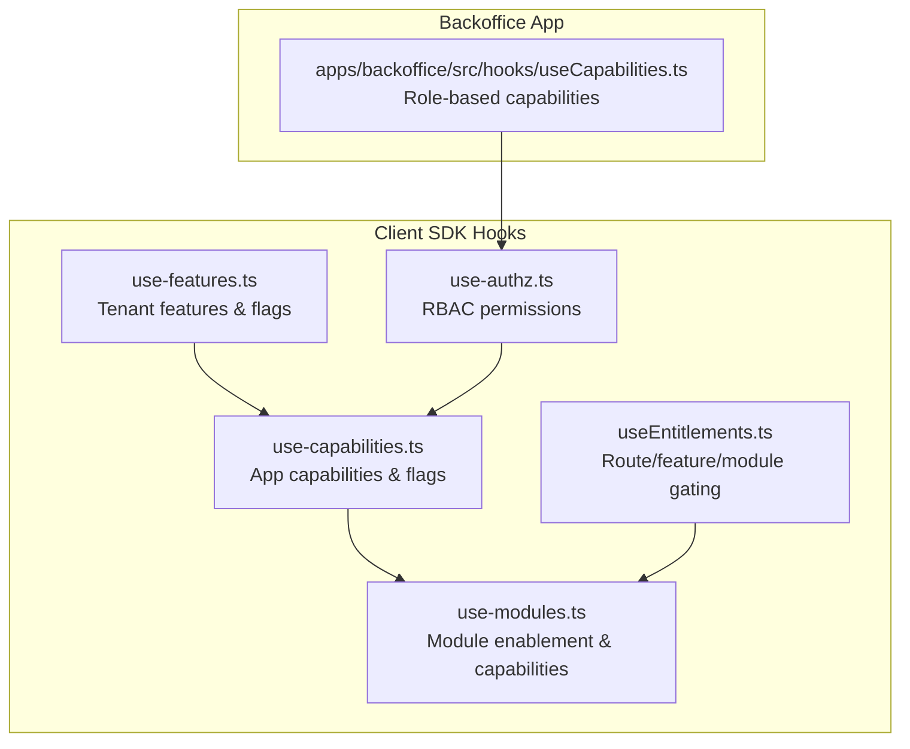
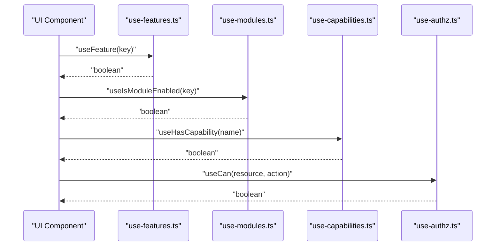
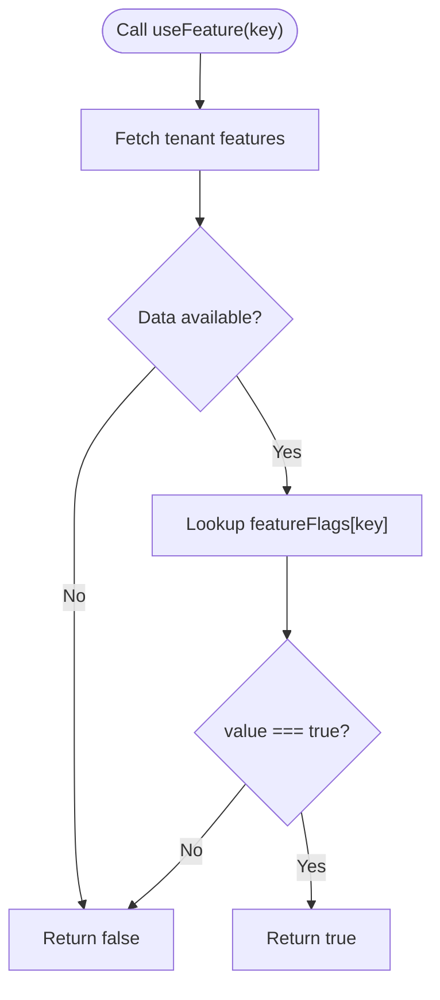
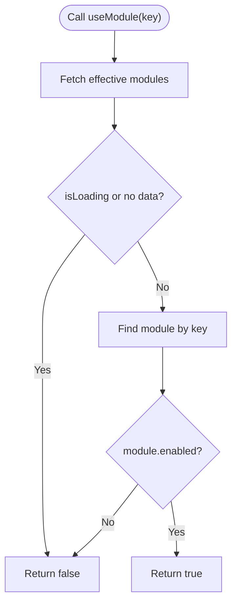
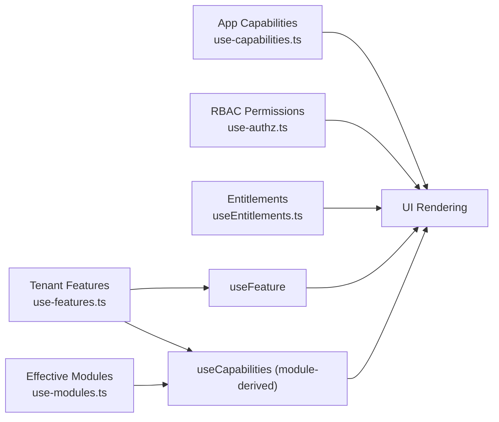

# Feature Management Hooks

<cite>
**Referenced Files in This Document**
- [packages/client-sdk/src/hooks/use-features.ts](file://packages/client-sdk/src/hooks/use-features.ts)
- [packages/client-sdk/src/hooks/use-capabilities.ts](file://packages/client-sdk/src/hooks/use-capabilities.ts)
- [packages/client-sdk/src/hooks/use-modules.ts](file://packages/client-sdk/src/hooks/use-modules.ts)
- [packages/client-sdk/src/hooks/use-authz.ts](file://packages/client-sdk/src/hooks/use-authz.ts)
- [packages/client-sdk/src/hooks/useEntitlements.ts](file://packages/client-sdk/src/hooks/useEntitlements.ts)
- [apps/backoffice/src/hooks/useCapabilities.ts](file://apps/backoffice/src/hooks/useCapabilities.ts)
- [packages/client-sdk/src/types/feature-flags.ts](file://packages/client-sdk/src/types/feature-flags.ts)
</cite>

## Table of Contents
1. [Introduction](#introduction)
2. [Project Structure](#project-structure)
3. [Core Components](#core-components)
4. [Architecture Overview](#architecture-overview)
5. [Detailed Component Analysis](#detailed-component-analysis)
6. [Dependency Analysis](#dependency-analysis)
7. [Performance Considerations](#performance-considerations)
8. [Troubleshooting Guide](#troubleshooting-guide)
9. [Conclusion](#conclusion)

## Introduction
This document explains the feature flag and capability management hooks used across the platform. It focuses on:
- useFeature and related tenant feature flags
- useFeaturesLoading for gating UI during feature data fetch
- useModule for module enablement checks
- useCapabilities for capability-based UI rendering

It also covers evaluation logic, caching behavior, conditional rendering, feature gates, and capability-based navigation filtering, along with performance implications and best practices.

## Project Structure
The feature and capability management logic spans the client SDK and app-specific hooks:
- Client SDK provides cross-app hooks for tenant features, capabilities, modules, entitlements, and RBAC checks
- App-specific hooks (e.g., backoffice) provide role-based capability evaluation

**Diagram sources**
- [packages/client-sdk/src/hooks/use-features.ts](file://packages/client-sdk/src/hooks/use-features.ts#L1-L155)
- [packages/client-sdk/src/hooks/use-capabilities.ts](file://packages/client-sdk/src/hooks/use-capabilities.ts#L1-L287)
- [packages/client-sdk/src/hooks/use-modules.ts](file://packages/client-sdk/src/hooks/use-modules.ts#L1-L214)
- [packages/client-sdk/src/hooks/useEntitlements.ts](file://packages/client-sdk/src/hooks/useEntitlements.ts#L1-L187)
- [packages/client-sdk/src/hooks/use-authz.ts](file://packages/client-sdk/src/hooks/use-authz.ts#L1-L156)
- [apps/backoffice/src/hooks/useCapabilities.ts](file://apps/backoffice/src/hooks/useCapabilities.ts#L1-L181)

**Section sources**
- [packages/client-sdk/src/hooks/use-features.ts](file://packages/client-sdk/src/hooks/use-features.ts#L1-L155)
- [packages/client-sdk/src/hooks/use-capabilities.ts](file://packages/client-sdk/src/hooks/use-capabilities.ts#L1-L287)
- [packages/client-sdk/src/hooks/use-modules.ts](file://packages/client-sdk/src/hooks/use-modules.ts#L1-L214)
- [packages/client-sdk/src/hooks/useEntitlements.ts](file://packages/client-sdk/src/hooks/useEntitlements.ts#L1-L187)
- [packages/client-sdk/src/hooks/use-authz.ts](file://packages/client-sdk/src/hooks/use-authz.ts#L1-L156)
- [apps/backoffice/src/hooks/useCapabilities.ts](file://apps/backoffice/src/hooks/useCapabilities.ts#L1-L181)

## Core Components
- useFeature: Evaluates a single feature flag from tenant features
- useFeaturesLoading: Indicates when tenant feature data is being fetched
- useModule: Checks module enablement for a given key
- useCapabilities: Checks capability availability derived from modules

These hooks rely on React Query caching and are designed for efficient conditional rendering and feature gates.

**Section sources**
- [packages/client-sdk/src/hooks/use-features.ts](file://packages/client-sdk/src/hooks/use-features.ts#L56-L59)
- [packages/client-sdk/src/hooks/use-features.ts](file://packages/client-sdk/src/hooks/use-features.ts#L119-L122)
- [packages/client-sdk/src/hooks/use-modules.ts](file://packages/client-sdk/src/hooks/use-modules.ts#L74-L80)
- [packages/client-sdk/src/hooks/use-modules.ts](file://packages/client-sdk/src/hooks/use-modules.ts#L103-L112)
- [packages/client-sdk/src/hooks/use-modules.ts](file://packages/client-sdk/src/hooks/use-modules.ts#L126-L134)

## Architecture Overview
The hooks form a layered evaluation pipeline:
- Tenant features (flags and categories) inform initial feature availability
- Module states derive capabilities for UI decisions
- App capabilities (from server) refine UI visibility and navigation
- RBAC permissions enforce resource-level access
- Entitlements provide route-level and feature-level gating

**Diagram sources**
- [packages/client-sdk/src/hooks/use-features.ts](file://packages/client-sdk/src/hooks/use-features.ts#L56-L59)
- [packages/client-sdk/src/hooks/use-modules.ts](file://packages/client-sdk/src/hooks/use-modules.ts#L103-L112)
- [packages/client-sdk/src/hooks/use-capabilities.ts](file://packages/client-sdk/src/hooks/use-capabilities.ts#L203-L215)
- [packages/client-sdk/src/hooks/use-authz.ts](file://packages/client-sdk/src/hooks/use-authz.ts#L84-L87)

## Detailed Component Analysis

### useFeature and Tenant Feature Evaluation
- Purpose: Evaluate a single feature flag for the current tenant
- Evaluation logic:
  - Fetches tenant features via a dedicated endpoint
  - Reads the feature flag from the returned object
  - Returns a boolean; defaults to false if data is unavailable
- Caching:
  - Stale time and garbage collection configured for efficient reuse
- Conditional rendering:
  - Use the returned boolean to decide whether to render a feature or redirect

**Diagram sources**
- [packages/client-sdk/src/hooks/use-features.ts](file://packages/client-sdk/src/hooks/use-features.ts#L26-L36)
- [packages/client-sdk/src/hooks/use-features.ts](file://packages/client-sdk/src/hooks/use-features.ts#L56-L59)

**Section sources**
- [packages/client-sdk/src/hooks/use-features.ts](file://packages/client-sdk/src/hooks/use-features.ts#L15-L36)
- [packages/client-sdk/src/hooks/use-features.ts](file://packages/client-sdk/src/hooks/use-features.ts#L56-L59)
- [packages/client-sdk/src/hooks/use-features.ts](file://packages/client-sdk/src/hooks/use-features.ts#L119-L122)

### useFeaturesLoading
- Purpose: Gate UI while tenant feature data is loading
- Behavior: Delegates to the underlying query’s loading state
- Usage: Render a skeleton or fallback until loading completes

**Section sources**
- [packages/client-sdk/src/hooks/use-features.ts](file://packages/client-sdk/src/hooks/use-features.ts#L119-L122)

### useModule and Module Enablement
- Purpose: Determine if a module is enabled for the current tenant
- Evaluation logic:
  - Fetch effective modules for the tenant
  - Find the module by key and return its enabled state
  - Defaults to false while loading or if data is missing
- Caching:
  - Short stale time to balance freshness and performance
- Conditional rendering:
  - Use the boolean to show/hide module-specific UI

**Diagram sources**
- [packages/client-sdk/src/hooks/use-modules.ts](file://packages/client-sdk/src/hooks/use-modules.ts#L61-L67)
- [packages/client-sdk/src/hooks/use-modules.ts](file://packages/client-sdk/src/hooks/use-modules.ts#L103-L112)

**Section sources**
- [packages/client-sdk/src/hooks/use-modules.ts](file://packages/client-sdk/src/hooks/use-modules.ts#L74-L80)
- [packages/client-sdk/src/hooks/use-modules.ts](file://packages/client-sdk/src/hooks/use-modules.ts#L103-L112)

### useCapabilities (Module-derived)
- Purpose: Check if a capability is available based on enabled modules
- Evaluation logic:
  - Fetch effective modules
  - Read capabilities from the resolved state
  - Return boolean for the requested capability
- Conditional rendering:
  - Use to filter navigation items or render capability-dependent sections

**Section sources**
- [packages/client-sdk/src/hooks/use-modules.ts](file://packages/client-sdk/src/hooks/use-modules.ts#L126-L134)
- [packages/client-sdk/src/hooks/use-modules.ts](file://packages/client-sdk/src/hooks/use-modules.ts#L148-L151)

### App-Specific Capabilities Hooks
- useCapabilities (Backoffice):
  - Evaluates role-based capabilities and exposes helper methods
  - Provides imperative checks and grouped capability queries
- useHasCapability/useHasAllCapabilities/useHasAnyCapability:
  - Convenience wrappers around the main hook for quick checks

**Section sources**
- [apps/backoffice/src/hooks/useCapabilities.ts](file://apps/backoffice/src/hooks/useCapabilities.ts#L129-L180)

### App-Capabilities and Feature Flags (Server-Driven)
- useWebCapabilities/useMinsideCapabilities/useBackofficeCapabilities:
  - Fetch app-specific capabilities and UI hints
  - Include feature flags and navigation hints per app context
- useHasCapability/useHasAllCapability/useHasAnyCapability:
  - Check if the current user has specific capability(s)
- useFeatureFlag:
  - Retrieve a specific feature flag value for the app context

**Section sources**
- [packages/client-sdk/src/hooks/use-capabilities.ts](file://packages/client-sdk/src/hooks/use-capabilities.ts#L84-L96)
- [packages/client-sdk/src/hooks/use-capabilities.ts](file://packages/client-sdk/src/hooks/use-capabilities.ts#L120-L137)
- [packages/client-sdk/src/hooks/use-capabilities.ts](file://packages/client-sdk/src/hooks/use-capabilities.ts#L164-L180)
- [packages/client-sdk/src/hooks/use-capabilities.ts](file://packages/client-sdk/src/hooks/use-capabilities.ts#L203-L215)
- [packages/client-sdk/src/hooks/use-capabilities.ts](file://packages/client-sdk/src/hooks/use-capabilities.ts#L224-L237)
- [packages/client-sdk/src/hooks/use-capabilities.ts](file://packages/client-sdk/src/hooks/use-capabilities.ts#L246-L259)
- [packages/client-sdk/src/hooks/use-capabilities.ts](file://packages/client-sdk/src/hooks/use-capabilities.ts#L268-L280)

### RBAC Permissions (useCan, usePermissions)
- usePermissions: Fetch current user permissions
- useCheckPermission: Check a specific resource-action permission
- useCan: Simplified boolean for conditional rendering
- useHasAnyPermission/useHasAllPermissions: Bulk permission checks
- useRole: Get effective role
- useInvalidatePermissions: Invalidate cached permissions

**Section sources**
- [packages/client-sdk/src/hooks/use-authz.ts](file://packages/client-sdk/src/hooks/use-authz.ts#L31-L38)
- [packages/client-sdk/src/hooks/use-authz.ts](file://packages/client-sdk/src/hooks/use-authz.ts#L57-L68)
- [packages/client-sdk/src/hooks/use-authz.ts](file://packages/client-sdk/src/hooks/use-authz.ts#L84-L87)
- [packages/client-sdk/src/hooks/use-authz.ts](file://packages/client-sdk/src/hooks/use-authz.ts#L121-L145)
- [packages/client-sdk/src/hooks/use-authz.ts](file://packages/client-sdk/src/hooks/use-authz.ts#L100-L107)
- [packages/client-sdk/src/hooks/use-authz.ts](file://packages/client-sdk/src/hooks/use-authz.ts#L150-L155)

### Entitlements-Based Gating
- useEntitlements: Fetch effective entitlements including routes, features, modules, integrations
- useCanRoute/useCanFeature/useCanModule: Gate routes and features
- useIntegrationStatus: Check integration enablement and configuration status
- RouteGuard/FeatureGuard: Component-level guards for route and feature access

**Section sources**
- [packages/client-sdk/src/hooks/useEntitlements.ts](file://packages/client-sdk/src/hooks/useEntitlements.ts#L46-L66)
- [packages/client-sdk/src/hooks/useEntitlements.ts](file://packages/client-sdk/src/hooks/useEntitlements.ts#L71-L90)
- [packages/client-sdk/src/hooks/useEntitlements.ts](file://packages/client-sdk/src/hooks/useEntitlements.ts#L95-L108)
- [packages/client-sdk/src/hooks/useEntitlements.ts](file://packages/client-sdk/src/hooks/useEntitlements.ts#L139-L186)

## Dependency Analysis
- useFeature depends on tenant features data
- useModule depends on effective modules data
- useCapabilities (module-derived) depends on module states
- App capabilities hooks depend on server-provided capabilities and UI hints
- RBAC hooks depend on backend-permission checks
- Entitlements hooks provide an additional layer of route/feature gating

**Diagram sources**
- [packages/client-sdk/src/hooks/use-features.ts](file://packages/client-sdk/src/hooks/use-features.ts#L26-L36)
- [packages/client-sdk/src/hooks/use-modules.ts](file://packages/client-sdk/src/hooks/use-modules.ts#L61-L67)
- [packages/client-sdk/src/hooks/use-capabilities.ts](file://packages/client-sdk/src/hooks/use-capabilities.ts#L84-L96)
- [packages/client-sdk/src/hooks/use-authz.ts](file://packages/client-sdk/src/hooks/use-authz.ts#L31-L38)
- [packages/client-sdk/src/hooks/useEntitlements.ts](file://packages/client-sdk/src/hooks/useEntitlements.ts#L46-L66)

**Section sources**
- [packages/client-sdk/src/hooks/use-features.ts](file://packages/client-sdk/src/hooks/use-features.ts#L1-L155)
- [packages/client-sdk/src/hooks/use-modules.ts](file://packages/client-sdk/src/hooks/use-modules.ts#L1-L214)
- [packages/client-sdk/src/hooks/use-capabilities.ts](file://packages/client-sdk/src/hooks/use-capabilities.ts#L1-L287)
- [packages/client-sdk/src/hooks/use-authz.ts](file://packages/client-sdk/src/hooks/use-authz.ts#L1-L156)
- [packages/client-sdk/src/hooks/useEntitlements.ts](file://packages/client-sdk/src/hooks/useEntitlements.ts#L1-L187)

## Performance Considerations
- Caching strategy:
  - Tenant features and capabilities use short stale times to keep data fresh without excessive network requests
  - Modules and entitlements similarly leverage caching to reduce load
- Conditional fetching:
  - useModule enables the query only when a key is present, avoiding unnecessary requests
- Memoization:
  - Backoffice useCapabilities memoizes computed capability sets to prevent re-computation on renders
- UI responsiveness:
  - useFeaturesLoading allows rendering skeletons while data is being fetched
- Best practices:
  - Prefer capability-based hooks for UI decisions to minimize client-side logic
  - Use feature flags sparingly for non-critical UI toggles
  - Combine module enablement and app capabilities for robust feature gating
  - Invalidate caches appropriately after role or entitlement changes

[No sources needed since this section provides general guidance]

## Troubleshooting Guide
- Feature flags appear stale:
  - Verify staleTime/gcTime settings and ensure cache invalidation occurs on relevant events
- Capability checks return unexpected results:
  - Confirm the effective modules and app capabilities are loaded before evaluating
- RBAC permission mismatches:
  - Use usePermissions and useCheckPermission to debug; confirm resource/action correctness
- Entitlement-based guards not working:
  - Ensure useEntitlements is loaded and that route/feature keys match server expectations
- Authentication-related capability failures:
  - App capabilities hooks may reject retries on 401; handle redirects or re-authentication accordingly

**Section sources**
- [packages/client-sdk/src/hooks/use-capabilities.ts](file://packages/client-sdk/src/hooks/use-capabilities.ts#L120-L137)
- [packages/client-sdk/src/hooks/use-capabilities.ts](file://packages/client-sdk/src/hooks/use-capabilities.ts#L164-L180)
- [packages/client-sdk/src/hooks/use-authz.ts](file://packages/client-sdk/src/hooks/use-authz.ts#L150-L155)
- [packages/client-sdk/src/hooks/useEntitlements.ts](file://packages/client-sdk/src/hooks/useEntitlements.ts#L114-L134)

## Conclusion
The feature and capability management hooks provide a cohesive, layered approach to controlling UI behavior:
- Tenant features and flags offer broad feature availability
- Module enablement drives capability derivation
- App capabilities refine UI visibility and navigation
- RBAC ensures resource-level access control
- Entitlements add route-level and feature-level gating

Adopting these hooks consistently improves maintainability, performance, and security across applications.