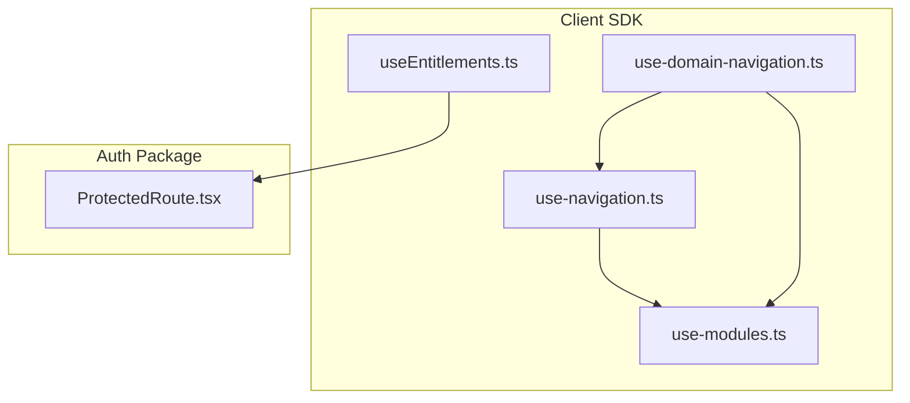
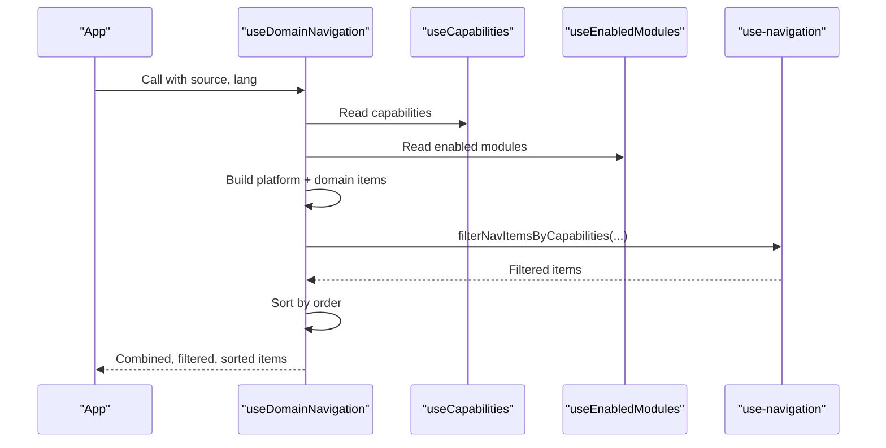
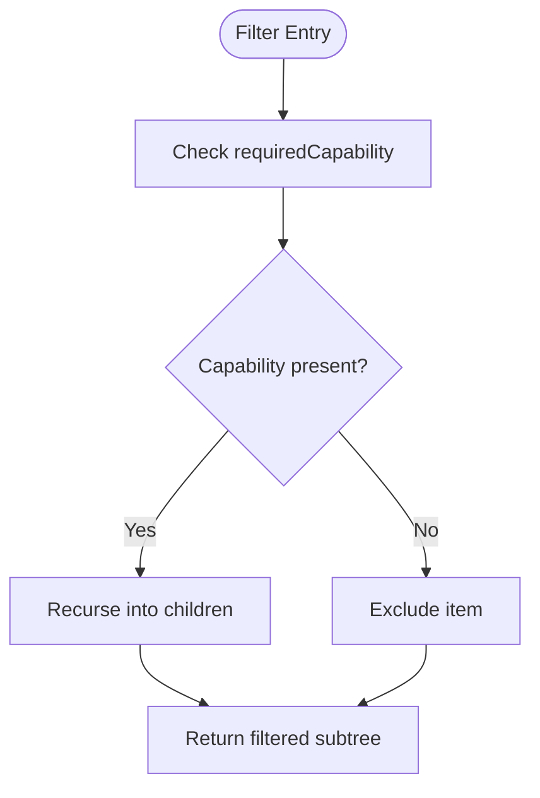
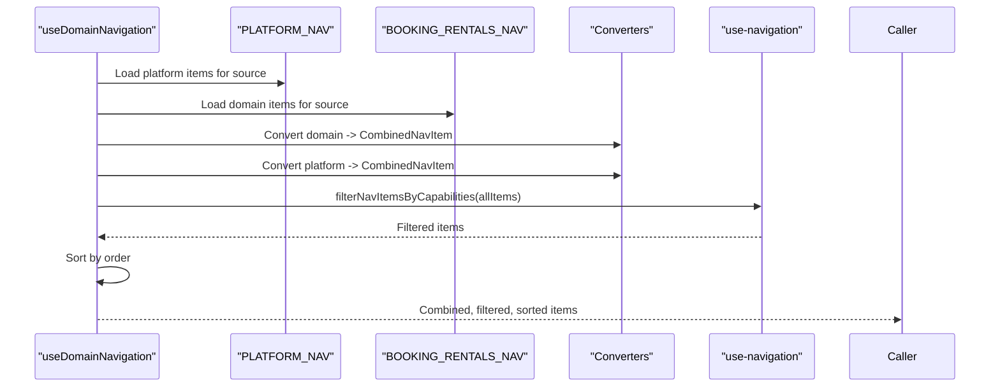
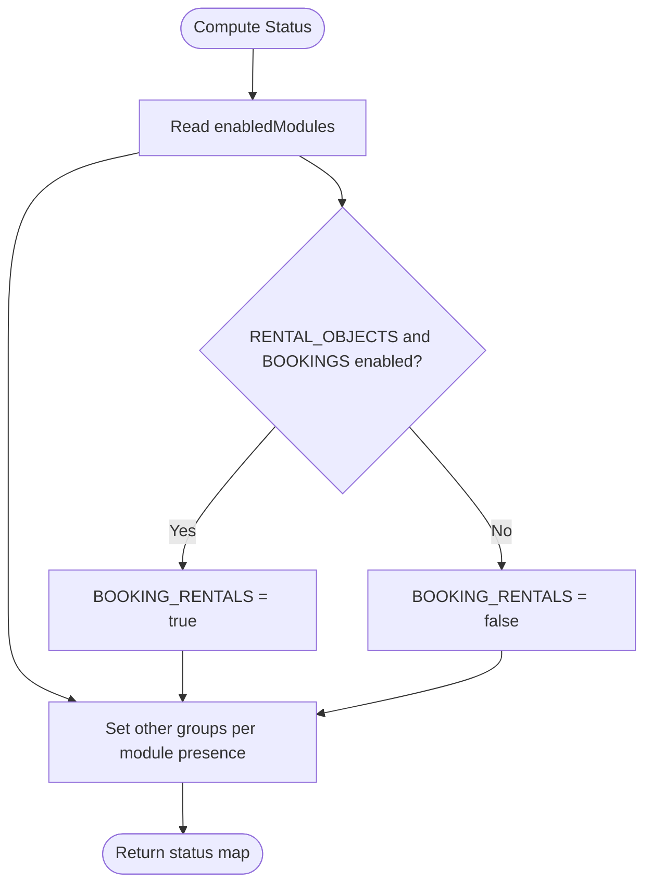
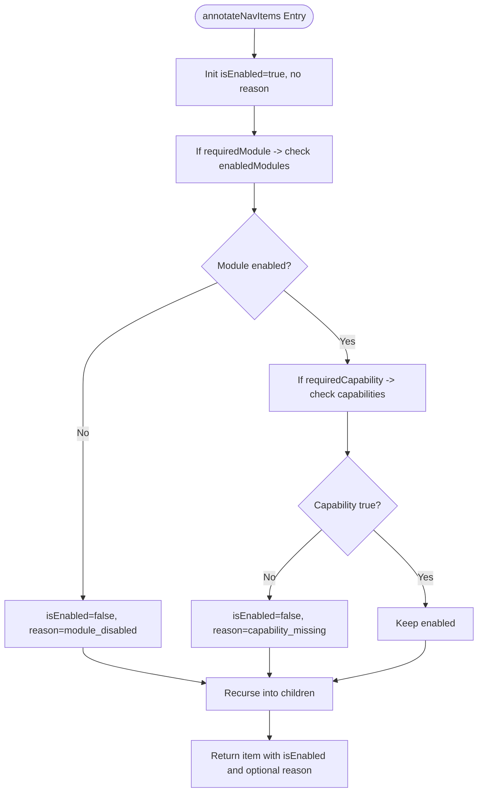
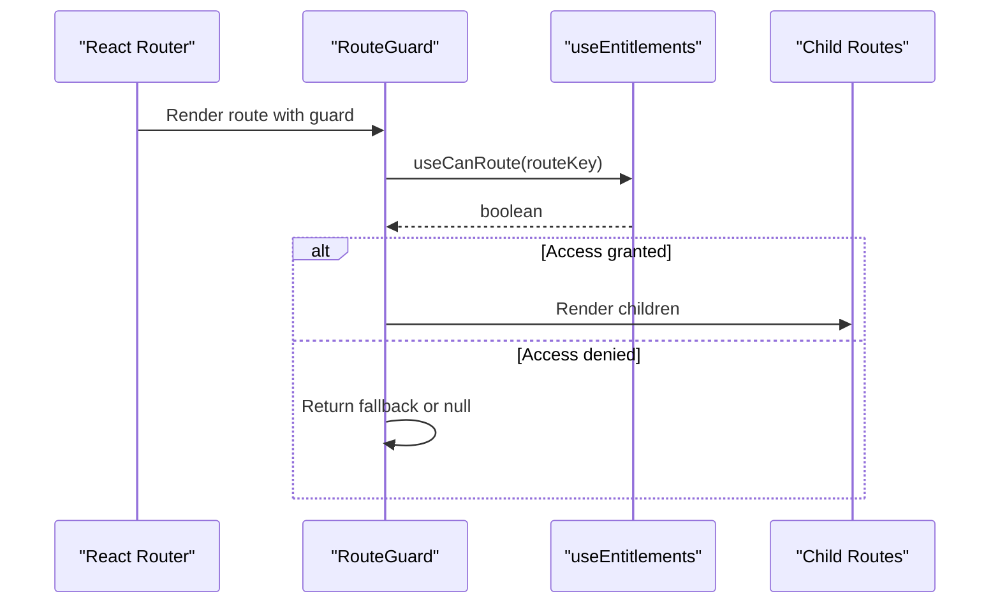
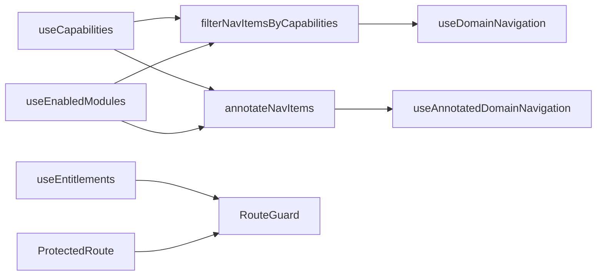

# Navigation & Routing Hooks

<cite>
**Referenced Files in This Document**
- [use-navigation.ts](file://packages/client-sdk/src/hooks/use-navigation.ts)
- [use-domain-navigation.ts](file://packages/client-sdk/src/hooks/use-domain-navigation.ts)
- [use-modules.ts](file://packages/client-sdk/src/hooks/use-modules.ts)
- [useEntitlements.ts](file://packages/client-sdk/src/hooks/useEntitlements.ts)
- [ProtectedRoute.tsx](file://packages/auth/src/components/ProtectedRoute.tsx)
</cite>

## Table of Contents
1. [Introduction](#introduction)
2. [Project Structure](#project-structure)
3. [Core Components](#core-components)
4. [Architecture Overview](#architecture-overview)
5. [Detailed Component Analysis](#detailed-component-analysis)
6. [Dependency Analysis](#dependency-analysis)
7. [Performance Considerations](#performance-considerations)
8. [Troubleshooting Guide](#troubleshooting-guide)
9. [Conclusion](#conclusion)

## Introduction
This document explains the navigation and routing hooks that power capability-based navigation filtering, domain-aware routing, and dynamic menu construction across the monorepo’s frontend applications. It focuses on:
- Filtering navigation items by capability and module enablement
- Building domain-aware navigation menus from platform core and domain contributions
- Annotating items to indicate why they are disabled
- Integrating with entitlements and route protection
- Practical examples for conditional menu items, navigation guards, and route protection

## Project Structure
The navigation and routing logic spans several packages:
- Navigation utilities and domain navigation live in the client SDK package
- Module state and capabilities are exposed via module hooks
- Route protection and entitlements are provided by the auth and client SDK packages respectively

**Diagram sources**
- [use-navigation.ts](file://packages/client-sdk/src/hooks/use-navigation.ts#L1-L144)
- [use-domain-navigation.ts](file://packages/client-sdk/src/hooks/use-domain-navigation.ts#L1-L262)
- [use-modules.ts](file://packages/client-sdk/src/hooks/use-modules.ts#L1-L214)
- [useEntitlements.ts](file://packages/client-sdk/src/hooks/useEntitlements.ts#L1-L187)
- [ProtectedRoute.tsx](file://packages/auth/src/components/ProtectedRoute.tsx#L37-L74)

**Section sources**
- [use-navigation.ts](file://packages/client-sdk/src/hooks/use-navigation.ts#L1-L144)
- [use-domain-navigation.ts](file://packages/client-sdk/src/hooks/use-domain-navigation.ts#L1-L262)
- [use-modules.ts](file://packages/client-sdk/src/hooks/use-modules.ts#L1-L214)
- [useEntitlements.ts](file://packages/client-sdk/src/hooks/useEntitlements.ts#L1-L187)
- [ProtectedRoute.tsx](file://packages/auth/src/components/ProtectedRoute.tsx#L37-L74)

## Core Components
- useFilteredNavItems: Filters a static navigation tree by capability requirements
- useAnnotatedNavItems: Same as above but annotates items with enablement status and reasons
- useDomainNavigation: Builds a domain-aware navigation tree by combining platform core and domain contributions, then filters by capabilities
- useAnnotatedDomainNavigation: Same as above but annotates items
- useCapabilities and useEnabledModules: Provide reactive capability and module enablement data used by filtering logic
- useEntitlements and RouteGuard: Provide route-level protection and conditional rendering based on entitlements

**Section sources**
- [use-navigation.ts](file://packages/client-sdk/src/hooks/use-navigation.ts#L128-L143)
- [use-domain-navigation.ts](file://packages/client-sdk/src/hooks/use-domain-navigation.ts#L172-L226)
- [use-modules.ts](file://packages/client-sdk/src/hooks/use-modules.ts#L148-L160)
- [useEntitlements.ts](file://packages/client-sdk/src/hooks/useEntitlements.ts#L46-L160)

## Architecture Overview
The navigation pipeline integrates capability/module state with domain contributions and platform core navigation to produce a filtered, ordered, and annotated menu for each application.

**Diagram sources**
- [use-domain-navigation.ts](file://packages/client-sdk/src/hooks/use-domain-navigation.ts#L172-L196)
- [use-navigation.ts](file://packages/client-sdk/src/hooks/use-navigation.ts#L42-L61)
- [use-modules.ts](file://packages/client-sdk/src/hooks/use-modules.ts#L148-L160)

## Detailed Component Analysis

### useFilteredNavItems and useAnnotatedNavItems
These hooks apply capability-based filtering to a static navigation tree:
- useFilteredNavItems returns only items whose required capability is present
- useAnnotatedNavItems additionally marks items with enablement status and reasons (e.g., missing capability)

**Diagram sources**
- [use-navigation.ts](file://packages/client-sdk/src/hooks/use-navigation.ts#L42-L61)

**Section sources**
- [use-navigation.ts](file://packages/client-sdk/src/hooks/use-navigation.ts#L128-L143)

### useDomainNavigation and useAnnotatedDomainNavigation
These hooks construct a domain-aware navigation tree:
- Combine platform core items with domain contributions (e.g., BOOKING_RENTALS)
- Convert domain items to the unified CombinedNavItem format
- Filter by capabilities and sort by order
- useAnnotatedDomainNavigation additionally annotates items with enablement status and reasons

**Diagram sources**
- [use-domain-navigation.ts](file://packages/client-sdk/src/hooks/use-domain-navigation.ts#L172-L196)
- [use-navigation.ts](file://packages/client-sdk/src/hooks/use-navigation.ts#L42-L61)

**Section sources**
- [use-domain-navigation.ts](file://packages/client-sdk/src/hooks/use-domain-navigation.ts#L172-L226)

### Domain Group Status and Conditional Menus
Domain groups are computed from enabled modules to support conditional menu sections:
- useDomainGroupStatus computes booleans for groups like CORE, BOOKING_RENTALS, COMMUNICATION, ECONOMY, etc.
- useIsDomainGroupEnabled exposes a boolean for a given group

**Diagram sources**
- [use-domain-navigation.ts](file://packages/client-sdk/src/hooks/use-domain-navigation.ts#L233-L251)

**Section sources**
- [use-domain-navigation.ts](file://packages/client-sdk/src/hooks/use-domain-navigation.ts#L233-L261)

### Capability-Based Filtering Internals
- filterNavItemsByCapabilities: Pure function that recursively filters items by capability
- annotateNavItems: Same recursion with enablement annotation and reasons

**Diagram sources**
- [use-navigation.ts](file://packages/client-sdk/src/hooks/use-navigation.ts#L67-L101)

**Section sources**
- [use-navigation.ts](file://packages/client-sdk/src/hooks/use-navigation.ts#L42-L101)

### Integration with React Router and Route Protection
- useEntitlements provides route permissions and navigation items keyed by application
- RouteGuard protects routes by checking entitlements before rendering children
- ProtectedRoute provides a component wrapper for route protection with flexible redirects and callbacks

**Diagram sources**
- [useEntitlements.ts](file://packages/client-sdk/src/hooks/useEntitlements.ts#L139-L160)
- [ProtectedRoute.tsx](file://packages/auth/src/components/ProtectedRoute.tsx#L61-L74)

**Section sources**
- [useEntitlements.ts](file://packages/client-sdk/src/hooks/useEntitlements.ts#L139-L187)
- [ProtectedRoute.tsx](file://packages/auth/src/components/ProtectedRoute.tsx#L37-L74)

## Dependency Analysis
- use-navigation depends on useCapabilities for capability data
- use-domain-navigation depends on useCapabilities and useEnabledModules, and composes use-navigation’s filtering
- useEntitlements provides route-level protection and application-specific navigation items
- ProtectedRoute integrates with authentication and optional role checks

**Diagram sources**
- [use-navigation.ts](file://packages/client-sdk/src/hooks/use-navigation.ts#L6-L12)
- [use-domain-navigation.ts](file://packages/client-sdk/src/hooks/use-domain-navigation.ts#L9-L12)
- [use-modules.ts](file://packages/client-sdk/src/hooks/use-modules.ts#L9-L12)
- [useEntitlements.ts](file://packages/client-sdk/src/hooks/useEntitlements.ts#L6-L8)
- [ProtectedRoute.tsx](file://packages/auth/src/components/ProtectedRoute.tsx#L72-L74)

**Section sources**
- [use-navigation.ts](file://packages/client-sdk/src/hooks/use-navigation.ts#L6-L12)
- [use-domain-navigation.ts](file://packages/client-sdk/src/hooks/use-domain-navigation.ts#L9-L12)
- [use-modules.ts](file://packages/client-sdk/src/hooks/use-modules.ts#L9-L12)
- [useEntitlements.ts](file://packages/client-sdk/src/hooks/useEntitlements.ts#L6-L8)
- [ProtectedRoute.tsx](file://packages/auth/src/components/ProtectedRoute.tsx#L72-L74)

## Performance Considerations
- Memoization: useDomainNavigation and useAnnotatedDomainNavigation wrap computations in useMemo to avoid re-filtering on every render
- Stale times: useEntitlements and module queries use conservative stale/gc times to balance freshness and performance
- Pure filtering functions: filterNavItemsByCapabilities and annotateNavItems are pure and can be reused outside React contexts

[No sources needed since this section provides general guidance]

## Troubleshooting Guide
- Items not appearing in the menu:
  - Verify the required capability exists in the capabilities map returned by useCapabilities
  - Confirm the module enabling the capability is present in enabled modules
- Disabled items with upgrade prompts:
  - Use useAnnotatedNavItems or useAnnotatedDomainNavigation to inspect disabledReason
- Route protection failures:
  - Ensure useEntitlements is loaded and useCanRoute returns true for the target route
  - Confirm ProtectedRoute or RouteGuard is wrapping the intended route

**Section sources**
- [use-navigation.ts](file://packages/client-sdk/src/hooks/use-navigation.ts#L67-L101)
- [use-domain-navigation.ts](file://packages/client-sdk/src/hooks/use-domain-navigation.ts#L204-L226)
- [useEntitlements.ts](file://packages/client-sdk/src/hooks/useEntitlements.ts#L71-L74)
- [ProtectedRoute.tsx](file://packages/auth/src/components/ProtectedRoute.tsx#L72-L74)

## Conclusion
The navigation and routing hooks provide a robust, capability-driven system for building dynamic menus and protecting routes. By combining platform core navigation with domain contributions, annotating items for visibility, and integrating with entitlements and route guards, applications can deliver secure, context-aware user experiences across the monorepo.