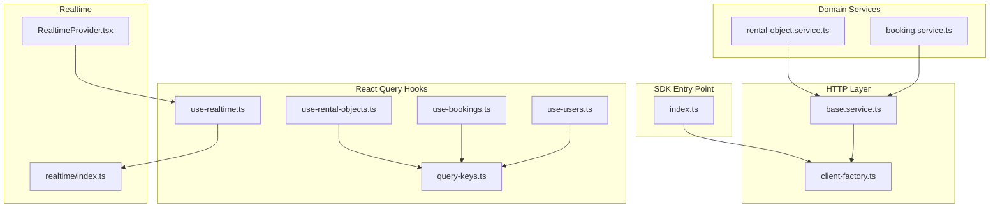
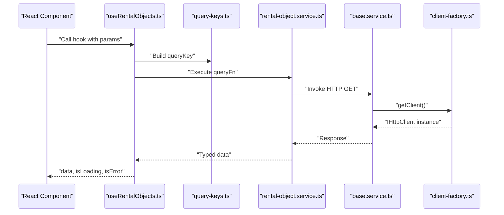
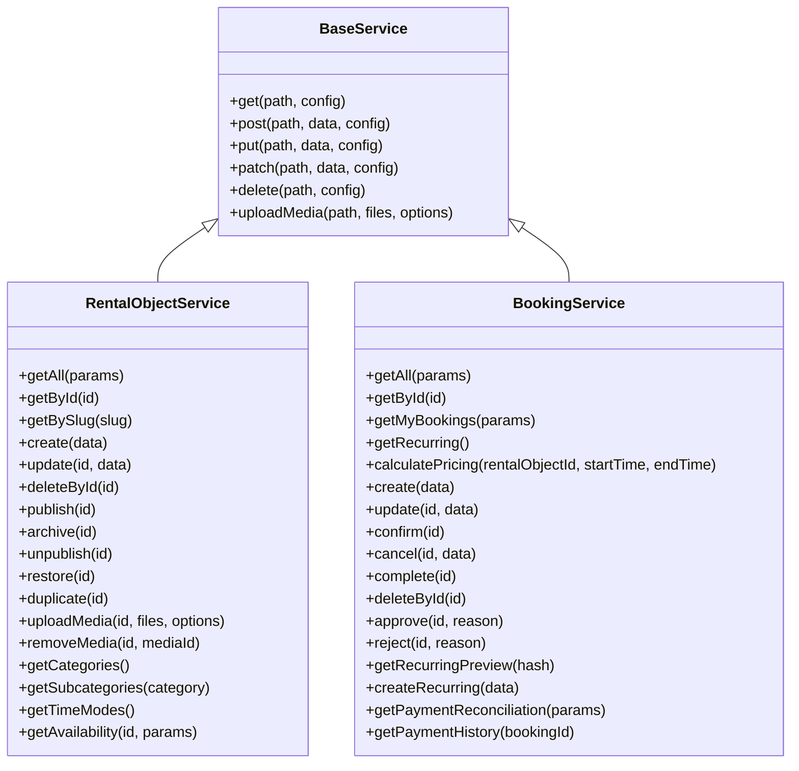
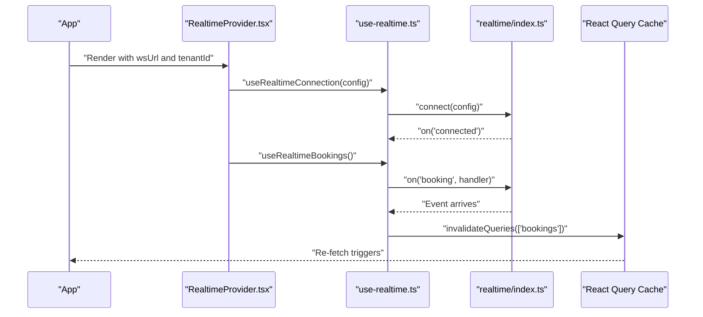
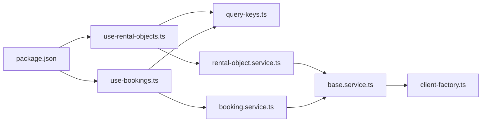

# React Query Integration

<cite>
**Referenced Files in This Document**
- [index.ts](file://packages/client-sdk/src/index.ts)
- [client-factory.ts](file://packages/client-sdk/src/core/client-factory.ts)
- [base.service.ts](file://packages/client-sdk/src/services/base.service.ts)
- [rental-object.service.ts](file://packages/client-sdk/src/services/rental-object.service.ts)
- [booking.service.ts](file://packages/client-sdk/src/services/booking.service.ts)
- [query-keys.ts](file://packages/client-sdk/src/hooks/query-keys.ts)
- [use-rental-objects.ts](file://packages/client-sdk/src/hooks/use-rental-objects.ts)
- [use-bookings.ts](file://packages/client-sdk/src/hooks/use-bookings.ts)
- [use-users.ts](file://packages/client-sdk/src/hooks/use-users.ts)
- [use-realtime.ts](file://packages/client-sdk/src/hooks/use-realtime.ts)
- [RealtimeProvider.tsx](file://packages/client-sdk/src/providers/RealtimeProvider.tsx)
- [realtime/index.ts](file://packages/client-sdk/src/realtime/index.ts)
- [package.json](file://packages/client-sdk/package.json)
</cite>

## Table of Contents
1. [Introduction](#introduction)
2. [Project Structure](#project-structure)
3. [Core Components](#core-components)
4. [Architecture Overview](#architecture-overview)
5. [Detailed Component Analysis](#detailed-component-analysis)
6. [Dependency Analysis](#dependency-analysis)
7. [Performance Considerations](#performance-considerations)
8. [Troubleshooting Guide](#troubleshooting-guide)
9. [Conclusion](#conclusion)

## Introduction
This document explains how the Client SDK integrates React Query to deliver a robust, type-safe, and efficient data fetching layer for the Digilist API. It covers the hook-based API design, automatic caching and invalidation, query key management, optimistic update patterns, background refetching, and cache invalidation strategies. It also documents the relationship between hooks and underlying services, practical usage patterns, and considerations for performance, memory, and SSR.

## Project Structure
The Client SDK exposes:
- A typed HTTP client factory for API initialization and configuration
- A base service class that encapsulates HTTP requests and media uploads
- A comprehensive set of React Query hooks grouped by domain entities
- A centralized query key factory for strong typing and cache invalidation
- Real-time WebSocket integration with automatic cache invalidation
- Optional providers for real-time context and status

**Diagram sources**
- [index.ts](file://packages/client-sdk/src/index.ts#L1-L168)
- [client-factory.ts](file://packages/client-sdk/src/core/client-factory.ts#L1-L114)
- [base.service.ts](file://packages/client-sdk/src/services/base.service.ts#L1-L100)
- [rental-object.service.ts](file://packages/client-sdk/src/services/rental-object.service.ts#L1-L300)
- [booking.service.ts](file://packages/client-sdk/src/services/booking.service.ts#L1-L200)
- [query-keys.ts](file://packages/client-sdk/src/hooks/query-keys.ts#L1-L568)
- [use-rental-objects.ts](file://packages/client-sdk/src/hooks/use-rental-objects.ts#L1-L479)
- [use-bookings.ts](file://packages/client-sdk/src/hooks/use-bookings.ts#L1-L356)
- [use-users.ts](file://packages/client-sdk/src/hooks/use-users.ts#L1-L358)
- [use-realtime.ts](file://packages/client-sdk/src/hooks/use-realtime.ts#L1-L244)
- [RealtimeProvider.tsx](file://packages/client-sdk/src/providers/RealtimeProvider.tsx#L1-L98)
- [realtime/index.ts](file://packages/client-sdk/src/realtime/index.ts#L1-L296)

**Section sources**
- [index.ts](file://packages/client-sdk/src/index.ts#L1-L168)
- [client-factory.ts](file://packages/client-sdk/src/core/client-factory.ts#L1-L114)
- [base.service.ts](file://packages/client-sdk/src/services/base.service.ts#L1-L100)
- [query-keys.ts](file://packages/client-sdk/src/hooks/query-keys.ts#L1-L568)

## Core Components
- HTTP client factory: Initializes and manages a shared HTTP client, supports token and tenant updates, and exposes helpers to check initialization and mock mode.
- Base service: Encapsulates HTTP verbs and media upload logic, building URLs from a base path resolved via the client factory.
- Domain services: Typed wrappers around the base service for domains like rental objects and bookings.
- React Query hooks: Query and mutation hooks per domain, using strongly-typed query keys and integrating with React Query’s cache.
- Query keys: Centralized factory for query keys enabling precise cache invalidation and prefetching.
- Realtime integration: WebSocket client and hooks that automatically invalidate caches upon receiving domain events.

**Section sources**
- [client-factory.ts](file://packages/client-sdk/src/core/client-factory.ts#L1-L114)
- [base.service.ts](file://packages/client-sdk/src/services/base.service.ts#L1-L100)
- [rental-object.service.ts](file://packages/client-sdk/src/services/rental-object.service.ts#L1-L300)
- [booking.service.ts](file://packages/client-sdk/src/services/booking.service.ts#L1-L200)
- [query-keys.ts](file://packages/client-sdk/src/hooks/query-keys.ts#L1-L568)
- [use-rental-objects.ts](file://packages/client-sdk/src/hooks/use-rental-objects.ts#L1-L479)
- [use-bookings.ts](file://packages/client-sdk/src/hooks/use-bookings.ts#L1-L356)
- [use-realtime.ts](file://packages/client-sdk/src/hooks/use-realtime.ts#L1-L244)
- [realtime/index.ts](file://packages/client-sdk/src/realtime/index.ts#L1-L296)

## Architecture Overview
The SDK follows a layered architecture:
- Entry point exports services, hooks, and providers
- Hooks depend on query keys and domain services
- Services depend on the base service and the HTTP client
- Realtime hooks subscribe to WebSocket events and invalidate caches

**Diagram sources**
- [use-rental-objects.ts](file://packages/client-sdk/src/hooks/use-rental-objects.ts#L47-L52)
- [query-keys.ts](file://packages/client-sdk/src/hooks/query-keys.ts#L81-L92)
- [rental-object.service.ts](file://packages/client-sdk/src/services/rental-object.service.ts#L70-L75)
- [base.service.ts](file://packages/client-sdk/src/services/base.service.ts#L29-L32)
- [client-factory.ts](file://packages/client-sdk/src/core/client-factory.ts#L27-L34)

## Detailed Component Analysis

### Hook-based API Design and Query Keys
- Hooks expose useQuery/useMutation from React Query and accept parameters that become part of the query key.
- Query keys are strongly typed and hierarchical, enabling precise cache scopes and invalidation.
- Many hooks set staleTime to balance freshness and performance.

Examples:
- useRentalObjects: list with params → queryKey under rentalObjects.list
- useRentalObject: detail by id → queryKey under rentalObjects.detail(id)
- useBookings: list with params → queryKey under bookings.list
- useBooking: detail by id → queryKey under bookings.detail(id)

**Section sources**
- [use-rental-objects.ts](file://packages/client-sdk/src/hooks/use-rental-objects.ts#L47-L52)
- [use-bookings.ts](file://packages/client-sdk/src/hooks/use-bookings.ts#L29-L34)
- [query-keys.ts](file://packages/client-sdk/src/hooks/query-keys.ts#L81-L92)

### Automatic Caching and Background Refetching
- React Query manages caching automatically; staleTime controls when data is considered stale.
- enabled flags prevent unnecessary network calls until required parameters are present.
- Background refetching occurs when tabs become visible, focus returns, or cache becomes stale depending on React Query defaults.

Practical implications:
- Prefer enabled flags for dependent queries (e.g., detail hooks require an id).
- Use staleTime to reduce network load for infrequently changing data (e.g., categories).

**Section sources**
- [use-rental-objects.ts](file://packages/client-sdk/src/hooks/use-rental-objects.ts#L85-L91)
- [use-bookings.ts](file://packages/client-sdk/src/hooks/use-bookings.ts#L39-L45)

### Query Key Management
The query keys factory centralizes cache keys by domain and scope. Examples:
- Auth: session, providers, permissions
- Economy: invoice bases, sales documents, credit notes, statistics
- Search: results, typeahead, recent, saved filters
- Rental Objects: list, detail, slug, availability, stats, calendar config
- Bookings: list, detail, my, recurring, pricing, payment reconciliation, payment history
- Calendar: events, slots, config, availability matrix
- Users: list, detail, me, consents, by organization/tenant, stats, search
- Favorites, Pricing, Conversations, Reports, Audit, Notifications, Push Notifications, Discount Codes, Reviews, RBAC, Access Grants, Permission Assignments, Case Handler Scopes, Org Memberships, Settings, Integrations, SaaS Admin, Tenant Admin, Security, Widgets, Monitoring, GDPR, Features

Benefits:
- Strongly typed keys prevent cache collisions
- Hierarchical keys enable targeted invalidation
- Shared factory ensures consistency across hooks

**Section sources**
- [query-keys.ts](file://packages/client-sdk/src/hooks/query-keys.ts#L23-L567)

### Optimistic Updates and Cache Invalidation Strategies
- Mutations commonly invalidate related query keys to reflect server-side changes.
- Some mutations use setQueryData to optimistically update the cache before confirming server responses.
- Realtime hooks automatically invalidate caches on domain events, ensuring UI stays synchronized.

Patterns:
- useCreateRentalObject: invalidates lists
- useUpdateRentalObject: invalidates detail and lists
- useCreateBooking/useUpdateBooking/useCancelBooking: invalidates bookings and calendar
- useRealtimeBookings/useRealtimeRentalObjects: invalidates relevant caches on events

**Section sources**
- [use-rental-objects.ts](file://packages/client-sdk/src/hooks/use-rental-objects.ts#L138-L177)
- [use-bookings.ts](file://packages/client-sdk/src/hooks/use-bookings.ts#L81-L170)
- [use-users.ts](file://packages/client-sdk/src/hooks/use-users.ts#L94-L200)
- [use-realtime.ts](file://packages/client-sdk/src/hooks/use-realtime.ts#L47-L86)

### Relationship Between Hooks and Underlying Services
- Hooks call domain services (e.g., rental-object.service.ts, booking.service.ts).
- Services extend BaseService, which resolves the HTTP client via the client factory.
- BaseService builds paths and performs HTTP operations, while services add domain-specific logic.

**Diagram sources**
- [base.service.ts](file://packages/client-sdk/src/services/base.service.ts#L1-L100)
- [rental-object.service.ts](file://packages/client-sdk/src/services/rental-object.service.ts#L62-L300)
- [booking.service.ts](file://packages/client-sdk/src/services/booking.service.ts#L1-L200)

### Practical Hook Usage Patterns
- Lists: useRentalObjects(params) and useBookings(params) return data, isLoading, isError, and pagination metadata.
- Details: useRentalObject(id) and useBooking(id) fetch single entities; enabled guards avoid requests when id is missing.
- Mutations: useCreateRentalObject, useUpdateRentalObject, useDeleteRentalObject trigger cache invalidations.
- Realtime: useRealtimeConnection and RealtimeProvider enable automatic cache invalidation on events.

Integration tips:
- Wrap your app with RealtimeProvider to enable tenant-scoped subscriptions and auto-invalidation.
- Use enabled flags for dependent queries to avoid unnecessary network calls.
- Leverage staleTime for infrequent updates to reduce network overhead.

**Section sources**
- [use-rental-objects.ts](file://packages/client-sdk/src/hooks/use-rental-objects.ts#L47-L52)
- [use-bookings.ts](file://packages/client-sdk/src/hooks/use-bookings.ts#L29-L34)
- [RealtimeProvider.tsx](file://packages/client-sdk/src/providers/RealtimeProvider.tsx#L47-L90)

### Realtime Integration and Cache Synchronization
- RealtimeProvider connects to WebSocket and subscribes to domain events.
- useRealtimeBookings, useRealtimeRentalObjects, useRealtimeCalendar, useRealtimeMessages, useRealtimeNotifications automatically invalidate caches on events.
- useRealtimeConnection exposes connection status and supports reconnection policies.

**Diagram sources**
- [RealtimeProvider.tsx](file://packages/client-sdk/src/providers/RealtimeProvider.tsx#L47-L90)
- [use-realtime.ts](file://packages/client-sdk/src/hooks/use-realtime.ts#L17-L64)
- [realtime/index.ts](file://packages/client-sdk/src/realtime/index.ts#L39-L101)

**Section sources**
- [RealtimeProvider.tsx](file://packages/client-sdk/src/providers/RealtimeProvider.tsx#L1-L98)
- [use-realtime.ts](file://packages/client-sdk/src/hooks/use-realtime.ts#L1-L244)
- [realtime/index.ts](file://packages/client-sdk/src/realtime/index.ts#L1-L296)

## Dependency Analysis
- Peer dependencies: React Query, React, and React Router are peer dependencies, allowing host apps to control versions.
- Internal dependencies: Hooks depend on query keys and services; services depend on the base service and the HTTP client factory.
- Realtime hooks depend on the singleton realtime client and React Query’s useQueryClient.

**Diagram sources**
- [package.json](file://packages/client-sdk/package.json#L44-L75)
- [use-rental-objects.ts](file://packages/client-sdk/src/hooks/use-rental-objects.ts#L1-L479)
- [use-bookings.ts](file://packages/client-sdk/src/hooks/use-bookings.ts#L1-L356)
- [query-keys.ts](file://packages/client-sdk/src/hooks/query-keys.ts#L1-L568)
- [rental-object.service.ts](file://packages/client-sdk/src/services/rental-object.service.ts#L1-L300)
- [booking.service.ts](file://packages/client-sdk/src/services/booking.service.ts#L1-L200)
- [base.service.ts](file://packages/client-sdk/src/services/base.service.ts#L1-L100)
- [client-factory.ts](file://packages/client-sdk/src/core/client-factory.ts#L1-L114)

**Section sources**
- [package.json](file://packages/client-sdk/package.json#L44-L75)

## Performance Considerations
- Stale time: Configure staleTime for infrequent data (e.g., categories) to reduce network usage.
- enabled flags: Prevent unnecessary requests for dependent queries until required parameters are available.
- Targeted invalidation: Invalidate only affected query keys (lists vs. detail) to minimize refetches.
- Image compression: Media upload hooks optionally compress images to reduce payload sizes.
- Realtime invalidation: Automatic cache invalidation reduces stale data risk without manual polling.

[No sources needed since this section provides general guidance]

## Troubleshooting Guide
Common issues and resolutions:
- Client not initialized: Ensure initializeClient is called before using hooks or services. The client factory throws if accessed without initialization.
- Missing parameters: Detail hooks require ids; use enabled flags to guard requests.
- Authentication failures: Use setAuthToken or updateClientConfig to set tokens; ensure tenantId is configured when required.
- Realtime disconnections: useRealtimeConnection supports autoReconnect and configurable intervals; verify wsUrl and tenantId.
- Cache misses: Verify query keys match between hooks and invalidations; ensure hierarchical keys are used consistently.

**Section sources**
- [client-factory.ts](file://packages/client-sdk/src/core/client-factory.ts#L17-L34)
- [use-rental-objects.ts](file://packages/client-sdk/src/hooks/use-rental-objects.ts#L85-L91)
- [use-bookings.ts](file://packages/client-sdk/src/hooks/use-bookings.ts#L39-L45)
- [use-realtime.ts](file://packages/client-sdk/src/hooks/use-realtime.ts#L17-L41)

## Conclusion
The Client SDK’s React Query integration delivers a type-safe, cache-aware, and real-time-enabled data layer. By leveraging strongly-typed query keys, targeted invalidation, and automatic cache synchronization via WebSockets, applications gain responsive UX with minimal boilerplate. The layered design keeps services cohesive and hooks composable, supporting scalable development across domains like rentals, bookings, users, and more.