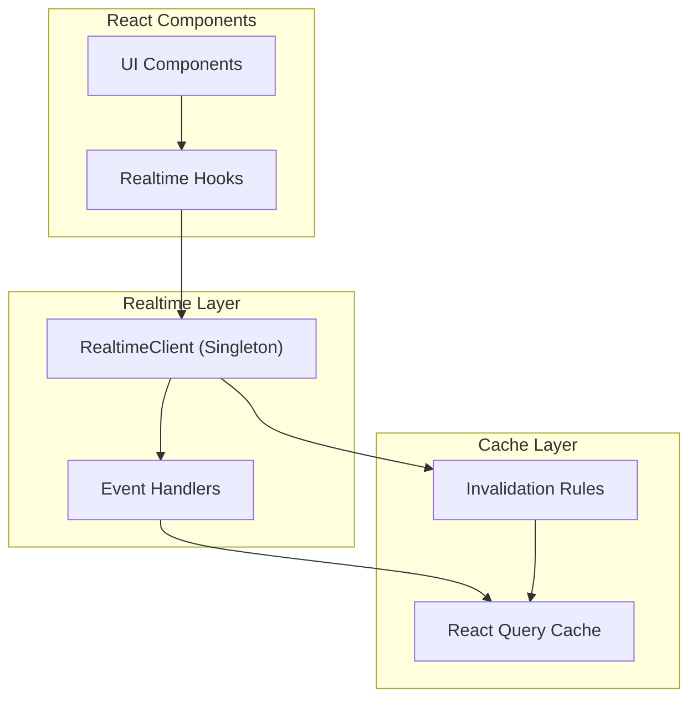
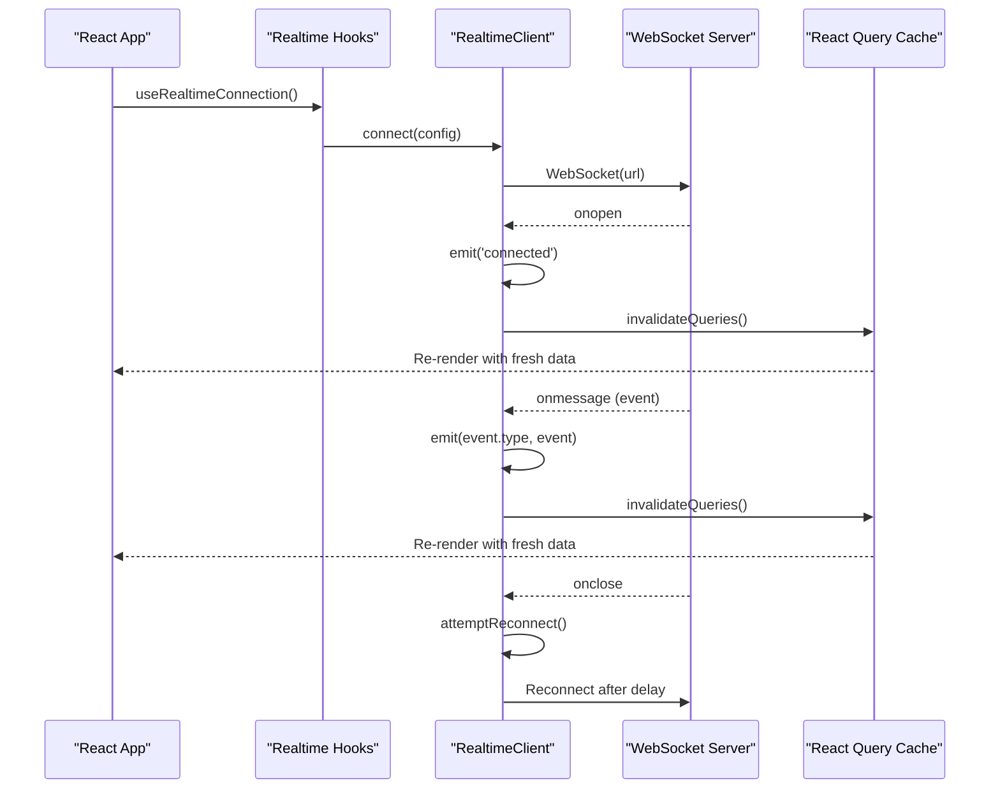
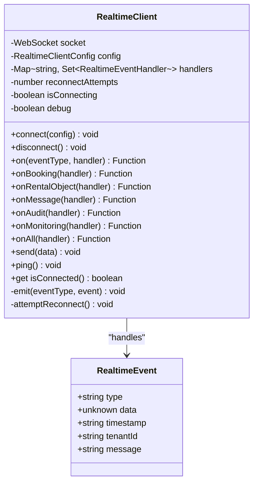
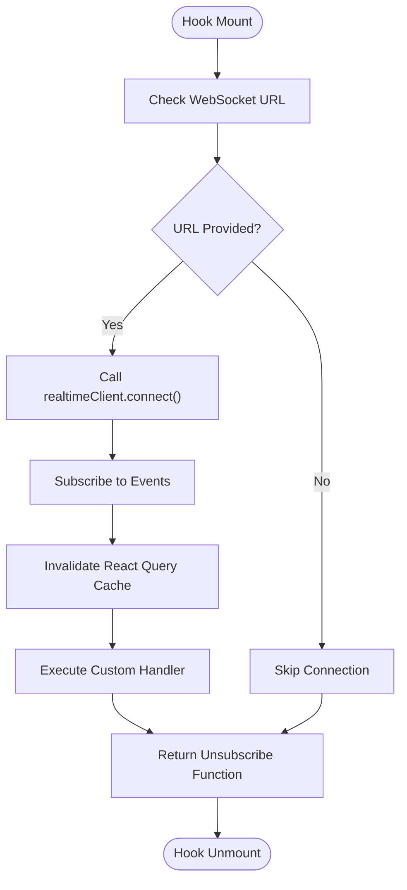
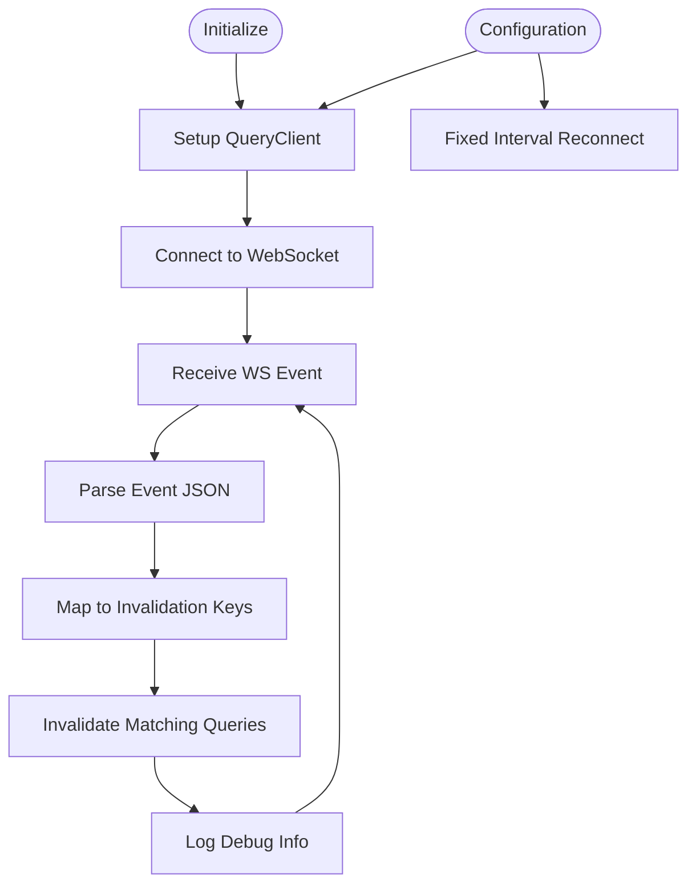
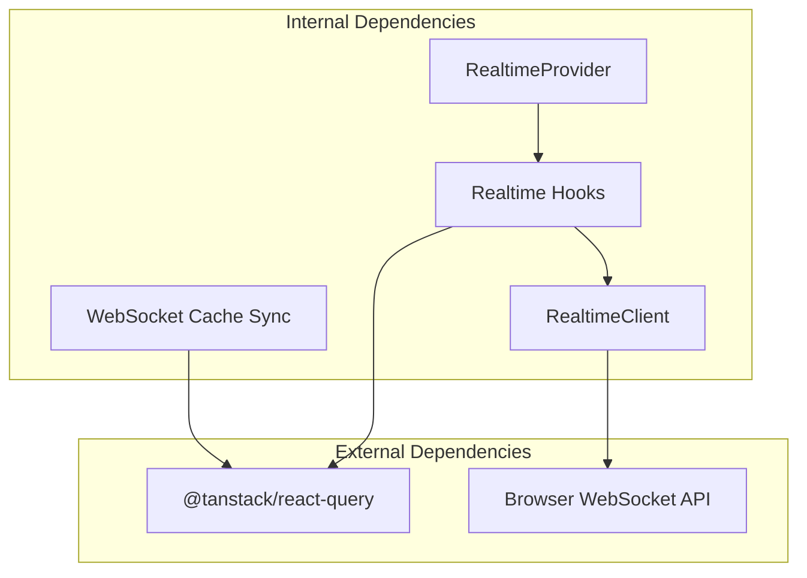

# Real-time Communication Hooks

<cite>
**Referenced Files in This Document**
- [use-realtime.ts](file://packages/client-sdk/src/hooks/use-realtime.ts)
- [index.ts](file://packages/client-sdk/src/realtime/index.ts)
- [ws-cache-sync.ts](file://packages/client-sdk/src/realtime/ws-cache-sync.ts)
- [RealtimeProvider.tsx](file://packages/client-sdk/src/providers/RealtimeProvider.tsx)
- [websocket-realtime.md](file://docs/guides/websocket-realtime.md)
- [use-realtime.test.ts](file://packages/client-sdk/src/hooks/__tests__/use-realtime.test.ts)
</cite>

## Table of Contents
1. [Introduction](#introduction)
2. [Project Structure](#project-structure)
3. [Core Components](#core-components)
4. [Architecture Overview](#architecture-overview)
5. [Detailed Component Analysis](#detailed-component-analysis)
6. [Dependency Analysis](#dependency-analysis)
7. [Performance Considerations](#performance-considerations)
8. [Troubleshooting Guide](#troubleshooting-guide)
9. [Conclusion](#conclusion)

## Introduction
This document provides comprehensive documentation for real-time communication hooks using WebSocket connections in the client SDK. It covers the useRealtimeConnection, useRealtimeBookings, useRealtimeRentalObjects, and other real-time hooks, explaining WebSocket connection management, event handling, and cache synchronization. It also includes examples of real-time data updates, connection state management, error recovery, performance considerations, and best practices for building robust real-time applications.

## Project Structure
The real-time functionality is implemented across three main areas:
- Realtime client: A singleton WebSocket client with event subscription and reconnection logic
- React hooks: High-level hooks that integrate with React Query for automatic cache invalidation
- Cache synchronization: A secondary mechanism mapping WS events to React Query invalidation rules

**Diagram sources**
- [index.ts](file://packages/client-sdk/src/realtime/index.ts#L28-L279)
- [use-realtime.ts](file://packages/client-sdk/src/hooks/use-realtime.ts#L1-L244)
- [ws-cache-sync.ts](file://packages/client-sdk/src/realtime/ws-cache-sync.ts#L152-L222)

**Section sources**
- [index.ts](file://packages/client-sdk/src/realtime/index.ts#L1-L296)
- [use-realtime.ts](file://packages/client-sdk/src/hooks/use-realtime.ts#L1-L244)
- [ws-cache-sync.ts](file://packages/client-sdk/src/realtime/ws-cache-sync.ts#L1-L245)

## Core Components
This section introduces the primary real-time components and their responsibilities.

### RealtimeClient (Singleton)
The RealtimeClient manages WebSocket connections, event subscriptions, and reconnection logic. It provides:
- Connection lifecycle management (connect, disconnect, ping)
- Event subscription for specific types and wildcards
- Automatic reconnection with configurable intervals
- Multi-tenant support through tenantId filtering
- Debug logging capability

### Realtime Hooks
The hooks layer provides React-friendly APIs for subscribing to real-time events:
- useRealtimeConnection: Manages WebSocket connection lifecycle
- useRealtimeBookings: Subscribes to booking-related events
- useRealtimeRentalObjects: Subscribes to listing-related events
- useRealtimeCalendar: Subscribes to calendar-related events
- useRealtimeMessages: Subscribes to messaging events
- useRealtimeNotifications: Subscribes to notification events
- useRealtimeAudit/Monitoring: Admin-only event subscriptions
- useRealtimeEvents: Subscribes to all events
- useNotificationBadge: Tracks unread notification counts
- useRealtimeSend: Sends messages and pings

### Cache Synchronization
The WebSocket Cache Sync provides an alternative approach to cache invalidation:
- Maps WS event types to specific React Query keys
- Automatically invalidates matching queries on event receipt
- Provides a singleton instance for centralized cache management

**Section sources**
- [index.ts](file://packages/client-sdk/src/realtime/index.ts#L28-L279)
- [use-realtime.ts](file://packages/client-sdk/src/hooks/use-realtime.ts#L17-L244)
- [ws-cache-sync.ts](file://packages/client-sdk/src/realtime/ws-cache-sync.ts#L152-L222)

## Architecture Overview
The real-time architecture follows a layered approach with clear separation of concerns:

**Diagram sources**
- [index.ts](file://packages/client-sdk/src/realtime/index.ts#L39-L101)
- [use-realtime.ts](file://packages/client-sdk/src/hooks/use-realtime.ts#L47-L86)

The architecture ensures:
- Single WebSocket connection per app instance (singleton pattern)
- Automatic cache invalidation on all real-time events
- Multi-tenant isolation through tenantId filtering
- Graceful reconnection with configurable retry logic

**Section sources**
- [websocket-realtime.md](file://docs/guides/websocket-realtime.md#L41-L98)
- [index.ts](file://packages/client-sdk/src/realtime/index.ts#L28-L279)

## Detailed Component Analysis

### RealtimeClient Implementation
The RealtimeClient is implemented as a singleton with comprehensive event handling:

**Diagram sources**
- [index.ts](file://packages/client-sdk/src/realtime/index.ts#L28-L279)

Key implementation details:
- **Connection Management**: Handles WebSocket lifecycle with proper error handling
- **Event Dispatching**: Supports specific event types and wildcard subscriptions
- **Reconnection Logic**: Implements configurable retry attempts with fixed intervals
- **Multi-tenant Support**: Filters events by tenantId for isolation
- **Debug Mode**: Optional verbose logging for development

**Section sources**
- [index.ts](file://packages/client-sdk/src/realtime/index.ts#L28-L279)

### Realtime Hooks Analysis
Each hook follows a consistent pattern for managing subscriptions and cache invalidation:

**Diagram sources**
- [use-realtime.ts](file://packages/client-sdk/src/hooks/use-realtime.ts#L17-L86)

#### useRealtimeConnection
Manages the WebSocket connection lifecycle:
- Accepts connection configuration (URL, auto-reconnect, tenantId)
- Tracks connection state through React state
- Emits 'connected' events for UI updates
- Returns current connection status

#### useRealtimeBookings
Handles booking-related events:
- Invalidates booking and calendar-related queries
- Supports custom event handlers
- Integrates with React Query for automatic cache updates

#### useRealtimeRentalObjects
Manages listing synchronization:
- Invalidates rental object queries on changes
- Ensures UI reflects listing updates in real-time
- Supports custom handlers for specific business logic

**Section sources**
- [use-realtime.ts](file://packages/client-sdk/src/hooks/use-realtime.ts#L17-L244)

### WebSocket Cache Sync
The cache synchronization provides an alternative approach to real-time updates:

**Diagram sources**
- [ws-cache-sync.ts](file://packages/client-sdk/src/realtime/ws-cache-sync.ts#L152-L222)

**Section sources**
- [ws-cache-sync.ts](file://packages/client-sdk/src/realtime/ws-cache-sync.ts#L152-L222)

## Dependency Analysis
The real-time system has clear dependency relationships:

**Diagram sources**
- [use-realtime.ts](file://packages/client-sdk/src/hooks/use-realtime.ts#L6-L12)
- [RealtimeProvider.tsx](file://packages/client-sdk/src/providers/RealtimeProvider.tsx#L6-L13)

Key dependencies:
- **@tanstack/react-query**: Provides caching and invalidation mechanisms
- **Browser WebSocket API**: Native WebSocket implementation
- **React**: Hooks and component lifecycle management

**Section sources**
- [use-realtime.ts](file://packages/client-sdk/src/hooks/use-realtime.ts#L6-L12)
- [RealtimeProvider.tsx](file://packages/client-sdk/src/providers/RealtimeProvider.tsx#L6-L13)

## Performance Considerations
The real-time system is designed with performance and reliability in mind:

### Connection Management
- **Singleton Pattern**: Prevents multiple concurrent connections
- **Automatic Reconnection**: Minimizes downtime with configurable retry logic
- **Multi-tenant Isolation**: Reduces unnecessary event processing

### Cache Invalidation Strategy
- **Targeted Invalidation**: Only invalidates affected query keys
- **Batch Updates**: Multiple queries invalidated in single operation
- **Selective Refetch**: Uses refetchType: 'active' to avoid unnecessary requests

### Memory Management
- **Proper Cleanup**: All hooks return unsubscribe functions
- **Handler References**: Uses useRef for stable handler references
- **Event Handler Isolation**: Individual handlers can fail without affecting others

### Best Practices for Performance
- **Limit Event Scope**: Subscribe only to necessary event types
- **Optimize Query Keys**: Design query keys for efficient invalidation
- **Debounce UI Updates**: Consider debouncing frequent updates
- **Monitor Connection Health**: Track connection status for user feedback

**Section sources**
- [websocket-realtime.md](file://docs/guides/websocket-realtime.md#L556-L577)
- [use-realtime.ts](file://packages/client-sdk/src/hooks/use-realtime.ts#L47-L86)

## Troubleshooting Guide

### Common Connection Issues
1. **Initial Connection Failure**
   - Verify WebSocket URL format (wss://)
   - Check network connectivity and firewall settings
   - Ensure tenantId is properly configured

2. **Reconnection Problems**
   - Monitor reconnectAttempt counter
   - Check autoReconnect configuration
   - Verify server availability

3. **Event Handler Errors**
   - Wrap custom handlers in try-catch blocks
   - Log errors for debugging without breaking the system
   - Ensure handlers don't throw exceptions

### Debugging Strategies
- Enable debug mode during development to see detailed logs
- Monitor WebSocket frames in browser DevTools
- Track connection state changes
- Verify event payload structures

### Recovery Procedures
- **Manual Reconnect**: Call connect() after network restoration
- **Graceful Degradation**: Continue functioning with cached data
- **User Feedback**: Display connection status indicators
- **Fallback Mechanisms**: Consider polling as backup for critical operations

**Section sources**
- [websocket-realtime.md](file://docs/guides/websocket-realtime.md#L158-L577)
- [use-realtime.test.ts](file://packages/client-sdk/src/hooks/__tests__/use-realtime.test.ts#L309-L333)

## Conclusion
The real-time communication hooks provide a robust foundation for building responsive, live-updating applications. The singleton RealtimeClient ensures efficient resource usage, while the React hooks layer integrates seamlessly with React Query for automatic cache management. The multi-tenant architecture provides isolation and security, and the comprehensive error handling ensures resilient operation. By following the best practices outlined in this document, developers can build reliable real-time features that scale effectively and provide excellent user experiences.

The combination of the primary hooks-based approach and the optional WebSocket Cache Sync gives teams flexibility in implementing real-time functionality while maintaining consistency in cache invalidation and data synchronization across the application.