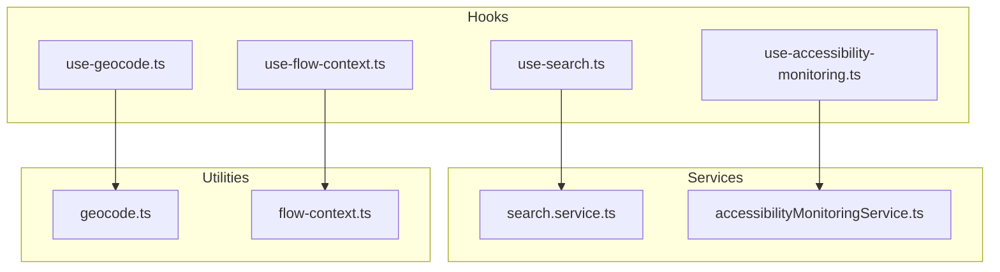
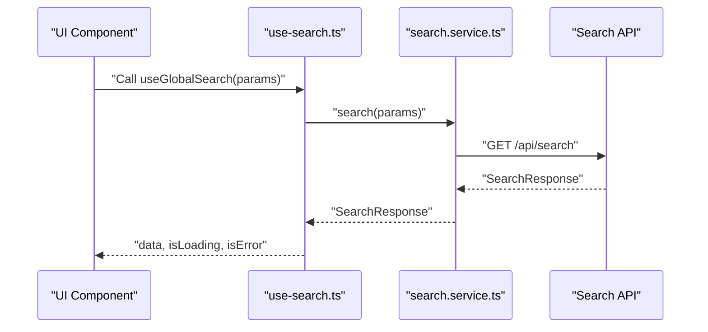
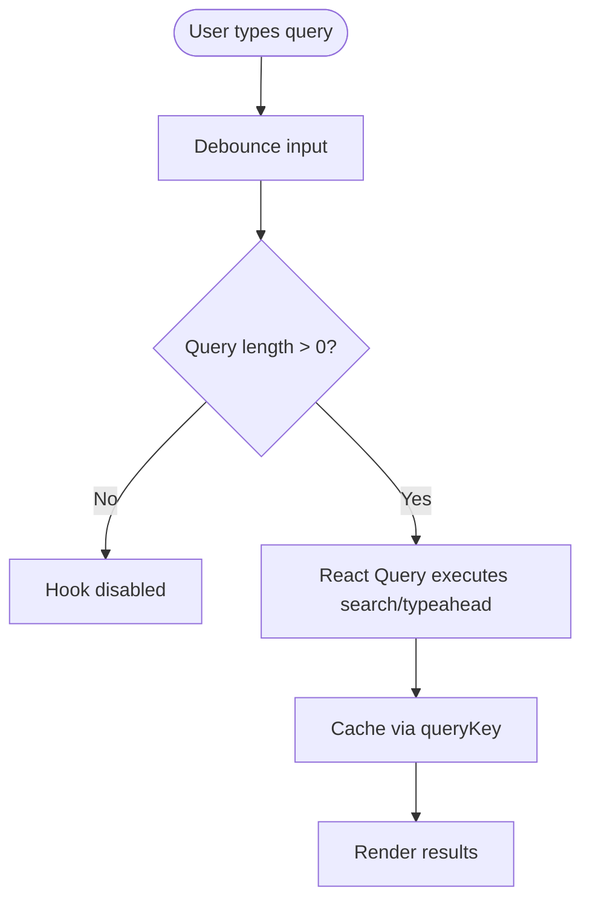
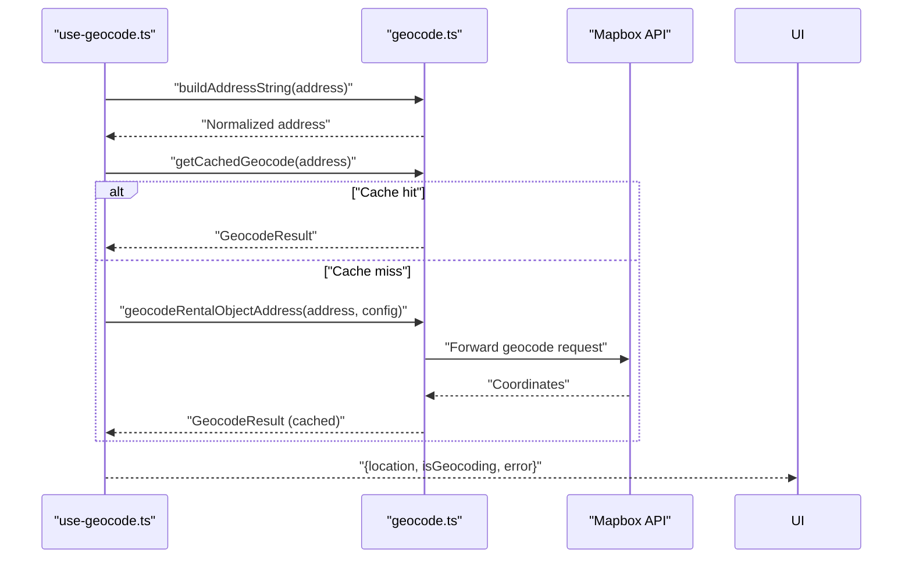
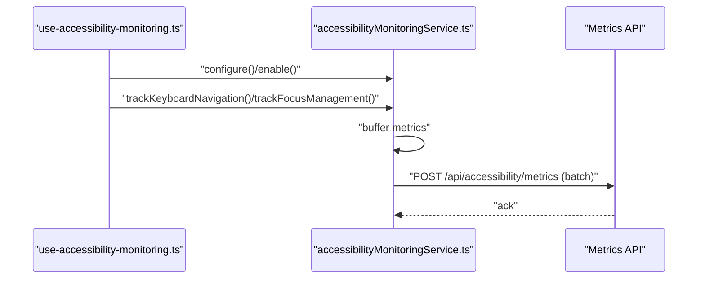
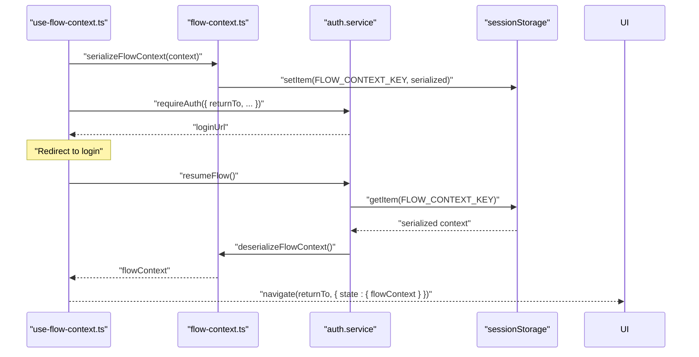
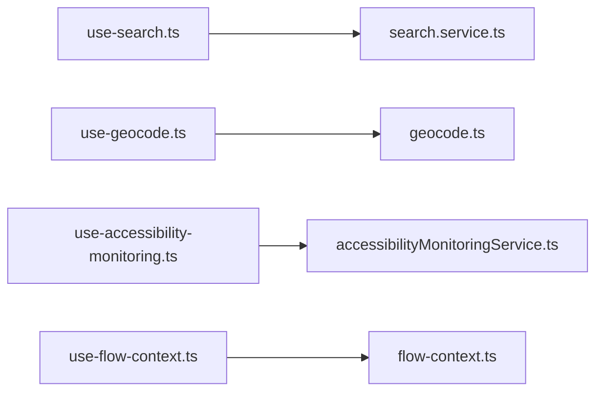

# Utility & Supporting Hooks

<cite>
**Referenced Files in This Document**
- [use-search.ts](file://packages/client-sdk/src/hooks/use-search.ts)
- [search.service.ts](file://packages/client-sdk/src/services/search.service.ts)
- [use-geocode.ts](file://packages/client-sdk/src/hooks/use-geocode.ts)
- [geocode.ts](file://packages/client-sdk/src/utils/geocode.ts)
- [use-accessibility-monitoring.ts](file://packages/client-sdk/src/hooks/use-accessibility-monitoring.ts)
- [accessibilityMonitoringService.ts](file://packages/client-sdk/src/services/accessibilityMonitoringService.ts)
- [use-flow-context.ts](file://packages/client-sdk/src/hooks/use-flow-context.ts)
- [flow-context.ts](file://packages/client-sdk/src/utils/flow-context.ts)
</cite>

## Table of Contents
1. [Introduction](#introduction)
2. [Project Structure](#project-structure)
3. [Core Components](#core-components)
4. [Architecture Overview](#architecture-overview)
5. [Detailed Component Analysis](#detailed-component-analysis)
6. [Dependency Analysis](#dependency-analysis)
7. [Performance Considerations](#performance-considerations)
8. [Troubleshooting Guide](#troubleshooting-guide)
9. [Conclusion](#conclusion)

## Introduction
This document explains the utility and supporting React Query hooks that power search, geocoding, accessibility monitoring, and flow context management across the client SDK. It covers specialized functionality such as global search, location services, accessibility detection, and authentication flow preservation. You will find integration patterns, best practices, and performance optimization strategies for each utility hook family.

## Project Structure
The utility hooks live under the client SDK’s hooks directory and delegate to dedicated services and utilities:
- Search hooks depend on a SearchService for API operations.
- Geocoding hooks depend on a geocoding utility for address normalization, caching, and provider integration.
- Accessibility monitoring hooks depend on an accessibility monitoring service for metrics collection and reporting.
- Flow context hooks depend on a flow context utility for serialization, validation, and storage.

**Diagram sources**
- [use-search.ts](file://packages/client-sdk/src/hooks/use-search.ts#L1-L141)
- [search.service.ts](file://packages/client-sdk/src/services/search.service.ts#L1-L138)
- [use-geocode.ts](file://packages/client-sdk/src/hooks/use-geocode.ts#L1-L291)
- [geocode.ts](file://packages/client-sdk/src/utils/geocode.ts#L1-L538)
- [use-accessibility-monitoring.ts](file://packages/client-sdk/src/hooks/use-accessibility-monitoring.ts#L1-L300)
- [accessibilityMonitoringService.ts](file://packages/client-sdk/src/services/accessibilityMonitoringService.ts#L1-L488)
- [use-flow-context.ts](file://packages/client-sdk/src/hooks/use-flow-context.ts#L1-L414)
- [flow-context.ts](file://packages/client-sdk/src/utils/flow-context.ts#L1-L599)

**Section sources**
- [use-search.ts](file://packages/client-sdk/src/hooks/use-search.ts#L1-L141)
- [use-geocode.ts](file://packages/client-sdk/src/hooks/use-geocode.ts#L1-L291)
- [use-accessibility-monitoring.ts](file://packages/client-sdk/src/hooks/use-accessibility-monitoring.ts#L1-L300)
- [use-flow-context.ts](file://packages/client-sdk/src/hooks/use-flow-context.ts#L1-L414)

## Core Components
- Search hooks: Provide React Query-powered global search, typeahead suggestions, saved filters, recent searches, and export functionality.
- Geocoding hooks: Offer single-address and batch geocoding with caching, rate limiting, and provider selection.
- Accessibility monitoring hooks: Enable keyboard navigation, focus management, screen reader detection, and page performance tracking.
- Flow context hooks: Preserve and restore user navigation and booking state across authentication interruptions.

**Section sources**
- [use-search.ts](file://packages/client-sdk/src/hooks/use-search.ts#L23-L140)
- [use-geocode.ts](file://packages/client-sdk/src/hooks/use-geocode.ts#L54-L225)
- [use-accessibility-monitoring.ts](file://packages/client-sdk/src/hooks/use-accessibility-monitoring.ts#L77-L224)
- [use-flow-context.ts](file://packages/client-sdk/src/hooks/use-flow-context.ts#L198-L313)

## Architecture Overview
The hooks follow a layered architecture:
- Hooks orchestrate React Query and side effects.
- Services encapsulate HTTP clients and endpoint logic.
- Utilities provide pure, framework-agnostic helpers for caching, normalization, and validation.

**Diagram sources**
- [use-search.ts](file://packages/client-sdk/src/hooks/use-search.ts#L26-L32)
- [search.service.ts](file://packages/client-sdk/src/services/search.service.ts#L42-L46)

## Detailed Component Analysis

### Search Hooks
Purpose: Provide React Query hooks for global search, typeahead, saved filters, recent searches, and export.

Key behaviors:
- Global search: Enabled only when a query is present; uses query keys for caching and invalidation.
- Typeahead: Enabled only when a query is present; caches results for a short time to reduce API calls.
- Saved filters: CRUD mutations with automatic cache invalidation for lists and details.
- Recent searches: Fetch paginated recent searches.
- Export: Mutation to trigger export jobs.

Integration patterns:
- Combine useGlobalSearch with a debounced input to avoid excessive queries.
- Use typeahead for real-time suggestions while typing.
- Invalidate saved filters cache after create/update/delete to keep lists in sync.

Best practices:
- Always pass a query string to enable hooks; they are disabled otherwise.
- Use staleTime for typeahead to balance freshness and performance.
- Invalidate related query keys after mutations to maintain cache consistency.

**Diagram sources**
- [use-search.ts](file://packages/client-sdk/src/hooks/use-search.ts#L26-L43)

**Section sources**
- [use-search.ts](file://packages/client-sdk/src/hooks/use-search.ts#L23-L140)
- [search.service.ts](file://packages/client-sdk/src/services/search.service.ts#L23-L134)

### Geocoding Utilities and Hooks
Purpose: Convert addresses to coordinates using Mapbox with caching, batching, and rate limiting.

Key behaviors:
- Address normalization: Builds a standardized address string from components.
- In-memory cache: LRU cache with TTL to avoid repeated API calls.
- Batch processing: Processes items in small batches with delays to respect rate limits.
- Hook composition: useGeocodeListings for lists and useGeocode for single addresses.
- Retry mechanism: Retries failed items on demand.

Integration patterns:
- Use useGeocodeListings to enrich a list of items with coordinates efficiently.
- Use useGeocode for dynamic single-address resolution.
- Provide a Mapbox token; optionally provide a country bias and language.

Best practices:
- Prefer batch geocoding for large datasets.
- Respect rate limits by tuning batch sizes and delays.
- Use cached results when available to minimize network calls.
- Handle errors gracefully and expose retry controls.

**Diagram sources**
- [use-geocode.ts](file://packages/client-sdk/src/hooks/use-geocode.ts#L231-L287)
- [geocode.ts](file://packages/client-sdk/src/utils/geocode.ts#L302-L416)

**Section sources**
- [use-geocode.ts](file://packages/client-sdk/src/hooks/use-geocode.ts#L54-L225)
- [geocode.ts](file://packages/client-sdk/src/utils/geocode.ts#L84-L176)

### Accessibility Monitoring Hooks
Purpose: Track accessibility metrics and detect user interaction patterns for compliance and UX insights.

Key behaviors:
- Keyboard navigation tracking: Captures tab, arrow keys, Enter, Space, Escape actions.
- Focus management: Detects focus loss and potential focus traps.
- Screen reader detection: Heuristic-based detection using user agent and preferences.
- Page performance: Tracks page load times.
- Configurable sampling and batching: Controls privacy and performance impact.

Integration patterns:
- Initialize useAccessibilityMonitoring with desired features enabled.
- Call tracking methods from UI components to capture events.
- Use flush on page unload to ensure metrics are sent.

Best practices:
- Keep sample rates reasonable to protect user privacy.
- Enable only necessary trackers to reduce overhead.
- Use detectScreenReader and detectKeyboardNavigation for UI adaptation.

**Diagram sources**
- [use-accessibility-monitoring.ts](file://packages/client-sdk/src/hooks/use-accessibility-monitoring.ts#L77-L224)
- [accessibilityMonitoringService.ts](file://packages/client-sdk/src/services/accessibilityMonitoringService.ts#L125-L401)

**Section sources**
- [use-accessibility-monitoring.ts](file://packages/client-sdk/src/hooks/use-accessibility-monitoring.ts#L77-L224)
- [accessibilityMonitoringService.ts](file://packages/client-sdk/src/services/accessibilityMonitoringService.ts#L125-L401)

### Flow Context Management
Purpose: Preserve user navigation and booking state across authentication interruptions.

Key behaviors:
- Save flow context: Serializes and stores context with size and expiration checks.
- Restore flow context: Loads and validates context; calculates TTL.
- Cross-tab synchronization: Subscribes to storage events for real-time updates.
- URL validation: Validates returnTo URLs for security.
- Correlation IDs: Generates unique identifiers for auditability.

Integration patterns:
- Before requiring authentication, save context with returnTo and booking details.
- After login, restore context and navigate to the saved destination.
- Clear context after successful flow completion.

Best practices:
- Validate returnTo URLs to prevent open redirect vulnerabilities.
- Keep context minimal to respect size limits.
- Use TTL to inform users about expiring contexts.

**Diagram sources**
- [use-flow-context.ts](file://packages/client-sdk/src/hooks/use-flow-context.ts#L220-L270)
- [flow-context.ts](file://packages/client-sdk/src/utils/flow-context.ts#L44-L74)
- [flow-context.ts](file://packages/client-sdk/src/utils/flow-context.ts#L432-L462)

**Section sources**
- [use-flow-context.ts](file://packages/client-sdk/src/hooks/use-flow-context.ts#L198-L313)
- [flow-context.ts](file://packages/client-sdk/src/utils/flow-context.ts#L44-L74)

## Dependency Analysis
- Search hooks depend on SearchService for HTTP operations.
- Geocoding hooks depend on geocode utilities for normalization, caching, and provider calls.
- Accessibility hooks depend on accessibilityMonitoringService for buffering and sending metrics.
- Flow context hooks depend on flow-context utilities for serialization, validation, and storage.

**Diagram sources**
- [use-search.ts](file://packages/client-sdk/src/hooks/use-search.ts#L6-L8)
- [use-geocode.ts](file://packages/client-sdk/src/hooks/use-geocode.ts#L5-L11)
- [use-accessibility-monitoring.ts](file://packages/client-sdk/src/hooks/use-accessibility-monitoring.ts#L6-L14)
- [use-flow-context.ts](file://packages/client-sdk/src/hooks/use-flow-context.ts#L7-L18)

**Section sources**
- [use-search.ts](file://packages/client-sdk/src/hooks/use-search.ts#L6-L8)
- [use-geocode.ts](file://packages/client-sdk/src/hooks/use-geocode.ts#L5-L11)
- [use-accessibility-monitoring.ts](file://packages/client-sdk/src/hooks/use-accessibility-monitoring.ts#L6-L14)
- [use-flow-context.ts](file://packages/client-sdk/src/hooks/use-flow-context.ts#L7-L18)

## Performance Considerations
- Search
  - Enable hooks only when a query exists to avoid unnecessary requests.
  - Use staleTime for typeahead to reduce API calls while keeping suggestions responsive.
  - Invalidate caches selectively after mutations to avoid stale data.
- Geocoding
  - Use batch processing with appropriate concurrency and delays to respect provider rate limits.
  - Leverage in-memory cache with TTL to minimize redundant network calls.
  - Normalize addresses to maximize cache hits.
- Accessibility Monitoring
  - Control sampleRate and batchSize to balance insight quality and performance.
  - Debounce metrics collection to avoid excessive flushes.
- Flow Context
  - Keep serialized context small to fit within size limits.
  - Validate returnTo URLs to prevent expensive or unsafe navigations.

[No sources needed since this section provides general guidance]

## Troubleshooting Guide
- Search
  - If global search does not trigger, ensure the query parameter is non-empty.
  - If typeahead is slow, adjust staleTime and consider debouncing input.
- Geocoding
  - If coordinates are missing, verify the Mapbox token and address completeness.
  - If rate-limited, reduce batch size or increase delay between batches.
  - If results are incorrect, confirm country and language settings.
- Accessibility Monitoring
  - If metrics are not sent, check service enablement and flush intervals.
  - If privacy concerns arise, lower sampleRate or disable specific trackers.
- Flow Context
  - If returnTo is rejected, verify allowed origins and path prefixes.
  - If context expires unexpectedly, check TTL and storage availability.

**Section sources**
- [use-search.ts](file://packages/client-sdk/src/hooks/use-search.ts#L30-L43)
- [use-geocode.ts](file://packages/client-sdk/src/hooks/use-geocode.ts#L243-L284)
- [accessibilityMonitoringService.ts](file://packages/client-sdk/src/services/accessibilityMonitoringService.ts#L131-L146)
- [flow-context.ts](file://packages/client-sdk/src/utils/flow-context.ts#L184-L237)

## Conclusion
These utility and supporting hooks provide robust, production-grade capabilities for search, geocoding, accessibility monitoring, and authentication flow preservation. By following the integration patterns and best practices outlined here, teams can deliver responsive, accessible, and resilient user experiences while maintaining strong performance and security guarantees.