# Real-time Communication

<cite>
**Referenced Files in This Document**
- [index.ts](file://packages/client-sdk/src/index.ts)
- [index.ts](file://packages/client-sdk/src/realtime/index.ts)
- [ws-cache-sync.ts](file://packages/client-sdk/src/realtime/ws-cache-sync.ts)
- [use-realtime.ts](file://packages/client-sdk/src/hooks/use-realtime.ts)
- [RealtimeProvider.tsx](file://packages/client-sdk/src/providers/RealtimeProvider.tsx)
- [realtimeClient.ts](file://apps/web/src/features/rental-object-details/adapters/realtimeClient.ts)
- [websocket-realtime.md](file://docs/guides/websocket-realtime.md)
- [use-realtime.test.ts](file://packages/client-sdk/src/hooks/__tests__/use-realtime.test.ts)
</cite>

## Table of Contents
1. [Introduction](#introduction)
2. [Project Structure](#project-structure)
3. [Core Components](#core-components)
4. [Architecture Overview](#architecture-overview)
5. [Detailed Component Analysis](#detailed-component-analysis)
6. [Dependency Analysis](#dependency-analysis)
7. [Performance Considerations](#performance-considerations)
8. [Troubleshooting Guide](#troubleshooting-guide)
9. [Conclusion](#conclusion)
10. [Appendices](#appendices)

## Introduction
This document explains the real-time communication capabilities in the Client SDK, focusing on the WebSocket client implementation, connection lifecycle, event handling, subscription mechanisms, and cache synchronization. It also covers the React context provider, real-time status monitoring, error recovery, and practical usage patterns for connecting to real-time feeds, handling events, and managing connection state. Guidance on optimistic updates, conflict detection, and offline behavior is included.

## Project Structure
The real-time subsystem consists of:
- A WebSocket client with event routing and automatic reconnection
- React hooks for subscribing to domain events and invalidating caches
- A React context provider that wires connections and subscriptions
- A cache synchronization utility that maps WS events to React Query invalidation rules
- An adapter pattern for per-feature real-time needs

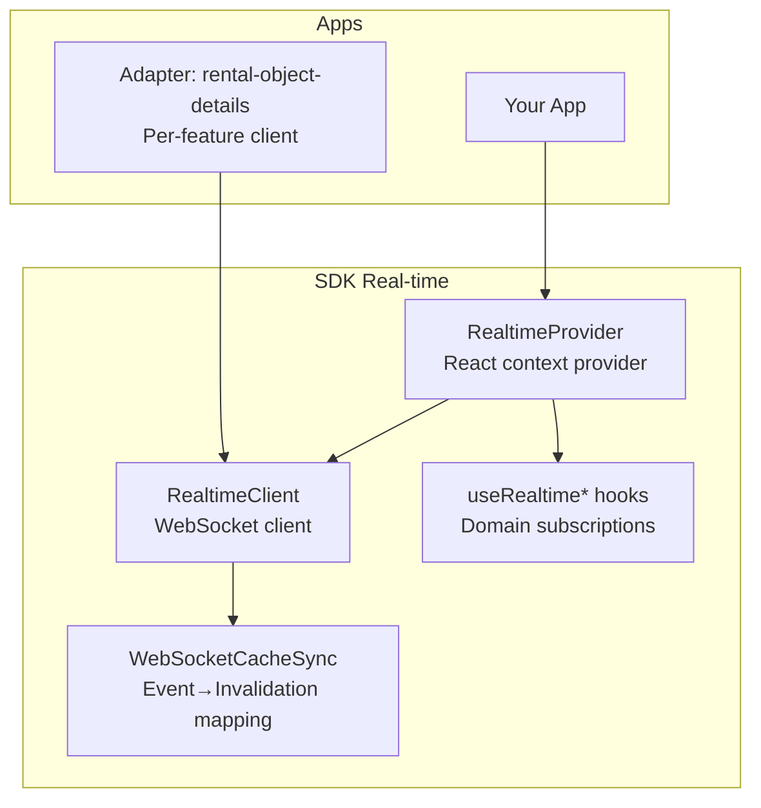

**Diagram sources**
- [index.ts](file://packages/client-sdk/src/realtime/index.ts#L28-L279)
- [RealtimeProvider.tsx](file://packages/client-sdk/src/providers/RealtimeProvider.tsx#L47-L90)
- [use-realtime.ts](file://packages/client-sdk/src/hooks/use-realtime.ts#L17-L244)
- [ws-cache-sync.ts](file://packages/client-sdk/src/realtime/ws-cache-sync.ts#L152-L222)
- [realtimeClient.ts](file://apps/web/src/features/rental-object-details/adapters/realtimeClient.ts#L41-L98)

**Section sources**
- [index.ts](file://packages/client-sdk/src/index.ts#L90-L101)
- [index.ts](file://packages/client-sdk/src/realtime/index.ts#L6-L26)
- [RealtimeProvider.tsx](file://packages/client-sdk/src/providers/RealtimeProvider.tsx#L1-L98)
- [use-realtime.ts](file://packages/client-sdk/src/hooks/use-realtime.ts#L1-L244)
- [ws-cache-sync.ts](file://packages/client-sdk/src/realtime/ws-cache-sync.ts#L1-L245)
- [realtimeClient.ts](file://apps/web/src/features/rental-object-details/adapters/realtimeClient.ts#L1-L163)

## Core Components
- RealtimeClient: Singleton WebSocket client that connects, parses events, emits to handlers, and manages reconnection.
- Realtime Provider: React provider that initializes the WebSocket connection and subscribes to domain events.
- React Hooks: Typed subscription hooks for bookings, rental objects, messages, notifications, audit, monitoring, and wildcard/all events.
- Cache Synchronization: Maps WS event types to React Query invalidation keys to keep UI in sync with server-side changes.
- Adapter Pattern: Per-feature client that wraps the SDK’s RealtimeClient for scoping events to specific resources.

**Section sources**
- [index.ts](file://packages/client-sdk/src/realtime/index.ts#L28-L279)
- [RealtimeProvider.tsx](file://packages/client-sdk/src/providers/RealtimeProvider.tsx#L47-L90)
- [use-realtime.ts](file://packages/client-sdk/src/hooks/use-realtime.ts#L17-L244)
- [ws-cache-sync.ts](file://packages/client-sdk/src/realtime/ws-cache-sync.ts#L152-L222)
- [realtimeClient.ts](file://apps/web/src/features/rental-object-details/adapters/realtimeClient.ts#L41-L98)

## Architecture Overview
The real-time pipeline integrates WebSocket events with React Query caching. WS events trigger cache invalidations, ensuring UI consistency without duplicating DAL logic.

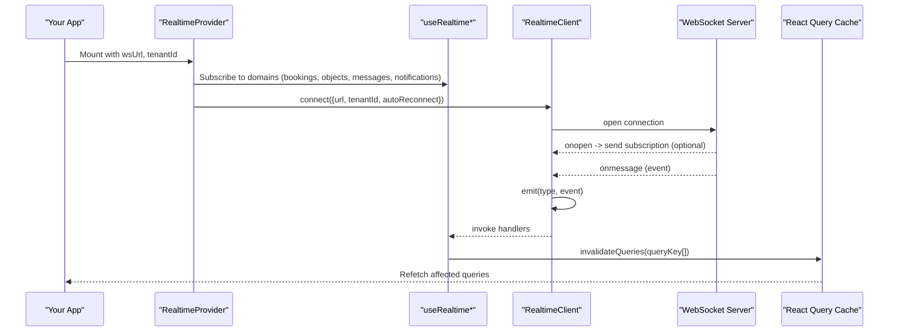

**Diagram sources**
- [RealtimeProvider.tsx](file://packages/client-sdk/src/providers/RealtimeProvider.tsx#L47-L90)
- [use-realtime.ts](file://packages/client-sdk/src/hooks/use-realtime.ts#L47-L156)
- [index.ts](file://packages/client-sdk/src/realtime/index.ts#L39-L101)
- [ws-cache-sync.ts](file://packages/client-sdk/src/realtime/ws-cache-sync.ts#L167-L188)

## Detailed Component Analysis

### RealtimeClient: WebSocket Client
Responsibilities:
- Establish and maintain a WebSocket connection
- Parse incoming events and emit to registered handlers
- Support typed subscriptions for event categories and wildcards
- Automatic reconnection with fixed-interval backoff
- Optional tenant-scoped subscription message on connect
- Utility methods to send messages and ping

Key behaviors:
- Connection lifecycle: CONNECTING → CONNECTED → CLOSED with reconnection attempts
- Event emission: Handlers receive parsed events; wildcard "*" receives all events
- Reconnection: Controlled by autoReconnect, reconnectInterval, maxReconnectAttempts
- Debug mode logs for diagnostics

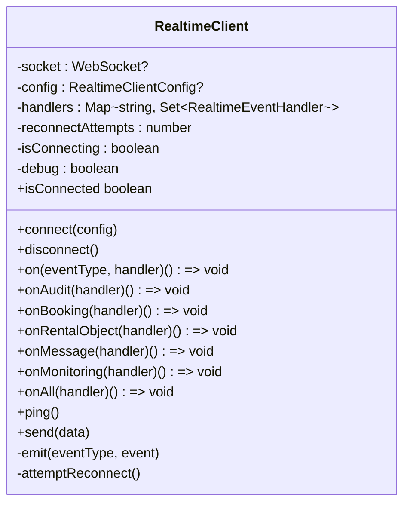

**Diagram sources**
- [index.ts](file://packages/client-sdk/src/realtime/index.ts#L28-L279)

**Section sources**
- [index.ts](file://packages/client-sdk/src/realtime/index.ts#L6-L26)
- [index.ts](file://packages/client-sdk/src/realtime/index.ts#L28-L101)
- [index.ts](file://packages/client-sdk/src/realtime/index.ts#L117-L177)
- [index.ts](file://packages/client-sdk/src/realtime/index.ts#L220-L243)
- [index.ts](file://packages/client-sdk/src/realtime/index.ts#L258-L275)

### Realtime Provider and Status Monitoring
The provider:
- Builds a tenant-scoped WebSocket URL
- Initializes the connection with configurable reconnection behavior
- Subscribes to domain events by default (configurable flags)
- Exposes connection status via context for UI feedback

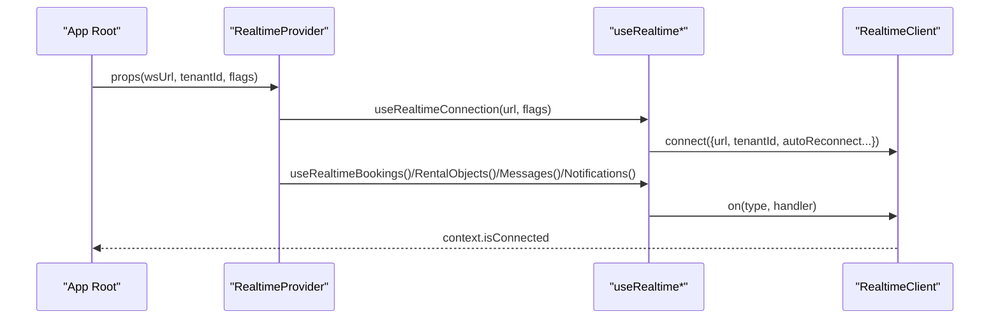

**Diagram sources**
- [RealtimeProvider.tsx](file://packages/client-sdk/src/providers/RealtimeProvider.tsx#L47-L90)
- [use-realtime.ts](file://packages/client-sdk/src/hooks/use-realtime.ts#L17-L41)

**Section sources**
- [RealtimeProvider.tsx](file://packages/client-sdk/src/providers/RealtimeProvider.tsx#L21-L90)
- [use-realtime.ts](file://packages/client-sdk/src/hooks/use-realtime.ts#L17-L41)

### React Hooks: Subscriptions and Cache Invalidation
Purpose:
- Provide ergonomic hooks for subscribing to specific event streams
- Automatically invalidate relevant React Query caches upon receiving events
- Offer utilities for sending messages and pings

Highlights:
- useRealtimeConnection: Establishes connection and tracks status
- useRealtimeBookings, useRealtimeRentalObjects, useRealtimeMessages, useRealtimeNotifications: Subscribe and invalidate domain-specific queries
- useRealtimeCalendar: Aggregates calendar-related events
- useRealtimeEvents, useRealtimeAudit, useRealtimeMonitoring: Specialized subscriptions
- useNotificationBadge: Tracks unread counts from notification events
- useRealtimeSend: Sends messages and pings

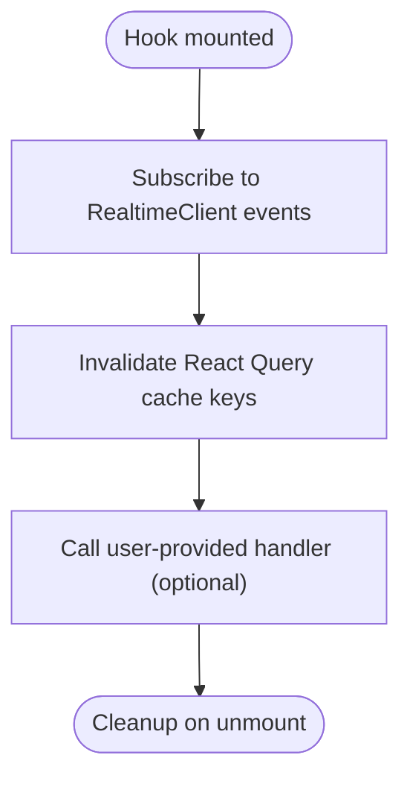

**Diagram sources**
- [use-realtime.ts](file://packages/client-sdk/src/hooks/use-realtime.ts#L47-L156)

**Section sources**
- [use-realtime.ts](file://packages/client-sdk/src/hooks/use-realtime.ts#L17-L244)

### Cache Synchronization: Event Mapping and Invalidation
Purpose:
- Map WebSocket event types to specific React Query keys
- Ensure WS-driven updates follow the same invalidation semantics as mutations
- Provide a standalone WebSocket cache sync utility with auto-reconnect

Key elements:
- WSEventType union defines supported event categories
- wsInvalidationMap: Single source of truth for which query keys to invalidate per event
- WebSocketCacheSync: Handles WS connection, parsing, and invalidation
- createUseWebSocketCacheSync: React integration hook to initialize and connect

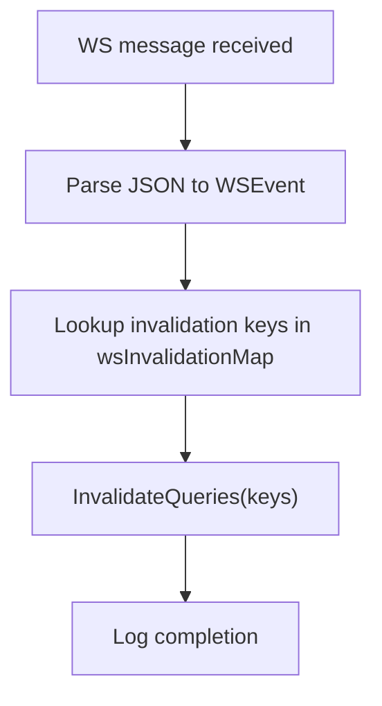

**Diagram sources**
- [ws-cache-sync.ts](file://packages/client-sdk/src/realtime/ws-cache-sync.ts#L167-L188)
- [ws-cache-sync.ts](file://packages/client-sdk/src/realtime/ws-cache-sync.ts#L58-L146)

**Section sources**
- [ws-cache-sync.ts](file://packages/client-sdk/src/realtime/ws-cache-sync.ts#L14-L48)
- [ws-cache-sync.ts](file://packages/client-sdk/src/realtime/ws-cache-sync.ts#L58-L146)
- [ws-cache-sync.ts](file://packages/client-sdk/src/realtime/ws-cache-sync.ts#L152-L222)

### Adapter Pattern: Per-feature Real-time Client
The adapter wraps the SDK’s RealtimeClient to:
- Scope events to a specific resource (e.g., rental object)
- Manage per-resource handlers
- Provide a simple connect/disconnect/subscribe API

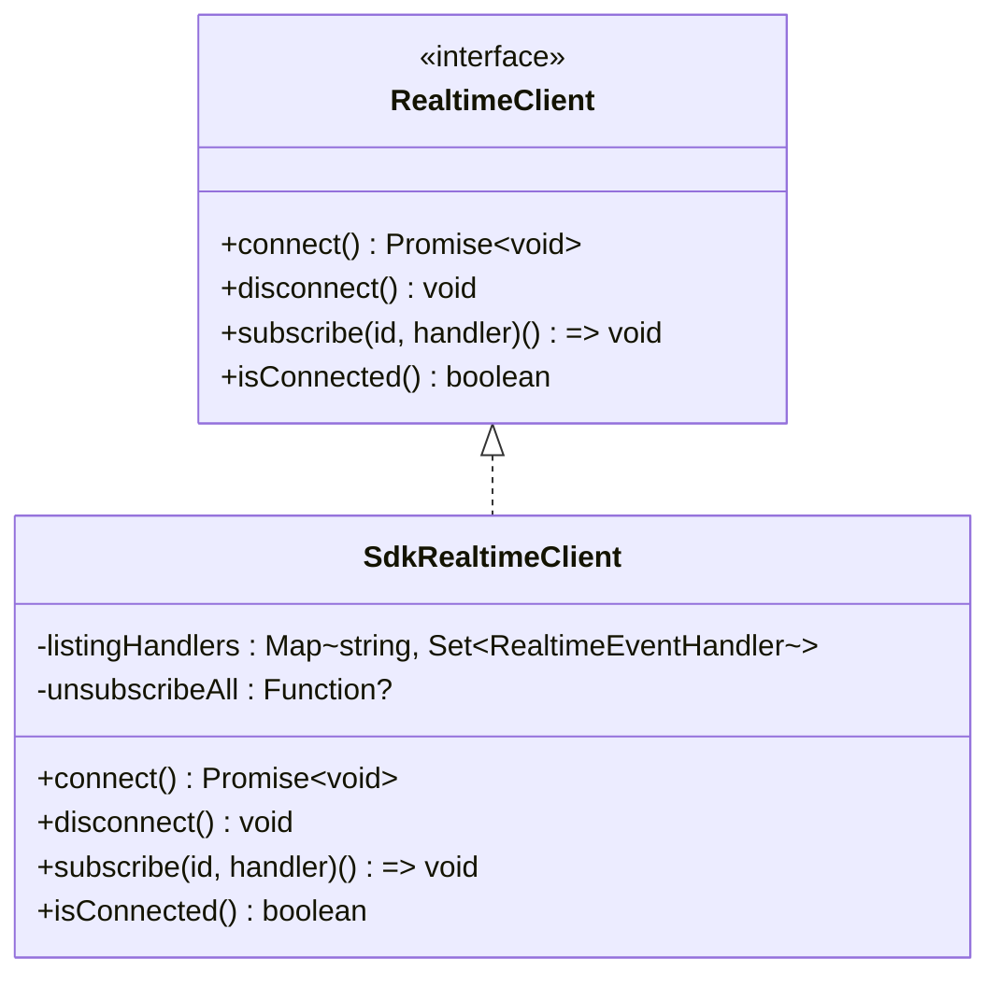

**Diagram sources**
- [realtimeClient.ts](file://apps/web/src/features/rental-object-details/adapters/realtimeClient.ts#L27-L98)

**Section sources**
- [realtimeClient.ts](file://apps/web/src/features/rental-object-details/adapters/realtimeClient.ts#L41-L98)
- [realtimeClient.ts](file://apps/web/src/features/rental-object-details/adapters/realtimeClient.ts#L126-L162)

### Connection Management and Reconnection Logic
- State machine: DISCONNECTED → CONNECTING → CONNECTED → RECONNECTING → FAILED
- Reconnection behavior: Fixed interval with configurable max attempts
- Auto-reconnect is enabled by default; can be disabled per configuration
- Debug logging helps diagnose connectivity issues

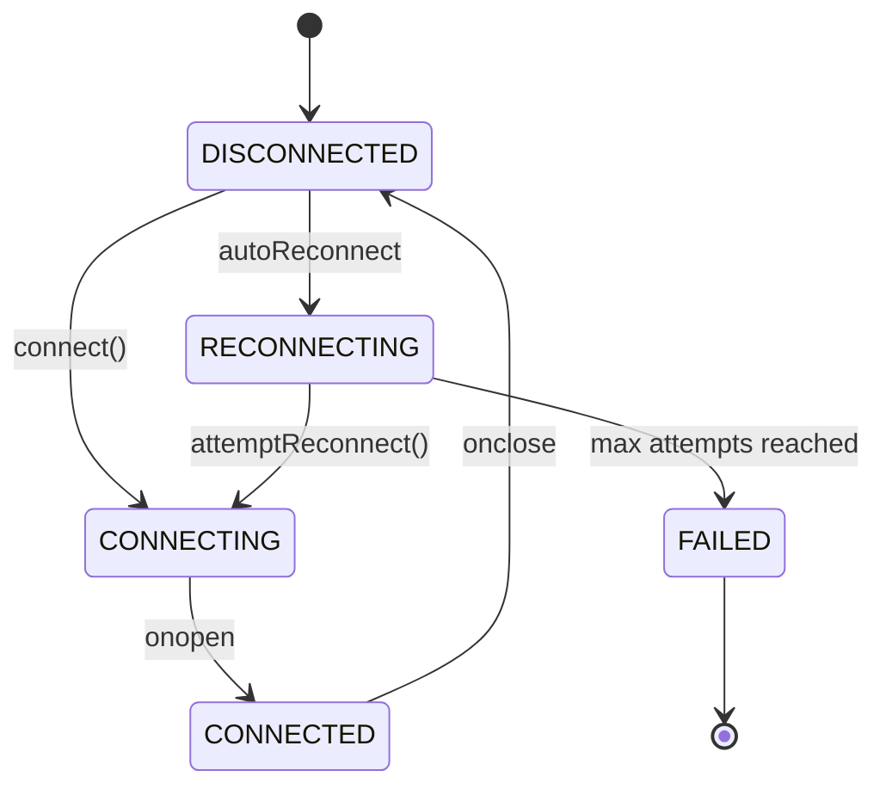

**Diagram sources**
- [websocket-realtime.md](file://docs/guides/websocket-realtime.md#L102-L128)
- [index.ts](file://packages/client-sdk/src/realtime/index.ts#L258-L275)

**Section sources**
- [websocket-realtime.md](file://docs/guides/websocket-realtime.md#L143-L197)
- [index.ts](file://packages/client-sdk/src/realtime/index.ts#L85-L101)
- [index.ts](file://packages/client-sdk/src/realtime/index.ts#L258-L275)

### Event Types and Subscription Mechanisms
Supported event categories:
- Audit, booking, rentalObject, message, notification, monitoring, connected, pong
- Specialized subscriptions: onAudit, onBooking, onRentalObject, onMessage, onMonitoring, onAll
- Calendar aggregation: useRealtimeCalendar for bookings, blocks, allocations
- Notification badge: useNotificationBadge for unread counts

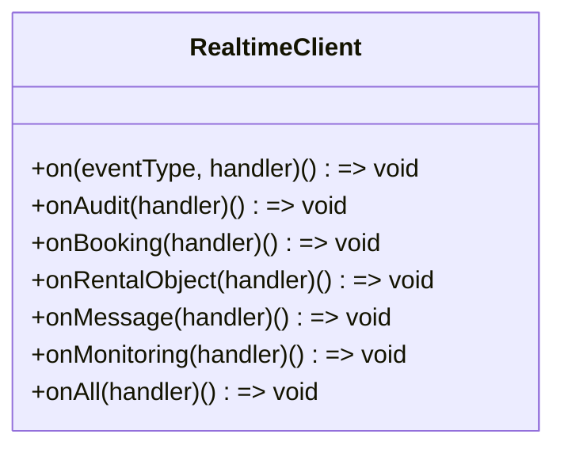

**Diagram sources**
- [index.ts](file://packages/client-sdk/src/realtime/index.ts#L117-L177)

**Section sources**
- [index.ts](file://packages/client-sdk/src/realtime/index.ts#L6-L16)
- [index.ts](file://packages/client-sdk/src/realtime/index.ts#L117-L177)
- [use-realtime.ts](file://packages/client-sdk/src/hooks/use-realtime.ts#L47-L156)

### Practical Examples
- Connecting to real-time feeds:
  - Use RealtimeProvider with wsUrl and tenantId
  - Alternatively, call realtimeClient.connect with a URL and optional tenantId
- Handling events:
  - Subscribe with useRealtimeBookings, useRealtimeRentalObjects, useRealtimeMessages, useRealtimeNotifications
  - Use useRealtimeEvents for wildcard/all events
- Managing connection state:
  - useRealtimeConnection returns isConnected
  - useRealtimeStatus exposes context.isConnected
  - useRealtimeSend provides send and ping utilities

**Section sources**
- [RealtimeProvider.tsx](file://packages/client-sdk/src/providers/RealtimeProvider.tsx#L47-L90)
- [use-realtime.ts](file://packages/client-sdk/src/hooks/use-realtime.ts#L17-L41)
- [use-realtime.ts](file://packages/client-sdk/src/hooks/use-realtime.ts#L233-L243)
- [index.ts](file://packages/client-sdk/src/realtime/index.ts#L284-L295)

### Optimistic Updates and Conflict Resolution
- Use React Query’s optimistic updates during mutations
- Detect conflicts when a WS event arrives while a mutation is pending
- Resolve by invalidating queries and prompting the user to reload

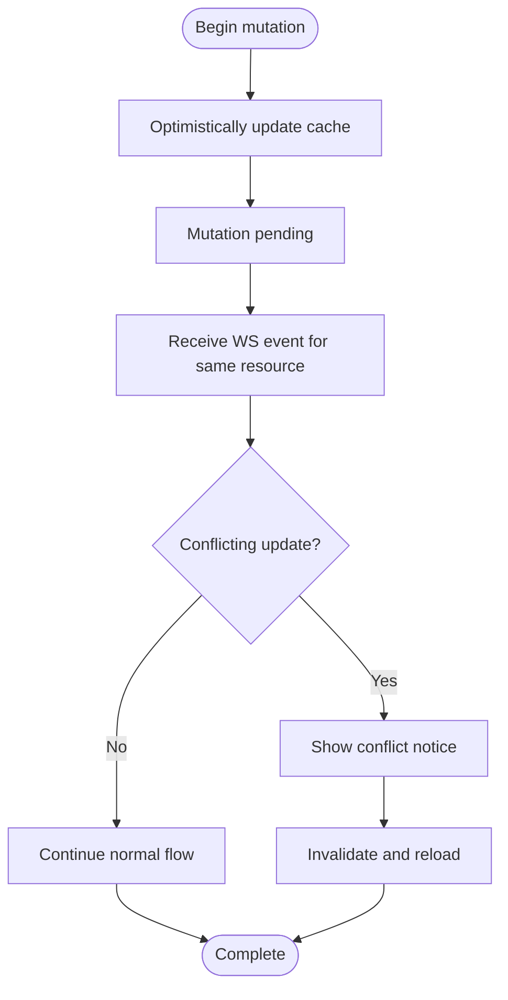

**Diagram sources**
- [websocket-realtime.md](file://docs/guides/websocket-realtime.md#L2893-L2957)

**Section sources**
- [websocket-realtime.md](file://docs/guides/websocket-realtime.md#L2893-L2957)

## Dependency Analysis
- RealtimeClient depends on the browser WebSocket API and emits events to internal handlers
- React hooks depend on RealtimeClient and React Query’s QueryClient for cache invalidation
- RealtimeProvider composes hooks and passes connection status to consumers
- WebSocketCacheSync depends on React Query and provides an alternative cache sync mechanism
- The adapter pattern isolates per-feature concerns from the SDK’s core client

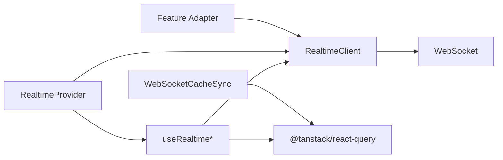

**Diagram sources**
- [index.ts](file://packages/client-sdk/src/realtime/index.ts#L28-L101)
- [use-realtime.ts](file://packages/client-sdk/src/hooks/use-realtime.ts#L47-L156)
- [RealtimeProvider.tsx](file://packages/client-sdk/src/providers/RealtimeProvider.tsx#L47-L90)
- [ws-cache-sync.ts](file://packages/client-sdk/src/realtime/ws-cache-sync.ts#L152-L222)
- [realtimeClient.ts](file://apps/web/src/features/rental-object-details/adapters/realtimeClient.ts#L41-L98)

**Section sources**
- [index.ts](file://packages/client-sdk/src/realtime/index.ts#L28-L101)
- [use-realtime.ts](file://packages/client-sdk/src/hooks/use-realtime.ts#L47-L156)
- [RealtimeProvider.tsx](file://packages/client-sdk/src/providers/RealtimeProvider.tsx#L47-L90)
- [ws-cache-sync.ts](file://packages/client-sdk/src/realtime/ws-cache-sync.ts#L152-L222)
- [realtimeClient.ts](file://apps/web/src/features/rental-object-details/adapters/realtimeClient.ts#L41-L98)

## Performance Considerations
- Reconnection strategy: Fixed interval by default; consider tuning reconnectInterval and maxReconnectAttempts to balance responsiveness and server load
- Handler performance: Keep event handlers lightweight; offload heavy work to background tasks
- Query invalidation: Use targeted query keys to minimize unnecessary refetches
- Adapter scoping: Limit per-feature subscriptions to reduce handler overhead
- Offline behavior: The SDK does not implement offline queuing; rely on reconnection and cache invalidation to recover after network interruptions

[No sources needed since this section provides general guidance]

## Troubleshooting Guide
Common issues and remedies:
- Connection not opening:
  - Verify wsUrl and tenantId
  - Check autoReconnect and maxReconnectAttempts
  - Enable debug mode to inspect logs
- No events received:
  - Confirm subscription to the correct event type
  - Ensure tenant scoping matches server expectations
- Handler errors:
  - RealtimeClient catches and logs handler exceptions; ensure handlers are resilient
- Provider not exposing status:
  - Wrap your app with RealtimeProvider and pass wsUrl and tenantId
- Testing:
  - Use unit tests to verify subscription/unsubscription and event delivery

**Section sources**
- [websocket-realtime.md](file://docs/guides/websocket-realtime.md#L143-L197)
- [index.ts](file://packages/client-sdk/src/realtime/index.ts#L73-L83)
- [use-realtime.test.ts](file://packages/client-sdk/src/hooks/__tests__/use-realtime.test.ts#L34-L56)

## Conclusion
The Client SDK provides a robust, extensible real-time framework centered on a WebSocket client, React hooks, and cache synchronization. It supports typed subscriptions, automatic reconnection, and safe integration with React Query. The adapter pattern enables per-feature scoping, while the cache sync utility offers an alternative path for event-driven cache invalidation. Together, these components deliver responsive, consistent real-time experiences across applications.

[No sources needed since this section summarizes without analyzing specific files]

## Appendices

### API Reference Highlights
- RealtimeClient
  - connect(config), disconnect(), on(eventType, handler), onAll(handler), send(data), ping(), isConnected
- React Hooks
  - useRealtimeConnection, useRealtimeBookings, useRealtimeRentalObjects, useRealtimeMessages, useRealtimeNotifications, useRealtimeCalendar, useRealtimeEvents, useRealtimeAudit, useRealtimeMonitoring, useNotificationBadge, useRealtimeSend
- Provider
  - RealtimeProvider, useRealtimeStatus
- Cache Sync
  - WebSocketCacheSync, createUseWebSocketCacheSync, wsInvalidationMap
- Adapter
  - getRealtimeClient, setRealtimeClient, useRealtimeUpdates

**Section sources**
- [index.ts](file://packages/client-sdk/src/realtime/index.ts#L4160-L4247)
- [use-realtime.ts](file://packages/client-sdk/src/hooks/use-realtime.ts#L17-L244)
- [RealtimeProvider.tsx](file://packages/client-sdk/src/providers/RealtimeProvider.tsx#L47-L90)
- [ws-cache-sync.ts](file://packages/client-sdk/src/realtime/ws-cache-sync.ts#L152-L245)
- [realtimeClient.ts](file://apps/web/src/features/rental-object-details/adapters/realtimeClient.ts#L106-L115)