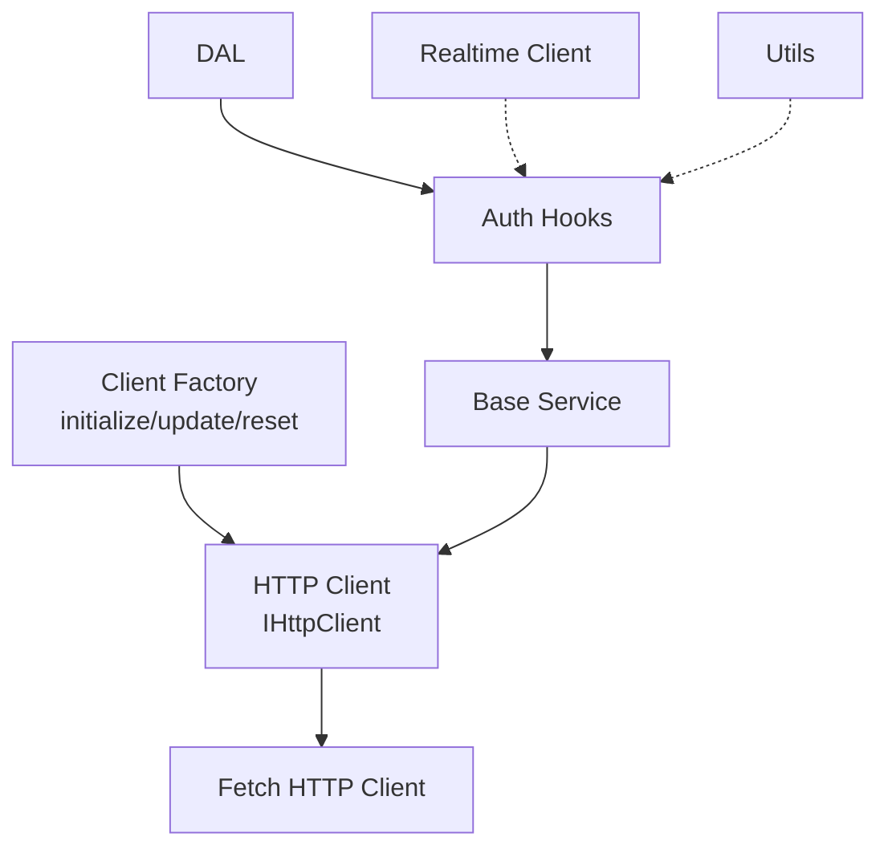
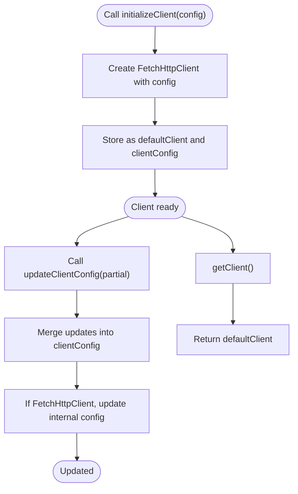
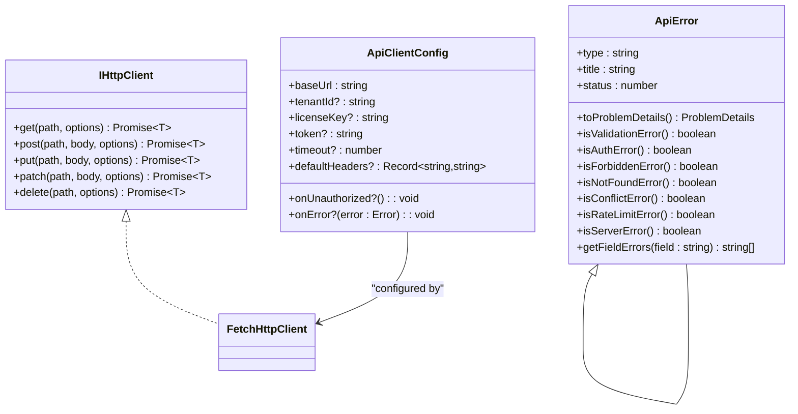
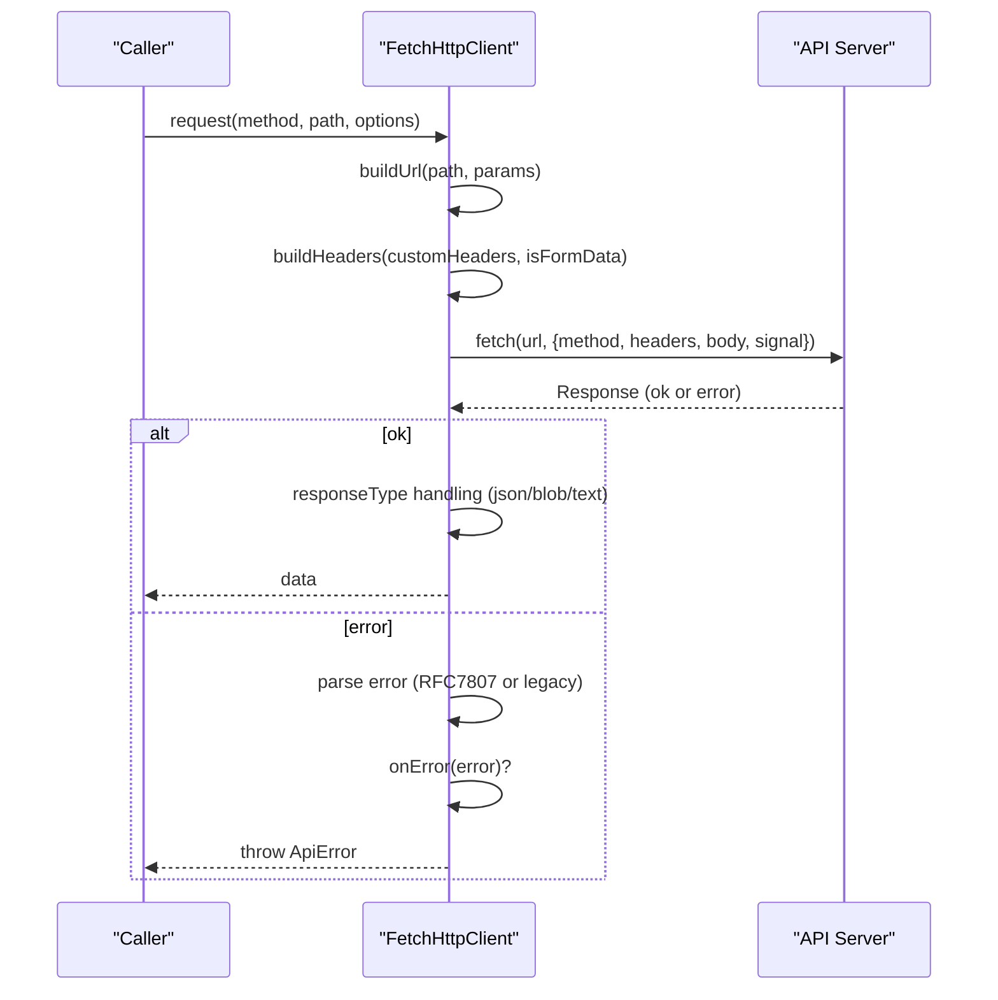
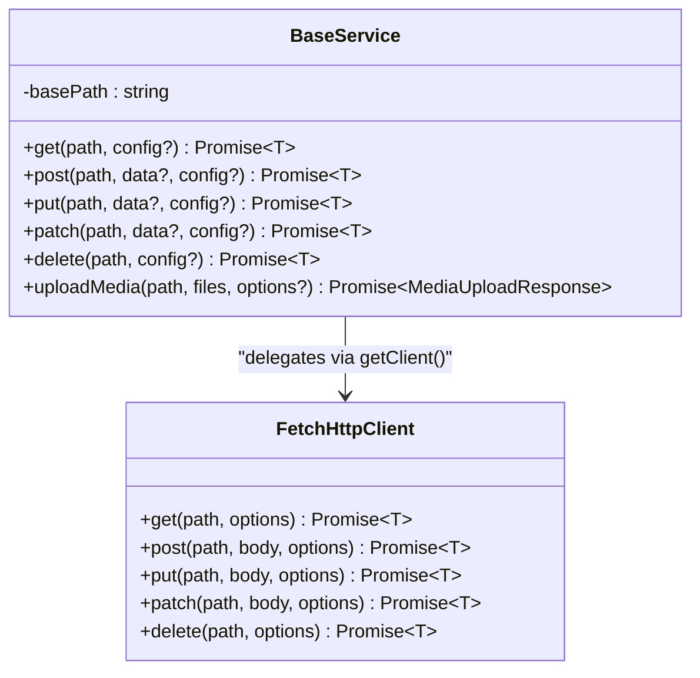
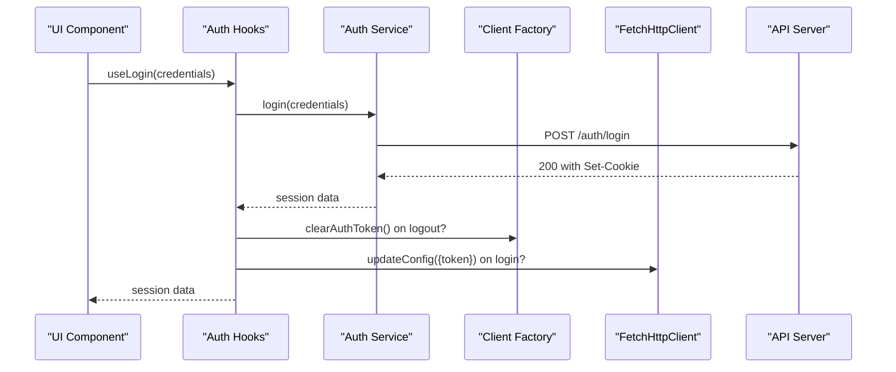
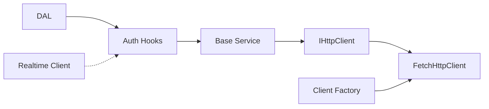

# SDK Architecture & Core

<cite>
**Referenced Files in This Document**
- [index.ts](file://packages/client-sdk/src/index.ts)
- [core/index.ts](file://packages/client-sdk/src/core/index.ts)
- [client-factory.ts](file://packages/client-sdk/src/core/client-factory.ts)
- [http-client.interface.ts](file://packages/client-sdk/src/core/http-client.interface.ts)
- [fetch-client.ts](file://packages/client-sdk/src/core/fetch-client.ts)
- [base.service.ts](file://packages/client-sdk/src/services/base.service.ts)
- [use-auth.ts](file://packages/client-sdk/src/hooks/use-auth.ts)
- [use-current-user.ts](file://packages/client-sdk/src/hooks/use-current-user.ts)
- [auth.ts](file://packages/client-sdk/src/types/auth.ts)
- [dal/index.ts](file://packages/client-sdk/src/dal/index.ts)
- [realtime/index.ts](file://packages/client-sdk/src/realtime/index.ts)
- [utils/index.ts](file://packages/client-sdk/src/utils/index.ts)
</cite>

## Table of Contents
1. [Introduction](#introduction)
2. [Project Structure](#project-structure)
3. [Core Components](#core-components)
4. [Architecture Overview](#architecture-overview)
5. [Detailed Component Analysis](#detailed-component-analysis)
6. [Dependency Analysis](#dependency-analysis)
7. [Performance Considerations](#performance-considerations)
8. [Troubleshooting Guide](#troubleshooting-guide)
9. [Conclusion](#conclusion)
10. [Appendices](#appendices)

## Introduction
This document explains the Client SDK architecture and core components with a focus on the client factory pattern, HTTP client interface, and configuration management. It covers initialization, authentication integration, tenant context handling, type system design, error handling patterns, and API client configuration options. Practical examples demonstrate client setup, configuration updates, and environment-specific deployments. Performance considerations, caching strategies, and offline capability are addressed, along with the relationship between core components and higher-level services.

## Project Structure
The SDK is organized around a core module that defines the HTTP client abstraction and factory, a DAL for cache and query-key management, services that encapsulate domain operations, hooks that integrate with React Query, and utilities for performance and UX.

```mermaid
graph TB
subgraph "SDK Core"
CF["client-factory.ts"]
IF["http-client.interface.ts"]
FC["fetch-client.ts"]
end
subgraph "Services"
BS["base.service.ts"]
end
subgraph "Hooks"
UA["use-auth.ts"]
UC["use-current-user.ts"]
end
subgraph "Types"
AT["types/auth.ts"]
end
subgraph "DAL"
DAL["dal/index.ts"]
end
subgraph "Realtime"
RT["realtime/index.ts"]
end
subgraph "Utils"
UT["utils/index.ts"]
end
IDX["index.ts"] --> CF
IDX --> IF
IDX --> FC
IDX --> BS
IDX --> UA
IDX --> UC
IDX --> AT
IDX --> DAL
IDX --> RT
IDX --> UT
```

**Diagram sources**
- [index.ts](file://packages/client-sdk/src/index.ts#L30-L168)
- [client-factory.ts](file://packages/client-sdk/src/core/client-factory.ts#L1-L114)
- [http-client.interface.ts](file://packages/client-sdk/src/core/http-client.interface.ts#L1-L214)
- [fetch-client.ts](file://packages/client-sdk/src/core/fetch-client.ts#L1-L211)
- [base.service.ts](file://packages/client-sdk/src/services/base.service.ts#L1-L100)
- [use-auth.ts](file://packages/client-sdk/src/hooks/use-auth.ts#L1-L188)
- [use-current-user.ts](file://packages/client-sdk/src/hooks/use-current-user.ts#L1-L24)
- [auth.ts](file://packages/client-sdk/src/types/auth.ts#L1-L162)
- [dal/index.ts](file://packages/client-sdk/src/dal/index.ts#L1-L230)
- [realtime/index.ts](file://packages/client-sdk/src/realtime/index.ts#L1-L296)
- [utils/index.ts](file://packages/client-sdk/src/utils/index.ts#L1-L123)

**Section sources**
- [index.ts](file://packages/client-sdk/src/index.ts#L1-L168)

## Core Components
- Client factory: Initializes, retrieves, and updates the shared HTTP client; exposes helpers for tenant and auth context.
- HTTP client interface: Defines a minimal contract for HTTP operations and RFC 7807 Problem Details error model.
- Fetch HTTP client: Implements the interface using the browser fetch API with tenant and auth headers, timeouts, and error parsing.
- Base service: Encapsulates domain services and delegates HTTP calls to the shared client.
- Hooks: Provide React Query integration for authentication and session management.
- DAL: Centralizes query keys, cache invalidation, and prefetch helpers.
- Realtime: WebSocket client for real-time event streaming with auto-reconnect and tenant scoping.
- Utilities: Formatting, geocoding, upload progress, and flow context helpers.

**Section sources**
- [client-factory.ts](file://packages/client-sdk/src/core/client-factory.ts#L1-L114)
- [http-client.interface.ts](file://packages/client-sdk/src/core/http-client.interface.ts#L1-L214)
- [fetch-client.ts](file://packages/client-sdk/src/core/fetch-client.ts#L1-L211)
- [base.service.ts](file://packages/client-sdk/src/services/base.service.ts#L1-L100)
- [use-auth.ts](file://packages/client-sdk/src/hooks/use-auth.ts#L1-L188)
- [dal/index.ts](file://packages/client-sdk/src/dal/index.ts#L1-L230)
- [realtime/index.ts](file://packages/client-sdk/src/realtime/index.ts#L1-L296)
- [utils/index.ts](file://packages/client-sdk/src/utils/index.ts#L1-L123)

## Architecture Overview
The SDK follows a layered architecture:
- Core layer: Abstraction (interface) and implementation (Fetch HTTP client) plus client factory.
- Service layer: Domain services built on top of the HTTP client.
- Presentation layer: React Query hooks and providers.
- Data layer: DAL manages cache keys and invalidation.
- Realtime layer: WebSocket client for live updates.
- Utilities: Shared helpers for UX and performance.



**Diagram sources**
- [client-factory.ts](file://packages/client-sdk/src/core/client-factory.ts#L17-L101)
- [http-client.interface.ts](file://packages/client-sdk/src/core/http-client.interface.ts#L32-L38)
- [fetch-client.ts](file://packages/client-sdk/src/core/fetch-client.ts#L10-L211)
- [base.service.ts](file://packages/client-sdk/src/services/base.service.ts#L11-L100)
- [use-auth.ts](file://packages/client-sdk/src/hooks/use-auth.ts#L15-L102)
- [dal/index.ts](file://packages/client-sdk/src/dal/index.ts#L19-L230)
- [realtime/index.ts](file://packages/client-sdk/src/realtime/index.ts#L28-L296)
- [utils/index.ts](file://packages/client-sdk/src/utils/index.ts#L1-L123)

## Detailed Component Analysis

### Client Factory Pattern
The factory centralizes client lifecycle and configuration:
- Initialization: Creates a default Fetch HTTP client with provided configuration.
- Retrieval: Ensures a client exists before use.
- Updates: Applies partial configuration changes (e.g., token, tenantId).
- Helpers: Dedicated setters for auth token and tenant ID.
- Mock detection: Determines whether the client is configured for mock data.



**Diagram sources**
- [client-factory.ts](file://packages/client-sdk/src/core/client-factory.ts#L17-L57)

**Section sources**
- [client-factory.ts](file://packages/client-sdk/src/core/client-factory.ts#L1-L114)

### HTTP Client Interface and Error Model
The interface defines a minimal contract for HTTP operations and supports JSON and multipart/form-data bodies. The error model implements RFC 7807 Problem Details and provides convenience methods to categorize errors.



**Diagram sources**
- [http-client.interface.ts](file://packages/client-sdk/src/core/http-client.interface.ts#L32-L60)
- [http-client.interface.ts](file://packages/client-sdk/src/core/http-client.interface.ts#L89-L213)
- [fetch-client.ts](file://packages/client-sdk/src/core/fetch-client.ts#L10-L211)

**Section sources**
- [http-client.interface.ts](file://packages/client-sdk/src/core/http-client.interface.ts#L1-L214)

### Fetch HTTP Client Implementation
The Fetch HTTP client:
- Builds URLs with query parameters.
- Composes headers (tenant, license, authorization) and respects FormData boundaries.
- Enforces timeouts via AbortController.
- Parses RFC 7807 Problem Details and legacy error formats.
- Emits standardized ApiError instances and invokes global callbacks.



**Diagram sources**
- [fetch-client.ts](file://packages/client-sdk/src/core/fetch-client.ts#L74-L189)

**Section sources**
- [fetch-client.ts](file://packages/client-sdk/src/core/fetch-client.ts#L1-L211)

### Base Service and Domain Operations
Domain services extend a base class that:
- Holds a basePath.
- Uses the shared client retrieved from the factory.
- Provides CRUD helpers that delegate to IHttpClient.
- Supports multipart uploads via FormData.



**Diagram sources**
- [base.service.ts](file://packages/client-sdk/src/services/base.service.ts#L11-L99)
- [fetch-client.ts](file://packages/client-sdk/src/core/fetch-client.ts#L191-L210)

**Section sources**
- [base.service.ts](file://packages/client-sdk/src/services/base.service.ts#L1-L100)

### Authentication Integration and Tenant Context
Authentication hooks integrate with React Query:
- Session retrieval and provider discovery.
- Login/logout mutations that leverage cookie-based auth.
- Token refresh and Vipps OAuth initiation and callback.
- Current user convenience hook aliases session data.

Tenant context is propagated via headers and realtime subscriptions:
- Tenant ID is included in HTTP headers.
- Realtime client supports tenant-scoped subscriptions and auto-reconnect.



**Diagram sources**
- [use-auth.ts](file://packages/client-sdk/src/hooks/use-auth.ts#L39-L102)
- [client-factory.ts](file://packages/client-sdk/src/core/client-factory.ts#L62-L71)
- [fetch-client.ts](file://packages/client-sdk/src/core/fetch-client.ts#L55-L65)

**Section sources**
- [use-auth.ts](file://packages/client-sdk/src/hooks/use-auth.ts#L1-L188)
- [use-current-user.ts](file://packages/client-sdk/src/hooks/use-current-user.ts#L1-L24)
- [auth.ts](file://packages/client-sdk/src/types/auth.ts#L11-L26)
- [realtime/index.ts](file://packages/client-sdk/src/realtime/index.ts#L39-L101)

### Type System Design
The SDK defines a cohesive type system:
- Auth types: session, user, credentials, OAuth providers, permissions, and flow context.
- These types inform hooks, services, and UI components while maintaining strong typing across the stack.

**Section sources**
- [auth.ts](file://packages/client-sdk/src/types/auth.ts#L1-L162)

### Error Handling Patterns
Error handling is centralized:
- ApiError implements RFC 7807 and provides category checks.
- Fetch HTTP client parses responses and invokes onError callbacks.
- Global callbacks enable unified error reporting and retry orchestration.

**Section sources**
- [http-client.interface.ts](file://packages/client-sdk/src/core/http-client.interface.ts#L89-L213)
- [fetch-client.ts](file://packages/client-sdk/src/core/fetch-client.ts#L118-L153)

### API Client Configuration Options
Configuration options include:
- Base URL, tenant ID, license key, JWT token, timeout, unauthorized callback, error callback, and default headers.
- The factory and client expose helpers to update token and tenant context dynamically.

**Section sources**
- [http-client.interface.ts](file://packages/client-sdk/src/core/http-client.interface.ts#L43-L60)
- [client-factory.ts](file://packages/client-sdk/src/core/client-factory.ts#L46-L78)
- [fetch-client.ts](file://packages/client-sdk/src/core/fetch-client.ts#L45-L72)

### Practical Examples
- Client setup: Initialize the client with base URL and optional tenant ID.
- Configuration updates: Update token or tenant ID after login or context switch.
- Environment-specific deployments: Use environment variables to set base URL and feature flags; mock detection enables local development without a backend.

Note: The examples are conceptual and refer to the documented APIs and configuration options.

**Section sources**
- [index.ts](file://packages/client-sdk/src/index.ts#L9-L27)
- [client-factory.ts](file://packages/client-sdk/src/core/client-factory.ts#L17-L57)
- [client-factory.ts](file://packages/client-sdk/src/core/client-factory.ts#L107-L114)

## Dependency Analysis
The SDK exhibits low coupling and high cohesion:
- Core depends on the HTTP client abstraction; services depend on the factory and the abstraction.
- Hooks depend on services and React Query; DAL coordinates cache invalidation.
- Realtime is decoupled and configurable.



**Diagram sources**
- [http-client.interface.ts](file://packages/client-sdk/src/core/http-client.interface.ts#L32-L38)
- [fetch-client.ts](file://packages/client-sdk/src/core/fetch-client.ts#L10-L211)
- [client-factory.ts](file://packages/client-sdk/src/core/client-factory.ts#L17-L101)
- [base.service.ts](file://packages/client-sdk/src/services/base.service.ts#L18-L20)
- [use-auth.ts](file://packages/client-sdk/src/hooks/use-auth.ts#L15-L102)
- [dal/index.ts](file://packages/client-sdk/src/dal/index.ts#L86-L179)
- [realtime/index.ts](file://packages/client-sdk/src/realtime/index.ts#L28-L296)

**Section sources**
- [core/index.ts](file://packages/client-sdk/src/core/index.ts#L14-L64)
- [index.ts](file://packages/client-sdk/src/index.ts#L30-L101)

## Performance Considerations
- Caching and invalidation: DAL provides structured query keys and invalidation helpers to keep UI in sync and avoid redundant requests.
- Prefetching: Helpers allow prefetching availability and calendar configurations to reduce perceived latency.
- Timeouts: Fetch client enforces request timeouts to prevent hanging calls.
- Upload progress: Utilities compute progress and format metrics for large file uploads.
- Realtime synchronization: WebSocket events invalidate caches and keep the UI up to date without polling.

**Section sources**
- [dal/index.ts](file://packages/client-sdk/src/dal/index.ts#L86-L229)
- [fetch-client.ts](file://packages/client-sdk/src/core/fetch-client.ts#L85-L103)
- [utils/index.ts](file://packages/client-sdk/src/utils/index.ts#L55-L98)
- [realtime/index.ts](file://packages/client-sdk/src/realtime/index.ts#L28-L101)

## Troubleshooting Guide
- Client not initialized: Ensure initializeClient is called before using services or hooks.
- Unauthorized responses: The client triggers onUnauthorized and throws an ApiError; verify token presence and expiration.
- Network errors: ApiError.network and ApiError.timeout distinguish transient failures from permanent issues.
- Mock environments: isUsingMockData helps detect when the client is configured for local development without a backend.
- Logout side effects: useLogout clears auth token and invalidates session cache.

**Section sources**
- [client-factory.ts](file://packages/client-sdk/src/core/client-factory.ts#L27-L34)
- [fetch-client.ts](file://packages/client-sdk/src/core/fetch-client.ts#L107-L116)
- [http-client.interface.ts](file://packages/client-sdk/src/core/http-client.interface.ts#L198-L208)
- [client-factory.ts](file://packages/client-sdk/src/core/client-factory.ts#L107-L114)
- [use-auth.ts](file://packages/client-sdk/src/hooks/use-auth.ts#L73-L85)

## Conclusion
The SDK’s architecture centers on a clean separation of concerns: a factory and HTTP abstraction in the core, robust error handling aligned with RFC 7807, a DAL for cache management, and hooks/services for application integration. The design supports dynamic configuration updates, tenant-aware operations, and real-time synchronization, while offering utilities for performance and UX. This foundation enables scalable, maintainable integrations across environments.

## Appendices
- Export surface: The SDK index re-exports core APIs, types, services, hooks, realtime client, and utilities for convenient consumption.

**Section sources**
- [index.ts](file://packages/client-sdk/src/index.ts#L30-L168)