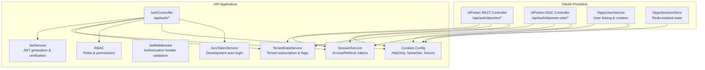
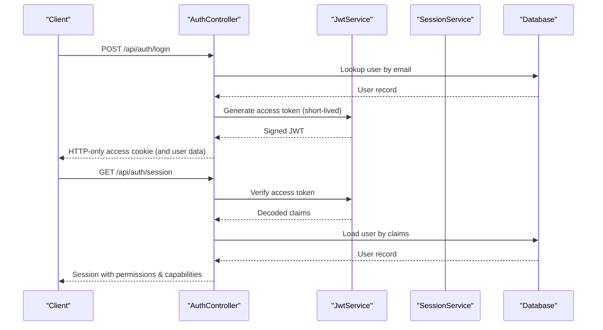
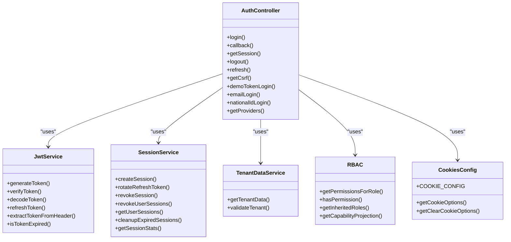
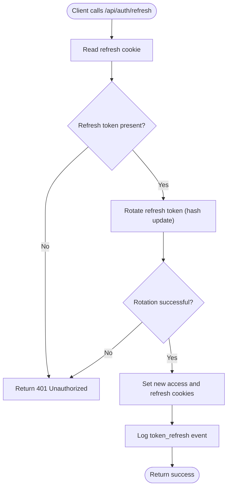
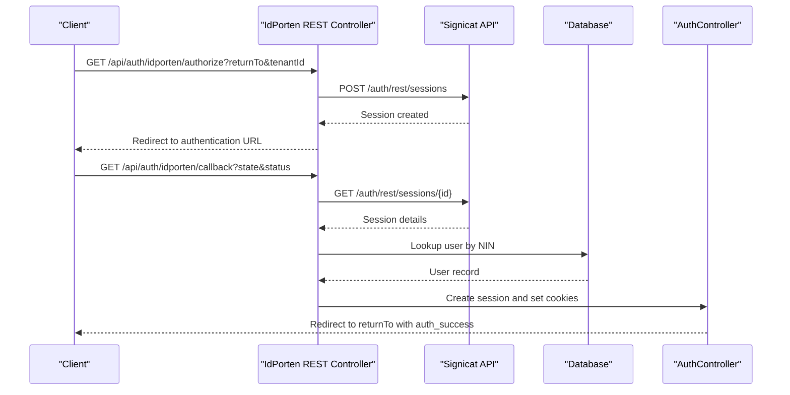
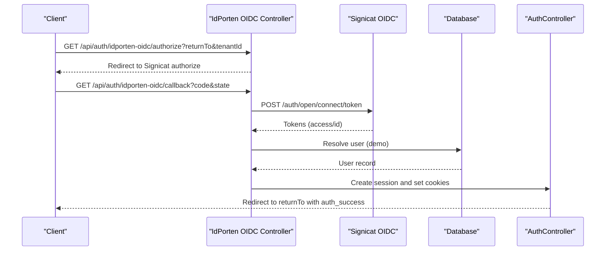

# Authentication Service

<cite>
**Referenced Files in This Document**
- [apps/api/src/modules/auth/auth.controller.ts](file://apps/api/src/modules/auth/auth.controller.ts)
- [apps/api/src/core/auth/jwt.service.ts](file://apps/api/src/core/auth/jwt.service.ts)
- [apps/api/src/modules/auth/session.service.ts](file://apps/api/src/modules/auth/session.service.ts)
- [apps/api/src/core/auth/jwt.middleware.ts](file://apps/api/src/core/auth/jwt.middleware.ts)
- [apps/api/src/modules/auth/idporten.controller.ts](file://apps/api/src/modules/auth/idporten.controller.ts)
- [apps/api/src/modules/auth/idporten-oidc.controller.ts](file://apps/api/src/modules/auth/idporten-oidc.controller.ts)
- [apps/api/src/modules/auth/vipps-user.service.ts](file://apps/api/src/modules/auth/vipps-user.service.ts)
- [apps/api/src/modules/auth/vipps-session-store.ts](file://apps/api/src/modules/auth/vipps-session-store.ts)
- [apps/api/src/modules/auth/tenant-data.service.ts](file://apps/api/src/modules/auth/tenant-data.service.ts)
- [apps/api/src/config/cookies.ts](file://apps/api/src/config/cookies.ts)
- [apps/api/src/core/auth/dev-token.service.ts](file://apps/api/src/core/auth/dev-token.service.ts)
- [apps/api/src/modules/auth/rbac.ts](file://apps/api/src/modules/auth/rbac.ts)
</cite>

## Table of Contents
1. [Introduction](#introduction)
2. [Project Structure](#project-structure)
3. [Core Components](#core-components)
4. [Architecture Overview](#architecture-overview)
5. [Detailed Component Analysis](#detailed-component-analysis)
6. [Dependency Analysis](#dependency-analysis)
7. [Performance Considerations](#performance-considerations)
8. [Troubleshooting Guide](#troubleshooting-guide)
9. [Conclusion](#conclusion)
10. [Appendices](#appendices)

## Introduction
This document describes the Authentication Service that powers user authentication, session management, and authorization across the platform. It covers login/logout flows, token refresh mechanisms, OAuth integrations with ID-porten (REST and OIDC), and Vipps Login integration. It also documents the API endpoints, session validation, security token management, error handling, and best practices for secure authentication flows.

## Project Structure
The authentication service is implemented primarily in the API application under the modules/auth directory. Supporting services include JWT handling, session management, tenant data retrieval, cookie configuration, and RBAC definitions. OAuth integrations for ID-porten and Vipps are implemented as separate controllers with dedicated session stores.

**Diagram sources**
- [apps/api/src/modules/auth/auth.controller.ts](file://apps/api/src/modules/auth/auth.controller.ts#L24-L703)
- [apps/api/src/core/auth/jwt.service.ts](file://apps/api/src/core/auth/jwt.service.ts#L45-L259)
- [apps/api/src/modules/auth/session.service.ts](file://apps/api/src/modules/auth/session.service.ts#L56-L323)
- [apps/api/src/core/auth/jwt.middleware.ts](file://apps/api/src/core/auth/jwt.middleware.ts#L14-L54)
- [apps/api/src/modules/auth/tenant-data.service.ts](file://apps/api/src/modules/auth/tenant-data.service.ts#L16-L88)
- [apps/api/src/modules/auth/rbac.ts](file://apps/api/src/modules/auth/rbac.ts#L135-L267)
- [apps/api/src/config/cookies.ts](file://apps/api/src/config/cookies.ts#L12-L77)
- [apps/api/src/core/auth/dev-token.service.ts](file://apps/api/src/core/auth/dev-token.service.ts#L27-L101)
- [apps/api/src/modules/auth/idporten.controller.ts](file://apps/api/src/modules/auth/idporten.controller.ts#L196-L789)
- [apps/api/src/modules/auth/idporten-oidc.controller.ts](file://apps/api/src/modules/auth/idporten-oidc.controller.ts#L53-L343)
- [apps/api/src/modules/auth/vipps-user.service.ts](file://apps/api/src/modules/auth/vipps-user.service.ts#L57-L349)
- [apps/api/src/modules/auth/vipps-session-store.ts](file://apps/api/src/modules/auth/vipps-session-store.ts#L71-L149)

**Section sources**
- [apps/api/src/modules/auth/auth.controller.ts](file://apps/api/src/modules/auth/auth.controller.ts#L24-L703)
- [apps/api/src/config/cookies.ts](file://apps/api/src/config/cookies.ts#L12-L77)

## Core Components
- AuthController: Provides endpoints for login, OAuth callback, session retrieval, logout, token refresh, CSRF token retrieval, demo token login, email login, national ID login, and provider listing.
- JwtService: Produces and validates signed JWT tokens with issuer/audience constraints and optional tenant subscription data.
- SessionService: Manages access/refresh tokens with rotation, session revocation, and cleanup.
- JwtMiddleware: Validates Authorization header tokens and attaches user context.
- TenantDataService: Loads tenant subscription and feature flags for JWT payload enrichment.
- RBAC: Defines roles, permissions, and inheritance for multi-level access control.
- Cookies Config: Enforces HttpOnly, Secure, SameSite=Lax, and cross-subdomain cookie policies.
- DevTokenService: Auto-generates real JWT tokens for development environments.
- OAuth Controllers: ID-porten REST and OIDC controllers handle provider-initiated flows and session management.
- Vipps Services: User mapping/linking and Redis-backed session storage for Vipps Login.

**Section sources**
- [apps/api/src/modules/auth/auth.controller.ts](file://apps/api/src/modules/auth/auth.controller.ts#L24-L703)
- [apps/api/src/core/auth/jwt.service.ts](file://apps/api/src/core/auth/jwt.service.ts#L45-L259)
- [apps/api/src/modules/auth/session.service.ts](file://apps/api/src/modules/auth/session.service.ts#L56-L323)
- [apps/api/src/core/auth/jwt.middleware.ts](file://apps/api/src/core/auth/jwt.middleware.ts#L14-L54)
- [apps/api/src/modules/auth/tenant-data.service.ts](file://apps/api/src/modules/auth/tenant-data.service.ts#L16-L88)
- [apps/api/src/modules/auth/rbac.ts](file://apps/api/src/modules/auth/rbac.ts#L135-L267)
- [apps/api/src/config/cookies.ts](file://apps/api/src/config/cookies.ts#L12-L77)
- [apps/api/src/core/auth/dev-token.service.ts](file://apps/api/src/core/auth/dev-token.service.ts#L27-L101)
- [apps/api/src/modules/auth/idporten.controller.ts](file://apps/api/src/modules/auth/idporten.controller.ts#L196-L789)
- [apps/api/src/modules/auth/idporten-oidc.controller.ts](file://apps/api/src/modules/auth/idporten-oidc.controller.ts#L53-L343)
- [apps/api/src/modules/auth/vipps-user.service.ts](file://apps/api/src/modules/auth/vipps-user.service.ts#L57-L349)
- [apps/api/src/modules/auth/vipps-session-store.ts](file://apps/api/src/modules/auth/vipps-session-store.ts#L71-L149)

## Architecture Overview
The authentication service follows a layered architecture:
- Presentation: AuthController exposes REST endpoints.
- Domain: SessionService manages tokens and sessions; TenantDataService enriches JWT payloads.
- Security: JwtService handles cryptographic signing/verification; JwtMiddleware enforces Authorization header validation; Cookies Config hardens transport security.
- Integrations: ID-porten REST and OIDC controllers orchestrate provider flows; VippsUserService and VippsSessionStore manage Vipps identity.
- Policy: RBAC maps roles to permissions for authorization decisions.

**Diagram sources**
- [apps/api/src/modules/auth/auth.controller.ts](file://apps/api/src/modules/auth/auth.controller.ts#L30-L102)
- [apps/api/src/core/auth/jwt.service.ts](file://apps/api/src/core/auth/jwt.service.ts#L66-L103)
- [apps/api/src/modules/auth/session.service.ts](file://apps/api/src/modules/auth/session.service.ts#L88-L131)

## Detailed Component Analysis

### AuthController
Responsibilities:
- Login via email/password, OAuth callback, demo token, national ID.
- Session retrieval with self-verification using JwtService.
- Logout with session revocation and cookie clearing.
- Token refresh with refresh token rotation.
- CSRF token retrieval.
- Provider listing for frontends.

Security highlights:
- HTTP-only cookies for access and refresh tokens.
- SameSite=Lax for CSRF protection.
- Cache-control headers to prevent response caching.
- Audit logging for login/logout/token refresh events.

Key endpoints:
- POST /api/auth/login
- POST /api/auth/callback
- GET /api/auth/session
- POST /api/auth/logout
- POST /api/auth/refresh
- GET /api/auth/csrf
- POST /api/auth/demo-token
- POST /api/auth/email
- POST /api/auth/national-id
- GET /api/auth/providers

Operational notes:
- Access token is short-lived (15 minutes).
- Refresh token is rotated on each refresh.
- Session validation occurs directly in controller for self-contained verification.

**Section sources**
- [apps/api/src/modules/auth/auth.controller.ts](file://apps/api/src/modules/auth/auth.controller.ts#L24-L703)
- [apps/api/src/config/cookies.ts](file://apps/api/src/config/cookies.ts#L12-L77)

### JwtService
Responsibilities:
- Generate signed JWT with HS256, issuer, and audience constraints.
- Verify tokens with tenant and subscription validation options.
- Decode tokens for diagnostics.
- Extract bearer tokens from Authorization headers.
- Check token expiration without full verification.

Security highlights:
- Minimum 32-character secret requirement.
- UUID validation for tenant IDs.
- Subscription data structure validation.

**Section sources**
- [apps/api/src/core/auth/jwt.service.ts](file://apps/api/src/core/auth/jwt.service.ts#L45-L259)

### SessionService
Responsibilities:
- Create sessions with opaque refresh tokens (SHA-256 hashed).
- Rotate refresh tokens on each refresh (one-time use).
- Revoke sessions by user or session ID.
- Cleanup expired sessions.
- Provide session statistics.

Security highlights:
- Refresh tokens stored as hashes, never in plaintext.
- One-time use refresh tokens invalidate previous tokens upon rotation.
- Automatic cleanup of expired sessions.

**Section sources**
- [apps/api/src/modules/auth/session.service.ts](file://apps/api/src/modules/auth/session.service.ts#L56-L323)

### JwtMiddleware
Responsibilities:
- Extract Bearer token from Authorization header.
- Verify token validity and attach userId/tenantId to request.
- Throw structured UnauthorizedError on failures.

**Section sources**
- [apps/api/src/core/auth/jwt.middleware.ts](file://apps/api/src/core/auth/jwt.middleware.ts#L14-L54)

### TenantDataService
Responsibilities:
- Load tenant slug, subscription, seat limits, feature flags, and enabled categories.
- Validate tenant status and subscription health.

**Section sources**
- [apps/api/src/modules/auth/tenant-data.service.ts](file://apps/api/src/modules/auth/tenant-data.service.ts#L16-L88)

### RBAC
Responsibilities:
- Define multi-level roles (SaaS, Tenant, Commune, Organization, Base).
- Map roles to permissions with wildcards.
- Compute inherited permissions and role hierarchy.
- Provide capability projection for UI/API consumption.

**Section sources**
- [apps/api/src/modules/auth/rbac.ts](file://apps/api/src/modules/auth/rbac.ts#L135-L267)

### Cookies Configuration
Responsibilities:
- Define cookie names, lifetimes, and serialization options.
- Enforce HttpOnly, Secure, SameSite=Lax, and cross-subdomain domain in production.
- Provide clear options for logout.

**Section sources**
- [apps/api/src/config/cookies.ts](file://apps/api/src/config/cookies.ts#L12-L77)

### DevTokenService
Responsibilities:
- Auto-generate real JWT tokens for development/staging.
- Fail-safe in production to prevent accidental exposure.
- Allow configurable dev user and tenant.

**Section sources**
- [apps/api/src/core/auth/dev-token.service.ts](file://apps/api/src/core/auth/dev-token.service.ts#L27-L101)

### ID-porten REST Controller
Responsibilities:
- Initiate authentication via REST API with tenant-specific URLs.
- Create provider sessions and redirect users.
- Poll or fetch session status.
- Handle callbacks, extract national identity number (NIN), and create local sessions.
- Validate returnTo URLs to prevent open redirect vulnerabilities.

Security highlights:
- Token caching with expiry buffer.
- Fallback between tenant and generic API endpoints.
- Audit logs for initiation, success, failure, and validation attempts.

**Section sources**
- [apps/api/src/modules/auth/idporten.controller.ts](file://apps/api/src/modules/auth/idporten.controller.ts#L196-L789)

### ID-porten OIDC Controller
Responsibilities:
- Initiate OIDC flow with state and nonce.
- Exchange authorization code for tokens.
- Decode and verify ID token claims.
- Create local sessions and set cookies.
- Retrieve session state for debugging.

**Section sources**
- [apps/api/src/modules/auth/idporten-oidc.controller.ts](file://apps/api/src/modules/auth/idporten-oidc.controller.ts#L53-L343)

### Vipps Integration
Responsibilities:
- VippsUserService: Find or create users from Vipps claims; link existing accounts; update metadata.
- VippsSessionStore: Redis-backed session storage with in-memory fallback for state management.

**Section sources**
- [apps/api/src/modules/auth/vipps-user.service.ts](file://apps/api/src/modules/auth/vipps-user.service.ts#L57-L349)
- [apps/api/src/modules/auth/vipps-session-store.ts](file://apps/api/src/modules/auth/vipps-session-store.ts#L71-L149)

## Dependency Analysis
The authentication service exhibits strong cohesion around JWT, sessions, and cookies, with clear separation of concerns for OAuth integrations and RBAC.

**Diagram sources**
- [apps/api/src/modules/auth/auth.controller.ts](file://apps/api/src/modules/auth/auth.controller.ts#L24-L703)
- [apps/api/src/core/auth/jwt.service.ts](file://apps/api/src/core/auth/jwt.service.ts#L45-L259)
- [apps/api/src/modules/auth/session.service.ts](file://apps/api/src/modules/auth/session.service.ts#L56-L323)
- [apps/api/src/modules/auth/tenant-data.service.ts](file://apps/api/src/modules/auth/tenant-data.service.ts#L16-L88)
- [apps/api/src/modules/auth/rbac.ts](file://apps/api/src/modules/auth/rbac.ts#L352-L367)
- [apps/api/src/config/cookies.ts](file://apps/api/src/config/cookies.ts#L12-L77)

**Section sources**
- [apps/api/src/modules/auth/auth.controller.ts](file://apps/api/src/modules/auth/auth.controller.ts#L24-L703)
- [apps/api/src/core/auth/jwt.service.ts](file://apps/api/src/core/auth/jwt.service.ts#L45-L259)
- [apps/api/src/modules/auth/session.service.ts](file://apps/api/src/modules/auth/session.service.ts#L56-L323)
- [apps/api/src/modules/auth/tenant-data.service.ts](file://apps/api/src/modules/auth/tenant-data.service.ts#L16-L88)
- [apps/api/src/modules/auth/rbac.ts](file://apps/api/src/modules/auth/rbac.ts#L352-L367)
- [apps/api/src/config/cookies.ts](file://apps/api/src/config/cookies.ts#L12-L77)

## Performance Considerations
- Short-lived access tokens (15 minutes) reduce risk and require frequent refreshes; ensure clients implement efficient refresh strategies.
- Refresh token rotation introduces database writes on each refresh; monitor write throughput and consider batching if needed.
- Tenant data enrichment adds a database query per token generation; cache tenant data at the application level if appropriate.
- OAuth provider calls (ID-porten) introduce network latency; implement timeouts and retry with exponential backoff.
- Redis-backed session stores for OAuth should be monitored for connection retries and TTL cleanup.

[No sources needed since this section provides general guidance]

## Troubleshooting Guide
Common issues and resolutions:
- Invalid or expired tokens: Ensure clients re-authenticate or refresh tokens using the refresh endpoint.
- Missing or invalid Authorization header: Verify Bearer token format and presence.
- Session not found or inactive: Confirm user status and that cookies are set correctly.
- OAuth callback failures: Check returnTo validation, state/nonce integrity, and provider session status.
- Logout not clearing sessions: Verify session revocation and cookie clear options match cookie paths and domains.

Error handling patterns:
- Structured UnauthorizedError thrown by JwtMiddleware for invalid tokens.
- AuthController returns localized error responses with standardized codes.
- Audit logs capture authentication events and anomalies for forensic analysis.

**Section sources**
- [apps/api/src/core/auth/jwt.middleware.ts](file://apps/api/src/core/auth/jwt.middleware.ts#L14-L54)
- [apps/api/src/modules/auth/auth.controller.ts](file://apps/api/src/modules/auth/auth.controller.ts#L244-L332)
- [apps/api/src/modules/auth/idporten.controller.ts](file://apps/api/src/modules/auth/idporten.controller.ts#L368-L505)

## Conclusion
The Authentication Service provides a robust, secure, and extensible foundation for user authentication, session management, and authorization. It leverages industry-standard practices such as HTTP-only cookies, refresh token rotation, tenant-aware JWT payloads, and comprehensive RBAC. The modular design supports multiple authentication providers and enables future enhancements while maintaining strong security guarantees.

[No sources needed since this section summarizes without analyzing specific files]

## Appendices

### API Reference: Authentication Endpoints
- POST /api/auth/login
  - Description: Authenticate via email/password and set HTTP-only access cookie.
  - Response: User data and token expiration.
- POST /api/auth/callback
  - Description: OAuth callback handler; creates session and sets cookies.
  - Response: User data and token expiration.
- GET /api/auth/session
  - Description: Self-verifying session retrieval using access token.
  - Response: User, permissions, modules, capabilities, and expiration.
- POST /api/auth/logout
  - Description: Revoke sessions and clear cookies.
  - Response: Success message.
- POST /api/auth/refresh
  - Description: Rotate refresh token and issue new access/refresh cookies.
  - Response: Success message.
- GET /api/auth/csrf
  - Description: Retrieve CSRF token for double-submit protection.
  - Response: CSRF token.
- POST /api/auth/demo-token
  - Description: Demo token login for development environments.
  - Response: User data and token expiration.
- POST /api/auth/email
  - Description: Email/password login alias.
- POST /api/auth/national-id
  - Description: National ID login for testing.
  - Response: User data and token expiration.
- GET /api/auth/providers
  - Description: List available authentication providers.

**Section sources**
- [apps/api/src/modules/auth/auth.controller.ts](file://apps/api/src/modules/auth/auth.controller.ts#L24-L703)

### Token Refresh Mechanism

**Diagram sources**
- [apps/api/src/modules/auth/auth.controller.ts](file://apps/api/src/modules/auth/auth.controller.ts#L387-L442)
- [apps/api/src/modules/auth/session.service.ts](file://apps/api/src/modules/auth/session.service.ts#L141-L198)

### OAuth Integration: ID-porten REST

**Diagram sources**
- [apps/api/src/modules/auth/idporten.controller.ts](file://apps/api/src/modules/auth/idporten.controller.ts#L206-L336)
- [apps/api/src/modules/auth/idporten.controller.ts](file://apps/api/src/modules/auth/idporten.controller.ts#L346-L735)

### OAuth Integration: ID-porten OIDC

**Diagram sources**
- [apps/api/src/modules/auth/idporten-oidc.controller.ts](file://apps/api/src/modules/auth/idporten-oidc.controller.ts#L59-L113)
- [apps/api/src/modules/auth/idporten-oidc.controller.ts](file://apps/api/src/modules/auth/idporten-oidc.controller.ts#L119-L290)

### Best Practices for Secure Authentication Flows
- Always use HTTP-only cookies for tokens.
- Enforce SameSite=Lax for CSRF protection; adjust carefully for OAuth flows.
- Implement refresh token rotation to mitigate token reuse.
- Validate and sanitize returnTo URLs to prevent open redirect.
- Log all authentication events for auditing and incident response.
- Use tenant-aware JWT validation to prevent cross-tenant token misuse.
- Monitor session statistics and clean up expired sessions regularly.
- For development, use DevTokenService to avoid exposing secrets.

[No sources needed since this section provides general guidance]