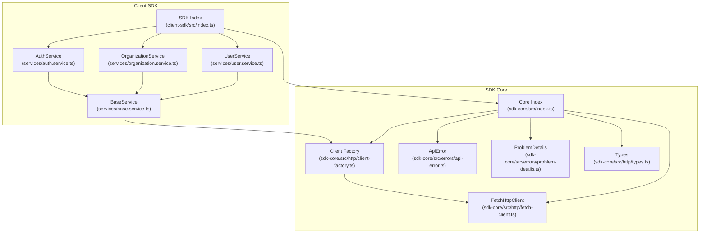
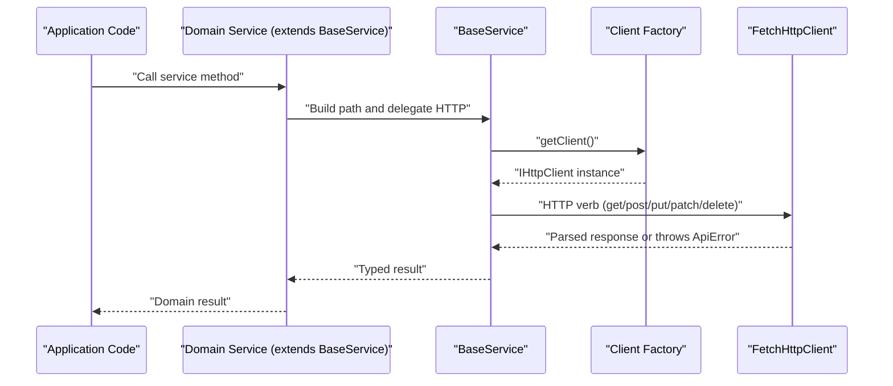
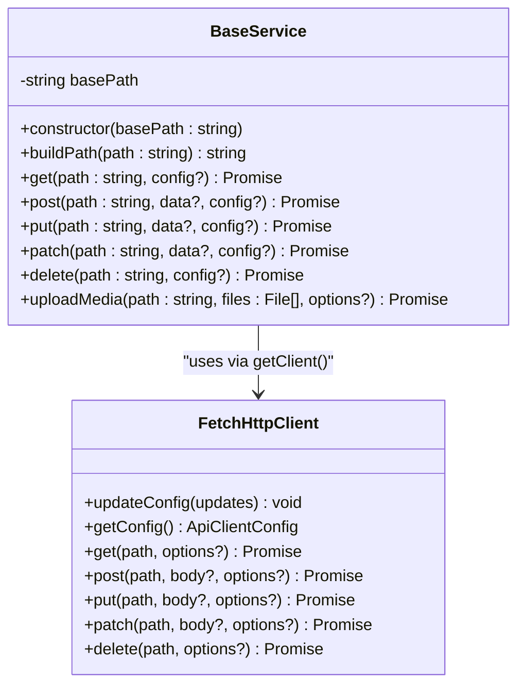
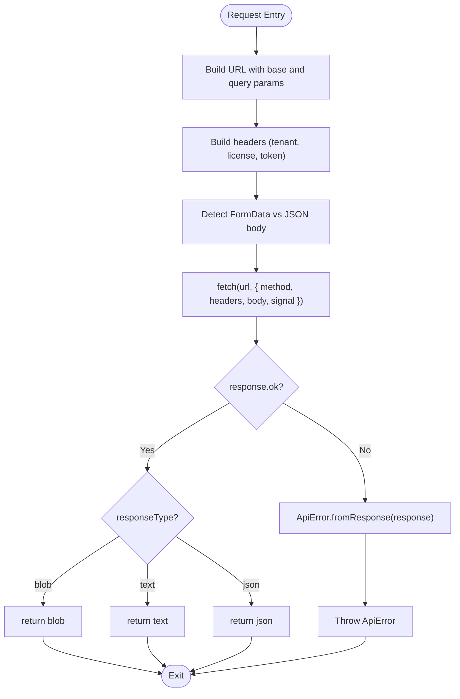
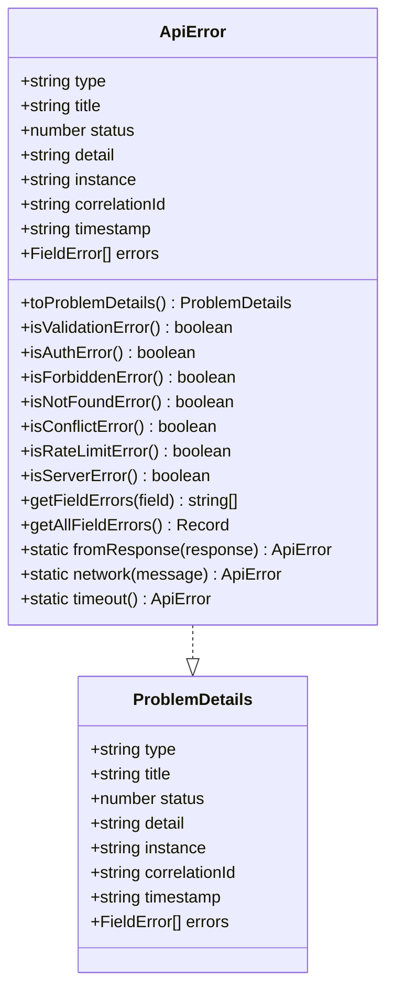
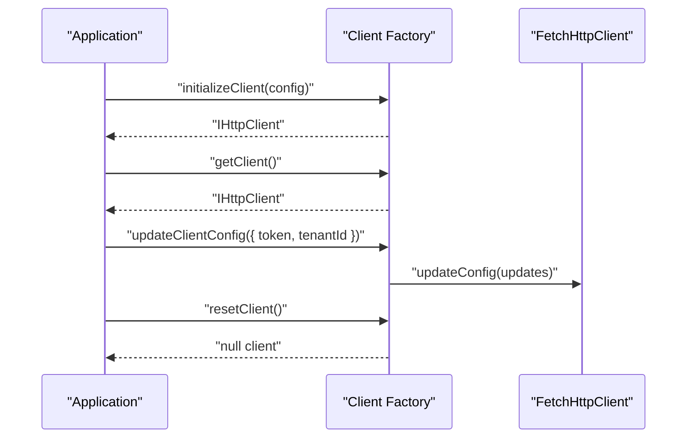
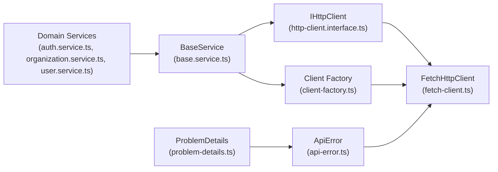

# Base Service

<cite>
**Referenced Files in This Document**
- [base.service.ts](file://packages/client-sdk/src/services/base.service.ts)
- [fetch-client.ts](file://packages/sdk-core/src/http/fetch-client.ts)
- [client-factory.ts](file://packages/sdk-core/src/http/client-factory.ts)
- [types.ts](file://packages/sdk-core/src/http/types.ts)
- [api-error.ts](file://packages/sdk-core/src/errors/api-error.ts)
- [problem-details.ts](file://packages/sdk-core/src/errors/problem-details.ts)
- [http-client.interface.ts](file://packages/client-sdk/src/core/http-client.interface.ts)
- [auth.service.ts](file://packages/client-sdk/src/services/auth.service.ts)
- [organization.service.ts](file://packages/client-sdk/src/services/organization.service.ts)
- [user.service.ts](file://packages/client-sdk/src/services/user.service.ts)
- [index.ts (client-sdk)](file://packages/client-sdk/src/index.ts)
- [index.ts (sdk-core)](file://packages/sdk-core/src/index.ts)
</cite>

## Table of Contents
1. [Introduction](#introduction)
2. [Project Structure](#project-structure)
3. [Core Components](#core-components)
4. [Architecture Overview](#architecture-overview)
5. [Detailed Component Analysis](#detailed-component-analysis)
6. [Dependency Analysis](#dependency-analysis)
7. [Performance Considerations](#performance-considerations)
8. [Troubleshooting Guide](#troubleshooting-guide)
9. [Conclusion](#conclusion)

## Introduction
This document explains the Base Service class that underpins all client SDK services. It covers the shared HTTP client integration, standardized request/response patterns, error handling using RFC 7807 Problem Details, and utility methods such as media uploads. It also describes the service lifecycle, configuration options, and best practices for extending the base class to implement custom domain services.

## Project Structure
The Base Service resides in the client SDK and integrates with the schema-agnostic SDK Core for HTTP transport and error handling. Services are organized by domain and re-exported via a central index for convenient consumption.

**Diagram sources**
- [base.service.ts](file://packages/client-sdk/src/services/base.service.ts#L1-L100)
- [client-factory.ts](file://packages/sdk-core/src/http/client-factory.ts#L1-L108)
- [fetch-client.ts](file://packages/sdk-core/src/http/fetch-client.ts#L1-L239)
- [api-error.ts](file://packages/sdk-core/src/errors/api-error.ts#L1-L209)
- [problem-details.ts](file://packages/sdk-core/src/errors/problem-details.ts#L1-L285)
- [types.ts](file://packages/sdk-core/src/http/types.ts#L1-L82)
- [auth.service.ts](file://packages/client-sdk/src/services/auth.service.ts#L1-L342)
- [organization.service.ts](file://packages/client-sdk/src/services/organization.service.ts#L1-L261)
- [user.service.ts](file://packages/client-sdk/src/services/user.service.ts#L1-L150)
- [index.ts (client-sdk)](file://packages/client-sdk/src/index.ts#L1-L168)
- [index.ts (sdk-core)](file://packages/sdk-core/src/index.ts#L1-L94)

**Section sources**
- [base.service.ts](file://packages/client-sdk/src/services/base.service.ts#L1-L100)
- [client-factory.ts](file://packages/sdk-core/src/http/client-factory.ts#L1-L108)
- [fetch-client.ts](file://packages/sdk-core/src/http/fetch-client.ts#L1-L239)
- [api-error.ts](file://packages/sdk-core/src/errors/api-error.ts#L1-L209)
- [problem-details.ts](file://packages/sdk-core/src/errors/problem-details.ts#L1-L285)
- [types.ts](file://packages/sdk-core/src/http/types.ts#L1-L82)
- [index.ts (client-sdk)](file://packages/client-sdk/src/index.ts#L1-L168)
- [index.ts (sdk-core)](file://packages/sdk-core/src/index.ts#L1-L94)

## Core Components
- BaseService: An abstract base class that encapsulates HTTP verbs, path building, and media upload utilities. It depends on a shared HTTP client obtained from the client factory.
- FetchHttpClient: A concrete HTTP client implementing RFC 7807 error handling, multi-tenant headers, token refresh, and response type handling.
- Client Factory: Initializes and exposes a singleton HTTP client, supports updates and resets, and exposes convenience setters for tokens and tenant IDs.
- Error Model: ApiError and ProblemDetails provide structured, RFC 7807-compliant error handling across all services.

Key responsibilities:
- Centralized HTTP transport and configuration
- Consistent error handling and categorization
- Shared utilities for path construction and media uploads
- Extensibility for domain-specific services

**Section sources**
- [base.service.ts](file://packages/client-sdk/src/services/base.service.ts#L11-L99)
- [fetch-client.ts](file://packages/sdk-core/src/http/fetch-client.ts#L11-L238)
- [client-factory.ts](file://packages/sdk-core/src/http/client-factory.ts#L14-L107)
- [api-error.ts](file://packages/sdk-core/src/errors/api-error.ts#L14-L208)
- [problem-details.ts](file://packages/sdk-core/src/errors/problem-details.ts#L12-L284)

## Architecture Overview
The Base Service delegates all HTTP operations to a shared HTTP client. Services extend the base class to define domain-specific endpoints and request/response shapes. The client factory ensures a single, configurable client instance is used across the SDK.

**Diagram sources**
- [base.service.ts](file://packages/client-sdk/src/services/base.service.ts#L18-L64)
- [client-factory.ts](file://packages/sdk-core/src/http/client-factory.ts#L28-L33)
- [fetch-client.ts](file://packages/sdk-core/src/http/fetch-client.ts#L75-L185)

## Detailed Component Analysis

### Base Service
BaseService provides:
- Path composition via a base path and relative path builder
- Typed HTTP verbs (GET, POST, PUT, PATCH, DELETE)
- Media upload helper using multipart/form-data
- Access to a shared HTTP client via the client factory

Common patterns:
- All service methods construct the full URL using the base path and relative path
- Responses are strongly typed via generics
- Media uploads append files and optional fields to FormData and send as multipart

**Diagram sources**
- [base.service.ts](file://packages/client-sdk/src/services/base.service.ts#L11-L99)
- [fetch-client.ts](file://packages/sdk-core/src/http/fetch-client.ts#L11-L238)

**Section sources**
- [base.service.ts](file://packages/client-sdk/src/services/base.service.ts#L11-L99)

### HTTP Client Integration
FetchHttpClient implements IHttpClient and:
- Builds URLs with query parameters
- Sets default and tenant-specific headers
- Handles JSON vs multipart/form-data bodies
- Implements automatic token refresh on 401
- Emits an auth expired event and invokes onUnauthorized
- Supports response types: json, blob, text
- Converts network failures and timeouts into ApiError

**Diagram sources**
- [fetch-client.ts](file://packages/sdk-core/src/http/fetch-client.ts#L75-L185)

**Section sources**
- [fetch-client.ts](file://packages/sdk-core/src/http/fetch-client.ts#L11-L238)
- [types.ts](file://packages/sdk-core/src/http/types.ts#L46-L81)

### Error Handling Mechanisms
ApiError implements RFC 7807 Problem Details and offers:
- Categorization helpers (validation, auth, forbidden, not found, conflict, rate limit, server)
- Field-level validation extraction
- Static constructors for network and timeout errors
- Compatibility shims for legacy error formats

**Diagram sources**
- [problem-details.ts](file://packages/sdk-core/src/errors/problem-details.ts#L12-L284)
- [api-error.ts](file://packages/sdk-core/src/errors/api-error.ts#L14-L208)

**Section sources**
- [api-error.ts](file://packages/sdk-core/src/errors/api-error.ts#L14-L208)
- [problem-details.ts](file://packages/sdk-core/src/errors/problem-details.ts#L12-L284)

### Service Lifecycle and Initialization
- Initialize the client globally with a base URL and optional tenant/token headers
- Retrieve the singleton client instance for all services
- Update configuration after login or tenant switch
- Reset the client for logout or testing

**Diagram sources**
- [client-factory.ts](file://packages/sdk-core/src/http/client-factory.ts#L18-L99)

**Section sources**
- [client-factory.ts](file://packages/sdk-core/src/http/client-factory.ts#L18-L99)
- [index.ts (sdk-core)](file://packages/sdk-core/src/index.ts#L31-L51)
- [index.ts (client-sdk)](file://packages/client-sdk/src/index.ts#L30-L43)

### Request/Response Transformation Patterns
- Path construction: Services pass relative paths; the base class prepends the base path
- Query parameters: Provided via RequestOptions.params
- Response types: JSON by default; blob/text supported for binary or text responses
- Error propagation: All non-2xx responses are parsed into ApiError and thrown

Examples of usage in services:
- Authentication service constructs absolute paths and handles session flows
- Organization/User services leverage typed wrappers and optional response types
- Media upload uses multipart/form-data with optional fields

**Section sources**
- [base.service.ts](file://packages/client-sdk/src/services/base.service.ts#L22-L64)
- [auth.service.ts](file://packages/client-sdk/src/services/auth.service.ts#L42-L104)
- [organization.service.ts](file://packages/client-sdk/src/services/organization.service.ts#L35-L121)
- [user.service.ts](file://packages/client-sdk/src/services/user.service.ts#L18-L145)

### Extending Base Service for Custom Implementations
Steps to create a new domain service:
1. Extend BaseService with a domain-specific base path
2. Define strongly typed methods delegating to get/post/put/patch/delete
3. Use buildPath for endpoint composition
4. Leverage uploadMedia for multipart uploads when needed
5. Rely on the shared client for authentication, headers, and error handling

Best practices:
- Keep services focused on a single responsibility
- Use typed DTOs and response wrappers
- Prefer relative paths and buildPath for readability
- Use uploadMedia for file operations to ensure correct FormData handling
- Handle ApiError categories appropriately in service methods

**Section sources**
- [base.service.ts](file://packages/client-sdk/src/services/base.service.ts#L11-L99)
- [organization.service.ts](file://packages/client-sdk/src/services/organization.service.ts#L119-L121)
- [user.service.ts](file://packages/client-sdk/src/services/user.service.ts#L253-L255)

## Dependency Analysis
The Base Service depends on:
- IHttpClient abstraction (implemented by FetchHttpClient)
- Client factory for obtaining the singleton client
- Error model for consistent error handling

Services depend on the Base Service and, indirectly, on the HTTP client and error model.

**Diagram sources**
- [http-client.interface.ts](file://packages/client-sdk/src/core/http-client.interface.ts#L32-L38)
- [fetch-client.ts](file://packages/sdk-core/src/http/fetch-client.ts#L11-L238)
- [client-factory.ts](file://packages/sdk-core/src/http/client-factory.ts#L11-L33)
- [base.service.ts](file://packages/client-sdk/src/services/base.service.ts#L7-L20)
- [auth.service.ts](file://packages/client-sdk/src/services/auth.service.ts#L42-L45)
- [organization.service.ts](file://packages/client-sdk/src/services/organization.service.ts#L35-L38)
- [user.service.ts](file://packages/client-sdk/src/services/user.service.ts#L18-L21)
- [api-error.ts](file://packages/sdk-core/src/errors/api-error.ts#L14-L208)
- [problem-details.ts](file://packages/sdk-core/src/errors/problem-details.ts#L12-L284)

**Section sources**
- [http-client.interface.ts](file://packages/client-sdk/src/core/http-client.interface.ts#L32-L38)
- [base.service.ts](file://packages/client-sdk/src/services/base.service.ts#L7-L20)
- [client-factory.ts](file://packages/sdk-core/src/http/client-factory.ts#L11-L33)
- [fetch-client.ts](file://packages/sdk-core/src/http/fetch-client.ts#L11-L238)
- [api-error.ts](file://packages/sdk-core/src/errors/api-error.ts#L14-L208)
- [problem-details.ts](file://packages/sdk-core/src/errors/problem-details.ts#L12-L284)

## Performance Considerations
- Use appropriate response types (json/blob/text) to avoid unnecessary conversions
- Leverage query keys and caching via the SDK’s query layer to minimize redundant requests
- Avoid excessive multipart uploads; batch files when possible
- Configure timeouts and retry policies thoughtfully to balance reliability and responsiveness

## Troubleshooting Guide
Common issues and resolutions:
- Client not initialized: Ensure initializeClient is called before any service usage
- Authentication failures: Verify token and onUnauthorized handlers; the client attempts a single token refresh on 401
- Network errors: Inspect ApiError.network and ApiError.timeout for diagnostics
- Validation errors: Use ApiError.isValidationError and ApiError.getFieldErrors to extract field-level messages
- Multi-tenant requests: Confirm tenantId and licenseKey headers are set via updateClientConfig

**Section sources**
- [client-factory.ts](file://packages/sdk-core/src/http/client-factory.ts#L28-L33)
- [fetch-client.ts](file://packages/sdk-core/src/http/fetch-client.ts#L108-L142)
- [api-error.ts](file://packages/sdk-core/src/errors/api-error.ts#L78-L158)

## Conclusion
BaseService provides a robust, extensible foundation for all client SDK services. By leveraging a shared HTTP client, consistent error handling, and standardized utilities, services remain cohesive, maintainable, and easy to extend. Follow the initialization and configuration patterns, adhere to typed request/response contracts, and use the provided error utilities to deliver reliable domain services.