# Booking Service

<cite>
**Referenced Files in This Document**
- [booking.controller.ts](file://apps/api/src/modules/booking/booking.controller.ts)
- [booking.service.ts](file://apps/api/src/modules/booking/booking.service.ts)
- [booking.repository.ts](file://apps/api/src/modules/booking/booking.repository.ts)
- [booking.mapper.ts](file://apps/api/src/modules/booking/booking.mapper.ts)
- [booking.schema.ts](file://apps/api/src/schemas/booking.schema.ts)
- [calendar.service.ts](file://apps/api/src/modules/calendar/calendar.service.ts)
- [calendar.schema.ts](file://apps/api/src/schemas/calendar.schema.ts)
- [booking-contracts.controller.ts](file://apps/api/src/modules/bookings/booking-contracts.controller.ts)
- [booking-contracts.service.ts](file://apps/api/src/modules/bookings/booking-contracts.service.ts)
- [openapi.yaml](file://apps/api/docs/openapi.yaml)
</cite>

## Table of Contents
1. [Introduction](#introduction)
2. [Project Structure](#project-structure)
3. [Core Components](#core-components)
4. [Architecture Overview](#architecture-overview)
5. [Detailed Component Analysis](#detailed-component-analysis)
6. [Dependency Analysis](#dependency-analysis)
7. [Performance Considerations](#performance-considerations)
8. [Troubleshooting Guide](#troubleshooting-guide)
9. [Conclusion](#conclusion)
10. [Appendices](#appendices)

## Introduction
This document provides comprehensive documentation for the Booking Service, covering the complete booking lifecycle: creation, modification, cancellation, approval/denial, and state management. It explains calendar integration, availability checking, conflict detection, and approval workflows. It also includes a complete API reference for booking operations, calendar synchronization, real-time updates, contract-first previews, quote generation, and integration points with the broader platform.

## Project Structure
The Booking Service is implemented as a modular Fastify module with clear separation of concerns:
- Controller layer: HTTP endpoints and request validation
- Service layer: Business logic, state transitions, and policy enforcement
- Repository layer: Data access and optimistic locking
- Mapper layer: Projection DTOs for UI consumption
- Schemas: Validation and typed DTOs for requests, responses, and projections
- Calendar integration: Separate calendar service for availability matrices and configuration
- Contracts: Contract-first endpoints for price previews and recurring previews

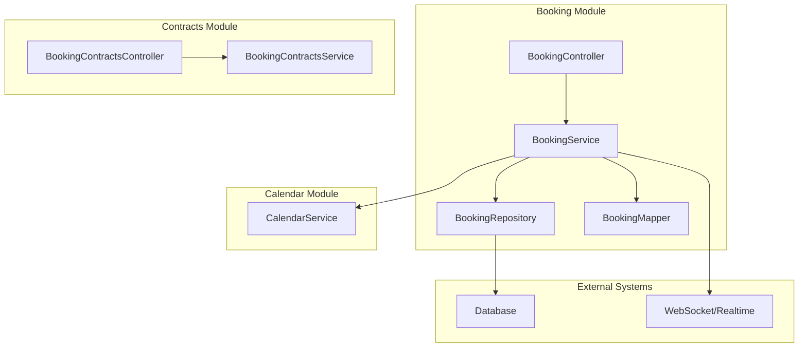

**Diagram sources**
- [booking.controller.ts](file://apps/api/src/modules/booking/booking.controller.ts#L21-L418)
- [booking.service.ts](file://apps/api/src/modules/booking/booking.service.ts#L43-L1238)
- [booking.repository.ts](file://apps/api/src/modules/booking/booking.repository.ts#L12-L287)
- [booking.mapper.ts](file://apps/api/src/modules/booking/booking.mapper.ts#L1-L654)
- [calendar.service.ts](file://apps/api/src/modules/calendar/calendar.service.ts#L74-L667)
- [booking-contracts.controller.ts](file://apps/api/src/modules/bookings/booking-contracts.controller.ts#L20-L53)
- [booking-contracts.service.ts](file://apps/api/src/modules/bookings/booking-contracts.service.ts#L36-L222)

**Section sources**
- [booking.controller.ts](file://apps/api/src/modules/booking/booking.controller.ts#L1-L418)
- [booking.service.ts](file://apps/api/src/modules/booking/booking.service.ts#L1-L1240)
- [booking.repository.ts](file://apps/api/src/modules/booking/booking.repository.ts#L1-L288)
- [booking.mapper.ts](file://apps/api/src/modules/booking/booking.mapper.ts#L1-L654)
- [calendar.service.ts](file://apps/api/src/modules/calendar/calendar.service.ts#L1-L668)
- [booking-contracts.controller.ts](file://apps/api/src/modules/bookings/booking-contracts.controller.ts#L1-L54)
- [booking-contracts.service.ts](file://apps/api/src/modules/bookings/booking-contracts.service.ts#L1-L223)

## Core Components
- BookingController: Exposes REST endpoints for listing, creating, updating, confirming, cancelling, completing, approving, denying, pricing calculation, calendar retrieval, and recurring operations. It enforces RBAC pre-handlers and tenant/user context extraction.
- BookingService: Implements core business logic including availability checks with buffer time, optimistic locking, state transitions, case handler scope validation, recurring booking generation with conflict policies, quote generation, and approval/denial workflows.
- BookingRepository: Provides data access with pagination, filters, optimistic locking via version increments, and organization-scoped queries via rental object joins.
- BookingMapper: Transforms database entities into UI-ready DTOs (card, details, receipts, calendar events) with permissions, actions, and i18n labels.
- CalendarService: Generates calendar configuration and availability matrices, integrating allocations, bookings, opening hours, and scope validation.
- BookingContractsController/Service: Contract-first endpoints for price previews and recurring previews, returning structured DTOs to drive UI logic.

**Section sources**
- [booking.controller.ts](file://apps/api/src/modules/booking/booking.controller.ts#L21-L418)
- [booking.service.ts](file://apps/api/src/modules/booking/booking.service.ts#L43-L1238)
- [booking.repository.ts](file://apps/api/src/modules/booking/booking.repository.ts#L12-L287)
- [booking.mapper.ts](file://apps/api/src/modules/booking/booking.mapper.ts#L1-L654)
- [calendar.service.ts](file://apps/api/src/modules/calendar/calendar.service.ts#L74-L667)
- [booking-contracts.controller.ts](file://apps/api/src/modules/bookings/booking-contracts.controller.ts#L20-L53)
- [booking-contracts.service.ts](file://apps/api/src/modules/bookings/booking-contracts.service.ts#L36-L222)

## Architecture Overview
The Booking Service follows a layered architecture:
- Presentation: Controllers define endpoints and apply RBAC and validation.
- Application: Services encapsulate business rules, state transitions, and policy enforcement.
- Persistence: Repository abstracts data access with optimistic locking and organization-scoped filters.
- Projection: Mapper transforms domain entities into UI DTOs.
- Integration: Calendar service provides availability matrices and configuration; contracts service provides contract-first DTOs.

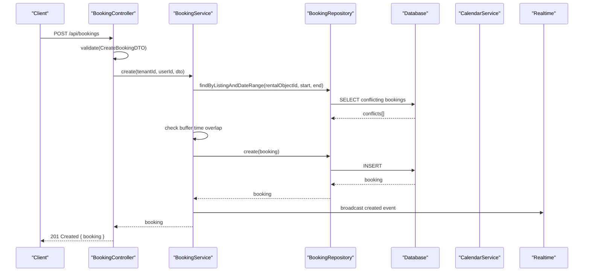

**Diagram sources**
- [booking.controller.ts](file://apps/api/src/modules/booking/booking.controller.ts#L73-L80)
- [booking.service.ts](file://apps/api/src/modules/booking/booking.service.ts#L54-L138)
- [booking.repository.ts](file://apps/api/src/modules/booking/booking.repository.ts#L151-L164)
- [calendar.service.ts](file://apps/api/src/modules/calendar/calendar.service.ts#L195-L288)

## Detailed Component Analysis

### Booking Creation Workflow
- Validates input DTO and tenant/user context.
- Loads rental object metadata to extract buffer time.
- Checks existing bookings in the requested time range (including buffer time).
- Creates booking with status "pending".
- Logs audit events and broadcasts real-time updates.

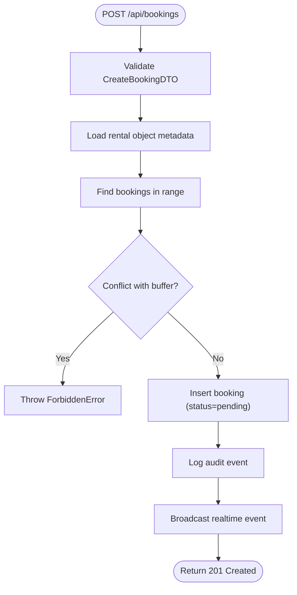

**Diagram sources**
- [booking.controller.ts](file://apps/api/src/modules/booking/booking.controller.ts#L73-L80)
- [booking.service.ts](file://apps/api/src/modules/booking/booking.service.ts#L54-L138)
- [booking.repository.ts](file://apps/api/src/modules/booking/booking.repository.ts#L151-L164)

**Section sources**
- [booking.controller.ts](file://apps/api/src/modules/booking/booking.controller.ts#L73-L80)
- [booking.service.ts](file://apps/api/src/modules/booking/booking.service.ts#L54-L138)
- [booking.repository.ts](file://apps/api/src/modules/booking/booking.repository.ts#L151-L164)

### State Management and Transitions
Supported statuses: pending, confirmed, cancelled, completed, approved, denied. Transitions are enforced with optimistic locking and audit logging.

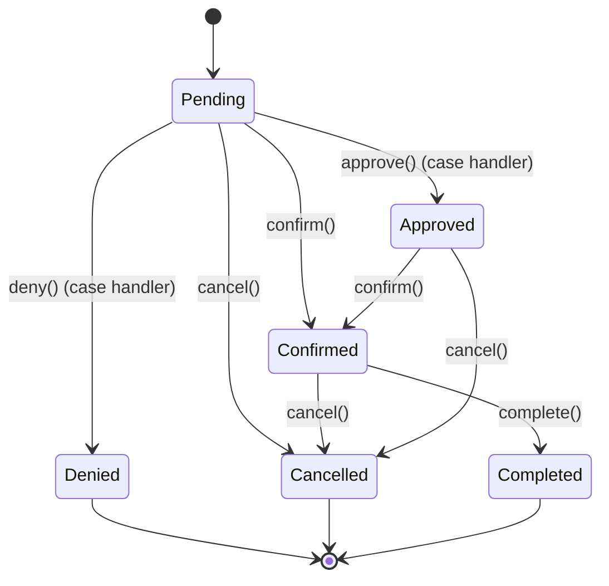

**Diagram sources**
- [booking.service.ts](file://apps/api/src/modules/booking/booking.service.ts#L165-L268)
- [booking.service.ts](file://apps/api/src/modules/booking/booking.service.ts#L344-L408)
- [booking.service.ts](file://apps/api/src/modules/booking/booking.service.ts#L1137-L1237)

**Section sources**
- [booking.service.ts](file://apps/api/src/modules/booking/booking.service.ts#L165-L268)
- [booking.service.ts](file://apps/api/src/modules/booking/booking.service.ts#L344-L408)
- [booking.service.ts](file://apps/api/src/modules/booking/booking.service.ts#L1137-L1237)

### Availability Checking and Conflict Detection
- Uses repository method to find overlapping bookings within a date range.
- Applies buffer time from rental object metadata to prevent adjacent bookings.
- For recurring previews, generates occurrences and checks conflicts per occurrence.

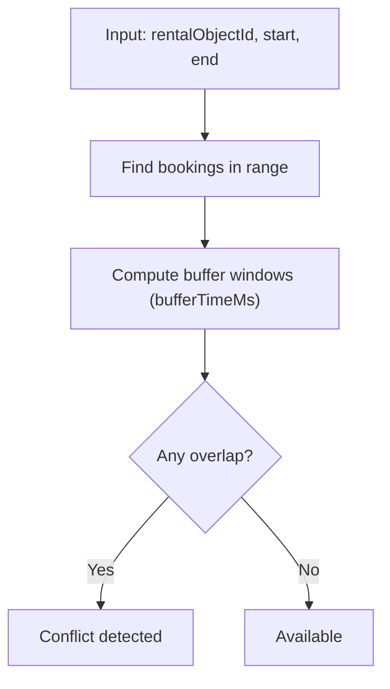

**Diagram sources**
- [booking.service.ts](file://apps/api/src/modules/booking/booking.service.ts#L68-L92)
- [booking.service.ts](file://apps/api/src/modules/booking/booking.service.ts#L895-L930)

**Section sources**
- [booking.service.ts](file://apps/api/src/modules/booking/booking.service.ts#L68-L92)
- [booking.service.ts](file://apps/api/src/modules/booking/booking.service.ts#L895-L930)

### Approval and Denial Workflows
- Case handler scope validation ensures only authorized users can approve/deny.
- Denial preserves existing notes and stores denial metadata.
- Approve/Deny update status and log audit events with metadata.

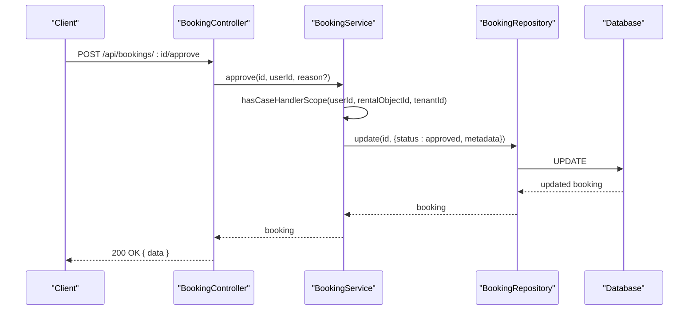

**Diagram sources**
- [booking.controller.ts](file://apps/api/src/modules/booking/booking.controller.ts#L122-L134)
- [booking.service.ts](file://apps/api/src/modules/booking/booking.service.ts#L344-L408)
- [booking.service.ts](file://apps/api/src/modules/booking/booking.service.ts#L1137-L1186)

**Section sources**
- [booking.controller.ts](file://apps/api/src/modules/booking/booking.controller.ts#L122-L134)
- [booking.service.ts](file://apps/api/src/modules/booking/booking.service.ts#L344-L408)
- [booking.service.ts](file://apps/api/src/modules/booking/booking.service.ts#L1137-L1186)

### Calendar Integration
- Calendar configuration: Determines granularity, slot sizes, opening hours, booking types, and UI hints from rental object metadata.
- Availability matrix: Builds cells for TIME_SLOTS, ALL_DAY, MULTI_DAY modes, marking BLOCKED/BLACKOUT/RESERVED/BOOKED/AVAILABLE based on allocations and bookings.
- Scope enforcement: Validates user access to rental objects for calendar operations.

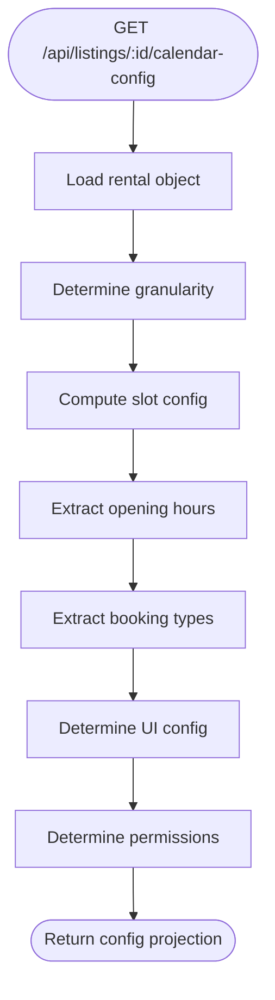

**Diagram sources**
- [calendar.service.ts](file://apps/api/src/modules/calendar/calendar.service.ts#L147-L189)
- [calendar.service.ts](file://apps/api/src/modules/calendar/calendar.service.ts#L195-L288)

**Section sources**
- [calendar.service.ts](file://apps/api/src/modules/calendar/calendar.service.ts#L74-L667)
- [calendar.schema.ts](file://apps/api/src/schemas/calendar.schema.ts#L1-L300)

### Recurring Bookings
- Preview: Generates occurrences based on frequency/end condition, checks conflicts, and returns a preview with available actions and permissions.
- Creation with policies: Supports STOP_ON_CONFLICT and ALLOW_PARTIAL, returning created bookings and failed occurrences with metadata.
- Legacy creation: Backward-compatible method for simple recurring creation.

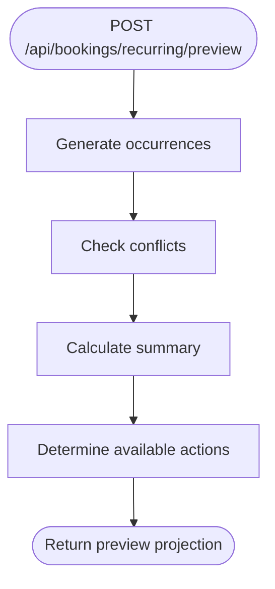

**Diagram sources**
- [booking.service.ts](file://apps/api/src/modules/booking/booking.service.ts#L780-L824)
- [booking.service.ts](file://apps/api/src/modules/booking/booking.service.ts#L829-L890)
- [booking.service.ts](file://apps/api/src/modules/booking/booking.service.ts#L895-L930)

**Section sources**
- [booking.service.ts](file://apps/api/src/modules/booking/booking.service.ts#L565-L774)
- [booking.service.ts](file://apps/api/src/modules/booking/booking.service.ts#L780-L824)
- [booking.service.ts](file://apps/api/src/modules/booking/booking.service.ts#L829-L890)
- [booking.service.ts](file://apps/api/src/modules/booking/booking.service.ts#L895-L930)

### Quote Generation
- Driven by rental object configuration: base price, unit (hour/half_day/day/fixed), min/max durations, buffer time, advance booking limits.
- Calculates pricing based on duration and unit, determines slot status (AVAILABLE/RESERVED/BOOKED/BLOCKED/BLACKOUT), and returns available actions.

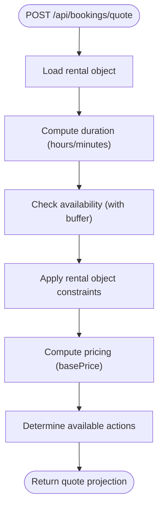

**Diagram sources**
- [booking.service.ts](file://apps/api/src/modules/booking/booking.service.ts#L980-L1131)

**Section sources**
- [booking.service.ts](file://apps/api/src/modules/booking/booking.service.ts#L980-L1131)

### Contract-First Endpoints
- Price preview: Returns structured pricing breakdown with discounts and context-dependent pricing groups.
- Recurring preview: Returns occurrence results with status, conflicts, and alternatives for proceeding.

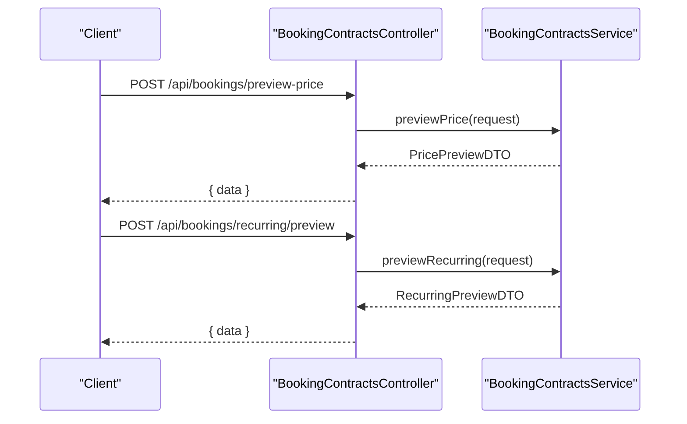

**Diagram sources**
- [booking-contracts.controller.ts](file://apps/api/src/modules/bookings/booking-contracts.controller.ts#L33-L52)
- [booking-contracts.service.ts](file://apps/api/src/modules/bookings/booking-contracts.service.ts#L47-L108)
- [booking-contracts.service.ts](file://apps/api/src/modules/bookings/booking-contracts.service.ts#L114-L186)

**Section sources**
- [booking-contracts.controller.ts](file://apps/api/src/modules/bookings/booking-contracts.controller.ts#L20-L53)
- [booking-contracts.service.ts](file://apps/api/src/modules/bookings/booking-contracts.service.ts#L36-L222)

### Real-Time Updates
- Broadcasting: After state changes (create/update/confirm/cancel/complete/approve/deny), the service broadcasts events to clients via WebSocket/realtime channel.
- Receipts: Generates standardized receipt DTOs for financial reporting and auditing.

**Section sources**
- [booking.service.ts](file://apps/api/src/modules/booking/booking.service.ts#L125-L136)
- [booking.service.ts](file://apps/api/src/modules/booking/booking.service.ts#L180-L191)
- [booking.service.ts](file://apps/api/src/modules/booking/booking.service.ts#L221-L232)
- [booking.service.ts](file://apps/api/src/modules/booking/booking.service.ts#L255-L266)
- [booking.service.ts](file://apps/api/src/modules/booking/booking.service.ts#L394-L406)
- [booking.controller.ts](file://apps/api/src/modules/booking/booking.controller.ts#L279-L324)

## Dependency Analysis
- Controllers depend on Services for business logic and on validation schemas for request DTOs.
- Services depend on Repositories for persistence, on CalendarService for availability, and on adapters for logging and broadcasting.
- Repositories depend on the database abstraction and enforce optimistic locking.
- Mappers transform domain entities into UI DTOs with permissions and actions.
- Contracts services provide contract-first DTOs decoupled from business logic.

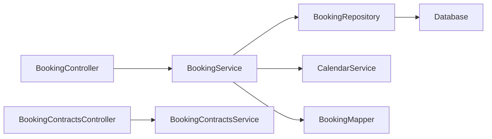

**Diagram sources**
- [booking.controller.ts](file://apps/api/src/modules/booking/booking.controller.ts#L21-L418)
- [booking.service.ts](file://apps/api/src/modules/booking/booking.service.ts#L43-L1238)
- [booking.repository.ts](file://apps/api/src/modules/booking/booking.repository.ts#L12-L287)
- [booking.mapper.ts](file://apps/api/src/modules/booking/booking.mapper.ts#L1-L654)
- [booking-contracts.controller.ts](file://apps/api/src/modules/bookings/booking-contracts.controller.ts#L20-L53)
- [booking-contracts.service.ts](file://apps/api/src/modules/bookings/booking-contracts.service.ts#L36-L222)

**Section sources**
- [booking.controller.ts](file://apps/api/src/modules/booking/booking.controller.ts#L1-L418)
- [booking.service.ts](file://apps/api/src/modules/booking/booking.service.ts#L1-L1240)
- [booking.repository.ts](file://apps/api/src/modules/booking/booking.repository.ts#L1-L288)
- [booking.mapper.ts](file://apps/api/src/modules/booking/booking.mapper.ts#L1-L654)
- [booking-contracts.controller.ts](file://apps/api/src/modules/bookings/booking-contracts.controller.ts#L1-L54)
- [booking-contracts.service.ts](file://apps/api/src/modules/bookings/booking-contracts.service.ts#L1-L223)

## Performance Considerations
- Optimistic locking prevents race conditions during updates; ensure clients handle conflict errors and retry with refreshed data.
- Availability checks use indexed date-range queries; avoid excessive pagination and filter by rentalObjectId and date ranges.
- Recurring previews generate occurrences; cap max occurrences and use end conditions to limit computation.
- Calendar matrix generation iterates over date ranges; limit the from/to window and leverage slot granularity to reduce cell count.
- Use organization-scoped filters to minimize dataset size for case handlers.

[No sources needed since this section provides general guidance]

## Troubleshooting Guide
Common issues and resolutions:
- Validation errors: Ensure request bodies conform to Zod schemas (e.g., CreateBookingDTO, UpdateBookingDTO).
- Conflict errors: When creating or updating bookings, handle optimistic locking conflicts by refreshing and retrying.
- Scope errors: Case handlers must have active scope for the rental object; verify case_handler_scopes entries.
- Unauthorized access: RBAC pre-handlers enforce permissions; ensure proper roles and tenant context.
- Calendar access denied: Validate user scope for rental object calendars.

**Section sources**
- [booking.repository.ts](file://apps/api/src/modules/booking/booking.repository.ts#L226-L282)
- [booking.service.ts](file://apps/api/src/modules/booking/booking.service.ts#L279-L333)
- [booking.controller.ts](file://apps/api/src/modules/booking/booking.controller.ts#L409-L418)

## Conclusion
The Booking Service provides a robust, contract-first, and real-time-enabled booking solution with strong validation, optimistic concurrency, comprehensive state management, and deep calendar integration. Its modular design supports scalability, maintainability, and clear separation between presentation, business logic, persistence, and projections.

[No sources needed since this section summarizes without analyzing specific files]

## Appendices

### API Reference

#### Authentication and Headers
- Authorization: Bearer <jwt-token>
- X-Tenant-Id: UUID of the tenant (required for most endpoints)
- X-License-Key: License key for API access

#### Bookings Endpoints
- GET /api/bookings: List bookings with filters and pagination
- POST /api/bookings: Create a booking
- GET /api/bookings/{id}: Get booking by ID
- PUT /api/bookings/{id}: Update booking (supports optimistic locking)
- PUT /api/bookings/{id}/status: Update booking status
- PUT /api/bookings/{id}/confirm: Confirm booking
- PUT /api/bookings/{id}/cancel: Cancel booking
- PUT /api/bookings/{id}/complete: Complete booking
- POST /api/bookings/{id}/approve: Approve booking (case handler)
- POST /api/bookings/{id}/deny: Deny booking (case handler)
- GET /api/bookings/pricing: Calculate pricing for a booking
- GET /api/bookings/my: Get user's bookings with listing details
- GET /api/bookings/recurring: List recurring bookings
- POST /api/bookings/recurring: Create recurring booking
- POST /api/bookings/recurring/preview: Preview recurring booking with conflicts
- GET /api/bookings/{id}/receipt: Get booking receipt
- PUT /api/bookings/{id}/approve (PUT variant): Approve booking
- PUT /api/bookings/{id}/reject: Reject booking

#### Calendar Endpoints
- GET /api/listings/{id}/calendar-config: Get calendar configuration for a listing
- GET /api/availability/{rentalObjectId}: Get availability matrix for a rental object

#### Contract-First Endpoints
- POST /api/bookings/preview-price: Get price preview (contract-first)
- POST /api/bookings/recurring/preview: Get recurring booking preview (contract-first)

**Section sources**
- [openapi.yaml](file://apps/api/docs/openapi.yaml#L619-L825)
- [booking.controller.ts](file://apps/api/src/modules/booking/booking.controller.ts#L44-L396)
- [booking-contracts.controller.ts](file://apps/api/src/modules/bookings/booking-contracts.controller.ts#L33-L52)

### Data Models and Projections

#### Booking Entity
- Fields: id, tenantId, rentalObjectId, userId, status, startTime, endTime, totalPrice, currency, notes, metadata, version, createdAt, updatedAt

#### Calendar Event Projection
- Fields: id, rentalObjectId, rentalObjectName, bookingId, start, end, title, color, status, statusLabel, userName, organizationName, isAllDay, isEditable

#### Booking Card Projection
- Fields: id, tenantId, rentalObjectId, rentalObjectName, userId, userName, userEmail, userPhone, organizationId, organizationName, status, statusLabel, statusColor, startTime, endTime, dateDisplay, timeDisplay, durationDisplay, durationMinutes, totalPrice, currency, priceDisplay, flags, availableActions, permissions, notes, createdAt, updatedAt

#### Booking Details Projection
- Extends card projection with rentalObjectSlug, rentalObjectCategory, rentalObjectLocation, paymentStatus, paymentStatusLabel, timeline, documents, isRecurring, recurringInfo

#### Recurring Preview Projection
- Fields: rentalObjectId, selection, occurrences, summary, proposedSelection, generatedAt, validFor, availableActions, permissions

#### Booking Quote Projection
- Fields: rentalObjectId, rentalObjectName, selection, slot, pricing, constraints, availableActions, createdAt

**Section sources**
- [booking.schema.ts](file://apps/api/src/schemas/booking.schema.ts#L16-L34)
- [booking.schema.ts](file://apps/api/src/schemas/booking.schema.ts#L115-L124)
- [booking.mapper.ts](file://apps/api/src/modules/booking/booking.mapper.ts#L51-L109)
- [booking.mapper.ts](file://apps/api/src/modules/booking/booking.mapper.ts#L114-L152)
- [booking.mapper.ts](file://apps/api/src/modules/booking/booking.mapper.ts#L208-L231)
- [booking.schema.ts](file://apps/api/src/schemas/booking.schema.ts#L296-L311)
- [booking.schema.ts](file://apps/api/src/schemas/booking.schema.ts#L437-L484)