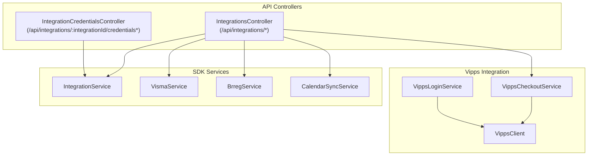
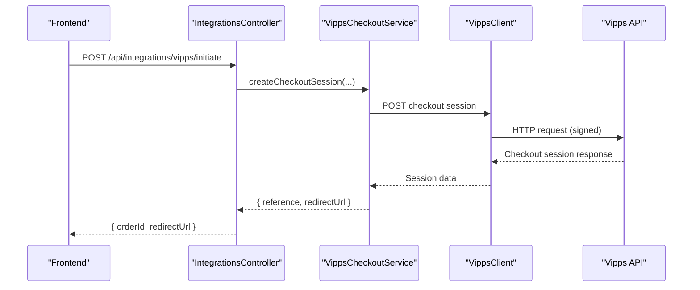
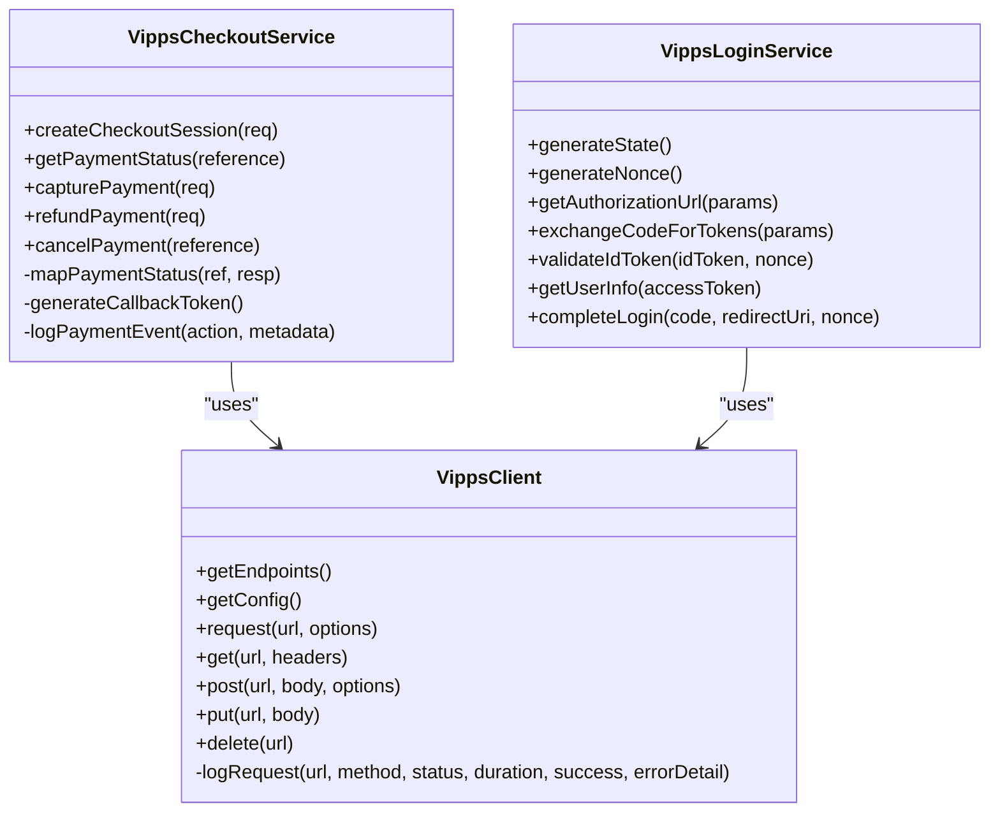
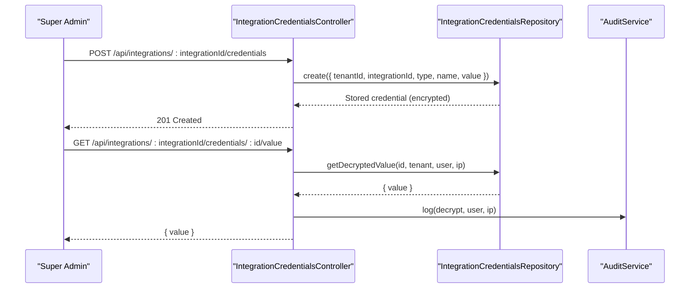
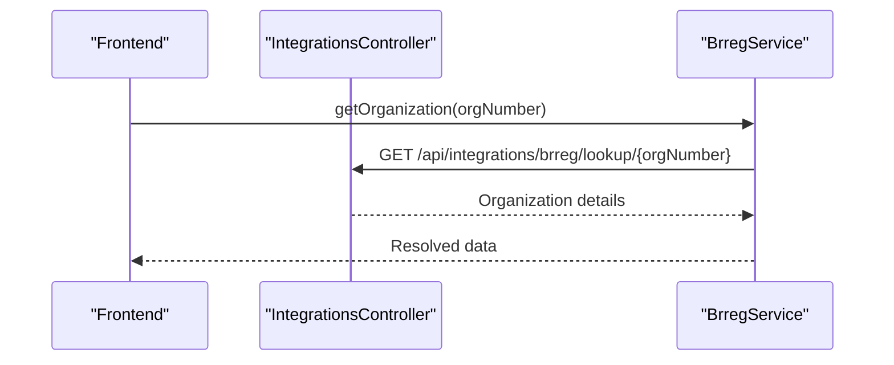
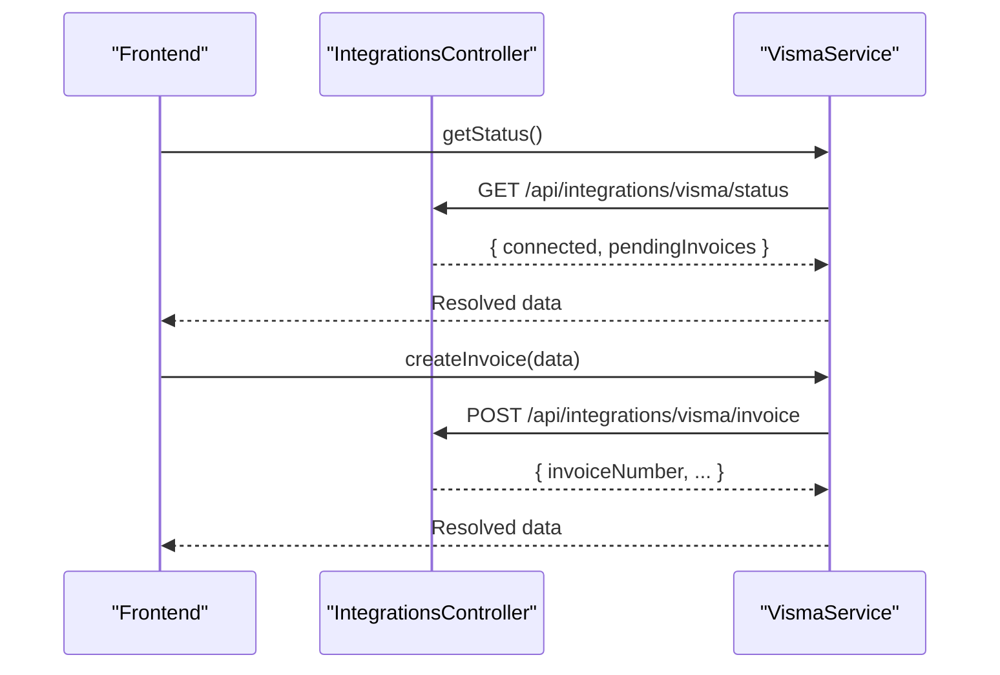
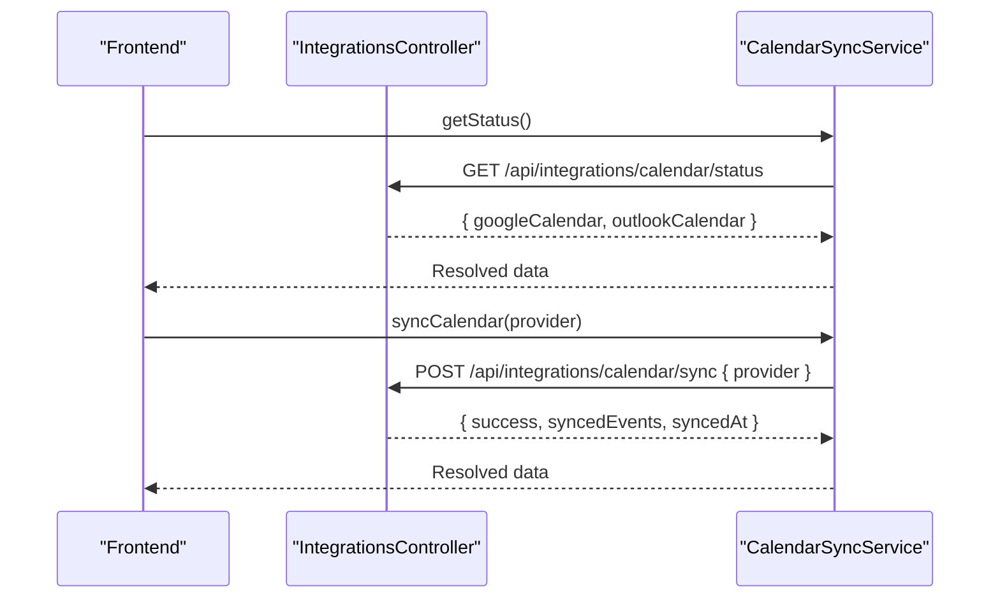

# Integration Service

<cite>
**Referenced Files in This Document**
- [integrations.controller.ts](file://apps/api/src/modules/integrations/integrations.controller.ts)
- [integration-credentials.controller.ts](file://apps/api/src/modules/integrations/integration-credentials.controller.ts)
- [integration-credentials.repository.ts](file://apps/api/src/modules/integrations/integration-credentials.repository.ts)
- [vipps.client.ts](file://apps/api/src/integrations/vipps/vipps.client.ts)
- [vipps-checkout.service.ts](file://apps/api/src/integrations/vipps/vipps-checkout.service.ts)
- [vipps-login.service.ts](file://apps/api/src/integrations/vipps/vipps-login.service.ts)
- [vipps.index.ts](file://apps/api/src/integrations/vipps/index.ts)
- [integrations.index.ts](file://apps/api/src/integrations/index.ts)
- [api.ts](file://apps/api/sdk/api.ts)
- [integration.service.ts](file://packages/client-sdk/src/services/integration.service.ts)
- [brreg.service.ts](file://packages/client-sdk/src/services/brreg.service.ts)
- [calendar.tsx](file://apps/backoffice/src/routes/integrations/calendar.tsx)
</cite>

## Table of Contents
1. [Introduction](#introduction)
2. [Project Structure](#project-structure)
3. [Core Components](#core-components)
4. [Architecture Overview](#architecture-overview)
5. [Detailed Component Analysis](#detailed-component-analysis)
6. [Dependency Analysis](#dependency-analysis)
7. [Performance Considerations](#performance-considerations)
8. [Troubleshooting Guide](#troubleshooting-guide)
9. [Conclusion](#conclusion)
10. [Appendices](#appendices)

## Introduction
This document describes the Integration Service that connects the platform to third-party systems:
- Brreg (Norwegian organization registry)
- Visma (accounting/ERP)
- Vipps (payments and login)
- Calendar sync (Google/Outlook)

It covers integration setup, credential management, data synchronization, error handling, API references, webhook handling, retry mechanisms, and monitoring for integration health.

## Project Structure
The Integration Service spans backend controllers, Vipps-specific clients and services, credential management, and SDK services for frontend consumption.

**Diagram sources**
- [integrations.controller.ts](file://apps/api/src/modules/integrations/integrations.controller.ts#L17-L563)
- [integration-credentials.controller.ts](file://apps/api/src/modules/integrations/integration-credentials.controller.ts#L72-L448)
- [vipps.client.ts](file://apps/api/src/integrations/vipps/vipps.client.ts#L113-L309)
- [vipps-checkout.service.ts](file://apps/api/src/integrations/vipps/vipps-checkout.service.ts#L147-L431)
- [vipps-login.service.ts](file://apps/api/src/integrations/vipps/vipps-login.service.ts#L224-L504)
- [integration.service.ts](file://packages/client-sdk/src/services/integration.service.ts#L204-L272)
- [integration.service.ts](file://packages/client-sdk/src/services/integration.service.ts#L516-L549)

**Section sources**
- [integrations.controller.ts](file://apps/api/src/modules/integrations/integrations.controller.ts#L1-L563)
- [integration-credentials.controller.ts](file://apps/api/src/modules/integrations/integration-credentials.controller.ts#L1-L448)
- [vipps.client.ts](file://apps/api/src/integrations/vipps/vipps.client.ts#L1-L309)
- [vipps-checkout.service.ts](file://apps/api/src/integrations/vipps/vipps-checkout.service.ts#L1-L431)
- [vipps-login.service.ts](file://apps/api/src/integrations/vipps/vipps-login.service.ts#L1-L504)
- [integration.service.ts](file://packages/client-sdk/src/services/integration.service.ts#L204-L272)
- [integration.service.ts](file://packages/client-sdk/src/services/integration.service.ts#L516-L549)

## Core Components
- IntegrationsController: Exposes endpoints for Brreg lookup/verification, Visma status/invoice/sync, Vipps status/initiate/capture/refund/payment status, and calendar sync status/sync.
- VippsClient: Centralized HTTP client for Vipps APIs with token caching, request signing, error mapping, and audit logging.
- VippsCheckoutService: Implements Checkout API for payment lifecycle (create session, capture, refund, cancel).
- VippsLoginService: Implements OIDC discovery, authorization URL generation, token exchange, ID token validation, and userinfo retrieval.
- IntegrationCredentialsController: Secure management of encrypted integration credentials with rotation and audit logging.
- SDK Services: Frontend-friendly wrappers for integration operations (Visma, Brreg, Calendar).

**Section sources**
- [integrations.controller.ts](file://apps/api/src/modules/integrations/integrations.controller.ts#L17-L563)
- [vipps.client.ts](file://apps/api/src/integrations/vipps/vipps.client.ts#L113-L309)
- [vipps-checkout.service.ts](file://apps/api/src/integrations/vipps/vipps-checkout.service.ts#L147-L431)
- [vipps-login.service.ts](file://apps/api/src/integrations/vipps/vipps-login.service.ts#L224-L504)
- [integration-credentials.controller.ts](file://apps/api/src/modules/integrations/integration-credentials.controller.ts#L72-L448)
- [integration.service.ts](file://packages/client-sdk/src/services/integration.service.ts#L204-L272)
- [integration.service.ts](file://packages/client-sdk/src/services/integration.service.ts#L516-L549)

## Architecture Overview
The Integration Service follows a layered architecture:
- API Layer: Controllers expose REST endpoints for integrations.
- Service Layer: Vipps services encapsulate external API interactions.
- Client Layer: VippsClient handles HTTP, auth, and error mapping.
- Credential Management: Encrypted secrets stored and accessed via dedicated controller.
- SDK Layer: Client SDK services wrap backend endpoints for frontend.

**Diagram sources**
- [integrations.controller.ts](file://apps/api/src/modules/integrations/integrations.controller.ts#L270-L355)
- [vipps-checkout.service.ts](file://apps/api/src/integrations/vipps/vipps-checkout.service.ts#L155-L217)
- [vipps.client.ts](file://apps/api/src/integrations/vipps/vipps.client.ts#L139-L182)

## Detailed Component Analysis

### Vipps Integration
The Vipps integration consists of:
- VippsClient: Manages OAuth2 access tokens, request signing, idempotency, error mapping, and audit logging.
- VippsCheckoutService: Payment lifecycle operations with idempotency keys and audit events.
- VippsLoginService: OIDC flow including discovery, authorization URL, token exchange, ID token validation, and userinfo.

**Diagram sources**
- [vipps.client.ts](file://apps/api/src/integrations/vipps/vipps.client.ts#L113-L309)
- [vipps-checkout.service.ts](file://apps/api/src/integrations/vipps/vipps-checkout.service.ts#L147-L431)
- [vipps-login.service.ts](file://apps/api/src/integrations/vipps/vipps-login.service.ts#L224-L504)

**Section sources**
- [vipps.client.ts](file://apps/api/src/integrations/vipps/vipps.client.ts#L1-L309)
- [vipps-checkout.service.ts](file://apps/api/src/integrations/vipps/vipps-checkout.service.ts#L1-L431)
- [vipps-login.service.ts](file://apps/api/src/integrations/vipps/vipps-login.service.ts#L1-L504)

### Credential Management
Secure handling of integration credentials:
- Role-based access: Only super administrators can manage credentials.
- Encryption: Values are stored encrypted; decryption is audited.
- Operations: List, create, get info, get decrypted value, update, delete, rotate.
- Metadata: Supports credential types and provider enumeration.

**Diagram sources**
- [integration-credentials.controller.ts](file://apps/api/src/modules/integrations/integration-credentials.controller.ts#L107-L263)
- [integration-credentials.repository.ts](file://apps/api/src/modules/integrations/integration-credentials.repository.ts)

**Section sources**
- [integration-credentials.controller.ts](file://apps/api/src/modules/integrations/integration-credentials.controller.ts#L1-L448)

### Brreg Integration
Backend exposes:
- Organization lookup by organization number
- Organization verification
- Additional endpoints for search and validation

Frontend SDK provides:
- BrregService with search and get organization details

**Diagram sources**
- [integrations.controller.ts](file://apps/api/src/modules/integrations/integrations.controller.ts#L169-L210)
- [brreg.service.ts](file://packages/client-sdk/src/services/brreg.service.ts#L80-L102)

**Section sources**
- [integrations.controller.ts](file://apps/api/src/modules/integrations/integrations.controller.ts#L169-L210)
- [brreg.service.ts](file://packages/client-sdk/src/services/brreg.service.ts#L1-L102)

### Visma Integration
Backend exposes:
- Status endpoint
- Invoice creation
- Invoice listing
- Manual sync trigger

Frontend SDK provides:
- VismaService wrapping status, create invoice, list invoices, and sync

**Diagram sources**
- [integrations.controller.ts](file://apps/api/src/modules/integrations/integrations.controller.ts#L96-L163)
- [integration.service.ts](file://packages/client-sdk/src/services/integration.service.ts#L204-L272)

**Section sources**
- [integrations.controller.ts](file://apps/api/src/modules/integrations/integrations.controller.ts#L96-L163)
- [integration.service.ts](file://packages/client-sdk/src/services/integration.service.ts#L204-L272)

### Calendar Sync Integration
Backend exposes:
- Status endpoint for Google/Outlook
- Manual sync trigger

Frontend SDK provides:
- CalendarSyncService with status and sync operations

**Diagram sources**
- [integrations.controller.ts](file://apps/api/src/modules/integrations/integrations.controller.ts#L533-L561)
- [integration.service.ts](file://packages/client-sdk/src/services/integration.service.ts#L516-L549)
- [calendar.tsx](file://apps/backoffice/src/routes/integrations/calendar.tsx#L75-L84)

**Section sources**
- [integrations.controller.ts](file://apps/api/src/modules/integrations/integrations.controller.ts#L533-L561)
- [integration.service.ts](file://packages/client-sdk/src/services/integration.service.ts#L516-L549)
- [calendar.tsx](file://apps/backoffice/src/routes/integrations/calendar.tsx#L75-L84)

## Dependency Analysis
- Controllers depend on services for business logic.
- VippsCheckoutService depends on VippsClient for HTTP operations.
- VippsLoginService depends on VippsClient for OIDC endpoints.
- Controllers rely on configuration modules for Vipps endpoints and environment.
- SDK services wrap backend endpoints for frontend consumption.

```mermaid
graph LR
IC["IntegrationsController"] --> VCS["VippsCheckoutService"]
IC --> SDK_IS["IntegrationService"]
IC --> SDK_VISMA["VismaService"]
IC --> SDK_BRREG["BrregService"]
IC --> SDK_CAL["CalendarSyncService"]
VCS --> VC["VippsClient"]
VLS["VippsLoginService"] --> VC
ICC["IntegrationCredentialsController"] --> Repo["IntegrationCredentialsRepository"]
```

**Diagram sources**
- [integrations.controller.ts](file://apps/api/src/modules/integrations/integrations.controller.ts#L17-L563)
- [vipps-checkout.service.ts](file://apps/api/src/integrations/vipps/vipps-checkout.service.ts#L147-L431)
- [vipps.client.ts](file://apps/api/src/integrations/vipps/vipps.client.ts#L113-L309)
- [vipps-login.service.ts](file://apps/api/src/integrations/vipps/vipps-login.service.ts#L224-L504)
- [integration-credentials.controller.ts](file://apps/api/src/modules/integrations/integration-credentials.controller.ts#L72-L448)

**Section sources**
- [integrations.controller.ts](file://apps/api/src/modules/integrations/integrations.controller.ts#L17-L563)
- [vipps-checkout.service.ts](file://apps/api/src/integrations/vipps/vipps-checkout.service.ts#L147-L431)
- [vipps.client.ts](file://apps/api/src/integrations/vipps/vipps.client.ts#L113-L309)
- [vipps-login.service.ts](file://apps/api/src/integrations/vipps/vipps-login.service.ts#L224-L504)
- [integration-credentials.controller.ts](file://apps/api/src/modules/integrations/integration-credentials.controller.ts#L72-L448)

## Performance Considerations
- Token caching: VippsClient caches access tokens with a safety buffer to reduce repeated auth calls.
- Idempotency: VippsCheckoutService uses idempotency keys for safe retries on payment operations.
- Request logging: VippsClient logs successful and failed requests for monitoring and debugging.
- Pagination: Visma invoice listing supports pagination for large datasets.
- Status endpoints: Provide lightweight checks to avoid heavy operations during health monitoring.

[No sources needed since this section provides general guidance]

## Troubleshooting Guide
Common issues and resolutions:
- Vipps not configured: Status endpoints return a non-connected state with a descriptive message.
- Payment initiation errors: Controller catches exceptions, logs via audit service, and returns structured error responses.
- Payment status not found: Specific 404 handling for missing orders.
- Token failures: VippsClient clears token cache on 401 to force re-authentication.
- Credential decryption errors: Dedicated error response for decryption failures.

**Section sources**
- [integrations.controller.ts](file://apps/api/src/modules/integrations/integrations.controller.ts#L244-L355)
- [vipps.client.ts](file://apps/api/src/integrations/vipps/vipps.client.ts#L187-L242)
- [integration-credentials.controller.ts](file://apps/api/src/modules/integrations/integration-credentials.controller.ts#L234-L262)

## Conclusion
The Integration Service provides robust, secure, and observable connectivity to Brreg, Visma, Vipps, and calendar systems. It emphasizes encrypted credential management, resilient payment operations with idempotency, comprehensive audit logging, and a clear separation of concerns between API, service, and client layers.

[No sources needed since this section summarizes without analyzing specific files]

## Appendices

### API Reference: Integration Configuration and Operations

- Brreg
  - GET /api/integrations/brreg/lookup/:orgNumber
  - POST /api/integrations/brreg/verify

- Visma
  - GET /api/integrations/visma/status
  - POST /api/integrations/visma/invoice
  - GET /api/integrations/visma/invoices
  - POST /api/integrations/visma/sync

- Vipps
  - GET /api/integrations/vipps/status
  - POST /api/integrations/vipps/initiate
  - GET /api/integrations/vipps/payment/:orderId
  - POST /api/integrations/vipps/capture
  - POST /api/integrations/vipps/refund

- Calendar
  - GET /api/integrations/calendar/status
  - POST /api/integrations/calendar/sync

- Credentials (super admin)
  - GET /api/integrations/:integrationId/credentials
  - POST /api/integrations/:integrationId/credentials
  - GET /api/integrations/:integrationId/credentials/:id
  - GET /api/integrations/:integrationId/credentials/:id/value
  - PUT /api/integrations/:integrationId/credentials/:id
  - DELETE /api/integrations/:integrationId/credentials/:id
  - POST /api/integrations/:integrationId/credentials/:id/rotate
  - GET /api/integrations/credential-types
  - GET /api/integrations/providers

**Section sources**
- [integrations.controller.ts](file://apps/api/src/modules/integrations/integrations.controller.ts#L26-L561)
- [integration-credentials.controller.ts](file://apps/api/src/modules/integrations/integration-credentials.controller.ts#L72-L448)

### Data Mapping and SDK Types

- Visma
  - Status: { connected: boolean, pendingInvoices: number }
  - Invoice: { invoiceNumber, bookingId, organizationId, amount, currency, description, status, dueDate, createdAt }

- Brreg
  - Organization: { orgNumber, name, type, typeCode, address, industry }
  - Details: extends Organization with registration date, VAT, employees, website
  - Validation: { orgNumber, isValidFormat, exists, name, canBeUsedForMembership }

- Calendar
  - Status: { googleCalendar: { connected }, outlookCalendar: { connected, lastSync? } }

**Section sources**
- [integrations.controller.ts](file://apps/api/src/modules/integrations/integrations.controller.ts#L96-L163)
- [brreg.service.ts](file://packages/client-sdk/src/services/brreg.service.ts#L13-L75)
- [integration.service.ts](file://packages/client-sdk/src/services/integration.service.ts#L516-L549)

### Webhook Handling and Retry Mechanisms
- Vipps Checkout: The checkout session creation sets a callback URL and authorization token for webhooks. The service logs payment events for audit and monitoring.
- Idempotency: Payment operations (capture, refund, cancel) use idempotency keys to prevent duplicate effects.
- Retry: VippsClient manages token refresh and clears cache on 401 to recover from auth failures.

**Section sources**
- [vipps-checkout.service.ts](file://apps/api/src/integrations/vipps/vipps-checkout.service.ts#L155-L336)
- [vipps.client.ts](file://apps/api/src/integrations/vipps/vipps.client.ts#L57-L107)

### Monitoring and Health
- Audit logging: VippsClient and VippsCheckoutService log request outcomes and payment events.
- Status endpoints: Provide quick health checks for each integration.
- Error responses: Structured RFC 7807-style errors for consistent diagnostics.

**Section sources**
- [vipps.client.ts](file://apps/api/src/integrations/vipps/vipps.client.ts#L215-L242)
- [vipps-checkout.service.ts](file://apps/api/src/integrations/vipps/vipps-checkout.service.ts#L399-L412)
- [integrations.controller.ts](file://apps/api/src/modules/integrations/integrations.controller.ts#L26-L561)