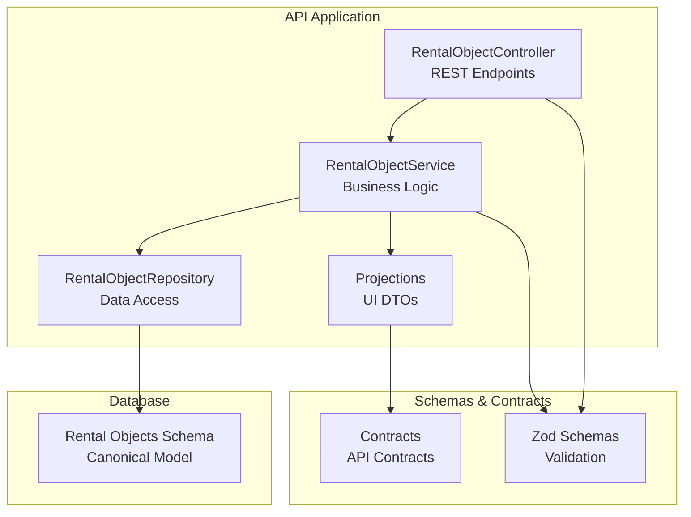
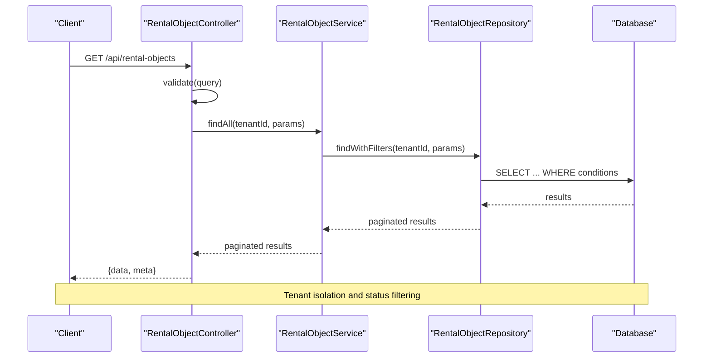
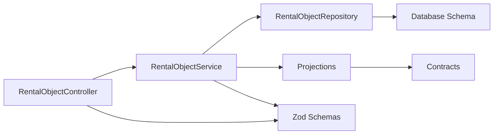

# Rental Objects Service

<cite>
**Referenced Files in This Document**
- [rental-object.controller.ts](file://apps/api/src/modules/rental-objects/rental-object.controller.ts)
- [rental-object.service.ts](file://apps/api/src/modules/rental-objects/rental-object.service.ts)
- [rental-object.repository.ts](file://apps/api/src/modules/rental-objects/rental-object.repository.ts)
- [rental-object.projections.ts](file://apps/api/src/modules/rental-objects/rental-object.projections.ts)
- [rental-object.schema.ts](file://apps/api/src/schemas/rental-object.schema.ts)
- [rental-objects.ts](file://apps/api/src/database/schema/rental-objects.ts)
- [schema.index.ts](file://apps/api/src/database/schema/index.ts)
- [client-sdk.rental-object.service.ts](file://packages/client-sdk/src/services/rental-object.service.ts)
- [client-sdk.rental-object.types.ts](file://packages/client-sdk/src/types/rental-object.ts)
- [contracts.rental-object.schema.ts](file://packages/contracts/src/schemas/rental-object.schema.ts)
- [search.controller.ts](file://apps/api/src/modules/search/search.controller.ts)
</cite>

## Table of Contents
1. [Introduction](#introduction)
2. [Project Structure](#project-structure)
3. [Core Components](#core-components)
4. [Architecture Overview](#architecture-overview)
5. [Detailed Component Analysis](#detailed-component-analysis)
6. [Dependency Analysis](#dependency-analysis)
7. [Performance Considerations](#performance-considerations)
8. [Troubleshooting Guide](#troubleshooting-guide)
9. [Conclusion](#conclusion)

## Introduction
This document provides comprehensive documentation for the Rental Objects Service, covering property listing management, CRUD operations, and availability queries. It explains methods for retrieving rental objects, filtering by categories and metadata, searching with location-based queries, and managing rental object states. The documentation includes a complete API reference with parameter types, response schemas, and pagination support, along with distinctions between public and authenticated access, caching strategies, and performance optimization techniques for large catalogs.

## Project Structure
The Rental Objects Service is implemented as part of the API application and integrates with the broader platform architecture. Key components include:
- Controller layer exposing REST endpoints
- Service layer implementing business logic
- Repository layer handling data access
- Projection layer transforming database entities to UI-ready DTOs
- Schema definitions for validation and contracts
- Database schema definitions for the canonical model

**Diagram sources**
- [rental-object.controller.ts](file://apps/api/src/modules/rental-objects/rental-object.controller.ts#L20-L245)
- [rental-object.service.ts](file://apps/api/src/modules/rental-objects/rental-object.service.ts#L20-L468)
- [rental-object.repository.ts](file://apps/api/src/modules/rental-objects/rental-object.repository.ts#L10-L185)
- [rental-object.projections.ts](file://apps/api/src/modules/rental-objects/rental-object.projections.ts#L1-L590)
- [rental-object.schema.ts](file://apps/api/src/schemas/rental-object.schema.ts#L1-L351)
- [rental-objects.ts](file://apps/api/src/database/schema/rental-objects.ts#L79-L119)

**Section sources**
- [rental-object.controller.ts](file://apps/api/src/modules/rental-objects/rental-object.controller.ts#L1-L379)
- [rental-object.service.ts](file://apps/api/src/modules/rental-objects/rental-object.service.ts#L1-L468)
- [rental-object.repository.ts](file://apps/api/src/modules/rental-objects/rental-object.repository.ts#L1-L185)
- [rental-object.projections.ts](file://apps/api/src/modules/rental-objects/rental-object.projections.ts#L1-L590)
- [rental-object.schema.ts](file://apps/api/src/schemas/rental-object.schema.ts#L1-L351)
- [rental-objects.ts](file://apps/api/src/database/schema/rental-objects.ts#L1-L152)

## Core Components
- RentalObjectController: Exposes REST endpoints for listing, retrieving, creating, updating, publishing, unpublishing, archiving, restoring, duplicating, deleting rental objects, and related operations like availability, media management, statistics, and policy retrieval.
- RentalObjectService: Implements business logic including creation, updates, state transitions, availability queries, media management, and policy generation.
- RentalObjectRepository: Handles data access, filtering, pagination, and tenant isolation for rental objects.
- Projections: Transforms database entities into UI-ready DTOs for consistent presentation across clients.
- Schemas: Define validation rules and contracts for requests, responses, and query parameters.
- Database Schema: Defines the canonical model for rental objects, categories, time modes, and related entities.

**Section sources**
- [rental-object.controller.ts](file://apps/api/src/modules/rental-objects/rental-object.controller.ts#L20-L245)
- [rental-object.service.ts](file://apps/api/src/modules/rental-objects/rental-object.service.ts#L20-L468)
- [rental-object.repository.ts](file://apps/api/src/modules/rental-objects/rental-object.repository.ts#L10-L185)
- [rental-object.projections.ts](file://apps/api/src/modules/rental-objects/rental-object.projections.ts#L1-L590)
- [rental-object.schema.ts](file://apps/api/src/schemas/rental-object.schema.ts#L1-L351)
- [rental-objects.ts](file://apps/api/src/database/schema/rental-objects.ts#L79-L119)

## Architecture Overview
The service follows a layered architecture:
- Presentation Layer: Controller handles HTTP requests and responses.
- Application Layer: Service encapsulates business rules and orchestrates operations.
- Domain Layer: Repository manages persistence and query composition.
- Projection Layer: Converts domain entities to UI DTOs.
- Contract Layer: Defines schemas and types for validation and SDK compatibility.

**Diagram sources**
- [rental-object.controller.ts](file://apps/api/src/modules/rental-objects/rental-object.controller.ts#L30-L51)
- [rental-object.service.ts](file://apps/api/src/modules/rental-objects/rental-object.service.ts#L84-L93)
- [rental-object.repository.ts](file://apps/api/src/modules/rental-objects/rental-object.repository.ts#L36-L139)

**Section sources**
- [rental-object.controller.ts](file://apps/api/src/modules/rental-objects/rental-object.controller.ts#L20-L245)
- [rental-object.service.ts](file://apps/api/src/modules/rental-objects/rental-object.service.ts#L20-L468)
- [rental-object.repository.ts](file://apps/api/src/modules/rental-objects/rental-object.repository.ts#L10-L185)

## Detailed Component Analysis

### REST API Endpoints
The controller exposes the following endpoints:
- GET /api/rental-objects: List rental objects with pagination and filters
- GET /api/rental-objects/:id: Retrieve a rental object by ID
- POST /api/rental-objects: Create a new rental object
- PUT /api/rental-objects/:id: Update a rental object
- PUT /api/rental-objects/:id/publish: Publish a rental object
- PUT /api/rental-objects/:id/unpublish: Unpublish a rental object
- POST /api/rental-objects/:id/duplicate: Duplicate a rental object
- PUT /api/rental-objects/:id/archive: Archive a rental object
- PUT /api/rental-objects/:id/restore: Restore an archived rental object
- DELETE /api/rental-objects/:id: Delete a rental object
- GET /api/rental-objects/slug/:slug: Retrieve by slug
- GET /api/rental-objects/:id/availability: Get availability for a date range
- POST /api/rental-objects/:id/media: Upload media
- DELETE /api/rental-objects/:id/media/:mediaId: Delete media
- GET /api/rental-objects/:id/stats: Get statistics
- GET /api/rental-objects/:id/calendar-config: Get calendar configuration
- GET /api/rental-objects/:id/booking-policy: Get booking policy
- GET /api/rental-objects/:id/payment-policy: Get payment policy
- GET /api/rental-objects/:id/tabs: Get dynamic tabs configuration
- GET /api/categories: Get categories
- GET /api/categories/time-modes: Get time modes
- GET /api/categories/features: Get features

Response format for list endpoints includes data and meta for SDK compatibility.

**Section sources**
- [rental-object.controller.ts](file://apps/api/src/modules/rental-objects/rental-object.controller.ts#L26-L244)

### Request/Response Schemas and Types
- Request DTOs: CreateRentalObjectDTO, UpdateRentalObjectDTO
- Query Parameters: RentalObjectQueryParams
- Response Types: RentalObjectsResponse, RentalObjectResponse
- UI Types: UiRentalObject, AvailabilityQueryParams, RentalObjectAvailability, RentalObjectStats, RentalObjectCalendarConfig
- Contract Types: RentalObject, Pricing, Location, BookingFeatures, Rules

These types ensure consistent validation and serialization across the API and SDK.

**Section sources**
- [rental-object.schema.ts](file://apps/api/src/schemas/rental-object.schema.ts#L237-L332)
- [client-sdk.rental-object.types.ts](file://packages/client-sdk/src/types/rental-object.ts#L158-L443)
- [contracts.rental-object.schema.ts](file://packages/contracts/src/schemas/rental-object.schema.ts#L176-L245)

### Filtering and Search Capabilities
The repository supports comprehensive filtering and search:
- Tenant isolation: If tenantId is null, only published objects are returned
- Status filtering: draft, published, archived
- Category and subcategory filtering
- Time mode filtering
- Organization filtering
- Text search across name and description
- Capacity range filtering
- City and municipality filtering via metadata
- Price range filtering via pricing.basePrice
- Sorting by name, createdAt, updatedAt, capacity
- Pagination with page and limit

Location-based queries leverage metadata fields for city, municipality, and coordinates.

**Section sources**
- [rental-object.repository.ts](file://apps/api/src/modules/rental-objects/rental-object.repository.ts#L36-L139)

### State Management and Operations
The service supports full lifecycle operations:
- Create: Validates input, generates slug, initializes status as draft
- Update: Validates updates and logs changes
- Publish/Unpublish: Transitions status and logs actions
- Archive/Restore: Moves objects between archived and draft states
- Duplicate: Creates a copy with modified name and slug
- Delete: Removes objects and logs deletion
- Availability: Returns availability data for a date range
- Media: Adds/removes media URLs
- Stats: Provides aggregated statistics
- Policies: Generates calendar configuration, booking policy, payment policy, and tab configuration

**Section sources**
- [rental-object.service.ts](file://apps/api/src/modules/rental-objects/rental-object.service.ts#L30-L233)

### Public vs Authenticated Access
- Public access: When tenantId is null, only published rental objects are returned
- Authenticated access: Requires tenant context; allows access to tenant-scoped objects and protected operations
- Endpoint protection: Some endpoints require custody scopes for editing, media management, and reporting

**Section sources**
- [rental-object.repository.ts](file://apps/api/src/modules/rental-objects/rental-object.repository.ts#L36-L45)
- [rental-object.controller.ts](file://apps/api/src/modules/rental-objects/rental-object.controller.ts#L77-L137)

### Projection Layer
The projection layer transforms database entities into UI-ready DTOs:
- Card projections: Flat DTOs optimized for listing views
- Details projections: Comprehensive DTOs for detail pages
- Translation keys: Labels are mapped to i18n keys
- Image handling: Absolute URLs and thumbnails
- Location formatting: Formatted address and coordinates
- Pricing formatting: Amount, currency, unit, and display strings
- Rating and review formatting
- Feature detection and visibility

**Section sources**
- [rental-object.projections.ts](file://apps/api/src/modules/rental-objects/rental-object.projections.ts#L362-L581)

### Database Schema and Indexes
The canonical model defines:
- Rental objects table with UUID primary key, tenant foreign key, and JSONB fields for flexible metadata
- Category, time mode, and feature definitions as seed tables
- Blackouts table for calendar blocking
- Indexes on tenantId, categoryKey, timeMode, status, and slug combinations
- Rule sets for reusable booking rules

**Section sources**
- [rental-objects.ts](file://apps/api/src/database/schema/rental-objects.ts#L79-L138)
- [schema.index.ts](file://apps/api/src/database/schema/index.ts#L37-L47)

### Client SDK Integration
The SDK provides:
- Service methods mirroring API endpoints
- Strongly typed DTOs and responses
- Utility functions for UI transformations
- Hooks for React applications

**Section sources**
- [client-sdk.rental-object.service.ts](file://packages/client-sdk/src/services/rental-object.service.ts#L101-L155)
- [client-sdk.rental-object.types.ts](file://packages/client-sdk/src/types/rental-object.ts#L158-L233)

### Search Functionality
While the search controller focuses on general search across entities, the rental objects service provides:
- Built-in filtering and search within the rental objects domain
- Location-based filtering via metadata
- Text search across name and description
- Integration points for external search systems

**Section sources**
- [search.controller.ts](file://apps/api/src/modules/search/search.controller.ts#L74-L243)

## Dependency Analysis
The service exhibits clear separation of concerns with minimal coupling:
- Controller depends on Service for business logic
- Service depends on Repository for persistence and Projections for DTOs
- Repository depends on database schema definitions
- Schemas and contracts provide shared validation and type definitions
- No circular dependencies detected

**Diagram sources**
- [rental-object.controller.ts](file://apps/api/src/modules/rental-objects/rental-object.controller.ts#L20-L245)
- [rental-object.service.ts](file://apps/api/src/modules/rental-objects/rental-object.service.ts#L20-L468)
- [rental-object.repository.ts](file://apps/api/src/modules/rental-objects/rental-object.repository.ts#L10-L185)
- [rental-object.projections.ts](file://apps/api/src/modules/rental-objects/rental-object.projections.ts#L1-L590)
- [rental-object.schema.ts](file://apps/api/src/schemas/rental-object.schema.ts#L1-L351)
- [rental-objects.ts](file://apps/api/src/database/schema/rental-objects.ts#L79-L119)

**Section sources**
- [rental-object.controller.ts](file://apps/api/src/modules/rental-objects/rental-object.controller.ts#L20-L245)
- [rental-object.service.ts](file://apps/api/src/modules/rental-objects/rental-object.service.ts#L20-L468)
- [rental-object.repository.ts](file://apps/api/src/modules/rental-objects/rental-object.repository.ts#L10-L185)

## Performance Considerations
- Pagination defaults: Page size defaults to 20 with maximum 100 items per page
- Tenant isolation: Reduces result set size by filtering by tenant or published status
- Index usage: Database indexes on tenantId, categoryKey, timeMode, status, and slug optimize queries
- JSONB filtering: Post-filtering on JSONB fields (metadata, pricing) may impact performance on large datasets
- Projection caching: Consider caching frequently accessed projections for listing pages
- Search optimization: Implement full-text search indexes and consider external search engines for complex queries
- Media handling: Store only necessary image variants and use CDN for delivery
- Audit logging: Keep audit logs minimal and consider asynchronous logging for write-heavy operations

## Troubleshooting Guide
Common issues and resolutions:
- Validation errors: Ensure request DTOs conform to schemas; check category, time mode, and pricing unit values
- Tenant isolation failures: Verify tenant context is properly extracted from requests
- Slug conflicts: Slugs are auto-generated; ensure uniqueness when manually setting
- Missing published objects: Public access only returns published objects; use authenticated endpoints for tenant-scoped access
- Empty search results: Verify filters and search terms; consider adjusting text search parameters
- Media upload failures: Validate URLs and ensure proper content types

**Section sources**
- [rental-object.controller.ts](file://apps/api/src/modules/rental-objects/rental-object.controller.ts#L30-L51)
- [rental-object.service.ts](file://apps/api/src/modules/rental-objects/rental-object.service.ts#L30-L64)
- [rental-object.repository.ts](file://apps/api/src/modules/rental-objects/rental-object.repository.ts#L36-L45)

## Conclusion
The Rental Objects Service provides a robust, scalable foundation for property listing management with comprehensive filtering, search, and state management capabilities. Its layered architecture ensures maintainability, while strong schemas and contracts guarantee data integrity across the platform. The service supports both public and authenticated access patterns, with clear extension points for advanced features like external search integration and enhanced caching strategies.