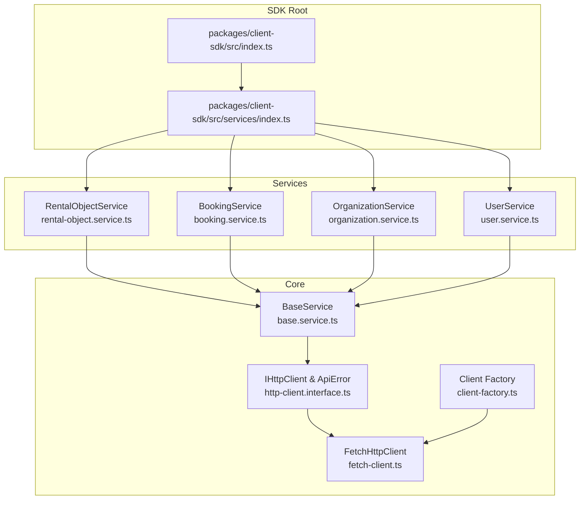
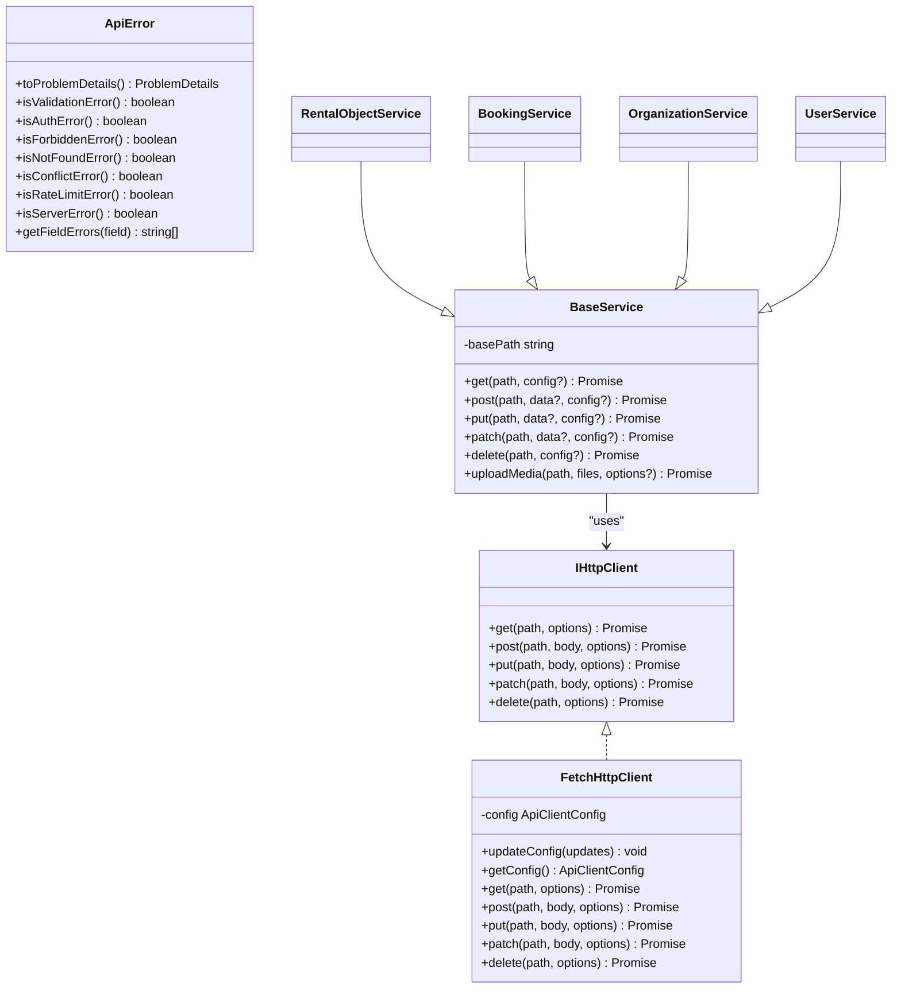
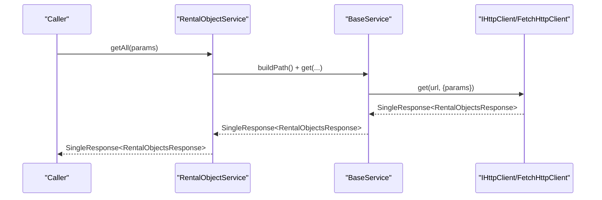
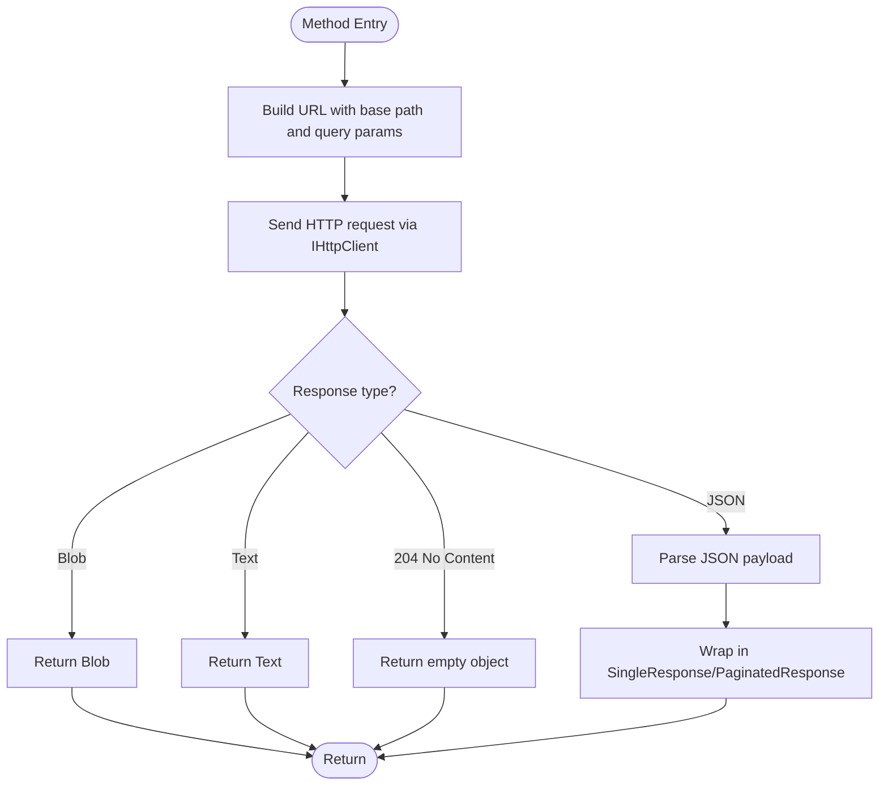
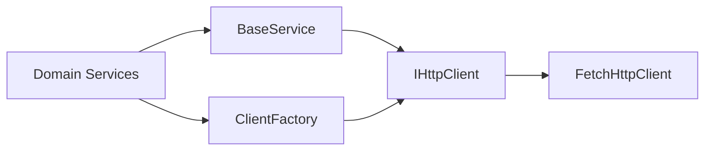

# Service Layer

<cite>
**Referenced Files in This Document**
- [index.ts](file://packages/client-sdk/src/index.ts)
- [services/index.ts](file://packages/client-sdk/src/services/index.ts)
- [base.service.ts](file://packages/client-sdk/src/services/base.service.ts)
- [rental-object.service.ts](file://packages/client-sdk/src/services/rental-object.service.ts)
- [booking.service.ts](file://packages/client-sdk/src/services/booking.service.ts)
- [user.service.ts](file://packages/client-sdk/src/services/user.service.ts)
- [organization.service.ts](file://packages/client-sdk/src/services/organization.service.ts)
- [http-client.interface.ts](file://packages/client-sdk/src/core/http-client.interface.ts)
- [client-factory.ts](file://packages/client-sdk/src/core/client-factory.ts)
- [fetch-client.ts](file://packages/client-sdk/src/core/fetch-client.ts)
- [enums.ts](file://packages/client-sdk/src/types/enums.ts)
- [rental-object.ts](file://packages/client-sdk/src/types/rental-object.ts)
</cite>

## Table of Contents
1. [Introduction](#introduction)
2. [Project Structure](#project-structure)
3. [Core Components](#core-components)
4. [Architecture Overview](#architecture-overview)
5. [Detailed Component Analysis](#detailed-component-analysis)
6. [Dependency Analysis](#dependency-analysis)
7. [Performance Considerations](#performance-considerations)
8. [Troubleshooting Guide](#troubleshooting-guide)
9. [Conclusion](#conclusion)
10. [Appendices](#appendices)

## Introduction
This document describes the Client SDK service layer architecture. It explains the base service class design, common patterns across all services, and individual service implementations for rentals, bookings, users, and organizations. It also covers method signatures, parameter validation, response transformation, error handling, service composition patterns, dependency injection, lifecycle management, performance optimization, caching strategies, and batch operation support.

## Project Structure
The service layer is organized under packages/client-sdk/src/services and built upon a small core of HTTP abstraction and client factory. The index exports provide convenient access to services, types, utilities, and providers.

**Diagram sources**
- [index.ts](file://packages/client-sdk/src/index.ts#L70-L88)
- [services/index.ts](file://packages/client-sdk/src/services/index.ts#L21-L51)
- [base.service.ts](file://packages/client-sdk/src/services/base.service.ts#L11-L24)
- [http-client.interface.ts](file://packages/client-sdk/src/core/http-client.interface.ts#L32-L38)
- [client-factory.ts](file://packages/client-sdk/src/core/client-factory.ts#L17-L21)
- [fetch-client.ts](file://packages/client-sdk/src/core/fetch-client.ts#L10-L15)
- [rental-object.service.ts](file://packages/client-sdk/src/services/rental-object.service.ts#L62-L65)
- [booking.service.ts](file://packages/client-sdk/src/services/booking.service.ts#L24-L27)
- [organization.service.ts](file://packages/client-sdk/src/services/organization.service.ts#L35-L38)
- [user.service.ts](file://packages/client-sdk/src/services/user.service.ts#L18-L21)

**Section sources**
- [index.ts](file://packages/client-sdk/src/index.ts#L70-L88)
- [services/index.ts](file://packages/client-sdk/src/services/index.ts#L21-L51)

## Core Components
- Base Service: Provides a uniform HTTP facade (GET/POST/PUT/PATCH/DELETE) and a reusable uploadMedia helper. It composes paths using a base path and delegates to a shared IHttpClient instance resolved from the client factory.
- HTTP Client Interface: Defines the IHttpClient contract and ApiError class conforming to RFC 7807 Problem Details. It supports JSON, blob, and text responses and exposes typed helpers for error classification.
- Client Factory: Manages a singleton IHttpClient instance, exposes initialization/update/reset helpers, and provides utilities to set tokens and tenant IDs.
- Fetch HTTP Client: Implements IHttpClient using the browser fetch API, handles query param building, header composition (tenant/license/token), abort signals, timeouts, and robust error parsing.

Key responsibilities:
- Base Service: Path construction, HTTP verb wrappers, media upload.
- IHttpClient: Request/response contract and error model.
- Client Factory: Lifecycle and configuration management.
- Fetch HTTP Client: Transport, headers, timeouts, and error normalization.

**Section sources**
- [base.service.ts](file://packages/client-sdk/src/services/base.service.ts#L11-L99)
- [http-client.interface.ts](file://packages/client-sdk/src/core/http-client.interface.ts#L32-L213)
- [client-factory.ts](file://packages/client-sdk/src/core/client-factory.ts#L17-L113)
- [fetch-client.ts](file://packages/client-sdk/src/core/fetch-client.ts#L10-L210)

## Architecture Overview
The service layer follows a layered design:
- Services depend on BaseService, which depends on IHttpClient.
- IHttpClient is implemented by FetchHttpClient.
- Client Factory creates and manages the IHttpClient instance and configuration.

**Diagram sources**
- [http-client.interface.ts](file://packages/client-sdk/src/core/http-client.interface.ts#L32-L213)
- [fetch-client.ts](file://packages/client-sdk/src/core/fetch-client.ts#L10-L210)
- [base.service.ts](file://packages/client-sdk/src/services/base.service.ts#L11-L99)
- [rental-object.service.ts](file://packages/client-sdk/src/services/rental-object.service.ts#L62-L65)
- [booking.service.ts](file://packages/client-sdk/src/services/booking.service.ts#L24-L27)
- [organization.service.ts](file://packages/client-sdk/src/services/organization.service.ts#L35-L38)
- [user.service.ts](file://packages/client-sdk/src/services/user.service.ts#L18-L21)

## Detailed Component Analysis

### Base Service Design
- Responsibilities:
  - Centralized path building using a base path per service.
  - HTTP verb wrappers delegating to a shared IHttpClient resolved via the client factory.
  - Media upload helper that builds FormData and posts to a constructed path.
- Coupling:
  - Tight coupling to IHttpClient via the client factory; this is intentional for centralized configuration and lifecycle.
- Cohesion:
  - High cohesion around HTTP operations and media uploads.

Common patterns:
- All services extend BaseService and override only the base path.
- Methods consistently accept typed DTOs and return typed responses (SingleResponse/PaginatedResponse).

**Section sources**
- [base.service.ts](file://packages/client-sdk/src/services/base.service.ts#L11-L99)

### Rental Object Service
- Purpose: Primary API for rental object operations, including CRUD, publishing, archiving, duplication, media management, categories, subcategories, time modes, availability, stats, and calendar configuration.
- Notable methods:
  - getAll/getByCategory/getById/getBySlug
  - create/update/deleteById/publish/archive/unpublish/restore/duplicate
  - uploadMedia/removeMedia
  - getCategories/getSubcategories/getTimeModes
  - getAvailability/getStats/getCalendarConfig
- Parameter validation:
  - Uses typed query params and DTOs from rental-object.ts and enums.ts.
- Response transformation:
  - Returns SingleResponse or PaginatedResponse wrappers as defined in enums.ts.
- Error handling:
  - Inherits ApiError behavior from IHttpClient/FetchHttpClient.

**Diagram sources**
- [rental-object.service.ts](file://packages/client-sdk/src/services/rental-object.service.ts#L70-L75)
- [base.service.ts](file://packages/client-sdk/src/services/base.service.ts#L29-L32)
- [fetch-client.ts](file://packages/client-sdk/src/core/fetch-client.ts#L191-L193)

**Section sources**
- [rental-object.service.ts](file://packages/client-sdk/src/services/rental-object.service.ts#L62-L215)
- [enums.ts](file://packages/client-sdk/src/types/enums.ts#L146-L168)
- [rental-object.ts](file://packages/client-sdk/src/types/rental-object.ts#L195-L200)

### Booking Service
- Purpose: Handles booking lifecycle, pricing calculations, user-specific queries, recurring bookings, receipts, payment history, reconciliation, time changes, and availability checks.
- Notable methods:
  - getAll/getById/create/update/updateStatus/confirm/cancel/complete/deleteById
  - calculatePricing
  - getMyBookings/getRecurring/createRecurring
  - getReceipt/getPaymentHistory/getPaymentReconciliation
  - changeTime/requestChange
  - getDocuments/quote/getRecurringPreview
  - CalendarService: getEvents
  - AllocationService: getAll/create/deleteById
  - AvailabilityService: getSlots/check
- Parameter validation:
  - Typed query params and DTOs from booking.ts and enums.ts.
- Response transformation:
  - Returns SingleResponse/PaginatedResponse wrappers.
- Error handling:
  - Inherits ApiError behavior.

**Diagram sources**
- [booking.service.ts](file://packages/client-sdk/src/services/booking.service.ts#L49-L51)
- [fetch-client.ts](file://packages/client-sdk/src/core/fetch-client.ts#L160-L169)

**Section sources**
- [booking.service.ts](file://packages/client-sdk/src/services/booking.service.ts#L24-L468)
- [enums.ts](file://packages/client-sdk/src/types/enums.ts#L146-L168)

### Organization Service
- Purpose: Manages organizations and user operations for organization contexts.
- OrganizationService:
  - getAll/getById/create/update/deleteOrganization
  - requestVerification
  - getMembers/addMember/updateMember/removeMember
  - uploadLogo/getBranding/updateBranding
- UserService:
  - getAll/getById/getCurrentUser/create/update/updateCurrentUser
  - deactivate/reactivate/deleteAccount
  - exportData/getConsents/updateConsents
  - getNotificationPrefs/updateNotificationPrefs
  - uploadAvatar
- Parameter validation:
  - Typed query params and DTOs from organization.ts and enums.ts.
- Response transformation:
  - Returns SingleResponse/PaginatedResponse wrappers.
- Error handling:
  - Inherits ApiError behavior.

**Section sources**
- [organization.service.ts](file://packages/client-sdk/src/services/organization.service.ts#L35-L256)
- [enums.ts](file://packages/client-sdk/src/types/enums.ts#L146-L168)

### User Service
- Purpose: Admin-focused user management operations; current user operations are handled by ProfileService (not part of this document’s scope).
- Methods:
  - list/getById/getByOrganization/getByTenant
  - create/update/deleteUser/suspend/reinstate
  - assignRole/removeRole
  - bulkInvite/getStats/search/exportToCsv
- Parameter validation:
  - Typed query params and DTOs from user.types.ts.
- Response transformation:
  - Returns SingleResponse/PaginatedResponse or Blob for exports.
- Error handling:
  - Inherits ApiError behavior.

**Section sources**
- [user.service.ts](file://packages/client-sdk/src/services/user.service.ts#L18-L149)

## Dependency Analysis
- Service-to-BaseService: All domain services extend BaseService and rely on its path-building and HTTP wrappers.
- BaseService-to-IHttpClient: BaseService depends on IHttpClient via the client factory.
- IHttpClient-to-FetchHttpClient: Default implementation is FetchHttpClient.
- Client Factory-to-HTTP Client: Centralizes configuration and lifecycle.

**Diagram sources**
- [base.service.ts](file://packages/client-sdk/src/services/base.service.ts#L18-L20)
- [http-client.interface.ts](file://packages/client-sdk/src/core/http-client.interface.ts#L32-L38)
- [client-factory.ts](file://packages/client-sdk/src/core/client-factory.ts#L27-L34)
- [fetch-client.ts](file://packages/client-sdk/src/core/fetch-client.ts#L10-L15)

**Section sources**
- [services/index.ts](file://packages/client-sdk/src/services/index.ts#L7-L51)
- [client-factory.ts](file://packages/client-sdk/src/core/client-factory.ts#L17-L57)

## Performance Considerations
- Caching strategies:
  - The SDK does not implement an in-memory cache layer in the services. For performance-sensitive reads, consider integrating a caching layer at the application level (e.g., React Query or similar) and using query keys exposed by the SDK.
- Batch operations:
  - There are no explicit batch endpoints in the documented services. For bulk operations, leverage existing list endpoints with pagination and client-side batching.
- Network optimization:
  - Fetch HTTP Client sets Content-Type appropriately and avoids setting it for FormData. It supports responseType for binary downloads and includes credentials for cross-origin requests.
- Timeouts and abort signals:
  - Fetch HTTP Client integrates AbortController with configurable timeout to prevent long-running requests.
- Response handling:
  - Supports blob/text/json responses; choose responseType='blob' for large downloads to avoid memory pressure.

[No sources needed since this section provides general guidance]

## Troubleshooting Guide
- Initialization errors:
  - Calling a service method before initializing the client throws an error. Ensure initializeClient is called with a valid ApiClientConfig before any API calls.
- Authentication failures:
  - On 401, the client triggers onUnauthorized and throws an ApiError. Set a token via setAuthToken or updateClientConfig and ensure Authorization headers are present.
- Validation errors:
  - ApiError exposes isValidationError and field-level errors via getFieldErrors for targeted UI feedback.
- Network and timeout errors:
  - Fetch HTTP Client converts AbortError to ApiError with a timeout code and forwards network errors as ApiError with appropriate status codes.

**Section sources**
- [client-factory.ts](file://packages/client-sdk/src/core/client-factory.ts#L27-L34)
- [fetch-client.ts](file://packages/client-sdk/src/core/fetch-client.ts#L107-L188)
- [http-client.interface.ts](file://packages/client-sdk/src/core/http-client.interface.ts#L89-L213)

## Conclusion
The Client SDK service layer is a cohesive, type-safe, and extensible foundation. BaseService encapsulates HTTP concerns, while IHttpClient and FetchHttpClient provide a robust transport layer with standardized error handling. Services for rentals, bookings, organizations, and users follow consistent patterns, enabling predictable development and maintainability. For advanced scenarios, integrate caching and batching at the application layer and use the provided error utilities for resilient user experiences.

[No sources needed since this section summarizes without analyzing specific files]

## Appendices

### API Reference: Base Service
- Methods:
  - get(path, config?): Promise<T>
  - post(path, data?, config?): Promise<T>
  - put(path, data?, config?): Promise<T>
  - patch(path, data?, config?): Promise<T>
  - delete(path, config?): Promise<T>
  - uploadMedia(path, files, options?): Promise<MediaUploadResponse>
- Notes:
  - Path construction uses buildPath with the service’s basePath.
  - uploadMedia builds FormData and posts to the constructed path.

**Section sources**
- [base.service.ts](file://packages/client-sdk/src/services/base.service.ts#L29-L98)

### API Reference: RentalObjectService
- Methods:
  - getAll(params?): Promise<RentalObjectsResponse>
  - getByCategory(category, params?): Promise<RentalObjectsResponse>
  - getById(id: string): Promise<RentalObjectResponse>
  - getBySlug(slug: string): Promise<RentalObjectResponse>
  - create(data: CreateRentalObjectDTO): Promise<RentalObjectResponse>
  - update(id: string, data: UpdateRentalObjectDTO): Promise<RentalObjectResponse>
  - deleteById(id: string): Promise<SuccessResponse>
  - publish(id: string): Promise<SuccessResponse>
  - archive(id: string): Promise<SuccessResponse>
  - unpublish(id: string): Promise<SuccessResponse>
  - restore(id: string): Promise<SuccessResponse>
  - duplicate(id: string): Promise<RentalObjectResponse>
  - uploadMedia(id: string, files: File[], options?): Promise<MediaUploadResponse>
  - removeMedia(id: string, mediaId: string): Promise<SuccessResponse>
  - getCategories(): Promise<{ data: CategoryInfo[] }>
  - getSubcategories(category: RentalObjectCategory): Promise<{ data: SubcategoryInfo[] }>
  - getTimeModes(): Promise<SingleResponse<TimeModeInfo[]>>
  - getAvailability(id: string, params: AvailabilityQueryParams): Promise<SingleResponse<RentalObjectAvailability>>
  - getStats(id: string): Promise<SingleResponse<RentalObjectStats>>
  - getCalendarConfig(id: string): Promise<SingleResponse<RentalObjectCalendarConfig>>

**Section sources**
- [rental-object.service.ts](file://packages/client-sdk/src/services/rental-object.service.ts#L70-L214)

### API Reference: BookingService
- Methods:
  - getAll(params?): Promise<PaginatedResponse<Booking>>
  - getById(id: string): Promise<SingleResponse<Booking>>
  - create(data: CreateBookingDTO): Promise<SingleResponse<Booking>>
  - update(id: string, data: UpdateBookingDTO): Promise<SingleResponse<Booking>>
  - updateStatus(id: string, status: string): Promise<SingleResponse<Booking>>
  - confirm(id: string): Promise<SingleResponse<Booking>>
  - cancel(id: string, data?: CancelBookingDTO): Promise<SingleResponse<Booking>>
  - complete(id: string): Promise<SingleResponse<Booking>>
  - deleteById(id: string): Promise<SuccessResponse>
  - calculatePricing(rentalObjectId: string, startTime: string, endTime: string): Promise<SingleResponse<BookingPricing>>
  - getMyBookings(params?): Promise<PaginatedResponse<Booking>>
  - getRecurring(): Promise<PaginatedResponse<Booking>>
  - createRecurring(data: CreateBookingDTO & { frequency: string; endDate: string; weekdays?}): Promise<SingleResponse<Booking[]>>
  - getReceipt(id: string): Promise<SingleResponse<BookingReceipt>>
  - getPaymentHistory(bookingId: string): Promise<SingleResponse<PaymentTransaction[]>>
  - getPaymentReconciliation(params?): Promise<PaginatedResponse<{ bookingId: string; totalAmount: number; paidAmount: number; refundedAmount: number; currency: string; status: string; transactions: PaymentTransaction[] }>>>
  - changeTime(id: string, newTimeRange: { startTime: string; endTime: string }): Promise<SingleResponse<Booking>>
  - requestChange(id: string, data: { requestedStartTime?: string; requestedEndTime?: string; reason?: string; notes?: string }): Promise<SingleResponse<{ requestId: string; status: string }>>
  - getDocuments(id: string): Promise<SingleResponse<BookingDocument[]>>
  - quote(selection: any): Promise<SingleResponse<any>>
  - getRecurringPreview(selection: any): Promise<SingleResponse<any>>

**Section sources**
- [booking.service.ts](file://packages/client-sdk/src/services/booking.service.ts#L49-L340)

### API Reference: OrganizationService
- OrganizationService methods:
  - getAll(params?): Promise<PaginatedResponse<Organization>>
  - getById(id: string): Promise<SingleResponse<Organization>>
  - create(data: CreateOrganizationDTO): Promise<SingleResponse<Organization>>
  - update(id: string, data: UpdateOrganizationDTO): Promise<SingleResponse<Organization>>
  - deleteOrganization(id: string): Promise<SuccessResponse>
  - requestVerification(id: string): Promise<SuccessResponse>
  - getMembers(id: string): Promise<SingleResponse<OrganizationMember[]>>
  - addMember(orgId: string, data: { userId: string; role?: string }): Promise<SuccessResponse>
  - updateMember(orgId: string, memberId: string, data: { role: string }): Promise<SuccessResponse>
  - removeMember(orgId: string, memberId: string): Promise<SuccessResponse>
  - uploadLogo(id: string, files: File[], options?): Promise<MediaUploadResponse>
  - getBranding(id: string): Promise<SingleResponse<BrandingSettings>>
  - updateBranding(id: string, data: Partial<BrandingSettings>): Promise<SingleResponse<BrandingSettings>>

**Section sources**
- [organization.service.ts](file://packages/client-sdk/src/services/organization.service.ts#L43-L136)

### API Reference: UserService
- Organization UserService methods:
  - getAll(params?): Promise<PaginatedResponse<User>>
  - getById(id: string): Promise<SingleResponse<User>>
  - getCurrentUser(): Promise<SingleResponse<User>>
  - create(data: CreateUserDTO): Promise<SingleResponse<User>>
  - update(id: string, data: UpdateUserDTO): Promise<SingleResponse<User>>
  - updateCurrentUser(data: UpdateUserDTO): Promise<SingleResponse<User>>
  - deactivate(id: string): Promise<SuccessResponse>
  - reactivate(id: string): Promise<SuccessResponse>
  - exportData(): Promise<GdprDataExport>
  - deleteAccount(): Promise<SuccessResponse>
  - getConsents(): Promise<SingleResponse<ConsentSettings>>
  - updateConsents(consents: Partial<ConsentSettings>): Promise<SingleResponse<ConsentSettings>>
  - getNotificationPrefs(): Promise<SingleResponse<NotificationPreferences>>
  - updateNotificationPrefs(prefs: Partial<NotificationPreferences>): Promise<SingleResponse<NotificationPreferences>>
  - uploadAvatar(id: string, files: File[], options?): Promise<MediaUploadResponse>

**Section sources**
- [organization.service.ts](file://packages/client-sdk/src/services/organization.service.ts#L150-L256)

### API Reference: User Service (Admin)
- Admin UserService methods:
  - list(query?): Promise<UserListResponse>
  - getById(id: string): Promise<User>
  - getByOrganization(organizationId: string): Promise<User[]>
  - getByTenant(tenantId: string): Promise<User[]>
  - create(data: CreateUserDTO): Promise<User>
  - update(id: string, data: UpdateUserDTO): Promise<User>
  - deleteUser(id: string): Promise<void>
  - suspend(id: string, data?: SuspendUserDTO): Promise<User>
  - reinstate(id: string): Promise<User>
  - assignRole(userId: string, data: AssignRoleDTO): Promise<User>
  - removeRole(userId: string, roleId: string): Promise<User>
  - bulkInvite(data: { emails: string[]; roleId?: string; organizationId?: string }): Promise<{ success: number; failed: number; errors?: Array<{ email: string; error: string }> }>
  - getStats(): Promise<{ total: number; active: number; suspended: number; pendingInvite: number }>
  - search(searchTerm: string): Promise<User[]>
  - exportToCsv(query?): Promise<Blob>

**Section sources**
- [user.service.ts](file://packages/client-sdk/src/services/user.service.ts#L26-L145)

### Service Composition Patterns and Lifecycle
- Composition:
  - Services extend BaseService and reuse its HTTP wrappers.
  - Services are exported as singletons from services/index.ts for direct import.
- Dependency Injection:
  - IHttpClient is injected via the client factory; default implementation is FetchHttpClient.
- Lifecycle:
  - Initialize the client once with initializeClient.
  - Update configuration (e.g., token/tenantId) with updateClientConfig.
  - Reset for testing with resetClient.

**Section sources**
- [services/index.ts](file://packages/client-sdk/src/services/index.ts#L21-L51)
- [client-factory.ts](file://packages/client-sdk/src/core/client-factory.ts#L17-L101)