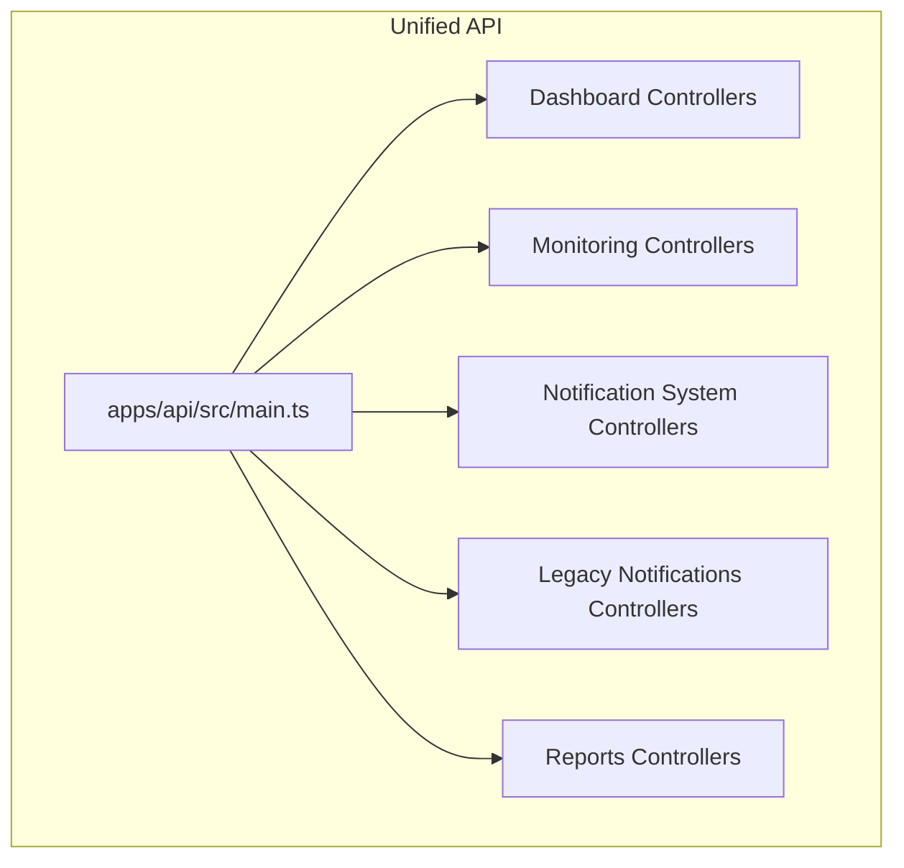
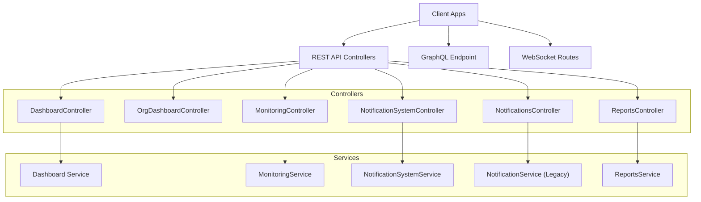
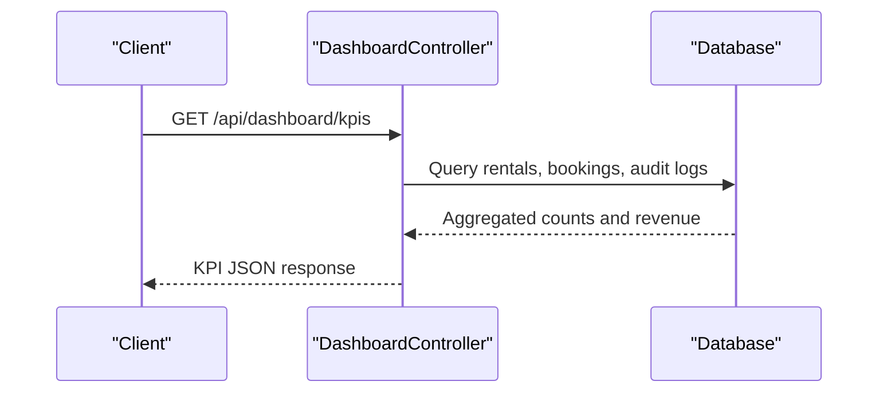
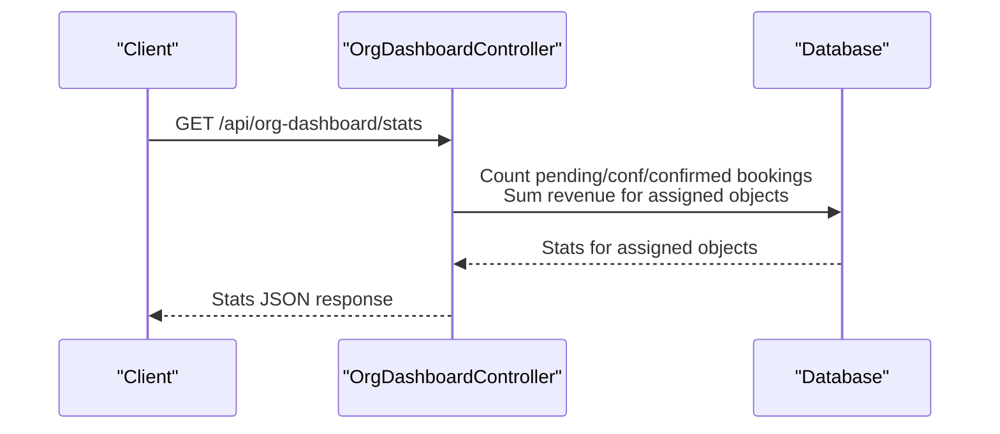
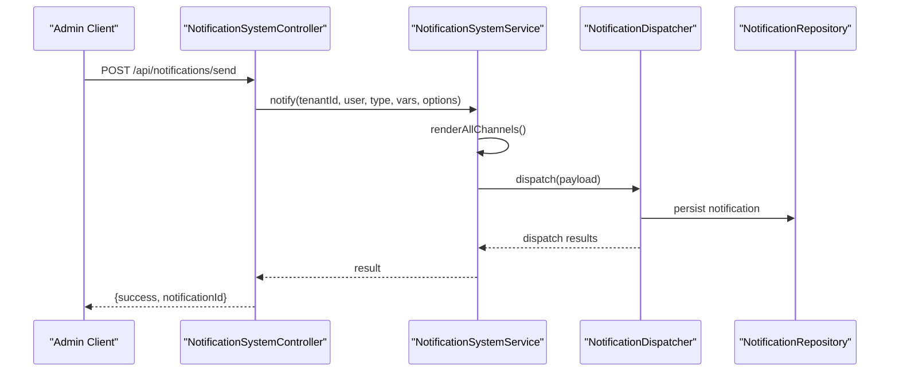
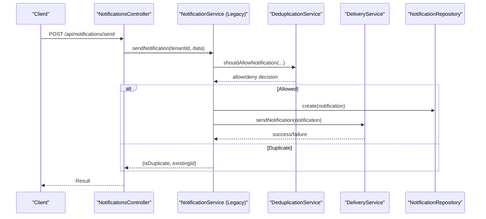
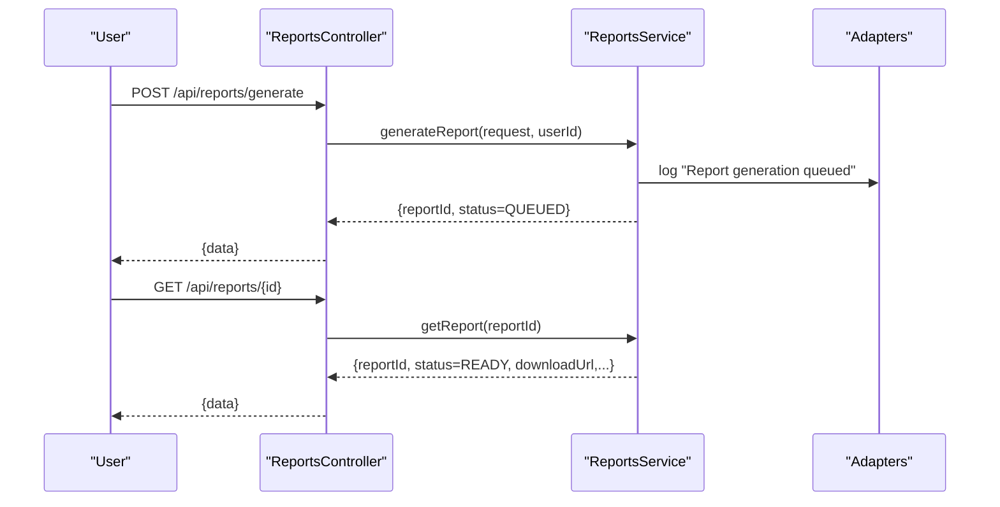
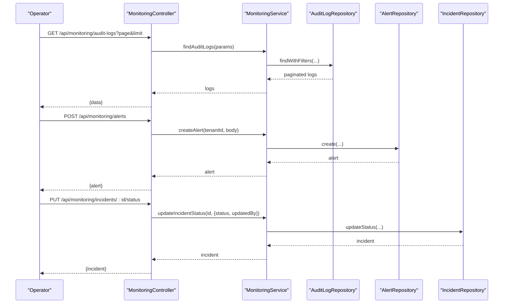
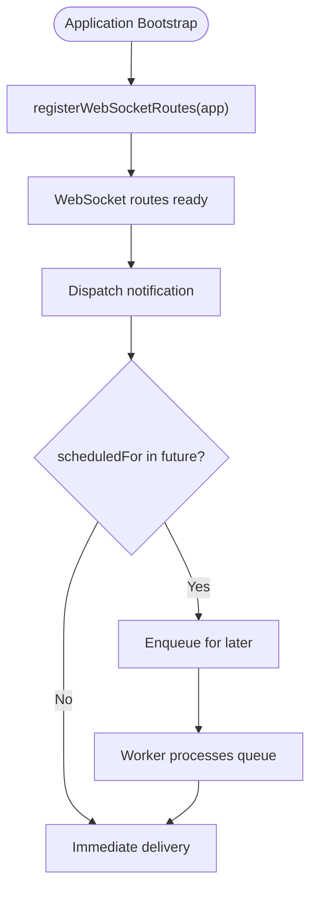
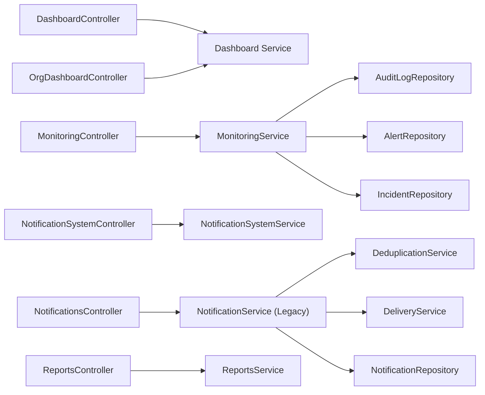

# Specialized Services

<cite>
**Referenced Files in This Document**
- [apps/api/src/main.ts](file://apps/api/src/main.ts)
- [apps/api/src/modules/dashboard/dashboard.controller.ts](file://apps/api/src/modules/dashboard/dashboard.controller.ts)
- [apps/api/src/modules/dashboard/org-dashboard.controller.ts](file://apps/api/src/modules/dashboard/org-dashboard.controller.ts)
- [apps/api/src/modules/monitoring/monitoring.controller.ts](file://apps/api/src/modules/monitoring/monitoring.controller.ts)
- [apps/api/src/modules/monitoring/monitoring.service.ts](file://apps/api/src/modules/monitoring/monitoring.service.ts)
- [apps/api/src/modules/reports/reports.controller.ts](file://apps/api/src/modules/reports/reports.controller.ts)
- [apps/api/src/modules/reports/reports.service.ts](file://apps/api/src/modules/reports/reports.service.ts)
- [apps/api/src/modules/notification-system/notification.controller.ts](file://apps/api/src/modules/notification-system/notification.controller.ts)
- [apps/api/src/modules/notification-system/notification.service.ts](file://apps/api/src/modules/notification-system/notification.service.ts)
- [apps/api/src/modules/notifications/notifications.controller.ts](file://apps/api/src/modules/notifications/notifications.controller.ts)
- [apps/api/src/modules/notifications/notification.service.ts](file://apps/api/src/modules/notifications/notification.service.ts)
</cite>

## Table of Contents
1. [Introduction](#introduction)
2. [Project Structure](#project-structure)
3. [Core Components](#core-components)
4. [Architecture Overview](#architecture-overview)
5. [Detailed Component Analysis](#detailed-component-analysis)
6. [Dependency Analysis](#dependency-analysis)
7. [Performance Considerations](#performance-considerations)
8. [Troubleshooting Guide](#troubleshooting-guide)
9. [Conclusion](#conclusion)

## Introduction
This document describes specialized services that power dashboards, notifications, reporting, and monitoring across the platform. It focuses on:
- Dashboard analytics for backoffice and organizational contexts
- Notification delivery and lifecycle management
- Report generation and distribution
- System monitoring for audit logs, alerts, and incidents
- Integration with real-time features and scheduling

The goal is to explain APIs, data aggregation patterns, scheduling mechanisms, and composition strategies for building comprehensive application functionality.

## Project Structure
The specialized services are implemented as modular controllers and services under the unified API entry point. The main application registers repositories, services, controllers, and integrates GraphQL and WebSocket routes.

**Diagram sources**
- [apps/api/src/main.ts](file://apps/api/src/main.ts#L245-L305)

**Section sources**
- [apps/api/src/main.ts](file://apps/api/src/main.ts#L112-L366)

## Core Components
- Dashboard service: Provides KPIs, stats, and recent activity for backoffice; and org-scoped stats, pending items, calendar preview, and alerts for organization users.
- Monitoring service: Manages audit logs, alerts, and incidents with REST endpoints for querying and lifecycle updates.
- Reports service: Defines report templates and orchestrates report generation with queued processing and status retrieval.
- Notification services: Two complementary systems—modern notification system with templates and channels, and legacy notifications with deduplication and delivery tracking.

**Section sources**
- [apps/api/src/modules/dashboard/dashboard.controller.ts](file://apps/api/src/modules/dashboard/dashboard.controller.ts#L18-L112)
- [apps/api/src/modules/dashboard/org-dashboard.controller.ts](file://apps/api/src/modules/dashboard/org-dashboard.controller.ts#L80-L208)
- [apps/api/src/modules/monitoring/monitoring.controller.ts](file://apps/api/src/modules/monitoring/monitoring.controller.ts#L28-L131)
- [apps/api/src/modules/reports/reports.controller.ts](file://apps/api/src/modules/reports/reports.controller.ts#L27-L64)
- [apps/api/src/modules/notification-system/notification.controller.ts](file://apps/api/src/modules/notification-system/notification.controller.ts#L63-L87)
- [apps/api/src/modules/notifications/notifications.controller.ts](file://apps/api/src/modules/notifications/notifications.controller.ts#L86-L115)

## Architecture Overview
The system exposes REST endpoints for each domain, integrates GraphQL for advanced queries, and supports real-time updates via WebSocket routes. Services encapsulate business logic and coordinate with repositories and adapters.

**Diagram sources**
- [apps/api/src/main.ts](file://apps/api/src/main.ts#L318-L330)
- [apps/api/src/modules/dashboard/dashboard.controller.ts](file://apps/api/src/modules/dashboard/dashboard.controller.ts#L16-L20)
- [apps/api/src/modules/dashboard/org-dashboard.controller.ts](file://apps/api/src/modules/dashboard/org-dashboard.controller.ts#L74-L75)
- [apps/api/src/modules/monitoring/monitoring.controller.ts](file://apps/api/src/modules/monitoring/monitoring.controller.ts#L15-L16)
- [apps/api/src/modules/notification-system/notification.controller.ts](file://apps/api/src/modules/notification-system/notification.controller.ts#L55-L56)
- [apps/api/src/modules/notifications/notifications.controller.ts](file://apps/api/src/modules/notifications/notifications.controller.ts#L77-L80)
- [apps/api/src/modules/reports/reports.controller.ts](file://apps/api/src/modules/reports/reports.controller.ts#L17-L21)

## Detailed Component Analysis

### Dashboard Analytics
The dashboard service aggregates key metrics and recent activity:
- Backoffice dashboard: active listings, pending requests, daily/weekly bookings, monthly revenue, cancellations, and top listings.
- Organization dashboard: stats scoped to assigned rental objects, pending items requiring approval, calendar preview, operational alerts, and assigned objects.

**Diagram sources**
- [apps/api/src/modules/dashboard/dashboard.controller.ts](file://apps/api/src/modules/dashboard/dashboard.controller.ts#L18-L112)

**Diagram sources**
- [apps/api/src/modules/dashboard/org-dashboard.controller.ts](file://apps/api/src/modules/dashboard/org-dashboard.controller.ts#L80-L208)

**Section sources**
- [apps/api/src/modules/dashboard/dashboard.controller.ts](file://apps/api/src/modules/dashboard/dashboard.controller.ts#L18-L185)
- [apps/api/src/modules/dashboard/org-dashboard.controller.ts](file://apps/api/src/modules/dashboard/org-dashboard.controller.ts#L80-L538)

### Notification Delivery and Lifecycle
Two notification systems coexist:
- Modern notification system: templated, multi-channel, scheduled delivery, and real-time broadcasting.
- Legacy notifications: deduplication, delivery attempts, retry mechanism, and admin endpoints.

**Diagram sources**
- [apps/api/src/modules/notification-system/notification.controller.ts](file://apps/api/src/modules/notification-system/notification.controller.ts#L220-L263)
- [apps/api/src/modules/notification-system/notification.service.ts](file://apps/api/src/modules/notification-system/notification.service.ts#L59-L125)

**Diagram sources**
- [apps/api/src/modules/notifications/notifications.controller.ts](file://apps/api/src/modules/notifications/notifications.controller.ts#L86-L115)
- [apps/api/src/modules/notifications/notification.service.ts](file://apps/api/src/modules/notifications/notification.service.ts#L69-L192)

**Section sources**
- [apps/api/src/modules/notification-system/notification.controller.ts](file://apps/api/src/modules/notification-system/notification.controller.ts#L55-L458)
- [apps/api/src/modules/notification-system/notification.service.ts](file://apps/api/src/modules/notification-system/notification.service.ts#L33-L369)
- [apps/api/src/modules/notifications/notifications.controller.ts](file://apps/api/src/modules/notifications/notifications.controller.ts#L77-L309)
- [apps/api/src/modules/notifications/notification.service.ts](file://apps/api/src/modules/notifications/notification.service.ts#L57-L321)

### Report Generation and Distribution
The reporting service defines templates and orchestrates report generation with queued processing and status retrieval.

**Diagram sources**
- [apps/api/src/modules/reports/reports.controller.ts](file://apps/api/src/modules/reports/reports.controller.ts#L37-L64)
- [apps/api/src/modules/reports/reports.service.ts](file://apps/api/src/modules/reports/reports.service.ts#L87-L128)

**Section sources**
- [apps/api/src/modules/reports/reports.controller.ts](file://apps/api/src/modules/reports/reports.controller.ts#L17-L201)
- [apps/api/src/modules/reports/reports.service.ts](file://apps/api/src/modules/reports/reports.service.ts#L21-L140)

### System Monitoring (Audit Logs, Alerts, Incidents)
The monitoring service manages audit logs, alerts, and incidents with REST endpoints for querying and lifecycle updates.

**Diagram sources**
- [apps/api/src/modules/monitoring/monitoring.controller.ts](file://apps/api/src/modules/monitoring/monitoring.controller.ts#L28-L131)
- [apps/api/src/modules/monitoring/monitoring.service.ts](file://apps/api/src/modules/monitoring/monitoring.service.ts#L41-L160)

**Section sources**
- [apps/api/src/modules/monitoring/monitoring.controller.ts](file://apps/api/src/modules/monitoring/monitoring.controller.ts#L15-L133)
- [apps/api/src/modules/monitoring/monitoring.service.ts](file://apps/api/src/modules/monitoring/monitoring.service.ts#L10-L162)

### Real-Time Features and Scheduling
Real-time updates are exposed via WebSocket routes registered during application bootstrap. Scheduling is supported in the modern notification system for delayed dispatch.

**Diagram sources**
- [apps/api/src/main.ts](file://apps/api/src/main.ts#L318-L320)
- [apps/api/src/modules/notification-system/notification.service.ts](file://apps/api/src/modules/notification-system/notification.service.ts#L130-L147)

**Section sources**
- [apps/api/src/main.ts](file://apps/api/src/main.ts#L318-L330)
- [apps/api/src/modules/notification-system/notification.service.ts](file://apps/api/src/modules/notification-system/notification.service.ts#L129-L194)

## Dependency Analysis
The specialized services depend on repositories and adapters, and controllers rely on services for business logic.

**Diagram sources**
- [apps/api/src/modules/monitoring/monitoring.service.ts](file://apps/api/src/modules/monitoring/monitoring.service.ts#L12-L17)
- [apps/api/src/modules/notifications/notification.service.ts](file://apps/api/src/modules/notifications/notification.service.ts#L57-L63)

**Section sources**
- [apps/api/src/modules/monitoring/monitoring.service.ts](file://apps/api/src/modules/monitoring/monitoring.service.ts#L10-L162)
- [apps/api/src/modules/notifications/notification.service.ts](file://apps/api/src/modules/notifications/notification.service.ts#L57-L321)

## Performance Considerations
- Dashboard queries aggregate counts and sums; ensure appropriate indexes on status and timestamps for efficient filtering.
- Reports generation is designed to be queued; avoid synchronous heavy computations in controllers.
- Notification scheduling defers work to background processing; tune worker concurrency and retry policies.
- Use pagination for audit logs and reports to limit payload sizes.

## Troubleshooting Guide
- Unauthorized access: Controllers enforce authentication and role checks (e.g., admin-only endpoints).
- Missing environment variables: The main entry point validates DATABASE_URL and JWT_SECRET.
- Notification deduplication: Legacy notifications controller returns duplicate detection errors with existing notification IDs.
- Monitoring endpoints: NotFoundError is thrown when resources (alert/incident) are not found.

**Section sources**
- [apps/api/src/modules/notification-system/notification.controller.ts](file://apps/api/src/modules/notification-system/notification.controller.ts#L224-L231)
- [apps/api/src/modules/monitoring/monitoring.controller.ts](file://apps/api/src/modules/monitoring/monitoring.controller.ts#L104-L106)
- [apps/api/src/modules/monitoring/monitoring.service.ts](file://apps/api/src/modules/monitoring/monitoring.service.ts#L85-L98)
- [apps/api/src/modules/notifications/notifications.controller.ts](file://apps/api/src/modules/notifications/notifications.controller.ts#L106-L114)
- [apps/api/src/main.ts](file://apps/api/src/main.ts#L123-L142)

## Conclusion
The specialized services provide a cohesive foundation for dashboards, notifications, reporting, and monitoring. They leverage modular controllers, robust service layers, and real-time capabilities while supporting scheduling and administrative workflows. Compose these services to build comprehensive application functionality with clear separation of concerns and scalable data aggregation patterns.