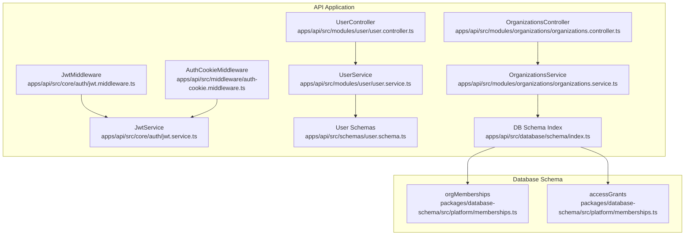
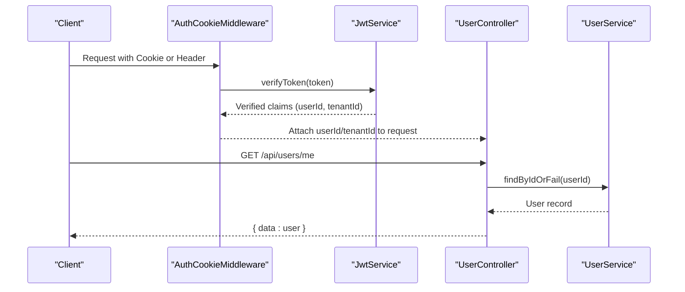
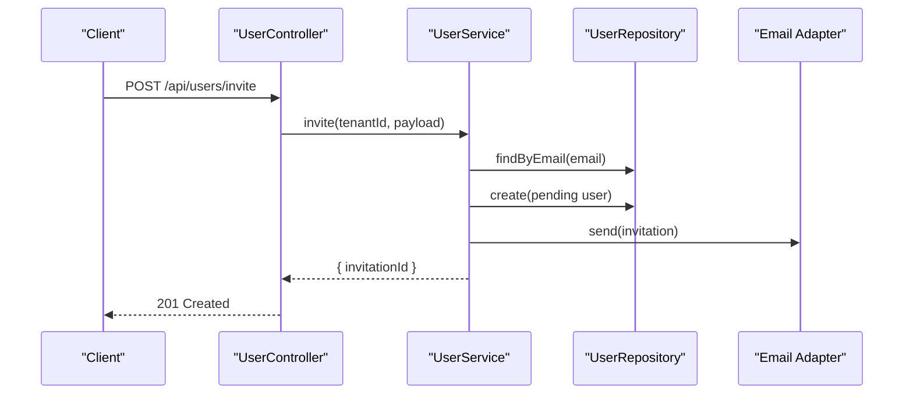
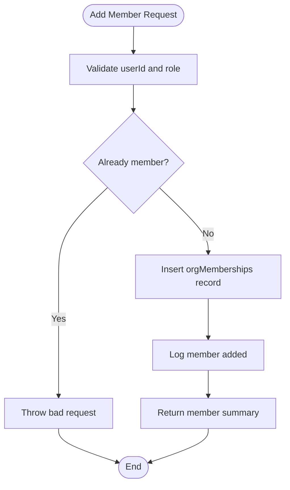
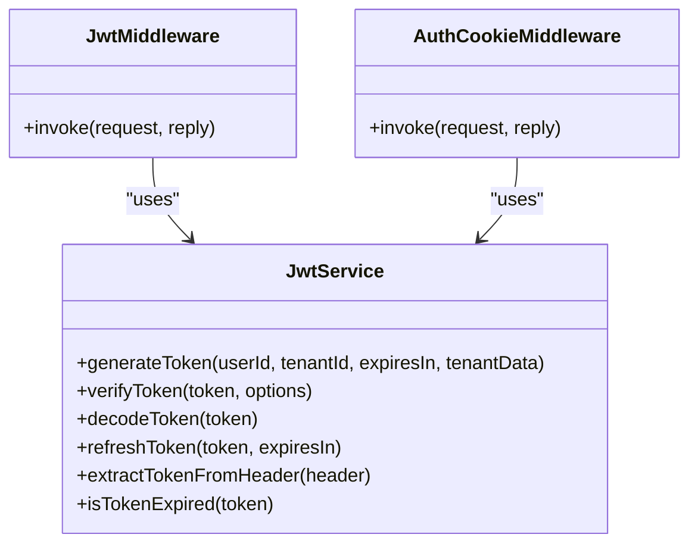
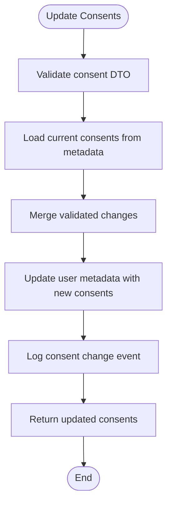
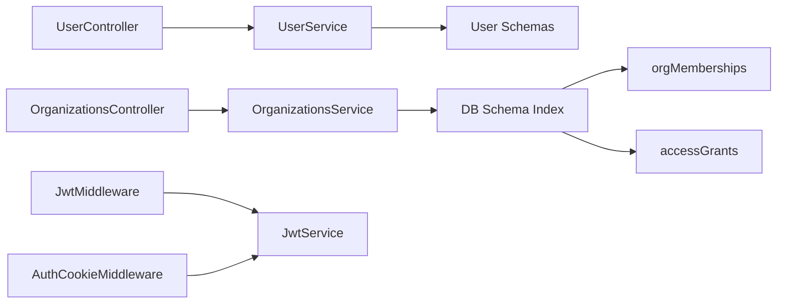

# User & Organization Service

<cite>
**Referenced Files in This Document**
- [apps/api/src/modules/user/user.controller.ts](file://apps/api/src/modules/user/user.controller.ts)
- [apps/api/src/modules/user/user.service.ts](file://apps/api/src/modules/user/user.service.ts)
- [apps/api/src/schemas/user.schema.ts](file://apps/api/src/schemas/user.schema.ts)
- [apps/api/src/modules/organizations/organizations.controller.ts](file://apps/api/src/modules/organizations/organizations.controller.ts)
- [apps/api/src/modules/organizations/organizations.service.ts](file://apps/api/src/modules/organizations/organizations.service.ts)
- [packages/database-schema/src/platform/memberships.ts](file://packages/database-schema/src/platform/memberships.ts)
- [apps/api/src/core/auth/jwt.service.ts](file://apps/api/src/core/auth/jwt.service.ts)
- [apps/api/src/core/auth/jwt.middleware.ts](file://apps/api/src/core/auth/jwt.middleware.ts)
- [apps/api/src/middleware/auth-cookie.middleware.ts](file://apps/api/src/middleware/auth-cookie.middleware.ts)
- [apps/api/src/database/schema/index.ts](file://apps/api/src/database/schema/index.ts)
- [apps/api/README.md](file://apps/api/README.md)
</cite>

## Table of Contents
1. [Introduction](#introduction)
2. [Project Structure](#project-structure)
3. [Core Components](#core-components)
4. [Architecture Overview](#architecture-overview)
5. [Detailed Component Analysis](#detailed-component-analysis)
6. [Dependency Analysis](#dependency-analysis)
7. [Performance Considerations](#performance-considerations)
8. [Troubleshooting Guide](#troubleshooting-guide)
9. [Conclusion](#conclusion)
10. [Appendices](#appendices)

## Introduction
This document describes the User and Organization Service integration within the unified API. It covers user management (registration, profile updates, consent handling), organization administration (creation, modification, hierarchy-related operations), and membership operations (invitation, role assignment, status tracking). It also documents authentication integration, session management, and user consent handling, along with a practical API reference for the covered workflows.

## Project Structure
The User and Organization domains are implemented as modular services within the API application. Controllers expose REST endpoints, services encapsulate business logic, repositories handle persistence, and Zod schemas define validation. Authentication is handled centrally via JWT services and middleware, while organization membership and access grants are persisted in dedicated schema tables.

**Diagram sources**
- [apps/api/src/modules/user/user.controller.ts](file://apps/api/src/modules/user/user.controller.ts#L1-L159)
- [apps/api/src/modules/user/user.service.ts](file://apps/api/src/modules/user/user.service.ts#L1-L305)
- [apps/api/src/modules/organizations/organizations.controller.ts](file://apps/api/src/modules/organizations/organizations.controller.ts#L1-L208)
- [apps/api/src/modules/organizations/organizations.service.ts](file://apps/api/src/modules/organizations/organizations.service.ts#L1-L409)
- [apps/api/src/core/auth/jwt.service.ts](file://apps/api/src/core/auth/jwt.service.ts#L1-L259)
- [apps/api/src/core/auth/jwt.middleware.ts](file://apps/api/src/core/auth/jwt.middleware.ts#L1-L54)
- [apps/api/src/middleware/auth-cookie.middleware.ts](file://apps/api/src/middleware/auth-cookie.middleware.ts#L1-L135)
- [apps/api/src/schemas/user.schema.ts](file://apps/api/src/schemas/user.schema.ts#L1-L136)
- [apps/api/src/database/schema/index.ts](file://apps/api/src/database/schema/index.ts)
- [packages/database-schema/src/platform/memberships.ts](file://packages/database-schema/src/platform/memberships.ts#L1-L95)

**Section sources**
- [apps/api/README.md](file://apps/api/README.md#L1-L61)

## Core Components
- User Controller: Exposes endpoints for listing, retrieving, creating, inviting, updating, assigning roles, deactivating/reactivating, and deleting users. Also exposes a consent retrieval endpoint.
- User Service: Implements business logic for user creation, invitations, updates, role assignment, deactivation, deletion, and consent management. Integrates with adapters for logging, analytics, and email.
- Organization Controller: Provides endpoints for listing, retrieving, creating, updating, deleting/archiving organizations, listing and managing members, and managing rental object assignments.
- Organization Service: Implements organization lifecycle operations, member management, and access grant management for rental objects. Applies role-based scoping for visibility.
- Authentication: JWT service and middleware provide token generation, verification, and extraction. Auth cookie middleware supports cookie-based auth with fallback to headers and development auto-injection.
- Database Schema: Defines orgMemberships and accessGrants tables for membership and access control.

**Section sources**
- [apps/api/src/modules/user/user.controller.ts](file://apps/api/src/modules/user/user.controller.ts#L1-L159)
- [apps/api/src/modules/user/user.service.ts](file://apps/api/src/modules/user/user.service.ts#L1-L305)
- [apps/api/src/modules/organizations/organizations.controller.ts](file://apps/api/src/modules/organizations/organizations.controller.ts#L1-L208)
- [apps/api/src/modules/organizations/organizations.service.ts](file://apps/api/src/modules/organizations/organizations.service.ts#L1-L409)
- [apps/api/src/core/auth/jwt.service.ts](file://apps/api/src/core/auth/jwt.service.ts#L1-L259)
- [apps/api/src/core/auth/jwt.middleware.ts](file://apps/api/src/core/auth/jwt.middleware.ts#L1-L54)
- [apps/api/src/middleware/auth-cookie.middleware.ts](file://apps/api/src/middleware/auth-cookie.middleware.ts#L1-L135)
- [packages/database-schema/src/platform/memberships.ts](file://packages/database-schema/src/platform/memberships.ts#L1-L95)

## Architecture Overview
The system follows a layered architecture:
- Presentation Layer: Controllers expose REST endpoints.
- Application Layer: Services orchestrate business logic and coordinate with repositories/adapters.
- Persistence Layer: Drizzle ORM queries against PostgreSQL tables for users, organizations, memberships, and access grants.
- Security Layer: JWT-based authentication with middleware attaching user context to requests.

**Diagram sources**
- [apps/api/src/middleware/auth-cookie.middleware.ts](file://apps/api/src/middleware/auth-cookie.middleware.ts#L32-L124)
- [apps/api/src/core/auth/jwt.service.ts](file://apps/api/src/core/auth/jwt.service.ts#L112-L158)
- [apps/api/src/modules/user/user.controller.ts](file://apps/api/src/modules/user/user.controller.ts#L48-L57)
- [apps/api/src/modules/user/user.service.ts](file://apps/api/src/modules/user/user.service.ts#L132-L138)

## Detailed Component Analysis

### User Management
Endpoints and workflows:
- List users: GET /api/users with pagination and filters.
- Retrieve current user: GET /api/users/me (requires authenticated context).
- Retrieve user consents: GET /api/users/me/consents (mocked).
- Create user: POST /api/users with validation.
- Invite user: POST /api/users/invite (creates pending user).
- Update user: PUT /api/users/:id.
- Assign role: PUT /api/users/:id/role.
- Deactivate/Reactivate: PUT /api/users/:id/deactivate, PUT /api/users/:id/reactivate.
- Delete user: DELETE /api/users/:id.

Validation and data transfer:
- Zod schemas define DTOs for create, update, invite, role assignment, and query parameters.
- Service enforces uniqueness on email and handles audit logs and analytics events.

**Diagram sources**
- [apps/api/src/modules/user/user.controller.ts](file://apps/api/src/modules/user/user.controller.ts#L104-L110)
- [apps/api/src/modules/user/user.service.ts](file://apps/api/src/modules/user/user.service.ts#L80-L120)

**Section sources**
- [apps/api/src/modules/user/user.controller.ts](file://apps/api/src/modules/user/user.controller.ts#L25-L157)
- [apps/api/src/modules/user/user.service.ts](file://apps/api/src/modules/user/user.service.ts#L38-L120)
- [apps/api/src/schemas/user.schema.ts](file://apps/api/src/schemas/user.schema.ts#L40-L95)

### Organization Administration and Membership Operations
Endpoints and workflows:
- List organizations: GET /organizations with capability guard.
- Get organization: GET /organizations/:id.
- Create organization: POST /organizations (capability guard).
- Update organization: PUT /organizations/:id (capability guard).
- Delete/Archive organization: DELETE /organizations/:id (capability guard).
- List members: GET /organizations/:id/members.
- Add member: POST /organizations/:id/members (capability guard).
- Remove member: DELETE /organizations/:id/members/:userId (capability guard).
- List assigned rental objects: GET /organizations/:id/rental-objects.
- Assign rental object: POST /organizations/:id/rental-objects (capability guard).
- Unassign rental object: DELETE /organizations/:id/rental-objects/:rentalObjectId (capability guard).

Role-based scoping:
- KOMMUNE_ADMIN sees all organizations.
- ORG_ADMIN sees only their own organization.

Membership and access control:
- Membership records stored in orgMemberships with role and status.
- Access grants for rental objects stored in accessGrants with metadata and validity windows.

**Diagram sources**
- [apps/api/src/modules/organizations/organizations.service.ts](file://apps/api/src/modules/organizations/organizations.service.ts#L224-L271)

**Section sources**
- [apps/api/src/modules/organizations/organizations.controller.ts](file://apps/api/src/modules/organizations/organizations.controller.ts#L20-L206)
- [apps/api/src/modules/organizations/organizations.service.ts](file://apps/api/src/modules/organizations/organizations.service.ts#L56-L82)
- [packages/database-schema/src/platform/memberships.ts](file://packages/database-schema/src/platform/memberships.ts#L16-L48)

### Authentication Integration and Session Management
- JWT Service: Generates and verifies tokens with issuer/audience constraints, validates UUID tenant IDs, and supports optional subscription and feature flag payloads.
- JWT Middleware: Extracts token from Authorization header and attaches userId/tenantId to the request.
- Auth Cookie Middleware: Extracts JWT from HTTP-only cookie (primary) or Authorization header (fallback), supports development auto-injection, and logs auth source.

**Diagram sources**
- [apps/api/src/core/auth/jwt.service.ts](file://apps/api/src/core/auth/jwt.service.ts#L45-L258)
- [apps/api/src/core/auth/jwt.middleware.ts](file://apps/api/src/core/auth/jwt.middleware.ts#L14-L53)
- [apps/api/src/middleware/auth-cookie.middleware.ts](file://apps/api/src/middleware/auth-cookie.middleware.ts#L32-L124)

**Section sources**
- [apps/api/src/core/auth/jwt.service.ts](file://apps/api/src/core/auth/jwt.service.ts#L66-L103)
- [apps/api/src/core/auth/jwt.middleware.ts](file://apps/api/src/core/auth/jwt.middleware.ts#L17-L51)
- [apps/api/src/middleware/auth-cookie.middleware.ts](file://apps/api/src/middleware/auth-cookie.middleware.ts#L43-L103)

### User Consent Handling
- Endpoint: GET /api/users/me/consents returns consent preferences.
- Service logic merges current consent preferences with updates and persists them in user metadata, with audit logging.

**Diagram sources**
- [apps/api/src/modules/user/user.service.ts](file://apps/api/src/modules/user/user.service.ts#L262-L303)
- [apps/api/src/schemas/user.schema.ts](file://apps/api/src/schemas/user.schema.ts#L125-L133)

**Section sources**
- [apps/api/src/modules/user/user.controller.ts](file://apps/api/src/modules/user/user.controller.ts#L62-L79)
- [apps/api/src/modules/user/user.service.ts](file://apps/api/src/modules/user/user.service.ts#L240-L303)
- [apps/api/src/schemas/user.schema.ts](file://apps/api/src/schemas/user.schema.ts#L100-L133)

## Dependency Analysis
Key dependencies and relationships:
- Controllers depend on Services for business logic.
- Services depend on Repositories and Adapters (logging, analytics, email).
- Organization Service depends on database schema indexes for orgMemberships and accessGrants.
- Authentication middleware depends on JwtService for token verification.

**Diagram sources**
- [apps/api/src/modules/user/user.controller.ts](file://apps/api/src/modules/user/user.controller.ts#L19-L23)
- [apps/api/src/modules/user/user.service.ts](file://apps/api/src/modules/user/user.service.ts#L28-L33)
- [apps/api/src/modules/organizations/organizations.controller.ts](file://apps/api/src/modules/organizations/organizations.controller.ts#L14-L17)
- [apps/api/src/modules/organizations/organizations.service.ts](file://apps/api/src/modules/organizations/organizations.service.ts#L47-L50)
- [apps/api/src/schemas/user.schema.ts](file://apps/api/src/schemas/user.schema.ts#L1-L136)
- [apps/api/src/database/schema/index.ts](file://apps/api/src/database/schema/index.ts)
- [packages/database-schema/src/platform/memberships.ts](file://packages/database-schema/src/platform/memberships.ts#L16-L48)
- [apps/api/src/core/auth/jwt.middleware.ts](file://apps/api/src/core/auth/jwt.middleware.ts#L14-L15)
- [apps/api/src/middleware/auth-cookie.middleware.ts](file://apps/api/src/middleware/auth-cookie.middleware.ts#L41-L41)

**Section sources**
- [apps/api/src/database/schema/index.ts](file://apps/api/src/database/schema/index.ts)
- [packages/database-schema/src/platform/memberships.ts](file://packages/database-schema/src/platform/memberships.ts#L16-L48)

## Performance Considerations
- Pagination defaults are applied in user listing to avoid heavy queries; tune limit and page parameters per client needs.
- Membership and access grant queries leverage indexed columns (orgMemberships_user_org_idx, access_grants_org_rental_object_idx) to optimize joins and lookups.
- Consider caching frequently accessed user or organization metadata where appropriate, ensuring cache invalidation on updates.

## Troubleshooting Guide
Common issues and resolutions:
- Missing or invalid Authorization header: Ensure Bearer token is provided; middleware throws unauthorized errors for malformed headers.
- Expired tokens: Tokens validated with expiration checks; clients should refresh or re-authenticate.
- Invalid token signature: Indicates tampering or wrong secret; verify JWT configuration.
- Role-based access denied: Organization endpoints enforce capability guards; ensure the authenticated user has the required capability.
- Duplicate user email during invite/create: Service throws conflict error when email already exists.

**Section sources**
- [apps/api/src/core/auth/jwt.middleware.ts](file://apps/api/src/core/auth/jwt.middleware.ts#L22-L51)
- [apps/api/src/middleware/auth-cookie.middleware.ts](file://apps/api/src/middleware/auth-cookie.middleware.ts#L91-L123)
- [apps/api/src/modules/user/user.service.ts](file://apps/api/src/modules/user/user.service.ts#L42-L45)
- [apps/api/src/modules/organizations/organizations.controller.ts](file://apps/api/src/modules/organizations/organizations.controller.ts#L27-L134)

## Conclusion
The User and Organization Service integration provides a robust foundation for user lifecycle management, organization administration, and membership operations. It leverages JWT-based authentication, capability guards, and a clear separation of concerns across controllers, services, and persistence. The design supports scalability, maintainability, and extensibility for future enhancements.

## Appendices

### API Reference

- User Management
  - GET /api/users
    - Query parameters: organizationId, role, status, search, page, limit
    - Response: paginated data array with meta
  - GET /api/users/me
    - Response: current user object
  - GET /api/users/me/consents
    - Response: consent preferences
  - GET /api/users/:id
    - Response: user object
  - POST /api/users
    - Body: CreateUserDTO
    - Response: created user
  - POST /api/users/invite
    - Body: InviteUserDTO
    - Response: { invitationId }
  - PUT /api/users/:id
    - Body: UpdateUserDTO
    - Response: updated user
  - PUT /api/users/:id/role
    - Body: AssignRoleDTO
    - Response: user with new role
  - PUT /api/users/:id/deactivate
    - Response: deactivated user
  - PUT /api/users/:id/reactivate
    - Response: user set to active
  - DELETE /api/users/:id
    - Response: { success: true }

- Organization Administration
  - GET /organizations
    - Query parameters: filters supported by service
    - Response: organizations array
  - GET /organizations/:id
    - Response: organization object
  - POST /organizations
    - Body: CreateOrganizationRequest
    - Response: created organization
  - PUT /organizations/:id
    - Body: UpdateOrganizationRequest
    - Response: updated organization
  - DELETE /organizations/:id
    - Response: { success: true }

- Membership Management
  - GET /organizations/:id/members
    - Response: members array with roles and status
  - POST /organizations/:id/members
    - Body: AddMemberRequest
    - Response: member summary
  - DELETE /organizations/:id/members/:userId
    - Response: { success: true }

- Access Grant Management
  - GET /organizations/:id/rental-objects
    - Response: assigned rental objects
  - POST /organizations/:id/rental-objects
    - Body: AssignRentalObjectRequest
    - Response: grant summary
  - DELETE /organizations/:id/rental-objects/:rentalObjectId
    - Response: { success: true }

**Section sources**
- [apps/api/src/modules/user/user.controller.ts](file://apps/api/src/modules/user/user.controller.ts#L25-L157)
- [apps/api/src/modules/organizations/organizations.controller.ts](file://apps/api/src/modules/organizations/organizations.controller.ts#L20-L206)
- [apps/api/src/schemas/user.schema.ts](file://apps/api/src/schemas/user.schema.ts#L40-L95)