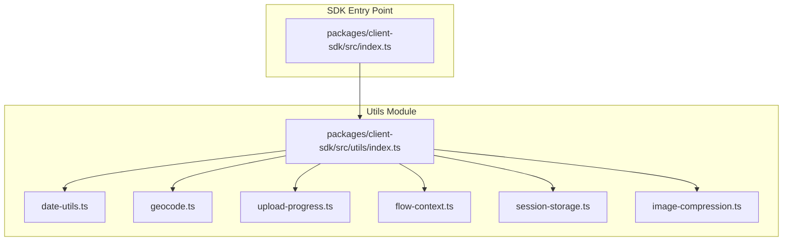
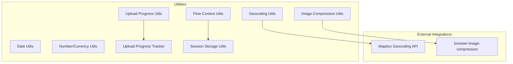
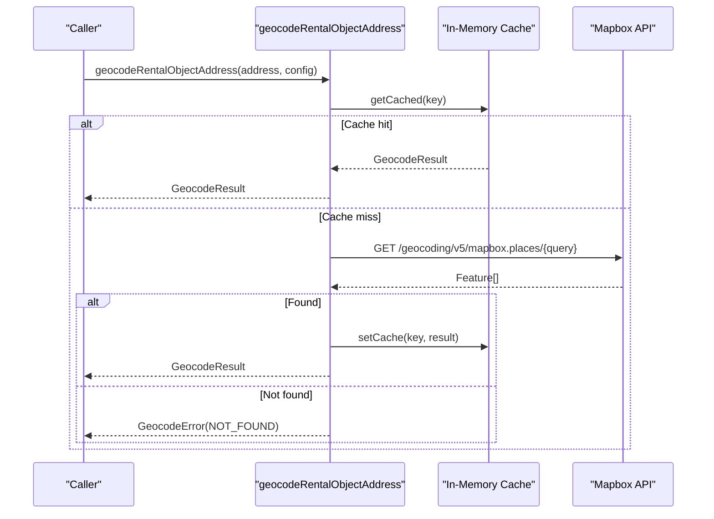
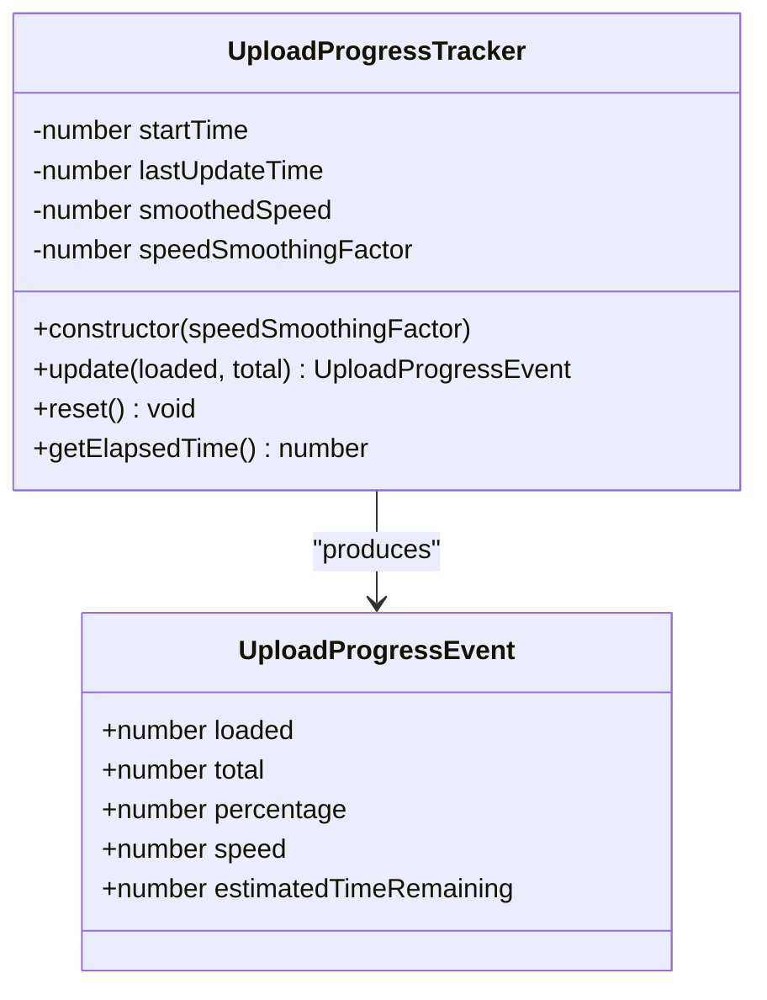
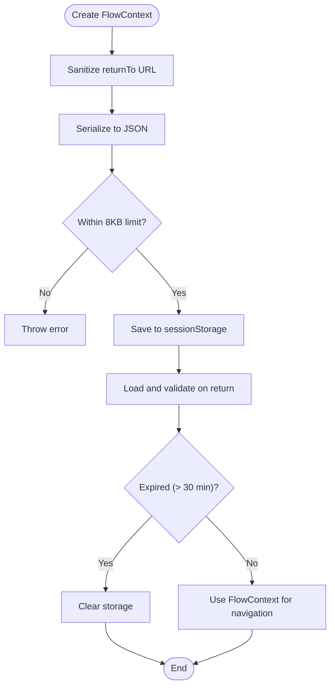
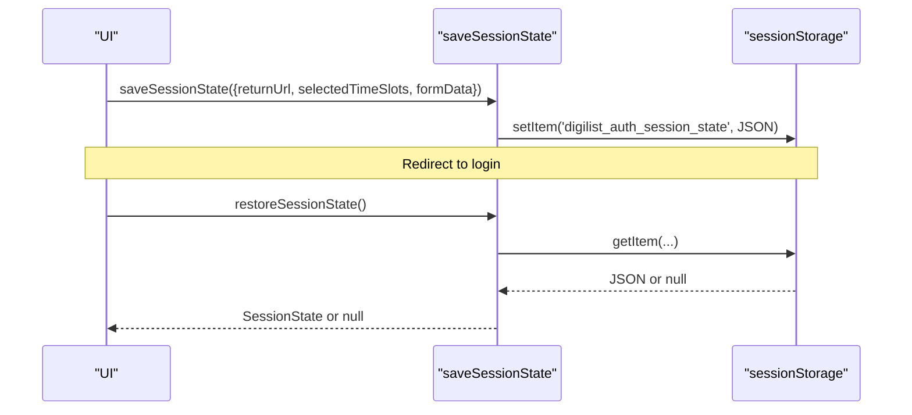
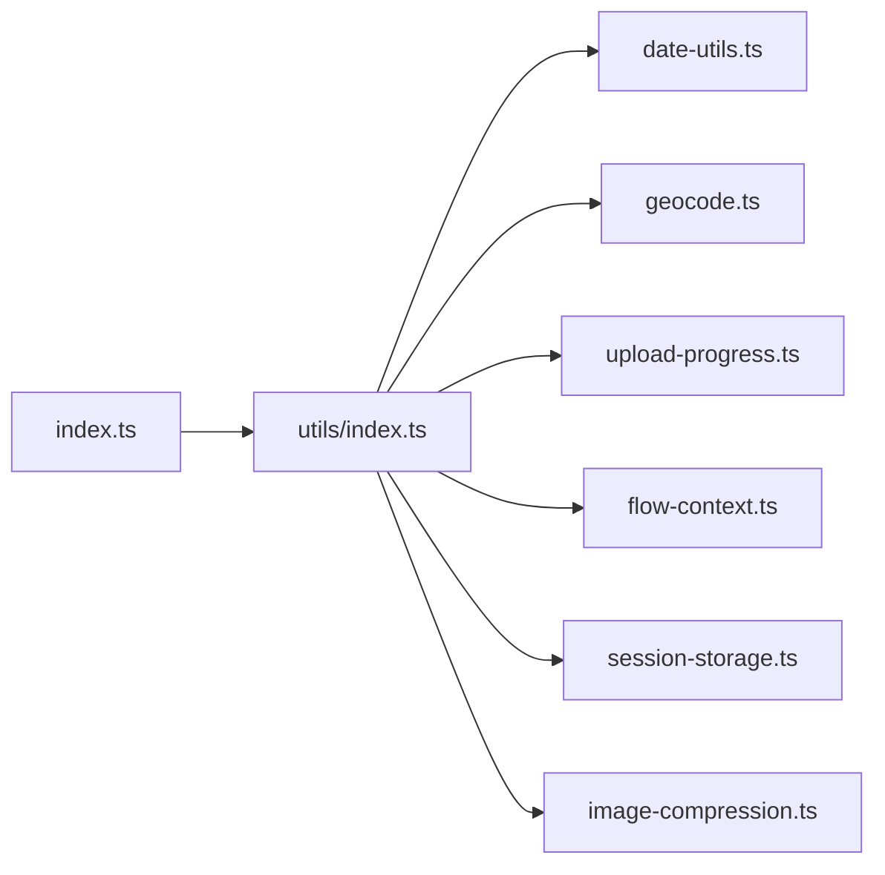

# Utility Functions & Helpers

<cite>
**Referenced Files in This Document**
- [index.ts](file://packages/client-sdk/src/index.ts)
- [utils/index.ts](file://packages/client-sdk/src/utils/index.ts)
- [date-utils.ts](file://packages/client-sdk/src/utils/date-utils.ts)
- [geocode.ts](file://packages/client-sdk/src/utils/geocode.ts)
- [upload-progress.ts](file://packages/client-sdk/src/utils/upload-progress.ts)
- [flow-context.ts](file://packages/client-sdk/src/utils/flow-context.ts)
- [session-storage.ts](file://packages/client-sdk/src/utils/session-storage.ts)
- [image-compression.ts](file://packages/client-sdk/src/utils/image-compression.ts)
- [auth.ts](file://packages/client-sdk/src/types/auth.ts)
- [upload.ts](file://packages/client-sdk/src/types/upload.ts)
</cite>

## Table of Contents
1. [Introduction](#introduction)
2. [Project Structure](#project-structure)
3. [Core Components](#core-components)
4. [Architecture Overview](#architecture-overview)
5. [Detailed Component Analysis](#detailed-component-analysis)
6. [Dependency Analysis](#dependency-analysis)
7. [Performance Considerations](#performance-considerations)
8. [Troubleshooting Guide](#troubleshooting-guide)
9. [Conclusion](#conclusion)

## Introduction
This document provides comprehensive documentation for the Client SDK utility functions and helper modules. It covers:
- Date formatting utilities for locales and relative time
- Currency and number formatting functions
- Geocoding capabilities with Mapbox integration and caching
- Upload progress tracking and formatting
- Flow context management for session-safe navigation and return-to functionality
- Session state persistence across authentication interruptions
- API reference for each utility function with parameter types, return values, and usage guidance
- Formatting options, locale support, and customization capabilities
- Performance considerations and caching strategies

## Project Structure
The Client SDK exposes a unified export surface that re-exports utility functions from the utils module. The utilities are organized into cohesive groups:
- Date/time formatting
- Number formatting
- Geocoding (Mapbox forward geocoding)
- Upload progress calculation and formatting
- Flow context management (session-safe navigation)
- Session state persistence
- Image compression helpers

**Diagram sources**
- [index.ts](file://packages/client-sdk/src/index.ts#L103-L152)
- [utils/index.ts](file://packages/client-sdk/src/utils/index.ts#L1-L123)

**Section sources**
- [index.ts](file://packages/client-sdk/src/index.ts#L103-L152)
- [utils/index.ts](file://packages/client-sdk/src/utils/index.ts#L1-L123)

## Core Components
This section summarizes the primary utility modules and their responsibilities.

- Date formatting utilities: Provide localized formatting for dates, times, periods, and relative time descriptions.
- Currency and number formatting: Format amounts and percentages using locale-aware number formatting.
- Geocoding: Convert addresses to coordinates using Mapbox with in-memory caching and rate-limited batch processing.
- Upload progress: Calculate progress metrics and format human-readable strings; track upload state with smoothing.
- Flow context: Serialize, validate, and manage navigation and booking state across authentication interruptions.
- Session storage: Persist and restore partial UI state across authentication redirects.
- Image compression: Validate and compress images with configurable options.

**Section sources**
- [date-utils.ts](file://packages/client-sdk/src/utils/date-utils.ts#L1-L193)
- [geocode.ts](file://packages/client-sdk/src/utils/geocode.ts#L1-L538)
- [upload-progress.ts](file://packages/client-sdk/src/utils/upload-progress.ts#L1-L247)
- [flow-context.ts](file://packages/client-sdk/src/utils/flow-context.ts#L1-L599)
- [session-storage.ts](file://packages/client-sdk/src/utils/session-storage.ts#L1-L109)
- [image-compression.ts](file://packages/client-sdk/src/utils/image-compression.ts#L1-L180)

## Architecture Overview
The utilities are designed to be framework-agnostic and reusable across applications. They rely on:
- Browser APIs (Intl, fetch, sessionStorage)
- Third-party libraries (Mapbox for geocoding, browser-image-compression for image compression)
- Strict typing via TypeScript interfaces and enums

**Diagram sources**
- [geocode.ts](file://packages/client-sdk/src/utils/geocode.ts#L283-L416)
- [image-compression.ts](file://packages/client-sdk/src/utils/image-compression.ts#L6-L38)
- [upload-progress.ts](file://packages/client-sdk/src/utils/upload-progress.ts#L175-L246)
- [flow-context.ts](file://packages/client-sdk/src/utils/flow-context.ts#L409-L490)
- [session-storage.ts](file://packages/client-sdk/src/utils/session-storage.ts#L33-L83)

## Detailed Component Analysis

### Date Formatting Utilities
Provides localized formatting for dates, times, periods, and relative time.

- formatDate(date, options?): Formats a date to Norwegian locale with long month and numeric day/year.
- formatTime(date, options?): Formats time with two-digit hour and minute.
- formatWeekRange(startDate): Formats a week range spanning seven days with month-aware formatting.
- formatDateTime(date): Combines date and time with short month and numeric day/year.
- formatRelativeTime(date): Uses Intl.RelativeTimeFormat to describe relative time in minutes/hours/days.
- formatCurrency(amount, currency?): Formats currency using nb-NO locale with currency style.
- formatPercent(value, decimals?): Formats percentage with configurable decimal places.
- formatWeekdays(weekdays[]): Maps weekday numbers to Norwegian abbreviated day names.
- formatPeriod(startDate, endDate): Formats a date range with short month and optional year.
- formatTimeSlot(startTime, endTime): Concatenates time slot bounds.

Formatting options and locale support:
- All date/time formatting uses the nb-NO locale for consistent Norwegian presentation.
- Number formatting uses Intl.NumberFormat with currency and percent styles.
- Relative time uses Intl.RelativeTimeFormat with automatic pluralization and direction.

Customization capabilities:
- Pass Intl.DateTimeFormatOptions to formatDate/formatTime for fine-grained control.
- Adjust decimals for percentages via formatPercent.

Usage examples (conceptual):
- Localized date display for calendar views.
- Currency formatting in pricing contexts.
- Percentage formatting for analytics dashboards.

**Section sources**
- [date-utils.ts](file://packages/client-sdk/src/utils/date-utils.ts#L12-L25)
- [date-utils.ts](file://packages/client-sdk/src/utils/date-utils.ts#L33-L44)
- [date-utils.ts](file://packages/client-sdk/src/utils/date-utils.ts#L52-L67)
- [date-utils.ts](file://packages/client-sdk/src/utils/date-utils.ts#L74-L84)
- [date-utils.ts](file://packages/client-sdk/src/utils/date-utils.ts#L92-L111)
- [date-utils.ts](file://packages/client-sdk/src/utils/date-utils.ts#L123-L133)
- [date-utils.ts](file://packages/client-sdk/src/utils/date-utils.ts#L141-L149)
- [date-utils.ts](file://packages/client-sdk/src/utils/date-utils.ts#L161-L164)
- [date-utils.ts](file://packages/client-sdk/src/utils/date-utils.ts#L172-L182)
- [date-utils.ts](file://packages/client-sdk/src/utils/date-utils.ts#L190-L192)

### Currency and Number Formatting Functions
- formatCurrency(amount, currency?): Returns a localized currency string using nb-NO locale and currency style.
- formatPercent(value, decimals?): Returns a localized percentage string with fixed decimals.

Locale support:
- nb-NO locale ensures correct separators and currency symbol placement.

Customization:
- Supply a different currency code to formatCurrency.
- Control decimal precision for percentages.

**Section sources**
- [date-utils.ts](file://packages/client-sdk/src/utils/date-utils.ts#L123-L133)
- [date-utils.ts](file://packages/client-sdk/src/utils/date-utils.ts#L141-L149)

### Geocoding Capabilities
Implements Mapbox forward geocoding with robust error handling, caching, and batching.

Key functions:
- geocodeRentalObjectAddress(address, config): Performs forward geocoding with Mapbox; caches results; supports proximity bias for Norwegian cities.
- geocodeAddresses(addresses, config, options): Batch geocoding with concurrency and delay controls.
- buildAddressString(address): Normalizes address components into a single query string.
- getCachedGeocode(address)/getCachedGeocodeFromString(addressString, country?): Retrieves cached results without API calls.
- clearGeocodeCache(): Clears the in-memory cache.
- isGeocodeSuccess(result)/isGeocodeError(result): Type guards for result discrimination.
- Legacy compatibility: geocodeAddress(string, config) parses a string address and delegates to the new API.

Configuration:
- GeocodeConfig includes mapboxToken, timeout, language, country, and proximity.
- Proximity bias is derived from city names or provided coordinates.

Caching strategy:
- In-memory cache with LRU eviction and TTL (24 hours).
- Cache key built from normalized address string.

Error handling:
- Returns structured errors with codes (NOT_FOUND, INVALID_ADDRESS, PROVIDER_ERROR, TIMEOUT).
- Graceful degradation when Mapbox is unavailable.

**Diagram sources**
- [geocode.ts](file://packages/client-sdk/src/utils/geocode.ts#L302-L416)
- [geocode.ts](file://packages/client-sdk/src/utils/geocode.ts#L96-L120)

**Section sources**
- [geocode.ts](file://packages/client-sdk/src/utils/geocode.ts#L302-L416)
- [geocode.ts](file://packages/client-sdk/src/utils/geocode.ts#L438-L471)
- [geocode.ts](file://packages/client-sdk/src/utils/geocode.ts#L186-L216)
- [geocode.ts](file://packages/client-sdk/src/utils/geocode.ts#L132-L135)
- [geocode.ts](file://packages/client-sdk/src/utils/geocode.ts#L156-L176)
- [geocode.ts](file://packages/client-sdk/src/utils/geocode.ts#L273-L277)
- [geocode.ts](file://packages/client-sdk/src/utils/geocode.ts#L483-L492)
- [geocode.ts](file://packages/client-sdk/src/utils/geocode.ts#L505-L537)

### Upload Progress Tracking
Provides calculation, formatting, and state tracking for uploads.

Core functions:
- calculatePercentage(loaded, total): Computes progress percentage clamped to 0–100.
- calculateSpeed(bytesUploaded, elapsedTimeMs): Calculates bytes per second.
- calculateETA(remainingBytes, speedBytesPerSecond): Estimates time remaining in milliseconds.
- createProgressEvent(loaded, total, startTime): Builds a complete UploadProgressEvent.

Formatting utilities:
- formatBytes(bytes, decimals?): Human-readable byte size with nb-NO locale.
- formatSpeed(bytesPerSecond): Appends "/s" to speed.
- formatETA(milliseconds?): Formats seconds/minutes/hours with Norwegian grammar.
- formatProgress(progress): Comprehensive progress string combining loaded/total, percentage, speed, and ETA.

Upload state management:
- UploadProgressTracker: Maintains smoothed speed and provides update() to compute progress events; supports reset() and getElapsedTime().

**Diagram sources**
- [upload-progress.ts](file://packages/client-sdk/src/utils/upload-progress.ts#L175-L246)
- [upload.ts](file://packages/client-sdk/src/types/upload.ts#L16-L31)

**Section sources**
- [upload-progress.ts](file://packages/client-sdk/src/utils/upload-progress.ts#L18-L21)
- [upload-progress.ts](file://packages/client-sdk/src/utils/upload-progress.ts#L29-L35)
- [upload-progress.ts](file://packages/client-sdk/src/utils/upload-progress.ts#L43-L49)
- [upload-progress.ts](file://packages/client-sdk/src/utils/upload-progress.ts#L58-L76)
- [upload-progress.ts](file://packages/client-sdk/src/utils/upload-progress.ts#L88-L101)
- [upload-progress.ts](file://packages/client-sdk/src/utils/upload-progress.ts#L108-L110)
- [upload-progress.ts](file://packages/client-sdk/src/utils/upload-progress.ts#L117-L139)
- [upload-progress.ts](file://packages/client-sdk/src/utils/upload-progress.ts#L146-L165)
- [upload-progress.ts](file://packages/client-sdk/src/utils/upload-progress.ts#L175-L246)
- [upload.ts](file://packages/client-sdk/src/types/upload.ts#L16-L31)

### Flow Context Management (Session-Safe Navigation)
Enables preserving user navigation and booking state across authentication interruptions.

Key constants:
- FLOW_CONTEXT_KEY: Storage key for sessionStorage.
- MAX_FLOW_CONTEXT_SIZE: 8KB limit for serialized context.
- FLOW_CONTEXT_EXPIRY_MS: 30 minutes TTL.

Serialization and validation:
- serializeFlowContext(context): Serializes and validates size.
- deserializeFlowContext(serialized): Parses and validates structure.
- isValidFlowContext(value): Type guard for FlowContext shape.

Expiration:
- isFlowContextExpired(context, expiryMs?): Checks TTL.
- getFlowContextTTL(context, expiryMs?): Returns remaining time.

URL validation and sanitization:
- validateReturnToUrl(url, allowedOrigins?, allowedPathPrefixes?): Validates same-origin and allowed paths; rejects dangerous patterns.
- sanitizeReturnToUrl(url): Removes fragments and returns safe path.

Security:
- signFlowContext(context, secret): Generates signature using Web Crypto API or fallback hashing.
- verifyFlowContext(context, signature, secret): Verifies signature with timing-safe comparison.

Storage helpers:
- saveFlowContextToStorage(context, key?): Saves to sessionStorage.
- loadFlowContextFromStorage(key?): Loads and validates; clears on invalid/expired.
- clearFlowContextFromStorage(key?): Removes from storage.
- hasStoredFlowContext(key?): Checks existence.

ReturnTo configuration:
- createReturnToConfig(context, secret?): Wraps FlowContext with URL, expiry, and optional signature.
- validateReturnToConfig(config, secret?): Validates URL, expiry, FlowContext, and signature.

Factory:
- createFlowContext(returnTo, tenantId, options?): Creates FlowContext with sanitized URL, timestamp, correlationId, and optional booking/form state.

**Diagram sources**
- [flow-context.ts](file://packages/client-sdk/src/utils/flow-context.ts#L44-L54)
- [flow-context.ts](file://packages/client-sdk/src/utils/flow-context.ts#L432-L462)
- [flow-context.ts](file://packages/client-sdk/src/utils/flow-context.ts#L147-L154)
- [flow-context.ts](file://packages/client-sdk/src/utils/flow-context.ts#L576-L588)

**Section sources**
- [flow-context.ts](file://packages/client-sdk/src/utils/flow-context.ts#L13-L21)
- [flow-context.ts](file://packages/client-sdk/src/utils/flow-context.ts#L44-L74)
- [flow-context.ts](file://packages/client-sdk/src/utils/flow-context.ts#L81-L135)
- [flow-context.ts](file://packages/client-sdk/src/utils/flow-context.ts#L147-L170)
- [flow-context.ts](file://packages/client-sdk/src/utils/flow-context.ts#L184-L237)
- [flow-context.ts](file://packages/client-sdk/src/utils/flow-context.ts#L269-L292)
- [flow-context.ts](file://packages/client-sdk/src/utils/flow-context.ts#L305-L332)
- [flow-context.ts](file://packages/client-sdk/src/utils/flow-context.ts#L409-L462)
- [flow-context.ts](file://packages/client-sdk/src/utils/flow-context.ts#L502-L517)
- [flow-context.ts](file://packages/client-sdk/src/utils/flow-context.ts#L525-L563)
- [flow-context.ts](file://packages/client-sdk/src/utils/flow-context.ts#L576-L598)
- [auth.ts](file://packages/client-sdk/src/types/auth.ts#L118-L146)
- [auth.ts](file://packages/client-sdk/src/types/auth.ts#L152-L161)

### Session State Persistence
Persists partial UI state across authentication redirects.

Functions:
- saveSessionState(state): Stores returnUrl, timestamp, expiry, and optional selectedTimeSlots/formData.
- restoreSessionState(): Loads and validates; clears on expiration.
- clearSessionState(): Removes persisted state.
- hasPendingSession(): Checks for pending session without loading.

**Diagram sources**
- [session-storage.ts](file://packages/client-sdk/src/utils/session-storage.ts#L33-L72)

**Section sources**
- [session-storage.ts](file://packages/client-sdk/src/utils/session-storage.ts#L33-L46)
- [session-storage.ts](file://packages/client-sdk/src/utils/session-storage.ts#L51-L72)
- [session-storage.ts](file://packages/client-sdk/src/utils/session-storage.ts#L77-L83)
- [session-storage.ts](file://packages/client-sdk/src/utils/session-storage.ts#L88-L108)

### Image Compression Utilities
Validates and compresses images with configurable options.

Functions:
- compressImage(file, options?): Compresses a single image using browser-image-compression with defaults.
- compressImages(files, options?): Compresses multiple images concurrently.
- isImageFile(file): Checks MIME type prefix.
- needsCompression(file, maxSizeMB?): Determines if compression is needed.
- formatFileSize(bytes): Human-readable file size.
- validateImageType(file, allowedTypes?): Validates MIME type.
- validateImageSize(file, maxSizeMB?): Validates file size.
- validateImageFile(file, options?): Comprehensive validation returning error details.

Defaults:
- Default compression options include max size (1 MB), max dimension (1920px), web worker usage, and initial quality (0.8).

**Section sources**
- [image-compression.ts](file://packages/client-sdk/src/utils/image-compression.ts#L26-L50)
- [image-compression.ts](file://packages/client-sdk/src/utils/image-compression.ts#L59-L65)
- [image-compression.ts](file://packages/client-sdk/src/utils/image-compression.ts#L72-L85)
- [image-compression.ts](file://packages/client-sdk/src/utils/image-compression.ts#L92-L100)
- [image-compression.ts](file://packages/client-sdk/src/utils/image-compression.ts#L108-L124)
- [image-compression.ts](file://packages/client-sdk/src/utils/image-compression.ts#L132-L179)

## Dependency Analysis
The utilities module exports a consolidated API surface that applications import from the SDK entry point.

**Diagram sources**
- [index.ts](file://packages/client-sdk/src/index.ts#L103-L152)
- [utils/index.ts](file://packages/client-sdk/src/utils/index.ts#L1-L123)

**Section sources**
- [index.ts](file://packages/client-sdk/src/index.ts#L103-L152)
- [utils/index.ts](file://packages/client-sdk/src/utils/index.ts#L1-L123)

## Performance Considerations
- Geocoding:
  - In-memory cache with LRU eviction and 24-hour TTL reduces repeated API calls.
  - Batch geocoding uses controlled concurrency and inter-batch delays to respect rate limits.
  - Proximity bias improves accuracy and reduces ambiguity for Norwegian addresses.
- Upload progress:
  - UploadProgressTracker applies exponential smoothing to speed for more stable ETA calculations.
  - Formatting functions use nb-NO locale for efficient number formatting.
- Flow context:
  - 8KB size limit prevents excessive memory usage; validation prevents malformed payloads.
  - 30-minute TTL ensures stale contexts are cleared promptly.
- Session storage:
  - Minimal JSON payload with expiry-based cleanup.
- Image compression:
  - Web worker usage offloads CPU-intensive work; defaults balance quality and size.

Caching strategies:
- Geocoding cache: Lower bound on cache size via LRU eviction; TTL prevents stale results.
- Upload progress: No persistent cache; calculations are recomputed from raw metrics.
- Flow context: In-memory validation and storage; clearing on expiration.

[No sources needed since this section provides general guidance]

## Troubleshooting Guide
Common issues and resolutions:

- Geocoding failures:
  - INVALID_ADDRESS: Ensure address fields are populated and normalized via buildAddressString.
  - PROVIDER_ERROR: Verify mapboxToken and network connectivity; inspect error messages.
  - TIMEOUT: Increase timeout in GeocodeConfig; consider reducing concurrency for batch requests.
  - NOT_FOUND: Confirm address specificity; add proximity bias for ambiguous locations.

- Upload progress anomalies:
  - Speed spikes: Use UploadProgressTracker to smooth values; adjust smoothing factor.
  - ETA jumps: Ensure remainingBytes and speed are consistent; recalculate ETA on updates.

- Flow context errors:
  - Size exceeded: Reduce included state; remove unnecessary fields from FlowContext.
  - Expiration: Trigger re-creation of FlowContext before redirects; ensure timestamps are current.
  - Signature mismatch: Verify secret and signing process; ensure timing-safe comparison.

- Session state issues:
  - Restoration returns null: Check expiry; clear storage if expired.
  - Storage access denied: Catch exceptions and degrade gracefully.

**Section sources**
- [geocode.ts](file://packages/client-sdk/src/utils/geocode.ts#L307-L312)
- [geocode.ts](file://packages/client-sdk/src/utils/geocode.ts#L366-L371)
- [geocode.ts](file://packages/client-sdk/src/utils/geocode.ts#L404-L415)
- [upload-progress.ts](file://packages/client-sdk/src/utils/upload-progress.ts#L207-L210)
- [flow-context.ts](file://packages/client-sdk/src/utils/flow-context.ts#L47-L51)
- [flow-context.ts](file://packages/client-sdk/src/utils/flow-context.ts#L453-L456)
- [session-storage.ts](file://packages/client-sdk/src/utils/session-storage.ts#L61-L65)

## Conclusion
The Client SDK’s utility modules provide robust, locale-aware formatting, reliable geocoding with caching, comprehensive upload progress tracking, and secure flow context management. They are designed for performance, safety, and ease of use across diverse applications while maintaining strict type safety and clear separation of concerns.