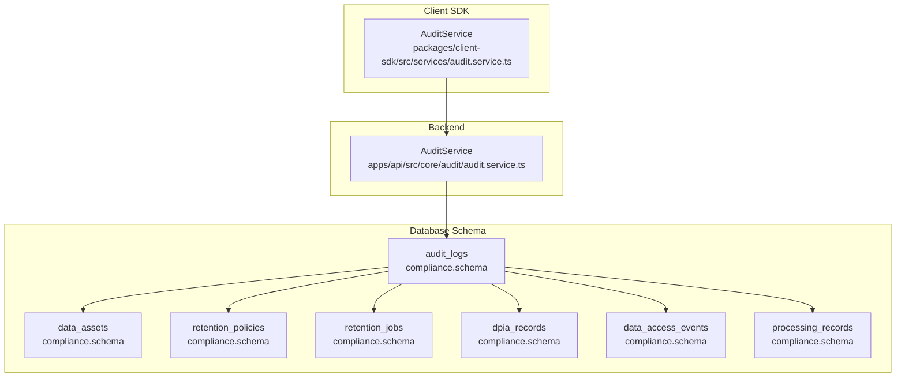
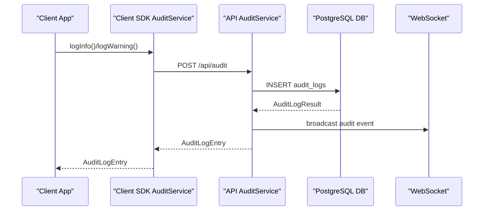
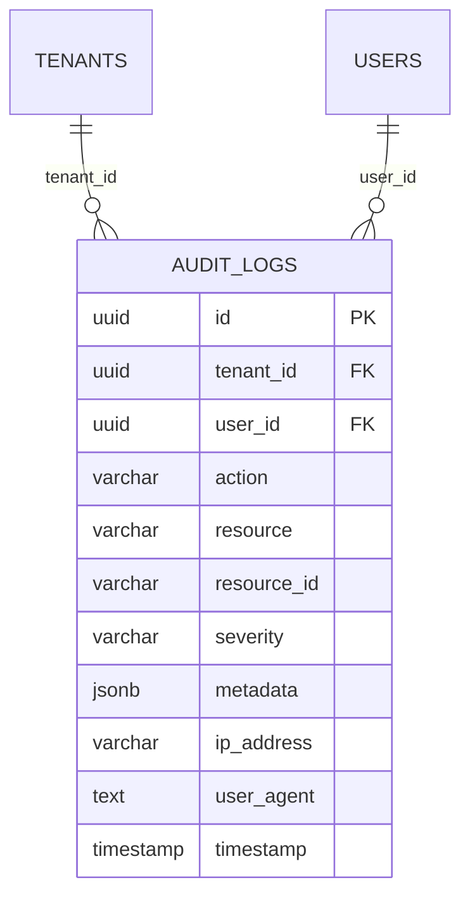
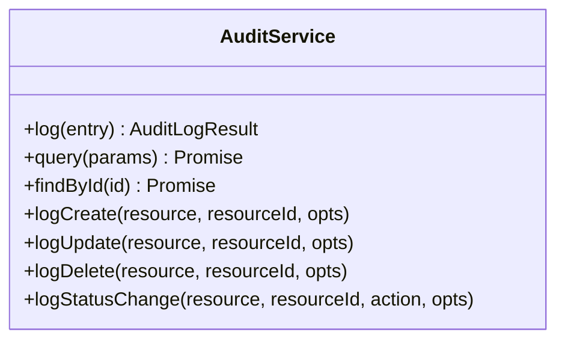
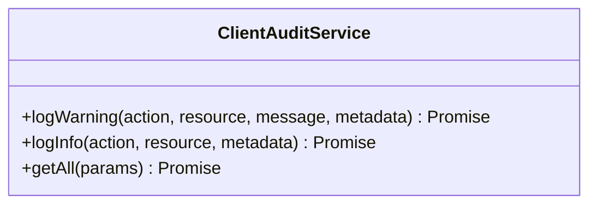
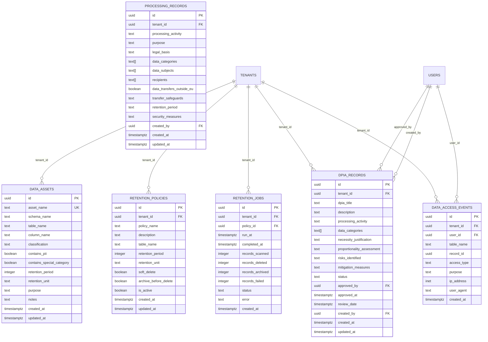
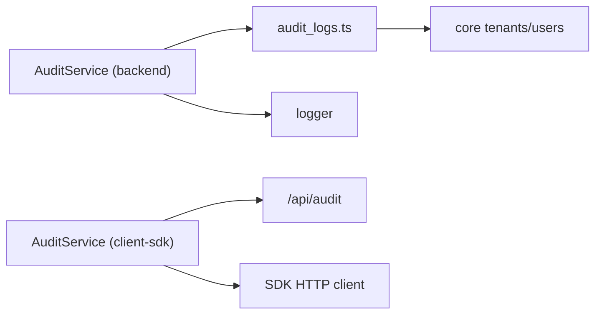

# Compliance & Governance Models

<cite>
**Referenced Files in This Document**
- [audit-logs.ts](file://packages/database-schema/src/compliance/audit-logs.ts)
- [compliance/index.ts](file://packages/database-schema/src/compliance/index.ts)
- [0003_compliance.sql](file://packages/database-schema/migrations/0003_compliance.sql)
- [audit.service.ts](file://apps/api/src/core/audit/audit.service.ts)
- [client-sdk audit.service.ts](file://packages/client-sdk/src/services/audit.service.ts)
- [AUTHENTICATION_SYSTEM.md](file://docs/architecture/AUTHENTICATION_SYSTEM.md)
- [ssa-l-compliance.md](file://docs/reference/ssa-l-compliance.md)
- [audit.md](file://docs/digilist-platform/audit.md)
</cite>

## Table of Contents
1. [Introduction](#introduction)
2. [Project Structure](#project-structure)
3. [Core Components](#core-components)
4. [Architecture Overview](#architecture-overview)
5. [Detailed Component Analysis](#detailed-component-analysis)
6. [Dependency Analysis](#dependency-analysis)
7. [Performance Considerations](#performance-considerations)
8. [Troubleshooting Guide](#troubleshooting-guide)
9. [Conclusion](#conclusion)
10. [Appendices](#appendices)

## Introduction
This document describes the compliance and governance models implemented in the platform, focusing on auditability, data retention, and alignment with regulatory frameworks. It documents the audit-logs entity and related compliance tables, outlines audit trail requirements and their support for compliance frameworks, details data retention policies, log formatting, and retrieval mechanisms, and provides examples of audit queries, compliance reporting, and data governance operations. Security measures for protecting sensitive audit information and integration points with external compliance systems are also covered.

## Project Structure
The compliance and governance functionality spans database schema definitions, backend audit services, and client SDK services. The following diagram shows how these pieces fit together.

**Diagram sources**
- [audit-logs.ts](file://packages/database-schema/src/compliance/audit-logs.ts#L16-L31)
- [0003_compliance.sql](file://packages/database-schema/migrations/0003_compliance.sql#L31-L254)
- [audit.service.ts](file://apps/api/src/core/audit/audit.service.ts#L74-L213)
- [client-sdk audit.service.ts](file://packages/client-sdk/src/services/audit.service.ts#L63-L246)

**Section sources**
- [audit-logs.ts](file://packages/database-schema/src/compliance/audit-logs.ts#L1-L35)
- [compliance/index.ts](file://packages/database-schema/src/compliance/index.ts#L1-L6)
- [0003_compliance.sql](file://packages/database-schema/migrations/0003_compliance.sql#L1-L254)
- [audit.service.ts](file://apps/api/src/core/audit/audit.service.ts#L74-L213)
- [client-sdk audit.service.ts](file://packages/client-sdk/src/services/audit.service.ts#L63-L246)

## Core Components
- Audit Logs Entity: Structured, tenant-scoped audit records capturing actions, resources, identities, and contextual metadata.
- Compliance Tables: Data classification, retention policies, DPIA records, data access events, and processing records supporting GDPR and other regulatory requirements.
- Backend Audit Service: Persists audit events, broadcasts real-time updates, and exposes query APIs.
- Client SDK Audit Service: Provides typed interfaces for creating and retrieving audit logs, with convenience methods for common events.

**Section sources**
- [audit-logs.ts](file://packages/database-schema/src/compliance/audit-logs.ts#L16-L31)
- [0003_compliance.sql](file://packages/database-schema/migrations/0003_compliance.sql#L31-L254)
- [audit.service.ts](file://apps/api/src/core/audit/audit.service.ts#L84-L120)
- [client-sdk audit.service.ts](file://packages/client-sdk/src/services/audit.service.ts#L63-L246)

## Architecture Overview
The audit and governance architecture integrates client-side logging with backend persistence and real-time distribution. The diagram below illustrates the end-to-end flow.

**Diagram sources**
- [client-sdk audit.service.ts](file://packages/client-sdk/src/services/audit.service.ts#L148-L211)
- [audit.service.ts](file://apps/api/src/core/audit/audit.service.ts#L84-L120)

## Detailed Component Analysis

### Audit Logs Entity
The audit-logs table captures system activities with tenant isolation, user identity, action semantics, resource context, severity, metadata, and client context. Indexes optimize tenant/time and resource lookups.

**Diagram sources**
- [audit-logs.ts](file://packages/database-schema/src/compliance/audit-logs.ts#L16-L31)

**Section sources**
- [audit-logs.ts](file://packages/database-schema/src/compliance/audit-logs.ts#L16-L31)
- [AUTHENTICATION_SYSTEM.md](file://docs/architecture/AUTHENTICATION_SYSTEM.md#L348-L368)

### Backend Audit Service
The backend AuditService persists audit entries, serializes metadata, and broadcasts real-time events over WebSocket. It supports querying with tenant, user, resource, action, date range, and severity filters, returning paginated results with counts.

**Diagram sources**
- [audit.service.ts](file://apps/api/src/core/audit/audit.service.ts#L74-L213)

**Section sources**
- [audit.service.ts](file://apps/api/src/core/audit/audit.service.ts#L84-L177)
- [audit.service.ts](file://apps/api/src/core/audit/audit.service.ts#L195-L210)

### Client SDK Audit Service
The client SDK AuditService provides typed interfaces for creating and retrieving audit logs, with convenience methods for logging info and warning events. It supports filtering and pagination via query parameters.

**Diagram sources**
- [client-sdk audit.service.ts](file://packages/client-sdk/src/services/audit.service.ts#L63-L246)

**Section sources**
- [client-sdk audit.service.ts](file://packages/client-sdk/src/services/audit.service.ts#L148-L246)

### Compliance Tables and Data Governance
The compliance schema includes tables for data classification, retention policies, DPIA records, data access events, and processing records. These tables enable GDPR alignment, retention enforcement, and auditability.

**Diagram sources**
- [0003_compliance.sql](file://packages/database-schema/migrations/0003_compliance.sql#L31-L254)

**Section sources**
- [0003_compliance.sql](file://packages/database-schema/migrations/0003_compliance.sql#L9-L254)

### Audit Trail Requirements and Compliance Support
- Traceability: Each event includes who (userId), what (action/resource/resourceId), when (timestamp), tenant context (tenantId), and client context (ipAddress, userAgent).
- Coverage: The audit service logs structured events for mutations and exposes a WebSocket stream for real-time monitoring.
- RBAC and Multi-Tenant Isolation: Tenant isolation is enforced at query level and in the audit schema to prevent cross-tenant data leakage.
- Gap Remediation: The SSA-L matrix identifies partial implementations and roadmap items to close gaps.

**Section sources**
- [audit.service.ts](file://apps/api/src/core/audit/audit.service.ts#L84-L120)
- [ssa-l-compliance.md](file://docs/reference/ssa-l-compliance.md#L61-L92)

### Data Retention Policies, Log Formatting, and Retrieval Mechanisms
- Retention Policies: Tenant-specific policies define retention periods and deletion strategies (soft delete, archive before delete).
- Enforcement Jobs: Automated jobs track scans, deletions, archival, and failures, with status tracking and error reporting.
- Log Formatting: Metadata is serialized to ensure compatibility (e.g., Date objects become ISO strings). Severity levels categorize events.
- Retrieval: Pagination and filtering are supported via query parameters; convenience methods provide common event logging.

**Section sources**
- [0003_compliance.sql](file://packages/database-schema/migrations/0003_compliance.sql#L68-L123)
- [audit.service.ts](file://apps/api/src/core/audit/audit.service.ts#L125-L177)
- [client-sdk audit.service.ts](file://packages/client-sdk/src/services/audit.service.ts#L235-L246)

### Examples of Audit Queries, Compliance Reporting, and Data Governance Operations
- Retrieve audit logs filtered by resource, action, user, date range, and severity with pagination.
- Generate statistics by resource, action, and severity.
- Enforce retention via scheduled jobs and maintain audit trails of retention actions.
- Track DPIA records and processing records for GDPR compliance.

Note: Specific code examples are omitted; see the referenced files for implementation details.

**Section sources**
- [client-sdk audit.service.ts](file://packages/client-sdk/src/services/audit.service.ts#L214-L246)
- [audit.service.ts](file://apps/api/src/core/audit/audit.service.ts#L125-L177)
- [0003_compliance.sql](file://packages/database-schema/migrations/0003_compliance.sql#L129-L222)

### Security Measures and External Compliance Integrations
- SDK-First Mandate: Frontend apps must use the client SDK exclusively to ensure consistent logging and security posture.
- Non-Storage of PII/Secrets: Observability and incident ingestion must avoid storing personal data or secrets.
- RFC7807 Errors: Consistent error responses with correlation IDs propagate end-to-end.
- Real-Time Streaming: WebSocket broadcast enables real-time monitoring and alerting.
- External Systems: Incident ingestion endpoints and synthetic monitors integrate with external systems (e.g., Sentry) while maintaining strict data handling rules.

**Section sources**
- [audit.md](file://docs/digilist-platform/audit.md#L10-L18)
- [audit.md](file://docs/digilist-platform/audit.md#L143-L178)

## Dependency Analysis
The audit-logs entity depends on core tenant and user entities. The backend AuditService depends on the database abstraction and logger. The client SDK depends on the API base path and HTTP client.

**Diagram sources**
- [audit-logs.ts](file://packages/database-schema/src/compliance/audit-logs.ts#L13-L14)
- [audit.service.ts](file://apps/api/src/core/audit/audit.service.ts#L74-L80)
- [client-sdk audit.service.ts](file://packages/client-sdk/src/services/audit.service.ts#L63-L66)

**Section sources**
- [audit-logs.ts](file://packages/database-schema/src/compliance/audit-logs.ts#L13-L14)
- [audit.service.ts](file://apps/api/src/core/audit/audit.service.ts#L74-L80)
- [client-sdk audit.service.ts](file://packages/client-sdk/src/services/audit.service.ts#L63-L66)

## Performance Considerations
- Indexing: Tenant/time and resource indexes optimize frequent queries.
- Pagination: Query methods support pagination to control result sizes.
- Serialization: Metadata serialization ensures efficient storage and transport.
- Real-Time Broadcasting: WebSocket broadcasting is guarded against send errors and ignores closed connections.

**Section sources**
- [audit-logs.ts](file://packages/database-schema/src/compliance/audit-logs.ts#L28-L31)
- [audit.service.ts](file://apps/api/src/core/audit/audit.service.ts#L125-L177)
- [audit.service.ts](file://apps/api/src/core/audit/audit.service.ts#L58-L72)

## Troubleshooting Guide
- Audit events not appearing: Verify backend logging and WebSocket broadcasting are active and that the client SDK is calling the API endpoints.
- Missing filters or pagination: Ensure query parameters are correctly formatted and passed to the client SDK getAll method.
- Data retention not applied: Confirm retention policies are active and retention jobs are scheduled and completing successfully.
- Compliance gaps: Review the SSA-L matrix and roadmap references to identify next steps.

**Section sources**
- [audit.service.ts](file://apps/api/src/core/audit/audit.service.ts#L125-L177)
- [0003_compliance.sql](file://packages/database-schema/migrations/0003_compliance.sql#L68-L123)
- [ssa-l-compliance.md](file://docs/reference/ssa-l-compliance.md#L28-L92)

## Conclusion
The platform implements a robust compliance and governance model centered around structured audit logs, tenant-scoped retention policies, and comprehensive compliance tables. The backend and client SDK services provide consistent, secure, and auditable logging with real-time streaming and flexible retrieval. Adherence to regulatory frameworks is supported through documented gaps and roadmap-aligned improvements.

## Appendices
- Audit Event Lifecycle: Creation, persistence, real-time broadcast, and retrieval.
- Compliance Matrix Reference: SSA-L requirements mapped to implementation status and roadmap items.

**Section sources**
- [audit.service.ts](file://apps/api/src/core/audit/audit.service.ts#L84-L120)
- [client-sdk audit.service.ts](file://packages/client-sdk/src/services/audit.service.ts#L148-L246)
- [ssa-l-compliance.md](file://docs/reference/ssa-l-compliance.md#L28-L229)