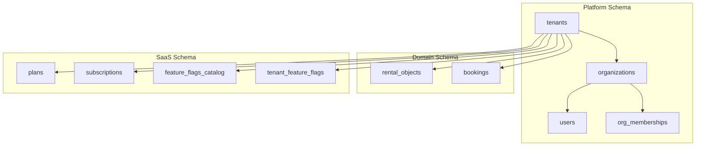
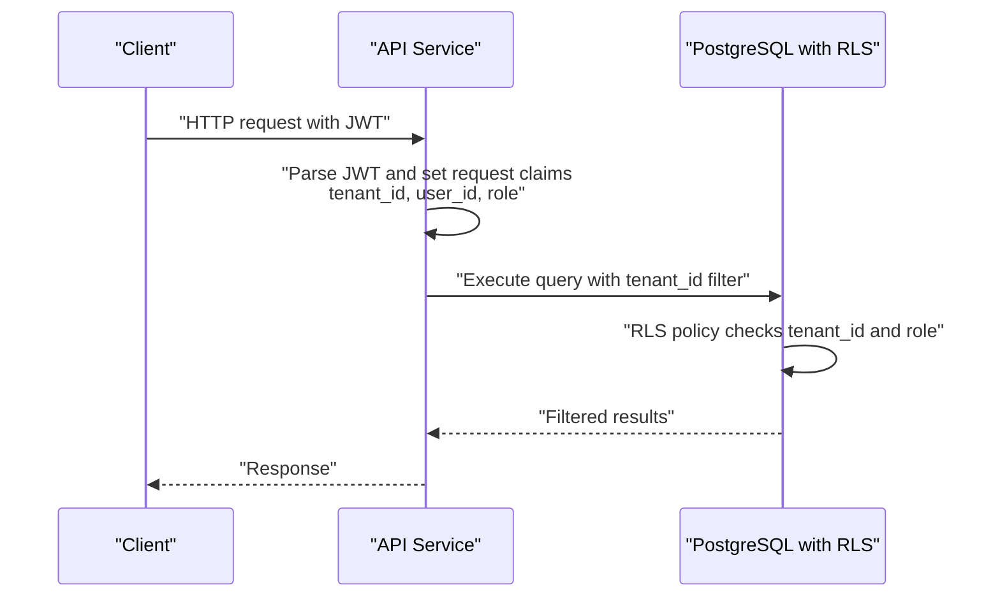
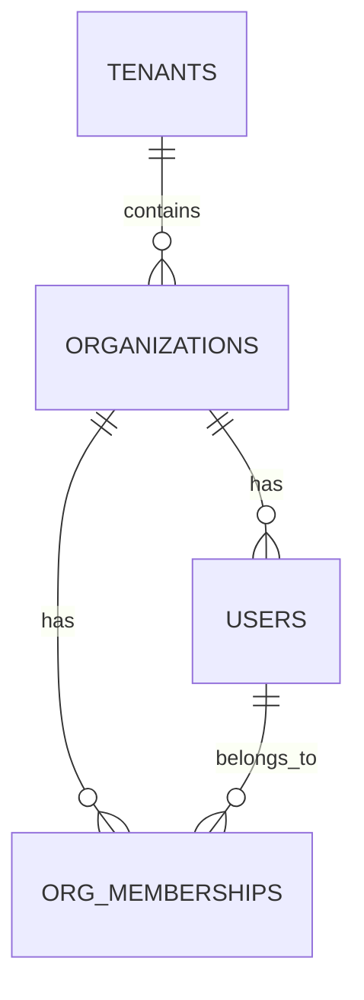
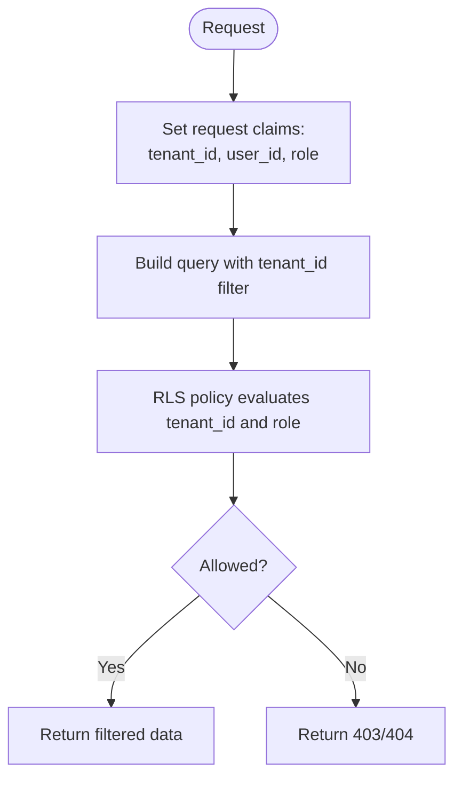
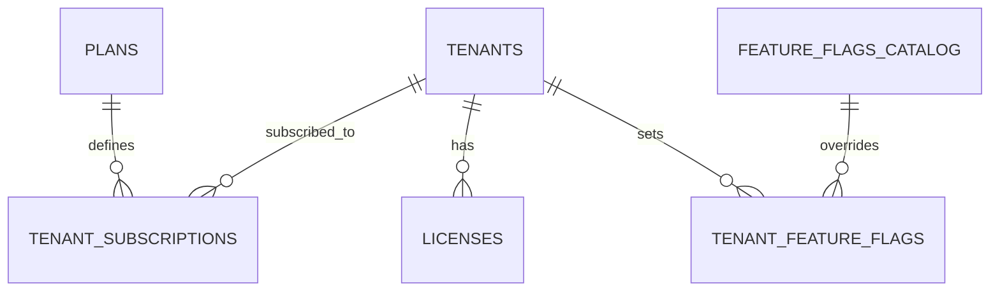
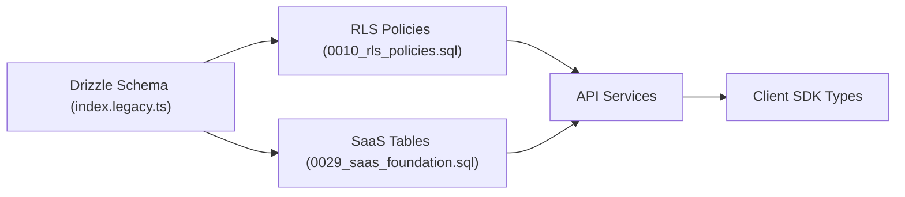

# Core Domain Models

<cite>
**Referenced Files in This Document**
- [index.legacy.ts](file://apps/api/src/database/schema/index.legacy.ts)
- [0010_rls_policies.sql](file://apps/api/drizzle/0010_rls_policies.sql)
- [0029_saas_foundation.sql](file://apps/api/drizzle/0029_saas_foundation.sql)
- [ERD.md](file://docs/technical/ERD.md)
- [tenant-isolation.test.ts](file://tests/integration/saas/tenant-isolation.test.ts)
- [enterprise-auth-security.md](file://docs/guides/enterprise-auth-security.md)
- [05-security.md](file://docs/architecture/05-security.md)
- [organization.ts](file://packages/client-sdk/src/types/organization.ts)
</cite>

## Table of Contents
1. [Introduction](#introduction)
2. [Project Structure](#project-structure)
3. [Core Components](#core-components)
4. [Architecture Overview](#architecture-overview)
5. [Detailed Component Analysis](#detailed-component-analysis)
6. [Dependency Analysis](#dependency-analysis)
7. [Performance Considerations](#performance-considerations)
8. [Troubleshooting Guide](#troubleshooting-guide)
9. [Conclusion](#conclusion)

## Introduction
This document describes the core domain models that underpin the multi-tenant SaaS platform: tenants, organizations, and users. It explains their field definitions, constraints, relationships, and how tenant isolation is enforced at the database and application levels. It also covers user-organization-tenant relationships, access patterns, common operations, and the security and data protection measures built into these models.

## Project Structure
The core domain models are defined in the database schema and enforced by Row Level Security (RLS) policies. The schema supports:
- Multi-tenant isolation via tenant_id on key tables
- Hierarchical relationships: tenants contain organizations; organizations contain users
- RLS policies that scope reads/writes to the current tenant and roles
- SaaS administration tables for plans, subscriptions, and feature flags

**Diagram sources**
- [index.legacy.ts](file://apps/api/src/database/schema/index.legacy.ts#L28-L97)
- [0010_rls_policies.sql](file://apps/api/drizzle/0010_rls_policies.sql#L77-L101)
- [0029_saas_foundation.sql](file://apps/api/drizzle/0029_saas_foundation.sql#L14-L110)

**Section sources**
- [index.legacy.ts](file://apps/api/src/database/schema/index.legacy.ts#L28-L97)
- [0010_rls_policies.sql](file://apps/api/drizzle/0010_rls_policies.sql#L18-L101)

## Core Components
This section documents the tenants, organizations, and users entities, including their fields, constraints, and indexes.

- Tenants
  - Purpose: Top-level multi-tenant container with subscription and feature flags.
  - Key fields: id, name, slug (unique), domain, settings (JSONB), status, seatLimits (JSONB), featureFlags (JSONB), enabledRentalObjectCategories (array), timestamps.
  - Constraints: Unique slug, default status active, seatLimits defaults, enabledRentalObjectCategories defaults.
  - Indexes: slug, status, subscriptionPlanId.

- Organizations
  - Purpose: Logical grouping of users and resources within a tenant.
  - Key fields: id, tenantId (FK to tenants), name, slug (tenant+slug unique), type, settings (JSONB), status, externalOrgId, source, lastSyncedAt, timestamps.
  - Constraints: Defaults for type and status, optional externalOrgId.
  - Indexes: tenantId, tenantId+slug, externalOrgId.

- Users
  - Purpose: Individual identities with roles and optional organization membership.
  - Key fields: id, tenantId (FK to tenants), organizationId (FK to organizations), email, name, nationalId, role, status, demoToken, metadata (JSONB), timestamps.
  - Constraints: Defaults for role and status, optional organizationId.
  - Indexes: tenantId+email (unique tenant+email), tenantId, nationalId, demoToken.

Notes:
- The legacy schema uses UUIDs and JSONB extensively, with tenant-scoped uniqueness and indexes optimized for common queries.
- The conceptual ERD in the repository documents a simpler relational model with text IDs and foreign keys; the actual implementation aligns with the Drizzle schema.

**Section sources**
- [index.legacy.ts](file://apps/api/src/database/schema/index.legacy.ts#L28-L97)
- [ERD.md](file://docs/technical/ERD.md#L153-L188)

## Architecture Overview
The multi-tenant architecture enforces isolation and access control through:
- Tenant-scoped tables: tenants, organizations, users, and most domain tables include tenant_id.
- RLS policies: enforce tenant isolation and role-aware access for platform and domain tables.
- Application-level enforcement: middleware and services set request claims (tenant_id, user_id, role) and require tenant_id in writes.
- SaaS administration: plans, subscriptions, and feature flags are tenant-scoped with RLS policies.

**Diagram sources**
- [0010_rls_policies.sql](file://apps/api/drizzle/0010_rls_policies.sql#L10-L16)
- [0010_rls_policies.sql](file://apps/api/drizzle/0010_rls_policies.sql#L107-L153)

**Section sources**
- [0010_rls_policies.sql](file://apps/api/drizzle/0010_rls_policies.sql#L10-L16)
- [0010_rls_policies.sql](file://apps/api/drizzle/0010_rls_policies.sql#L77-L153)
- [enterprise-auth-security.md](file://docs/guides/enterprise-auth-security.md#L778-L798)

## Detailed Component Analysis

### Tenants
- Fields and constraints
  - id (UUID, PK)
  - name (non-empty)
  - slug (unique, non-empty)
  - domain (optional)
  - settings (JSONB default {})
  - status (default active)
  - seatLimits (JSONB defaults for users, organizations, listings, bookings, storage)
  - featureFlags (JSONB default {})
  - enabledRentalObjectCategories (array default LOCALE, ARRANGEMENT)
  - timestamps
- Indexes
  - slug
  - status
  - subscriptionPlanId (if present)
- Usage
  - Acts as the root tenant container for SaaS features and brand settings.
  - Used by RLS policies to scope access.

**Section sources**
- [index.legacy.ts](file://apps/api/src/database/schema/index.legacy.ts#L28-L54)
- [0029_saas_foundation.sql](file://apps/api/drizzle/0029_saas_foundation.sql#L14-L49)

### Organizations
- Fields and constraints
  - id (UUID, PK)
  - tenantId (FK to tenants, cascade delete)
  - name (non-empty)
  - slug (tenant+slug unique)
  - type (default other)
  - settings (JSONB default {})
  - status (default active)
  - externalOrgId (optional)
  - source (default manual)
  - lastSyncedAt (optional)
  - timestamps
- Indexes
  - tenantId
  - tenantId+slug
  - externalOrgId
- Usage
  - Groups users and resources within a tenant.
  - Supports external synchronization and settings.

**Section sources**
- [index.legacy.ts](file://apps/api/src/database/schema/index.legacy.ts#L56-L73)

### Users
- Fields and constraints
  - id (UUID, PK)
  - tenantId (FK to tenants, cascade delete)
  - organizationId (FK to organizations, set null on delete)
  - email (non-empty)
  - name (non-empty)
  - nationalId (optional)
  - role (default member)
  - status (default active)
  - demoToken (optional)
  - metadata (JSONB default {})
  - timestamps
- Indexes
  - tenantId+email (tenant+email unique)
  - tenantId
  - nationalId
  - demoToken
- Usage
  - Represents individual identities with optional organizational affiliation.
  - Supports role-based access and status management.

**Section sources**
- [index.legacy.ts](file://apps/api/src/database/schema/index.legacy.ts#L79-L97)

### Relationships and Access Patterns
- Relationships
  - Tenants → Organizations (one-to-many)
  - Organizations → Users (one-to-many)
  - Organizations ↔ Users via org_memberships (membership table)
- Access patterns
  - All queries must filter by tenant_id.
  - Reads may be further restricted by roles (e.g., super admin vs tenant admin).
  - Writes require tenant admin privileges for platform tables.

**Diagram sources**
- [index.legacy.ts](file://apps/api/src/database/schema/index.legacy.ts#L56-L97)

**Section sources**
- [index.legacy.ts](file://apps/api/src/database/schema/index.legacy.ts#L56-L97)
- [0010_rls_policies.sql](file://apps/api/drizzle/0010_rls_policies.sql#L107-L153)

### Multi-Tenant Isolation and RLS
- RLS blueprints
  - Helper functions expose current user, tenant, and role.
  - Policies enable tenant isolation and role-aware access for platform tables.
- Enforcement
  - Platform tables: tenants, organizations, users, user_org_memberships.
  - Domain tables: rental_objects, bookings, categories, media, favorites, notifications, ratings, feedback, kb_*.
- Policy examples
  - Tenants: super admin can see all; otherwise only the current tenant.
  - Organizations: select via tenant or super admin; write requires tenant admin and tenant match.
  - Users: select own profile or backoffice within tenant; updates allowed for user or tenant admin.

**Diagram sources**
- [0010_rls_policies.sql](file://apps/api/drizzle/0010_rls_policies.sql#L10-L16)
- [0010_rls_policies.sql](file://apps/api/drizzle/0010_rls_policies.sql#L107-L153)

**Section sources**
- [0010_rls_policies.sql](file://apps/api/drizzle/0010_rls_policies.sql#L10-L16)
- [0010_rls_policies.sql](file://apps/api/drizzle/0010_rls_policies.sql#L77-L153)
- [tenant-isolation.test.ts](file://tests/integration/saas/tenant-isolation.test.ts#L382-L415)

### SaaS Administration Tables (Plans, Subscriptions, Feature Flags)
- Plans
  - Fields: code (unique), name, description, pricing, limits, features, status, timestamps.
  - Indexes: active/public filters.
- Tenant Subscriptions
  - Links tenant to plan with billing periods and status.
  - Indexes: tenant, plan, status, active tenant+status.
- Licenses
  - Per-tenant licenses with activation tracking and expiry.
  - Indexes: tenant, license_key, active tenant+is_active, expires_at.
- Feature Flags
  - Global flags with rollout percentage and category.
  - Tenant overrides with audit fields.
  - Indexes: key, category, tenant+is_enabled.

**Diagram sources**
- [0029_saas_foundation.sql](file://apps/api/drizzle/0029_saas_foundation.sql#L14-L218)

**Section sources**
- [0029_saas_foundation.sql](file://apps/api/drizzle/0029_saas_foundation.sql#L14-L218)

### Common Queries and Operations
- List organizations for a tenant
  - Filter by tenant_id; optionally by status or slug.
- List users for an organization
  - Join organizations and users on organization_id; filter by tenant_id.
- Create a user within an organization
  - Insert into users with tenant_id and organization_id; ensure tenant+email uniqueness.
- Update user profile
  - Allow user to update own fields; tenant admin can update others; enforce tenant_id in WHERE.
- Retrieve tenant’s active subscription
  - Use helper function to fetch active subscription for tenant.

These patterns reflect tenant-scoped reads/writes and role-aware access as enforced by RLS and application logic.

**Section sources**
- [index.legacy.ts](file://apps/api/src/database/schema/index.legacy.ts#L56-L97)
- [0010_rls_policies.sql](file://apps/api/drizzle/0010_rls_policies.sql#L107-L153)
- [0029_saas_foundation.sql](file://apps/api/drizzle/0029_saas_foundation.sql#L282-L314)

### Security Implications and Data Protection Measures
- Encryption at rest and in transit
  - Encryption configurations and services described for sensitive data columns and transport.
- Data masking
  - Logging and privacy controls include PII masking strategies.
- Compliance
  - ISO 27001 control implementation and privacy assessments documented.
- Multi-tenant isolation
  - RLS policies and helper functions ensure tenant boundary enforcement.
  - Integration tests verify tenant data isolation and response filtering.

**Section sources**
- [05-security.md](file://docs/architecture/05-security.md#L230-L284)
- [05-security.md](file://docs/architecture/05-security.md#L286-L315)
- [05-security.md](file://docs/architecture/05-security.md#L317-L340)
- [05-security.md](file://docs/architecture/05-security.md#L704-L767)
- [tenant-isolation.test.ts](file://tests/integration/saas/tenant-isolation.test.ts#L382-L415)

## Dependency Analysis
The core domain models depend on:
- Drizzle ORM schema definitions for table structures and indexes.
- RLS policies for tenant isolation and role-based access.
- SaaS administration tables for subscription and feature flag management.

**Diagram sources**
- [index.legacy.ts](file://apps/api/src/database/schema/index.legacy.ts#L28-L97)
- [0010_rls_policies.sql](file://apps/api/drizzle/0010_rls_policies.sql#L77-L153)
- [0029_saas_foundation.sql](file://apps/api/drizzle/0029_saas_foundation.sql#L14-L218)
- [organization.ts](file://packages/client-sdk/src/types/organization.ts#L60-L118)

**Section sources**
- [index.legacy.ts](file://apps/api/src/database/schema/index.legacy.ts#L28-L97)
- [0010_rls_policies.sql](file://apps/api/drizzle/0010_rls_policies.sql#L77-L153)
- [0029_saas_foundation.sql](file://apps/api/drizzle/0029_saas_foundation.sql#L14-L218)
- [organization.ts](file://packages/client-sdk/src/types/organization.ts#L60-L118)

## Performance Considerations
- Indexes
  - Tenant-scoped indexes on tenant_id improve query performance and enforce scoping.
  - Composite indexes (e.g., tenant+status, tenant+slug) optimize common filters.
- RLS overhead
  - RLS adds minimal overhead compared to the benefits of tenant isolation.
- SaaS tables
  - Separate indexes on plans and subscriptions support efficient lookups and filtering.

[No sources needed since this section provides general guidance]

## Troubleshooting Guide
- Tenant isolation failures
  - Verify request claims are set (tenant_id, user_id, role).
  - Ensure all queries include tenant_id filters.
  - Confirm RLS policies are enabled and active.
- Duplicate key errors
  - Check tenant+email uniqueness on users; tenant+slug uniqueness on organizations.
- Subscription and feature flag checks
  - Use helper functions to validate tenant subscription status and feature flag overrides.

**Section sources**
- [enterprise-auth-security.md](file://docs/guides/enterprise-auth-security.md#L743-L777)
- [0010_rls_policies.sql](file://apps/api/drizzle/0010_rls_policies.sql#L10-L16)
- [0010_rls_policies.sql](file://apps/api/drizzle/0010_rls_policies.sql#L107-L153)
- [0029_saas_foundation.sql](file://apps/api/drizzle/0029_saas_foundation.sql#L282-L314)

## Conclusion
The tenants, organizations, and users models form the backbone of a secure, multi-tenant SaaS platform. Tenant isolation is enforced through tenant_id scoping, RLS policies, and application-level claim setting. The models support robust user-organization-tenant relationships, role-aware access, and SaaS administration features. Security and data protection measures are integrated into the schema and documented across the repository.