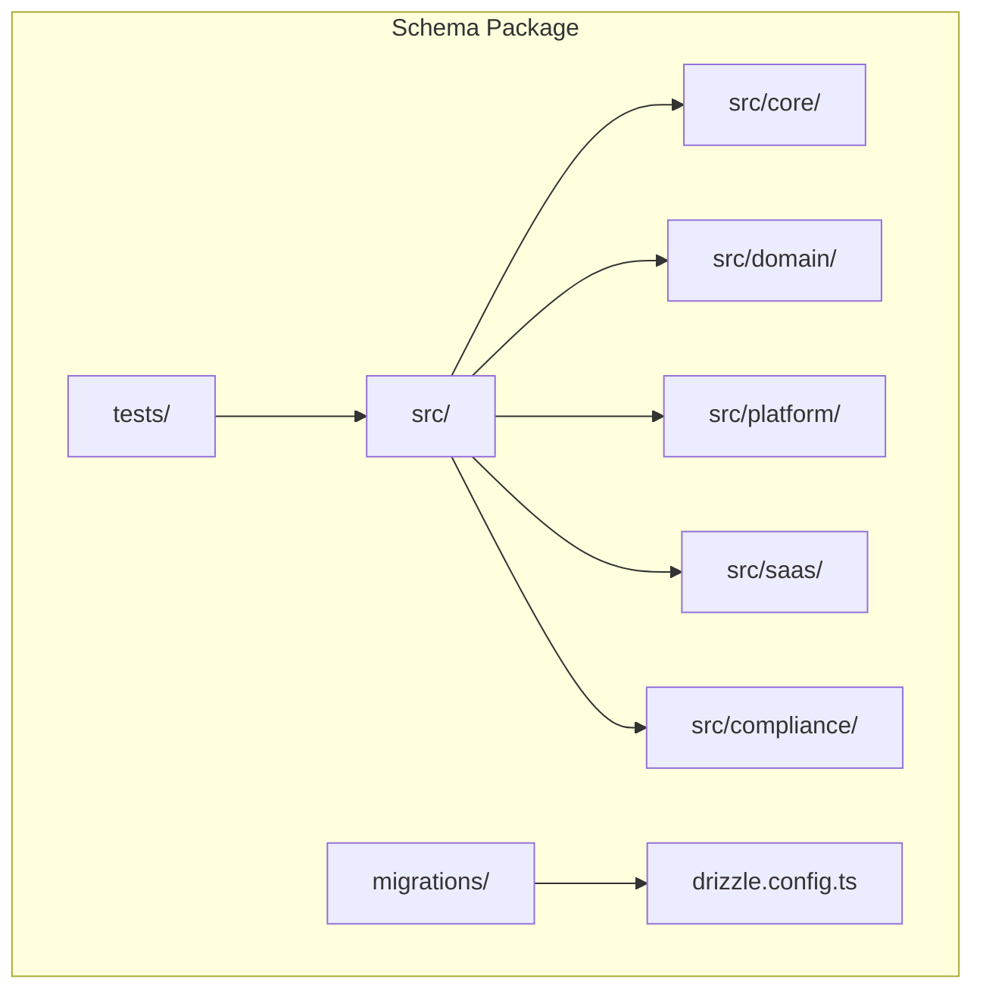
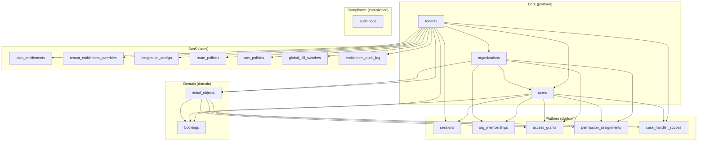
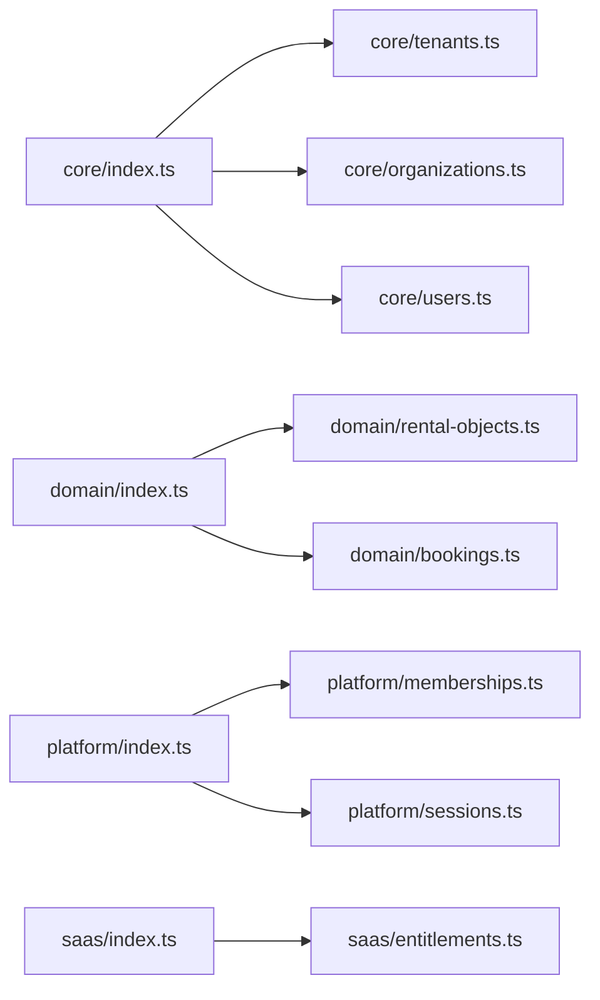
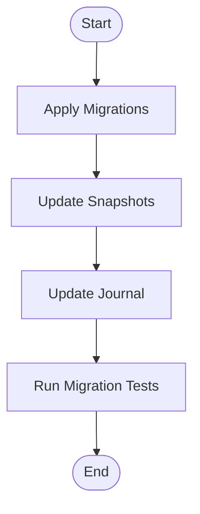

# Database Schema Package

<cite>
**Referenced Files in This Document**
- [schemas.ts](file://packages/database-schema/src/schemas.ts)
- [index.ts](file://packages/database-schema/src/core/index.ts)
- [tenants.ts](file://packages/database-schema/src/core/tenants.ts)
- [organizations.ts](file://packages/database-schema/src/core/organizations.ts)
- [users.ts](file://packages/database-schema/src/core/users.ts)
- [index.ts](file://packages/database-schema/src/domain/index.ts)
- [rental-objects.ts](file://packages/database-schema/src/domain/rental-objects.ts)
- [bookings.ts](file://packages/database-schema/src/domain/bookings.ts)
- [index.ts](file://packages/database-schema/src/platform/index.ts)
- [memberships.ts](file://packages/database-schema/src/platform/memberships.ts)
- [sessions.ts](file://packages/database-schema/src/platform/sessions.ts)
- [index.ts](file://packages/database-schema/src/saas/index.ts)
- [entitlements.ts](file://packages/database-schema/src/saas/entitlements.ts)
- [index.ts](file://packages/database-schema/src/compliance/index.ts)
- [migration.test.ts](file://packages/database-schema/tests/migration.test.ts)
- [seeds.test.ts](file://packages/database-schema/tests/seeds.test.ts)
- [integration.test.ts](file://packages/database-schema/tests/integration.test.ts)
- [drizzle.config.ts](file://packages/database-schema/drizzle.config.ts)
- [migrations/0000_slimy_mauler.sql](file://packages/database-schema/migrations/0000_slimy_mauler.sql)
- [migrations/0001_broken_nova.sql](file://packages/database-schema/migrations/0001_broken_nova.sql)
- [migrations/meta/_journal.json](file://packages/database-schema/migrations/meta/_journal.json)
- [migrations/meta/0000_snapshot.json](file://packages/database-schema/migrations/meta/0000_snapshot.json)
- [migrations/meta/0001_snapshot.json](file://packages/database-schema/migrations/meta/0001_snapshot.json)
- [README.md](file://packages/database-schema/README.md)
</cite>

## Table of Contents
1. [Introduction](#introduction)
2. [Project Structure](#project-structure)
3. [Core Components](#core-components)
4. [Architecture Overview](#architecture-overview)
5. [Detailed Component Analysis](#detailed-component-analysis)
6. [Dependency Analysis](#dependency-analysis)
7. [Performance Considerations](#performance-considerations)
8. [Troubleshooting Guide](#troubleshooting-guide)
9. [Conclusion](#conclusion)
10. [Appendices](#appendices)

## Introduction
This document describes the database schema package as the single source of truth for all database models and relationships across the platform. It organizes the schema by domain areas (core, domain, platform, saas, compliance), documents type safety guarantees via Drizzle ORM, and explains schema validation and migration management. It also covers schema governance, versioning, backward compatibility, usage in services and repositories, query patterns, performance optimization, schema evolution, data integrity constraints, and compliance requirements. Migration examples, schema diff analysis, and troubleshooting common schema-related issues are included.

## Project Structure
The schema package is organized into domain-focused modules under src/, with explicit schema namespaces and Drizzle ORM table definitions. Tests validate migrations, seeds, and integration behavior. Drizzle configuration and migration snapshots define the current state and history.

**Diagram sources**
- [schemas.ts](file://packages/database-schema/src/schemas.ts#L8-L12)
- [drizzle.config.ts](file://packages/database-schema/drizzle.config.ts)

**Section sources**
- [schemas.ts](file://packages/database-schema/src/schemas.ts#L1-L13)
- [drizzle.config.ts](file://packages/database-schema/drizzle.config.ts)

## Core Components
This section introduces the five schema namespaces and the foundational tables that establish tenant isolation, organization hierarchy, and user identity.

- Schema namespaces
  - platform: Identity, sessions, memberships, and scoping
  - domain: Business entities such as rental objects and bookings
  - saas: Feature flags, entitlements, navigation/route policies, kill switches
  - compliance: Audit logging
  - monitoring: Observability signals

- Core tables
  - Tenants: Tenant-level settings, seat limits, feature flags, and categories
  - Organizations: Tenant-scoped organizations with slugs and settings
  - Users: Tenant-scoped users with roles, status, and metadata

These tables form the foundation for all cross-module relationships and are designed to prevent circular dependencies by exporting in dependency order.

**Section sources**
- [schemas.ts](file://packages/database-schema/src/schemas.ts#L8-L12)
- [index.ts](file://packages/database-schema/src/core/index.ts#L6-L9)
- [tenants.ts](file://packages/database-schema/src/core/tenants.ts#L15-L41)
- [organizations.ts](file://packages/database-schema/src/core/organizations.ts#L15-L32)
- [users.ts](file://packages/database-schema/src/core/users.ts#L16-L34)

## Architecture Overview
The schema package enforces domain-driven separation with explicit namespaces and strict foreign-key relationships. The diagram below shows how core tables underpin domain and platform tables, while the SaaS schema remains isolated for feature flagging and policy enforcement.

**Diagram sources**
- [tenants.ts](file://packages/database-schema/src/core/tenants.ts#L15-L41)
- [organizations.ts](file://packages/database-schema/src/core/organizations.ts#L15-L32)
- [users.ts](file://packages/database-schema/src/core/users.ts#L16-L34)
- [rental-objects.ts](file://packages/database-schema/src/domain/rental-objects.ts#L18-L44)
- [bookings.ts](file://packages/database-schema/src/domain/bookings.ts#L18-L37)
- [sessions.ts](file://packages/database-schema/src/platform/sessions.ts#L14-L33)
- [memberships.ts](file://packages/database-schema/src/platform/memberships.ts#L16-L85)
- [entitlements.ts](file://packages/database-schema/src/saas/entitlements.ts#L14-L153)

## Detailed Component Analysis

### Core Entities
- Tenants
  - Purpose: Top-level tenant container with seat limits, feature flags, and enabled categories
  - Key fields: identifiers, slug uniqueness, status, subscription plan, license keys, seat limits, feature flags, enabled categories
  - Constraints: unique slug, defaults for arrays and JSONB fields
  - Indices: slug, status, subscription plan
- Organizations
  - Purpose: Tenant-scoped organizational units with slugs and settings
  - Key fields: tenantId FK, name, slug, type, settings, status, external identifiers, sync timestamps
  - Constraints: composite unique on tenantId+slug, defaults for JSONB and timestamps
  - Indices: tenantId, tenantId+slug, externalOrgId
- Users
  - Purpose: Tenant-scoped identities with roles, status, and metadata
  - Key fields: tenantId FK, organizationId FK, email, name, nationalId, role, status, demoToken, metadata
  - Constraints: defaults for role/status, optional organizationId, indexes on sensitive fields
  - Indices: tenantId+email, tenantId, nationalId, demoToken

Type safety: Each table exports select/insert types for compile-time validation in services and repositories.

**Section sources**
- [tenants.ts](file://packages/database-schema/src/core/tenants.ts#L15-L41)
- [organizations.ts](file://packages/database-schema/src/core/organizations.ts#L15-L32)
- [users.ts](file://packages/database-schema/src/core/users.ts#L16-L34)

### Domain Entities
- Rental Objects
  - Purpose: Listings with categorization, pricing, availability modes, and metadata
  - Key fields: tenantId, organizationId, name, slug, description, categoryKey, timeMode, features, ruleSetKey, status, requiresApproval, capacity, inventoryTotal, images, pricing, metadata
  - Constraints: defaults for arrays and JSONB, indexes on tenantId, categoryKey, timeMode, status, slug
  - Aliasing: listings alias for legacy compatibility
- Bookings
  - Purpose: Reservation records linking users, rentals, and time slots
  - Key fields: tenantId, rentalObjectId FK, userId FK, status, start/end time, total price, currency, notes, metadata
  - Constraints: defaults for status and currency, indexes on tenantId, rentalObjectId, userId, status

Relationships: rental_objects and bookings depend on core tables; bookings link to users and rental_objects.

**Section sources**
- [rental-objects.ts](file://packages/database-schema/src/domain/rental-objects.ts#L18-L44)
- [bookings.ts](file://packages/database-schema/src/domain/bookings.ts#L18-L37)

### Platform Entities
- Sessions
  - Purpose: Authentication session lifecycle with refresh tokens and device info
  - Key fields: userId FK, tenantId FK, refresh token hash (unique), access token JTI, user agent, IP address, timestamps, expiry, revocation
  - Constraints: unique refresh token hash, indexes on user, tenant, expiry, user+tenant
- Org Memberships
  - Purpose: Organization membership and role assignments
  - Key fields: userId FK, orgId FK, orgRole, status, metadata
  - Constraints: indexes on user, org, user+org
- Access Grants
  - Purpose: Per-organization, per-rental-object access grants with validity windows
  - Key fields: tenantId FK, orgId FK, rentalObjectId FK, grantedBy FK, status, validFrom/validUntil, metadata
  - Constraints: indexes on tenantId, orgId, rentalObjectId, org+rentalObject
- Permission Assignments
  - Purpose: Fine-grained permissions per user, organization, and rental object
  - Key fields: orgId FK, userId FK, rentalObjectId FK, permissions array, assignedBy FK, status, metadata
  - Constraints: composite unique on org+user+rentalObject, indexes for joins
- Case Handler Scopes
  - Purpose: Scope definitions for case handlers by user, scope type, and rental object
  - Key fields: tenantId FK, userId FK, scopeType, rentalObjectId FK, assignedBy FK, status, metadata
  - Constraints: indexes on tenantId, userId, scopeType, rentalObjectId, user+scope+rentalObject

**Section sources**
- [sessions.ts](file://packages/database-schema/src/platform/sessions.ts#L14-L33)
- [memberships.ts](file://packages/database-schema/src/platform/memberships.ts#L16-L85)

### SaaS Entities
- Plan Entitlements
  - Purpose: Define entitlement keys per plan with defaults
  - Key fields: planId, keyType, key, defaultEnabled, metadata
  - Constraints: composite unique on planId+keyType+key, indexes for lookups
- Tenant Entitlement Overrides
  - Purpose: Override plan entitlements per tenant
  - Key fields: tenantId, keyType, key, enabled, reason, createdBy
  - Constraints: composite unique on tenantId+keyType+key, indexes for filtering
- Integration Configurations
  - Purpose: Store tenant-specific integration configs with validation state
  - Key fields: tenantId, integrationKey, configJson, status, lastValidatedAt, validationError, createdBy
  - Constraints: composite unique on tenantId+integrationKey, indexes for status
- Route Policies
  - Purpose: Define required roles/modules/features per route key
  - Key fields: app, routeKey (unique), requiredRoles/modules/features, isPublic, description
  - Constraints: indexes on app, routeKey
- Navigation Policies
  - Purpose: Define navigation items with ordering and requirements
  - Key fields: app, navItemKey (unique), routeKey, requiredRoles/modules/features, labelKey, iconKey, parentKey, order
  - Constraints: composite unique on app+navItemKey, indexes for app+order
- Global Kill Switches
  - Purpose: Environment-scoped feature/global toggles
  - Key fields: keyType, key, enabled, reason, environment, createdBy
  - Constraints: composite unique on keyType+key+environment, indexes for lookups
- Entitlement Audit Log
  - Purpose: Track entitlement changes per tenant
  - Key fields: tenantId, action, keyType, key, before/after, actorId/type, correlationId, metadata
  - Constraints: indexes for tenant, action, createdAt, correlationId

**Section sources**
- [entitlements.ts](file://packages/database-schema/src/saas/entitlements.ts#L14-L153)

### Compliance Entities
- Audit Logs
  - Purpose: Compliance-grade audit trail for schema and entitlement changes
  - Key fields: tenantId, action, keyType, key, before/after, actorId/type, correlationId, metadata, createdAt
  - Constraints: indexes for tenant, action, createdAt, correlationId

**Section sources**
- [index.ts](file://packages/database-schema/src/compliance/index.ts#L5)

## Dependency Analysis
The schema package enforces dependency order across modules to avoid circular imports and maintain a clean separation of concerns. The following diagram shows module-level re-exports and interdependencies.

**Diagram sources**
- [index.ts](file://packages/database-schema/src/core/index.ts#L6-L9)
- [index.ts](file://packages/database-schema/src/domain/index.ts#L6-L7)
- [index.ts](file://packages/database-schema/src/platform/index.ts#L6-L7)
- [index.ts](file://packages/database-schema/src/saas/index.ts#L6)

**Section sources**
- [index.ts](file://packages/database-schema/src/core/index.ts#L6-L9)
- [index.ts](file://packages/database-schema/src/domain/index.ts#L6-L7)
- [index.ts](file://packages/database-schema/src/platform/index.ts#L6-L7)
- [index.ts](file://packages/database-schema/src/saas/index.ts#L6)

## Performance Considerations
- Indexing strategy
  - Composite indexes on frequently filtered columns (e.g., tenantId+slug, tenantId+email) improve join and lookup performance.
  - Unique indexes on high-cardinality identifiers (e.g., refresh token hash, routeKey, navItemKey) enforce uniqueness efficiently.
- Data types
  - UUIDs for primary keys and foreign keys reduce collision risk and simplify sharding.
  - JSONB fields store flexible metadata with defaults to minimize NULL checks.
- Query patterns
  - Prefer selective queries with indexed filters; avoid SELECT * in hot paths.
  - Use LIMIT and pagination for listing endpoints; leverage cursor-based pagination for large datasets.
- Caching
  - Cache tenant/org/user profiles and entitlement overrides to reduce repeated lookups.
- Partitioning and retention
  - Consider time-based partitioning for audit logs and sessions if growth becomes significant.
- Monitoring
  - Track slow queries and missing index usage via observability dashboards.

[No sources needed since this section provides general guidance]

## Troubleshooting Guide
Common schema-related issues and resolutions:

- Migration failures
  - Symptom: Drizzle Kit hangs or fails during generation.
  - Resolution: Ensure SaaS schema is isolated and separate from domain/platform to avoid circular dependencies during schema diffing.
  - Reference: SaaS schema is intentionally separated to allow Drizzle Kit to generate migrations reliably.
- Snapshot drift
  - Symptom: Tests report snapshot mismatches.
  - Resolution: Re-run migrations and regenerate snapshots; verify journal entries and meta snapshots.
- Seed conflicts
  - Symptom: Duplicate keys or constraint violations on seed data.
  - Resolution: Validate seed keys against unique indexes; ensure tenantId and slug combinations are unique.
- Query performance regressions
  - Symptom: Slow listing or filtering queries.
  - Resolution: Add missing indexes; review query plans; ensure proper use of composite indexes.

**Section sources**
- [README.md](file://packages/database-schema/README.md)
- [migration.test.ts](file://packages/database-schema/tests/migration.test.ts)
- [seeds.test.ts](file://packages/database-schema/tests/seeds.test.ts)
- [integration.test.ts](file://packages/database-schema/tests/integration.test.ts)

## Conclusion
The schema package establishes a robust, type-safe, and governed model for the platform’s data layer. By organizing entities into clear domains, enforcing strict foreign keys and indexes, and isolating SaaS concerns, it supports safe evolution, strong backward compatibility, and efficient operations. The accompanying tests and migration snapshots provide confidence in schema integrity and reproducibility.

[No sources needed since this section summarizes without analyzing specific files]

## Appendices

### Type Safety and Compile-Time Guarantees
- Each table exports select/insert types enabling compile-time validation in services and repositories.
- Foreign key references are declared with onDelete actions to maintain referential integrity.

**Section sources**
- [users.ts](file://packages/database-schema/src/core/users.ts#L36-L37)
- [organizations.ts](file://packages/database-schema/src/core/organizations.ts#L34-L35)
- [tenants.ts](file://packages/database-schema/src/core/tenants.ts#L43-L44)
- [rental-objects.ts](file://packages/database-schema/src/domain/rental-objects.ts#L49-L52)
- [bookings.ts](file://packages/database-schema/src/domain/bookings.ts#L39-L40)
- [sessions.ts](file://packages/database-schema/src/platform/sessions.ts#L35-L36)
- [memberships.ts](file://packages/database-schema/src/platform/memberships.ts#L87-L94)
- [entitlements.ts](file://packages/database-schema/src/saas/entitlements.ts#L135-L153)

### Schema Validation and Governance
- Unique constraints on critical keys (e.g., slug, refresh token hash, routeKey, navItemKey) prevent duplicates.
- Defaults for JSONB and array fields ensure consistent schema behavior.
- Indexes on tenantId and composite keys support tenant isolation and efficient filtering.

**Section sources**
- [tenants.ts](file://packages/database-schema/src/core/tenants.ts#L18-L40)
- [organizations.ts](file://packages/database-schema/src/core/organizations.ts#L29-L31)
- [users.ts](file://packages/database-schema/src/core/users.ts#L30-L33)
- [sessions.ts](file://packages/database-schema/src/platform/sessions.ts#L18-L32)
- [rental-objects.ts](file://packages/database-schema/src/domain/rental-objects.ts#L40-L43)
- [bookings.ts](file://packages/database-schema/src/domain/bookings.ts#L33-L36)
- [entitlements.ts](file://packages/database-schema/src/saas/entitlements.ts#L24-L25)
- [entitlements.ts](file://packages/database-schema/src/saas/entitlements.ts#L62-L65)
- [entitlements.ts](file://packages/database-schema/src/saas/entitlements.ts#L107-L108)
- [entitlements.ts](file://packages/database-schema/src/saas/entitlements.ts#L127-L128)

### Migration Management and Versioning
- Drizzle configuration defines schema namespaces and migration targets.
- Migration snapshots capture the canonical state; the journal tracks applied migrations.
- Example migrations demonstrate initial schema creation and subsequent updates.

**Diagram sources**
- [drizzle.config.ts](file://packages/database-schema/drizzle.config.ts)
- [migrations/meta/_journal.json](file://packages/database-schema/migrations/meta/_journal.json)
- [migrations/meta/0000_snapshot.json](file://packages/database-schema/migrations/meta/0000_snapshot.json)
- [migrations/meta/0001_snapshot.json](file://packages/database-schema/migrations/meta/0001_snapshot.json)
- [migrations/0000_slimy_mauler.sql](file://packages/database-schema/migrations/0000_slimy_mauler.sql)
- [migrations/0001_broken_nova.sql](file://packages/database-schema/migrations/0001_broken_nova.sql)

**Section sources**
- [drizzle.config.ts](file://packages/database-schema/drizzle.config.ts)
- [migrations/meta/_journal.json](file://packages/database-schema/migrations/meta/_journal.json)
- [migrations/meta/0000_snapshot.json](file://packages/database-schema/migrations/meta/0000_snapshot.json)
- [migrations/meta/0001_snapshot.json](file://packages/database-schema/migrations/meta/0001_snapshot.json)
- [migrations/0000_slimy_mauler.sql](file://packages/database-schema/migrations/0000_slimy_mauler.sql)
- [migrations/0001_broken_nova.sql](file://packages/database-schema/migrations/0001_broken_nova.sql)

### Backward Compatibility Considerations
- Add new columns with defaults to preserve existing rows.
- Introduce indexes alongside new columns to support future queries.
- Avoid dropping columns or tables; mark fields as deprecated and introduce new structures when necessary.
- Keep composite unique constraints to maintain data integrity across tenantId+slug and similar combinations.

**Section sources**
- [tenants.ts](file://packages/database-schema/src/core/tenants.ts#L25-L31)
- [organizations.ts](file://packages/database-schema/src/core/organizations.ts#L18-L24)
- [users.ts](file://packages/database-schema/src/core/users.ts#L22-L26)
- [rental-objects.ts](file://packages/database-schema/src/domain/rental-objects.ts#L25-L34)
- [bookings.ts](file://packages/database-schema/src/domain/bookings.ts#L26-L28)

### Examples of Schema Usage in Services and Repositories
- Service pattern
  - Use table select/insert types to define DTOs and repository method signatures.
  - Leverage foreign key relations to build joins for tenant-scoped queries.
- Repository pattern
  - Encapsulate CRUD operations with typed inputs/outputs.
  - Apply tenantId filters by default to enforce isolation.
- Query patterns
  - Use composites like tenantId+slug for listing and retrieval.
  - Paginate results and filter by status/time ranges for bookings and rental objects.

[No sources needed since this section provides general guidance]

### Compliance Requirements
- Audit logging captures entitlement changes and access events with correlation IDs.
- Unique identifiers and hashed tokens support traceability and forensic analysis.
- Controlled access grants and permission assignments align with RBAC and least-privilege principles.

**Section sources**
- [entitlements.ts](file://packages/database-schema/src/saas/entitlements.ts#L135-L153)
- [memberships.ts](file://packages/database-schema/src/platform/memberships.ts#L31-L48)
- [sessions.ts](file://packages/database-schema/src/platform/sessions.ts#L18-L26)