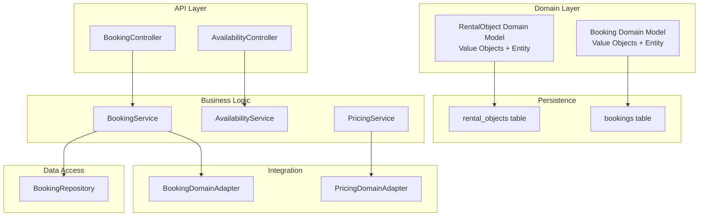
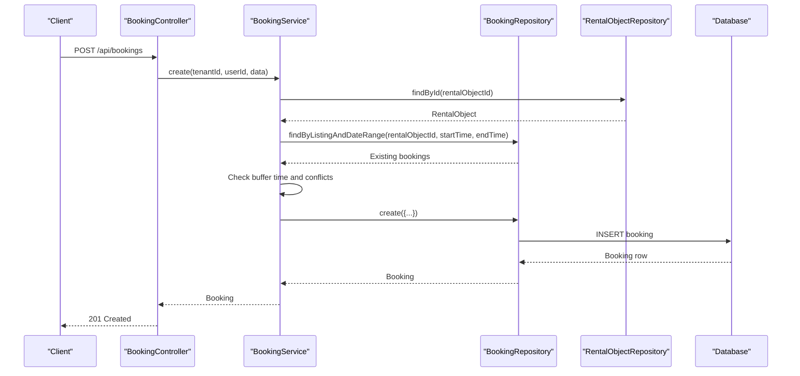
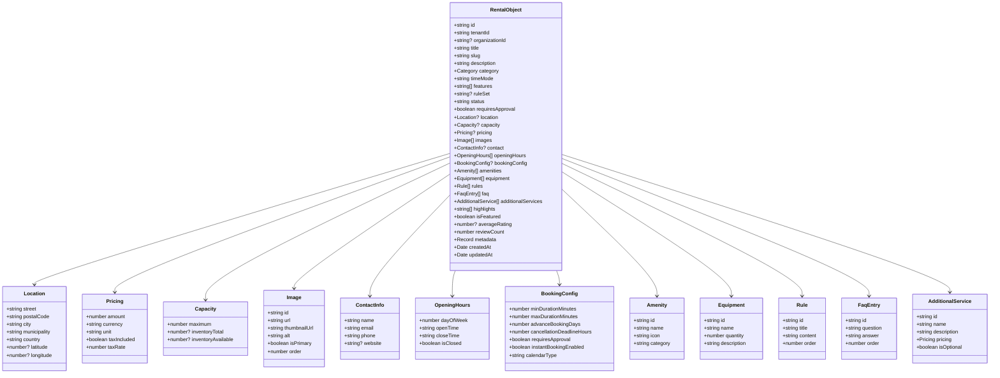
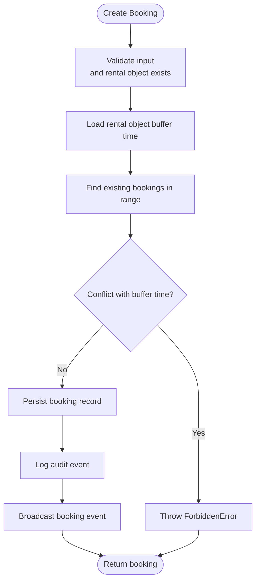
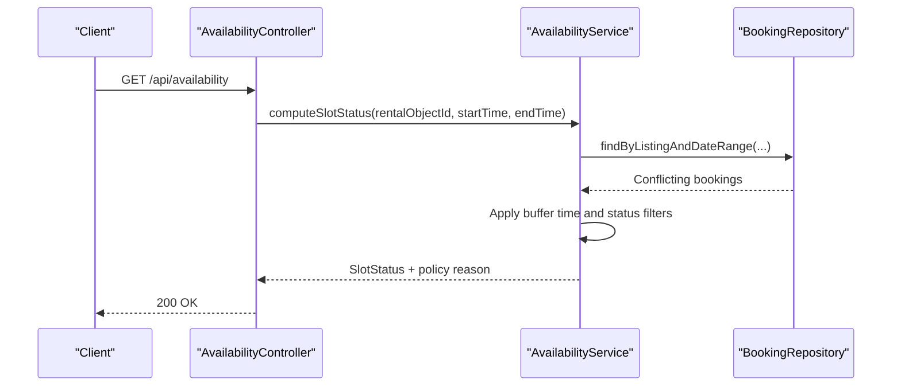
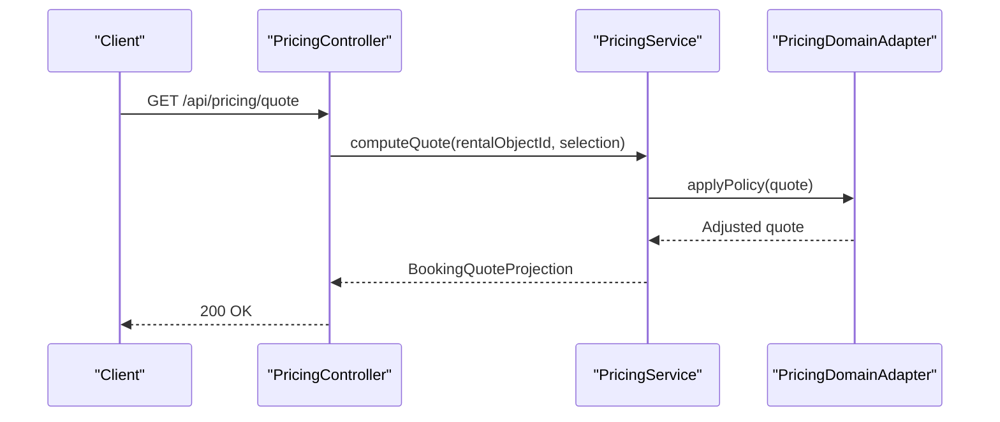
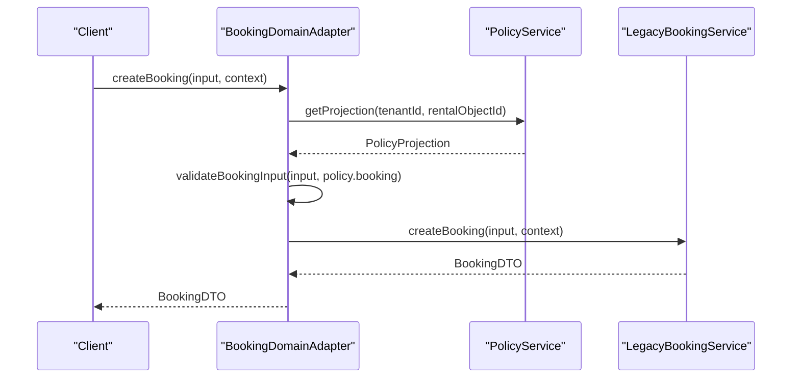
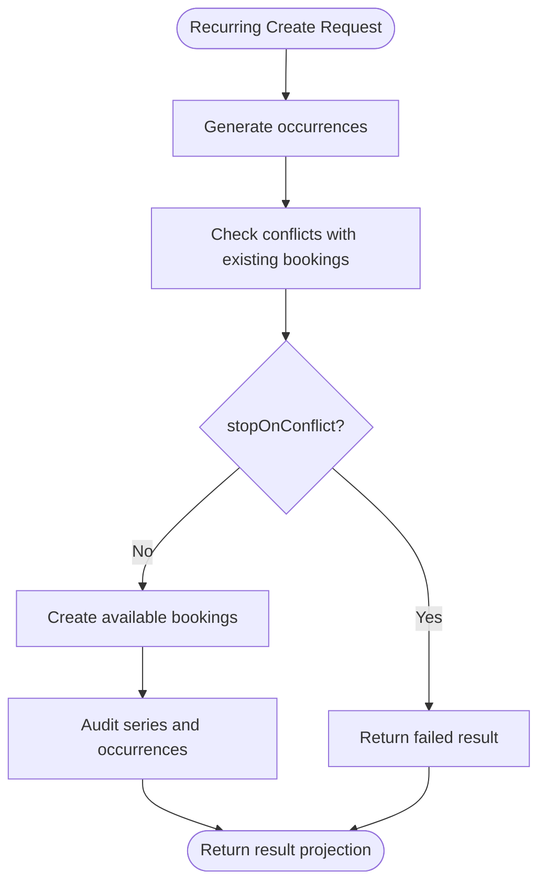
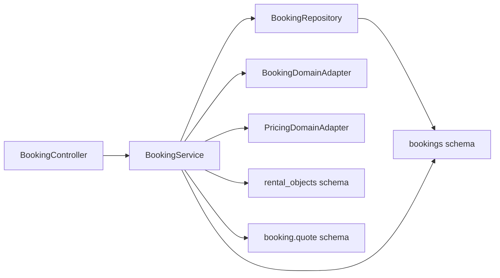

# Domain Business Entities

<cite>
**Referenced Files in This Document**
- [rental-object.ts](file://apps/api/src/domain/rental-objects/rental-object.ts)
- [bookings.ts](file://packages/database-schema/src/domain/bookings.ts)
- [rental-objects.ts](file://packages/database-schema/src/domain/rental-objects.ts)
- [booking.adapter.ts](file://apps/api/src/modules/domain/adapters/booking.adapter.ts)
- [booking.service.ts](file://apps/api/src/modules/booking/booking.service.ts)
- [booking.repository.ts](file://apps/api/src/modules/booking/booking.repository.ts)
- [booking.schema.ts](file://apps/api/src/schemas/booking.schema.ts)
- [booking.controller.ts](file://apps/api/src/modules/booking/booking.controller.ts)
- [availability.controller.ts](file://apps/api/src/modules/availability/availability.controller.ts)
- [availability.service.ts](file://apps/api/src/modules/availability/availability.service.ts)
- [pricing.service.ts](file://apps/api/src/modules/pricing/pricing.service.ts)
- [pricing.adapter.ts](file://apps/api/src/modules/domain/adapters/pricing.adapter.ts)
</cite>

## Table of Contents
1. [Introduction](#introduction)
2. [Project Structure](#project-structure)
3. [Core Components](#core-components)
4. [Architecture Overview](#architecture-overview)
5. [Detailed Component Analysis](#detailed-component-analysis)
6. [Dependency Analysis](#dependency-analysis)
7. [Performance Considerations](#performance-considerations)
8. [Troubleshooting Guide](#troubleshooting-guide)
9. [Conclusion](#conclusion)

## Introduction
This document describes the core business domain entities that power the rental property management platform: rental-objects and bookings. It defines their canonical domain models, value objects, business rules, constraints, and state management patterns. It also explains how these entities relate to each other and how they model real-world scenarios such as availability, pricing, approvals, and recurring bookings. Practical examples illustrate booking workflows, availability calculations, and pricing logic, along with validation rules and policy-driven behavior.

## Project Structure
The domain is implemented across several layers:
- Domain models and value objects define the canonical business representation.
- Database schema files define persistent structures and indexes.
- Controllers expose REST endpoints.
- Services encapsulate business logic and orchestrate repositories.
- Repositories provide data access with filters and optimistic locking.
- Adapters integrate legacy services and policy-driven behavior.
- Schemas define validation and request/response shapes.

**Diagram sources**
- [rental-object.ts](file://apps/api/src/domain/rental-objects/rental-object.ts#L193-L289)
- [bookings.ts](file://packages/database-schema/src/domain/bookings.ts#L18-L41)
- [rental-objects.ts](file://packages/database-schema/src/domain/rental-objects.ts#L18-L44)
- [booking.controller.ts](file://apps/api/src/modules/booking/booking.controller.ts#L21-L418)
- [booking.service.ts](file://apps/api/src/modules/booking/booking.service.ts#L44-L1240)
- [booking.repository.ts](file://apps/api/src/modules/booking/booking.repository.ts#L12-L288)
- [booking.adapter.ts](file://apps/api/src/modules/domain/adapters/booking.adapter.ts#L82-L322)
- [pricing.adapter.ts](file://apps/api/src/modules/domain/adapters/pricing.adapter.ts#L1-L200)
- [availability.controller.ts](file://apps/api/src/modules/availability/availability.controller.ts#L1-L200)
- [availability.service.ts](file://apps/api/src/modules/availability/availability.service.ts#L1-L200)

**Section sources**
- [rental-object.ts](file://apps/api/src/domain/rental-objects/rental-object.ts#L1-L435)
- [bookings.ts](file://packages/database-schema/src/domain/bookings.ts#L1-L41)
- [rental-objects.ts](file://packages/database-schema/src/domain/rental-objects.ts#L1-L53)
- [booking.controller.ts](file://apps/api/src/modules/booking/booking.controller.ts#L21-L418)
- [booking.service.ts](file://apps/api/src/modules/booking/booking.service.ts#L44-L1240)
- [booking.repository.ts](file://apps/api/src/modules/booking/booking.repository.ts#L12-L288)
- [booking.adapter.ts](file://apps/api/src/modules/domain/adapters/booking.adapter.ts#L82-L322)
- [availability.controller.ts](file://apps/api/src/modules/availability/availability.controller.ts#L1-L200)
- [availability.service.ts](file://apps/api/src/modules/availability/availability.service.ts#L1-L200)
- [pricing.adapter.ts](file://apps/api/src/modules/domain/adapters/pricing.adapter.ts#L1-L200)

## Core Components
This section documents the canonical domain entities and their value objects, focusing on fields, constraints, and business rules.

### Rental Object Domain Entity
The canonical representation of a rental object used by business logic. It includes identity, classification, status, location, capacity/inventory, pricing, media, contact info, operating hours, booking configuration, features, and metadata.

Key fields and constraints:
- Identity: id, tenantId, organizationId
- Core attributes: title (preferred over deprecated name), slug, description
- Classification: category (key, label), timeMode (PERIOD, SLOT, ALL_DAY), features (INVENTORY, SHARED_CAPACITY, PACKAGES), ruleSet
- Status and workflow: status (DRAFT, PUBLISHED, ARCHIVED), requiresApproval
- Location: street, postalCode, city, municipality, country, coordinates
- Capacity: maximum, inventoryTotal, inventoryAvailable
- Pricing: amount, currency, unit (HOUR, DAY, WEEK, MONTH, FIXED), taxIncluded, taxRate
- Media: images array (id, url, thumbnailUrl, alt, isPrimary, order)
- Contact: name, email, phone, website
- Operating hours: array of dayOfWeek, openTime, closeTime, isClosed
- Booking configuration: min/max duration, advance booking days, cancellation deadline, requiresApproval, instantBookingEnabled, calendarType
- Amenities and equipment: arrays of structured items
- Rules and FAQ: arrays of entries
- Additional services: array of services with pricing
- Highlights: marketing points
- Metadata: computed ratings, review counts, flexible key-value metadata
- Timestamps: createdAt, updatedAt

Business validation rules:
- Name length constraints and presence
- Capacity must be positive
- Inventory feature requires inventoryTotal
- Shared capacity feature requires maximum capacity
- Published status requires name, description, at least one image, and pricing

**Section sources**
- [rental-object.ts](file://apps/api/src/domain/rental-objects/rental-object.ts#L193-L434)

### Booking Domain Entity
The canonical representation of a booking used by business logic. It includes identity, tenant and user linkage, rental object linkage, temporal bounds, pricing, status, notes, and metadata.

Key fields and constraints:
- Identity: id, tenantId, rentalObjectId, userId
- Temporal: startTime, endTime (endTime must be after startTime)
- Pricing: totalPrice, currency
- Status: pending, confirmed, cancelled, completed, approved, denied
- Notes and metadata
- Version for optimistic locking
- Timestamps: createdAt, updatedAt

Constraints:
- End time must be after start time
- Pagination limits for queries
- Status transitions enforced by service methods

**Section sources**
- [bookings.ts](file://packages/database-schema/src/domain/bookings.ts#L18-L41)
- [booking.schema.ts](file://apps/api/src/schemas/booking.schema.ts#L16-L54)

## Architecture Overview
The system follows a layered architecture:
- Domain models define business semantics independent of persistence and transport.
- Controllers translate HTTP requests into domain operations.
- Services encapsulate business logic, including availability checks, pricing calculation, and state transitions.
- Repositories abstract data access with filters and optimistic locking.
- Adapters integrate legacy services and policy-driven behavior (e.g., booking approvals, slot rules).
- Schemas validate inputs and outputs.

**Diagram sources**
- [booking.controller.ts](file://apps/api/src/modules/booking/booking.controller.ts#L73-L80)
- [booking.service.ts](file://apps/api/src/modules/booking/booking.service.ts#L54-L138)
- [booking.repository.ts](file://apps/api/src/modules/booking/booking.repository.ts#L151-L164)

**Section sources**
- [booking.controller.ts](file://apps/api/src/modules/booking/booking.controller.ts#L21-L418)
- [booking.service.ts](file://apps/api/src/modules/booking/booking.service.ts#L44-L1240)
- [booking.repository.ts](file://apps/api/src/modules/booking/booking.repository.ts#L12-L288)

## Detailed Component Analysis

### Rental Object Domain Model
The rental object domain model is a pure business entity with rich value objects for location, pricing, capacity, images, contact info, opening hours, booking configuration, amenities, equipment, rules, FAQs, and additional services. It enforces strong validation rules for publishing and feature combinations.

**Diagram sources**
- [rental-object.ts](file://apps/api/src/domain/rental-objects/rental-object.ts#L193-L289)

**Section sources**
- [rental-object.ts](file://apps/api/src/domain/rental-objects/rental-object.ts#L16-L434)

### Booking Domain Model and Workflows
The booking domain model captures the temporal and financial aspects of reservations. The service orchestrates creation, availability checks, state transitions, and recurring booking previews.

**Diagram sources**
- [booking.service.ts](file://apps/api/src/modules/booking/booking.service.ts#L54-L138)

**Section sources**
- [booking.service.ts](file://apps/api/src/modules/booking/booking.service.ts#L54-L138)
- [booking.repository.ts](file://apps/api/src/modules/booking/booking.repository.ts#L151-L164)
- [booking.schema.ts](file://apps/api/src/schemas/booking.schema.ts#L38-L54)

### Availability Calculations and Constraints
Availability is computed by checking overlapping bookings within a configurable buffer time window. The system supports:
- Buffer time around existing bookings
- Status filtering (excluding cancelled)
- Organization-scoped access via joins
- Calendar/event exports for UI

**Diagram sources**
- [availability.controller.ts](file://apps/api/src/modules/availability/availability.controller.ts#L1-L200)
- [availability.service.ts](file://apps/api/src/modules/availability/availability.service.ts#L1-L200)
- [booking.repository.ts](file://apps/api/src/modules/booking/booking.repository.ts#L151-L164)

**Section sources**
- [availability.controller.ts](file://apps/api/src/modules/availability/availability.controller.ts#L1-L200)
- [availability.service.ts](file://apps/api/src/modules/availability/availability.service.ts#L1-L200)
- [booking.repository.ts](file://apps/api/src/modules/booking/booking.repository.ts#L28-L145)

### Pricing Logic and Policies
Pricing is driven by rental object configuration and can be extended with policy-driven adjustments. The system includes:
- Pricing adapter for policy-aware pricing decisions
- Quote projection with base price, discount, total, and breakdown
- Constraints derived from rental object (min/max duration, buffer time, advance booking, cancellation deadline)
- Available actions based on slot status and permissions

**Diagram sources**
- [pricing.adapter.ts](file://apps/api/src/modules/domain/adapters/pricing.adapter.ts#L1-L200)
- [booking.schema.ts](file://apps/api/src/schemas/booking.schema.ts#L437-L484)

**Section sources**
- [pricing.adapter.ts](file://apps/api/src/modules/domain/adapters/pricing.adapter.ts#L1-L200)
- [booking.schema.ts](file://apps/api/src/schemas/booking.schema.ts#L437-L484)

### Booking Approval and Policy Integration
The booking domain adapter integrates policy-driven behavior for approvals and slot rules, falling back to legacy logic when policies are unavailable.

**Diagram sources**
- [booking.adapter.ts](file://apps/api/src/modules/domain/adapters/booking.adapter.ts#L97-L127)

**Section sources**
- [booking.adapter.ts](file://apps/api/src/modules/domain/adapters/booking.adapter.ts#L82-L322)

### Recurring Bookings and Conflict Handling
The system supports recurring bookings with conflict detection and policy-driven creation:
- Preview mode generates occurrences and marks availability
- Conflict policy: STOP_ON_CONFLICT or ALLOW_PARTIAL
- Series metadata tracks frequency, weekdays, and series identifiers
- Optimistic locking and batch auditing

**Diagram sources**
- [booking.service.ts](file://apps/api/src/modules/booking/booking.service.ts#L565-L774)
- [booking.schema.ts](file://apps/api/src/schemas/booking.schema.ts#L325-L424)

**Section sources**
- [booking.service.ts](file://apps/api/src/modules/booking/booking.service.ts#L565-L774)
- [booking.schema.ts](file://apps/api/src/schemas/booking.schema.ts#L126-L424)

## Dependency Analysis
The domain entities and their supporting components form a cohesive dependency graph:
- Controllers depend on services for business operations.
- Services depend on repositories for data access and on adapters for policy integration.
- Repositories depend on database schema definitions.
- Domain models and schemas are independent of transport and persistence.

**Diagram sources**
- [booking.controller.ts](file://apps/api/src/modules/booking/booking.controller.ts#L21-L418)
- [booking.service.ts](file://apps/api/src/modules/booking/booking.service.ts#L44-L1240)
- [booking.repository.ts](file://apps/api/src/modules/booking/booking.repository.ts#L12-L288)
- [booking.adapter.ts](file://apps/api/src/modules/domain/adapters/booking.adapter.ts#L82-L322)
- [pricing.adapter.ts](file://apps/api/src/modules/domain/adapters/pricing.adapter.ts#L1-L200)
- [bookings.ts](file://packages/database-schema/src/domain/bookings.ts#L18-L41)
- [rental-objects.ts](file://packages/database-schema/src/domain/rental-objects.ts#L18-L44)
- [booking.schema.ts](file://apps/api/src/schemas/booking.schema.ts#L437-L484)

**Section sources**
- [booking.controller.ts](file://apps/api/src/modules/booking/booking.controller.ts#L21-L418)
- [booking.service.ts](file://apps/api/src/modules/booking/booking.service.ts#L44-L1240)
- [booking.repository.ts](file://apps/api/src/modules/booking/booking.repository.ts#L12-L288)
- [booking.adapter.ts](file://apps/api/src/modules/domain/adapters/booking.adapter.ts#L82-L322)
- [pricing.adapter.ts](file://apps/api/src/modules/domain/adapters/pricing.adapter.ts#L1-L200)
- [bookings.ts](file://packages/database-schema/src/domain/bookings.ts#L18-L41)
- [rental-objects.ts](file://packages/database-schema/src/domain/rental-objects.ts#L18-L44)
- [booking.schema.ts](file://apps/api/src/schemas/booking.schema.ts#L437-L484)

## Performance Considerations
- Indexes on tenantId, rentalObjectId, userId, status, and composite keys optimize queries for bookings and listings.
- Pagination limits prevent excessive result sets.
- Optimistic locking reduces contention during concurrent updates.
- Buffer time checks avoid N+1 conflict checks by leveraging range queries.
- Quote and availability computations rely on efficient joins and filters.

[No sources needed since this section provides general guidance]

## Troubleshooting Guide
Common issues and resolutions:
- Validation errors: Ensure inputs satisfy Zod schemas and domain validation rules (e.g., end time after start, required fields for publishing).
- Availability conflicts: Verify buffer time configuration and that existing bookings are excluded from the conflict window.
- Approval scope: Case handlers must have active scope assignments; otherwise, deny/approve actions will fail.
- Optimistic locking: If a version mismatch occurs, refresh and retry the update.
- Policy violations: When using the booking adapter, ensure policy projections are available; otherwise, fallback logic applies.

**Section sources**
- [booking.schema.ts](file://apps/api/src/schemas/booking.schema.ts#L38-L54)
- [booking.service.ts](file://apps/api/src/modules/booking/booking.service.ts#L279-L333)
- [booking.repository.ts](file://apps/api/src/modules/booking/booking.repository.ts#L226-L282)
- [booking.adapter.ts](file://apps/api/src/modules/domain/adapters/booking.adapter.ts#L229-L265)

## Conclusion
The rental-objects and bookings domain entities provide a clean, policy-aware foundation for modeling real-world rental property management. They enforce strong business rules, support complex workflows (single and recurring bookings), and integrate with availability and pricing systems. The layered architecture ensures separation of concerns, maintainability, and extensibility for future enhancements.