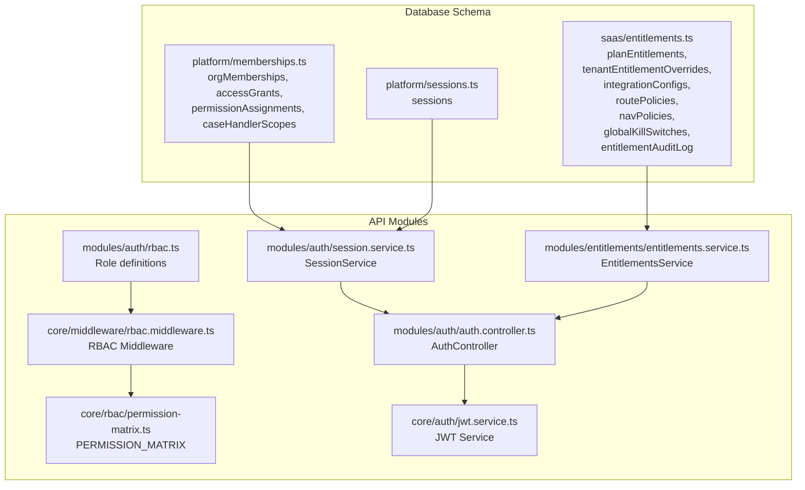
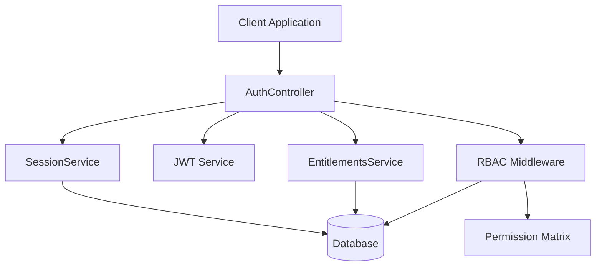
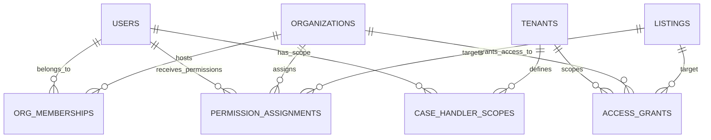
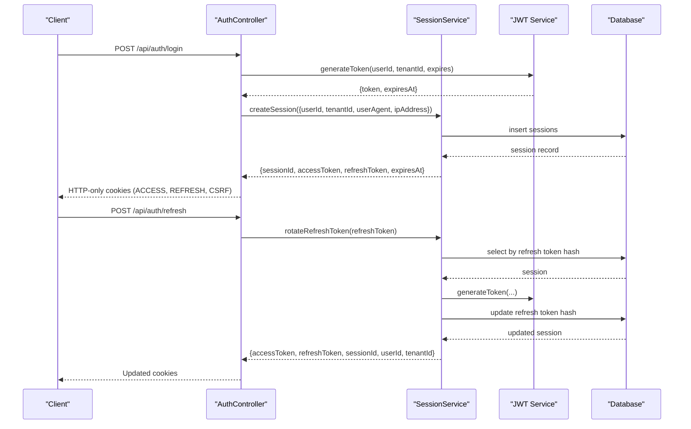
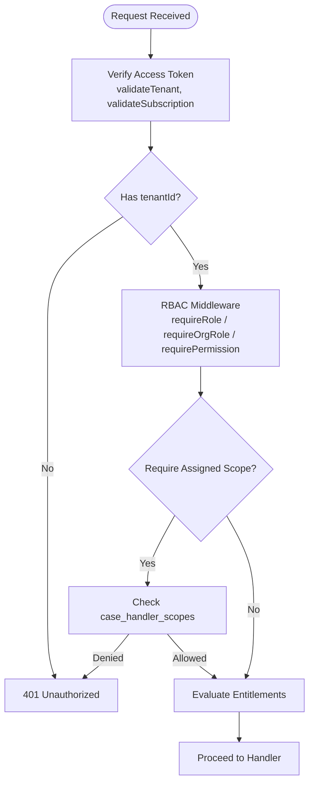
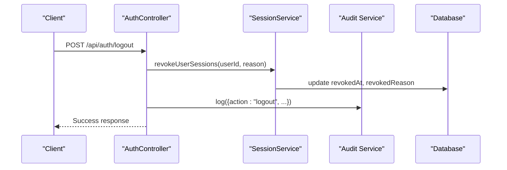
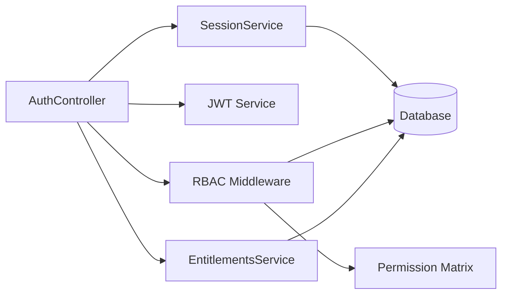

# Platform Infrastructure Models

<cite>
**Referenced Files in This Document**
- [memberships.ts](file://packages/database-schema/src/platform/memberships.ts)
- [sessions.ts](file://packages/database-schema/src/platform/sessions.ts)
- [session.service.ts](file://apps/api/src/modules/auth/session.service.ts)
- [auth.controller.ts](file://apps/api/src/modules/auth/auth.controller.ts)
- [rbac.middleware.ts](file://apps/api/src/core/middleware/rbac.middleware.ts)
- [rbac.ts](file://apps/api/src/modules/auth/rbac.ts)
- [permission-matrix.ts](file://apps/api/src/core/rbac/permission-matrix.ts)
- [jwt.service.ts](file://apps/api/src/core/auth/jwt.service.ts)
- [entitlements.service.ts](file://apps/api/src/modules/entitlements/entitlements.service.ts)
- [entitlements.ts](file://packages/database-schema/src/saas/entitlements.ts)
</cite>

## Table of Contents
1. [Introduction](#introduction)
2. [Project Structure](#project-structure)
3. [Core Components](#core-components)
4. [Architecture Overview](#architecture-overview)
5. [Detailed Component Analysis](#detailed-component-analysis)
6. [Dependency Analysis](#dependency-analysis)
7. [Performance Considerations](#performance-considerations)
8. [Troubleshooting Guide](#troubleshooting-guide)
9. [Conclusion](#conclusion)

## Introduction
This document describes the platform infrastructure models that underpin the application’s operational needs, focusing on memberships and sessions entities. It explains how these models support a multi-tenant architecture and user access patterns, detailing session management, membership validation, and permission enforcement mechanisms. It also outlines security measures and audit trails embedded in these components, and provides examples of common platform operations and their underlying data models.

## Project Structure
The platform is organized around:
- Database schema definitions for platform-level entities (memberships, sessions) and SaaS entitlements
- API modules implementing authentication, authorization, and session lifecycle management
- Middleware and permission matrices enforcing role-based access control (RBAC)
- Services orchestrating entitlement evaluation and tenant data integration



**Diagram sources**
- [memberships.ts](file://packages/database-schema/src/platform/memberships.ts#L1-L95)
- [sessions.ts](file://packages/database-schema/src/platform/sessions.ts#L1-L37)
- [entitlements.ts](file://packages/database-schema/src/saas/entitlements.ts#L1-L154)
- [session.service.ts](file://apps/api/src/modules/auth/session.service.ts#L1-L323)
- [auth.controller.ts](file://apps/api/src/modules/auth/auth.controller.ts#L1-L743)
- [rbac.middleware.ts](file://apps/api/src/core/middleware/rbac.middleware.ts#L1-L398)
- [rbac.ts](file://apps/api/src/modules/auth/rbac.ts#L1-L485)
- [permission-matrix.ts](file://apps/api/src/core/rbac/permission-matrix.ts#L1-L262)
- [jwt.service.ts](file://apps/api/src/core/auth/jwt.service.ts#L1-L259)
- [entitlements.service.ts](file://apps/api/src/modules/entitlements/entitlements.service.ts#L1-L579)

**Section sources**
- [memberships.ts](file://packages/database-schema/src/platform/memberships.ts#L1-L95)
- [sessions.ts](file://packages/database-schema/src/platform/sessions.ts#L1-L37)
- [session.service.ts](file://apps/api/src/modules/auth/session.service.ts#L1-L323)
- [auth.controller.ts](file://apps/api/src/modules/auth/auth.controller.ts#L1-L743)
- [rbac.middleware.ts](file://apps/api/src/core/middleware/rbac.middleware.ts#L1-L398)
- [rbac.ts](file://apps/api/src/modules/auth/rbac.ts#L1-L485)
- [permission-matrix.ts](file://apps/api/src/core/rbac/permission-matrix.ts#L1-L262)
- [jwt.service.ts](file://apps/api/src/core/auth/jwt.service.ts#L1-L259)
- [entitlements.service.ts](file://apps/api/src/modules/entitlements/entitlements.service.ts#L1-L579)
- [entitlements.ts](file://packages/database-schema/src/saas/entitlements.ts#L1-L154)

## Core Components
- Memberships and permissions model:
  - orgMemberships: Links users to organizations with an orgRole and status
  - accessGrants: Grants access to rental objects within a tenant and organization
  - permissionAssignments: Assigns fine-grained permissions per user, organization, and rental object
  - caseHandlerScopes: Defines scoping for case handlers across rental objects
- Sessions model:
  - sessions: Stores refresh token hashes, access token identifiers, device and IP metadata, and revocation state
- Authentication and session management:
  - SessionService: Creates sessions, rotates refresh tokens, revokes sessions, and cleans up expired sessions
  - AuthController: Provides login, OAuth callback, session retrieval, logout, refresh, and demo token endpoints
  - JWT Service: Generates and verifies signed tokens with tenant and subscription data
- Authorization and entitlements:
  - RBAC middleware: Enforces system and organization roles, permissions, and scoping
  - Role definitions and permission matrix: Define hierarchical roles and resource-action permissions
  - EntitlementsService: Evaluates modules, features, integrations, routes, and navigation items with precedence rules

**Section sources**
- [memberships.ts](file://packages/database-schema/src/platform/memberships.ts#L16-L85)
- [sessions.ts](file://packages/database-schema/src/platform/sessions.ts#L14-L33)
- [session.service.ts](file://apps/api/src/modules/auth/session.service.ts#L56-L322)
- [auth.controller.ts](file://apps/api/src/modules/auth/auth.controller.ts#L24-L702)
- [jwt.service.ts](file://apps/api/src/core/auth/jwt.service.ts#L45-L258)
- [rbac.middleware.ts](file://apps/api/src/core/middleware/rbac.middleware.ts#L108-L397)
- [rbac.ts](file://apps/api/src/modules/auth/rbac.ts#L13-L484)
- [permission-matrix.ts](file://apps/api/src/core/rbac/permission-matrix.ts#L45-L261)
- [entitlements.service.ts](file://apps/api/src/modules/entitlements/entitlements.service.ts#L41-L578)
- [entitlements.ts](file://packages/database-schema/src/saas/entitlements.ts#L14-L153)

## Architecture Overview
The platform enforces multi-tenant, role-based access control with robust session management and entitlement evaluation.



**Diagram sources**
- [auth.controller.ts](file://apps/api/src/modules/auth/auth.controller.ts#L24-L702)
- [session.service.ts](file://apps/api/src/modules/auth/session.service.ts#L56-L322)
- [jwt.service.ts](file://apps/api/src/core/auth/jwt.service.ts#L45-L258)
- [rbac.middleware.ts](file://apps/api/src/core/middleware/rbac.middleware.ts#L108-L397)
- [permission-matrix.ts](file://apps/api/src/core/rbac/permission-matrix.ts#L45-L261)
- [entitlements.service.ts](file://apps/api/src/modules/entitlements/entitlements.service.ts#L41-L578)

## Detailed Component Analysis

### Memberships and Permissions Model
The memberships model supports multi-tenant user management and granular access control:
- orgMemberships: Establishes user-to-organization relationships with orgRole and status, enabling organization-level role checks
- accessGrants: Grants access to rental objects within a tenant and organization, supporting tenant-level scoping
- permissionAssignments: Assigns per-user, per-organization, per-rental-object permissions for fine-grained control
- caseHandlerScopes: Defines scoping for case handlers across rental objects, ensuring access is constrained to assigned resources



**Diagram sources**
- [memberships.ts](file://packages/database-schema/src/platform/memberships.ts#L16-L85)

**Section sources**
- [memberships.ts](file://packages/database-schema/src/platform/memberships.ts#L16-L85)

### Sessions Management
Session management follows industry standards with refresh token rotation and revocation:
- Create session: Generates a refresh token hash (SHA-256), issues an access token, and records session metadata
- Rotate refresh token: Ensures one-time use by replacing the refresh token hash upon rotation; detects reuse as a security event
- Revoke session: Supports user-initiated logout and administrative revocation with reasons
- Cleanup expired sessions: Periodic cleanup removes expired sessions
- Retrieve active sessions: Lists user sessions with device and IP metadata for visibility



**Diagram sources**
- [auth.controller.ts](file://apps/api/src/modules/auth/auth.controller.ts#L30-L237)
- [session.service.ts](file://apps/api/src/modules/auth/session.service.ts#L88-L197)
- [jwt.service.ts](file://apps/api/src/core/auth/jwt.service.ts#L66-L103)

**Section sources**
- [session.service.ts](file://apps/api/src/modules/auth/session.service.ts#L56-L322)
- [auth.controller.ts](file://apps/api/src/modules/auth/auth.controller.ts#L30-L442)
- [jwt.service.ts](file://apps/api/src/core/auth/jwt.service.ts#L45-L258)

### Multi-Tenant Architecture and User Access Patterns
The platform enforces multi-tenant isolation and layered access control:
- Tenant context: Authenticated requests carry tenantId in JWT claims; middleware validates and attaches tenant context
- System roles: SaaS, tenant, commune, and organization roles define authority levels
- Organization membership: RBAC middleware validates org membership and roles for org-scoped endpoints
- Scoping for case handlers: requireAssignedScope ensures users can only access rental objects within their assigned scope
- Entitlement evaluation: EntitlementsService evaluates modules, features, integrations, routes, and navigation items with precedence rules



**Diagram sources**
- [auth.controller.ts](file://apps/api/src/modules/auth/auth.controller.ts#L244-L331)
- [rbac.middleware.ts](file://apps/api/src/core/middleware/rbac.middleware.ts#L108-L397)
- [permission-matrix.ts](file://apps/api/src/core/rbac/permission-matrix.ts#L217-L261)
- [entitlements.service.ts](file://apps/api/src/modules/entitlements/entitlements.service.ts#L64-L119)

**Section sources**
- [rbac.middleware.ts](file://apps/api/src/core/middleware/rbac.middleware.ts#L108-L397)
- [rbac.ts](file://apps/api/src/modules/auth/rbac.ts#L13-L484)
- [permission-matrix.ts](file://apps/api/src/core/rbac/permission-matrix.ts#L45-L261)
- [entitlements.service.ts](file://apps/api/src/modules/entitlements/entitlements.service.ts#L41-L578)

### Permission Enforcement Mechanisms
Permission enforcement combines role-based and resource-action checks:
- requireRole: Validates system-level roles
- requireOrgRole: Validates organization membership and orgRole
- requirePermission and requireAnyPermission: Enforce resource-action permissions
- requireAssignedScope: Restricts access to rental objects within assigned scope
- getPermissionsForRole and hasPermission: Utilities for capability projections and permission checks

```mermaid
classDiagram
class RBACMiddleware {
+requireRole(roles)
+requireOrgRole(roles)
+requirePermission(resource, action)
+requireAnyPermission([{resource, action}])
+requireAssignedScope(rentalObjectIdParam, skipForRoles)
}
class PermissionMatrix {
+PERMISSION_MATRIX
+roleHasPermission(role, resource, action) bool
+getPermissionsForRole(role) string[]
+hasPermission(role, resource, action) bool
}
RBACMiddleware --> PermissionMatrix : "uses"
```

**Diagram sources**
- [rbac.middleware.ts](file://apps/api/src/core/middleware/rbac.middleware.ts#L108-L397)
- [permission-matrix.ts](file://apps/api/src/core/rbac/permission-matrix.ts#L217-L261)

**Section sources**
- [rbac.middleware.ts](file://apps/api/src/core/middleware/rbac.middleware.ts#L108-L397)
- [permission-matrix.ts](file://apps/api/src/core/rbac/permission-matrix.ts#L45-L261)

### Security Measures and Audit Trails
Security measures embedded in the infrastructure:
- Session security:
  - Refresh tokens stored as SHA-256 hashes
  - One-time use refresh tokens via rotation
  - Revocation with reasons (user logout, expired, security event, admin revoke, token reuse detected)
  - Cleanup of expired sessions
- Token security:
  - Signed JWTs with HS256, issuer, and audience validation
  - Tenant and subscription data included in JWT payload
  - Token verification with optional tenant and subscription validation
- Audit logging:
  - Auth events (login, logout, token refresh) recorded with IP, user agent, and metadata
  - Entitlement changes logged with before/after snapshots and correlation IDs



**Diagram sources**
- [auth.controller.ts](file://apps/api/src/modules/auth/auth.controller.ts#L338-L381)
- [session.service.ts](file://apps/api/src/modules/auth/session.service.ts#L206-L241)

**Section sources**
- [session.service.ts](file://apps/api/src/modules/auth/session.service.ts#L45-L322)
- [auth.controller.ts](file://apps/api/src/modules/auth/auth.controller.ts#L78-L87)
- [auth.controller.ts](file://apps/api/src/modules/auth/auth.controller.ts#L428-L439)
- [auth.controller.ts](file://apps/api/src/modules/auth/auth.controller.ts#L368-L378)
- [entitlements.service.ts](file://apps/api/src/modules/entitlements/entitlements.service.ts#L542-L567)

### Examples of Common Platform Operations and Underlying Data Models
- Login with email:
  - Endpoint: POST /api/auth/login
  - Flow: Find user by email, generate JWT, set HTTP-only ACCESS cookie, update lastLoginAt, audit login
  - Data model: users, sessions (indirectly via SessionService), audit logs
- OAuth callback:
  - Endpoint: POST /api/auth/callback
  - Flow: Resolve user by nationalId/email, create session with access and refresh tokens, set cookies, audit login
  - Data model: users, sessions, orgMemberships (for orgRole checks)
- Get current session:
  - Endpoint: GET /api/auth/session
  - Flow: Verify access token, fetch user, validate active status, compute permissions and entitlements
  - Data model: users, sessions, permissionAssignments, caseHandlerScopes, entitlements
- Logout:
  - Endpoint: POST /api/auth/logout
  - Flow: Revoke user sessions, clear cookies, audit logout
  - Data model: sessions
- Refresh token:
  - Endpoint: POST /api/auth/refresh
  - Flow: Rotate refresh token (one-time use), issue new cookies, audit refresh
  - Data model: sessions

**Section sources**
- [auth.controller.ts](file://apps/api/src/modules/auth/auth.controller.ts#L30-L237)
- [auth.controller.ts](file://apps/api/src/modules/auth/auth.controller.ts#L244-L331)
- [auth.controller.ts](file://apps/api/src/modules/auth/auth.controller.ts#L338-L442)
- [session.service.ts](file://apps/api/src/modules/auth/session.service.ts#L88-L197)
- [memberships.ts](file://packages/database-schema/src/platform/memberships.ts#L16-L85)
- [entitlements.service.ts](file://apps/api/src/modules/entitlements/entitlements.service.ts#L64-L119)

## Dependency Analysis
The following diagram highlights key dependencies among components:



**Diagram sources**
- [auth.controller.ts](file://apps/api/src/modules/auth/auth.controller.ts#L1-L743)
- [session.service.ts](file://apps/api/src/modules/auth/session.service.ts#L1-L323)
- [rbac.middleware.ts](file://apps/api/src/core/middleware/rbac.middleware.ts#L1-L398)
- [permission-matrix.ts](file://apps/api/src/core/rbac/permission-matrix.ts#L1-L262)
- [entitlements.service.ts](file://apps/api/src/modules/entitlements/entitlements.service.ts#L1-L579)

**Section sources**
- [auth.controller.ts](file://apps/api/src/modules/auth/auth.controller.ts#L1-L743)
- [session.service.ts](file://apps/api/src/modules/auth/session.service.ts#L1-L323)
- [rbac.middleware.ts](file://apps/api/src/core/middleware/rbac.middleware.ts#L1-L398)
- [permission-matrix.ts](file://apps/api/src/core/rbac/permission-matrix.ts#L1-L262)
- [entitlements.service.ts](file://apps/api/src/modules/entitlements/entitlements.service.ts#L1-L579)

## Performance Considerations
- Session cleanup: Schedule periodic cleanup of expired sessions to maintain database performance
- Indexing: Ensure database indexes on frequently queried fields (e.g., sessions.refreshTokenHash, sessions.user_tenant_idx) are maintained
- Caching: Leverage EntitlementsService cache to reduce repeated evaluations for the same tenant/user/environment combinations
- Token lifetimes: Balance access token short lifetime with refresh token rotation to minimize verification overhead while maintaining security

## Troubleshooting Guide
Common issues and resolutions:
- Invalid or expired token:
  - Symptom: 401 Unauthorized on protected endpoints
  - Resolution: Ensure access token is valid and not expired; use refresh endpoint to obtain a new access token
- Invalid refresh token:
  - Symptom: 401 Unauthorized during refresh
  - Resolution: Indicates token reuse or invalid/expired token; re-authenticate
- User inactive:
  - Symptom: 401 Unauthorized when fetching session
  - Resolution: Activate user account or re-authenticate with an active user
- Insufficient permissions:
  - Symptom: 403 Forbidden on resource access
  - Resolution: Verify user role and permissions; ensure organization membership and assigned scopes are correct
- Session revocation:
  - Symptom: Immediate logout or blocked access
  - Resolution: Confirm revocation reason and re-authenticate if necessary

**Section sources**
- [auth.controller.ts](file://apps/api/src/modules/auth/auth.controller.ts#L258-L291)
- [session.service.ts](file://apps/api/src/modules/auth/session.service.ts#L141-L197)
- [rbac.middleware.ts](file://apps/api/src/core/middleware/rbac.middleware.ts#L112-L131)

## Conclusion
The platform infrastructure models provide a robust foundation for multi-tenant user management and access control. The memberships and sessions entities, combined with JWT-based authentication, RBAC enforcement, and entitlement evaluation, ensure secure, scalable, and auditable operations. Proper session lifecycle management, strict permission checks, and comprehensive audit logging collectively support both operational reliability and strong security posture.