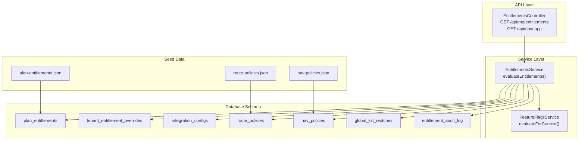
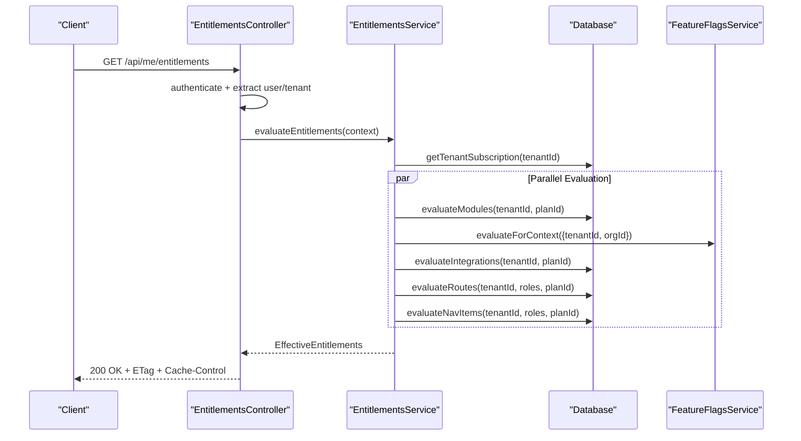
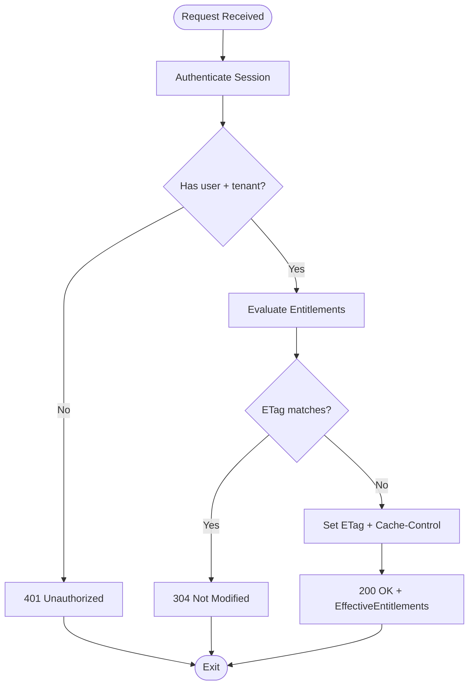
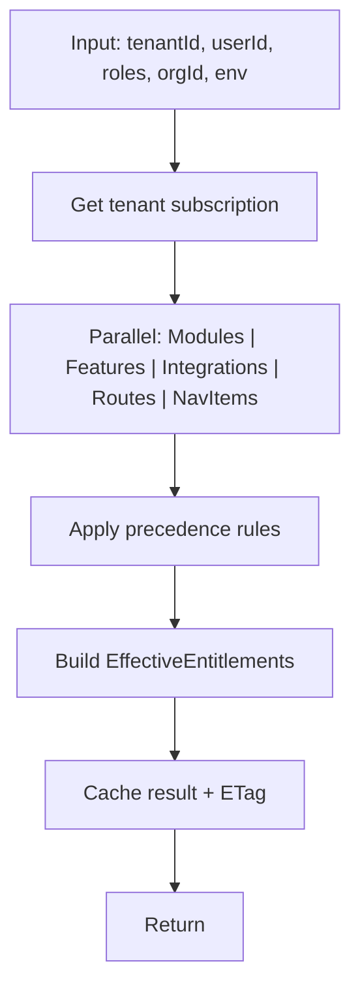
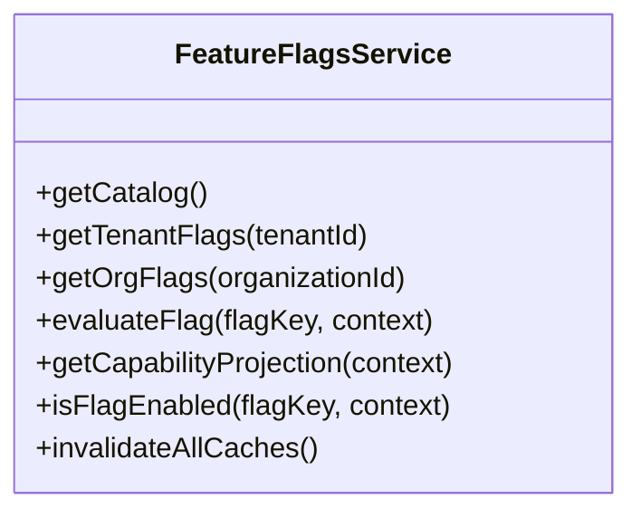
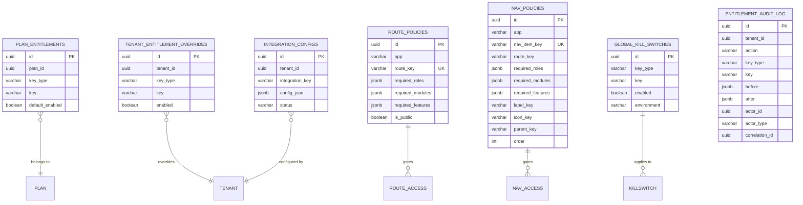
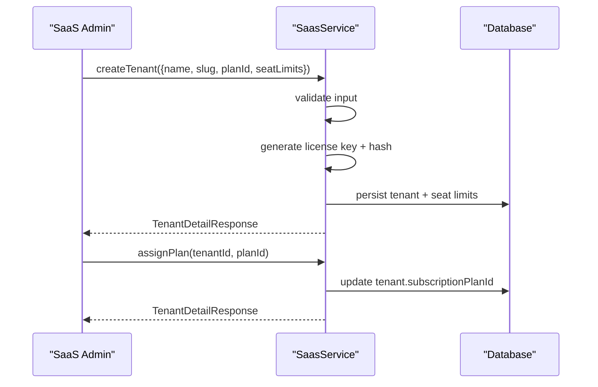
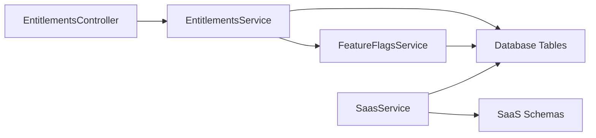

# SaaS Multi-Tenancy Models

<cite>
**Referenced Files in This Document**
- [apps/api/src/modules/entitlements/entitlements.controller.ts](file://apps/api/src/modules/entitlements/entitlements.controller.ts)
- [apps/api/src/modules/entitlements/entitlements.service.ts](file://apps/api/src/modules/entitlements/entitlements.service.ts)
- [apps/api/src/database/schema/entitlements.ts](file://apps/api/src/database/schema/entitlements.ts)
- [packages/database-schema/src/saas/entitlements.ts](file://packages/database-schema/src/saas/entitlements.ts)
- [packages/database-schema/seeds/plan-entitlements.json](file://packages/database-schema/seeds/plan-entitlements.json)
- [packages/database-schema/seeds/nav-policies.json](file://packages/database-schema/seeds/nav-policies.json)
- [packages/database-schema/seeds/route-policies.json](file://packages/database-schema/seeds/route-policies.json)
- [apps/api/src/schemas/saas.schema.ts](file://apps/api/src/schemas/saas.schema.ts)
- [apps/api/src/modules/feature-flags/feature-flags.service.ts](file://apps/api/src/modules/feature-flags/feature-flags.service.ts)
- [apps/api/src/modules/saas/saas.service.ts](file://apps/api/src/modules/saas/saas.service.ts)
</cite>

## Table of Contents
1. [Introduction](#introduction)
2. [Project Structure](#project-structure)
3. [Core Components](#core-components)
4. [Architecture Overview](#architecture-overview)
5. [Detailed Component Analysis](#detailed-component-analysis)
6. [Dependency Analysis](#dependency-analysis)
7. [Performance Considerations](#performance-considerations)
8. [Troubleshooting Guide](#troubleshooting-guide)
9. [Conclusion](#conclusion)

## Introduction
This document explains the SaaS multi-tenancy models that power the platform’s subscription and licensing features. It focuses on the entitlements system, role-based access control (RBAC), and feature gating mechanisms. The entitlements model supports different subscription tiers and controls feature availability across modules, features, and integrations. It also documents how tenants, entitlements, and user permissions relate, along with practical examples of entitlement evaluation, subscription management, and feature flag implementation. Finally, it covers scalability and performance optimization for multi-tenant operations.

## Project Structure
The entitlements system spans several layers:
- API controllers expose endpoints for entitlements and navigation evaluation.
- The entitlements service orchestrates evaluation across modules, features, integrations, routes, and navigation items.
- Database schema defines the canonical tables for plans, overrides, policies, kill switches, and audit logs.
- Seed data defines default plan entitlements and navigation/route policies.
- Feature flags complement entitlements with dynamic capability projection.
- SaaS admin schemas and service define plan and tenant lifecycle operations.

**Diagram sources**
- [apps/api/src/modules/entitlements/entitlements.controller.ts](file://apps/api/src/modules/entitlements/entitlements.controller.ts#L124-L142)
- [apps/api/src/modules/entitlements/entitlements.service.ts](file://apps/api/src/modules/entitlements/entitlements.service.ts#L64-L119)
- [packages/database-schema/src/saas/entitlements.ts](file://packages/database-schema/src/saas/entitlements.ts#L14-L154)
- [packages/database-schema/seeds/plan-entitlements.json](file://packages/database-schema/seeds/plan-entitlements.json#L1-L213)
- [packages/database-schema/seeds/route-policies.json](file://packages/database-schema/seeds/route-policies.json#L1-L183)
- [packages/database-schema/seeds/nav-policies.json](file://packages/database-schema/seeds/nav-policies.json#L1-L171)

**Section sources**
- [apps/api/src/modules/entitlements/entitlements.controller.ts](file://apps/api/src/modules/entitlements/entitlements.controller.ts#L1-L143)
- [apps/api/src/modules/entitlements/entitlements.service.ts](file://apps/api/src/modules/entitlements/entitlements.service.ts#L1-L579)
- [packages/database-schema/src/saas/entitlements.ts](file://packages/database-schema/src/saas/entitlements.ts#L1-L154)

## Core Components
- Entitlements Controller: Exposes endpoints to fetch effective entitlements and filtered navigation items per app. Implements ETag caching and authorization checks.
- Entitlements Service: Central evaluation engine that computes enabled modules, features, integrations, route access, and navigation items using precedence rules and seed-driven policies.
- Feature Flags Service: Provides capability projection and flag evaluation with tenant and organization overrides, enforcing restriction-only behavior at the organization level.
- Database Schema: Canonical tables for plan entitlements, tenant overrides, integration configurations, route and navigation policies, global kill switches, and audit logging.
- Seed Data: Defines default entitlements per plan and policy matrices for routes and navigation items.
- SaaS Admin Schemas and Service: Define plan and tenant structures and provide administrative operations (listing, creation, updates, plan assignment, license key rotation).

**Section sources**
- [apps/api/src/modules/entitlements/entitlements.controller.ts](file://apps/api/src/modules/entitlements/entitlements.controller.ts#L10-L142)
- [apps/api/src/modules/entitlements/entitlements.service.ts](file://apps/api/src/modules/entitlements/entitlements.service.ts#L41-L579)
- [apps/api/src/modules/feature-flags/feature-flags.service.ts](file://apps/api/src/modules/feature-flags/feature-flags.service.ts#L65-L652)
- [packages/database-schema/src/saas/entitlements.ts](file://packages/database-schema/src/saas/entitlements.ts#L14-L154)
- [packages/database-schema/seeds/plan-entitlements.json](file://packages/database-schema/seeds/plan-entitlements.json#L1-L213)
- [packages/database-schema/seeds/route-policies.json](file://packages/database-schema/seeds/route-policies.json#L1-L183)
- [packages/database-schema/seeds/nav-policies.json](file://packages/database-schema/seeds/nav-policies.json#L1-L171)
- [apps/api/src/schemas/saas.schema.ts](file://apps/api/src/schemas/saas.schema.ts#L1-L492)
- [apps/api/src/modules/saas/saas.service.ts](file://apps/api/src/modules/saas/saas.service.ts#L44-L655)

## Architecture Overview
The entitlements evaluation pipeline integrates tenant subscription data, plan defaults, tenant overrides, global kill switches, and feature flags to produce a unified projection of enabled capabilities. Routes and navigation items are gated by role, module, and feature requirements defined in policy tables.

**Diagram sources**
- [apps/api/src/modules/entitlements/entitlements.controller.ts](file://apps/api/src/modules/entitlements/entitlements.controller.ts#L21-L70)
- [apps/api/src/modules/entitlements/entitlements.service.ts](file://apps/api/src/modules/entitlements/entitlements.service.ts#L64-L119)
- [apps/api/src/modules/feature-flags/feature-flags.service.ts](file://apps/api/src/modules/feature-flags/feature-flags.service.ts#L517-L549)

## Detailed Component Analysis

### Entitlements Controller
- Purpose: Expose endpoints for entitlements and navigation evaluation.
- Key behaviors:
  - Validates authenticated session and extracts tenant/user context.
  - Computes entitlements via the service and returns ETag-based caching headers.
  - Supports per-app navigation filtering by delegating to entitlements service.
- Error handling: Returns standardized problem details for unauthorized and internal server errors.

**Diagram sources**
- [apps/api/src/modules/entitlements/entitlements.controller.ts](file://apps/api/src/modules/entitlements/entitlements.controller.ts#L21-L70)

**Section sources**
- [apps/api/src/modules/entitlements/entitlements.controller.ts](file://apps/api/src/modules/entitlements/entitlements.controller.ts#L10-L142)

### Entitlements Service
- Purpose: Unified evaluation engine orchestrating modules, features, integrations, routes, and navigation items.
- Evaluation precedence (highest to lowest):
  1) Global kill switches
  2) Tenant entitlement overrides
  3) Tenant module settings
  4) Plan defaults
  5) Module default enabled flag
- Parallel evaluation: Modules, features, integrations, route policies, and navigation items are computed concurrently for performance.
- Caching: Results are cached per tenant/user/environment with ETag generation for client-side caching.
- Audit logging: Changes trigger audit entries and cache invalidation.

**Diagram sources**
- [apps/api/src/modules/entitlements/entitlements.service.ts](file://apps/api/src/modules/entitlements/entitlements.service.ts#L64-L119)

**Section sources**
- [apps/api/src/modules/entitlements/entitlements.service.ts](file://apps/api/src/modules/entitlements/entitlements.service.ts#L41-L579)

### Feature Flags Service
- Purpose: Provide capability projection and flag evaluation with tenant and organization overrides.
- Resolution hierarchy:
  1) Organization-level override (restriction-only)
  2) Tenant-level override
  3) Catalog default
- Outputs: Enabled/disabled flags, categorized flags, and capability projection for policy enforcement.

**Diagram sources**
- [apps/api/src/modules/feature-flags/feature-flags.service.ts](file://apps/api/src/modules/feature-flags/feature-flags.service.ts#L65-L652)

**Section sources**
- [apps/api/src/modules/feature-flags/feature-flags.service.ts](file://apps/api/src/modules/feature-flags/feature-flags.service.ts#L65-L652)

### Database Schema and Seed Data
- Canonical tables:
  - plan_entitlements: Plan defaults for modules, features, and integrations.
  - tenant_entitlement_overrides: Tenant-level toggles overriding plan defaults.
  - integration_configs: Per-tenant integration status and validation metadata.
  - route_policies: Route-level gating by roles, modules, and features.
  - nav_policies: Navigation item gating by roles, modules, and features.
  - global_kill_switches: Emergency kill switches by key type and environment.
  - entitlement_audit_log: Audit trail for entitlement changes.
- Seed data:
  - plan-entitlements.json: Default entitlements per plan (Free, Pro, Enterprise).
  - route-policies.json: Route-level access rules and public flags.
  - nav-policies.json: Navigation item rules and ordering.

**Diagram sources**
- [packages/database-schema/src/saas/entitlements.ts](file://packages/database-schema/src/saas/entitlements.ts#L14-L154)

**Section sources**
- [packages/database-schema/src/saas/entitlements.ts](file://packages/database-schema/src/saas/entitlements.ts#L1-L154)
- [packages/database-schema/seeds/plan-entitlements.json](file://packages/database-schema/seeds/plan-entitlements.json#L1-L213)
- [packages/database-schema/seeds/route-policies.json](file://packages/database-schema/seeds/route-policies.json#L1-L183)
- [packages/database-schema/seeds/nav-policies.json](file://packages/database-schema/seeds/nav-policies.json#L1-L171)

### Subscription and Licensing Models
- Plans define seat limits and entitlements (modules, features, integrations).
- Tenants are associated with a plan via subscription records.
- Administrative operations include listing, creating/updating tenants, assigning plans, rotating license keys, and managing seat limits.
- Schemas enforce validation for plans, tenants, and feature flags.

**Diagram sources**
- [apps/api/src/modules/saas/saas.service.ts](file://apps/api/src/modules/saas/saas.service.ts#L143-L219)
- [apps/api/src/modules/saas/saas.service.ts](file://apps/api/src/modules/saas/saas.service.ts#L524-L555)
- [apps/api/src/schemas/saas.schema.ts](file://apps/api/src/schemas/saas.schema.ts#L196-L262)

**Section sources**
- [apps/api/src/modules/saas/saas.service.ts](file://apps/api/src/modules/saas/saas.service.ts#L44-L655)
- [apps/api/src/schemas/saas.schema.ts](file://apps/api/src/schemas/saas.schema.ts#L1-L492)

### Entitlement Evaluation Examples
- Example 1: Evaluating modules for a tenant on the Enterprise plan.
  - Start with plan defaults from seed data.
  - Apply tenant overrides and module settings.
  - Respect global kill switches.
  - Result: Enabled module keys for the session.
- Example 2: Feature gating via feature flags.
  - Use FeatureFlagsService to resolve enabled flags for tenant and organization context.
  - Combine with entitlements to gate routes and navigation items.
- Example 3: Navigation filtering per app.
  - Controller delegates to service to filter nav items by app and entitlements.

**Section sources**
- [apps/api/src/modules/entitlements/entitlements.service.ts](file://apps/api/src/modules/entitlements/entitlements.service.ts#L125-L231)
- [apps/api/src/modules/entitlements/entitlements.service.ts](file://apps/api/src/modules/entitlements/entitlements.service.ts#L237-L272)
- [apps/api/src/modules/entitlements/entitlements.controller.ts](file://apps/api/src/modules/entitlements/entitlements.controller.ts#L76-L112)

### Role-Based Access Control and Feature Gating
- Routes are gated by:
  - isPublic flag
  - requiredRoles
  - requiredModules (enabled by entitlements)
  - requiredFeatures (enabled by feature flags)
- Navigation items are gated similarly and grouped by app and order.
- Policy matrices are defined in seed data for backoffice and minside applications.

**Section sources**
- [apps/api/src/modules/entitlements/entitlements.service.ts](file://apps/api/src/modules/entitlements/entitlements.service.ts#L382-L439)
- [apps/api/src/modules/entitlements/entitlements.service.ts](file://apps/api/src/modules/entitlements/entitlements.service.ts#L445-L498)
- [packages/database-schema/seeds/route-policies.json](file://packages/database-schema/seeds/route-policies.json#L1-L183)
- [packages/database-schema/seeds/nav-policies.json](file://packages/database-schema/seeds/nav-policies.json#L1-L171)

## Dependency Analysis
- Controller depends on EntitlementsService and Fastify authentication middleware.
- EntitlementsService depends on:
  - Database schema tables for plan entitlements, overrides, integrations, policies, kill switches, and audit logs.
  - FeatureFlagsService for capability projection.
  - Optional Cache abstraction for performance.
- FeatureFlagsService depends on catalog and override tables, with optional cache and audit logging.
- SaaS Admin Service depends on schemas and performs administrative operations.

**Diagram sources**
- [apps/api/src/modules/entitlements/entitlements.controller.ts](file://apps/api/src/modules/entitlements/entitlements.controller.ts#L124-L142)
- [apps/api/src/modules/entitlements/entitlements.service.ts](file://apps/api/src/modules/entitlements/entitlements.service.ts#L41-L54)
- [apps/api/src/modules/feature-flags/feature-flags.service.ts](file://apps/api/src/modules/feature-flags/feature-flags.service.ts#L65-L78)
- [apps/api/src/modules/saas/saas.service.ts](file://apps/api/src/modules/saas/saas.service.ts#L44-L47)

**Section sources**
- [apps/api/src/modules/entitlements/entitlements.controller.ts](file://apps/api/src/modules/entitlements/entitlements.controller.ts#L124-L142)
- [apps/api/src/modules/entitlements/entitlements.service.ts](file://apps/api/src/modules/entitlements/entitlements.service.ts#L41-L579)
- [apps/api/src/modules/feature-flags/feature-flags.service.ts](file://apps/api/src/modules/feature-flags/feature-flags.service.ts#L65-L652)
- [apps/api/src/modules/saas/saas.service.ts](file://apps/api/src/modules/saas/saas.service.ts#L44-L655)

## Performance Considerations
- Parallel evaluation: Modules, features, integrations, routes, and navigation items are evaluated concurrently to reduce latency.
- Caching:
  - Service-level cache keyed by tenant, user, and environment with TTL.
  - ETag generation enables efficient client-side caching and 304 Not Modified responses.
  - Optional Redis cache integration is supported via container-resolved Cache.
- Indexing and constraints:
  - Unique and composite indexes on plan_entitlements, tenant overrides, nav policies, and route policies optimize lookups.
- Audit logging:
  - Minimal overhead via asynchronous inserts and correlation IDs for traceability.

[No sources needed since this section provides general guidance]

## Troubleshooting Guide
- Unauthorized requests: Controller returns 401 when user/tenant context is missing.
- Internal server errors: Controller returns standardized problem details on evaluation failures.
- Cache misses or stale data: Clear cache keys for tenant/user/environment or rely on TTL expiration.
- Kill switches: If a feature/module/integration is globally disabled, it will appear disabled regardless of plan or overrides.
- Organization-level flag restrictions: Organization-level overrides can only disable flags; attempting to enable beyond tenant-level results in forbidden errors.

**Section sources**
- [apps/api/src/modules/entitlements/entitlements.controller.ts](file://apps/api/src/modules/entitlements/entitlements.controller.ts#L28-L35)
- [apps/api/src/modules/entitlements/entitlements.controller.ts](file://apps/api/src/modules/entitlements/entitlements.controller.ts#L61-L69)
- [apps/api/src/modules/feature-flags/feature-flags.service.ts](file://apps/api/src/modules/feature-flags/feature-flags.service.ts#L324-L329)

## Conclusion
The entitlements system provides a robust, multi-layered mechanism for controlling access and features across tenants. By combining plan defaults, tenant overrides, global kill switches, and feature flags, it ensures predictable behavior while enabling fine-grained control. The architecture emphasizes performance through parallel evaluation and caching, and it maintains auditability and scalability through well-defined schemas and seed-driven policies. Together with SaaS admin capabilities, it supports flexible subscription management and licensing operations.