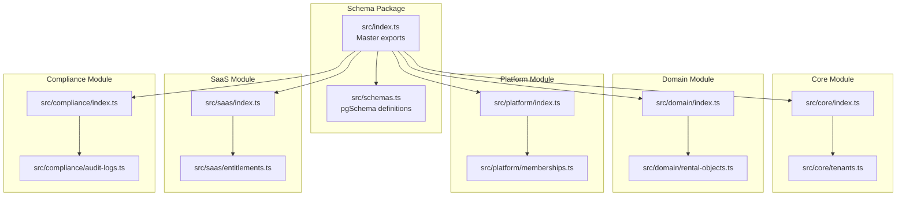
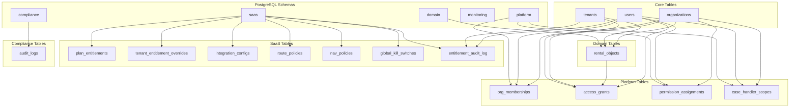
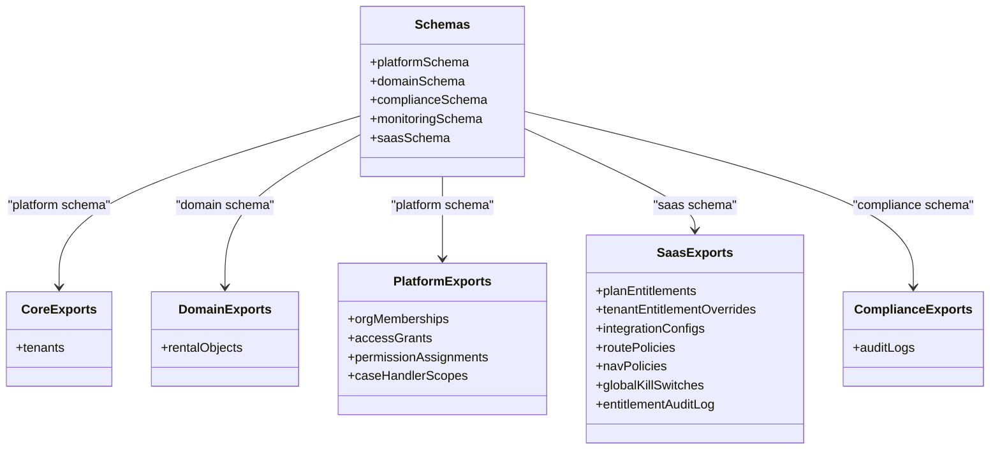
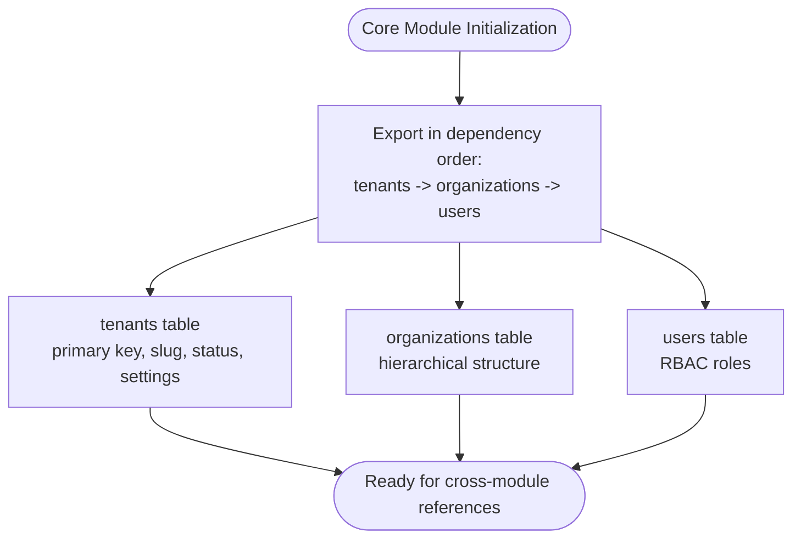
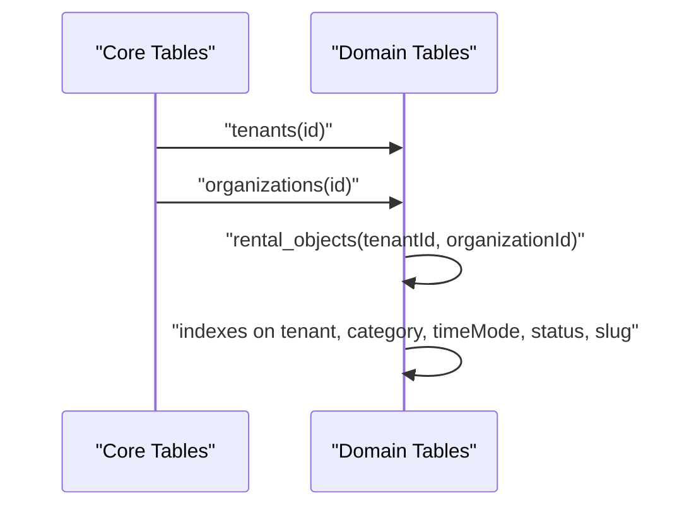
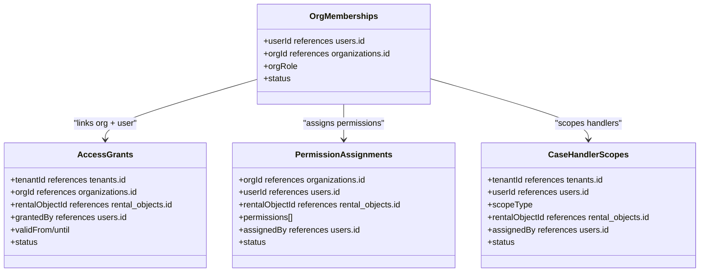
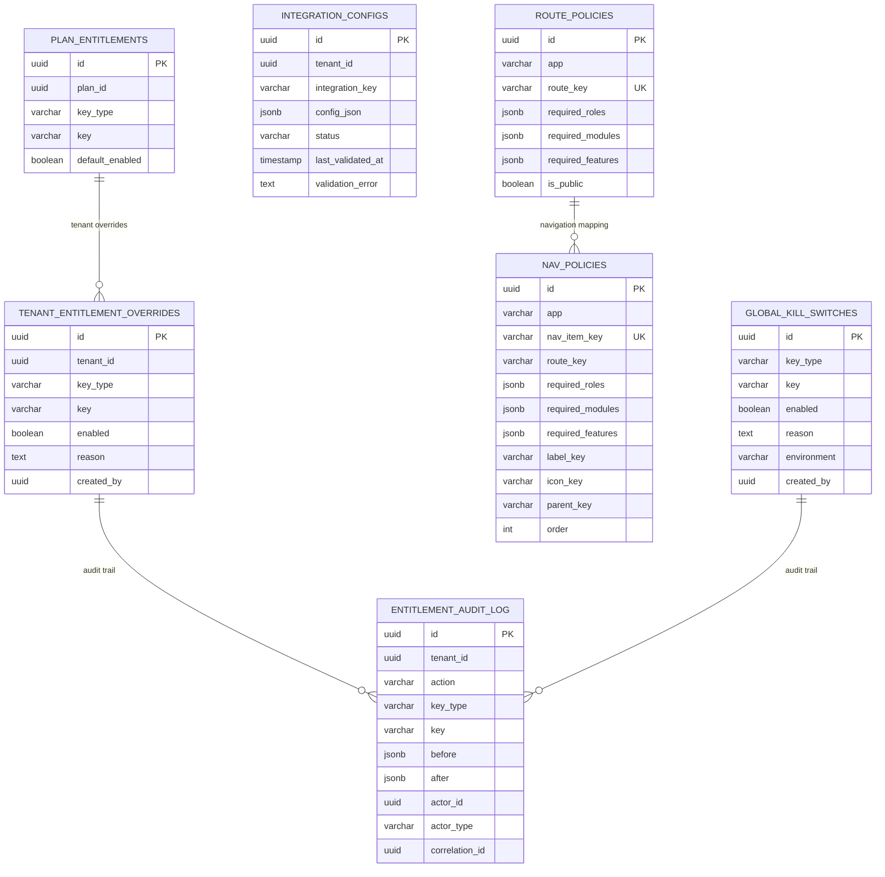
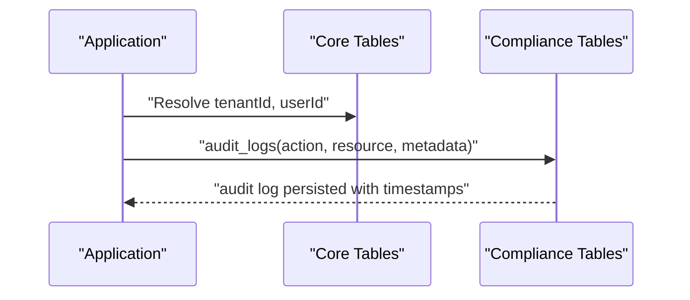
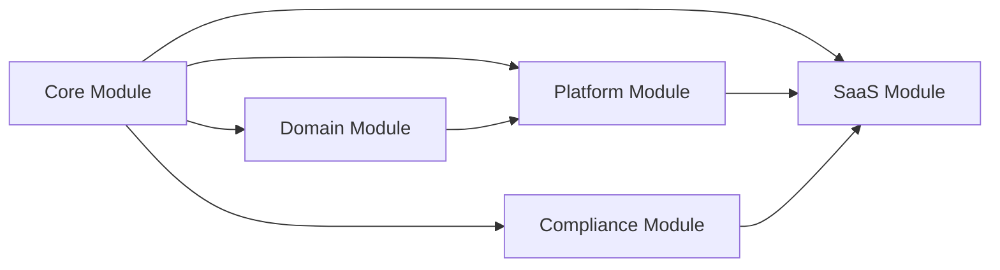

# Schema Organization & Structure

<cite>
**Referenced Files in This Document**
- [packages/database-schema/src/index.ts](file://packages/database-schema/src/index.ts)
- [packages/database-schema/src/schemas.ts](file://packages/database-schema/src/schemas.ts)
- [packages/database-schema/src/core/index.ts](file://packages/database-schema/src/core/index.ts)
- [packages/database-schema/src/domain/index.ts](file://packages/database-schema/src/domain/index.ts)
- [packages/database-schema/src/platform/index.ts](file://packages/database-schema/src/platform/index.ts)
- [packages/database-schema/src/saas/index.ts](file://packages/database-schema/src/saas/index.ts)
- [packages/database-schema/src/compliance/index.ts](file://packages/database-schema/src/compliance/index.ts)
- [packages/database-schema/src/core/tenants.ts](file://packages/database-schema/src/core/tenants.ts)
- [packages/database-schema/src/domain/rental-objects.ts](file://packages/database-schema/src/domain/rental-objects.ts)
- [packages/database-schema/src/platform/memberships.ts](file://packages/database-schema/src/platform/memberships.ts)
- [packages/database-schema/src/saas/entitlements.ts](file://packages/database-schema/src/saas/entitlements.ts)
- [packages/database-schema/src/compliance/audit-logs.ts](file://packages/database-schema/src/compliance/audit-logs.ts)
- [packages/database-schema/package.json](file://packages/database-schema/package.json)
- [packages/database-schema/README.md](file://packages/database-schema/README.md)
</cite>

## Table of Contents
1. [Introduction](#introduction)
2. [Project Structure](#project-structure)
3. [Core Components](#core-components)
4. [Architecture Overview](#architecture-overview)
5. [Detailed Component Analysis](#detailed-component-analysis)
6. [Dependency Analysis](#dependency-analysis)
7. [Performance Considerations](#performance-considerations)
8. [Troubleshooting Guide](#troubleshooting-guide)
9. [Conclusion](#conclusion)
10. [Appendices](#appendices)

## Introduction
This document explains the database schema organization and structure used across the Digilist platform. The schema package provides a single source of truth for Drizzle ORM definitions, organized into modular domains to support scalability, maintainability, and governance. The approach separates concerns into distinct PostgreSQL schema namespaces and module boundaries, enabling safe migration generation and type-safe imports across applications.

## Project Structure
The schema package is organized into a clear module taxonomy with dedicated exports and schema namespaces:

- Root exports provide unified access to all modules and schema definitions
- Module-level index files re-export tables in dependency order to prevent circular dependencies
- Each module defines tables under its own PostgreSQL schema namespace
- The package exposes granular subpath exports for each module and selected submodules

**Diagram sources**
- [packages/database-schema/src/index.ts](file://packages/database-schema/src/index.ts#L1-L32)
- [packages/database-schema/src/schemas.ts](file://packages/database-schema/src/schemas.ts#L1-L13)
- [packages/database-schema/src/core/index.ts](file://packages/database-schema/src/core/index.ts#L1-L10)
- [packages/database-schema/src/domain/index.ts](file://packages/database-schema/src/domain/index.ts#L1-L8)
- [packages/database-schema/src/platform/index.ts](file://packages/database-schema/src/platform/index.ts#L1-L8)
- [packages/database-schema/src/saas/index.ts](file://packages/database-schema/src/saas/index.ts#L1-L7)
- [packages/database-schema/src/compliance/index.ts](file://packages/database-schema/src/compliance/index.ts#L1-L6)

**Section sources**
- [packages/database-schema/src/index.ts](file://packages/database-schema/src/index.ts#L1-L32)
- [packages/database-schema/src/schemas.ts](file://packages/database-schema/src/schemas.ts#L1-L13)
- [packages/database-schema/package.json](file://packages/database-schema/package.json#L9-L44)

## Core Components
The schema package defines six primary modules, each with a focused responsibility and its own PostgreSQL schema namespace:

- schemas: Centralized pgSchema definitions for platform, domain, compliance, monitoring, and saas
- core: Foundation tables (tenants, organizations, users) with no external dependencies
- domain: Business entities (rental-objects, bookings)
- platform: Infrastructure and access control (sessions, memberships, permissions)
- saas: Multi-tenancy and entitlements (plans, entitlement overrides, policies)
- compliance: Audit logging and governance

Module exports are aggregated via index files to enforce dependency order and eliminate circular dependencies.

**Section sources**
- [packages/database-schema/src/index.ts](file://packages/database-schema/src/index.ts#L15-L31)
- [packages/database-schema/src/schemas.ts](file://packages/database-schema/src/schemas.ts#L8-L12)
- [packages/database-schema/src/core/index.ts](file://packages/database-schema/src/core/index.ts#L7-L9)
- [packages/database-schema/src/domain/index.ts](file://packages/database-schema/src/domain/index.ts#L6-L7)
- [packages/database-schema/src/platform/index.ts](file://packages/database-schema/src/platform/index.ts#L6-L7)
- [packages/database-schema/src/saas/index.ts](file://packages/database-schema/src/saas/index.ts#L6)
- [packages/database-schema/src/compliance/index.ts](file://packages/database-schema/src/compliance/index.ts#L5)

## Architecture Overview
The schema architecture uses PostgreSQL schema namespaces to separate concerns and enable independent development and governance. Each module encapsulates its tables and relationships, while core tables provide cross-cutting foundations.

**Diagram sources**
- [packages/database-schema/src/schemas.ts](file://packages/database-schema/src/schemas.ts#L8-L12)
- [packages/database-schema/src/core/tenants.ts](file://packages/database-schema/src/core/tenants.ts#L15-L41)
- [packages/database-schema/src/domain/rental-objects.ts](file://packages/database-schema/src/domain/rental-objects.ts#L18-L44)
- [packages/database-schema/src/platform/memberships.ts](file://packages/database-schema/src/platform/memberships.ts#L16-L85)
- [packages/database-schema/src/saas/entitlements.ts](file://packages/database-schema/src/saas/entitlements.ts#L14-L153)
- [packages/database-schema/src/compliance/audit-logs.ts](file://packages/database-schema/src/compliance/audit-logs.ts#L16-L31)

## Detailed Component Analysis

### Schema Definitions and Namespaces
The package centralizes PostgreSQL schema definitions to avoid circular dependencies during migration generation. Each module uses its own schema namespace to isolate concerns and simplify governance.

**Diagram sources**
- [packages/database-schema/src/schemas.ts](file://packages/database-schema/src/schemas.ts#L8-L12)
- [packages/database-schema/src/core/tenants.ts](file://packages/database-schema/src/core/tenants.ts#L15-L41)
- [packages/database-schema/src/domain/rental-objects.ts](file://packages/database-schema/src/domain/rental-objects.ts#L18-L44)
- [packages/database-schema/src/platform/memberships.ts](file://packages/database-schema/src/platform/memberships.ts#L16-L85)
- [packages/database-schema/src/saas/entitlements.ts](file://packages/database-schema/src/saas/entitlements.ts#L14-L153)
- [packages/database-schema/src/compliance/audit-logs.ts](file://packages/database-schema/src/compliance/audit-logs.ts#L16-L31)

**Section sources**
- [packages/database-schema/src/schemas.ts](file://packages/database-schema/src/schemas.ts#L1-L13)

### Core Module: Foundation Tables
The core module establishes the multi-tenant foundation with no external dependencies. It defines tenants, organizations, and users, ensuring clean separation from business logic and platform infrastructure.

**Diagram sources**
- [packages/database-schema/src/core/index.ts](file://packages/database-schema/src/core/index.ts#L7-L9)
- [packages/database-schema/src/core/tenants.ts](file://packages/database-schema/src/core/tenants.ts#L15-L41)

**Section sources**
- [packages/database-schema/src/core/index.ts](file://packages/database-schema/src/core/index.ts#L1-L10)
- [packages/database-schema/src/core/tenants.ts](file://packages/database-schema/src/core/tenants.ts#L1-L45)

### Domain Module: Business Entities
The domain module encapsulates business logic entities. The rental-objects table depends on core tables (tenants and organizations) to establish multi-tenancy and organizational context.

**Diagram sources**
- [packages/database-schema/src/domain/rental-objects.ts](file://packages/database-schema/src/domain/rental-objects.ts#L18-L44)
- [packages/database-schema/src/core/tenants.ts](file://packages/database-schema/src/core/tenants.ts#L15-L41)

**Section sources**
- [packages/database-schema/src/domain/index.ts](file://packages/database-schema/src/domain/index.ts#L1-L8)
- [packages/database-schema/src/domain/rental-objects.ts](file://packages/database-schema/src/domain/rental-objects.ts#L1-L53)

### Platform Module: Infrastructure and Access Control
The platform module manages authentication sessions and access control. It references core tables (users, organizations) and domain tables (rental objects) to define memberships, grants, permissions, and case handler scopes.

**Diagram sources**
- [packages/database-schema/src/platform/memberships.ts](file://packages/database-schema/src/platform/memberships.ts#L16-L85)

**Section sources**
- [packages/database-schema/src/platform/index.ts](file://packages/database-schema/src/platform/index.ts#L1-L8)
- [packages/database-schema/src/platform/memberships.ts](file://packages/database-schema/src/platform/memberships.ts#L1-L95)

### SaaS Module: Entitlements and Feature Flags
The SaaS module defines a dedicated schema for entitlements and feature flag management. It includes plan entitlements, tenant overrides, integration configurations, route and navigation policies, kill switches, and audit logging.

**Diagram sources**
- [packages/database-schema/src/saas/entitlements.ts](file://packages/database-schema/src/saas/entitlements.ts#L14-L153)

**Section sources**
- [packages/database-schema/src/saas/index.ts](file://packages/database-schema/src/saas/index.ts#L1-L7)
- [packages/database-schema/src/saas/entitlements.ts](file://packages/database-schema/src/saas/entitlements.ts#L1-L154)

### Compliance Module: Audit Logging
The compliance module provides audit logging with cross-references to tenants and users, capturing actions, resources, and contextual metadata.

**Diagram sources**
- [packages/database-schema/src/compliance/audit-logs.ts](file://packages/database-schema/src/compliance/audit-logs.ts#L16-L31)

**Section sources**
- [packages/database-schema/src/compliance/index.ts](file://packages/database-schema/src/compliance/index.ts#L1-L6)
- [packages/database-schema/src/compliance/audit-logs.ts](file://packages/database-schema/src/compliance/audit-logs.ts#L1-L35)

## Dependency Analysis
The schema package enforces strict module boundaries and dependency ordering to prevent circular imports and enable reliable migration generation.

**Diagram sources**
- [packages/database-schema/src/core/index.ts](file://packages/database-schema/src/core/index.ts#L7-L9)
- [packages/database-schema/src/domain/index.ts](file://packages/database-schema/src/domain/index.ts#L6-L7)
- [packages/database-schema/src/platform/index.ts](file://packages/database-schema/src/platform/index.ts#L6-L7)
- [packages/database-schema/src/saas/index.ts](file://packages/database-schema/src/saas/index.ts#L6)
- [packages/database-schema/src/compliance/index.ts](file://packages/database-schema/src/compliance/index.ts#L5)

**Section sources**
- [packages/database-schema/src/core/index.ts](file://packages/database-schema/src/core/index.ts#L1-L10)
- [packages/database-schema/src/domain/index.ts](file://packages/database-schema/src/domain/index.ts#L1-L8)
- [packages/database-schema/src/platform/index.ts](file://packages/database-schema/src/platform/index.ts#L1-L8)
- [packages/database-schema/src/saas/index.ts](file://packages/database-schema/src/saas/index.ts#L1-L7)
- [packages/database-schema/src/compliance/index.ts](file://packages/database-schema/src/compliance/index.ts#L1-L6)

## Performance Considerations
- Index naming convention: {table}_{column}_idx ensures predictable and efficient lookups
- Foreign keys use cascade semantics for dependent tables to maintain referential integrity
- UUID primary keys with random defaults distribute writes across partitions
- JSONB fields store flexible metadata with minimal schema overhead
- Separate schema namespaces reduce contention and enable targeted maintenance

## Troubleshooting Guide
Common issues and resolutions when working with the schema package:

- Migration hangs: Ensure module exports are ordered and there are no circular dependencies
- Schema conflicts: Verify each module uses its designated schema namespace
- Type errors: Confirm imports use the correct module subpaths for granular exports
- Seed failures: Check DATABASE_URL environment variable and connection privileges

**Section sources**
- [packages/database-schema/README.md](file://packages/database-schema/README.md#L101-L144)

## Conclusion
The schema package employs a modular, domain-driven organization with PostgreSQL schema namespaces to achieve clear separation of concerns, reliable migration generation, and strong governance. The design supports scalable evolution of the platform while maintaining type safety and operational simplicity across applications.

## Appendices

### Usage Examples
Importing tables from the schema package:

- Import everything: [packages/database-schema/README.md](file://packages/database-schema/README.md#L103-L113)
- Import from specific module: [packages/database-schema/README.md](file://packages/database-schema/README.md#L107-L109)
- Generating migrations: [packages/database-schema/README.md](file://packages/database-schema/README.md#L115-L121)
- Importing seeds: [packages/database-schema/README.md](file://packages/database-schema/README.md#L123-L129)

### Schema Governance Principles and Naming Conventions
- All tables use UUID primary keys with random defaults
- All tables include createdAt and updatedAt timestamps
- Foreign keys use cascade deletion for dependent tables
- Indexes follow the naming pattern: {table}_{column}_idx
- Each module resides in its own pgSchema namespace
- Module exports are ordered to prevent circular dependencies

**Section sources**
- [packages/database-schema/README.md](file://packages/database-schema/README.md#L131-L144)