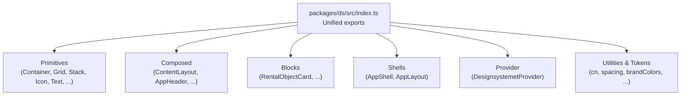
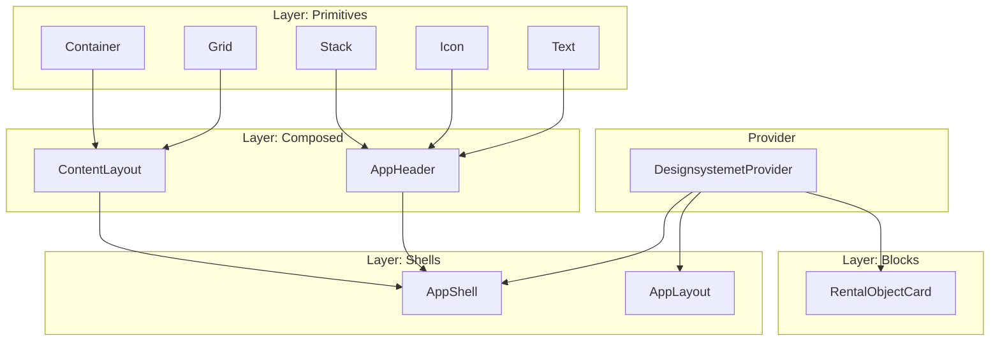
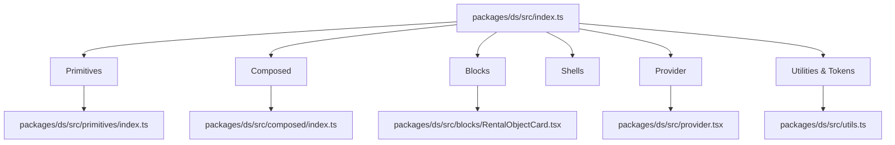

# Component API Reference

<cite>
**Referenced Files in This Document**
- [packages/ds/src/index.ts](file://packages/ds/src/index.ts)
- [packages/ds/src/provider.tsx](file://packages/ds/src/provider.tsx)
- [packages/ds/src/utils.ts](file://packages/ds/src/utils.ts)
- [packages/ds/src/primitives/index.ts](file://packages/ds/src/primitives/index.ts)
- [packages/ds/src/primitives/container.tsx](file://packages/ds/src/primitives/container.tsx)
- [packages/ds/src/primitives/grid.tsx](file://packages/ds/src/primitives/grid.tsx)
- [packages/ds/src/primitives/stack.tsx](file://packages/ds/src/primitives/stack.tsx)
- [packages/ds/src/primitives/icon.tsx](file://packages/ds/src/primitives/icon.tsx)
- [packages/ds/src/primitives/text.tsx](file://packages/ds/src/primitives/text.tsx)
- [packages/ds/src/composed/index.ts](file://packages/ds/src/composed/index.ts)
- [packages/ds/src/composed/content-layout.tsx](file://packages/ds/src/composed/content-layout.tsx)
- [packages/ds/src/composed/header.tsx](file://packages/ds/src/composed/header.tsx)
- [packages/ds/src/blocks/RentalObjectCard.tsx](file://packages/ds/src/blocks/RentalObjectCard.tsx)
- [packages/ds/src/types/filters.ts](file://packages/ds/src/types/filters.ts)
</cite>

## Table of Contents
1. [Introduction](#introduction)
2. [Project Structure](#project-structure)
3. [Core Components](#core-components)
4. [Architecture Overview](#architecture-overview)
5. [Detailed Component Analysis](#detailed-component-analysis)
6. [Dependency Analysis](#dependency-analysis)
7. [Performance Considerations](#performance-considerations)
8. [Troubleshooting Guide](#troubleshooting-guide)
9. [Conclusion](#conclusion)
10. [Appendices](#appendices)

## Introduction
This document provides a comprehensive component API reference for the Xala Design System. It catalogs all exported components, their TypeScript interfaces, default values, validation rules, lifecycle considerations, event handlers, slots/patterns, customization options, accessibility APIs, internationalization support, responsive design interfaces, extension patterns, and integration guidance. The design system is organized into layers:
- Primitives: Low-level building blocks (Container, Grid, Stack, Icon, Text, etc.)
- Composed: Mid-level components built from primitives (ContentLayout, AppHeader, etc.)
- Blocks: Business-focused components (RentalObjectCard, etc.)
- Shells: Application-level layouts (AppShell/AppLayout)
- Provider: Theming and runtime theme switching

## Project Structure
The design system exposes a unified entry point that re-exports components from Digdir Designsystemet and augments them with custom primitives, composed components, blocks, and providers. Providers and utilities are also exported for theme management and design tokens.

**Diagram sources**
- [packages/ds/src/index.ts](file://packages/ds/src/index.ts#L44-L596)

**Section sources**
- [packages/ds/src/index.ts](file://packages/ds/src/index.ts#L1-L596)

## Core Components
This section summarizes the primary categories and notable components, focusing on interfaces, defaults, and usage patterns.

- Provider
  - DesignsystemetProvider: Manages theme CSS injection, color scheme, size mode, and typography presets. Accepts theme, colorScheme, size, typography, and rootAs props. Applies data attributes to document/html for CSS targeting.
  - ThemeProvider/useTheme: Theme management utilities for consuming theme context.

- Utilities and Tokens
  - cn: Merges class names safely.
  - spacing, interactiveBackgrounds, badgeStyles, menuItemStyles, emptyStateStyles, buttonTextColors, logoStyles: Design tokens mapped to CSS custom properties.
  - brandColors and brandColorsCss: Brand color palette and CSS variable definitions.

- Primitives
  - Container: Layout container with max-width, fluid layout, padding, and responsive-like container features.
  - Grid: CSS Grid layout with columns, rows, gap, and optional responsive columns mapping.
  - Stack: Flex layout with direction, spacing, alignment, justification, and wrapping.
  - Icon: SVG wrapper with size and color props.
  - Text: Typography component with variant, size, weight, and color.

- Composed
  - ContentLayout: Page-level layout built on Container and Grid, with headerOffset and grid configuration.
  - AppHeader: Sticky header with logo, search, actions, skip link, and variant styling.

- Blocks
  - RentalObjectCard: Listing card with variants, images, badges, facilities, pricing, capacity, ratings, and action handlers.

- Types
  - Filters: ListingType, VenueType, PriceUnit, AvailabilityStatus, FilterOption, PriceRangeFilter, CapacityRangeFilter, RatingFilter, LocationFilter, FacilitiesFilter, DateTimeFilter, FilterState, FilterConfig, and mockFilterData.

**Section sources**
- [packages/ds/src/provider.tsx](file://packages/ds/src/provider.tsx#L1-L130)
- [packages/ds/src/utils.ts](file://packages/ds/src/utils.ts#L1-L181)
- [packages/ds/src/primitives/index.ts](file://packages/ds/src/primitives/index.ts#L1-L132)
- [packages/ds/src/composed/index.ts](file://packages/ds/src/composed/index.ts#L1-L184)
- [packages/ds/src/types/filters.ts](file://packages/ds/src/types/filters.ts#L1-L258)

## Architecture Overview
The design system follows a layered architecture with explicit separation of concerns:
- Primitives encapsulate low-level layout and presentation.
- Composed components assemble primitives into cohesive UI patterns.
- Blocks encapsulate business logic and domain-specific UI.
- Shells orchestrate application-level layouts.
- Provider manages theming and global state.

**Diagram sources**
- [packages/ds/src/index.ts](file://packages/ds/src/index.ts#L44-L596)
- [packages/ds/src/provider.tsx](file://packages/ds/src/provider.tsx#L1-L130)

## Detailed Component Analysis

### Provider: DesignsystemetProvider
- Purpose: Dynamically loads theme CSS via link elements, sets data attributes for color scheme, size, and typography, and wraps children with configurable root element.
- Props
  - children: React.ReactNode
  - theme?: ThemeId (default: DEFAULT_THEME)
  - colorScheme?: 'light' | 'dark' | 'auto' (default: 'auto')
  - size?: 'sm' | 'md' | 'lg' | 'auto' (default: 'auto')
  - typography?: 'primary' | 'secondary' (default: 'primary')
  - rootAs?: keyof JSX.IntrinsicElements (default: 'div')
- Lifecycle
  - On mount and when props change, ensures theme links are present and updates data attributes on document/html.
- Validation
  - colorScheme, size, typography are constrained enums.
  - rootAs must be a valid HTML element tag.
- Accessibility and Internationalization
  - No direct accessibility or i18n props; relies on theme CSS for accessible rendering.
- Customization
  - Theme switching without page reload; supports multiple CSS files per theme.
- Integration
  - Must be placed near application root; applications import styles once at entry point.

**Section sources**
- [packages/ds/src/provider.tsx](file://packages/ds/src/provider.tsx#L1-L130)

### Utilities and Tokens
- cn: Merges class names, filtering out falsy values.
- spacing: Tokenized spacing mapped to CSS variables.
- interactiveBackgrounds, badgeStyles, menuItemStyles, emptyStateStyles, buttonTextColors, logoStyles: Preset styles for common UI patterns.
- brandColors and brandColorsCss: Brand palette and CSS variable definitions for consistent theming.

**Section sources**
- [packages/ds/src/utils.ts](file://packages/ds/src/utils.ts#L1-L181)

### Primitives

#### Container
- Purpose: Consistent page/container layout with container-type and container-name for responsive behavior.
- Props
  - maxWidth?: string (default: '1440px')
  - fluid?: boolean (default: false)
  - padding?: string | number (default: 'var(--ds-spacing-8)')
  - px?: string | number
  - py?: string | number
  - Inherits HTML attributes
- Defaults and Validation
  - Defaults apply when unspecified; numeric padding converted to px.
- Accessibility and Internationalization
  - No direct accessibility or i18n props.
- Customization
  - Uses CSS variables for spacing and tokens; supports fluid layout toggle.

**Section sources**
- [packages/ds/src/primitives/container.tsx](file://packages/ds/src/primitives/container.tsx#L1-L79)

#### Grid
- Purpose: CSS Grid layout with flexible column/row configuration and gap controls.
- Props
  - columns?: string (default: '1fr')
  - rows?: string
  - gap?: string | number (default: 0)
  - gapX?: string | number
  - gapY?: string | number
  - responsive?: { sm, md, lg, xl } (object shape; implementation notes indicate responsive handling needs)
  - Inherits HTML attributes
- Defaults and Validation
  - Defaults apply; numeric gaps converted to px.
- Accessibility and Internationalization
  - No direct accessibility or i18n props.
- Customization
  - Supports responsive columns via object mapping.

**Section sources**
- [packages/ds/src/primitives/grid.tsx](file://packages/ds/src/primitives/grid.tsx#L1-L89)

#### Stack
- Purpose: Flexible stack layout (vertical/horizontal) with alignment, justification, and wrapping.
- Props
  - direction?: 'vertical' | 'horizontal' (default: 'vertical')
  - spacing?: string | number (default: 0)
  - align?: 'start' | 'center' | 'end' | 'stretch'
  - justify?: 'start' | 'center' | 'end' | 'between' | 'around' | 'evenly'
  - wrap?: boolean (default: false)
  - Inherits HTML attributes
- Defaults and Validation
  - Defaults apply; numeric spacing converted to px.
- Accessibility and Internationalization
  - No direct accessibility or i18n props.
- Customization
  - Wrapping enabled via wrap flag.

**Section sources**
- [packages/ds/src/primitives/stack.tsx](file://packages/ds/src/primitives/stack.tsx#L1-L76)

#### Icon
- Purpose: SVG icon wrapper with standardized size and color.
- Props
  - size?: number (default: 20)
  - color?: string (default: 'currentColor')
  - Inherits SVG attributes
- Defaults and Validation
  - Defaults apply; color defaults to currentColor.
- Accessibility and Internationalization
  - No direct accessibility or i18n props.
- Customization
  - Children define the icon path.

**Section sources**
- [packages/ds/src/primitives/icon.tsx](file://packages/ds/src/primitives/icon.tsx#L1-L44)

#### Text
- Purpose: Typography component with variant, size, weight, and color.
- Props
  - variant?: 'body' | 'subtitle' | 'caption' | 'overline' (default: 'body')
  - size?: 'xs' | 'sm' | 'md' | 'lg' | 'xl' (default: 'md')
  - weight?: 'normal' | 'medium' | 'semibold' | 'bold' (default: 'normal')
  - color?: string
  - Inherits HTML attributes
- Defaults and Validation
  - Defaults apply; variant maps to paragraph or span; sizes and weights map to design tokens.
- Accessibility and Internationalization
  - No direct accessibility or i18n props.
- Customization
  - Uses CSS variables for font sizes, line heights, and weights.

**Section sources**
- [packages/ds/src/primitives/text.tsx](file://packages/ds/src/primitives/text.tsx#L1-L89)

### Composed

#### ContentLayout
- Purpose: Page-level layout with optional grid configuration and header offset handling.
- Props
  - maxWidth?: string (default: '1440px')
  - padding?: string | number (default: '32px')
  - fluid?: boolean (default: false)
  - headerOffset?: 'none' | 'sm' | 'md' | 'lg' (default: 'none')
  - grid?: { columns?, gap?, responsive? }
  - Inherits HTML attributes
- Defaults and Validation
  - Defaults apply; headerOffset maps to tokenized spacing; grid columns default to '1fr'; gap defaults to 0.
- Accessibility and Internationalization
  - No direct accessibility or i18n props.
- Customization
  - Wraps children in Container; optionally renders Grid for internal layout.

**Section sources**
- [packages/ds/src/composed/content-layout.tsx](file://packages/ds/src/composed/content-layout.tsx#L1-L102)

#### AppHeader
- Purpose: Sticky application header with logo, search, actions, skip link, and variant styling.
- Props
  - logo?: React.ReactNode
  - search?: React.ReactNode
  - actions?: React.ReactNode
  - sticky?: boolean (default: true)
  - height?: string (default: '72px' via token)
  - showSkipLink?: boolean (default: true)
  - skipLinkTarget?: string (default: '#main')
  - skipLinkText?: string (default: 'Hopp til hovedinnhold')
  - variant?: 'surface' | 'background' | 'transparent' (default: 'surface')
  - Inherits HTML attributes
- Defaults and Validation
  - Defaults apply; variant maps to background tokens; skip link text localized in component.
- Accessibility and Internationalization
  - Skip link improves keyboard navigation; localized text provided.
- Customization
  - Uses CSS variables for shadows, borders, and transitions.

**Section sources**
- [packages/ds/src/composed/header.tsx](file://packages/ds/src/composed/header.tsx#L1-L184)

### Blocks

#### RentalObjectCard
- Purpose: Reusable card for displaying rental object information with grid and detailed variants.
- Props
  - id: string
  - name: string
  - type: string
  - listingType?: 'SPACE' | 'RESOURCE' | 'EVENT' | 'SERVICE' | 'VEHICLE' | 'OTHER'
  - location: string
  - description: string
  - image: string
  - facilities?: string[]
  - moreFacilities?: number
  - capacity?: number
  - price?: number
  - priceUnit?: string (default: 'time')
  - currency?: string (default: 'kr')
  - rating?: number
  - reviewCount?: number
  - available?: boolean (default: true)
  - onClick?: (id: string) => void
  - onFavorite?: (id: string) => void
  - onShare?: (id: string) => void
  - onClose?: () => void
  - isFavorited?: boolean (default: false)
  - className?: string
  - imageHeight?: number (default: 200)
  - variant?: 'grid' | 'detailed' (default: 'grid')
  - showRating?: boolean (default: false)
  - showPrice?: boolean (default: false)
  - showCapacity?: boolean (default: true)
  - showFacilities?: boolean (default: true)
  - showDescription?: boolean (default: true)
  - showLocation?: boolean (default: true)
  - showTypeBadge?: boolean (default: true)
  - showAvailabilityBadge?: boolean (default: true)
  - showGradientOverlay?: boolean (default: true)
  - showFavoriteButton?: boolean (default: true)
  - showShareButton?: boolean (default: true)
  - showListingType?: boolean (default: true)
  - maxFacilities?: number (default: 3)
- Defaults and Validation
  - Defaults apply across all boolean toggles and numeric values; variant determines rendering mode.
- Accessibility and Internationalization
  - Uses design tokens for contrast and accessible colors; localized labels for listing types and availability.
- Customization
  - Extensive visibility toggles and variant selection; supports custom class names.

**Section sources**
- [packages/ds/src/blocks/RentalObjectCard.tsx](file://packages/ds/src/blocks/RentalObjectCard.tsx#L1-L680)

### Types

#### Filters
- ListingType: 'SPACE' | 'RESOURCE' | 'EVENT' | 'SERVICE' | 'VEHICLE' | 'OTHER'
- VenueType: Specific venue subcategories
- PriceUnit: 'time' | 'dag' | 'uke' | 'måned' | 'person' | 'stk'
- AvailabilityStatus: 'available' | 'unavailable' | 'soon'
- FilterOption: { id, label, count? }
- PriceRangeFilter: { min?, max?, currency? }
- CapacityRangeFilter: { min?, max? }
- RatingFilter: { min? }
- LocationFilter: { locationId?, locationName?, radiusKm?, latitude?, longitude? }
- FacilitiesFilter: { facilityIds: string[] }
- DateTimeFilter: { startDate?, endDate? }
- FilterState: Aggregated filter state with optional values for each filter type
- FilterConfig: { id, label, type, options?, value?, onChange, isActive?, placeholder?, helpText? }
- mockFilterData: Generators for development data across filter types

**Section sources**
- [packages/ds/src/types/filters.ts](file://packages/ds/src/types/filters.ts#L1-L258)

## Dependency Analysis
The design system’s index file orchestrates exports across layers and utilities. Providers and utilities are centrally exposed for consistent usage across applications.

**Diagram sources**
- [packages/ds/src/index.ts](file://packages/ds/src/index.ts#L44-L596)
- [packages/ds/src/primitives/index.ts](file://packages/ds/src/primitives/index.ts#L1-L132)
- [packages/ds/src/composed/index.ts](file://packages/ds/src/composed/index.ts#L1-L184)
- [packages/ds/src/provider.tsx](file://packages/ds/src/provider.tsx#L1-L130)
- [packages/ds/src/utils.ts](file://packages/ds/src/utils.ts#L1-L181)
- [packages/ds/src/blocks/RentalObjectCard.tsx](file://packages/ds/src/blocks/RentalObjectCard.tsx#L1-L680)

**Section sources**
- [packages/ds/src/index.ts](file://packages/ds/src/index.ts#L44-L596)

## Performance Considerations
- Theme switching: Dynamic link injection avoids page reloads; ensure minimal re-renders by grouping provider props and avoiding frequent theme changes.
- Layout primitives: Container/Grid/Stack rely on CSS variables and container queries; prefer tokenized values for consistent performance.
- Icon and Text: Lightweight wrappers; avoid excessive nesting to minimize DOM depth.
- Blocks: RentalObjectCard uses lazy loading and conditional rendering; keep image dimensions optimized and limit unnecessary re-renders by memoizing props.

## Troubleshooting Guide
- Theme not applying
  - Ensure styles are imported once at the application entry point and that the provider is mounted early.
  - Verify theme identifiers and that getThemeUrls resolves to valid URLs.
- CSS conflicts
  - Provider removes old theme links before adding new ones; ensure only one provider instance is active.
- Layout issues
  - For Grid, confirm numeric gaps are converted to px; for Container, verify fluid vs. max-width behavior.
- Accessibility
  - AppHeader skip link requires focus management; ensure anchor target exists and visible only on focus.

**Section sources**
- [packages/ds/src/provider.tsx](file://packages/ds/src/provider.tsx#L73-L118)
- [packages/ds/src/composed/header.tsx](file://packages/ds/src/composed/header.tsx#L113-L126)

## Conclusion
The Xala Design System offers a structured, layered approach to building accessible, themeable, and maintainable user interfaces. Its primitives, composed components, blocks, and provider collectively support rapid development while preserving design consistency and extensibility. By leveraging the provided TypeScript interfaces, design tokens, and provider utilities, teams can compose robust experiences with predictable behavior and strong defaults.

## Appendices

### Component Composition Patterns
- Prefer composing primitives into composed components for layout and structure.
- Use blocks for domain-specific UI that integrates with business logic.
- Wrap application shells around composed and blocks to establish consistent navigation and headers.

### Prop Drilling Prevention
- Use the provider pattern for theme and global state.
- Leverage context-aware utilities (e.g., ThemeProvider/useTheme) to avoid passing props through multiple layers.

### Context Usage
- DesignsystemetProvider sets data attributes on document/html for CSS targeting; consume via CSS selectors rather than prop drilling.

### Accessibility API Specifications
- AppHeader includes a skip link for keyboard navigation.
- Components use design tokens for accessible colors and contrast.

### Internationalization Support
- Some components include localized strings (e.g., AppHeader skip link text); ensure locale-specific overrides where applicable.

### Responsive Design Interfaces
- Grid supports responsive columns via an object mapping; Container participates in container queries for adaptive layouts.

### Extension Patterns
- Extend primitives by composing them into new composed components.
- Build blocks for domain features and expose clear TypeScript interfaces for consumers.

### Custom Prop Validation
- Enum props (e.g., colorScheme, size, typography, variant) are constrained; validate against allowed values.
- Numeric props are sanitized to px strings where applicable.

### Integration with External Libraries
- Re-export of @digdir/designsystemet-react allows seamless integration with external components.
- Provider ensures theme CSS is injected without duplicating imports.