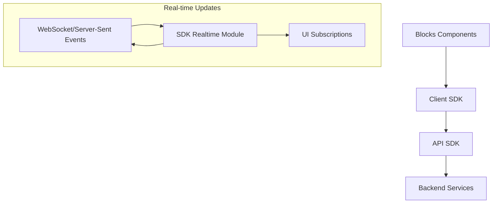
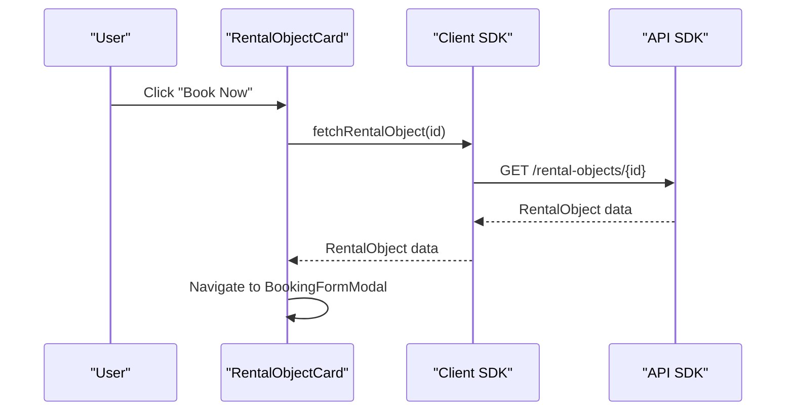
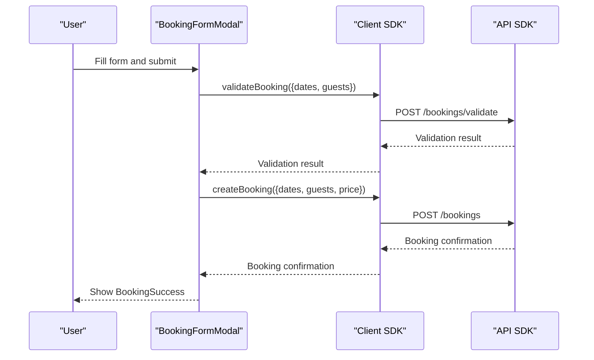
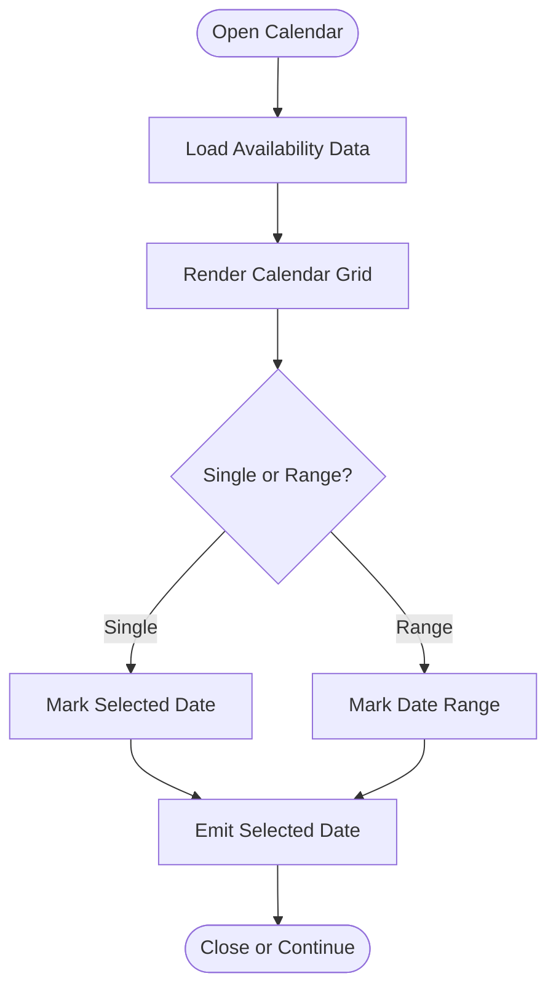

# Blocks Components

<cite>
**Referenced Files in This Document**
- [RentalObjectCard.tsx](file://packages/ds/src/blocks/RentalObjectCard.tsx)
- [BookingFormModal.tsx](file://packages/ds/src/blocks/BookingFormModal.tsx)
- [AvailabilityCalendar.tsx](file://packages/ds/src/blocks/AvailabilityCalendar.tsx)
- [StatusBadges.tsx](file://packages/ds/src/blocks/StatusBadges.tsx)
- [FavoriteButton.tsx](file://packages/ds/src/blocks/FavoriteButton.tsx)
- [ContactInfoCard.tsx](file://packages/ds/src/blocks/ContactInfoCard.tsx)
- [ImageGallery.tsx](file://packages/ds/src/blocks/ImageGallery.tsx)
- [PriceSummaryCard.tsx](file://packages/ds/src/blocks/PriceSummaryCard.tsx)
- [RentalObjectToolbar.tsx](file://packages/ds/src/blocks/RentalObjectToolbar.tsx)
- [RentalObjectTabs.tsx](file://packages/ds/src/blocks/RentalObjectTabs.tsx)
- [RentalObjectMap.tsx](file://packages/ds/src/blocks/RentalObjectMap.tsx)
- [NotificationCenter.tsx](file://packages/ds/src/blocks/NotificationCenter.tsx)
- [BookingSection.tsx](file://packages/ds/src/blocks/BookingSection.tsx)
- [BookingSuccess.tsx](file://packages/ds/src/blocks/BookingSuccess.tsx)
- [BookingStepper.tsx](file://packages/ds/src/composed/BookingStepper.tsx)
- [DashboardComponents.tsx](file://packages/ds/src/blocks/DashboardComponents.tsx)
- [AccessibilityDashboard.tsx](file://packages/ds/src/blocks/AccessibilityDashboard.tsx)
- [HelpGuidelinesTab.tsx](file://packages/ds/src/blocks/GuidelinesTab.tsx)
- [FAQTab.tsx](file://packages/ds/src/blocks/FAQTab.tsx)
- [ConsentPopup.tsx](file://packages/ds/src/blocks/gdpr/ConsentPopup.tsx)
- [ConsentSettings.tsx](file://packages/ds/src/blocks/gdpr/ConsentSettings.tsx)
- [DataSubjectRequestForm.tsx](file://packages/ds/src/blocks/gdpr/DataSubjectRequestForm.tsx)
- [index.ts](file://packages/ds/src/blocks/index.ts)
- [api.ts](file://apps/api/sdk/api.ts)
- [hooks.ts](file://apps/api/sdk/hooks.ts)
- [types.ts](file://apps/api/sdk/types.ts)
- [client-sdk index.ts](file://packages/client-sdk/src/index.ts)
- [client-sdk hooks.ts](file://packages/client-sdk/src/hooks/index.ts)
- [client-sdk services](file://packages/client-sdk/src/services/)
- [client-sdk types](file://packages/client-sdk/src/types/)
- [client-sdk realtime](file://packages/client-sdk/src/realtime/)
- [client-sdk providers](file://packages/client-sdk/src/providers/)
- [client-sdk utils](file://packages/client-sdk/src/utils/)
- [client-sdk query-keys](file://packages/client-sdk/src/query-keys/)
- [client-sdk transforms](file://packages/client-sdk/src/transforms/)
- [client-sdk core](file://packages/client-sdk/src/core/)
- [client-sdk dal](file://packages/client-sdk/src/dal/)
- [client-sdk localization](file://packages/client-sdk/src/localization/)
</cite>

## Table of Contents
1. [Introduction](#introduction)
2. [Project Structure](#project-structure)
3. [Core Components](#core-components)
4. [Architecture Overview](#architecture-overview)
5. [Detailed Component Analysis](#detailed-component-analysis)
6. [Dependency Analysis](#dependency-analysis)
7. [Performance Considerations](#performance-considerations)
8. [Troubleshooting Guide](#troubleshooting-guide)
9. [Conclusion](#conclusion)
10. [Appendices](#appendices)

## Introduction
This document provides comprehensive documentation for the blocks components that encapsulate business logic and complex functionality for specific use cases. It focuses on the following components:
- RentalObjectCard, BookingFormModal, AvailabilityCalendar, StatusBadges, FavoriteButton, ContactInfoCard, ImageGallery, PriceSummaryCard, RentalObjectToolbar, RentalObjectTabs, RentalObjectMap, NotificationCenter, BookingSection, BookingSuccess, BookingStepper, DashboardComponents, AccessibilityDashboard, HelpGuidelinesTab, FAQTab, and GDPR-related components.

The documentation explains how these components integrate with the client SDK, handle real-time updates, manage complex state, and provide complete user experiences. It also covers integration patterns with backend services, prop interfaces for business data, and examples of component composition in real applications.

## Project Structure
The blocks components are organized under the design system package and complemented by the client SDK and API SDK. The structure supports:
- Feature-specific blocks for rental objects, booking, notifications, dashboards, and GDPR.
- Composed components that orchestrate multiple blocks into cohesive workflows.
- Client SDK providing typed APIs, hooks, services, and real-time capabilities.

```mermaid
graph TB
subgraph "Design System Blocks"
ROCard["RentalObjectCard"]
BForm["BookingFormModal"]
AC["AvailabilityCalendar"]
SB["StatusBadges"]
FB["FavoriteButton"]
CIC["ContactInfoCard"]
IG["ImageGallery"]
PSC["PriceSummaryCard"]
ROT["RentalObjectToolbar"]
RTabs["RentalObjectTabs"]
ROM["RentalObjectMap"]
NC["NotificationCenter"]
BS["BookingSection"]
BSuccess["BookingSuccess"]
BSTEP["BookingStepper"]
DASH["DashboardComponents"]
ADASH["AccessibilityDashboard"]
FAQ["FAQTab"]
GDPR["GDPR Components"]
end
subgraph "Client SDK"
SDK_IDX["SDK Index"]
SDK_HOOKS["Hooks"]
SDK_SERVICES["Services"]
SDK_TYPES["Types"]
SDK_REALTIME["Realtime"]
SDK_PROVIDERS["Providers"]
SDK_UTILS["Utils"]
SDK_QUERY["Query Keys"]
SDK_TRANSFORMS["Transforms"]
SDK_CORE["Core"]
SDK_DAL["DAL"]
SDK_LOC["Localization"]
end
subgraph "API SDK"
API_IDX["API SDK Index"]
API_HOOKS["API Hooks"]
API_TYPES["API Types"]
end
ROCard --> SDK_SERVICES
BForm --> SDK_SERVICES
AC --> SDK_SERVICES
SB --> SDK_SERVICES
FB --> SDK_SERVICES
CIC --> SDK_SERVICES
IG --> SDK_SERVICES
PSC --> SDK_SERVICES
ROT --> SDK_SERVICES
RTabs --> SDK_SERVICES
ROM --> SDK_SERVICES
NC --> SDK_SERVICES
BS --> SDK_SERVICES
BSuccess --> SDK_SERVICES
BSTEP --> SDK_SERVICES
DASH --> SDK_SERVICES
ADASH --> SDK_SERVICES
FAQ --> SDK_SERVICES
GDPR --> SDK_SERVICES
SDK_IDX --> SDK_HOOKS
SDK_IDX --> SDK_SERVICES
SDK_IDX --> SDK_TYPES
SDK_IDX --> SDK_REALTIME
SDK_IDX --> SDK_PROVIDERS
SDK_IDX --> SDK_UTILS
SDK_IDX --> SDK_QUERY
SDK_IDX --> SDK_TRANSFORMS
SDK_IDX --> SDK_CORE
SDK_IDX --> SDK_DAL
SDK_IDX --> SDK_LOC
SDK_SERVICES --> API_IDX
SDK_SERVICES --> API_HOOKS
SDK_SERVICES --> API_TYPES
```

**Diagram sources**
- [index.ts](file://packages/ds/src/blocks/index.ts#L1-L200)
- [client-sdk index.ts](file://packages/client-sdk/src/index.ts#L1-L200)
- [client-sdk hooks.ts](file://packages/client-sdk/src/hooks/index.ts#L1-L200)
- [client-sdk services](file://packages/client-sdk/src/services/#L1-L200)
- [client-sdk types](file://packages/client-sdk/src/types/#L1-L200)
- [client-sdk realtime](file://packages/client-sdk/src/realtime/#L1-L200)
- [client-sdk providers](file://packages/client-sdk/src/providers/#L1-L200)
- [client-sdk utils](file://packages/client-sdk/src/utils/#L1-L200)
- [client-sdk query-keys](file://packages/client-sdk/src/query-keys/#L1-L200)
- [client-sdk transforms](file://packages/client-sdk/src/transforms/#L1-L200)
- [client-sdk core](file://packages/client-sdk/src/core/#L1-L200)
- [client-sdk dal](file://packages/client-sdk/src/dal/#L1-L200)
- [client-sdk localization](file://packages/client-sdk/src/localization/#L1-L200)
- [api.ts](file://apps/api/sdk/api.ts#L1-L200)
- [hooks.ts](file://apps/api/sdk/hooks.ts#L1-L200)
- [types.ts](file://apps/api/sdk/types.ts#L1-L200)

**Section sources**
- [index.ts](file://packages/ds/src/blocks/index.ts#L1-L200)

## Core Components
This section outlines the primary blocks and their responsibilities:
- RentalObjectCard: Displays rental object metadata, availability indicators, and actions.
- BookingFormModal: Presents booking form fields and submission controls.
- AvailabilityCalendar: Renders availability calendar and selection logic.
- StatusBadges: Visual status indicators for rental objects and bookings.
- FavoriteButton: Toggles favorite state for a rental object.
- ContactInfoCard: Shows contact details and communication channels.
- ImageGallery: Renders image galleries with navigation and thumbnails.
- PriceSummaryCard: Computes and displays pricing breakdown.
- RentalObjectToolbar: Provides navigation and actions within rental object views.
- RentalObjectTabs: Manages tabbed content for details, availability, and related sections.
- RentalObjectMap: Displays location and nearby points of interest.
- NotificationCenter: Aggregates and renders notifications with action links.
- BookingSection: Orchestrates booking workflow steps and state transitions.
- BookingSuccess: Confirms successful booking completion.
- BookingStepper: Guides users through multi-step booking process.
- DashboardComponents: Aggregates dashboard widgets and KPI cards.
- AccessibilityDashboard: Presents accessibility metrics and insights.
- HelpGuidelinesTab: Provides guidelines and support resources.
- FAQTab: Displays frequently asked questions and answers.
- GDPR Components: Consent management, settings, and data subject requests.

Integration highlights:
- All blocks rely on the client SDK for data fetching, mutations, and real-time updates.
- Backend integration is handled via API SDK endpoints exposed through SDK services.
- Real-time updates are supported through SDK’s real-time module.

**Section sources**
- [RentalObjectCard.tsx](file://packages/ds/src/blocks/RentalObjectCard.tsx#L1-L200)
- [BookingFormModal.tsx](file://packages/ds/src/blocks/BookingFormModal.tsx#L1-L200)
- [AvailabilityCalendar.tsx](file://packages/ds/src/blocks/AvailabilityCalendar.tsx#L1-L200)
- [StatusBadges.tsx](file://packages/ds/src/blocks/StatusBadges.tsx#L1-L200)
- [FavoriteButton.tsx](file://packages/ds/src/blocks/FavoriteButton.tsx#L1-L200)
- [ContactInfoCard.tsx](file://packages/ds/src/blocks/ContactInfoCard.tsx#L1-L200)
- [ImageGallery.tsx](file://packages/ds/src/blocks/ImageGallery.tsx#L1-L200)
- [PriceSummaryCard.tsx](file://packages/ds/src/blocks/PriceSummaryCard.tsx#L1-L200)
- [RentalObjectToolbar.tsx](file://packages/ds/src/blocks/RentalObjectToolbar.tsx#L1-L200)
- [RentalObjectTabs.tsx](file://packages/ds/src/blocks/RentalObjectTabs.tsx#L1-L200)
- [RentalObjectMap.tsx](file://packages/ds/src/blocks/RentalObjectMap.tsx#L1-L200)
- [NotificationCenter.tsx](file://packages/ds/src/blocks/NotificationCenter.tsx#L1-L200)
- [BookingSection.tsx](file://packages/ds/src/blocks/BookingSection.tsx#L1-L200)
- [BookingSuccess.tsx](file://packages/ds/src/blocks/BookingSuccess.tsx#L1-L200)
- [BookingStepper.tsx](file://packages/ds/src/composed/BookingStepper.tsx#L1-L200)
- [DashboardComponents.tsx](file://packages/ds/src/blocks/DashboardComponents.tsx#L1-L200)
- [AccessibilityDashboard.tsx](file://packages/ds/src/blocks/AccessibilityDashboard.tsx#L1-L200)
- [HelpGuidelinesTab.tsx](file://packages/ds/src/blocks/GuidelinesTab.tsx#L1-L200)
- [FAQTab.tsx](file://packages/ds/src/blocks/FAQTab.tsx#L1-L200)
- [ConsentPopup.tsx](file://packages/ds/src/blocks/gdpr/ConsentPopup.tsx#L1-L200)
- [ConsentSettings.tsx](file://packages/ds/src/blocks/gdpr/ConsentSettings.tsx#L1-L200)
- [DataSubjectRequestForm.tsx](file://packages/ds/src/blocks/gdpr/DataSubjectRequestForm.tsx#L1-L200)

## Architecture Overview
The blocks components follow a layered architecture:
- Presentation Layer: Blocks render UI and collect user interactions.
- Business Logic Layer: Blocks encapsulate use-case-specific logic (booking, availability, favorites).
- Integration Layer: Blocks use SDK hooks/services for data and real-time updates.
- Backend Layer: API SDK exposes endpoints consumed by SDK services.

**Diagram sources**
- [client-sdk realtime](file://packages/client-sdk/src/realtime/#L1-L200)
- [client-sdk hooks.ts](file://packages/client-sdk/src/hooks/index.ts#L1-L200)
- [api.ts](file://apps/api/sdk/api.ts#L1-L200)

## Detailed Component Analysis

### RentalObjectCard
- Purpose: Render rental object preview with key attributes and actions.
- Key responsibilities:
  - Display images, title, rating, price, and availability status.
  - Trigger navigation to detail page or initiate booking.
  - Integrate with favorites and notification systems.
- Integration pattern:
  - Uses SDK services for fetching rental object details and availability.
  - Leverages FavoriteButton for toggling favorites.
  - Emits events to NotificationCenter for user actions.
- Prop interfaces:
  - rentalObjectId: Identifier for the rental object.
  - onAction: Callback for user actions (e.g., view details, book now).
  - showFavorites?: Toggle favorite button visibility.
- Composition example:
  - Combined with AvailabilityCalendar to pre-check availability before booking.

**Diagram sources**
- [RentalObjectCard.tsx](file://packages/ds/src/blocks/RentalObjectCard.tsx#L1-L200)
- [client-sdk services](file://packages/client-sdk/src/services/#L1-L200)
- [api.ts](file://apps/api/sdk/api.ts#L1-L200)

**Section sources**
- [RentalObjectCard.tsx](file://packages/ds/src/blocks/RentalObjectCard.tsx#L1-L200)

### BookingFormModal
- Purpose: Present booking form fields and submission controls.
- Key responsibilities:
  - Collect guest details, dates, and preferences.
  - Validate inputs and compute total price.
  - Submit booking request and handle errors.
- Integration pattern:
  - Uses SDK services for availability checks and booking creation.
  - Integrates with PriceSummaryCard for dynamic pricing.
  - Triggers BookingSection for step navigation.
- Prop interfaces:
  - rentalObjectId: Target rental object identifier.
  - initialDates?: Preselected date range.
  - onSubmit: Callback after successful submission.
  - onCancel: Callback to dismiss modal.
- Composition example:
  - Embedded within RentalObjectCard flow; transitions to BookingStepper upon success.

**Diagram sources**
- [BookingFormModal.tsx](file://packages/ds/src/blocks/BookingFormModal.tsx#L1-L200)
- [client-sdk services](file://packages/client-sdk/src/services/#L1-L200)
- [api.ts](file://apps/api/sdk/api.ts#L1-L200)

**Section sources**
- [BookingFormModal.tsx](file://packages/ds/src/blocks/BookingFormModal.tsx#L1-L200)

### AvailabilityCalendar
- Purpose: Visualize and select availability periods.
- Key responsibilities:
  - Render monthly calendar with blocked/unavailable dates.
  - Support single-date and date-range selection.
  - Sync selection with BookingFormModal and PriceSummaryCard.
- Integration pattern:
  - Fetches availability via SDK services.
  - Emits selected date(s) to parent components.
- Prop interfaces:
  - mode: "single" or "range".
  - onDateChange: Callback receiving selected dates.
  - disabledDates?: List of unavailable dates.
- Composition example:
  - Used inside BookingFormModal and RentalObjectCard to pre-validate selections.

**Diagram sources**
- [AvailabilityCalendar.tsx](file://packages/ds/src/blocks/AvailabilityCalendar.tsx#L1-L200)

**Section sources**
- [AvailabilityCalendar.tsx](file://packages/ds/src/blocks/AvailabilityCalendar.tsx#L1-L200)

### StatusBadges
- Purpose: Display status indicators for rental objects and bookings.
- Key responsibilities:
  - Map internal statuses to user-friendly badges.
  - Support color-coded and localized labels.
- Integration pattern:
  - Consumed by RentalObjectCard, BookingSection, and NotificationCenter.
- Prop interfaces:
  - status: Internal status value.
  - variant?: Style variant (e.g., small, large).
- Composition example:
  - Integrated within RentalObjectCard to reflect availability and booking state.

**Section sources**
- [StatusBadges.tsx](file://packages/ds/src/blocks/StatusBadges.tsx#L1-L200)

### FavoriteButton
- Purpose: Toggle favorite state for a rental object.
- Key responsibilities:
  - Persist favorite preference for the current user.
  - Reflect state in UI immediately and sync with backend.
- Integration pattern:
  - Uses SDK services for adding/removing favorites.
  - Triggers real-time updates to keep UI consistent.
- Prop interfaces:
  - rentalObjectId: Target rental object identifier.
  - size?: Button size variant.
- Composition example:
  - Embedded in RentalObjectCard and ContactInfoCard.

**Section sources**
- [FavoriteButton.tsx](file://packages/ds/src/blocks/FavoriteButton.tsx#L1-L200)

### ContactInfoCard
- Purpose: Display contact details and communication channels.
- Key responsibilities:
  - Show owner/operator contact info.
  - Provide quick actions (e.g., message, call).
- Integration pattern:
  - Fetches contact data via SDK services.
  - Integrates with FavoriteButton for user convenience.
- Prop interfaces:
  - rentalObjectId: Identifier for associated rental object.
  - showActions?: Toggle action buttons visibility.
- Composition example:
  - Appears alongside ImageGallery and PriceSummaryCard in rental object details.

**Section sources**
- [ContactInfoCard.tsx](file://packages/ds/src/blocks/ContactInfoCard.tsx#L1-L200)

### ImageGallery
- Purpose: Render image galleries with navigation and thumbnails.
- Key responsibilities:
  - Display main image with thumbnail navigation.
  - Support fullscreen and accessibility features.
- Integration pattern:
  - Loads images from rental object data via SDK services.
- Prop interfaces:
  - images: Array of image URLs or metadata.
  - onImageChange?: Callback for selected image index.
- Composition example:
  - Used within RentalObjectCard and RentalObjectTabs for immersive previews.

**Section sources**
- [ImageGallery.tsx](file://packages/ds/src/blocks/ImageGallery.tsx#L1-L200)

### PriceSummaryCard
- Purpose: Compute and display pricing breakdown.
- Key responsibilities:
  - Calculate subtotal, taxes, fees, and total based on dates and rates.
  - Highlight promotional discounts or special offers.
- Integration pattern:
  - Uses SDK services for rate retrieval and availability checks.
  - Syncs with AvailabilityCalendar and BookingFormModal.
- Prop interfaces:
  - rentalObjectId: Associated rental object identifier.
  - dates: Selected date range.
  - guests?: Number of guests.
- Composition example:
  - Embedded in BookingFormModal and displayed before confirmation.

**Section sources**
- [PriceSummaryCard.tsx](file://packages/ds/src/blocks/PriceSummaryCard.tsx#L1-L200)

### RentalObjectToolbar
- Purpose: Provide navigation and actions within rental object views.
- Key responsibilities:
  - Offer quick access to tabs, share, and favorites.
  - Support responsive layout adjustments.
- Integration pattern:
  - Coordinates with RentalObjectTabs and RentalObjectMap.
- Prop interfaces:
  - activeTab?: Currently selected tab.
  - onTabChange: Callback for tab navigation.
  - actions?: Additional toolbar actions.
- Composition example:
  - Appears at the top of rental object detail pages.

**Section sources**
- [RentalObjectToolbar.tsx](file://packages/ds/src/blocks/RentalObjectToolbar.tsx#L1-L200)

### RentalObjectTabs
- Purpose: Manage tabbed content for details, availability, and related sections.
- Key responsibilities:
  - Switch between content panes (details, photos, reviews, map).
  - Maintain state across sessions.
- Integration pattern:
  - Drives by RentalObjectToolbar and RentalObjectMap.
- Prop interfaces:
  - activeTab?: Active tab identifier.
  - onTabChange: Callback for tab switching.
  - tabs: Array of tab configurations.
- Composition example:
  - Hosts ImageGallery, AvailabilityCalendar, and RentalObjectMap.

**Section sources**
- [RentalObjectTabs.tsx](file://packages/ds/src/blocks/RentalObjectTabs.tsx#L1-L200)

### RentalObjectMap
- Purpose: Display location and nearby points of interest.
- Key responsibilities:
  - Render map with markers and interactive controls.
  - Provide directions and local info.
- Integration pattern:
  - Uses SDK services for geolocation and POI queries.
- Prop interfaces:
  - coordinates: Latitude and longitude.
  - markers?: Additional POIs to display.
- Composition example:
  - Integrated within RentalObjectTabs for location context.

**Section sources**
- [RentalObjectMap.tsx](file://packages/ds/src/blocks/RentalObjectMap.tsx#L1-L200)

### NotificationCenter
- Purpose: Aggregate and render notifications with action links.
- Key responsibilities:
  - Fetch user notifications via SDK services.
  - Support real-time updates for new notifications.
- Integration pattern:
  - Uses SDK’s real-time module for live updates.
- Prop interfaces:
  - userId: Target user identifier.
  - onItemClick: Callback for notification actions.
- Composition example:
  - Appears as a bell icon in toolbar and expands to list notifications.

**Section sources**
- [NotificationCenter.tsx](file://packages/ds/src/blocks/NotificationCenter.tsx#L1-L200)

### BookingSection
- Purpose: Orchestrate booking workflow steps and state transitions.
- Key responsibilities:
  - Coordinate between BookingFormModal, AvailabilityCalendar, and PriceSummaryCard.
  - Manage step navigation and validation.
- Integration pattern:
  - Uses SDK services for booking lifecycle operations.
- Prop interfaces:
  - rentalObjectId: Target rental object identifier.
  - initialStep?: Starting step index.
  - onComplete: Callback after successful booking.
- Composition example:
  - Drives BookingStepper and navigates to BookingSuccess.

**Section sources**
- [BookingSection.tsx](file://packages/ds/src/blocks/BookingSection.tsx#L1-L200)

### BookingSuccess
- Purpose: Confirm successful booking completion.
- Key responsibilities:
  - Display booking reference, dates, and next steps.
  - Provide actions (e.g., email receipt, view details).
- Integration pattern:
  - Receives booking data from SDK services.
- Prop interfaces:
  - bookingId: Identifier for the confirmed booking.
  - onContinue: Callback to return to browsing.
- Composition example:
  - Final step in BookingSection and BookingStepper flows.

**Section sources**
- [BookingSuccess.tsx](file://packages/ds/src/blocks/BookingSuccess.tsx#L1-L200)

### BookingStepper
- Purpose: Guide users through multi-step booking process.
- Key responsibilities:
  - Define steps (e.g., dates, guests, review, confirm).
  - Validate each step before proceeding.
- Integration pattern:
  - Uses SDK services for data persistence and validation.
- Prop interfaces:
  - steps: Array of step configurations.
  - onStepComplete: Callback for each completed step.
  - onFinish: Callback after final step.
- Composition example:
  - Driven by BookingSection and embedded within BookingFormModal.

**Section sources**
- [BookingStepper.tsx](file://packages/ds/src/composed/BookingStepper.tsx#L1-L200)

### DashboardComponents
- Purpose: Aggregate dashboard widgets and KPI cards.
- Key responsibilities:
  - Render charts, summaries, and actionable insights.
  - Support filtering and real-time updates.
- Integration pattern:
  - Uses SDK services for metrics retrieval.
- Prop interfaces:
  - filters?: Dashboard filters (date range, category).
  - onFilterChange: Callback for filter updates.
- Composition example:
  - Used in admin and analytics views.

**Section sources**
- [DashboardComponents.tsx](file://packages/ds/src/blocks/DashboardComponents.tsx#L1-L200)

### AccessibilityDashboard
- Purpose: Present accessibility metrics and insights.
- Key responsibilities:
  - Visualize accessibility scores and remediation suggestions.
  - Provide audit trails and improvement recommendations.
- Integration pattern:
  - Uses SDK services for accessibility data.
- Prop interfaces:
  - reportId?: Identifier for the accessibility report.
  - onAction: Callback for remediation actions.
- Composition example:
  - Integrated within DashboardComponents for comprehensive reporting.

**Section sources**
- [AccessibilityDashboard.tsx](file://packages/ds/src/blocks/AccessibilityDashboard.tsx#L1-L200)

### HelpGuidelinesTab and FAQTab
- Purpose: Provide guidelines and frequently asked questions.
- Key responsibilities:
  - Display structured help content with searchable categories.
  - Link to external resources and support channels.
- Integration pattern:
  - Content sourced from SDK localization and documentation services.
- Prop interfaces:
  - locale?: Language variant for content.
  - onLinkClick: Callback for external links.
- Composition example:
  - Included in HelpPanel and rental object detail pages.

**Section sources**
- [HelpGuidelinesTab.tsx](file://packages/ds/src/blocks/GuidelinesTab.tsx#L1-L200)
- [FAQTab.tsx](file://packages/ds/src/blocks/FAQTab.tsx#L1-L200)

### GDPR Components
- ConsentPopup: Prompt users to accept or adjust consent preferences.
- ConsentSettings: Allow users to manage consent preferences post-initialization.
- DataSubjectRequestForm: Enable users to submit data subject access requests.
- Integration pattern:
  - Use SDK services for consent persistence and request handling.
  - Ensure compliance with real-time updates and audit logs.
- Prop interfaces:
  - consentPreferences?: Current consent state.
  - onSubmit: Callback after consent submission.
- Composition example:
  - Triggered by NotificationCenter or integrated into user profile flows.

**Section sources**
- [ConsentPopup.tsx](file://packages/ds/src/blocks/gdpr/ConsentPopup.tsx#L1-L200)
- [ConsentSettings.tsx](file://packages/ds/src/blocks/gdpr/ConsentSettings.tsx#L1-L200)
- [DataSubjectRequestForm.tsx](file://packages/ds/src/blocks/gdpr/DataSubjectRequestForm.tsx#L1-L200)

## Dependency Analysis
The blocks components depend on the client SDK for data and real-time capabilities, while the client SDK depends on the API SDK for backend integration. The dependency graph below illustrates these relationships.

```mermaid
graph TB
subgraph "Blocks"
B1["RentalObjectCard"]
B2["BookingFormModal"]
B3["AvailabilityCalendar"]
B4["StatusBadges"]
B5["FavoriteButton"]
B6["ContactInfoCard"]
B7["ImageGallery"]
B8["PriceSummaryCard"]
B9["RentalObjectToolbar"]
B10["RentalObjectTabs"]
B11["RentalObjectMap"]
B12["NotificationCenter"]
B13["BookingSection"]
B14["BookingSuccess"]
B15["BookingStepper"]
B16["DashboardComponents"]
B17["AccessibilityDashboard"]
B18["HelpGuidelinesTab"]
B19["FAQTab"]
B20["GDPR Components"]
end
subgraph "Client SDK"
S1["SDK Index"]
S2["Hooks"]
S3["Services"]
S4["Types"]
S5["Realtime"]
S6["Providers"]
S7["Utils"]
S8["Query Keys"]
S9["Transforms"]
S10["Core"]
S11["DAL"]
S12["Localization"]
end
subgraph "API SDK"
A1["API Index"]
A2["Hooks"]
A3["Types"]
end
B1 --> S3
B2 --> S3
B3 --> S3
B4 --> S3
B5 --> S3
B6 --> S3
B7 --> S3
B8 --> S3
B9 --> S3
B10 --> S3
B11 --> S3
B12 --> S3
B13 --> S3
B14 --> S3
B15 --> S3
B16 --> S3
B17 --> S3
B18 --> S3
B19 --> S3
B20 --> S3
S1 --> S2
S1 --> S3
S1 --> S4
S1 --> S5
S1 --> S6
S1 --> S7
S1 --> S8
S1 --> S9
S1 --> S10
S1 --> S11
S1 --> S12
S3 --> A1
S3 --> A2
S3 --> A3
```

**Diagram sources**
- [index.ts](file://packages/ds/src/blocks/index.ts#L1-L200)
- [client-sdk index.ts](file://packages/client-sdk/src/index.ts#L1-L200)
- [client-sdk hooks.ts](file://packages/client-sdk/src/hooks/index.ts#L1-L200)
- [client-sdk services](file://packages/client-sdk/src/services/#L1-L200)
- [client-sdk types](file://packages/client-sdk/src/types/#L1-L200)
- [client-sdk realtime](file://packages/client-sdk/src/realtime/#L1-L200)
- [client-sdk providers](file://packages/client-sdk/src/providers/#L1-L200)
- [client-sdk utils](file://packages/client-sdk/src/utils/#L1-L200)
- [client-sdk query-keys](file://packages/client-sdk/src/query-keys/#L1-L200)
- [client-sdk transforms](file://packages/client-sdk/src/transforms/#L1-L200)
- [client-sdk core](file://packages/client-sdk/src/core/#L1-L200)
- [client-sdk dal](file://packages/client-sdk/src/dal/#L1-L200)
- [client-sdk localization](file://packages/client-sdk/src/localization/#L1-L200)
- [api.ts](file://apps/api/sdk/api.ts#L1-L200)
- [hooks.ts](file://apps/api/sdk/hooks.ts#L1-L200)
- [types.ts](file://apps/api/sdk/types.ts#L1-L200)

**Section sources**
- [index.ts](file://packages/ds/src/blocks/index.ts#L1-L200)
- [client-sdk index.ts](file://packages/client-sdk/src/index.ts#L1-L200)
- [api.ts](file://apps/api/sdk/api.ts#L1-L200)

## Performance Considerations
- Lazy loading: Defer heavy components (e.g., maps, galleries) until visible.
- Virtualization: Use virtualized lists for long tab content or notification streams.
- Memoization: Cache computed prices and availability to avoid redundant calculations.
- Debounced inputs: Debounce search and filter operations in tabs and dashboards.
- Real-time batching: Group frequent updates to reduce re-renders.
- Image optimization: Use responsive images and lazy loading in galleries.

## Troubleshooting Guide
Common issues and resolutions:
- Booking validation failures:
  - Verify availability via AvailabilityCalendar before submission.
  - Check PriceSummaryCard totals and ensure no hidden fees.
- Real-time update delays:
  - Confirm SDK real-time connection and subscription setup.
  - Re-fetch data using SDK hooks if stale.
- Favorites not persisting:
  - Ensure user session is authenticated.
  - Retry FavoriteButton toggle after network errors.
- Map rendering problems:
  - Validate coordinates and network connectivity.
  - Use fallback UI if third-party maps fail.
- GDPR consent not updating:
  - Refresh consent preferences in ConsentSettings.
  - Confirm backend acceptance of consent changes.

**Section sources**
- [client-sdk realtime](file://packages/client-sdk/src/realtime/#L1-L200)
- [client-sdk hooks.ts](file://packages/client-sdk/src/hooks/index.ts#L1-L200)

## Conclusion
The blocks components provide a cohesive, reusable foundation for building complex rental object and booking experiences. By integrating tightly with the client SDK and leveraging real-time capabilities, they deliver responsive, accessible, and compliant user interfaces. Their modular design enables flexible composition and seamless alignment with backend services through the API SDK.

## Appendices
- Integration patterns summary:
  - Use SDK services for all data operations.
  - Employ SDK hooks for reactive state management.
  - Utilize SDK real-time module for live updates.
  - Apply SDK localization for multi-language support.
- Prop interface guidelines:
  - Keep props minimal and focused on use-case needs.
  - Provide callbacks for composition flexibility.
  - Use enums or unions for constrained values.
- Composition examples:
  - RentalObjectCard + AvailabilityCalendar + BookingFormModal + BookingStepper + BookingSuccess.
  - DashboardComponents + AccessibilityDashboard for comprehensive reporting.
  - HelpGuidelinesTab + FAQTab for user support.