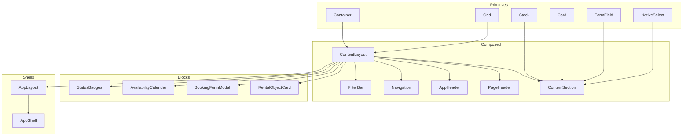
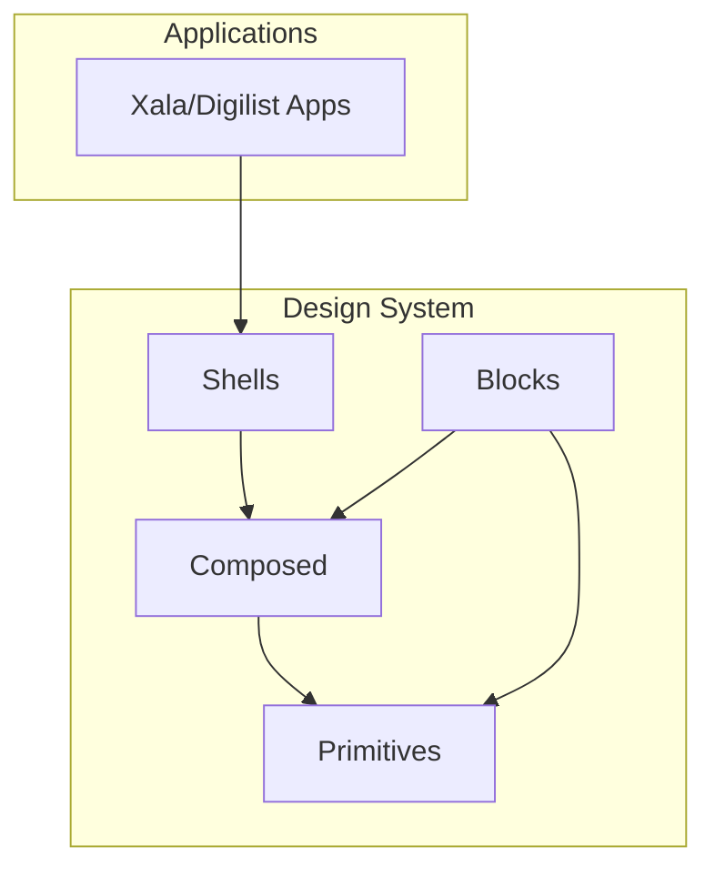
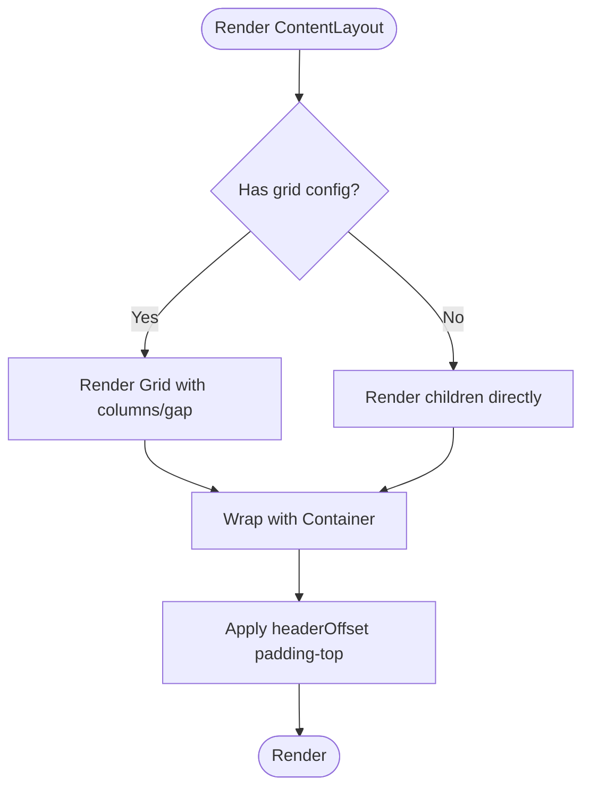
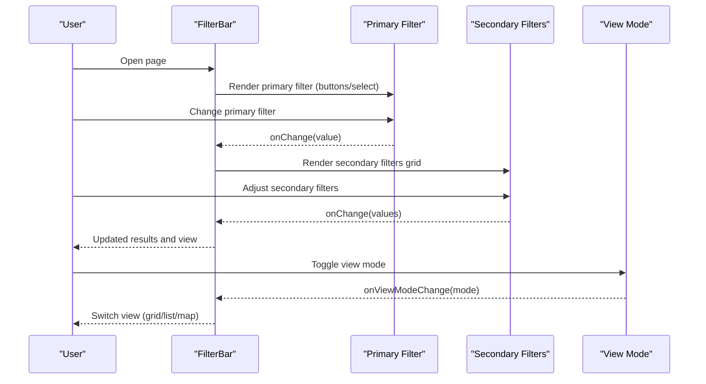
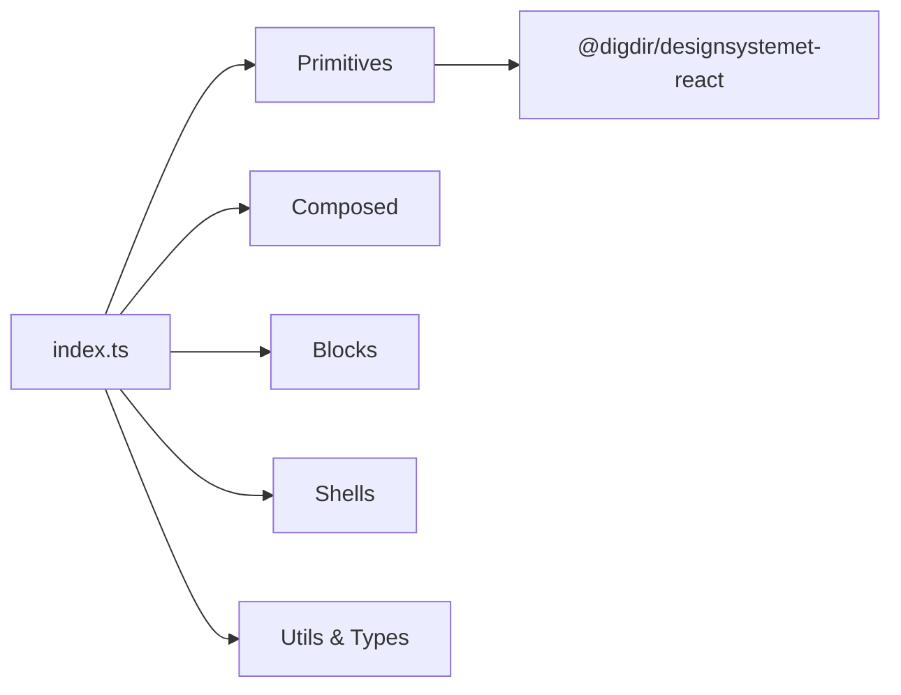

# Component Library

<cite>
**Referenced Files in This Document**
- [index.ts](file://packages/ds/src/index.ts)
- [STRUCTURE.md](file://packages/ds/STRUCTURE.md)
- [container.tsx](file://packages/ds/src/primitives/container.tsx)
- [grid.tsx](file://packages/ds/src/primitives/grid.tsx)
- [stack.tsx](file://packages/ds/src/primitives/stack.tsx)
- [card.tsx](file://packages/ds/src/primitives/card.tsx)
- [FormField.tsx](file://packages/ds/src/primitives/FormField.tsx)
- [NativeSelect.tsx](file://packages/ds/src/primitives/NativeSelect.tsx)
- [content-layout.tsx](file://packages/ds/src/composed/content-layout.tsx)
- [content-section.tsx](file://packages/ds/src/composed/content-section.tsx)
- [page-header.tsx](file://packages/ds/src/composed/page-header.tsx)
- [header.tsx](file://packages/ds/src/composed/header.tsx)
- [navigation.tsx](file://packages/ds/src/composed/navigation.tsx)
- [filter-bar.tsx](file://packages/ds/src/composed/filter-bar.tsx)
- [RentalObjectCard.tsx](file://packages/ds/src/blocks/RentalObjectCard.tsx)
- [BookingFormModal.tsx](file://packages/ds/src/blocks/BookingFormModal.tsx)
- [AvailabilityCalendar.tsx](file://packages/ds/src/blocks/AvailabilityCalendar.tsx)
- [StatusBadges.tsx](file://packages/ds/src/blocks/StatusBadges.tsx)
- [AppLayout.tsx](file://packages/ds/src/shells/AppLayout.tsx)
- [app-shell.tsx](file://packages/ds/src/shells/app-shell.tsx)
</cite>

## Table of Contents
1. [Introduction](#introduction)
2. [Project Structure](#project-structure)
3. [Core Components](#core-components)
4. [Architecture Overview](#architecture-overview)
5. [Detailed Component Analysis](#detailed-component-analysis)
6. [Dependency Analysis](#dependency-analysis)
7. [Performance Considerations](#performance-considerations)
8. [Troubleshooting Guide](#troubleshooting-guide)
9. [Conclusion](#conclusion)
10. [Appendices](#appendices)

## Introduction
This document describes the Xala Design System component library, focusing on the four-layer hierarchy:
- Primitives: Low-level layout and form building blocks
- Composed: Mid-level components built from primitives
- Blocks: Business logic components built from composed components
- Shells: Application-level layouts

It documents component props, variants, composition patterns, styling customization, accessibility features, and practical usage across Xala/Digilist applications.

## Project Structure
The design system package organizes components by layer and re-exports the Digdir Designsystemet React primitives. It also exposes utilities, theme management, and type-safe APIs.

**Diagram sources**
- [index.ts](file://packages/ds/src/index.ts#L44-L596)
- [STRUCTURE.md](file://packages/ds/STRUCTURE.md#L1-L154)

**Section sources**
- [STRUCTURE.md](file://packages/ds/STRUCTURE.md#L1-L154)
- [index.ts](file://packages/ds/src/index.ts#L44-L596)

## Core Components
This section summarizes the primitive components and their responsibilities.

- Container: Provides max-width, padding, fluid layout, and responsive container tokens.
- Grid: CSS Grid with columns, rows, and gap controls.
- Stack: Flexbox stack with direction, alignment, justification, and wrapping.
- Card: Surface container with default/outlined/elevated variants.
- FormField: Label, description, error, and child layout wrapper.
- NativeSelect: Styled native select with label, description, and error.

Key characteristics:
- All components accept className and style props for customization.
- Forward refs are supported where applicable.
- TypeScript interfaces define props and variants.

**Section sources**
- [container.tsx](file://packages/ds/src/primitives/container.tsx#L10-L79)
- [grid.tsx](file://packages/ds/src/primitives/grid.tsx#L10-L89)
- [stack.tsx](file://packages/ds/src/primitives/stack.tsx#L10-L76)
- [card.tsx](file://packages/ds/src/primitives/card.tsx#L10-L60)
- [FormField.tsx](file://packages/ds/src/primitives/FormField.tsx#L8-L61)
- [NativeSelect.tsx](file://packages/ds/src/primitives/NativeSelect.tsx#L8-L86)

## Architecture Overview
The design system follows a layered architecture:
- Primitives encapsulate low-level layout and form concerns.
- Composed components assemble primitives into cohesive UI patterns.
- Blocks encapsulate business logic and domain-specific UI.
- Shells provide application-level scaffolding.

**Diagram sources**
- [STRUCTURE.md](file://packages/ds/STRUCTURE.md#L38-L101)
- [index.ts](file://packages/ds/src/index.ts#L44-L596)

## Detailed Component Analysis

### Primitives Layer

#### Container
- Purpose: Consistent page/container width and padding with fluid override.
- Props: maxWidth, fluid, padding, px, py.
- Variants: None (visual via tokens).
- Accessibility: Inherits from HTML div; ensure semantic headings inside.

**Section sources**
- [container.tsx](file://packages/ds/src/primitives/container.tsx#L10-L79)

#### Grid
- Purpose: CSS Grid layout with columns/rows and gap controls.
- Props: columns, rows, gap, gapX, gapY, responsive (object shape).
- Variants: None (visual via tokens).
- Accessibility: Use semantic markup for content.

**Section sources**
- [grid.tsx](file://packages/ds/src/primitives/grid.tsx#L10-L89)

#### Stack
- Purpose: Flexbox stack for vertical/horizontal layouts with alignment and wrapping.
- Props: direction, spacing, align, justify, wrap.
- Variants: None (visual via tokens).
- Accessibility: Maintain focus order and keyboard navigation.

**Section sources**
- [stack.tsx](file://packages/ds/src/primitives/stack.tsx#L10-L76)

#### Card
- Purpose: Surface container with variant styling.
- Props: variant ('default' | 'outlined' | 'elevated').
- Variants: Default, outlined, elevated.
- Accessibility: Ensure sufficient contrast and readable text.

**Section sources**
- [card.tsx](file://packages/ds/src/primitives/card.tsx#L10-L60)

#### FormField
- Purpose: Wraps form controls with label, description, and error messaging.
- Props: label, required, error, description, children, className.
- Variants: None (visual via tokens).
- Accessibility: Associate labels with inputs; announce errors.

**Section sources**
- [FormField.tsx](file://packages/ds/src/primitives/FormField.tsx#L8-L61)

#### NativeSelect
- Purpose: Styled native select with label, description, and error.
- Props: label, error, description, plus standard select attributes.
- Variants: None (visual via tokens).
- Accessibility: Use aria-invalid when error is present.

**Section sources**
- [NativeSelect.tsx](file://packages/ds/src/primitives/NativeSelect.tsx#L8-L86)

### Composed Layer

#### ContentLayout
- Purpose: Page-level layout with optional grid and header offset compensation.
- Props: maxWidth, padding, fluid, headerOffset, grid (columns, gap, responsive).
- Composition: Uses Container and Grid.
- Accessibility: Ensure main landmark id is present.

**Diagram sources**
- [content-layout.tsx](file://packages/ds/src/composed/content-layout.tsx#L50-L99)

**Section sources**
- [content-layout.tsx](file://packages/ds/src/composed/content-layout.tsx#L10-L102)

#### ContentSection
- Purpose: Section wrapper with title/subtitle, optional Fieldset, and content stack.
- Props: title, subtitle, fieldset, spacing, level, direction, contentSpacing.
- Composition: Uses Stack and Heading/Fieldset.
- Accessibility: Heading level selection affects document outline.

**Section sources**
- [content-section.tsx](file://packages/ds/src/composed/content-section.tsx#L11-L117)

#### PageHeader
- Purpose: Page header with title, subtitle, actions, optional breadcrumb, and border.
- Props: title, subtitle, actions, breadcrumb, bordered, level.
- Composition: Uses Heading.
- Accessibility: Clear hierarchy and action affordances.

**Section sources**
- [page-header.tsx](file://packages/ds/src/composed/page-header.tsx#L10-L95)

#### AppHeader
- Purpose: Sticky header with logo, search, actions, skip link, and variant background.
- Props: logo, search, actions, sticky, height, showSkipLink, skipLinkTarget, skipLinkText, variant.
- Composition: Uses Container.
- Accessibility: Skip link visible on focus; sticky header shadow for contrast.

**Section sources**
- [header.tsx](file://packages/ds/src/composed/header.tsx#L12-L184)

#### Navigation
- Purpose: Horizontal navigation with spacing.
- Props: children, spacing.
- Composition: Styled anchor links with active state.
- Accessibility: Keyboard navigation and focus management.

**Section sources**
- [navigation.tsx](file://packages/ds/src/composed/navigation.tsx#L10-L82)

#### FilterBar
- Purpose: Horizontal filter bar with primary listing-type filter and secondary filters; view mode toggles.
- Props: primaryFilter (value, options, onChange, label), filters (FilterConfig[]), resultsCount, resultsLabel, viewMode, onViewModeChange, spacing, showPrimaryAsButtons.
- Composition: Uses Grid, Stack, Button, Select; icons included.
- Accessibility: Buttons and selects must be labeled; view mode toggles should announce changes.

**Diagram sources**
- [filter-bar.tsx](file://packages/ds/src/composed/filter-bar.tsx#L69-L295)

**Section sources**
- [filter-bar.tsx](file://packages/ds/src/composed/filter-bar.tsx#L14-L295)

### Blocks Layer

#### RentalObjectCard
- Purpose: Displays rental object with key facts, pricing preview, and actions.
- Props: Variant and listing detail props (from block types).
- Composition: Uses blocks and primitives for layout and badges.
- Accessibility: Ensure image alt text and actionable elements are announced.

**Section sources**
- [index.ts](file://packages/ds/src/index.ts#L308-L390)

#### BookingFormModal
- Purpose: Modal for booking form steps with validation and submission.
- Props: Modal and booking engine props (from block types).
- Composition: Integrates with booking engine and form components.
- Accessibility: Focus trap, escape to close, and modal semantics.

**Section sources**
- [index.ts](file://packages/ds/src/index.ts#L308-L390)

#### AvailabilityCalendar
- Purpose: Calendar for selecting availability slots with event indicators.
- Props: Availability calendar props (from block types).
- Composition: Renders date/time selections and slot statuses.
- Accessibility: Keyboard navigation and screen reader labels.

**Section sources**
- [index.ts](file://packages/ds/src/index.ts#L308-L390)

#### StatusBadges
- Purpose: Status indicators for various entities (booking, payment, user, etc.).
- Props: Configurable badge props and status configs.
- Composition: Uses shared status badge components.
- Accessibility: Color-independent status cues.

**Section sources**
- [index.ts](file://packages/ds/src/index.ts#L308-L390)

### Shells Layer

#### AppLayout
- Purpose: Flexible application layout with sidebar/header/content areas.
- Props: Layout configuration and children.
- Composition: Accepts Sidebar/Header as props; integrates with composed components.
- Accessibility: Manage focus and landmarks.

**Section sources**
- [index.ts](file://packages/ds/src/index.ts#L68-L70)
- [STRUCTURE.md](file://packages/ds/STRUCTURE.md#L29-L32)

#### AppShell
- Purpose: Complete application shell with header/footer scaffolding.
- Props: Shell props (from shell types).
- Composition: Built from blocks and composed components.
- Accessibility: Landmark regions and focus management.

**Section sources**
- [index.ts](file://packages/ds/src/index.ts#L68-L70)
- [STRUCTURE.md](file://packages/ds/STRUCTURE.md#L29-L32)

## Dependency Analysis
The design system exports a consolidated index that:
- Re-exports all Digdir primitives
- Exposes provider/theme utilities
- Groups exports by layer: Shells, Composed, Pages, Primitives, Blocks
- Provides types for all components and utilities

**Diagram sources**
- [index.ts](file://packages/ds/src/index.ts#L44-L596)

**Section sources**
- [index.ts](file://packages/ds/src/index.ts#L44-L596)

## Performance Considerations
- Prefer primitives for layout to minimize abstraction overhead.
- Use Grid and Stack for flexible layouts; avoid deep nesting of heavy components.
- Memoize expensive computations in composed components (e.g., filter lists).
- Lazy-load blocks that are not immediately visible (e.g., modals, calendars).
- Keep className/style usage minimal; rely on tokens for consistent rendering.

## Troubleshooting Guide
- Missing CSS: Applications must import the design system styles once at the entry point to ensure theme switching and avoid duplication.
- Accessibility issues: Ensure labels, aria attributes, and keyboard navigation are properly set on form controls and interactive elements.
- Prop mismatches: Verify prop types for composed and blocks components; use exported types to avoid runtime errors.
- Theming: Use ThemeProvider and tokens consistently across components.

**Section sources**
- [index.ts](file://packages/ds/src/index.ts#L589-L596)

## Conclusion
The Xala Design System provides a structured, composable component library that scales from low-level primitives to application-level shells. By following the documented patterns, props, and accessibility guidelines, teams can build consistent, maintainable UI across Xala/Digilist applications.

## Appendices

### Practical Examples and Integration Patterns
- Shell + Layout: Wrap pages with AppShell and AppLayout to establish global header, sidebar, and content area.
- Page Structure: Use ContentLayout for page-level content, ContentSection for grouped content, and PageHeader for titles and actions.
- Filtering: Integrate FilterBar with primary listing-type filter and secondary filters; connect view mode toggles to grid/list/map rendering.
- Forms: Wrap inputs with FormField and NativeSelect for consistent labeling, descriptions, and error handling.
- Business Logic: Compose blocks like RentalObjectCard, BookingFormModal, AvailabilityCalendar, and StatusBadges to deliver domain features.

[No sources needed since this section aggregates usage patterns without analyzing specific files]