# Composed Components

<cite>
**Referenced Files in This Document**
- [packages/ds/src/index.ts](file://packages/ds/src/index.ts)
- [packages/ds/src/composed/content-layout.tsx](file://packages/ds/src/composed/content-layout.tsx)
- [packages/ds/src/composed/content-section.tsx](file://packages/ds/src/composed/content-section.tsx)
- [packages/ds/src/composed/page-header.tsx](file://packages/ds/src/composed/page-header.tsx)
- [packages/ds/src/composed/header.tsx](file://packages/ds/src/composed/header.tsx)
- [packages/ds/src/composed/navigation.tsx](file://packages/ds/src/composed/navigation.tsx)
- [packages/ds/src/composed/filter-bar.tsx](file://packages/ds/src/composed/filter-bar.tsx)
- [packages/ds/src/composed/breadcrumb.tsx](file://packages/ds/src/composed/breadcrumb.tsx)
- [packages/ds/src/composed/dialogs.tsx](file://packages/ds/src/composed/dialogs.tsx)
- [packages/ds/src/composed/FormActions.tsx](file://packages/ds/src/composed/FormActions.tsx)
- [packages/ds/src/composed/LoadingFallback.tsx](file://packages/ds/src/composed/LoadingFallback.tsx)
- [packages/ds/src/composed/skip-links.tsx](file://packages/ds/src/composed/skip-links.tsx)
- [packages/ds/src/composed/header-parts.tsx](file://packages/ds/src/composed/header-parts.tsx)
- [packages/ds/src/primitives/index.ts](file://packages/ds/src/primitives/index.ts)
</cite>

## Table of Contents
1. [Introduction](#introduction)
2. [Project Structure](#project-structure)
3. [Core Components](#core-components)
4. [Architecture Overview](#architecture-overview)
5. [Detailed Component Analysis](#detailed-component-analysis)
6. [Dependency Analysis](#dependency-analysis)
7. [Performance Considerations](#performance-considerations)
8. [Troubleshooting Guide](#troubleshooting-guide)
9. [Conclusion](#conclusion)

## Introduction
This document explains the composed components that build upon primitive elements to form cohesive UI patterns. It focuses on ContentLayout, ContentSection, PageHeader, Header, Navigation, FilterBar, Breadcrumb, Dialogs, FormActions, LoadingFallback, and SkipLinks. Each component demonstrates how primitives are combined into higher-level patterns, how props inherit from underlying primitives, and how slots enable flexible composition. Integration examples with application layouts are included, along with customization options, usage scenarios, and accessibility considerations.

## Project Structure
The design system exposes a layered structure:
- Primitives: Low-level building blocks (layout, form controls, typography, icons)
- Composed: Mid-level components built from primitives
- Blocks: Business logic components built from composed components
- Shells: Application-level layouts built from blocks and composed components

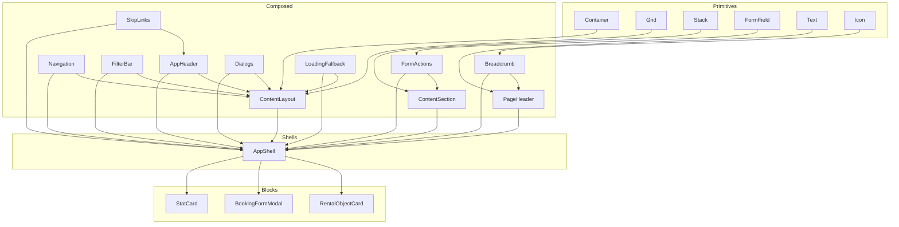

**Diagram sources**
- [packages/ds/src/index.ts](file://packages/ds/src/index.ts#L68-L114)
- [packages/ds/src/primitives/index.ts](file://packages/ds/src/primitives/index.ts#L1-L300)

**Section sources**
- [packages/ds/src/index.ts](file://packages/ds/src/index.ts#L6-L42)

## Core Components
This section introduces the core composed components and their primary responsibilities:
- ContentLayout: High-level page content container with optional grid and header offset support
- ContentSection: Section wrapper with title/subtitle, spacing, and stacked content
- PageHeader: Page-level header with title, subtitle, actions, and optional border
- AppHeader: Sticky application header with logo, search, actions, and skip link
- Navigation: Horizontal navigation with configurable spacing and active state styling
- FilterBar: Horizontal filter bar supporting primary listing-type filters and secondary filters with view mode toggles
- Breadcrumb: Hierarchical navigation with customizable separators and click handlers
- Dialogs: Confirm and alert dialogs with variants, imperative provider, and hooks
- FormActions: Action buttons for forms (e.g., submit/cancel)
- LoadingFallback: Loading state placeholder for asynchronous content
- SkipLinks: Accessible skip link for keyboard navigation

**Section sources**
- [packages/ds/src/composed/content-layout.tsx](file://packages/ds/src/composed/content-layout.tsx#L1-L102)
- [packages/ds/src/composed/content-section.tsx](file://packages/ds/src/composed/content-section.tsx#L1-L117)
- [packages/ds/src/composed/page-header.tsx](file://packages/ds/src/composed/page-header.tsx#L1-L95)
- [packages/ds/src/composed/header.tsx](file://packages/ds/src/composed/header.tsx#L1-L184)
- [packages/ds/src/composed/navigation.tsx](file://packages/ds/src/composed/navigation.tsx#L1-L82)
- [packages/ds/src/composed/filter-bar.tsx](file://packages/ds/src/composed/filter-bar.tsx#L1-L295)
- [packages/ds/src/composed/breadcrumb.tsx](file://packages/ds/src/composed/breadcrumb.tsx#L1-L139)
- [packages/ds/src/composed/dialogs.tsx](file://packages/ds/src/composed/dialogs.tsx#L1-L484)
- [packages/ds/src/composed/FormActions.tsx](file://packages/ds/src/composed/FormActions.tsx)
- [packages/ds/src/composed/LoadingFallback.tsx](file://packages/ds/src/composed/LoadingFallback.tsx)
- [packages/ds/src/composed/skip-links.tsx](file://packages/ds/src/composed/skip-links.tsx)

## Architecture Overview
Composed components inherit and compose primitives to provide consistent, accessible UI patterns. They:
- Accept props from underlying primitives and extend them with semantic and layout concerns
- Expose slots (children, actions, breadcrumbs) for flexible content injection
- Integrate with application shells and blocks to form complete pages

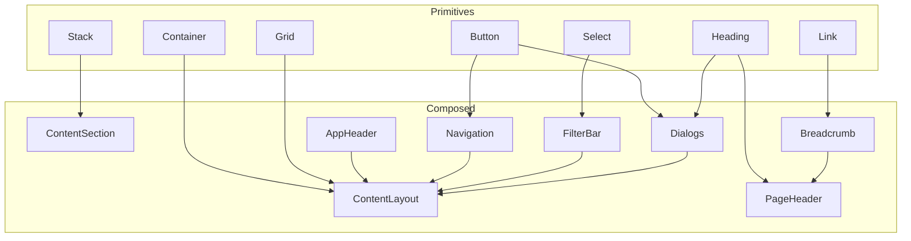

**Diagram sources**
- [packages/ds/src/composed/content-layout.tsx](file://packages/ds/src/composed/content-layout.tsx#L8-L9)
- [packages/ds/src/composed/content-section.tsx](file://packages/ds/src/composed/content-section.tsx#L8-L9)
- [packages/ds/src/composed/page-header.tsx](file://packages/ds/src/composed/page-header.tsx#L8)
- [packages/ds/src/composed/navigation.tsx](file://packages/ds/src/composed/navigation.tsx#L8)
- [packages/ds/src/composed/filter-bar.tsx](file://packages/ds/src/composed/filter-bar.tsx#L9-L11)
- [packages/ds/src/composed/breadcrumb.tsx](file://packages/ds/src/composed/breadcrumb.tsx#L8)
- [packages/ds/src/composed/dialogs.tsx](file://packages/ds/src/composed/dialogs.tsx#L9)

## Detailed Component Analysis

### ContentLayout
- Purpose: High-level page content container with optional grid and header offset
- Key props:
  - maxWidth, padding, fluid: inherited from Container
  - headerOffset: maps to top padding for fixed headers
  - grid: optional Grid configuration for content
- Behavior:
  - Wraps children in Container
  - Applies header offset via inline style
  - Optionally wraps children in Grid based on grid prop
- Accessibility and integration:
  - Sets id="main" for skip links and screen reader landmarks
  - Works seamlessly with ContentSection and PageHeader

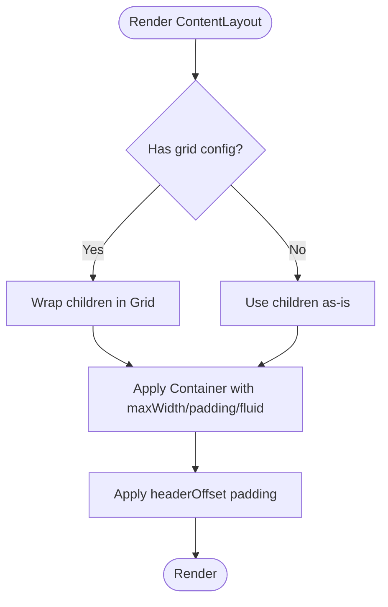

**Diagram sources**
- [packages/ds/src/composed/content-layout.tsx](file://packages/ds/src/composed/content-layout.tsx#L50-L99)

**Section sources**
- [packages/ds/src/composed/content-layout.tsx](file://packages/ds/src/composed/content-layout.tsx#L10-L48)
- [packages/ds/src/composed/content-layout.tsx](file://packages/ds/src/composed/content-layout.tsx#L50-L99)

### ContentSection
- Purpose: Group related content with optional Fieldset wrapper and stacked layout
- Key props:
  - title, subtitle, level: Heading configuration
  - fieldset: whether to wrap in Fieldset
  - spacing, direction, contentSpacing: layout and spacing control
- Behavior:
  - Renders title/subtitle stack
  - Stacks children vertically or horizontally based on direction
  - Applies marginBottom via spacing prop
- Accessibility:
  - Heading level is explicit and controllable
  - Optional Fieldset wrapper supports grouping semantics

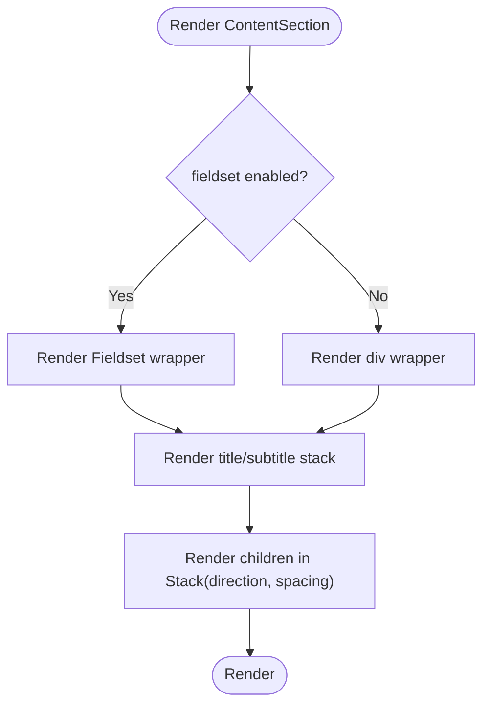

**Diagram sources**
- [packages/ds/src/composed/content-section.tsx](file://packages/ds/src/composed/content-section.tsx#L53-L113)

**Section sources**
- [packages/ds/src/composed/content-section.tsx](file://packages/ds/src/composed/content-section.tsx#L11-L51)
- [packages/ds/src/composed/content-section.tsx](file://packages/ds/src/composed/content-section.tsx#L53-L113)

### PageHeader
- Purpose: Consistent page header with title, subtitle, actions, and optional border
- Key props:
  - title, subtitle, level: Heading configuration
  - actions: right-aligned action buttons
  - breadcrumb: hierarchical navigation above title
  - bordered: adds bottom border
- Behavior:
  - Flex layout: breadcrumb/title/subtitle/actions
  - Conditional border and spacing based on bordered prop
- Integration:
  - Often used immediately after AppHeader and before ContentLayout

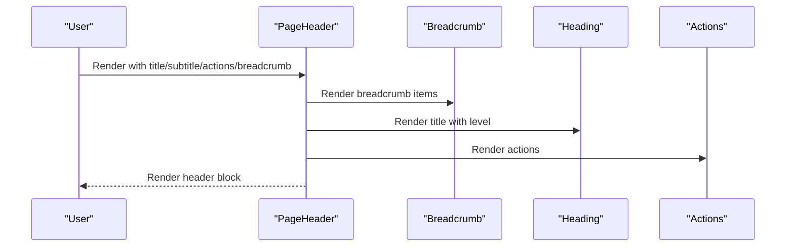

**Diagram sources**
- [packages/ds/src/composed/page-header.tsx](file://packages/ds/src/composed/page-header.tsx#L44-L91)

**Section sources**
- [packages/ds/src/composed/page-header.tsx](file://packages/ds/src/composed/page-header.tsx#L10-L42)
- [packages/ds/src/composed/page-header.tsx](file://packages/ds/src/composed/page-header.tsx#L44-L91)

### AppHeader
- Purpose: Sticky application header with logo, search, actions, and skip link
- Key props:
  - logo, search, actions: three-column layout segments
  - sticky, height, variant: appearance and positioning
  - showSkipLink, skipLinkTarget, skipLinkText: accessibility
- Behavior:
  - Single-row layout with Container padding
  - Responsive gaps and hidden search on small screens
  - Skip link positioned off-screen until focused
- Integration:
  - Typically placed at the top of AppShell
  - Works with SkipLinks for improved keyboard navigation

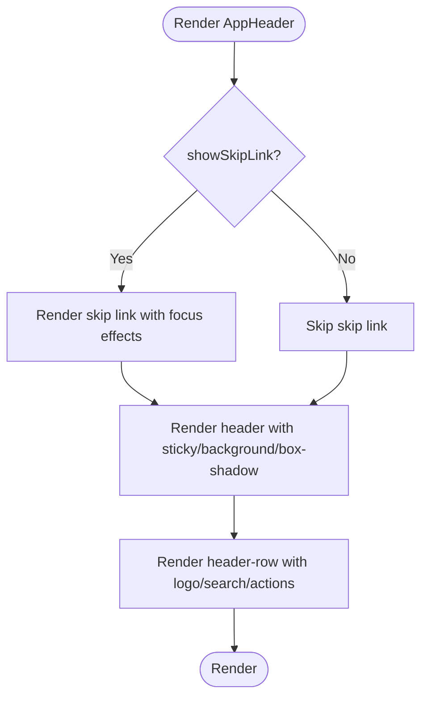

**Diagram sources**
- [packages/ds/src/composed/header.tsx](file://packages/ds/src/composed/header.tsx#L65-L180)

**Section sources**
- [packages/ds/src/composed/header.tsx](file://packages/ds/src/composed/header.tsx#L12-L63)
- [packages/ds/src/composed/header.tsx](file://packages/ds/src/composed/header.tsx#L65-L180)

### Navigation
- Purpose: Horizontal navigation with configurable spacing and active state styling
- Key props:
  - children: NavigationLink items
  - spacing: gap between items
- Behavior:
  - Flex layout with dynamic gap
  - Active link receives accent background and bold weight
- Integration:
  - Used inside AppHeader or within ContentLayout/ContentSection

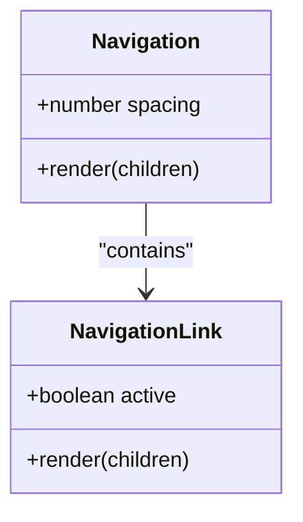

**Diagram sources**
- [packages/ds/src/composed/navigation.tsx](file://packages/ds/src/composed/navigation.tsx#L23-L81)

**Section sources**
- [packages/ds/src/composed/navigation.tsx](file://packages/ds/src/composed/navigation.tsx#L10-L21)
- [packages/ds/src/composed/navigation.tsx](file://packages/ds/src/composed/navigation.tsx#L23-L81)

### FilterBar
- Purpose: Horizontal filter bar with primary listing-type filter and secondary filters
- Key props:
  - primaryFilter: top-level filter with value/options/onChange and optional label
  - filters: array of secondary filter configs (select/multiselect)
  - resultsCount, resultsLabel: results summary
  - viewMode, onViewModeChange: grid/list/map toggle
  - spacing, showPrimaryAsButtons: layout control
- Behavior:
  - Renders primary filter as button group or select
  - Secondary filters in a responsive Grid
  - Results count and view-mode toggle footer
- Integration:
  - Placed after PageHeader and before ContentSection

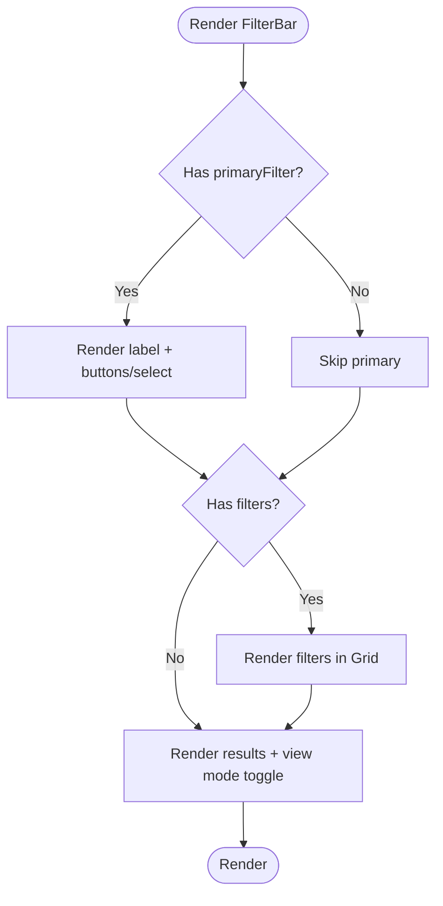

**Diagram sources**
- [packages/ds/src/composed/filter-bar.tsx](file://packages/ds/src/composed/filter-bar.tsx#L69-L291)

**Section sources**
- [packages/ds/src/composed/filter-bar.tsx](file://packages/ds/src/composed/filter-bar.tsx#L14-L67)
- [packages/ds/src/composed/filter-bar.tsx](file://packages/ds/src/composed/filter-bar.tsx#L69-L291)

### Breadcrumb
- Purpose: Hierarchical navigation showing page location
- Key props:
  - items: array of BreadcrumbItem with label, optional href or onClick
  - separator: custom separator
  - className: styling hook
- Behavior:
  - Renders ordered list with clickable items except the last
  - Uses aria-current on the current page
  - Supports custom separator and styling
- Integration:
  - Used inside PageHeader or standalone

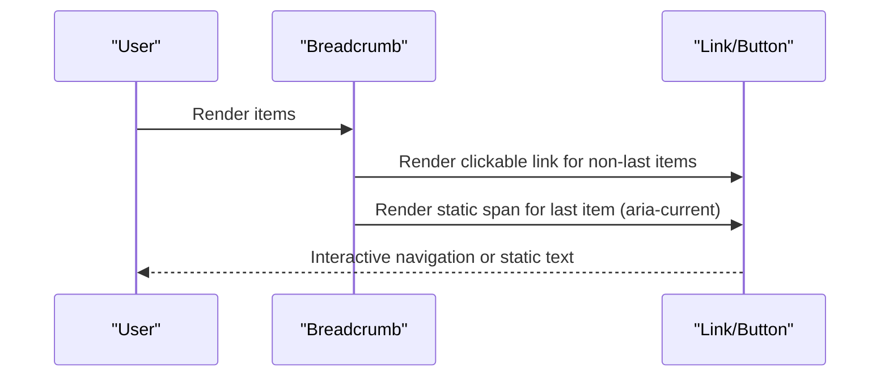

**Diagram sources**
- [packages/ds/src/composed/breadcrumb.tsx](file://packages/ds/src/composed/breadcrumb.tsx#L35-L135)

**Section sources**
- [packages/ds/src/composed/breadcrumb.tsx](file://packages/ds/src/composed/breadcrumb.tsx#L12-L19)
- [packages/ds/src/composed/breadcrumb.tsx](file://packages/ds/src/composed/breadcrumb.tsx#L35-L135)

### Dialogs
- Purpose: Reusable confirmation and alert dialogs with variants and imperative API
- Key props:
  - ConfirmDialog: open, onClose, onConfirm, title, description, confirmText, cancelText, variant, isLoading
  - AlertDialog: open, onClose, title, description, closeText, variant
  - DialogProvider: imperative confirm/alert via useDialog hook
- Behavior:
  - Uses native dialog element with custom styling
  - Variant-specific colors and icons
  - DialogProvider manages state and resolves promises
- Integration:
  - Wrap application root with DialogProvider
  - Use useDialog in components to trigger dialogs

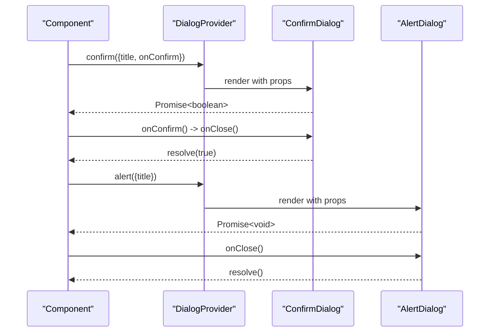

**Diagram sources**
- [packages/ds/src/composed/dialogs.tsx](file://packages/ds/src/composed/dialogs.tsx#L403-L456)
- [packages/ds/src/composed/dialogs.tsx](file://packages/ds/src/composed/dialogs.tsx#L477-L483)

**Section sources**
- [packages/ds/src/composed/dialogs.tsx](file://packages/ds/src/composed/dialogs.tsx#L15-L36)
- [packages/ds/src/composed/dialogs.tsx](file://packages/ds/src/composed/dialogs.tsx#L206-L300)
- [packages/ds/src/composed/dialogs.tsx](file://packages/ds/src/composed/dialogs.tsx#L320-L381)
- [packages/ds/src/composed/dialogs.tsx](file://packages/ds/src/composed/dialogs.tsx#L403-L456)
- [packages/ds/src/composed/dialogs.tsx](file://packages/ds/src/composed/dialogs.tsx#L477-L483)

### FormActions
- Purpose: Action buttons for forms (e.g., submit/cancel)
- Composition pattern:
  - Built from primitives (Button) and styled for consistent UX
  - Accepts primary/secondary variants and disabled states
- Usage scenarios:
  - Inline with form fields in ContentSection
  - At the bottom of modals or dialogs
- Accessibility:
  - Proper labeling and focus order
  - Clear affordances for primary vs secondary actions

**Section sources**
- [packages/ds/src/composed/FormActions.tsx](file://packages/ds/src/composed/FormActions.tsx)

### LoadingFallback
- Purpose: Loading state placeholder for asynchronous content
- Composition pattern:
  - Uses primitives (e.g., Stack, Text) to create skeleton-like layouts
  - Supports responsive and grid-based placeholders
- Usage scenarios:
  - Inside ContentSection during data fetch
  - Within ContentLayout for page-level loading
- Accessibility:
  - ARIA live regions and reduced motion preferences

**Section sources**
- [packages/ds/src/composed/LoadingFallback.tsx](file://packages/ds/src/composed/LoadingFallback.tsx)

### SkipLinks
- Purpose: Accessible skip link for keyboard navigation
- Composition pattern:
  - Off-screen by default, visible on focus
  - Integrated with AppHeader for quick jump to main content
- Usage scenarios:
  - Global skip link in AppHeader
  - Alternative skip targets per application needs
- Accessibility:
  - Focus management and high contrast styling

**Section sources**
- [packages/ds/src/composed/skip-links.tsx](file://packages/ds/src/composed/skip-links.tsx)

## Dependency Analysis
Composed components depend on primitives and design system components. The re-export layer centralizes imports and types.

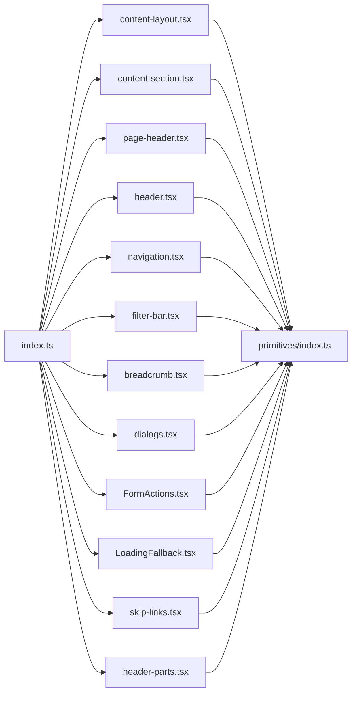

**Diagram sources**
- [packages/ds/src/index.ts](file://packages/ds/src/index.ts#L72-L114)
- [packages/ds/src/composed/content-layout.tsx](file://packages/ds/src/composed/content-layout.tsx#L8)
- [packages/ds/src/composed/content-section.tsx](file://packages/ds/src/composed/content-section.tsx#L8)
- [packages/ds/src/composed/page-header.tsx](file://packages/ds/src/composed/page-header.tsx#L8)
- [packages/ds/src/composed/header.tsx](file://packages/ds/src/composed/header.tsx#L10)
- [packages/ds/src/composed/navigation.tsx](file://packages/ds/src/composed/navigation.tsx#L8)
- [packages/ds/src/composed/filter-bar.tsx](file://packages/ds/src/composed/filter-bar.tsx#L9-L11)
- [packages/ds/src/composed/breadcrumb.tsx](file://packages/ds/src/composed/breadcrumb.tsx#L8)
- [packages/ds/src/composed/dialogs.tsx](file://packages/ds/src/composed/dialogs.tsx#L9)
- [packages/ds/src/composed/FormActions.tsx](file://packages/ds/src/composed/FormActions.tsx)
- [packages/ds/src/composed/LoadingFallback.tsx](file://packages/ds/src/composed/LoadingFallback.tsx)
- [packages/ds/src/composed/skip-links.tsx](file://packages/ds/src/composed/skip-links.tsx)
- [packages/ds/src/composed/header-parts.tsx](file://packages/ds/src/composed/header-parts.tsx#L7-L14)

**Section sources**
- [packages/ds/src/index.ts](file://packages/ds/src/index.ts#L72-L188)

## Performance Considerations
- Prefer minimal re-renders by passing memoized callbacks and stable objects to FilterBar and Dialogs
- Use lazy loading for heavy content inside ContentSection to improve initial load
- Avoid unnecessary nesting of Grid and Stack; flatten where possible for better rendering performance
- Defer non-critical dialogs to reduce DOM overhead

## Troubleshooting Guide
- Dialogs not opening:
  - Ensure DialogProvider wraps the application root
  - Verify open prop and event handlers are passed correctly
- FilterBar secondary filters not updating:
  - Ensure each filter has a unique id and onChange updates the correct state
- Header skip link not visible:
  - Confirm showSkipLink is true and focus/blur handlers are applied
- Breadcrumb last item not styled:
  - Ensure the last item has no href/onClick so it renders as static text with aria-current

**Section sources**
- [packages/ds/src/composed/dialogs.tsx](file://packages/ds/src/composed/dialogs.tsx#L403-L456)
- [packages/ds/src/composed/filter-bar.tsx](file://packages/ds/src/composed/filter-bar.tsx#L146-L214)
- [packages/ds/src/composed/header.tsx](file://packages/ds/src/composed/header.tsx#L113-L126)
- [packages/ds/src/composed/breadcrumb.tsx](file://packages/ds/src/composed/breadcrumb.tsx#L105-L119)

## Conclusion
These composed components provide robust, accessible patterns that combine primitives into cohesive UI structures. By leveraging props inheritance, slots, and consistent styling, they enable flexible application layouts while maintaining accessibility and performance. Integrating them with application shells and blocks yields scalable, maintainable interfaces across the platform.