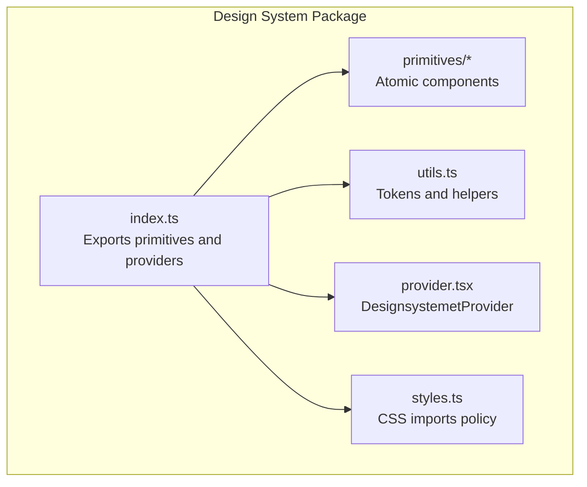
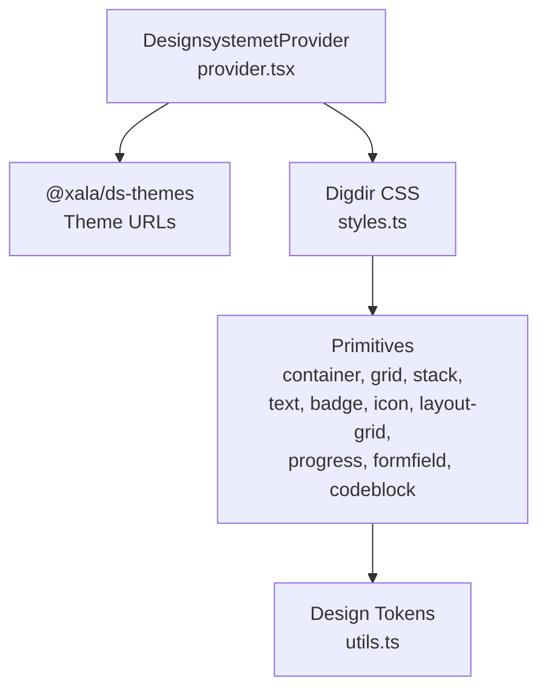
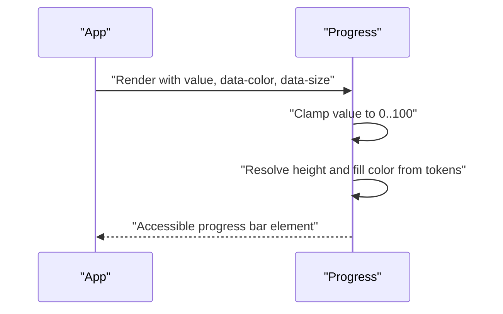
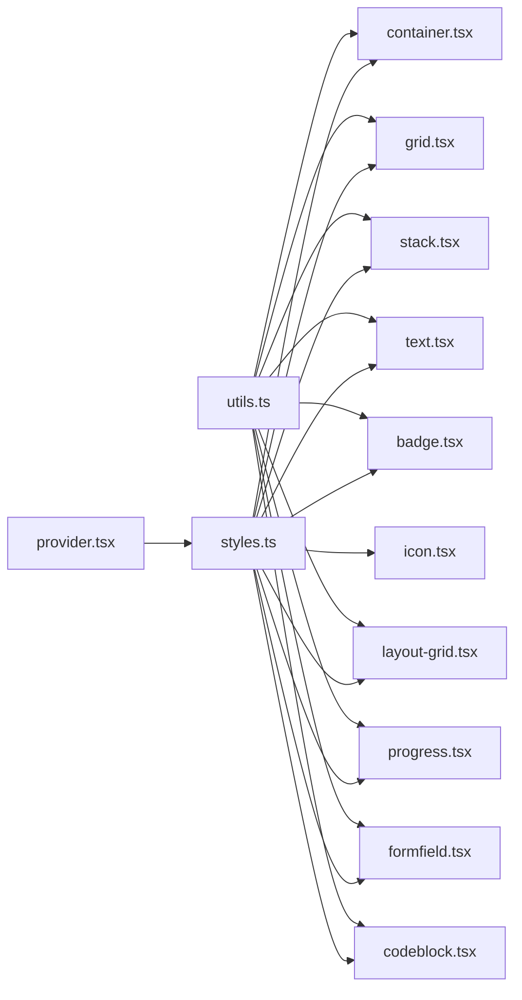

# Primitive Components

<cite>
**Referenced Files in This Document**
- [packages/ds/src/index.ts](file://packages/ds/src/index.ts)
- [packages/ds/src/provider.tsx](file://packages/ds/src/provider.tsx)
- [packages/ds/src/styles.ts](file://packages/ds/src/styles.ts)
- [packages/ds/src/utils.ts](file://packages/ds/src/utils.ts)
- [packages/ds/src/primitives/container.tsx](file://packages/ds/src/primitives/container.tsx)
- [packages/ds/src/primitives/grid.tsx](file://packages/ds/src/primitives/grid.tsx)
- [packages/ds/src/primitives/stack.tsx](file://packages/ds/src/primitives/stack.tsx)
- [packages/ds/src/primitives/text.tsx](file://packages/ds/src/primitives/text.tsx)
- [packages/ds/src/primitives/badge.tsx](file://packages/ds/src/primitives/badge.tsx)
- [packages/ds/src/primitives/icon.tsx](file://packages/ds/src/primitives/icon.tsx)
- [packages/ds/src/primitives/icons.tsx](file://packages/ds/src/primitives/icons.tsx)
- [packages/ds/src/primitives/layout-grid.tsx](file://packages/ds/src/primitives/layout-grid.tsx)
- [packages/ds/src/primitives/progress.tsx](file://packages/ds/src/primitives/progress.tsx)
- [packages/ds/src/primitives/formfield.tsx](file://packages/ds/src/primitives/formfield.tsx)
- [packages/ds/src/primitives/codeblock.tsx](file://packages/ds/src/primitives/codeblock.tsx)
</cite>

## Table of Contents
1. [Introduction](#introduction)
2. [Project Structure](#project-structure)
3. [Core Components](#core-components)
4. [Architecture Overview](#architecture-overview)
5. [Detailed Component Analysis](#detailed-component-analysis)
6. [Dependency Analysis](#dependency-analysis)
7. [Performance Considerations](#performance-considerations)
8. [Troubleshooting Guide](#troubleshooting-guide)
9. [Conclusion](#conclusion)
10. [Appendices](#appendices)

## Introduction
This document describes the primitive design system components that serve as atomic building blocks for the Xala/Digilist design system. It covers Container, Grid, Stack, Text, Badge, Icon, LayoutGrid, Progress, FormField, and CodeBlock. For each component, we outline the complete prop interface, variant options, styling customization, and how they integrate with the theme and design tokens. We explain how these primitives enable higher-level compositions and provide guidance on responsive behavior, accessibility, and best practices for extension.

## Project Structure
The design system is organized into layers:
- Primitives: Low-level atomic components (this document)
- Composed: Mid-level components built from primitives
- Blocks: Business logic components built from composed components
- Shells: Application-level layouts built from blocks/composed

Primitives are exported from the package entry point and re-exported from the design system’s facade for easy consumption across applications.

**Diagram sources**
- [packages/ds/src/index.ts](file://packages/ds/src/index.ts#L190-L305)
- [packages/ds/src/provider.tsx](file://packages/ds/src/provider.tsx#L1-L130)
- [packages/ds/src/styles.ts](file://packages/ds/src/styles.ts#L1-L24)
- [packages/ds/src/utils.ts](file://packages/ds/src/utils.ts#L1-L181)

**Section sources**
- [packages/ds/src/index.ts](file://packages/ds/src/index.ts#L1-L62)
- [packages/ds/src/index.ts](file://packages/ds/src/index.ts#L190-L305)

## Core Components
Below are the primitive components documented with their props, variants, and styling integration.

- Container
  - Purpose: Constrain content width and apply consistent padding with fluid and max-width controls.
  - Key props: maxWidth, fluid, padding, px, py.
  - Styling: Uses CSS container queries and design tokens for spacing and margins.
  - Accessibility: Inherits standard HTML semantics; ensure semantic headings inside when used as page containers.

- Grid
  - Purpose: CSS Grid layout with configurable columns, rows, and gaps.
  - Key props: columns, rows, gap, gapX, gapY, responsive (object shape for breakpoints).
  - Styling: Applies grid display and gap tokens; responsive behavior can be extended via CSS classes or media queries.

- Stack
  - Purpose: Flexible layout for vertical or horizontal stacking with alignment and wrapping.
  - Key props: direction, spacing, align, justify, wrap.
  - Styling: Flexbox-based with gap tokens; direction toggles flex-direction.

- Text
  - Purpose: Typography component with variants, sizes, weights, and color overrides.
  - Key props: variant (body, subtitle, caption, overline), size (xs to xl), weight (normal to bold), color.
  - Styling: Uses design tokens for font sizes, line heights, and weights; defaults to neutral text color.

- Badge
  - Purpose: Status or label indicator with size and variant options.
  - Key props: variant (neutral, info, success, warning, danger), size (sm to lg).
  - Styling: Uses design tokens for colors, radii, and paddings; transitions for interactivity.

- Icon
  - Purpose: Lightweight SVG wrapper for inline icons.
  - Key props: size, color.
  - Styling: Uses currentColor by default; accepts any SVG children.

- LayoutGrid
  - Purpose: Responsive grid with automatic column fitting and breakpoint-aware columns.
  - Key props: columns (per breakpoint), gap, autoFit, minColumnWidth.
  - Styling: Computes grid-template-columns based on props; supports auto-fit/minmax.

- Progress
  - Purpose: Progress bar with color variants and sizes.
  - Key props: value (0–100), data-color (success, warning, danger, neutral, info, accent), data-size (sm, md, lg), aria-label.
  - Accessibility: Implements role="progressbar" with aria-valuenow, aria-valuemin, aria-valuemax.

- FormField
  - Purpose: Wraps form controls with label, description, and error messaging.
  - Key props: label, required, error, description, children, className.
  - Styling: Uses design tokens for spacing and text colors; integrates with Label from the design system.

- CodeBlock
  - Purpose: Displays code with optional language header and scrollable content area.
  - Key props: code, language, maxHeight, showLineNumbers, className.
  - Styling: Uses design tokens for background, borders, radius, fonts, and spacing.

**Section sources**
- [packages/ds/src/primitives/container.tsx](file://packages/ds/src/primitives/container.tsx#L10-L38)
- [packages/ds/src/primitives/grid.tsx](file://packages/ds/src/primitives/grid.tsx#L10-L47)
- [packages/ds/src/primitives/stack.tsx](file://packages/ds/src/primitives/stack.tsx#L10-L38)
- [packages/ds/src/primitives/text.tsx](file://packages/ds/src/primitives/text.tsx#L10-L33)
- [packages/ds/src/primitives/badge.tsx](file://packages/ds/src/primitives/badge.tsx#L10-L22)
- [packages/ds/src/primitives/icon.tsx](file://packages/ds/src/primitives/icon.tsx#L9-L20)
- [packages/ds/src/primitives/layout-grid.tsx](file://packages/ds/src/primitives/layout-grid.tsx#L9-L37)
- [packages/ds/src/primitives/progress.tsx](file://packages/ds/src/primitives/progress.tsx#L10-L35)
- [packages/ds/src/primitives/formfield.tsx](file://packages/ds/src/primitives/formfield.tsx#L8-L21)
- [packages/ds/src/primitives/codeblock.tsx](file://packages/ds/src/primitives/codeblock.tsx#L9-L20)

## Architecture Overview
The primitives layer is designed to be theme-agnostic while integrating with the underlying design tokens and provider. The provider manages theme CSS injection and data attributes for color scheme, size, and typography. Styles are imported via a single entry to avoid duplication.

**Diagram sources**
- [packages/ds/src/provider.tsx](file://packages/ds/src/provider.tsx#L102-L129)
- [packages/ds/src/styles.ts](file://packages/ds/src/styles.ts#L13-L23)
- [packages/ds/src/utils.ts](file://packages/ds/src/utils.ts#L20-L118)

**Section sources**
- [packages/ds/src/provider.tsx](file://packages/ds/src/provider.tsx#L1-L130)
- [packages/ds/src/styles.ts](file://packages/ds/src/styles.ts#L1-L24)
- [packages/ds/src/utils.ts](file://packages/ds/src/utils.ts#L1-L181)

## Detailed Component Analysis

### Container
- Prop interface summary
  - maxWidth: string; default '1440px'
  - fluid: boolean; default false
  - padding: string | number; default uses design token spacing
  - px: string | number; override horizontal padding
  - py: string | number; override vertical padding
- Styling customization
  - Uses CSS container queries for responsive behavior
  - Applies design tokens for spacing and margins
- Accessibility
  - No special ARIA attributes; ensure semantic headings inside when used as page containers

**Section sources**
- [packages/ds/src/primitives/container.tsx](file://packages/ds/src/primitives/container.tsx#L10-L79)

### Grid
- Prop interface summary
  - columns: string; default '1fr'
  - rows: string
  - gap: string | number; default 0
  - gapX: string | number
  - gapY: string | number
  - responsive: object with keys sm, md, lg, xl
- Styling customization
  - Applies grid display and gap tokens; consider adding CSS classes for responsive breakpoints
- Accessibility
  - No special ARIA attributes; ensure semantic headings inside grid items

**Section sources**
- [packages/ds/src/primitives/grid.tsx](file://packages/ds/src/primitives/grid.tsx#L10-L89)

### Stack
- Prop interface summary
  - direction: 'vertical' | 'horizontal'; default 'vertical'
  - spacing: string | number; default 0
  - align: 'start' | 'center' | 'end' | 'stretch'
  - justify: 'start' | 'center' | 'end' | 'between' | 'around' | 'evenly'
  - wrap: boolean; default false
- Styling customization
  - Flexbox-based; uses design tokens for gap spacing
- Accessibility
  - No special ARIA attributes; ensure semantic headings inside stack items

**Section sources**
- [packages/ds/src/primitives/stack.tsx](file://packages/ds/src/primitives/stack.tsx#L10-L76)

### Text
- Prop interface summary
  - variant: 'body' | 'subtitle' | 'caption' | 'overline'; default 'body'
  - size: 'xs' | 'sm' | 'md' | 'lg' | 'xl'; default 'md'
  - weight: 'normal' | 'medium' | 'semibold' | 'bold'; default 'normal'
  - color: string
- Styling customization
  - Uses design tokens for font size, line height, and weight
  - Overline variant renders as span; others as paragraph
- Accessibility
  - Use appropriate semantic elements; ensure sufficient color contrast

**Section sources**
- [packages/ds/src/primitives/text.tsx](file://packages/ds/src/primitives/text.tsx#L10-L89)

### Badge
- Prop interface summary
  - variant: 'neutral' | 'info' | 'success' | 'warning' | 'danger'; default 'neutral'
  - size: 'sm' | 'md' | 'lg'; default 'md'
- Styling customization
  - Uses design tokens for colors, radii, and paddings
  - Includes transition effects for interactive states
- Accessibility
  - Use meaningful text content; consider aria-label for decorative badges

**Section sources**
- [packages/ds/src/primitives/badge.tsx](file://packages/ds/src/primitives/badge.tsx#L10-L86)

### Icon
- Prop interface summary
  - size: number; default 20
  - color: string; default 'currentColor'
- Styling customization
  - Accepts any SVG children; inherits color via stroke
- Accessibility
  - Provide accessible labels via parent components or aria-label on the icon element

**Section sources**
- [packages/ds/src/primitives/icon.tsx](file://packages/ds/src/primitives/icon.tsx#L9-L44)

### LayoutGrid
- Prop interface summary
  - columns: object with keys sm, md, lg, xl
  - gap: number; default 16
  - autoFit: boolean; default false
  - minColumnWidth: string; default '300px'
- Styling customization
  - Computes grid-template-columns using repeat and minmax when autoFit is enabled
- Accessibility
  - No special ARIA attributes; ensure semantic headings inside grid items

**Section sources**
- [packages/ds/src/primitives/layout-grid.tsx](file://packages/ds/src/primitives/layout-grid.tsx#L9-L86)

### Progress
- Prop interface summary
  - value: number; clamped to 0–100
  - data-color: 'success' | 'warning' | 'danger' | 'neutral' | 'info' | 'accent'
  - data-size: 'sm' | 'md' | 'lg'
  - style: React.CSSProperties
  - className: string
  - aria-label: string
- Styling customization
  - Uses design tokens for colors and border radius
  - Height scales with size; fill color depends on data-color
- Accessibility
  - Implements role="progressbar" with aria-valuenow, aria-valuemin, aria-valuemax

**Diagram sources**
- [packages/ds/src/primitives/progress.tsx](file://packages/ds/src/primitives/progress.tsx#L73-L115)

**Section sources**
- [packages/ds/src/primitives/progress.tsx](file://packages/ds/src/primitives/progress.tsx#L10-L116)

### FormField
- Prop interface summary
  - label: string
  - required: boolean; default false
  - error: string | undefined
  - description: string | undefined
  - children: React.ReactNode
  - className: string
- Styling customization
  - Uses design tokens for spacing and text colors
  - Integrates with Label from the design system
- Accessibility
  - Required asterisk is styled appropriately; ensure labels are associated with controls

**Section sources**
- [packages/ds/src/primitives/formfield.tsx](file://packages/ds/src/primitives/formfield.tsx#L8-L61)

### CodeBlock
- Prop interface summary
  - code: string
  - language: string; default 'text'
  - maxHeight: string; default '400px'
  - showLineNumbers: boolean; default false
  - className: string
- Styling customization
  - Uses design tokens for background, borders, radius, fonts, and spacing
  - Optional language header with uppercase label
- Accessibility
  - Code rendered inside pre/code; ensure readable contrast and consider screen reader announcements

**Section sources**
- [packages/ds/src/primitives/codeblock.tsx](file://packages/ds/src/primitives/codeblock.tsx#L9-L78)

## Dependency Analysis
Primitives depend on:
- Design tokens and utilities (spacing, colors, typography) from utils.ts
- Provider for theme switching and data attributes
- Digdir CSS via styles.ts to ensure consistent baseline styles

**Diagram sources**
- [packages/ds/src/utils.ts](file://packages/ds/src/utils.ts#L1-L181)
- [packages/ds/src/provider.tsx](file://packages/ds/src/provider.tsx#L102-L129)
- [packages/ds/src/styles.ts](file://packages/ds/src/styles.ts#L13-L23)
- [packages/ds/src/primitives/*.tsx](file://packages/ds/src/primitives/container.tsx#L1-L79)

**Section sources**
- [packages/ds/src/utils.ts](file://packages/ds/src/utils.ts#L1-L181)
- [packages/ds/src/provider.tsx](file://packages/ds/src/provider.tsx#L1-L130)
- [packages/ds/src/styles.ts](file://packages/ds/src/styles.ts#L1-L24)

## Performance Considerations
- Prefer CSS custom properties for colors and spacing to minimize style recalculations.
- Use container queries in Container to avoid expensive resize listeners.
- Keep Grid and LayoutGrid simple; avoid deeply nested grids for performance.
- Use Stack for flexible layouts instead of complex CSS Grid configurations when possible.
- Avoid excessive re-renders by memoizing heavy child components passed to FormField and CodeBlock.

## Troubleshooting Guide
- Theme not applying
  - Ensure styles are imported once via the design system entry point and that the provider wraps the app.
- Conflicting CSS
  - Do not import Digdir CSS directly; rely on the styles.ts import policy enforced by the design system.
- Progress bar not accessible
  - Provide aria-label or ensure value is announced by assistive technologies.
- FormField labels not associated
  - Ensure the child control has an id matching the label’s for attribute or use the design system’s Label component.

**Section sources**
- [packages/ds/src/styles.ts](file://packages/ds/src/styles.ts#L8-L23)
- [packages/ds/src/primitives/progress.tsx](file://packages/ds/src/primitives/progress.tsx#L89-L94)
- [packages/ds/src/primitives/formfield.tsx](file://packages/ds/src/primitives/formfield.tsx#L31-L57)

## Conclusion
These primitive components provide a robust, theme-aware foundation for building consistent UIs. By leveraging design tokens, the provider, and a single CSS import policy, teams can compose reliable layouts and interactions while maintaining accessibility and responsiveness.

## Appendices

### Usage Examples and Patterns
- Container with fluid layout and custom padding
  - Combine maxWidth and fluid to toggle constrained vs. full-width behavior.
  - Use px/py to override horizontal/vertical padding.
- Grid with responsive columns
  - Define columns per breakpoint using the responsive object; consider adding CSS classes for media queries.
- Stack with alignment and wrapping
  - Use align and justify for precise control; wrap for multi-line stacks.
- Text with variant and size
  - Choose variant for semantic meaning; adjust size and weight for hierarchy.
- Badge with variant and size
  - Select variant for semantic meaning; choose size for prominence.
- Icon with size and color
  - Use size to match surrounding text; color to inherit or override.
- LayoutGrid with auto-fit
  - Enable autoFit and set minColumnWidth for adaptive columns.
- Progress with color and size
  - Use data-color for semantic meaning; data-size for emphasis.
- FormField with label, description, and error
  - Combine label, description, and error for clear user guidance.
- CodeBlock with language and maxHeight
  - Specify language for syntax highlighting; set maxHeight for scrollable content.

### Best Practices for Extension
- Extend primitives by composing them rather than duplicating styles.
- Use design tokens from utils.ts for spacing, colors, and typography.
- Keep component APIs minimal; expose only essential props.
- Provide clear defaults and ensure backward compatibility when evolving props.
- Document accessibility considerations for each component.

### Anti-Patterns to Avoid
- Avoid importing CSS directly in components; rely on the design system’s styles.ts import policy.
- Do not hardcode colors or spacing; always use design tokens.
- Avoid complex nested grids; prefer Stack for simple layouts.
- Do not omit aria attributes for interactive components like Progress; always provide accessible labels.