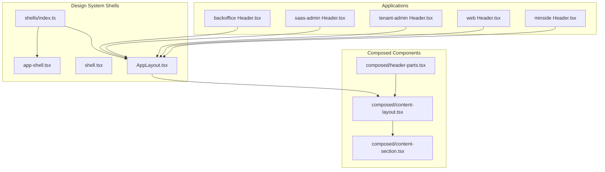
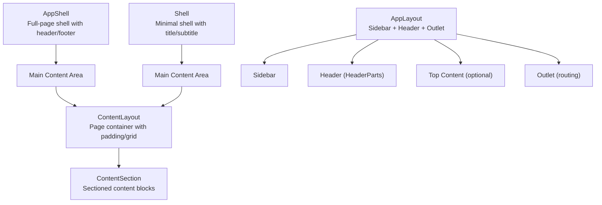
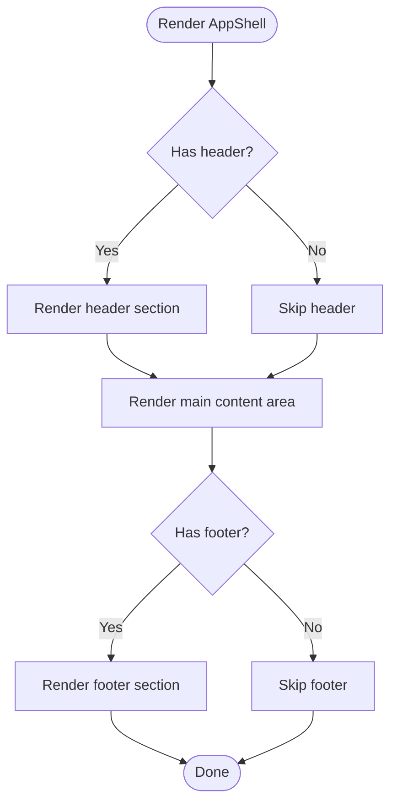
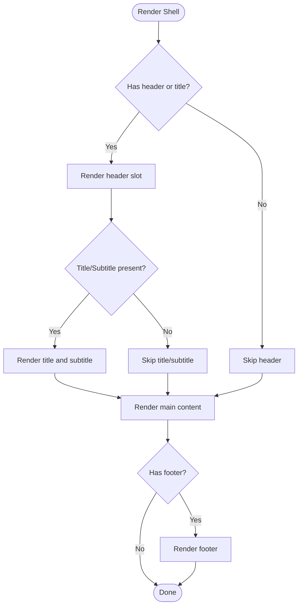
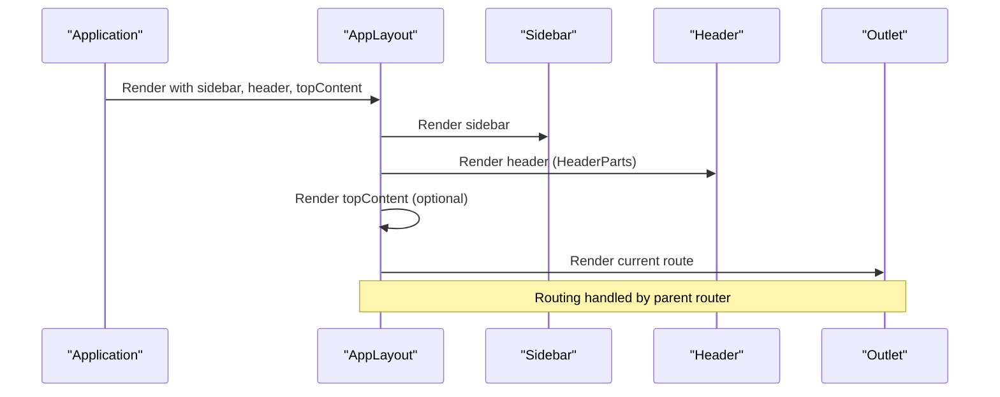
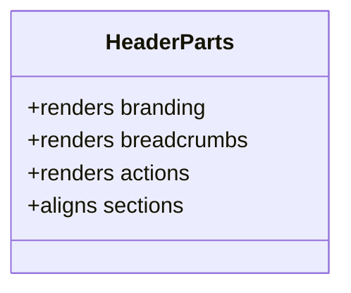
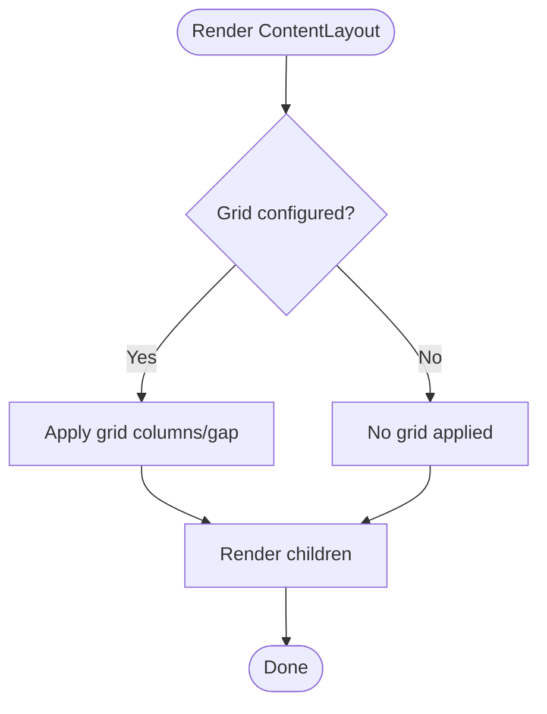
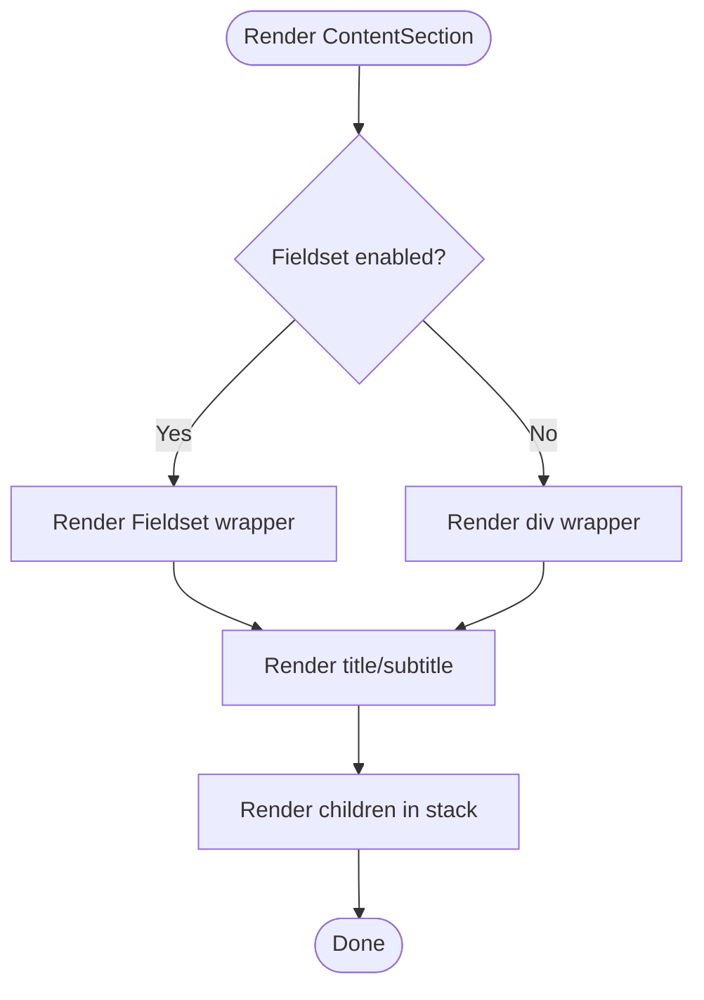
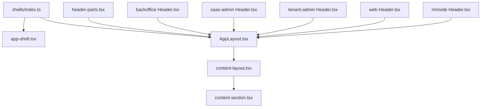

# Shell Components

<cite>
**Referenced Files in This Document**
- [packages/ds/src/shells/index.ts](file://packages/ds/src/shells/index.ts)
- [packages/ds/src/shells/app-shell.tsx](file://packages/ds/src/shells/app-shell.tsx)
- [packages/ds/src/shells/shell.tsx](file://packages/ds/src/shells/shell.tsx)
- [packages/ds/src/shells/AppLayout.tsx](file://packages/ds/src/shells/AppLayout.tsx)
- [packages/ds/src/composed/header-parts.tsx](file://packages/ds/src/composed/header-parts.tsx)
- [packages/ds/src/composed/content-layout.tsx](file://packages/ds/src/composed/content-layout.tsx)
- [packages/ds/src/composed/content-section.tsx](file://packages/ds/src/composed/content-section.tsx)
- [apps/backoffice/src/components/layout/Header.tsx](file://apps/backoffice/src/components/layout/Header.tsx)
- [apps/saas-admin/src/components/layout/Header.tsx](file://apps/saas-admin/src/components/layout/Header.tsx)
- [apps/tenant-admin/src/components/layout/Header.tsx](file://apps/tenant-admin/src/components/layout/Header.tsx)
- [apps/web/src/components/layout/Header.tsx](file://apps/web/src/components/layout/Header.tsx)
- [apps/minside/src/components/layout/Header.tsx](file://apps/minside/src/components/layout/Header.tsx)
- [packages/ds-registry/examples/composed/content-layout.tsx](file://packages/ds-registry/examples/composed/content-layout.tsx)
- [packages/ds-registry/examples/composed/content-section.tsx](file://packages/ds-registry/examples/composed/content-section.tsx)
</cite>

## Table of Contents
1. [Introduction](#introduction)
2. [Project Structure](#project-structure)
3. [Core Components](#core-components)
4. [Architecture Overview](#architecture-overview)
5. [Detailed Component Analysis](#detailed-component-analysis)
6. [Dependency Analysis](#dependency-analysis)
7. [Performance Considerations](#performance-considerations)
8. [Troubleshooting Guide](#troubleshooting-guide)
9. [Conclusion](#conclusion)
10. [Appendices](#appendices)

## Introduction
This document describes the shell components that define complete application layout structures and navigation frameworks across the monorepo. It focuses on the foundational shell components—AppShell, AppLayout, Shell, HeaderParts, ContentLayout, and ContentSection—and explains how they coordinate routing, navigation, responsive behavior, and layout management. It also provides guidance for customizing these components for different application types (backoffice, web portal, tenant admin) while maintaining consistent UX patterns.

## Project Structure
The shell system is primarily implemented in the design system package and integrated into each application. The shells module exports the core layout primitives, while composed components provide higher-level building blocks for content and navigation.

**Diagram sources**
- [packages/ds/src/shells/index.ts](file://packages/ds/src/shells/index.ts#L1-L12)
- [packages/ds/src/shells/app-shell.tsx](file://packages/ds/src/shells/app-shell.tsx#L1-L102)
- [packages/ds/src/shells/shell.tsx](file://packages/ds/src/shells/shell.tsx#L1-L114)
- [packages/ds/src/shells/AppLayout.tsx](file://packages/ds/src/shells/AppLayout.tsx#L1-L105)
- [packages/ds/src/composed/header-parts.tsx](file://packages/ds/src/composed/header-parts.tsx)
- [packages/ds/src/composed/content-layout.tsx](file://packages/ds/src/composed/content-layout.tsx)
- [packages/ds/src/composed/content-section.tsx](file://packages/ds/src/composed/content-section.tsx)
- [apps/backoffice/src/components/layout/Header.tsx](file://apps/backoffice/src/components/layout/Header.tsx)
- [apps/saas-admin/src/components/layout/Header.tsx](file://apps/saas-admin/src/components/layout/Header.tsx)
- [apps/tenant-admin/src/components/layout/Header.tsx](file://apps/tenant-admin/src/components/layout/Header.tsx)
- [apps/web/src/components/layout/Header.tsx](file://apps/web/src/components/layout/Header.tsx)
- [apps/minside/src/components/layout/Header.tsx](file://apps/minside/src/components/layout/Header.tsx)

**Section sources**
- [packages/ds/src/shells/index.ts](file://packages/ds/src/shells/index.ts#L1-L12)
- [packages/ds/src/shells/app-shell.tsx](file://packages/ds/src/shells/app-shell.tsx#L1-L102)
- [packages/ds/src/shells/shell.tsx](file://packages/ds/src/shells/shell.tsx#L1-L114)
- [packages/ds/src/shells/AppLayout.tsx](file://packages/ds/src/shells/AppLayout.tsx#L1-L105)

## Core Components
This section introduces the primary shell components and their responsibilities:

- AppShell (advanced): Provides a full-page shell with optional header, footer, max width, fluid layout, background, and minimum height. It establishes a columnar layout with a sticky header and footer region and a scrollable main content area.
- Shell (basic): A minimal shell with title/subtitle, branding toggle, fluid layout, max width, padding, and optional header/footer slots. Suitable for simple pages and forms.
- AppLayout: A flexible layout combining a persistent sidebar, a header, optional top content, and a scrollable main area with an outlet for routing. Designed to standardize navigation across apps.
- HeaderParts: A composed component intended to build header sections (branding, actions, breadcrumbs, etc.) that can be passed into AppLayout’s header slot.
- ContentLayout: A page-level container that manages content width, padding, and optional grid layout. Often used inside AppShell’s main content area.
- ContentSection: A sectioned content block with optional fieldset wrapping, title/subtitle, direction, and spacing. Used within ContentLayout to organize page content.

Key export and composition points:
- shells/index.ts re-exports AppShell and AppLayout for consumption across the monorepo.
- AppLayout composes Outlet for routing and delegates content rendering to child components.
- HeaderParts integrates with Header components in each application to provide consistent header behavior.

**Section sources**
- [packages/ds/src/shells/index.ts](file://packages/ds/src/shells/index.ts#L1-L12)
- [packages/ds/src/shells/app-shell.tsx](file://packages/ds/src/shells/app-shell.tsx#L10-L44)
- [packages/ds/src/shells/shell.tsx](file://packages/ds/src/shells/shell.tsx#L11-L55)
- [packages/ds/src/shells/AppLayout.tsx](file://packages/ds/src/shells/AppLayout.tsx#L19-L40)
- [packages/ds/src/composed/header-parts.tsx](file://packages/ds/src/composed/header-parts.tsx)
- [packages/ds/src/composed/content-layout.tsx](file://packages/ds/src/composed/content-layout.tsx)
- [packages/ds/src/composed/content-section.tsx](file://packages/ds/src/composed/content-section.tsx#L72-L116)

## Architecture Overview
The shell architecture separates concerns across three layers:
- Shell primitives: AppShell and Shell define page-level structure and content framing.
- Layout orchestration: AppLayout coordinates sidebar, header, top content, and main content with routing via Outlet.
- Content composition: HeaderParts, ContentLayout, and ContentSection provide consistent content organization and presentation.

**Diagram sources**
- [packages/ds/src/shells/app-shell.tsx](file://packages/ds/src/shells/app-shell.tsx#L69-L97)
- [packages/ds/src/shells/shell.tsx](file://packages/ds/src/shells/shell.tsx#L79-L109)
- [packages/ds/src/shells/AppLayout.tsx](file://packages/ds/src/shells/AppLayout.tsx#L62-L102)
- [packages/ds/src/composed/content-layout.tsx](file://packages/ds/src/composed/content-layout.tsx)
- [packages/ds/src/composed/content-section.tsx](file://packages/ds/src/composed/content-section.tsx#L72-L116)

## Detailed Component Analysis

### AppShell (Advanced Shell)
AppShell is a full-page shell component that:
- Accepts optional header and footer nodes.
- Supports fluid layout and configurable max width.
- Applies background and minimum height for consistent page framing.
- Renders children in a scrollable main area with automatic vertical expansion.

**Diagram sources**
- [packages/ds/src/shells/app-shell.tsx](file://packages/ds/src/shells/app-shell.tsx#L69-L97)

**Section sources**
- [packages/ds/src/shells/app-shell.tsx](file://packages/ds/src/shells/app-shell.tsx#L10-L44)
- [packages/ds/src/shells/app-shell.tsx](file://packages/ds/src/shells/app-shell.tsx#L46-L99)

### Shell (Basic Shell)
Shell provides a lightweight page frame with:
- Optional title and subtitle.
- Branding visibility toggle.
- Fluid layout and max width controls.
- Padding and header/footer slots.

**Diagram sources**
- [packages/ds/src/shells/shell.tsx](file://packages/ds/src/shells/shell.tsx#L79-L109)

**Section sources**
- [packages/ds/src/shells/shell.tsx](file://packages/ds/src/shells/shell.tsx#L11-L55)
- [packages/ds/src/shells/shell.tsx](file://packages/ds/src/shells/shell.tsx#L57-L113)

### AppLayout (Navigation and Routing Orchestrator)
AppLayout standardizes navigation across applications:
- Requires sidebar and header as props.
- Provides topContent for alerts/banners.
- Uses Outlet for route rendering.
- Manages content area sizing and scrolling.

**Diagram sources**
- [packages/ds/src/shells/AppLayout.tsx](file://packages/ds/src/shells/AppLayout.tsx#L53-L104)

**Section sources**
- [packages/ds/src/shells/AppLayout.tsx](file://packages/ds/src/shells/AppLayout.tsx#L19-L40)
- [packages/ds/src/shells/AppLayout.tsx](file://packages/ds/src/shells/AppLayout.tsx#L53-L104)

### HeaderParts (Header Composition)
HeaderParts is a composed component designed to assemble header sections such as branding, breadcrumbs, and actions. It is intended to be passed into AppLayout’s header prop to maintain consistent header behavior across applications.

**Diagram sources**
- [packages/ds/src/composed/header-parts.tsx](file://packages/ds/src/composed/header-parts.tsx)

**Section sources**
- [packages/ds/src/composed/header-parts.tsx](file://packages/ds/src/composed/header-parts.tsx)

### ContentLayout (Page Container)
ContentLayout manages page-level layout:
- Controls content width and padding.
- Supports optional grid configuration for structured layouts.
- Integrates well with AppShell’s main content area.

**Diagram sources**
- [packages/ds/src/composed/content-layout.tsx](file://packages/ds/src/composed/content-layout.tsx)

**Section sources**
- [packages/ds/src/composed/content-layout.tsx](file://packages/ds/src/composed/content-layout.tsx)
- [packages/ds-registry/examples/composed/content-layout.tsx](file://packages/ds-registry/examples/composed/content-layout.tsx#L78-L198)

### ContentSection (Sectioned Content)
ContentSection organizes content into titled sections:
- Supports title, subtitle, level, direction, and spacing.
- Can wrap content in a fieldset or render as a plain container.
- Works well within ContentLayout for page composition.

**Diagram sources**
- [packages/ds/src/composed/content-section.tsx](file://packages/ds/src/composed/content-section.tsx#L72-L116)

**Section sources**
- [packages/ds/src/composed/content-section.tsx](file://packages/ds/src/composed/content-section.tsx#L72-L116)
- [packages/ds-registry/examples/composed/content-section.tsx](file://packages/ds-registry/examples/composed/content-section.tsx#L153-L203)

## Dependency Analysis
The shell components depend on each other and on application-specific headers. The dependency graph shows how shells/index.ts exposes the core components, and how AppLayout composes routing and content rendering.

**Diagram sources**
- [packages/ds/src/shells/index.ts](file://packages/ds/src/shells/index.ts#L1-L12)
- [packages/ds/src/shells/app-shell.tsx](file://packages/ds/src/shells/app-shell.tsx#L1-L102)
- [packages/ds/src/shells/AppLayout.tsx](file://packages/ds/src/shells/AppLayout.tsx#L1-L105)
- [packages/ds/src/composed/content-layout.tsx](file://packages/ds/src/composed/content-layout.tsx)
- [packages/ds/src/composed/content-section.tsx](file://packages/ds/src/composed/content-section.tsx#L72-L116)
- [packages/ds/src/composed/header-parts.tsx](file://packages/ds/src/composed/header-parts.tsx)
- [apps/backoffice/src/components/layout/Header.tsx](file://apps/backoffice/src/components/layout/Header.tsx)
- [apps/saas-admin/src/components/layout/Header.tsx](file://apps/saas-admin/src/components/layout/Header.tsx)
- [apps/tenant-admin/src/components/layout/Header.tsx](file://apps/tenant-admin/src/components/layout/Header.tsx)
- [apps/web/src/components/layout/Header.tsx](file://apps/web/src/components/layout/Header.tsx)
- [apps/minside/src/components/layout/Header.tsx](file://apps/minside/src/components/layout/Header.tsx)

**Section sources**
- [packages/ds/src/shells/index.ts](file://packages/ds/src/shells/index.ts#L1-L12)
- [packages/ds/src/shells/AppLayout.tsx](file://packages/ds/src/shells/AppLayout.tsx#L19-L40)

## Performance Considerations
- Prefer fluid layouts only when content benefits from full-width rendering; otherwise constrain max widths for readability.
- Use ContentLayout’s grid prop judiciously; complex nested grids can increase layout recalculation costs.
- Minimize heavy computations inside header components; cache derived values and avoid unnecessary re-renders.
- Leverage Outlet-based routing to keep content areas lazy-loaded and avoid rendering unused components.
- Keep header and footer static where possible; dynamic content should be optimized for minimal DOM updates.

## Troubleshooting Guide
Common issues and resolutions:
- Content overflow in main area: Ensure AppLayout’s main container has appropriate overflow and padding; verify ContentLayout’s padding and max width settings.
- Header/footer not sticking: Confirm AppShell applies flex layout and that header/footer are placed outside the scrollable main area.
- Responsive grid misalignment: Use CSS Grid’s auto-fit and minmax patterns as demonstrated in examples; avoid excessive nesting of grid containers.
- Navigation not updating: Verify Outlet is rendered within AppLayout and that routes are properly configured in the application router.

**Section sources**
- [packages/ds/src/shells/app-shell.tsx](file://packages/ds/src/shells/app-shell.tsx#L69-L97)
- [packages/ds/src/shells/AppLayout.tsx](file://packages/ds/src/shells/AppLayout.tsx#L89-L101)
- [packages/ds-registry/examples/composed/content-layout.tsx](file://packages/ds-registry/examples/composed/content-layout.tsx#L176-L181)

## Conclusion
The shell components provide a cohesive foundation for application layout and navigation across the monorepo. AppShell and Shell offer page-level framing, AppLayout orchestrates navigation and routing, and HeaderParts, ContentLayout, and ContentSection standardize content organization. By composing these components consistently, teams can deliver a unified user experience across diverse application types while maintaining flexibility for customization.

## Appendices

### Customization Patterns by Application Type
- Backoffice: Use AppLayout with a persistent sidebar and a Header built from HeaderParts. Place administrative toolbars and navigation in the header; render detailed views in the main content area using ContentLayout and ContentSection.
- Web Portal: Choose Shell for simpler pages and forms, or AppShell for full-page experiences. Compose ContentLayout with ContentSection to structure landing pages and informational content.
- Tenant Admin: Similar to backoffice, but tailor HeaderParts to reflect tenant-specific branding and navigation. Use ContentLayout for dashboards and tenant onboarding flows.

Integration anchors:
- Header components in each application integrate with AppLayout’s header prop.
- ContentLayout and ContentSection are ideal for organizing page content consistently.

**Section sources**
- [apps/backoffice/src/components/layout/Header.tsx](file://apps/backoffice/src/components/layout/Header.tsx)
- [apps/saas-admin/src/components/layout/Header.tsx](file://apps/saas-admin/src/components/layout/Header.tsx)
- [apps/tenant-admin/src/components/layout/Header.tsx](file://apps/tenant-admin/src/components/layout/Header.tsx)
- [apps/web/src/components/layout/Header.tsx](file://apps/web/src/components/layout/Header.tsx)
- [apps/minside/src/components/layout/Header.tsx](file://apps/minside/src/components/layout/Header.tsx)
- [packages/ds/src/composed/header-parts.tsx](file://packages/ds/src/composed/header-parts.tsx)
- [packages/ds/src/composed/content-layout.tsx](file://packages/ds/src/composed/content-layout.tsx)
- [packages/ds/src/composed/content-section.tsx](file://packages/ds/src/composed/content-section.tsx#L72-L116)