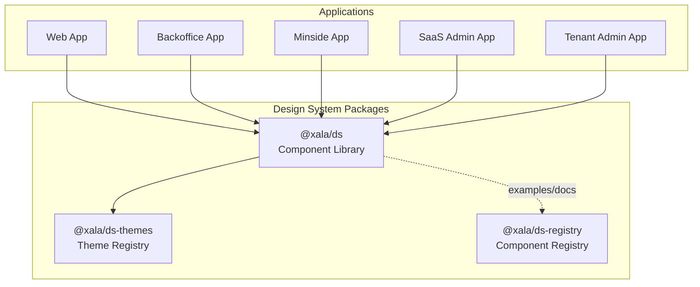
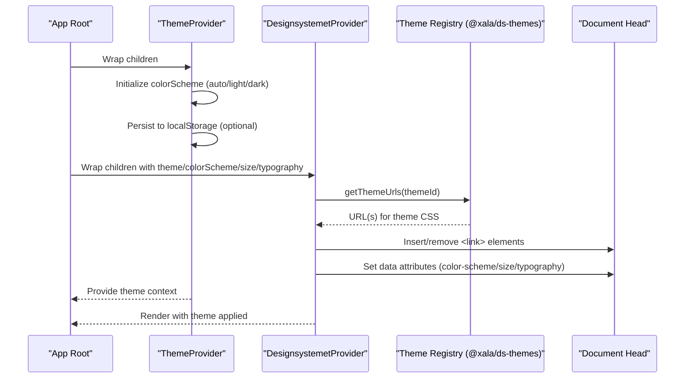
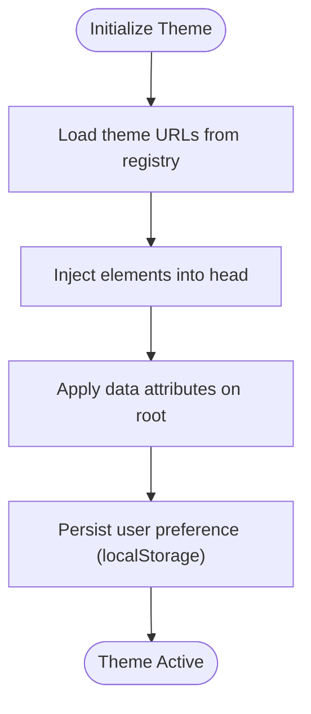
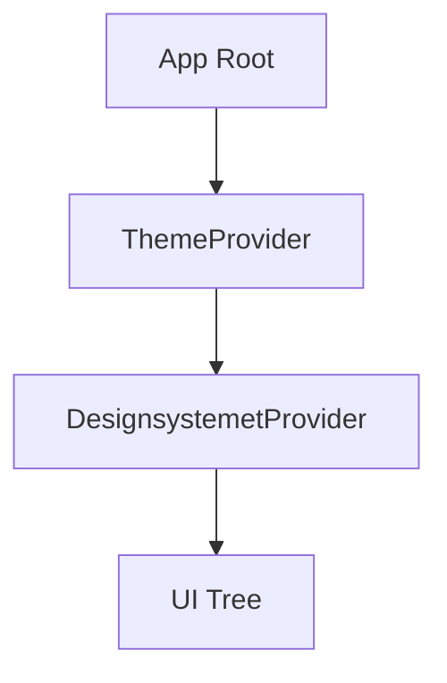
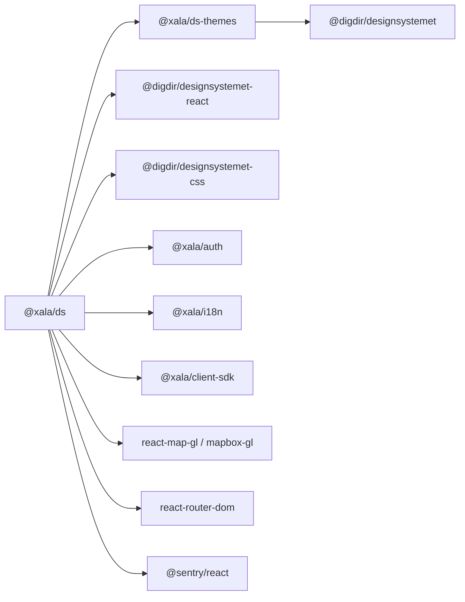

# Design System

<cite>
**Referenced Files in This Document**
- [packages/ds/package.json](file://packages/ds/package.json)
- [packages/ds/HEADER.md](file://packages/ds/HEADER.md)
- [packages/ds/STRUCTURE.md](file://packages/ds/STRUCTURE.md)
- [packages/ds/src/index.ts](file://packages/ds/src/index.ts)
- [packages/ds/src/provider.tsx](file://packages/ds/src/provider.tsx)
- [packages/ds/src/ThemeProvider.tsx](file://packages/ds/src/ThemeProvider.tsx)
- [packages/ds-themes/package.json](file://packages/ds-themes/package.json)
- [packages/ds-themes/src/index.ts](file://packages/ds-themes/src/index.ts)
- [packages/ds-registry/package.json](file://packages/ds-registry/package.json)
- [packages/ds-registry/src/index.ts](file://packages/ds-registry/src/index.ts)
- [apps/web/ACCESSIBILITY_GUIDE.md](file://apps/web/ACCESSIBILITY_GUIDE.md)
- [apps/web/src/components/App.tsx](file://apps/web/src/components/App.tsx)
- [apps/web/src/main.tsx](file://apps/web/src/main.tsx)
- [apps/backoffice/src/App.tsx](file://apps/backoffice/src/App.tsx)
- [apps/minside/src/App.tsx](file://apps/minside/src/App.tsx)
- [apps/saas-admin/src/App.tsx](file://apps/saas-admin/src/App.tsx)
- [apps/tenant-admin/src/App.tsx](file://apps/tenant-admin/src/App.tsx)
</cite>

## Table of Contents
1. [Introduction](#introduction)
2. [Project Structure](#project-structure)
3. [Core Components](#core-components)
4. [Architecture Overview](#architecture-overview)
5. [Detailed Component Analysis](#detailed-component-analysis)
6. [Dependency Analysis](#dependency-analysis)
7. [Performance Considerations](#performance-considerations)
8. [Troubleshooting Guide](#troubleshooting-guide)
9. [Conclusion](#conclusion)
10. [Appendices](#appendices)

## Introduction
This document describes the Xala/Digilist Design System that powers shared UI across all Xala applications. It covers the component library organization (primitives, composed, blocks, and shells), the theme system and design token pipeline, CSS-in-JS and provider architecture, component APIs, accessibility and responsive design, usage patterns, evolution and deprecation policy, and contribution guidelines for extending the system.

## Project Structure
The design system is delivered as a set of coordinated packages:
- @xala/ds: The main component library that re-exports Digdir components and adds Xala-specific primitives, composed, blocks, and shells.
- @xala/ds-themes: Theme registry and runtime theme switching utilities.
- @xala/ds-registry: Component registry and examples for discoverability and documentation.

**Diagram sources**
- [packages/ds/package.json](file://packages/ds/package.json#L1-L42)
- [packages/ds-themes/package.json](file://packages/ds-themes/package.json#L1-L27)
- [packages/ds-registry/package.json](file://packages/ds-registry/package.json#L1-L45)

**Section sources**
- [packages/ds/STRUCTURE.md](file://packages/ds/STRUCTURE.md#L1-L154)
- [packages/ds/package.json](file://packages/ds/package.json#L1-L42)
- [packages/ds-themes/package.json](file://packages/ds-themes/package.json#L1-L27)
- [packages/ds-registry/package.json](file://packages/ds-registry/package.json#L1-L45)

## Core Components
The design system organizes components into layers:
- Primitives: Low-level layout and UI atoms (e.g., Container, Grid, Stack, Icon, Card, Text, Badge, FormField, Progress, CodeBlock, NativeSelect).
- Composed: Mid-level patterns built from primitives (e.g., ContentLayout, ContentSection, PageHeader, AppHeader and related header parts, Navigation, FilterBar, Drawer, Breadcrumb, BookingStepper, BottomNavigation, dialogs, GlobalSearch, ProtectedRoute, and data-page components).
- Blocks: Business-focused components assembled from composed elements (e.g., rental object detail and booking components, charts, auth screens, messaging, error handling, GDPR components).
- Shells: Application-level layouts (e.g., AppShell, AppLayout).

The package exports a comprehensive surface area while re-exporting Digdir Designsystemet components, ensuring consistent styling and behavior across apps.

**Section sources**
- [packages/ds/src/index.ts](file://packages/ds/src/index.ts#L1-L596)
- [packages/ds/STRUCTURE.md](file://packages/ds/STRUCTURE.md#L38-L68)

## Architecture Overview
The design system’s runtime theming combines two complementary providers:
- ThemeProvider: Manages light/dark/auto mode, persists user preference, and computes effective dark state.
- DesignsystemetProvider: Loads theme CSS files dynamically, supports multi-file themes, and applies data attributes for color scheme, size, and typography.

**Diagram sources**
- [packages/ds/src/ThemeProvider.tsx](file://packages/ds/src/ThemeProvider.tsx#L45-L112)
- [packages/ds/src/provider.tsx](file://packages/ds/src/provider.tsx#L102-L129)
- [packages/ds-themes/src/index.ts](file://packages/ds-themes/src/index.ts#L49-L55)

**Section sources**
- [packages/ds/src/ThemeProvider.tsx](file://packages/ds/src/ThemeProvider.tsx#L1-L120)
- [packages/ds/src/provider.tsx](file://packages/ds/src/provider.tsx#L1-L130)
- [packages/ds-themes/src/index.ts](file://packages/ds-themes/src/index.ts#L1-L56)

## Detailed Component Analysis

### Theme System and Token Pipeline
- Theme registry: Defines official Digdir themes and the Digilist theme as a base plus extension CSS files. Exposes a function to resolve theme URLs consistently.
- Runtime switching: The provider injects theme CSS via <link> elements and removes old links to prevent conflicts. It also sets data attributes on the root element for CSS targeting.
- Persistence: ThemeProvider stores user preference in localStorage and respects system preference when set to auto.

**Diagram sources**
- [packages/ds-themes/src/index.ts](file://packages/ds-themes/src/index.ts#L38-L55)
- [packages/ds/src/provider.tsx](file://packages/ds/src/provider.tsx#L73-L89)
- [packages/ds/src/ThemeProvider.tsx](file://packages/ds/src/ThemeProvider.tsx#L46-L91)

**Section sources**
- [packages/ds-themes/src/index.ts](file://packages/ds-themes/src/index.ts#L1-L56)
- [packages/ds/src/provider.tsx](file://packages/ds/src/provider.tsx#L1-L130)
- [packages/ds/src/ThemeProvider.tsx](file://packages/ds/src/ThemeProvider.tsx#L1-L120)

### Provider Composition in Applications
Applications wrap their roots with ThemeProvider and DesignsystemetProvider to activate theming and ensure consistent CSS loading.

**Diagram sources**
- [apps/web/src/main.tsx](file://apps/web/src/main.tsx#L1-L50)
- [apps/web/src/components/App.tsx](file://apps/web/src/components/App.tsx#L1-L120)
- [apps/backoffice/src/App.tsx](file://apps/backoffice/src/App.tsx#L1-L120)
- [apps/minside/src/App.tsx](file://apps/minside/src/App.tsx#L1-L120)
- [apps/saas-admin/src/App.tsx](file://apps/saas-admin/src/App.tsx#L1-L120)
- [apps/tenant-admin/src/App.tsx](file://apps/tenant-admin/src/App.tsx#L1-L120)

**Section sources**
- [apps/web/src/main.tsx](file://apps/web/src/main.tsx#L1-L50)
- [apps/web/src/components/App.tsx](file://apps/web/src/components/App.tsx#L1-L120)

### Component Categories and Examples
- Header system: AppHeader and related parts (Logo, Search, Actions, ThemeToggle, LanguageSwitch, LoginButton) demonstrate a cohesive header pattern with accessibility and integration guidance.
- Component hierarchy and migration: The structure document outlines the layering and migration history of components into @xala/ds.

**Section sources**
- [packages/ds/HEADER.md](file://packages/ds/HEADER.md#L1-L124)
- [packages/ds/STRUCTURE.md](file://packages/ds/STRUCTURE.md#L1-L154)

### Component API Reference (Selected)
Note: The following entries summarize the exported APIs. For precise prop definitions, refer to the source files.

- Providers
  - ThemeProvider: Props include children and storageKey. Exposes toggleTheme, setColorScheme, resetToAuto, and computed isDark.
  - DesignsystemetProvider: Props include children, theme, colorScheme, size, typography, and rootAs. Applies data attributes and manages CSS injection.
- Primitives
  - Container, Grid, Stack, Icon, Card, Text, Badge, FormField, Progress, CodeBlock, NativeSelect, and many icons.
- Composed
  - ContentLayout, ContentSection, PageHeader, AppHeader and header parts, Navigation, FilterBar, Drawer, Breadcrumb, BookingStepper, BottomNavigation, dialogs, GlobalSearch, ProtectedRoute, and data-page components.
- Blocks
  - Rental object detail and booking components, charts, auth screens, messaging, error handling, GDPR components.
- Pages
  - LoginPage.

**Section sources**
- [packages/ds/src/index.ts](file://packages/ds/src/index.ts#L60-L596)
- [packages/ds/src/ThemeProvider.tsx](file://packages/ds/src/ThemeProvider.tsx#L27-L119)
- [packages/ds/src/provider.tsx](file://packages/ds/src/provider.tsx#L44-L129)

### Accessibility and Responsive Patterns
- Accessibility guidance exists in the web application documentation.
- Responsive defaults and spacing are defined in the structure document.
- Providers apply data attributes enabling CSS-driven responsive behavior.

**Section sources**
- [apps/web/ACCESSIBILITY_GUIDE.md](file://apps/web/ACCESSIBILITY_GUIDE.md#L1-L200)
- [packages/ds/STRUCTURE.md](file://packages/ds/STRUCTURE.md#L148-L154)
- [packages/ds/src/provider.tsx](file://packages/ds/src/provider.tsx#L114-L118)

### Usage Examples and Integration Patterns
- Import components from @xala/ds and compose them according to the layered architecture.
- Use ThemeProvider and DesignsystemetProvider at the app root.
- For header patterns, see the header documentation and examples.

**Section sources**
- [packages/ds/STRUCTURE.md](file://packages/ds/STRUCTURE.md#L69-L94)
- [packages/ds/HEADER.md](file://packages/ds/HEADER.md#L13-L25)

### Design System Evolution, Deprecation, and Contribution
- Migration guide: The structure document documents migration phases and usage notes for migrated components.
- Contribution: The registry package provides examples and guidelines for component documentation and patterns.

**Section sources**
- [packages/ds/STRUCTURE.md](file://packages/ds/STRUCTURE.md#L103-L147)
- [packages/ds-registry/src/index.ts](file://packages/ds-registry/src/index.ts#L1-L36)

## Dependency Analysis
The design system package depends on Digdir Designsystemet libraries, the theme registry, Sentry, authentication, i18n, and mapping libraries. The theme registry package depends on the Digdir theme generator and exposes theme URLs and helpers.

**Diagram sources**
- [packages/ds/package.json](file://packages/ds/package.json#L22-L35)
- [packages/ds-themes/package.json](file://packages/ds-themes/package.json#L20-L26)

**Section sources**
- [packages/ds/package.json](file://packages/ds/package.json#L1-L42)
- [packages/ds-themes/package.json](file://packages/ds-themes/package.json#L1-L27)

## Performance Considerations
- Theme switching avoids full page reloads by injecting/removing CSS links dynamically.
- Keep theme CSS minimal and load only once per app entry point to prevent duplication.
- Prefer CSS-driven responsive patterns (data attributes) for efficient rendering.

[No sources needed since this section provides general guidance]

## Troubleshooting Guide
- Theme not applying: Verify that the app root wraps ThemeProvider and DesignsystemetProvider and that CSS is imported exactly once at the entry point.
- Conflicting styles: Ensure no duplicate theme CSS imports and that getThemeUrls resolves to the intended theme files.
- Persistent theme not sticking: Confirm localStorage key usage and that resetToAuto clears stored preference when needed.

**Section sources**
- [packages/ds/src/provider.tsx](file://packages/ds/src/provider.tsx#L73-L89)
- [packages/ds/src/ThemeProvider.tsx](file://packages/ds/src/ThemeProvider.tsx#L79-L91)
- [packages/ds/src/index.ts](file://packages/ds/src/index.ts#L589-L596)

## Conclusion
The Xala Design System provides a structured, layered component library built on Digdir Designsystemet, with robust theming and a clear migration path. By composing primitives into composed components, assembling them into blocks, and wrapping applications with appropriate providers, teams can maintain consistency, accessibility, and responsiveness across Xala applications.

[No sources needed since this section summarizes without analyzing specific files]

## Appendices

### Appendix A: Provider Composition Checklist
- Wrap app root with ThemeProvider and DesignsystemetProvider.
- Ensure CSS is imported exactly once at the application entry point.
- Verify theme URLs and data attributes are applied.

**Section sources**
- [packages/ds/src/ThemeProvider.tsx](file://packages/ds/src/ThemeProvider.tsx#L45-L112)
- [packages/ds/src/provider.tsx](file://packages/ds/src/provider.tsx#L102-L129)
- [packages/ds/src/index.ts](file://packages/ds/src/index.ts#L589-L596)

### Appendix B: Component Layering Reference
- Primitives: Layout and atomic UI elements.
- Composed: Patterns built from primitives.
- Blocks: Business logic components.
- Shells: Application-level layouts.

**Section sources**
- [packages/ds/STRUCTURE.md](file://packages/ds/STRUCTURE.md#L38-L68)