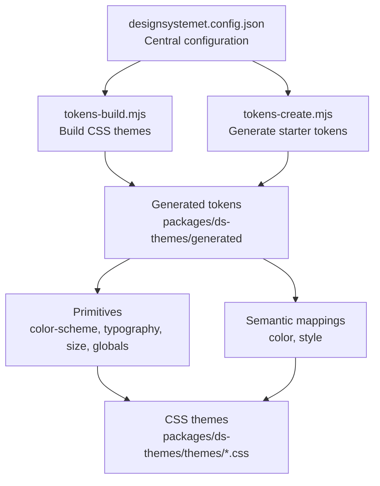
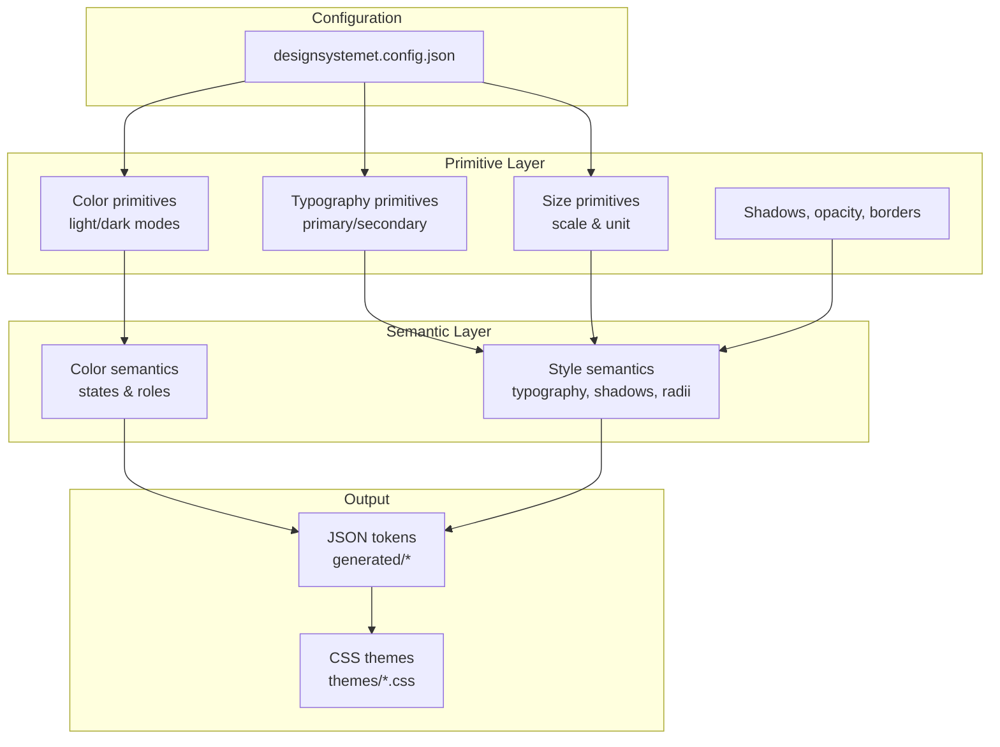
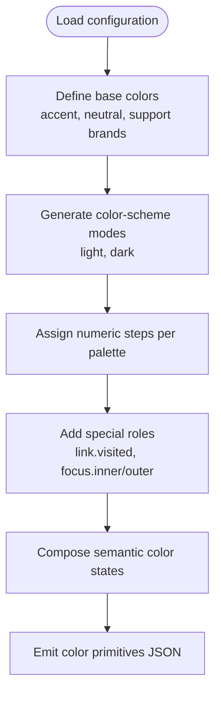
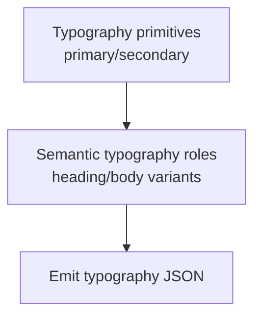
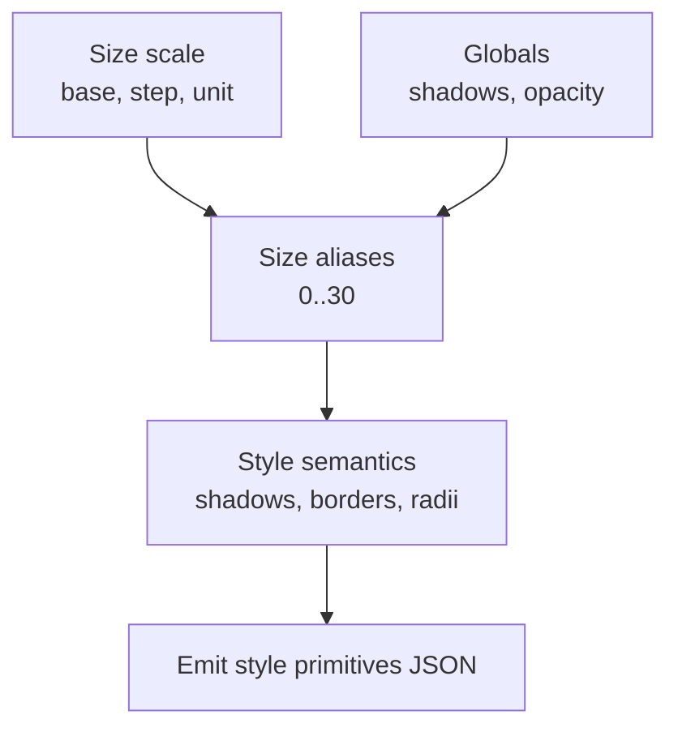
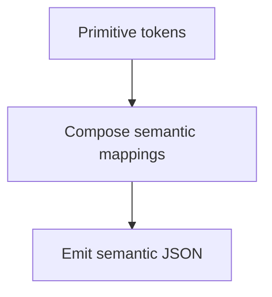
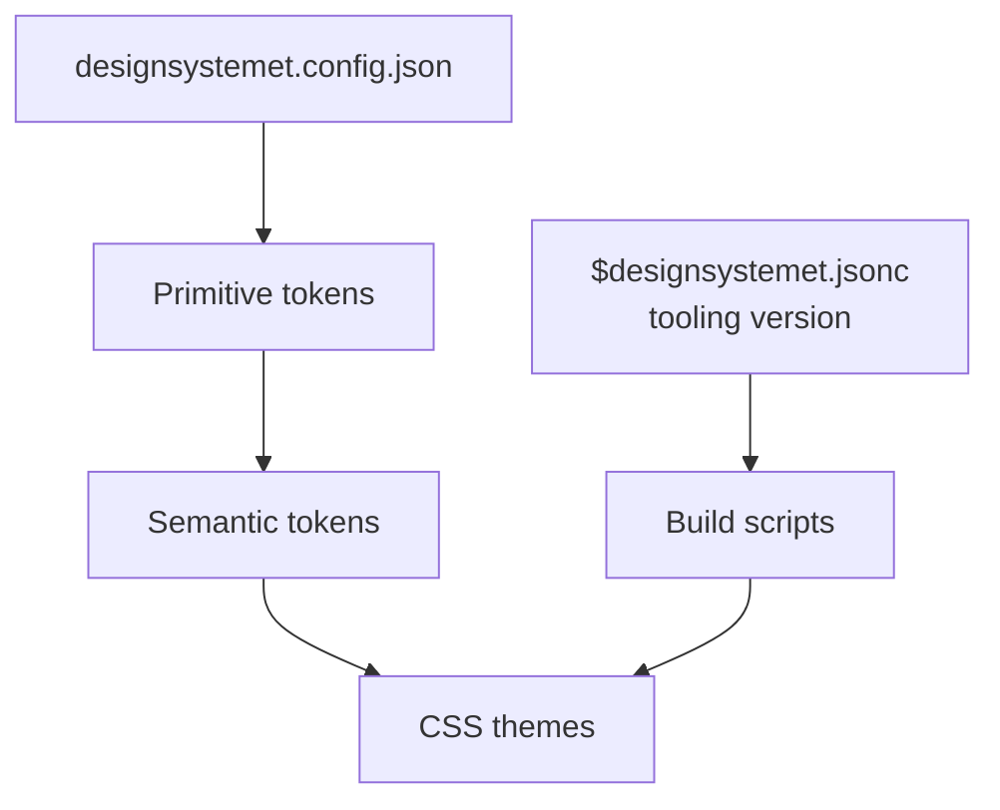

# Design Tokens

<cite>
**Referenced Files in This Document**
- [designsystemet.config.json](file://designsystemet.config.json)
- [tokens-build.mjs](file://packages/ds-themes/scripts/tokens-build.mjs)
- [tokens-create.mjs](file://packages/ds-themes/scripts/tokens-create.mjs)
- [globals.json](file://packages/ds-themes/generated/primitives/globals.json)
- [light digilist.json](file://packages/ds-themes/generated/primitives/modes/color-scheme/light/digilist.json)
- [dark digilist.json](file://packages/ds-themes/generated/primitives/modes/color-scheme/dark/digilist.json)
- [global size.json](file://packages/ds-themes/generated/primitives/modes/size/global.json)
- [primary typography.json](file://packages/ds-themes/generated/primitives/modes/typography/primary/digilist.json)
- [secondary typography.json](file://packages/ds-themes/generated/primitives/modes/typography/secondary/digilist.json)
- [semantic color.json](file://packages/ds-themes/generated/semantic/color.json)
- [semantic style.json](file://packages/ds-themes/generated/semantic/style.json)
- [$designsystemet.jsonc](file://packages/ds-themes/generated/$designsystemet.jsonc)
</cite>

## Table of Contents
1. [Introduction](#introduction)
2. [Project Structure](#project-structure)
3. [Core Components](#core-components)
4. [Architecture Overview](#architecture-overview)
5. [Detailed Component Analysis](#detailed-component-analysis)
6. [Dependency Analysis](#dependency-analysis)
7. [Performance Considerations](#performance-considerations)
8. [Troubleshooting Guide](#troubleshooting-guide)
9. [Conclusion](#conclusion)
10. [Appendices](#appendices)

## Introduction
This document describes the design token system architecture used across the monorepo. It covers primitive tokens (colors, typography, spacing, shadows, borders), semantic tokens (component-level mappings), token hierarchy, naming conventions, value types, and the automated build pipeline. It also provides practical guidance for adding and updating tokens, maintaining consistency across design and development, and consuming tokens in components and CSS.

## Project Structure
The design token system is driven by a centralized configuration and an automated build pipeline that generates JSON tokens and CSS themes. The key elements are:
- Central configuration that defines theme colors and sizes
- Scripts that invoke the design system toolkit to generate tokens and CSS
- Generated token sets organized by type and mode (e.g., color scheme, typography)
- Semantic mappings that connect primitives to component semantics



**Diagram sources**
- [designsystemet.config.json](file://designsystemet.config.json#L1-L21)
- [tokens-build.mjs](file://packages/ds-themes/scripts/tokens-build.mjs#L1-L9)
- [tokens-create.mjs](file://packages/ds-themes/scripts/tokens-create.mjs#L1-L9)

**Section sources**
- [designsystemet.config.json](file://designsystemet.config.json#L1-L21)
- [tokens-build.mjs](file://packages/ds-themes/scripts/tokens-build.mjs#L1-L9)
- [tokens-create.mjs](file://packages/ds-themes/scripts/tokens-create.mjs#L1-L9)

## Core Components
- Primitive tokens define base values such as colors, typography scales, spacing units, shadows, and opacity. They are organized by mode (e.g., color scheme, typography family, size scale).
- Semantic tokens map primitives to component-level meanings (e.g., surface/background states, focus rings, typography roles).
- The build pipeline consumes the central configuration and produces JSON token files and CSS themes.

Key primitive token categories:
- Color primitives: palette families (accent, neutral, support brands) with numeric steps and special roles (e.g., link visited, focus inner/outer).
- Typography primitives: font families and weights for primary and secondary stacks.
- Size primitives: a modular scale with base, step, and unit calculations.
- Shadow and opacity primitives: predefined shadow layers and opacity values.
- Border width and radius primitives: standardized stroke widths and corner radii.

Key semantic token categories:
- Color semantics: background/surface states, borders, and text roles per palette family.
- Style semantics: typography roles (headings/body/variants), border widths, shadows, border radii, and size scale aliases.

**Section sources**
- [globals.json](file://packages/ds-themes/generated/primitives/globals.json#L1-L143)
- [light digilist.json](file://packages/ds-themes/generated/primitives/modes/color-scheme/light/digilist.json#L1-L614)
- [dark digilist.json](file://packages/ds-themes/generated/primitives/modes/color-scheme/dark/digilist.json#L1-L614)
- [global size.json](file://packages/ds-themes/generated/primitives/modes/size/global.json#L1-L100)
- [primary typography.json](file://packages/ds-themes/generated/primitives/modes/typography/primary/digilist.json#L1-L22)
- [secondary typography.json](file://packages/ds-themes/generated/primitives/modes/typography/secondary/digilist.json#L1-L22)
- [semantic color.json](file://packages/ds-themes/generated/semantic/color.json#L1-L616)
- [semantic style.json](file://packages/ds-themes/generated/semantic/style.json#L1-L378)

## Architecture Overview
The token architecture follows a layered model:
- Configuration layer: declares theme identity and base values.
- Primitive layer: atomic values grouped by mode.
- Semantic layer: component semantics built from primitives.
- Output layer: JSON tokens and CSS themes.



**Diagram sources**
- [designsystemet.config.json](file://designsystemet.config.json#L1-L21)
- [globals.json](file://packages/ds-themes/generated/primitives/globals.json#L1-L143)
- [light digilist.json](file://packages/ds-themes/generated/primitives/modes/color-scheme/light/digilist.json#L1-L614)
- [dark digilist.json](file://packages/ds-themes/generated/primitives/modes/color-scheme/dark/digilist.json#L1-L614)
- [global size.json](file://packages/ds-themes/generated/primitives/modes/size/global.json#L1-L100)
- [primary typography.json](file://packages/ds-themes/generated/primitives/modes/typography/primary/digilist.json#L1-L22)
- [secondary typography.json](file://packages/ds-themes/generated/primitives/modes/typography/secondary/digilist.json#L1-L22)
- [semantic color.json](file://packages/ds-themes/generated/semantic/color.json#L1-L616)
- [semantic style.json](file://packages/ds-themes/generated/semantic/style.json#L1-L378)

## Detailed Component Analysis

### Token Hierarchy and Naming Conventions
- Primitive tokens are named by category and mode, e.g., color-scheme/{light|dark}/digilist.json, typography/{primary|secondary}/digilist.json, size/global.json.
- Semantic tokens group by role, e.g., semantic/color.json organizes color states per palette family; semantic/style.json groups typography, shadows, borders, radii, and sizes.
- Value types are declared via a dedicated field indicating the type (e.g., color, typography, dimension, borderWidth, boxShadow, opacity, fontFamilies, fontWeights).
- Inter-token references use brace syntax to compose values from other tokens (e.g., typography values reference font-size, font-family, font-weight, line-height, letter-spacing).

Examples of naming and composition:
- Color palette families: accent, neutral, brand1–brand3, info, success, warning, danger, link, focus.
- Color states: background-default, background-tinted, surface-default, surface-tinted, surface-hover, surface-active, border-subtle, border-default, border-strong, text-subtle, text-default, base-default, base-hover, base-active, base-contrast-subtle, base-contrast-default.
- Typography roles: heading sizes (2xl to 2xs), body sizes (xl to xs), and variants (short/long).
- Size aliases: 0–30 and special keys like base, step, unit derived from the size scale.

**Section sources**
- [semantic color.json](file://packages/ds-themes/generated/semantic/color.json#L1-L616)
- [semantic style.json](file://packages/ds-themes/generated/semantic/style.json#L1-L378)
- [globals.json](file://packages/ds-themes/generated/primitives/globals.json#L1-L143)
- [light digilist.json](file://packages/ds-themes/generated/primitives/modes/color-scheme/light/digilist.json#L1-L614)
- [dark digilist.json](file://packages/ds-themes/generated/primitives/modes/color-scheme/dark/digilist.json#L1-L614)
- [global size.json](file://packages/ds-themes/generated/primitives/modes/size/global.json#L1-L100)
- [primary typography.json](file://packages/ds-themes/generated/primitives/modes/typography/primary/digilist.json#L1-L22)
- [secondary typography.json](file://packages/ds-themes/generated/primitives/modes/typography/secondary/digilist.json#L1-L22)

### Token Build Process and Automated Workflow
The build process is orchestrated by two scripts:
- tokens-create.mjs: generates starter token files based on the configuration.
- tokens-build.mjs: builds CSS themes from the generated tokens.

The scripts rely on the design system toolkit and require a specific version indicated in the generated metadata.

```mermaid
sequenceDiagram
participant Dev as "Developer"
participant Create as "tokens-create.mjs"
participant Build as "tokens-build.mjs"
participant DS as "@digdir/designsystemet"
participant Gen as "Generated tokens"
participant CSS as "CSS themes"
Dev->>Create : Run starter token creation
Create->>DS : Invoke tokens create with config
DS-->>Gen : Generate primitive and semantic JSON
Dev->>Build : Run build to produce CSS
Build->>DS : Invoke tokens build with config
DS-->>CSS : Emit themes/*.css
```

**Diagram sources**
- [tokens-create.mjs](file://packages/ds-themes/scripts/tokens-create.mjs#L1-L9)
- [tokens-build.mjs](file://packages/ds-themes/scripts/tokens-build.mjs#L1-L9)
- [$designsystemet.jsonc](file://packages/ds-themes/generated/$designsystemet.jsonc#L1-L4)

**Section sources**
- [tokens-create.mjs](file://packages/ds-themes/scripts/tokens-create.mjs#L1-L9)
- [tokens-build.mjs](file://packages/ds-themes/scripts/tokens-build.mjs#L1-L9)
- [$designsystemet.jsonc](file://packages/ds-themes/generated/$designsystemet.jsonc#L1-L4)

### Primitive Tokens: Colors
- Color primitives are defined per palette family and color scheme mode. Each palette includes multiple steps and special roles (e.g., link visited, focus inner/outer).
- The configuration declares base colors and borderRadius, which feed into higher-level semantic tokens.



**Diagram sources**
- [designsystemet.config.json](file://designsystemet.config.json#L4-L19)
- [light digilist.json](file://packages/ds-themes/generated/primitives/modes/color-scheme/light/digilist.json#L1-L614)
- [dark digilist.json](file://packages/ds-themes/generated/primitives/modes/color-scheme/dark/digilist.json#L1-L614)
- [semantic color.json](file://packages/ds-themes/generated/semantic/color.json#L1-L616)

**Section sources**
- [designsystemet.config.json](file://designsystemet.config.json#L4-L19)
- [light digilist.json](file://packages/ds-themes/generated/primitives/modes/color-scheme/light/digilist.json#L1-L614)
- [dark digilist.json](file://packages/ds-themes/generated/primitives/modes/color-scheme/dark/digilist.json#L1-L614)
- [semantic color.json](file://packages/ds-themes/generated/semantic/color.json#L1-L616)

### Primitive Tokens: Typography
- Typography primitives define font families and weights for primary and secondary stacks.
- These are referenced by semantic typography roles to ensure consistent typographic scale and rhythm.



**Diagram sources**
- [primary typography.json](file://packages/ds-themes/generated/primitives/modes/typography/primary/digilist.json#L1-L22)
- [secondary typography.json](file://packages/ds-themes/generated/primitives/modes/typography/secondary/digilist.json#L1-L22)
- [semantic style.json](file://packages/ds-themes/generated/semantic/style.json#L1-L231)

**Section sources**
- [primary typography.json](file://packages/ds-themes/generated/primitives/modes/typography/primary/digilist.json#L1-L22)
- [secondary typography.json](file://packages/ds-themes/generated/primitives/modes/typography/secondary/digilist.json#L1-L22)
- [semantic style.json](file://packages/ds-themes/generated/semantic/style.json#L1-L231)

### Primitive Tokens: Spacing, Shadows, Borders, Opacity
- Spacing is defined by a modular scale with base, step, and unit calculations.
- Shadows are predefined layers with layered box-shadow configurations.
- Opacity includes a disabled state value.
- Border width and radius primitives standardize strokes and corner radii.



**Diagram sources**
- [global size.json](file://packages/ds-themes/generated/primitives/modes/size/global.json#L1-L100)
- [globals.json](file://packages/ds-themes/generated/primitives/globals.json#L1-L143)
- [semantic style.json](file://packages/ds-themes/generated/semantic/style.json#L232-L378)

**Section sources**
- [global size.json](file://packages/ds-themes/generated/primitives/modes/size/global.json#L1-L100)
- [globals.json](file://packages/ds-themes/generated/primitives/globals.json#L1-L143)
- [semantic style.json](file://packages/ds-themes/generated/semantic/style.json#L232-L378)

### Semantic Tokens: Component-Level Mappings
- Color semantics map palette families to component roles (background/surface states, borders, text, base states, contrast).
- Style semantics map typography, shadows, borders, radii, and size aliases to component needs.



**Diagram sources**
- [semantic color.json](file://packages/ds-themes/generated/semantic/color.json#L1-L616)
- [semantic style.json](file://packages/ds-themes/generated/semantic/style.json#L1-L378)

**Section sources**
- [semantic color.json](file://packages/ds-themes/generated/semantic/color.json#L1-L616)
- [semantic style.json](file://packages/ds-themes/generated/semantic/style.json#L1-L378)

### Token Usage Patterns in Components and CSS Generation
- Components consume semantic tokens to remain theme-agnostic while preserving design intent.
- CSS themes are generated from semantic tokens, enabling consistent styling across applications.
- Token references enable dynamic theme switching by swapping primitive sets without changing component code.

[No sources needed since this section synthesizes usage patterns from the referenced token files]

## Dependency Analysis
The token system depends on:
- Central configuration to define theme identity and base values.
- Tooling version pinned in generated metadata to ensure reproducible builds.
- Primitive tokens as the foundation for semantic mappings.
- Semantic tokens as the contract for component-level styling.



**Diagram sources**
- [designsystemet.config.json](file://designsystemet.config.json#L1-L21)
- [tokens-build.mjs](file://packages/ds-themes/scripts/tokens-build.mjs#L1-L9)
- [$designsystemet.jsonc](file://packages/ds-themes/generated/$designsystemet.jsonc#L1-L4)

**Section sources**
- [designsystemet.config.json](file://designsystemet.config.json#L1-L21)
- [tokens-build.mjs](file://packages/ds-themes/scripts/tokens-build.mjs#L1-L9)
- [$designsystemet.jsonc](file://packages/ds-themes/generated/$designsystemet.jsonc#L1-L4)

## Performance Considerations
- Prefer semantic tokens in components to minimize cascade and reduce reflows when themes change.
- Keep primitive token sets concise and reuse values through references to avoid duplication.
- Use size aliases and modular scale to maintain proportional spacing across breakpoints and devices.
- Generate CSS once per theme and cache outputs to avoid repeated rebuilds during development.

[No sources needed since this section provides general guidance]

## Troubleshooting Guide
Common issues and resolutions:
- Version mismatch with the design system toolkit: Ensure the installed version matches the pinned version in generated metadata.
- Missing or outdated generated tokens: Re-run the starter token creation script, then rebuild CSS themes.
- Incorrect theme switching: Verify that the correct primitive set is selected for the active color scheme and that semantic tokens resolve to the intended primitive values.

**Section sources**
- [$designsystemet.jsonc](file://packages/ds-themes/generated/$designsystemet.jsonc#L1-L4)
- [tokens-create.mjs](file://packages/ds-themes/scripts/tokens-create.mjs#L1-L9)
- [tokens-build.mjs](file://packages/ds-themes/scripts/tokens-build.mjs#L1-L9)

## Conclusion
The design token system provides a structured, scalable approach to managing design and UI consistency across the monorepo. By separating primitives from semantics, organizing tokens by mode, and automating generation and CSS output, teams can evolve designs iteratively while keeping components decoupled from low-level values.

[No sources needed since this section summarizes without analyzing specific files]

## Appendices

### Adding New Tokens: Step-by-Step
- Extend the central configuration with new base values (e.g., additional brand colors or borderRadius adjustments).
- Regenerate starter tokens and rebuild CSS themes to incorporate new primitives.
- Add semantic mappings for component roles that consume the new primitives.
- Update components to use semantic tokens instead of hardcoded values.

**Section sources**
- [designsystemet.config.json](file://designsystemet.config.json#L1-L21)
- [tokens-create.mjs](file://packages/ds-themes/scripts/tokens-create.mjs#L1-L9)
- [tokens-build.mjs](file://packages/ds-themes/scripts/tokens-build.mjs#L1-L9)

### Updating Existing Tokens
- Modify the central configuration to adjust base values.
- Rebuild tokens and CSS to propagate changes.
- Review semantic mappings to ensure they still align with updated primitives.
- Test components across themes to confirm visual consistency.

**Section sources**
- [designsystemet.config.json](file://designsystemet.config.json#L1-L21)
- [tokens-build.mjs](file://packages/ds-themes/scripts/tokens-build.mjs#L1-L9)

### Maintaining Consistency Across Teams
- Enforce naming conventions and value types via documentation and review processes.
- Centralize configuration ownership and gate changes through pull requests.
- Automate generation and linting of token JSON to prevent drift.
- Document token usage in components and CSS-in-JS to guide consumption.

[No sources needed since this section provides general guidance]

### Examples of Token Consumption
- React components: consume semantic tokens to render consistent styles regardless of theme.
- CSS-in-JS: reference semantic tokens to compute styles dynamically based on theme mode.

[No sources needed since this section provides conceptual examples]