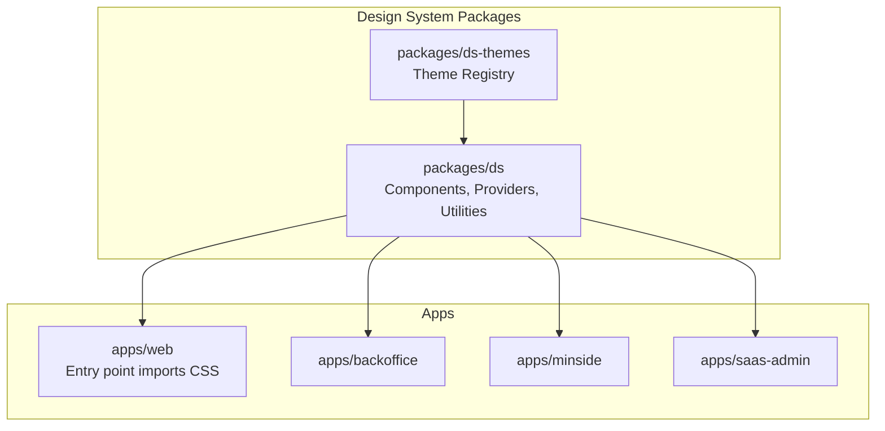
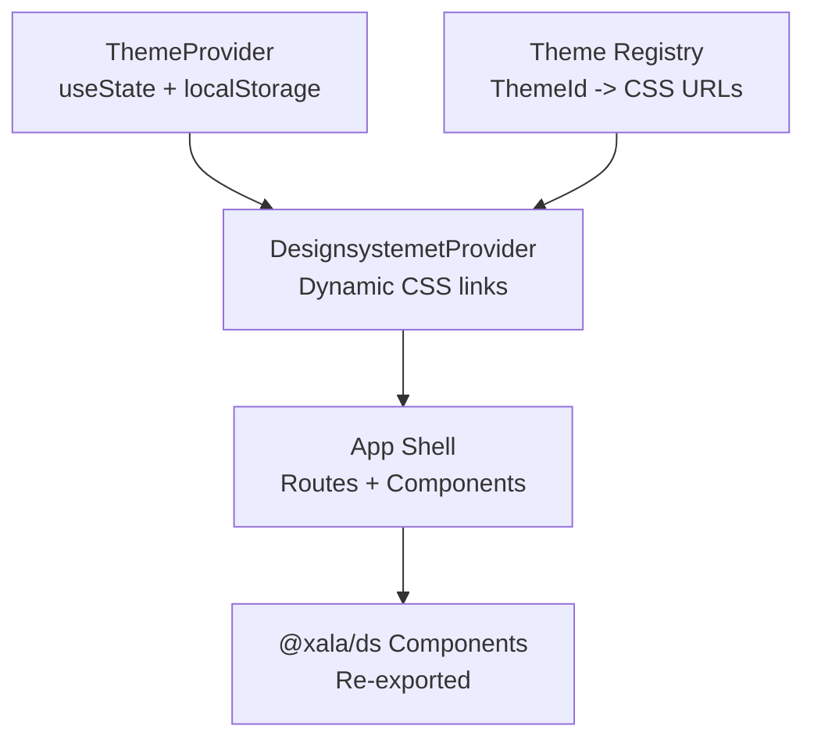
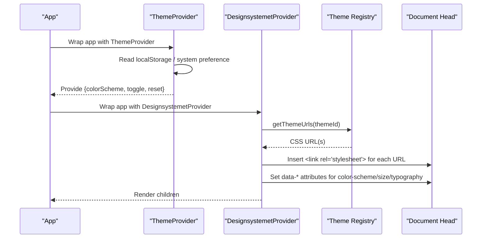
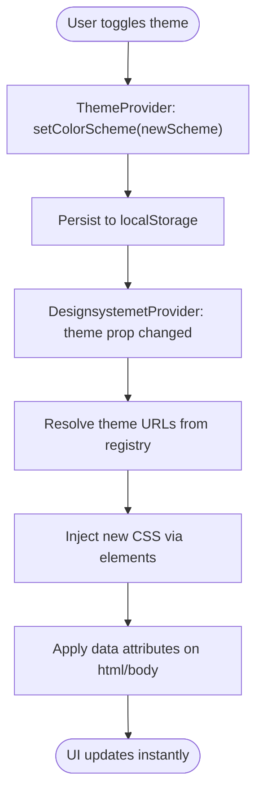
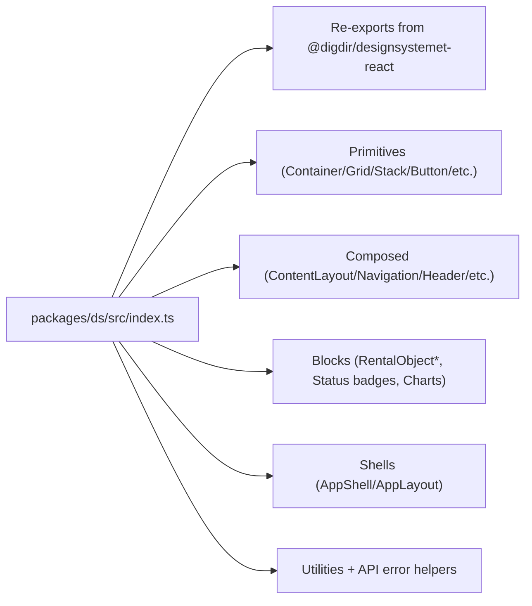
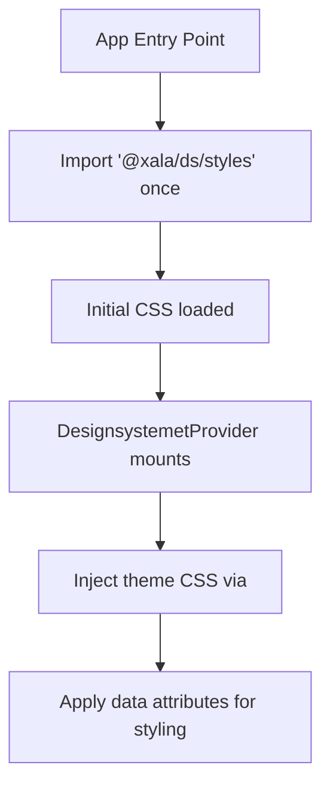
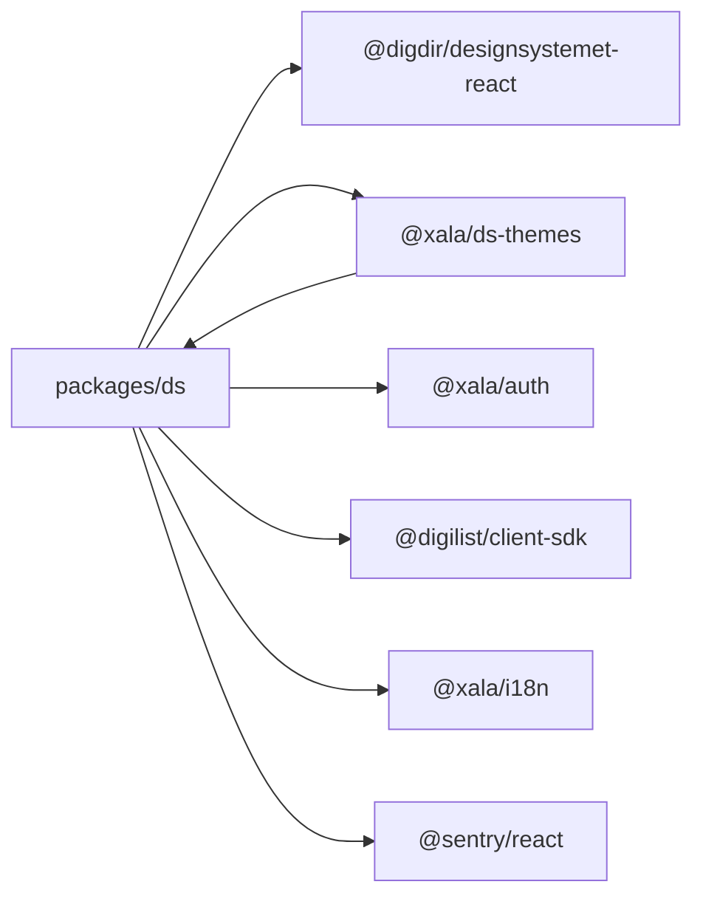

# Integration Guidelines

<cite>
**Referenced Files in This Document**
- [packages/ds/package.json](file://packages/ds/package.json)
- [packages/ds/src/index.ts](file://packages/ds/src/index.ts)
- [packages/ds/src/provider.tsx](file://packages/ds/src/provider.tsx)
- [packages/ds/src/ThemeProvider.tsx](file://packages/ds/src/ThemeProvider.tsx)
- [packages/ds-themes/package.json](file://packages/ds-themes/package.json)
- [packages/ds-themes/src/index.ts](file://packages/ds-themes/src/index.ts)
- [designsystemet.config.json](file://designsystemet.config.json)
- [apps/web/src/main.tsx](file://apps/web/src/main.tsx)
- [apps/web/src/App.tsx](file://apps/web/src/App.tsx)
- [apps/backoffice/src/App.tsx](file://apps/backoffice/src/App.tsx)
- [apps/minside/src/App.tsx](file://apps/minside/src/App.tsx)
- [apps/saas-admin/src/App.tsx](file://apps/saas-admin/src/App.tsx)
</cite>

## Table of Contents
1. [Introduction](#introduction)
2. [Project Structure](#project-structure)
3. [Core Components](#core-components)
4. [Architecture Overview](#architecture-overview)
5. [Detailed Component Analysis](#detailed-component-analysis)
6. [Dependency Analysis](#dependency-analysis)
7. [Performance Considerations](#performance-considerations)
8. [Troubleshooting Guide](#troubleshooting-guide)
9. [Conclusion](#conclusion)
10. [Appendices](#appendices)

## Introduction
This document provides end-to-end integration guidelines for implementing the Xala design system across Xala/Digilist applications. It covers provider architecture, theme provider setup, component registration patterns, CSS import policies, theme switching, and component consumption strategies. It also includes framework-specific integration examples (React, Next.js), build system configurations, deployment considerations, best practices, performance optimization, troubleshooting, and migration strategies for maintaining backward compatibility.

## Project Structure
The design system is delivered as a TypeScript/React package with theme management and provider utilities. Applications consume the design system by importing providers and components from the package, while ensuring a single CSS import at the application entry point.

**Diagram sources**
- [packages/ds/package.json](file://packages/ds/package.json#L1-L42)
- [packages/ds-themes/package.json](file://packages/ds-themes/package.json#L1-L27)
- [apps/web/src/main.tsx](file://apps/web/src/main.tsx#L1-L44)
- [apps/backoffice/src/App.tsx](file://apps/backoffice/src/App.tsx#L1-L445)
- [apps/minside/src/App.tsx](file://apps/minside/src/App.tsx#L1-L184)
- [apps/saas-admin/src/App.tsx](file://apps/saas-admin/src/App.tsx#L1-L93)

**Section sources**
- [packages/ds/package.json](file://packages/ds/package.json#L1-L42)
- [packages/ds-themes/package.json](file://packages/ds-themes/package.json#L1-L27)
- [apps/web/src/main.tsx](file://apps/web/src/main.tsx#L1-L44)

## Core Components
- DesignsystemetProvider: Dynamically manages theme CSS link injection and applies data attributes for color scheme, size, and typography.
- ThemeProvider: Manages light/dark/auto theme state, persists preferences, and computes effective dark state.
- Theme registry: Maps theme IDs to CSS URLs, supporting official themes and digilist with base + extension files.

Key integration points:
- Application entry point imports the design system CSS once.
- Providers wrap the app to supply theme and component context.
- Components are re-exported from the design system package for easy consumption.

**Section sources**
- [packages/ds/src/provider.tsx](file://packages/ds/src/provider.tsx#L1-L130)
- [packages/ds/src/ThemeProvider.tsx](file://packages/ds/src/ThemeProvider.tsx#L1-L120)
- [packages/ds-themes/src/index.ts](file://packages/ds-themes/src/index.ts#L1-L56)
- [packages/ds/src/index.ts](file://packages/ds/src/index.ts#L1-L596)

## Architecture Overview
The design system architecture centers on two providers and a theme registry:
- ThemeProvider manages user preference persistence and system preference detection.
- DesignsystemetProvider injects theme CSS and applies data attributes for styling.
- The theme registry resolves theme IDs to CSS URLs, enabling runtime theme switching without duplicating CSS.

**Diagram sources**
- [packages/ds/src/ThemeProvider.tsx](file://packages/ds/src/ThemeProvider.tsx#L1-L120)
- [packages/ds/src/provider.tsx](file://packages/ds/src/provider.tsx#L1-L130)
- [packages/ds-themes/src/index.ts](file://packages/ds-themes/src/index.ts#L1-L56)
- [packages/ds/src/index.ts](file://packages/ds/src/index.ts#L1-L596)

## Detailed Component Analysis

### Provider Architecture
- ThemeProvider
  - Stores user preference in localStorage keyed by a configurable storage key.
  - Computes effective dark mode based on auto/system or explicit selection.
  - Exposes toggle and reset utilities.
- DesignsystemetProvider
  - Resolves theme URLs from the theme registry.
  - Injects theme CSS via link elements in the document head.
  - Applies data attributes on html/body for CSS targeting.

**Diagram sources**
- [packages/ds/src/ThemeProvider.tsx](file://packages/ds/src/ThemeProvider.tsx#L1-L120)
- [packages/ds/src/provider.tsx](file://packages/ds/src/provider.tsx#L1-L130)
- [packages/ds-themes/src/index.ts](file://packages/ds-themes/src/index.ts#L1-L56)

**Section sources**
- [packages/ds/src/ThemeProvider.tsx](file://packages/ds/src/ThemeProvider.tsx#L1-L120)
- [packages/ds/src/provider.tsx](file://packages/ds/src/provider.tsx#L1-L130)
- [packages/ds-themes/src/index.ts](file://packages/ds-themes/src/index.ts#L1-L56)

### Theme Switching Implementation
- Runtime switching is achieved by updating the theme prop on DesignsystemetProvider.
- ThemeProvider persists the user’s choice and recomputes effective scheme.
- The theme registry supports multiple CSS files per theme (base + extensions), ensuring proper ordering.

**Diagram sources**
- [packages/ds/src/ThemeProvider.tsx](file://packages/ds/src/ThemeProvider.tsx#L1-L120)
- [packages/ds/src/provider.tsx](file://packages/ds/src/provider.tsx#L1-L130)
- [packages/ds-themes/src/index.ts](file://packages/ds-themes/src/index.ts#L1-L56)

**Section sources**
- [packages/ds/src/ThemeProvider.tsx](file://packages/ds/src/ThemeProvider.tsx#L1-L120)
- [packages/ds/src/provider.tsx](file://packages/ds/src/provider.tsx#L1-L130)
- [packages/ds-themes/src/index.ts](file://packages/ds-themes/src/index.ts#L1-L56)

### Component Registration Patterns
- The design system re-exports all underlying design system primitives and composes higher-level components.
- Applications import components directly from @xala/ds and use them within layouts and pages.

**Diagram sources**
- [packages/ds/src/index.ts](file://packages/ds/src/index.ts#L1-L596)

**Section sources**
- [packages/ds/src/index.ts](file://packages/ds/src/index.ts#L1-L596)

### CSS Import Policies
- Applications must import the design system CSS exactly once at the application entry point.
- The design system intentionally does not export Digdir CSS from its main module to prevent duplication and ensure controlled theme switching.
- Theme CSS is injected dynamically by the provider after the initial CSS import.

**Diagram sources**
- [apps/web/src/main.tsx](file://apps/web/src/main.tsx#L1-L44)
- [packages/ds/src/index.ts](file://packages/ds/src/index.ts#L588-L596)
- [packages/ds/src/provider.tsx](file://packages/ds/src/provider.tsx#L1-L130)

**Section sources**
- [apps/web/src/main.tsx](file://apps/web/src/main.tsx#L1-L44)
- [packages/ds/src/index.ts](file://packages/ds/src/index.ts#L588-L596)

### Component Consumption Strategies
- Import components from @xala/ds and compose them into layouts.
- Use DialogProvider and ErrorBoundary for global dialogs and error handling.
- Leverage ProtectedRoute for route protection and context-aware layouts.

Examples across applications:
- Web app demonstrates header composition with theme toggle and notifications.
- Backoffice app wraps providers around routing and uses ThemeProvider for consistent theme state.
- Minside app integrates account context and protected routes with theme support.
- SaaS Admin app uses DesignsystemetProvider with auto color scheme and md size.

**Section sources**
- [apps/web/src/App.tsx](file://apps/web/src/App.tsx#L1-L275)
- [apps/backoffice/src/App.tsx](file://apps/backoffice/src/App.tsx#L1-L445)
- [apps/minside/src/App.tsx](file://apps/minside/src/App.tsx#L1-L184)
- [apps/saas-admin/src/App.tsx](file://apps/saas-admin/src/App.tsx#L1-L93)

### Framework Integration Examples

#### React (Vite-based apps)
- Entry point imports @xala/ds/styles once.
- Providers wrap the app with ThemeProvider and DesignsystemetProvider.
- Components are imported from @xala/ds and used in routes/pages.

Integration steps:
- Ensure a single CSS import at the app entry point.
- Wrap the app with ThemeProvider and DesignsystemetProvider.
- Consume components from @xala/ds.

**Section sources**
- [apps/web/src/main.tsx](file://apps/web/src/main.tsx#L1-L44)
- [apps/web/src/App.tsx](file://apps/web/src/App.tsx#L1-L275)
- [apps/backoffice/src/App.tsx](file://apps/backoffice/src/App.tsx#L1-L445)
- [apps/minside/src/App.tsx](file://apps/minside/src/App.tsx#L1-L184)
- [apps/saas-admin/src/App.tsx](file://apps/saas-admin/src/App.tsx#L1-L93)

#### Next.js
- Place a single import of @xala/ds/styles in the application entry file (pages/_app.tsx or app/globals.ts).
- Wrap the application with ThemeProvider and DesignsystemetProvider at the top level.
- Import and use components from @xala/ds in pages and shared components.
- Ensure theme switching is handled via ThemeProvider and reflected in DesignsystemetProvider props.

[No sources needed since this section provides general guidance]

### Build System Configurations
- The design system package is source-only and intended to be consumed directly by bundlers.
- Theme token generation is configured via designsystemet.config.json, which defines output directories and theme tokens.
- Theme registry scripts generate tokens and build CSS assets.

Build tasks:
- Token creation and build tasks are exposed via package scripts in the themes package.

**Section sources**
- [packages/ds/package.json](file://packages/ds/package.json#L1-L42)
- [packages/ds-themes/package.json](file://packages/ds-themes/package.json#L1-L27)
- [designsystemet.config.json](file://designsystemet.config.json#L1-L21)

### Deployment Considerations
- Ensure the public/themes directory is served statically so theme CSS URLs resolve correctly.
- Verify that the initial CSS import occurs before any theme switching logic.
- For multi-tenant setups, configure theme IDs and URLs via the theme registry and ensure base + extension CSS files are deployed.

[No sources needed since this section provides general guidance]

## Dependency Analysis
The design system depends on the underlying design system package, theme registry, and other Xala packages. Applications depend on @xala/ds and wrap it with providers.

**Diagram sources**
- [packages/ds/package.json](file://packages/ds/package.json#L1-L42)
- [packages/ds-themes/package.json](file://packages/ds-themes/package.json#L1-L27)

**Section sources**
- [packages/ds/package.json](file://packages/ds/package.json#L1-L42)
- [packages/ds-themes/package.json](file://packages/ds-themes/package.json#L1-L27)

## Performance Considerations
- Theme switching avoids full page reloads by injecting/removing CSS links dynamically.
- Prefer a single CSS import at the entry point to avoid redundant stylesheet loading.
- Use lazy loading for heavy pages/components to minimize initial bundle size.
- Keep theme CSS minimal and scoped to reduce render impact.

[No sources needed since this section provides general guidance]

## Troubleshooting Guide
Common issues and resolutions:
- Duplicate CSS or conflicting styles
  - Cause: Multiple imports of design system CSS.
  - Resolution: Ensure only one import of @xala/ds/styles at the app entry point.
- Theme not applying
  - Cause: Missing theme CSS injection or incorrect theme ID.
  - Resolution: Verify DesignsystemetProvider receives a valid theme and that theme URLs resolve.
- Theme toggle not persisting
  - Cause: Local storage disabled or blocked.
  - Resolution: Check browser storage permissions and ensure ThemeProvider storage key is accessible.
- Auto mode not working
  - Cause: Media query listener not attached or SSR mismatch.
  - Resolution: Ensure system preference detection runs on the client and matches expected behavior.

**Section sources**
- [apps/web/src/main.tsx](file://apps/web/src/main.tsx#L1-L44)
- [packages/ds/src/provider.tsx](file://packages/ds/src/provider.tsx#L1-L130)
- [packages/ds/src/ThemeProvider.tsx](file://packages/ds/src/ThemeProvider.tsx#L1-L120)

## Conclusion
By following these integration guidelines, teams can consistently implement the Xala design system across applications. Central to success are single CSS imports, provider composition, theme registry usage, and disciplined component consumption. These practices ensure maintainable, performant, and visually consistent user experiences across Xala/Digilist applications.

## Appendices

### Migration Strategies and Backward Compatibility
- Gradual adoption
  - Start by adding ThemeProvider and DesignsystemetProvider to the app shell.
  - Replace layout primitives progressively with @xala/ds equivalents.
- Version alignment
  - Align @xala/ds and @xala/ds-themes versions with the project’s design system requirements.
- Breaking changes
  - Monitor re-exported component APIs from the underlying design system and adjust accordingly.
- Rollback plan
  - Keep a backup branch with previous component usage and revert to it if needed.

[No sources needed since this section provides general guidance]