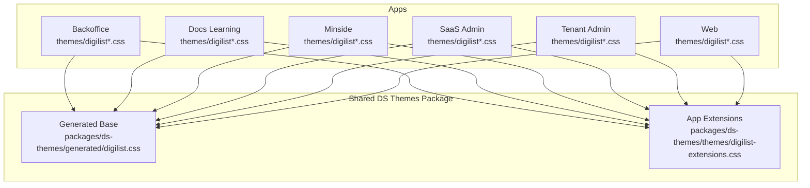
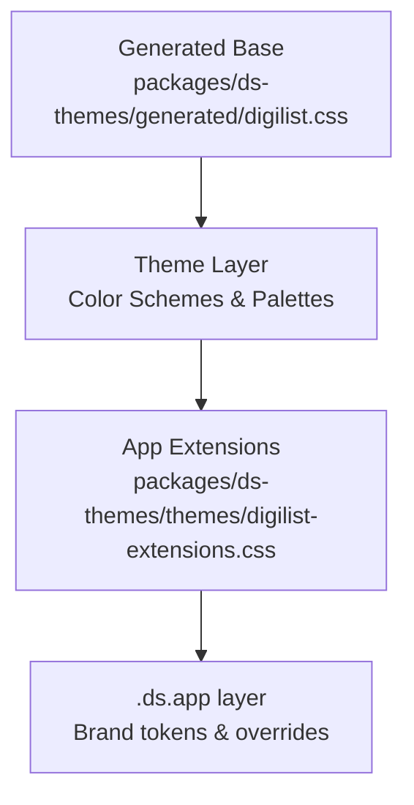
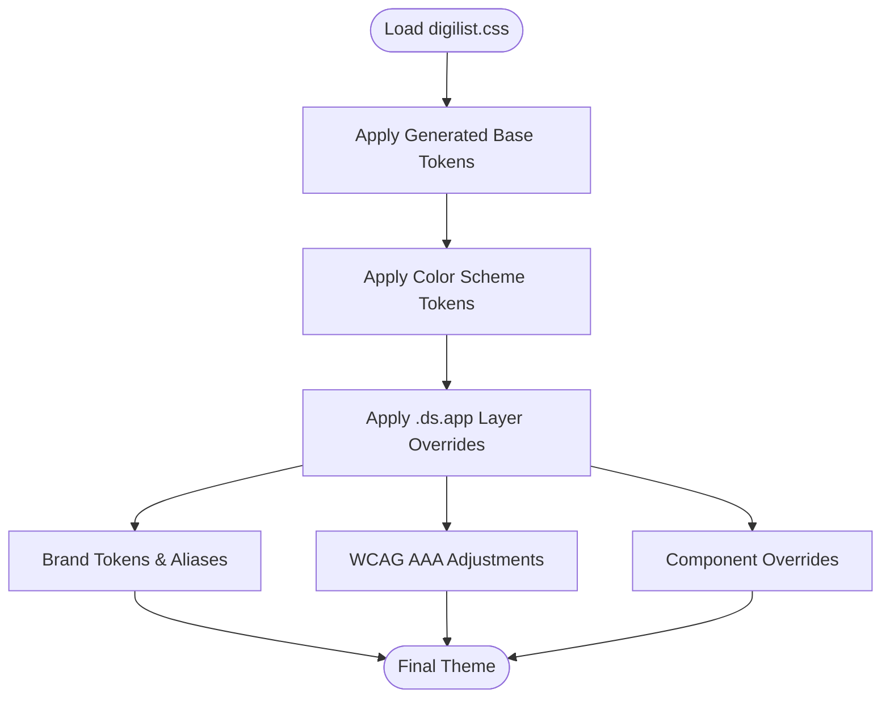
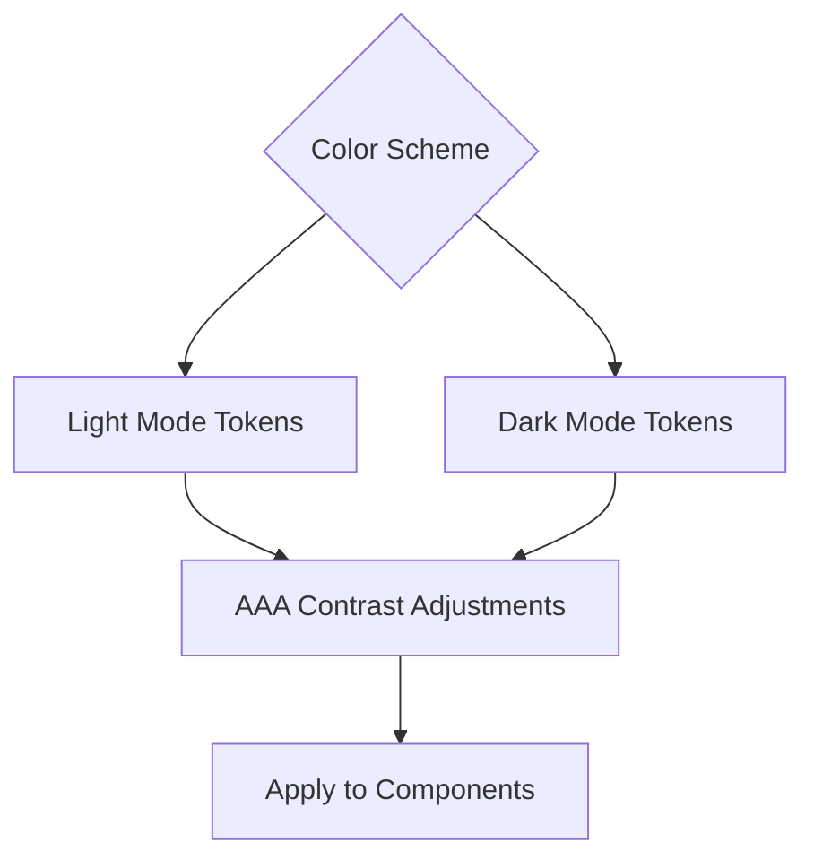
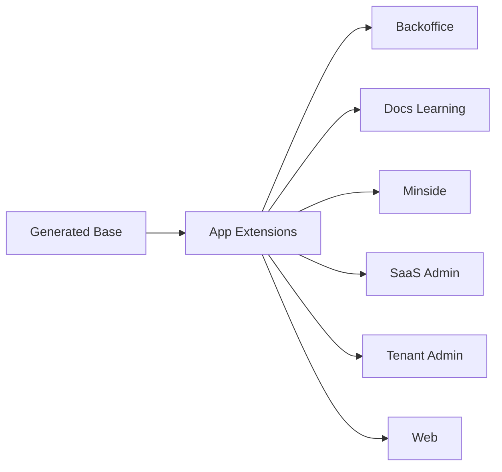

# Brand Customization & Extensions

<cite>
**Referenced Files in This Document**
- [apps/backoffice/public/themes/digilist.css](file://apps/backoffice/public/themes/digilist.css)
- [apps/backoffice/public/themes/digilist-extensions.css](file://apps/backoffice/public/themes/digilist-extensions.css)
- [apps/docs-learning/public/themes/digilist.css](file://apps/docs-learning/public/themes/digilist.css)
- [apps/docs-learning/public/themes/digilist-extensions.css](file://apps/docs-learning/public/themes/digilist-extensions.css)
- [apps/minside/public/themes/digilist.css](file://apps/minside/public/themes/digilist.css)
- [apps/minside/public/themes/digilist-extensions.css](file://apps/minside/public/themes/digilist-extensions.css)
- [apps/saas-admin/public/themes/digilist.css](file://apps/saas-admin/public/themes/digilist.css)
- [apps/saas-admin/public/themes/digilist-extensions.css](file://apps/saas-admin/public/themes/digilist-extensions.css)
- [apps/tenant-admin/public/themes/digilist.css](file://apps/tenant-admin/public/themes/digilist.css)
- [apps/tenant-admin/public/themes/digilist-extensions.css](file://apps/tenant-admin/public/themes/digilist-extensions.css)
- [apps/web/public/themes/digilist.css](file://apps/web/public/themes/digilist.css)
- [apps/web/public/themes/digilist-extensions.css](file://apps/web/public/themes/digilist-extensions.css)
- [packages/ds-themes/generated/digilist.css](file://packages/ds-themes/generated/digilist.css)
- [packages/ds-themes/themes/digilist-extensions.css](file://packages/ds-themes/themes/digilist-extensions.css)
- [apps/backoffice/src/root.css](file://apps/backoffice/src/root.css)
- [apps/docs-learning/src/root.css](file://apps/docs-learning/src/root.css)
- [apps/minside/src/root.css](file://apps/minside/src/root.css)
- [apps/saas-admin/src/root.css](file://apps/saas-admin/src/root.css)
- [apps/tenant-admin/src/root.css](file://apps/tenant-admin/src/root.css)
- [apps/web/src/root.css](file://apps/web/src/root.css)
</cite>

## Table of Contents
1. [Introduction](#introduction)
2. [Project Structure](#project-structure)
3. [Core Components](#core-components)
4. [Architecture Overview](#architecture-overview)
5. [Detailed Component Analysis](#detailed-component-analysis)
6. [Dependency Analysis](#dependency-analysis)
7. [Performance Considerations](#performance-considerations)
8. [Troubleshooting Guide](#troubleshooting-guide)
9. [Conclusion](#conclusion)
10. [Appendices](#appendices)

## Introduction
This document explains how to customize brands and extend themes across the monorepo’s applications using the Digilist design system. It covers:
- How the base Digdir design system theme is generated and layered
- How to extend the base with brand-specific tokens and overrides
- How to modify brand colors, typography, and component styles
- How to maintain design consistency while adding unique branding
- Step-by-step guides for creating and maintaining brand themes
- Best practices for theme maintenance, versioning, and backward compatibility

## Project Structure
Each application includes a theme bundle consisting of:
- A generated base theme file (digilist.css) produced by the Digdir CLI
- An app-specific extension file (digilist-extensions.css) that adds brand tokens and overrides
- Optional app-level root.css for global resets and accessibility enhancements

**Diagram sources**
- [apps/backoffice/public/themes/digilist.css](file://apps/backoffice/public/themes/digilist.css#L1-L20)
- [apps/docs-learning/public/themes/digilist.css](file://apps/docs-learning/public/themes/digilist.css#L1-L20)
- [apps/minside/public/themes/digilist.css](file://apps/minside/public/themes/digilist.css#L1-L20)
- [apps/saas-admin/public/themes/digilist.css](file://apps/saas-admin/public/themes/digilist.css#L1-L20)
- [apps/tenant-admin/public/themes/digilist.css](file://apps/tenant-admin/public/themes/digilist.css#L1-L20)
- [apps/web/public/themes/digilist.css](file://apps/web/public/themes/digilist.css#L1-L20)
- [packages/ds-themes/generated/digilist.css](file://packages/ds-themes/generated/digilist.css#L1-L20)
- [packages/ds-themes/themes/digilist-extensions.css](file://packages/ds-themes/themes/digilist-extensions.css#L1-L20)

**Section sources**
- [apps/backoffice/public/themes/digilist.css](file://apps/backoffice/public/themes/digilist.css#L1-L20)
- [apps/docs-learning/public/themes/digilist.css](file://apps/docs-learning/public/themes/digilist.css#L1-L20)
- [apps/minside/public/themes/digilist.css](file://apps/minside/public/themes/digilist.css#L1-L20)
- [apps/saas-admin/public/themes/digilist.css](file://apps/saas-admin/public/themes/digilist.css#L1-L20)
- [apps/tenant-admin/public/themes/digilist.css](file://apps/tenant-admin/public/themes/digilist.css#L1-L20)
- [apps/web/public/themes/digilist.css](file://apps/web/public/themes/digilist.css#L1-L20)
- [packages/ds-themes/generated/digilist.css](file://packages/ds-themes/generated/digilist.css#L1-L20)
- [packages/ds-themes/themes/digilist-extensions.css](file://packages/ds-themes/themes/digilist-extensions.css#L1-L20)

## Core Components
- Generated base theme: Provides core design tokens (spacing, typography, colors, shadows, radii) via layers. It is regenerated by the Digdir CLI and should not be manually edited.
- App-specific extensions: Adds brand tokens, overrides, and component-level styles. This is where brand customization happens.

Key extension mechanisms:
- CSS variables for brand tokens (e.g., sidebar, chart, control heights)
- Color scheme-aware overrides for light/dark/auto modes
- WCAG AAA-compliant color adjustments
- Component-level tweaks (buttons, shadows, forms)

**Section sources**
- [packages/ds-themes/generated/digilist.css](file://packages/ds-themes/generated/digilist.css#L1-L120)
- [packages/ds-themes/themes/digilist-extensions.css](file://packages/ds-themes/themes/digilist-extensions.css#L1-L200)
- [apps/backoffice/public/themes/digilist-extensions.css](file://apps/backoffice/public/themes/digilist-extensions.css#L1-L200)

## Architecture Overview
The theme architecture follows a layered approach:
- Base layer: Digdir CLI-generated tokens (size, type scale, semantic tokens)
- Theme layer: Color schemes and palettes
- App layer: Brand tokens and component overrides

**Diagram sources**
- [packages/ds-themes/generated/digilist.css](file://packages/ds-themes/generated/digilist.css#L1-L120)
- [packages/ds-themes/themes/digilist-extensions.css](file://packages/ds-themes/themes/digilist-extensions.css#L1-L20)

## Detailed Component Analysis

### Base Theme Generation and Layers
- The generated base defines:
  - Size mode and type scale tokens
  - Semantic tokens (radii, borders, shadows)
  - Color scheme tokens for light and dark modes
- These are organized into layers to ensure proper cascade and override precedence.

Best practice:
- Do not edit the generated file directly. Changes should be made in the app extensions file.

**Section sources**
- [packages/ds-themes/generated/digilist.css](file://packages/ds-themes/generated/digilist.css#L1-L200)

### App-Specific Extensions Mechanism
- The extensions file uses a dedicated layer to apply brand tokens and overrides after the base theme.
- It defines:
  - Spacing and typography aliases
  - Surface color adjustments
  - Button border radius tweaks
  - Dark mode primary color switch (brand requirement)
  - WCAG AAA-compliant color adjustments
  - Sidebar tokens and chart colors
  - Control heights, line heights, letter spacing
  - Responsive utilities and micro spacing
  - Animation durations and decorative sizing
  - Extended shadow tokens

**Diagram sources**
- [packages/ds-themes/generated/digilist.css](file://packages/ds-themes/generated/digilist.css#L1-L200)
- [packages/ds-themes/themes/digilist-extensions.css](file://packages/ds-themes/themes/digilist-extensions.css#L1-L200)

**Section sources**
- [packages/ds-themes/themes/digilist-extensions.css](file://packages/ds-themes/themes/digilist-extensions.css#L1-L400)

### Brand Color Modifications
- Accent, neutral, brand1–brand3, info, success, warning, and danger palettes are defined per color scheme.
- WCAG AAA adjustments ensure 7:1+ contrast for normal text and 3:1+ for UI components.
- Dark mode overrides switch primary color to aqua as per brand requirement.

**Diagram sources**
- [packages/ds-themes/themes/digilist-extensions.css](file://packages/ds-themes/themes/digilist-extensions.css#L180-L437)

**Section sources**
- [packages/ds-themes/themes/digilist-extensions.css](file://packages/ds-themes/themes/digilist-extensions.css#L180-L437)

### Typography Customizations
- Type scale tokens are generated; aliases map semantic spacing and font sizes.
- Letter spacing and line height tokens are provided for fine-tuned typography.
- Global font family is set in app root.css; avoid overriding DS typography tokens in app-level root.css.

**Section sources**
- [packages/ds-themes/generated/digilist.css](file://packages/ds-themes/generated/digilist.css#L400-L500)
- [packages/ds-themes/themes/digilist-extensions.css](file://packages/ds-themes/themes/digilist-extensions.css#L20-L70)
- [apps/web/src/root.css](file://apps/web/src/root.css#L19-L22)

### Component-Level Overrides
- Buttons: Rounded corners increased with exceptions for toggle groups.
- Shadows: Extended header, dropdown, card, badge, and focus ring tokens.
- Forms: Control heights standardized; responsive listing grid enforced.
- Sidebar: Dedicated tokens for background, foreground, primary/accent, borders, and ring.
- Charts: Brand palette used consistently across visualizations.

**Section sources**
- [packages/ds-themes/themes/digilist-extensions.css](file://packages/ds-themes/themes/digilist-extensions.css#L108-L168)
- [packages/ds-themes/themes/digilist-extensions.css](file://packages/ds-themes/themes/digilist-extensions.css#L487-L556)
- [packages/ds-themes/themes/digilist-extensions.css](file://packages/ds-themes/themes/digilist-extensions.css#L558-L771)

### Accessibility Enhancements
- Focus indicators, reduced motion, and high contrast mode support are applied globally via root.css.
- WCAG AAA color adjustments are centralized in the extensions file.

**Section sources**
- [apps/web/src/root.css](file://apps/web/src/root.css#L24-L77)
- [packages/ds-themes/themes/digilist-extensions.css](file://packages/ds-themes/themes/digilist-extensions.css#L170-L485)

## Dependency Analysis
- Each app depends on the shared generated base and app extensions.
- The extensions file is the single source of truth for brand customization.
- Global accessibility and typography defaults are set in app root.css.

**Diagram sources**
- [packages/ds-themes/generated/digilist.css](file://packages/ds-themes/generated/digilist.css#L1-L20)
- [packages/ds-themes/themes/digilist-extensions.css](file://packages/ds-themes/themes/digilist-extensions.css#L1-L20)
- [apps/backoffice/src/root.css](file://apps/backoffice/src/root.css#L1-L25)

**Section sources**
- [apps/backoffice/src/root.css](file://apps/backoffice/src/root.css#L1-L25)
- [apps/docs-learning/src/root.css](file://apps/docs-learning/src/root.css#L1-L49)
- [apps/minside/src/root.css](file://apps/minside/src/root.css#L1-L25)
- [apps/saas-admin/src/root.css](file://apps/saas-admin/src/root.css#L1-L27)
- [apps/tenant-admin/src/root.css](file://apps/tenant-admin/src/root.css#L1-L27)
- [apps/web/src/root.css](file://apps/web/src/root.css#L1-L100)

## Performance Considerations
- Keep overrides minimal and scoped to brand tokens to reduce cascade complexity.
- Prefer CSS variables for brand tokens to enable easy switching and reuse.
- Avoid duplicating base tokens in app extensions; use aliases where possible.
- Test dark mode and auto mode transitions for smooth performance.

## Troubleshooting Guide
Common issues and resolutions:
- Colors not appearing in dark mode: Verify dark mode overrides and prefers-color-scheme media queries in the extensions file.
- Typography conflicts: Do not override font-family in app root.css; rely on DS typography tokens.
- WCAG contrast failures: Ensure brand color adjustments align with AAA guidelines in the extensions file.
- Toggle group radius incorrect: Confirm that toggle-group exceptions are preserved in the extensions file.

**Section sources**
- [packages/ds-themes/themes/digilist-extensions.css](file://packages/ds-themes/themes/digilist-extensions.css#L108-L168)
- [packages/ds-themes/themes/digilist-extensions.css](file://packages/ds-themes/themes/digilist-extensions.css#L170-L437)
- [apps/web/src/root.css](file://apps/web/src/root.css#L19-L22)

## Conclusion
By leveraging the generated base theme and the app-specific extensions file, teams can consistently extend the Digilist design system with brand-specific tokens and overrides. Following the layered architecture, WCAG AAA compliance, and best practices ensures maintainable, accessible, and visually cohesive brand experiences across all applications.

## Appendices

### Step-by-Step: Create a New Brand Theme
1. Identify brand tokens to override (colors, spacing, typography, components).
2. Add brand tokens and aliases in the app’s digilist-extensions.css within the .ds.app layer.
3. Ensure WCAG AAA compliance for all color combinations.
4. Test light, dark, and auto modes.
5. Verify component overrides (buttons, shadows, forms) and accessibility enhancements.
6. Commit and review changes; regenerate base theme only via the Digdir CLI.

**Section sources**
- [packages/ds-themes/themes/digilist-extensions.css](file://packages/ds-themes/themes/digilist-extensions.css#L1-L200)

### Step-by-Step: Modify an Existing Brand Theme
1. Locate the relevant token(s) in the extensions file.
2. Update brand tokens or adjust WCAG AAA values as needed.
3. Validate color contrast and component rendering across modes.
4. Rebuild and test across browsers and devices.

**Section sources**
- [packages/ds-themes/themes/digilist-extensions.css](file://packages/ds-themes/themes/digilist-extensions.css#L180-L437)

### Best Practices for Theme Maintenance, Versioning, and Backward Compatibility
- Maintain a single source of truth in the extensions file; avoid duplicating base tokens.
- Use semantic aliases for spacing and typography to decouple from absolute values.
- Document breaking changes and deprecations when updating brand tokens.
- Version the digilist.css file alongside app releases; pin to a specific design system build.
- Run automated accessibility checks to catch regressions.
- Keep global root.css minimal and focused on accessibility and resets.

[No sources needed since this section provides general guidance]