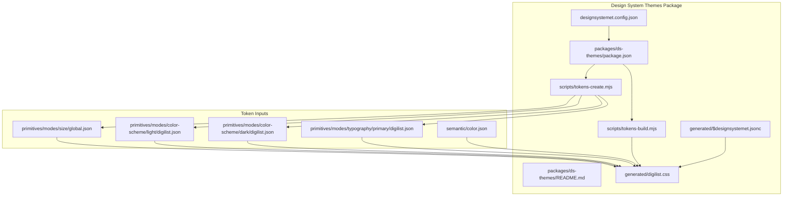
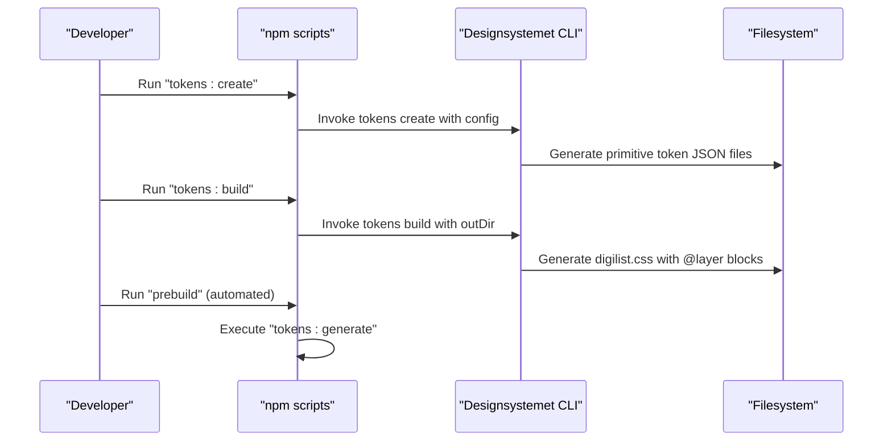
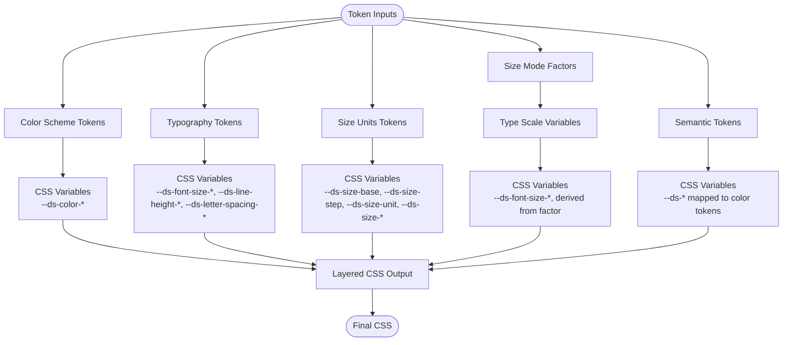
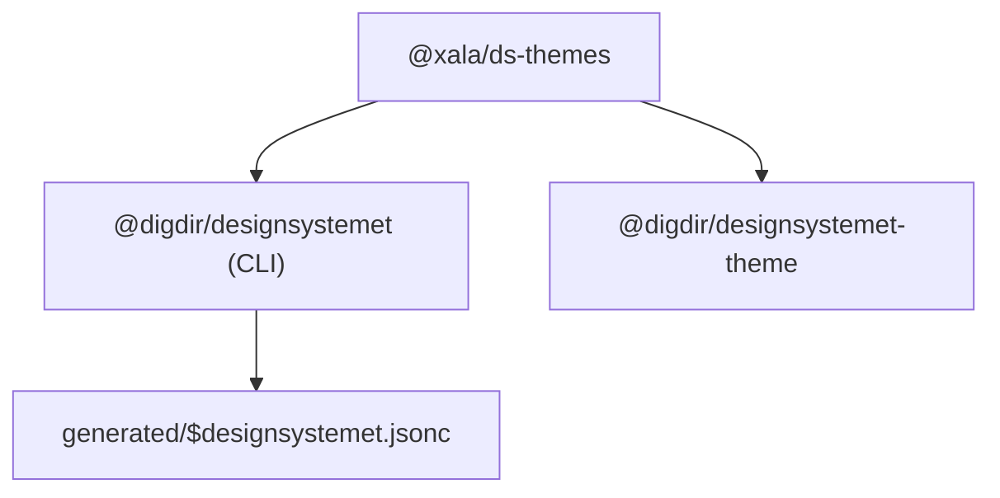

# CSS Generation & Compilation

<cite>
**Referenced Files in This Document**
- [designsystemet.config.json](file://designsystemet.config.json)
- [packages/ds-themes/README.md](file://packages/ds-themes/README.md)
- [packages/ds-themes/package.json](file://packages/ds-themes/package.json)
- [packages/ds-themes/scripts/tokens-build.mjs](file://packages/ds-themes/scripts/tokens-build.mjs)
- [packages/ds-themes/scripts/tokens-create.mjs](file://packages/ds-themes/scripts/tokens-create.mjs)
- [packages/ds-themes/generated/digilist.css](file://packages/ds-themes/generated/digilist.css)
- [packages/ds-themes/generated/$designsystemet.jsonc](file://packages/ds-themes/generated/$designsystemet.jsonc)
- [packages/ds-themes/generated/primitives/modes/color-scheme/light/digilist.json](file://packages/ds-themes/generated/primitives/modes/color-scheme/light/digilist.json)
- [packages/ds-themes/generated/primitives/modes/color-scheme/dark/digilist.json](file://packages/ds-themes/generated/primitives/modes/color-scheme/dark/digilist.json)
- [packages/ds-themes/generated/primitives/modes/size/global.json](file://packages/ds-themes/generated/primitives/modes/size/global.json)
- [packages/ds-themes/generated/primitives/modes/typography/primary/digilist.json](file://packages/ds-themes/generated/primitives/modes/typography/primary/digilist.json)
- [packages/ds-themes/generated/semantic/color.json](file://packages/ds-themes/generated/semantic/color.json)
</cite>

## Table of Contents
1. [Introduction](#introduction)
2. [Project Structure](#project-structure)
3. [Core Components](#core-components)
4. [Architecture Overview](#architecture-overview)
5. [Detailed Component Analysis](#detailed-component-analysis)
6. [Dependency Analysis](#dependency-analysis)
7. [Performance Considerations](#performance-considerations)
8. [Troubleshooting Guide](#troubleshooting-guide)
9. [Conclusion](#conclusion)

## Introduction
This document explains how design tokens are transformed into consumable CSS in the Xala Digdir Monorepo. It covers the build pipeline, token processing, CSS variable generation, layer organization, and media query handling. It also details the relationship between design tokens and generated CSS variables, including color scheme handling, size mode scaling, and typography calculations. Finally, it provides examples of generated CSS output, customization techniques, and troubleshooting common compilation issues.

## Project Structure
The CSS generation is implemented as a build-time package that compiles design tokens into layered CSS. The package orchestrates token creation and compilation via the Designsystemet CLI and produces a single CSS file with layers for size mode, type scale, color scheme, typography, size units, and semantic tokens.

**Diagram sources**
- [designsystemet.config.json](file://designsystemet.config.json#L1-L21)
- [packages/ds-themes/package.json](file://packages/ds-themes/package.json#L1-L27)
- [packages/ds-themes/README.md](file://packages/ds-themes/README.md#L1-L96)
- [packages/ds-themes/scripts/tokens-build.mjs](file://packages/ds-themes/scripts/tokens-build.mjs#L1-L9)
- [packages/ds-themes/scripts/tokens-create.mjs](file://packages/ds-themes/scripts/tokens-create.mjs#L1-L9)
- [packages/ds-themes/generated/digilist.css](file://packages/ds-themes/generated/digilist.css#L1-L1156)
- [packages/ds-themes/generated/$designsystemet.jsonc](file://packages/ds-themes/generated/$designsystemet.jsonc#L1-L4)
- [packages/ds-themes/generated/primitives/modes/size/global.json](file://packages/ds-themes/generated/primitives/modes/size/global.json#L1-L100)
- [packages/ds-themes/generated/primitives/modes/color-scheme/light/digilist.json](file://packages/ds-themes/generated/primitives/modes/color-scheme/light/digilist.json#L1-L614)
- [packages/ds-themes/generated/primitives/modes/color-scheme/dark/digilist.json](file://packages/ds-themes/generated/primitives/modes/color-scheme/dark/digilist.json#L1-L614)
- [packages/ds-themes/generated/primitives/modes/typography/primary/digilist.json](file://packages/ds-themes/generated/primitives/modes/typography/primary/digilist.json#L1-L22)
- [packages/ds-themes/generated/semantic/color.json](file://packages/ds-themes/generated/semantic/color.json#L1-L616)

**Section sources**
- [packages/ds-themes/README.md](file://packages/ds-themes/README.md#L1-L96)
- [packages/ds-themes/package.json](file://packages/ds-themes/package.json#L1-L27)

## Core Components
- Token configuration and inputs:
  - Theme configuration defines brand colors and border radius.
  - Primitive tokens define color palettes per scheme, size mode scaling, and typography families/weights.
  - Semantic tokens map primitive tokens into named semantic roles.
- Build-time scripts:
  - Create starter tokens from configuration.
  - Compile tokens into CSS with layers and media queries.
- Generated CSS:
  - Layered CSS with @layer ds.theme.* namespaces.
  - CSS variables for size, typography, color, and semantic tokens.
  - Media queries for automatic color scheme selection.

**Section sources**
- [designsystemet.config.json](file://designsystemet.config.json#L1-L21)
- [packages/ds-themes/generated/primitives/modes/color-scheme/light/digilist.json](file://packages/ds-themes/generated/primitives/modes/color-scheme/light/digilist.json#L1-L614)
- [packages/ds-themes/generated/primitives/modes/color-scheme/dark/digilist.json](file://packages/ds-themes/generated/primitives/modes/color-scheme/dark/digilist.json#L1-L614)
- [packages/ds-themes/generated/primitives/modes/size/global.json](file://packages/ds-themes/generated/primitives/modes/size/global.json#L1-L100)
- [packages/ds-themes/generated/primitives/modes/typography/primary/digilist.json](file://packages/ds-themes/generated/primitives/modes/typography/primary/digilist.json#L1-L22)
- [packages/ds-themes/generated/semantic/color.json](file://packages/ds-themes/generated/semantic/color.json#L1-L616)
- [packages/ds-themes/generated/digilist.css](file://packages/ds-themes/generated/digilist.css#L1-L1156)

## Architecture Overview
The build pipeline transforms JSON-based design tokens into layered CSS variables consumed by applications. The process is orchestrated by the ds-themes package and the Designsystemet CLI.

**Diagram sources**
- [packages/ds-themes/package.json](file://packages/ds-themes/package.json#L14-L18)
- [packages/ds-themes/scripts/tokens-create.mjs](file://packages/ds-themes/scripts/tokens-create.mjs#L1-L9)
- [packages/ds-themes/scripts/tokens-build.mjs](file://packages/ds-themes/scripts/tokens-build.mjs#L1-L9)
- [packages/ds-themes/generated/digilist.css](file://packages/ds-themes/generated/digilist.css#L1-L1156)

## Detailed Component Analysis

### Build Pipeline and Token Processing
- Token creation:
  - Reads theme configuration and emits primitive token JSON files for size, color schemes, and typography.
- Token compilation:
  - Consumes primitive and semantic token JSON to produce a single CSS file with @layer blocks.
  - Uses CSS variables to express relationships and enables runtime overrides via attributes and data-* selectors.

Key behaviors visible in the generated CSS:
- Layered organization: @layer ds.theme.size-mode, ds.theme.type-scale, ds.theme.color-scheme.light, ds.theme.color-scheme.dark, ds.theme.typography.secondary, ds.theme.size, ds.theme.semantic.
- Attribute-driven selection: [data-size], [data-color-scheme="light|dark|auto"], [data-typography="secondary"].
- Media query fallbacks: Automatic color scheme via prefers-color-scheme.

**Section sources**
- [packages/ds-themes/package.json](file://packages/ds-themes/package.json#L14-L18)
- [packages/ds-themes/scripts/tokens-create.mjs](file://packages/ds-themes/scripts/tokens-create.mjs#L1-L9)
- [packages/ds-themes/scripts/tokens-build.mjs](file://packages/ds-themes/scripts/tokens-build.mjs#L1-L9)
- [packages/ds-themes/generated/digilist.css](file://packages/ds-themes/generated/digilist.css#L7-L40)
- [packages/ds-themes/generated/digilist.css](file://packages/ds-themes/generated/digilist.css#L42-L91)
- [packages/ds-themes/generated/digilist.css](file://packages/ds-themes/generated/digilist.css#L92-L401)
- [packages/ds-themes/generated/digilist.css](file://packages/ds-themes/generated/digilist.css#L402-L487)
- [packages/ds-themes/generated/digilist.css](file://packages/ds-themes/generated/digilist.css#L488-L539)
- [packages/ds-themes/generated/digilist.css](file://packages/ds-themes/generated/digilist.css#L541-L561)

### CSS Variable Generation and Layers
- Size mode scaling:
  - Defines per-mode font-size factors and a combined factor variable.
  - Applies the factor to derive font sizes across heading/body scales.
- Type scale:
  - Computes rem-based sizes from a base and step, factoring in size mode.
  - Rounds to nearest 0.1rem when supported for crisp rendering.
- Color scheme:
  - Exposes CSS variables for accent, neutral, brand1–3, info, success, warning, danger, focus, and link visited.
  - Provides color-scheme property and media-query fallbacks for auto mode.
- Typography:
  - Secondary typography mode sets line heights, letter spacing, font family, and weights.
- Size units:
  - Base, step, and unit variables drive spacing scale calculations.
- Semantic:
  - Maps semantic roles to underlying color tokens.

**Diagram sources**
- [packages/ds-themes/generated/digilist.css](file://packages/ds-themes/generated/digilist.css#L7-L40)
- [packages/ds-themes/generated/digilist.css](file://packages/ds-themes/generated/digilist.css#L42-L91)
- [packages/ds-themes/generated/digilist.css](file://packages/ds-themes/generated/digilist.css#L92-L401)
- [packages/ds-themes/generated/digilist.css](file://packages/ds-themes/generated/digilist.css#L402-L487)
- [packages/ds-themes/generated/digilist.css](file://packages/ds-themes/generated/digilist.css#L488-L539)
- [packages/ds-themes/generated/digilist.css](file://packages/ds-themes/generated/digilist.css#L541-L561)

**Section sources**
- [packages/ds-themes/generated/digilist.css](file://packages/ds-themes/generated/digilist.css#L7-L40)
- [packages/ds-themes/generated/digilist.css](file://packages/ds-themes/generated/digilist.css#L42-L91)
- [packages/ds-themes/generated/digilist.css](file://packages/ds-themes/generated/digilist.css#L92-L401)
- [packages/ds-themes/generated/digilist.css](file://packages/ds-themes/generated/digilist.css#L402-L487)
- [packages/ds-themes/generated/digilist.css](file://packages/ds-themes/generated/digilist.css#L488-L539)
- [packages/ds-themes/generated/digilist.css](file://packages/ds-themes/generated/digilist.css#L541-L561)

### Relationship Between Tokens and CSS Variables
- Primitive tokens feed CSS variables:
  - Color tokens (light/dark) become --ds-color-* variables.
  - Size tokens become --ds-size-* and --ds-size-unit.
  - Typography tokens become --ds-font-size-*, --ds-line-height-*, --ds-letter-spacing-*.
- Semantic tokens map to CSS variables:
  - Roles like background-default, surface-hover, border-default, text-default, base-default, base-contrast-* are derived from primitive tokens.
- Attribute and media query precedence:
  - [data-size] selects the current size mode factor.
  - [data-color-scheme="light|dark|auto"] selects color scheme.
  - @media (prefers-color-scheme) provides automatic fallback.

**Section sources**
- [packages/ds-themes/generated/primitives/modes/color-scheme/light/digilist.json](file://packages/ds-themes/generated/primitives/modes/color-scheme/light/digilist.json#L1-L614)
- [packages/ds-themes/generated/primitives/modes/color-scheme/dark/digilist.json](file://packages/ds-themes/generated/primitives/modes/color-scheme/dark/digilist.json#L1-L614)
- [packages/ds-themes/generated/primitives/modes/size/global.json](file://packages/ds-themes/generated/primitives/modes/size/global.json#L1-L100)
- [packages/ds-themes/generated/primitives/modes/typography/primary/digilist.json](file://packages/ds-themes/generated/primitives/modes/typography/primary/digilist.json#L1-L22)
- [packages/ds-themes/generated/semantic/color.json](file://packages/ds-themes/generated/semantic/color.json#L1-L616)
- [packages/ds-themes/generated/digilist.css](file://packages/ds-themes/generated/digilist.css#L92-L401)

### CSS Architecture: Layers, Specificity, and Inheritance
- Layers:
  - ds.theme.size-mode: Establishes per-mode font-size factors and a combined factor.
  - ds.theme.type-scale: Derives font sizes from the factor and base/step.
  - ds.theme.color-scheme.light/dark: Exposes color variables and color-scheme property.
  - ds.theme.typography.secondary: Overrides line heights, letter spacing, and weights.
  - ds.theme.size: Defines base, step, unit, and spacing scale.
  - ds.theme.semantic: Provides semantic role variables mapped to color tokens.
- Specificity:
  - Variables are set on :root and [data-*] targets; attribute selectors override defaults.
  - @layer ensures deterministic cascade order independent of selector specificity.
- Inheritance:
  - CSS variables propagate down the DOM; components consume --ds-* variables rather than raw values.

**Section sources**
- [packages/ds-themes/generated/digilist.css](file://packages/ds-themes/generated/digilist.css#L7-L40)
- [packages/ds-themes/generated/digilist.css](file://packages/ds-themes/generated/digilist.css#L42-L91)
- [packages/ds-themes/generated/digilist.css](file://packages/ds-themes/generated/digilist.css#L92-L401)
- [packages/ds-themes/generated/digilist.css](file://packages/ds-themes/generated/digilist.css#L402-L487)
- [packages/ds-themes/generated/digilist.css](file://packages/ds-themes/generated/digilist.css#L488-L539)
- [packages/ds-themes/generated/digilist.css](file://packages/ds-themes/generated/digilist.css#L541-L561)

### Examples of Generated CSS Output
- Size mode variables:
  - Per-mode font-size factors and a combined factor variable for type scale derivation.
- Type scale variables:
  - Headings and body sizes computed from the factor and base/step.
- Color scheme variables:
  - Full palette per category (accent, neutral, brand1–3, info, success, warning, danger) and focus/link colors.
- Typography mode variables:
  - Line heights, letter spacing, font family, and weights for secondary typography.
- Size unit variables:
  - Base, step, unit, and spacing scale values.
- Semantic variables:
  - Role-based variables mapped to color tokens.

These outputs are emitted as CSS variables within the appropriate @layer blocks and are intended to be consumed by components.

**Section sources**
- [packages/ds-themes/generated/digilist.css](file://packages/ds-themes/generated/digilist.css#L7-L40)
- [packages/ds-themes/generated/digilist.css](file://packages/ds-themes/generated/digilist.css#L42-L91)
- [packages/ds-themes/generated/digilist.css](file://packages/ds-themes/generated/digilist.css#L92-L401)
- [packages/ds-themes/generated/digilist.css](file://packages/ds-themes/generated/digilist.css#L402-L487)
- [packages/ds-themes/generated/digilist.css](file://packages/ds-themes/generated/digilist.css#L488-L539)
- [packages/ds-themes/generated/digilist.css](file://packages/ds-themes/generated/digilist.css#L541-L561)

### Customization Techniques
- Theme configuration:
  - Adjust brand colors and border radius in the theme configuration to change semantic tokens and color scheme variables.
- Size mode scaling:
  - Modify base and step values to alter spacing and type scale.
- Typography:
  - Switch typography mode via [data-typography="secondary"] to apply alternate line heights and letter spacing.
- Color scheme:
  - Set [data-color-scheme="light|dark|auto"] to select a scheme; rely on @media (prefers-color-scheme) for automatic selection.
- Attribute-driven sizing:
  - Apply [data-size="sm|md|lg"] to adjust font-size factors and derived variables.

**Section sources**
- [designsystemet.config.json](file://designsystemet.config.json#L4-L18)
- [packages/ds-themes/generated/digilist.css](file://packages/ds-themes/generated/digilist.css#L25-L40)
- [packages/ds-themes/generated/digilist.css](file://packages/ds-themes/generated/digilist.css#L42-L91)
- [packages/ds-themes/generated/digilist.css](file://packages/ds-themes/generated/digilist.css#L402-L487)
- [packages/ds-themes/generated/digilist.css](file://packages/ds-themes/generated/digilist.css#L488-L539)

## Dependency Analysis
The ds-themes package depends on the Designsystemet CLI for token creation and compilation. The CLI version is recorded in the generated metadata.

**Diagram sources**
- [packages/ds-themes/package.json](file://packages/ds-themes/package.json#L20-L26)
- [packages/ds-themes/generated/$designsystemet.jsonc](file://packages/ds-themes/generated/$designsystemet.jsonc#L1-L4)

**Section sources**
- [packages/ds-themes/package.json](file://packages/ds-themes/package.json#L20-L26)
- [packages/ds-themes/generated/$designsystemet.jsonc](file://packages/ds-themes/generated/$designsystemet.jsonc#L1-L4)

## Performance Considerations
- CSS variable usage reduces duplication and improves maintainability.
- Rounding logic for type scale and spacing can improve rendering consistency on supported browsers.
- Layered CSS ensures predictable cascade order and minimizes specificity wars.

## Troubleshooting Guide
- Missing or outdated token files:
  - Re-run token creation and build scripts to regenerate primitive and semantic token JSON and CSS.
- Incorrect theme configuration:
  - Verify theme colors and border radius in the configuration file.
- Unexpected color scheme:
  - Ensure [data-color-scheme] is set appropriately; confirm @media (prefers-color-scheme) behavior if relying on automatic selection.
- Typography not applying:
  - Confirm [data-typography="secondary"] is present when expecting alternate line heights and letter spacing.
- Spacing or type scale anomalies:
  - Check base, step, and unit variables; verify size mode selection via [data-size].

**Section sources**
- [packages/ds-themes/README.md](file://packages/ds-themes/README.md#L19-L30)
- [packages/ds-themes/scripts/tokens-create.mjs](file://packages/ds-themes/scripts/tokens-create.mjs#L1-L9)
- [packages/ds-themes/scripts/tokens-build.mjs](file://packages/ds-themes/scripts/tokens-build.mjs#L1-L9)
- [packages/ds-themes/generated/digilist.css](file://packages/ds-themes/generated/digilist.css#L92-L401)
- [packages/ds-themes/generated/digilist.css](file://packages/ds-themes/generated/digilist.css#L402-L487)
- [packages/ds-themes/generated/digilist.css](file://packages/ds-themes/generated/digilist.css#L488-L539)

## Conclusion
The CSS generation and compilation pipeline converts structured design tokens into layered CSS variables, enabling robust theming, responsive sizing, and consistent typography. By leveraging @layer blocks, attribute selectors, and media queries, the system provides flexible customization while maintaining predictable cascade behavior. Developers should use the provided scripts and configuration to manage tokens and rely on the generated CSS variables for component styling.