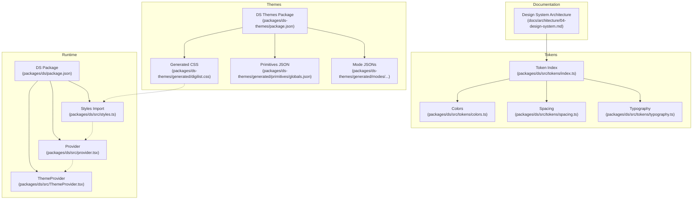
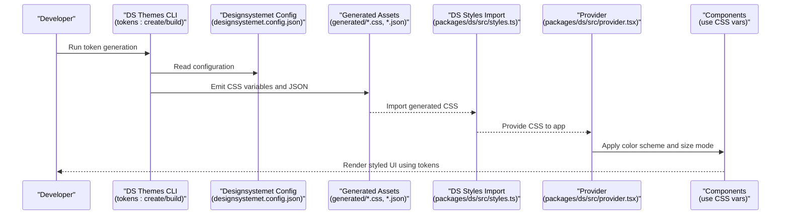
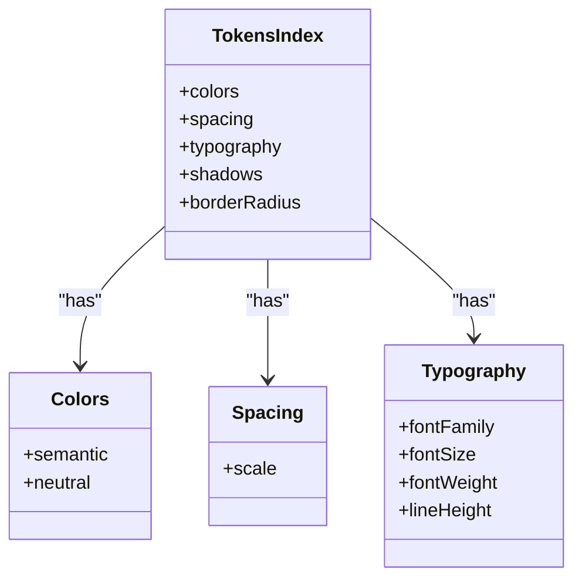
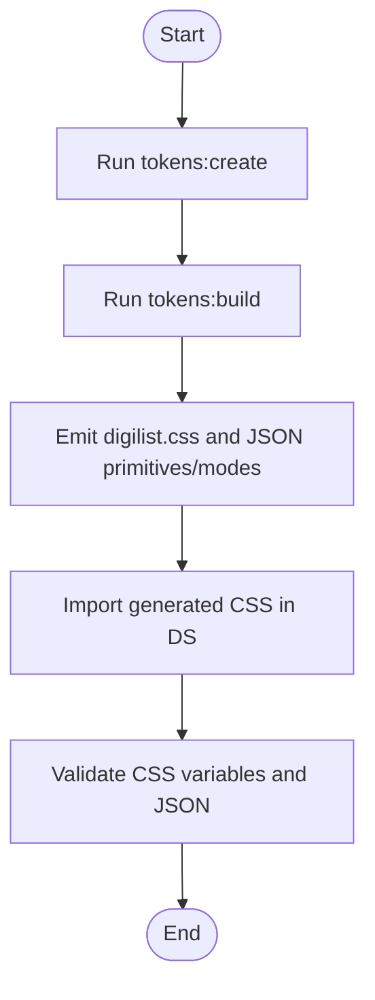
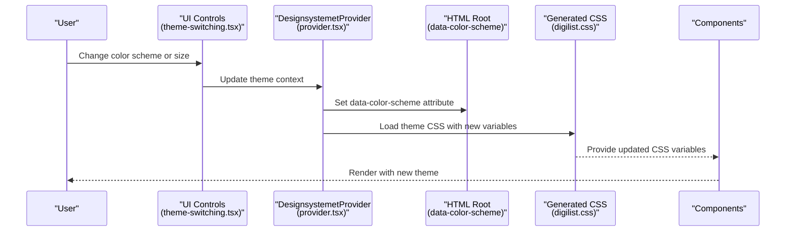
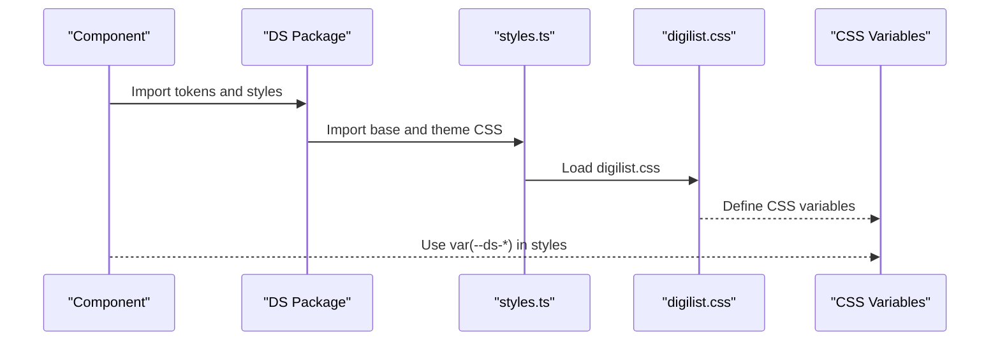
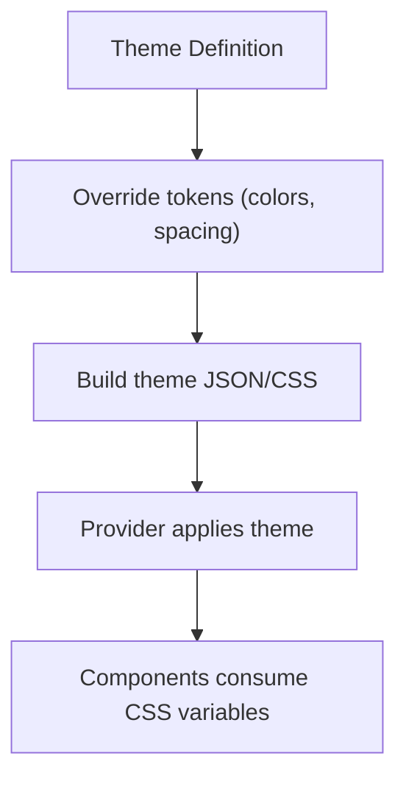
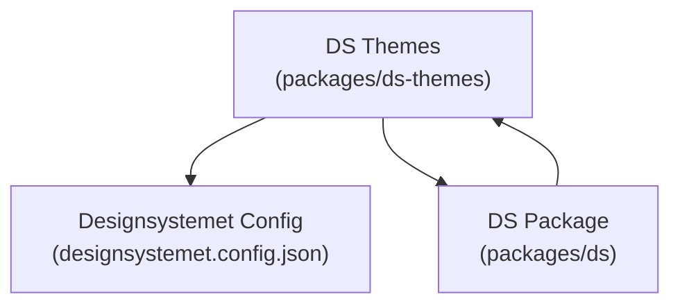

# Design Tokens

<cite>
**Referenced Files in This Document**
- [04-design-system.md](file://docs/architecture/04-design-system.md)
- [package.json](file://packages/ds-themes/package.json)
- [theme-switching.tsx](file://packages/ds-registry/examples/theme-switching.tsx)
- [HEADER.md](file://packages/ds/HEADER.md)
- [STRUCTURE.md](file://packages/ds/STRUCTURE.md)
- [package.json](file://packages/ds/package.json)
- [styles.ts](file://packages/ds/src/styles.ts)
- [provider.tsx](file://packages/ds/src/provider.tsx)
- [ThemeProvider.tsx](file://packages/ds/src/ThemeProvider.tsx)
- [index.ts](file://packages/ds/src/index.ts)
- [index.ts](file://packages/ds/src/tokens/index.ts)
- [colors.ts](file://packages/ds/src/tokens/colors.ts)
- [spacing.ts](file://packages/ds/src/tokens/spacing.ts)
- [typography.ts](file://packages/ds/src/tokens/typography.ts)
- [digdir.css](file://packages/ds-themes/generated/digilist.css)
- [globals.json](file://packages/ds-themes/generated/primitives/globals.json)
- [digilist.json](file://packages/ds-themes/generated/modes/color-scheme/dark/digilist.json)
- [designsystemet.config.json](file://designsystemet.config.json)
</cite>

## Table of Contents
1. [Introduction](#introduction)
2. [Project Structure](#project-structure)
3. [Core Components](#core-components)
4. [Architecture Overview](#architecture-overview)
5. [Detailed Component Analysis](#detailed-component-analysis)
6. [Dependency Analysis](#dependency-analysis)
7. [Performance Considerations](#performance-considerations)
8. [Troubleshooting Guide](#troubleshooting-guide)
9. [Conclusion](#conclusion)
10. [Appendices](#appendices)

## Introduction
This document explains the design token system used across the Xala design system. It covers the hierarchical structure of tokens (primitive, semantic, composite), naming conventions, value types, and how they cascade through layers such as size mode, color scheme, typography, and semantics. It also documents the token build process, validation rules, and propagation through the system, with practical examples of usage in CSS variables, component styling, and theme customization.

## Project Structure
The design token system spans several packages and documentation files:
- Token definitions and categories are documented in the design system architecture guide.
- The token generation pipeline is driven by the design system themes package and executed via scripts.
- Runtime theme switching and CSS variable application are implemented in the design system package.

**Diagram sources**
- [04-design-system.md](file://docs/architecture/04-design-system.md#L47-L76)
- [index.ts](file://packages/ds/src/tokens/index.ts#L1-L280)
- [colors.ts](file://packages/ds/src/tokens/colors.ts#L1-L200)
- [spacing.ts](file://packages/ds/src/tokens/spacing.ts#L1-L200)
- [typography.ts](file://packages/ds/src/tokens/typography.ts#L1-L200)
- [package.json](file://packages/ds-themes/package.json#L14-L19)
- [digilist.css](file://packages/ds-themes/generated/digilist.css#L1-L200)
- [globals.json](file://packages/ds-themes/generated/primitives/globals.json#L1-L200)
- [digilist.json](file://packages/ds-themes/generated/modes/color-scheme/dark/digilist.json#L1-L200)
- [package.json](file://packages/ds/package.json#L1-L42)
- [styles.ts](file://packages/ds/src/styles.ts#L1-L312)
- [provider.tsx](file://packages/ds/src/provider.tsx#L160-L198)
- [ThemeProvider.tsx](file://packages/ds/src/ThemeProvider.tsx#L1-L200)

**Section sources**
- [04-design-system.md](file://docs/architecture/04-design-system.md#L47-L76)
- [package.json](file://packages/ds-themes/package.json#L14-L19)
- [package.json](file://packages/ds/package.json#L1-L42)

## Core Components
The design token system is structured around three hierarchical layers:
- Primitive tokens: atomic values such as colors, spacing units, typography scales, shadows, and border radii.
- Semantic tokens: component-level mappings that abstract meaning (e.g., primary, secondary, surface, background).
- Composite tokens: complex combinations derived from primitives and semantics (e.g., button states, card shadows).

Key characteristics:
- Naming conventions: tokens are grouped by category and use kebab-case for CSS variables and numeric keys for spacing scale indices.
- Value types: CSS custom properties for runtime variability, numeric units for spacing, and font metrics for typography.
- Inheritance patterns: semantic tokens resolve to primitive values; composite tokens combine multiple primitives.

Examples of token categories and usage are documented in the design system architecture guide.

**Section sources**
- [04-design-system.md](file://docs/architecture/04-design-system.md#L201-L280)
- [index.ts](file://packages/ds/src/tokens/index.ts#L1-L280)

## Architecture Overview
The token architecture integrates generation, distribution, and runtime consumption:
- Generation: The design system themes package runs token commands to create and build tokens from configuration.
- Distribution: Generated CSS variables are emitted and imported by the design system package.
- Runtime: Providers apply color scheme and size mode, and components consume tokens via CSS variables.

**Diagram sources**
- [package.json](file://packages/ds-themes/package.json#L14-L19)
- [designsystemet.config.json](file://designsystemet.config.json#L1-L200)
- [digilist.css](file://packages/ds-themes/generated/digilist.css#L1-L200)
- [styles.ts](file://packages/ds/src/styles.ts#L299-L312)
- [provider.tsx](file://packages/ds/src/provider.tsx#L170-L198)

## Detailed Component Analysis

### Token Categories and Hierarchical Structure
The token index defines the canonical structure:
- Colors: semantic and neutral palettes mapped to CSS variables.
- Spacing: discrete scale indices mapped to CSS variables.
- Typography: family, sizes, weights, and line heights mapped to CSS variables.
- Shadows and border radius: effect tokens mapped to CSS variables.

**Diagram sources**
- [index.ts](file://packages/ds/src/tokens/index.ts#L205-L279)

**Section sources**
- [04-design-system.md](file://docs/architecture/04-design-system.md#L201-L280)
- [index.ts](file://packages/ds/src/tokens/index.ts#L1-L280)

### Token Build and Validation Pipeline
The build pipeline is orchestrated by the themes package:
- Creation: Generates token definitions from configuration.
- Building: Produces CSS variables and JSON primitives/modes.
- Prebuild hook: Ensures assets are generated before building the DS package.

**Diagram sources**
- [package.json](file://packages/ds-themes/package.json#L14-L19)
- [designsystemet.config.json](file://designsystemet.config.json#L1-L200)
- [digilist.css](file://packages/ds-themes/generated/digilist.css#L1-L200)
- [globals.json](file://packages/ds-themes/generated/primitives/globals.json#L1-L200)

**Section sources**
- [package.json](file://packages/ds-themes/package.json#L14-L19)

### Runtime Theme Switching and Layer Cascade
The provider applies color scheme and size mode, which cascade into CSS variables consumed by components:
- Color scheme toggles light/dark/auto.
- Size mode adjusts spacing and typography scales.
- Components consume tokens via CSS variables.

**Diagram sources**
- [theme-switching.tsx](file://packages/ds-registry/examples/theme-switching.tsx#L37-L69)
- [provider.tsx](file://packages/ds/src/provider.tsx#L170-L198)
- [digilist.css](file://packages/ds-themes/generated/digilist.css#L1-L200)

**Section sources**
- [theme-switching.tsx](file://packages/ds-registry/examples/theme-switching.tsx#L37-L69)
- [provider.tsx](file://packages/ds/src/provider.tsx#L170-L198)

### Token Usage in Components and CSS Variables
Components and libraries consume tokens through CSS variables:
- Tokens are referenced as CSS variables in component styles.
- The design system’s single import point loads base and theme-specific CSS.
- Providers ensure the correct variables are applied at runtime.

**Diagram sources**
- [styles.ts](file://packages/ds/src/styles.ts#L299-L312)
- [digilist.css](file://packages/ds-themes/generated/digilist.css#L1-L200)
- [HEADER.md](file://packages/ds/HEADER.md#L96-L102)

**Section sources**
- [styles.ts](file://packages/ds/src/styles.ts#L299-L312)
- [HEADER.md](file://packages/ds/HEADER.md#L96-L102)

### Theme Customization and Propagation
Custom themes can extend existing ones and override specific tokens:
- Themes define overrides for colors and spacing.
- Generated JSON primitives/modes reflect these overrides.
- Providers apply the selected theme and propagate changes to components.

**Diagram sources**
- [04-design-system.md](file://docs/architecture/04-design-system.md#L561-L579)
- [globals.json](file://packages/ds-themes/generated/primitives/globals.json#L1-L200)
- [digilist.json](file://packages/ds-themes/generated/modes/color-scheme/dark/digilist.json#L1-L200)
- [provider.tsx](file://packages/ds/src/provider.tsx#L170-L198)

**Section sources**
- [04-design-system.md](file://docs/architecture/04-design-system.md#L561-L579)

## Dependency Analysis
The token system depends on:
- The design system themes package for generating tokens.
- The design system package for importing and applying generated CSS.
- Providers for runtime theme switching.

**Diagram sources**
- [package.json](file://packages/ds-themes/package.json#L14-L19)
- [package.json](file://packages/ds/package.json#L1-L42)
- [designsystemet.config.json](file://designsystemet.config.json#L1-L200)

**Section sources**
- [package.json](file://packages/ds-themes/package.json#L14-L19)
- [package.json](file://packages/ds/package.json#L1-L42)

## Performance Considerations
- Prefer CSS variables for runtime theme switching to avoid re-renders.
- Keep token sets minimal and reuse semantic tokens to reduce duplication.
- Use lazy loading for heavy components and defer non-critical CSS where appropriate.

## Troubleshooting Guide
Common issues and resolutions:
- Missing CSS variables: Ensure the generated CSS is imported and the provider is initialized.
- Theme not applying: Verify the provider’s color scheme and size mode attributes are set correctly.
- Inconsistent tokens: Confirm the token build ran successfully and the generated JSON matches expectations.

**Section sources**
- [styles.ts](file://packages/ds/src/styles.ts#L299-L312)
- [provider.tsx](file://packages/ds/src/provider.tsx#L170-L198)
- [package.json](file://packages/ds-themes/package.json#L14-L19)

## Conclusion
The design token system provides a robust, layered approach to styling consistency across applications. By separating primitive, semantic, and composite tokens, and by integrating generation, distribution, and runtime application, the system enables scalable theming, predictable cascading, and maintainable customization.

## Appendices

### Appendix A: Token Categories and Examples
- Colors: semantic and neutral palettes mapped to CSS variables.
- Spacing: discrete scale indices mapped to CSS variables.
- Typography: family, sizes, weights, and line heights mapped to CSS variables.
- Effects: shadows and border radius mapped to CSS variables.

**Section sources**
- [04-design-system.md](file://docs/architecture/04-design-system.md#L201-L280)
- [index.ts](file://packages/ds/src/tokens/index.ts#L1-L280)

### Appendix B: Component Styling with Tokens
- Components should consume tokens via CSS variables.
- Use the design system’s single import point for styles.
- Leverage providers for runtime theme switching.

**Section sources**
- [HEADER.md](file://packages/ds/HEADER.md#L96-L102)
- [STRUCTURE.md](file://packages/ds/STRUCTURE.md#L95-L154)