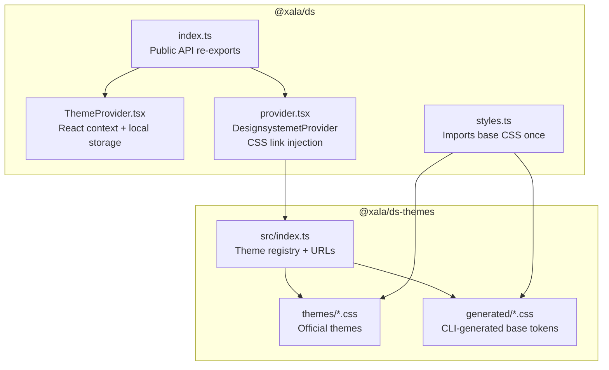
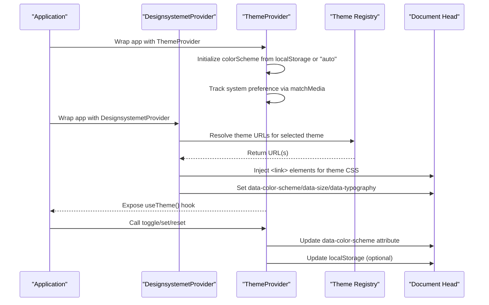
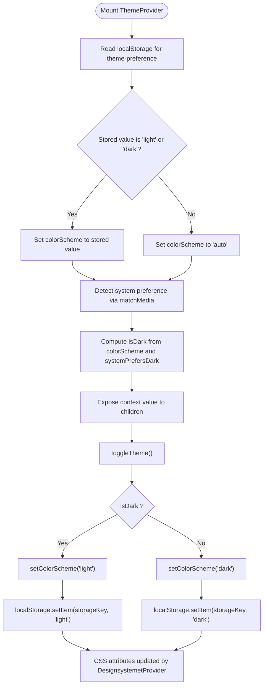
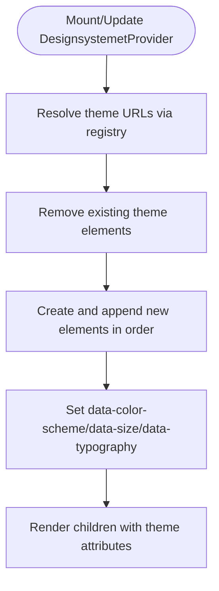
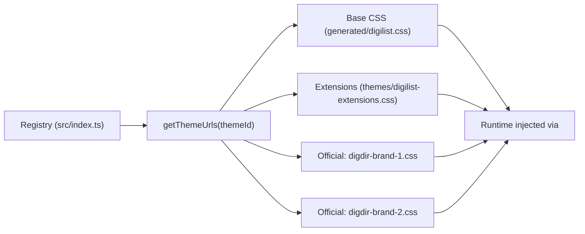
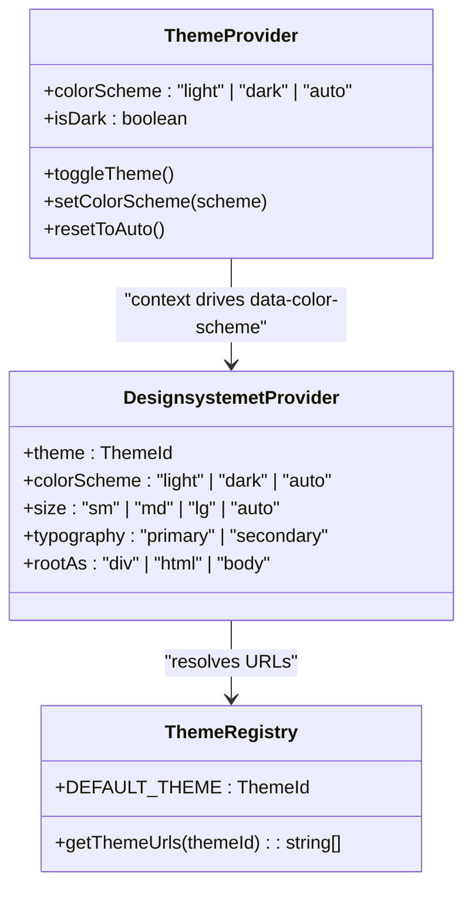
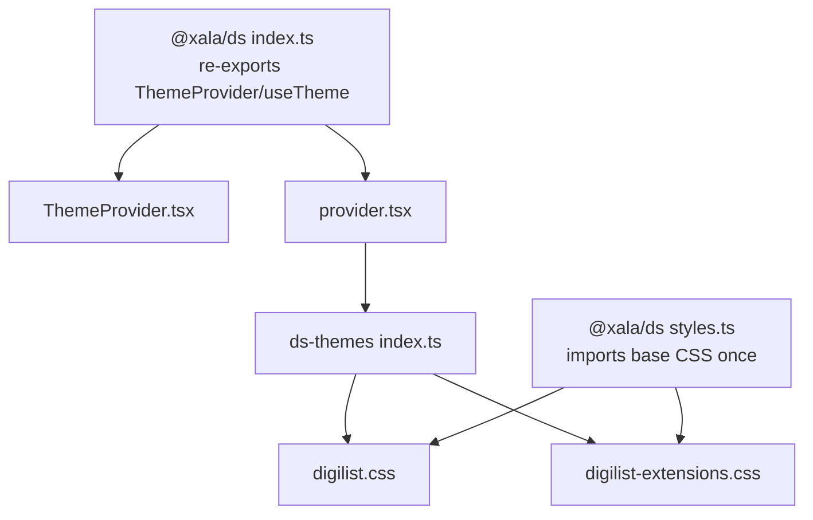

# Theme Provider & Context

<cite>
**Referenced Files in This Document**
- [ThemeProvider.tsx](file://packages/ds/src/ThemeProvider.tsx)
- [provider.tsx](file://packages/ds/src/provider.tsx)
- [styles.ts](file://packages/ds/src/styles.ts)
- [index.ts](file://packages/ds/src/index.ts)
- [index.ts](file://packages/ds-themes/src/index.ts)
- [digilist-extensions.css](file://packages/ds-themes/themes/digilist-extensions.css)
- [digilist.css](file://packages/ds-themes/generated/digilist.css)
- [digdir-brand-1.css](file://packages/ds-themes/themes/digdir-brand-1.css)
- [digdir-brand-2.css](file://packages/ds-themes/themes/digdir-brand-2.css)
</cite>

## Table of Contents
1. [Introduction](#introduction)
2. [Project Structure](#project-structure)
3. [Core Components](#core-components)
4. [Architecture Overview](#architecture-overview)
5. [Detailed Component Analysis](#detailed-component-analysis)
6. [Dependency Analysis](#dependency-analysis)
7. [Performance Considerations](#performance-considerations)
8. [Troubleshooting Guide](#troubleshooting-guide)
9. [Conclusion](#conclusion)

## Introduction
This document explains the theme provider and context architecture used across the monorepo’s design system. It covers how themes are applied and managed, how React context propagates theme state, how CSS classes and data attributes coordinate with React state, and how to configure, persist, and dynamically switch themes. It also provides practical guidance for creating custom themes and brand-specific variations.

## Project Structure
The theme system spans two packages:
- @xala/ds: The design system package that exposes the ThemeProvider, DesignsystemetProvider, and centralized exports.
- @xala/ds-themes: The theme registry and CSS assets that enable runtime theme switching without reloading the page.

**Diagram sources**
- [index.ts](file://packages/ds/src/index.ts#L58-L62)
- [ThemeProvider.tsx](file://packages/ds/src/ThemeProvider.tsx#L1-L120)
- [provider.tsx](file://packages/ds/src/provider.tsx#L1-L130)
- [styles.ts](file://packages/ds/src/styles.ts#L1-L24)
- [index.ts](file://packages/ds-themes/src/index.ts#L1-L56)

**Section sources**
- [index.ts](file://packages/ds/src/index.ts#L58-L62)
- [index.ts](file://packages/ds-themes/src/index.ts#L18-L56)

## Core Components
- ThemeProvider (React context):
  - Manages colorScheme state ("light", "dark", "auto") and exposes toggle, set, and reset actions.
  - Persists user choice to localStorage keyed by a configurable storageKey.
  - Computes isDark based on colorScheme and system preference.
- DesignsystemetProvider:
  - Injects theme CSS via <link> elements into the document head.
  - Applies data attributes on the root element for CSS targeting: data-color-scheme, data-size, data-typography.
  - Supports multiple CSS files per theme (base + extensions) and replaces old links to avoid conflicts.
- Theme Registry (@xala/ds-themes):
  - Maps theme identifiers to CSS URLs (single or array).
  - Provides DEFAULT_THEME and helper to resolve URLs consistently.

**Section sources**
- [ThemeProvider.tsx](file://packages/ds/src/ThemeProvider.tsx#L10-L119)
- [provider.tsx](file://packages/ds/src/provider.tsx#L25-L129)
- [index.ts](file://packages/ds-themes/src/index.ts#L18-L56)

## Architecture Overview
The theme system combines React context with CSS data attributes and dynamic stylesheet injection:

**Diagram sources**
- [ThemeProvider.tsx](file://packages/ds/src/ThemeProvider.tsx#L45-L112)
- [provider.tsx](file://packages/ds/src/provider.tsx#L102-L129)
- [index.ts](file://packages/ds-themes/src/index.ts#L49-L52)

## Detailed Component Analysis

### ThemeProvider (React Context)
- Responsibilities:
  - Manage colorScheme state and expose toggle/set/reset.
  - Persist selection to localStorage keyed by storageKey.
  - Compute effective isDark for UI toggles.
  - Respect system preference via matchMedia listener.
- Key behaviors:
  - On mount, reads stored preference from localStorage if present; otherwise defaults to "auto".
  - On system preference change, recomputes isDark.
  - toggleTheme flips between light and dark based on current effective state.
  - resetToAuto removes persisted preference and reverts to "auto".

**Diagram sources**
- [ThemeProvider.tsx](file://packages/ds/src/ThemeProvider.tsx#L45-L112)

**Section sources**
- [ThemeProvider.tsx](file://packages/ds/src/ThemeProvider.tsx#L10-L119)

### DesignsystemetProvider (CSS Link Injection + Data Attributes)
- Responsibilities:
  - Dynamically inject theme CSS via <link> elements to avoid page reloads.
  - Apply data attributes on the root element for CSS targeting.
  - Support multi-file themes (base + extensions) and replace old links safely.
- Key behaviors:
  - On mount/update, resolves theme URLs from the registry and injects them in order.
  - Sets data-color-scheme, data-size, data-typography on html/body/root element.
  - Allows rootAs to target html/body directly for attribute application.

**Diagram sources**
- [provider.tsx](file://packages/ds/src/provider.tsx#L73-L129)

**Section sources**
- [provider.tsx](file://packages/ds/src/provider.tsx#L25-L129)

### Theme Registry and CSS Assets
- Theme Registry:
  - Defines official themes and the digilist multi-file theme (base + extensions).
  - Exposes DEFAULT_THEME and getThemeUrls to normalize URL arrays.
- CSS Assets:
  - CLI-generated base tokens in generated/digilist.css.
  - App-specific extensions in themes/digilist-extensions.css.
  - Official brand themes in themes/digdir-brand-*.css.

**Diagram sources**
- [index.ts](file://packages/ds-themes/src/index.ts#L18-L56)
- [digilist-extensions.css](file://packages/ds-themes/themes/digilist-extensions.css#L1-L16)
- [digilist.css](file://packages/ds-themes/generated/digilist.css#L1-L40)

**Section sources**
- [index.ts](file://packages/ds-themes/src/index.ts#L18-L56)
- [digilist-extensions.css](file://packages/ds-themes/themes/digilist-extensions.css#L1-L16)
- [digilist.css](file://packages/ds-themes/generated/digilist.css#L1-L40)

### CSS Classes, Data Attributes, and React Context
- Data attributes:
  - DesignsystemetProvider sets data-color-scheme, data-size, data-typography on the root element.
  - ThemeProvider updates data-color-scheme reactively as the user toggles or resets.
- CSS targeting:
  - Official digilist.css and digilist-extensions.css use [data-color-scheme] selectors to apply theme variants.
  - Extensions override base tokens and introduce app-specific tokens and component styles.
- React context:
  - ThemeProvider exposes isDark and toggle functions for UI controls (e.g., theme toggle buttons).
  - Consumers can read colorScheme and isDark to drive UI behavior while CSS handles visual rendering.

**Diagram sources**
- [ThemeProvider.tsx](file://packages/ds/src/ThemeProvider.tsx#L10-L119)
- [provider.tsx](file://packages/ds/src/provider.tsx#L44-L129)
- [index.ts](file://packages/ds-themes/src/index.ts#L49-L56)

**Section sources**
- [provider.tsx](file://packages/ds/src/provider.tsx#L110-L129)
- [ThemeProvider.tsx](file://packages/ds/src/ThemeProvider.tsx#L93-L112)
- [digilist-extensions.css](file://packages/ds-themes/themes/digilist-extensions.css#L79-L168)
- [digilist.css](file://packages/ds-themes/generated/digilist.css#L92-L120)

## Dependency Analysis
- Public API exposure:
  - @xala/ds re-exports ThemeProvider and useTheme, enabling consumers to access theme context.
  - @xala/ds also re-exports DesignsystemetProvider and related types.
- Runtime dependencies:
  - DesignsystemetProvider depends on @xala/ds-themes for theme URLs.
  - ThemeProvider depends on localStorage and matchMedia for persistence and system preference.
- CSS loading policy:
  - Base CSS is imported only once via @xala/ds/styles to prevent duplication and ensure consistent theme switching.

**Diagram sources**
- [index.ts](file://packages/ds/src/index.ts#L58-L62)
- [provider.tsx](file://packages/ds/src/provider.tsx#L23-L113)
- [index.ts](file://packages/ds-themes/src/index.ts#L49-L56)
- [styles.ts](file://packages/ds/src/styles.ts#L13-L14)

**Section sources**
- [index.ts](file://packages/ds/src/index.ts#L58-L62)
- [provider.tsx](file://packages/ds/src/provider.tsx#L23-L113)
- [styles.ts](file://packages/ds/src/styles.ts#L13-L14)

## Performance Considerations
- Dynamic CSS injection:
  - Using <link> injection avoids full page reloads and reduces layout thrashing.
  - Old theme links are removed before adding new ones to prevent cascade conflicts.
- Minimal reflows:
  - Updating data attributes on the root element triggers CSS cascading updates without DOM reconstruction.
- Local storage usage:
  - Persisting user preference prevents unnecessary computations on subsequent visits.
- System preference listening:
  - matchMedia listeners are cleaned up on unmount to avoid memory leaks.

[No sources needed since this section provides general guidance]

## Troubleshooting Guide
- Theme does not switch visually:
  - Verify that DesignsystemetProvider is mounted and receives a valid theme ID.
  - Ensure @xala/ds/styles is imported exactly once at the application entry point.
  - Confirm that data-color-scheme is present on the root element after mounting.
- Theme flicker on initial load:
  - Ensure ThemeProvider initializes colorScheme from localStorage before rendering children.
  - Avoid rendering components that depend on theme until both providers are mounted.
- Multi-file theme not applying:
  - Confirm that getThemeUrls returns an array and that both base and extension URLs are valid.
  - Check that the base theme is generated and present in generated/digilist.css.
- Persistent preference not honored:
  - Verify the storageKey used by ThemeProvider matches the key written to localStorage.
  - Ensure localStorage is available and not blocked by browser privacy settings.
- System preference not respected:
  - Confirm matchMedia is supported and the change listener is attached.
  - Check that the system preference aligns with the intended "auto" behavior.

**Section sources**
- [provider.tsx](file://packages/ds/src/provider.tsx#L73-L129)
- [ThemeProvider.tsx](file://packages/ds/src/ThemeProvider.tsx#L45-L112)
- [styles.ts](file://packages/ds/src/styles.ts#L13-L24)
- [index.ts](file://packages/ds-themes/src/index.ts#L49-L52)

## Conclusion
The theme provider and context architecture cleanly separates React-side state management from CSS-driven theming. ThemeProvider manages user preferences and system awareness, while DesignsystemetProvider injects and updates theme CSS via data attributes. The theme registry enables flexible, multi-file themes and official brand variants. Together, these components provide a robust, accessible, and maintainable theming system suitable for multi-application environments.