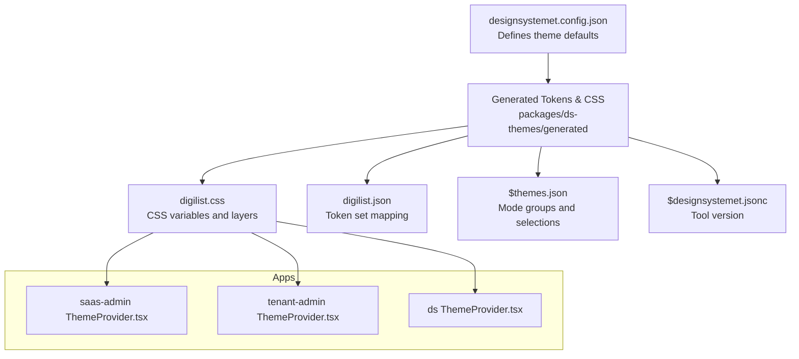
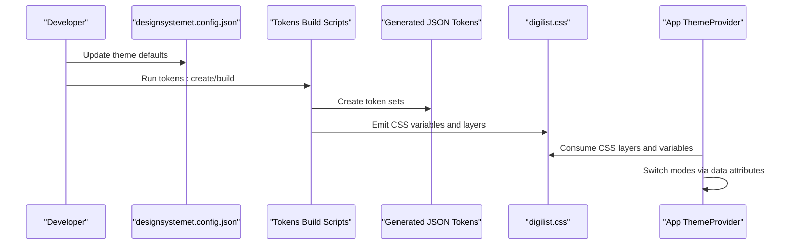
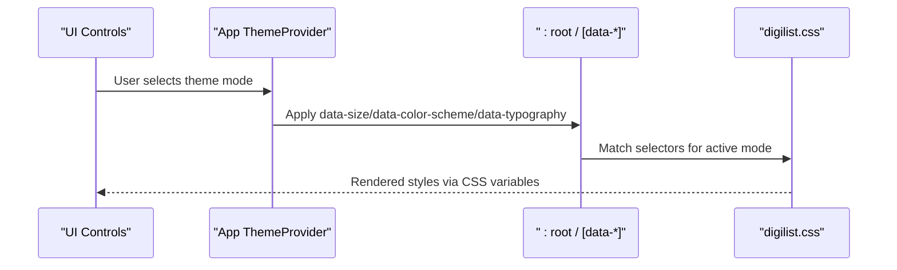
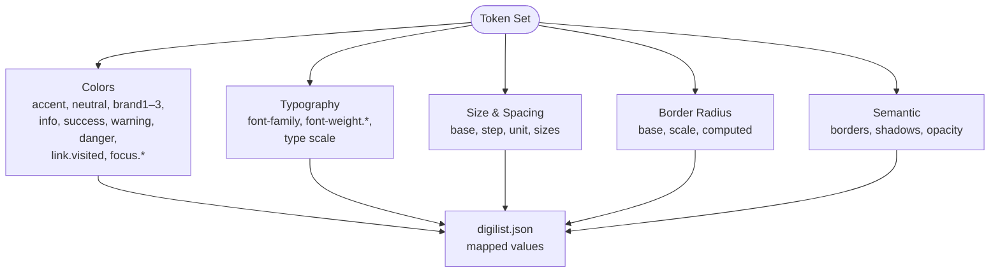
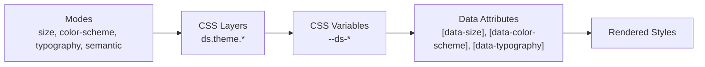
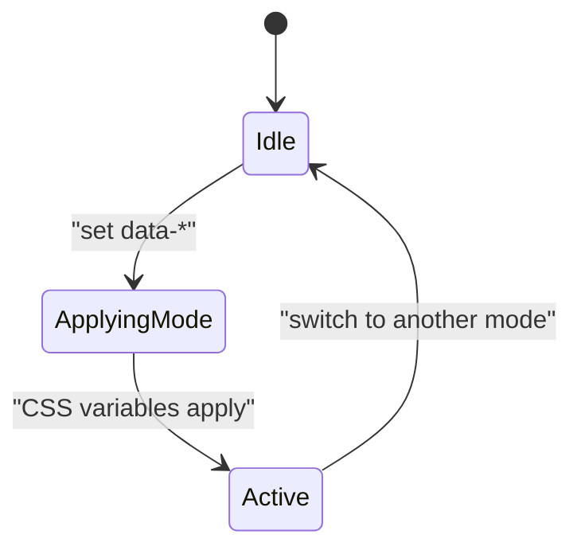
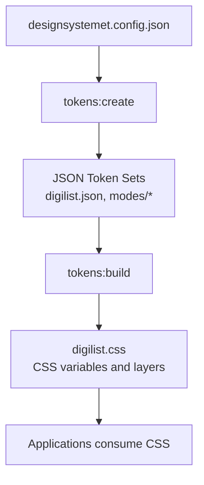
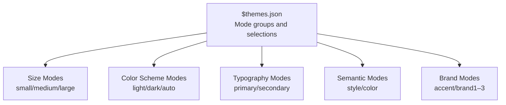
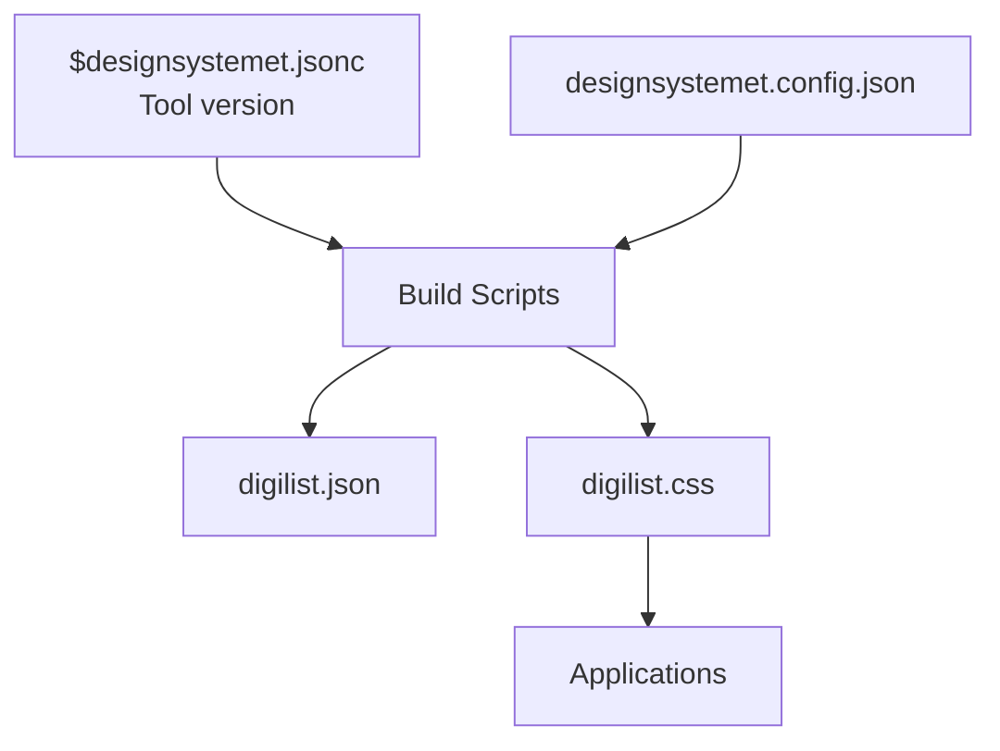

# Theme System

<cite>
**Referenced Files in This Document**
- [designsystemet.config.json](file://designsystemet.config.json)
- [package.json](file://packages/ds-themes/package.json)
- [ThemeProvider.tsx](file://packages/ds/src/ThemeProvider.tsx)
- [provider.tsx](file://packages/ds/src/provider.tsx)
- [ThemeProvider.tsx](file://apps/saas-admin/src/providers/ThemeProvider.tsx)
- [ThemeProvider.tsx](file://apps/tenant-admin/src/providers/ThemeProvider.tsx)
- [digilist.css](file://packages/ds-themes/generated/digilist.css)
- [digilist.json](file://packages/ds-themes/generated/themes/digilist.json)
- [$themes.json](file://packages/ds-themes/generated/$themes.json)
- [$designsystemet.jsonc](file://packages/ds-themes/generated/$designsystemet.jsonc)
- [tokens-create.mjs](file://packages/ds-themes/scripts/tokens-create.mjs)
- [tokens-build.mjs](file://packages/ds-themes/scripts/tokens-build.mjs)
</cite>

## Table of Contents
1. [Introduction](#introduction)
2. [Project Structure](#project-structure)
3. [Core Components](#core-components)
4. [Architecture Overview](#architecture-overview)
5. [Detailed Component Analysis](#detailed-component-analysis)
6. [Dependency Analysis](#dependency-analysis)
7. [Performance Considerations](#performance-considerations)
8. [Troubleshooting Guide](#troubleshooting-guide)
9. [Conclusion](#conclusion)
10. [Appendices](#appendices)

## Introduction
This document explains the theme system used across the monorepo’s design system and applications. It covers the design token architecture, CSS-in-JS implementation, theme provider components, theme switching mechanisms, and the relationship between design tokens and generated CSS. It also documents customization options, brand extension capabilities, and the theme compilation and CSS generation workflow. Practical guidance is included for creating custom themes, extending existing designs, and maintaining design consistency across applications.

## Project Structure
The theme system is organized around a centralized design token configuration and a generated CSS output consumed by applications. The key elements are:
- Design token configuration that defines brand colors, radii, and theme defaults
- Token generation and build scripts that produce JSON token sets and CSS variables
- Application-level theme providers that apply and switch themes via DOM attributes and CSS layers

**Diagram sources**
- [designsystemet.config.json](file://designsystemet.config.json#L1-L21)
- [digilist.css](file://packages/ds-themes/generated/digilist.css#L1-L1156)
- [digilist.json](file://packages/ds-themes/generated/themes/digilist.json#L1-L666)
- [$themes.json](file://packages/ds-themes/generated/$themes.json#L1-L135)
- [$designsystemet.jsonc](file://packages/ds-themes/generated/$designsystemet.jsonc#L1-L4)

**Section sources**
- [designsystemet.config.json](file://designsystemet.config.json#L1-L21)
- [package.json](file://packages/ds-themes/package.json#L1-L27)

## Core Components
- Design token configuration: Centralizes brand colors and base values for theme generation.
- Generated token sets: JSON maps that define color palettes, typography weights, border radii, and other design values.
- Generated CSS: Provides CSS variables grouped into layers for size modes, color schemes, typography, and semantics.
- Mode metadata: Describes available modes (size, color scheme, typography, semantic, main/support colors) and how token sets are selected.
- Theme provider components: Application wrappers that apply and switch themes via data attributes and consume the generated CSS.

Key responsibilities:
- Token configuration drives the entire theme system.
- Scripts generate tokens and build CSS from the configuration.
- Applications consume the generated CSS and switch themes by toggling data attributes.

**Section sources**
- [designsystemet.config.json](file://designsystemet.config.json#L1-L21)
- [digilist.json](file://packages/ds-themes/generated/themes/digilist.json#L1-L666)
- [digilist.css](file://packages/ds-themes/generated/digilist.css#L1-L1156)
- [$themes.json](file://packages/ds-themes/generated/$themes.json#L1-L135)
- [package.json](file://packages/ds-themes/package.json#L14-L18)

## Architecture Overview
The theme system follows a token-driven architecture:
- Configuration defines theme defaults (colors, radii).
- Scripts create and build tokens into structured JSON sets.
- CSS is generated with CSS variables inside named layers for easy scoping and overrides.
- Applications use theme provider components to switch modes via data attributes applied to the document root.

**Diagram sources**
- [designsystemet.config.json](file://designsystemet.config.json#L1-L21)
- [tokens-create.mjs](file://packages/ds-themes/scripts/tokens-create.mjs#L1-L9)
- [tokens-build.mjs](file://packages/ds-themes/scripts/tokens-build.mjs#L1-L9)
- [digilist.css](file://packages/ds-themes/generated/digilist.css#L1-L1156)
- [digilist.json](file://packages/ds-themes/generated/themes/digilist.json#L1-L666)

## Detailed Component Analysis

### Theme Provider Components
Application-level theme providers wrap the app and apply theme data attributes to the document root. They enable:
- Size mode switching (small/medium/large) via a data attribute
- Color scheme switching (light/dark/auto) via a data attribute
- Typography mode switching (primary/secondary) via a data attribute
- Semantic and main/support color mode switching via mode metadata

**Diagram sources**
- [ThemeProvider.tsx](file://apps/saas-admin/src/providers/ThemeProvider.tsx)
- [ThemeProvider.tsx](file://apps/tenant-admin/src/providers/ThemeProvider.tsx)
- [ThemeProvider.tsx](file://packages/ds/src/ThemeProvider.tsx)
- [provider.tsx](file://packages/ds/src/provider.tsx)
- [digilist.css](file://packages/ds-themes/generated/digilist.css#L1-L1156)

Implementation highlights:
- Providers attach data attributes to the document root to activate the appropriate CSS layers and variable sets.
- The design system exposes a shared provider that applications can reuse.

**Section sources**
- [ThemeProvider.tsx](file://apps/saas-admin/src/providers/ThemeProvider.tsx)
- [ThemeProvider.tsx](file://apps/tenant-admin/src/providers/ThemeProvider.tsx)
- [ThemeProvider.tsx](file://packages/ds/src/ThemeProvider.tsx)
- [provider.tsx](file://packages/ds/src/provider.tsx)

### Design Token Structure
The token system organizes design values into categories:
- Color palettes: accent, neutral, brand1–brand3, info, success, warning, danger, link visited, focus inner/outer
- Typography: font families, weights, type scale
- Spacing and sizing: base, step, unit, and derived sizes
- Border radius: base, scale, and computed values
- Semantic: border width, shadows, opacity for disabled states

**Diagram sources**
- [digilist.json](file://packages/ds-themes/generated/themes/digilist.json#L1-L666)

**Section sources**
- [digilist.json](file://packages/ds-themes/generated/themes/digilist.json#L1-L666)

### CSS-in-JS Implementation and Generated CSS
The generated CSS uses CSS variables and layers to implement a token-driven UI system:
- Layers separate concerns (size mode, color scheme, typography, semantic)
- Variables define color roles, type scale, spacing units, and radii
- Selectors target :root and [data-*] attributes to switch modes
- Media queries support prefers-color-scheme for automatic mode

**Diagram sources**
- [digilist.css](file://packages/ds-themes/generated/digilist.css#L1-L1156)

**Section sources**
- [digilist.css](file://packages/ds-themes/generated/digilist.css#L1-L1156)

### Theme Switching Mechanisms
Theme switching is achieved by toggling data attributes on the document root:
- Size mode: data-size="sm" | "md" | "lg"
- Color scheme: data-color-scheme="light" | "dark" | "auto"
- Typography: data-typography="primary" | "secondary"
- Semantic and brand modes: controlled by mode metadata and enabled token sets

**Diagram sources**
- [digilist.css](file://packages/ds-themes/generated/digilist.css#L1-L1156)
- [$themes.json](file://packages/ds-themes/generated/$themes.json#L1-L135)

**Section sources**
- [digilist.css](file://packages/ds-themes/generated/digilist.css#L1-L1156)
- [$themes.json](file://packages/ds-themes/generated/$themes.json#L1-L135)

### Theme Compilation and CSS Generation Workflow
The workflow converts configuration into tokens and CSS:
- tokens:create generates starter token sets from the configuration
- tokens:build compiles tokens into JSON sets and emits CSS variables
- prebuild runs the generation automatically during builds

**Diagram sources**
- [tokens-create.mjs](file://packages/ds-themes/scripts/tokens-create.mjs#L1-L9)
- [tokens-build.mjs](file://packages/ds-themes/scripts/tokens-build.mjs#L1-L9)
- [package.json](file://packages/ds-themes/package.json#L14-L18)
- [designsystemet.config.json](file://designsystemet.config.json#L1-L21)
- [digilist.json](file://packages/ds-themes/generated/themes/digilist.json#L1-L666)
- [digilist.css](file://packages/ds-themes/generated/digilist.css#L1-L1156)

**Section sources**
- [tokens-create.mjs](file://packages/ds-themes/scripts/tokens-create.mjs#L1-L9)
- [tokens-build.mjs](file://packages/ds-themes/scripts/tokens-build.mjs#L1-L9)
- [package.json](file://packages/ds-themes/package.json#L14-L18)

### Design Token Mapping and Mode Metadata
Mode metadata describes how token sets are combined to form themes:
- Size modes: small, medium, large
- Color scheme modes: light, dark, auto
- Typography modes: primary, secondary
- Semantic modes: style, color
- Main and support color modes: accent, brand1, brand2, brand3

**Diagram sources**
- [$themes.json](file://packages/ds-themes/generated/$themes.json#L1-L135)

**Section sources**
- [$themes.json](file://packages/ds-themes/generated/$themes.json#L1-L135)

### Examples and Best Practices
- Dark/light mode: Toggle data-color-scheme on the document root; CSS applies appropriate variables and media query fallbacks.
- Responsive design token usage: Combine data-size with type scale and spacing variables to adapt layouts across breakpoints.
- Theme overrides: Add application-specific CSS after importing digilist.css to override specific variables without changing generated tokens.
- Brand extension: Extend brand colors by adding new entries in the configuration and regenerating tokens/CSS.

[No sources needed since this section provides general guidance]

## Dependency Analysis
The theme system depends on:
- Tooling version pinned in metadata
- Configuration driving token creation and build
- Generated JSON and CSS consumed by applications

**Diagram sources**
- [$designsystemet.jsonc](file://packages/ds-themes/generated/$designsystemet.jsonc#L1-L4)
- [tokens-create.mjs](file://packages/ds-themes/scripts/tokens-create.mjs#L1-L9)
- [tokens-build.mjs](file://packages/ds-themes/scripts/tokens-build.mjs#L1-L9)
- [designsystemet.config.json](file://designsystemet.config.json#L1-L21)
- [digilist.json](file://packages/ds-themes/generated/themes/digilist.json#L1-L666)
- [digilist.css](file://packages/ds-themes/generated/digilist.css#L1-L1156)

**Section sources**
- [$designsystemet.jsonc](file://packages/ds-themes/generated/$designsystemet.jsonc#L1-L4)
- [tokens-create.mjs](file://packages/ds-themes/scripts/tokens-create.mjs#L1-L9)
- [tokens-build.mjs](file://packages/ds-themes/scripts/tokens-build.mjs#L1-L9)
- [designsystemet.config.json](file://designsystemet.config.json#L1-L21)

## Performance Considerations
- CSS layers isolate theme updates to specific concerns, minimizing cascade and repaint costs.
- CSS variables enable efficient switching via attribute changes without re-rendering components.
- Prefer data attributes over imperative JS to toggle modes for optimal performance.
- Keep token sets minimal and reuse computed values (e.g., border radius formulas) to reduce duplication.

[No sources needed since this section provides general guidance]

## Troubleshooting Guide
Common issues and resolutions:
- Modes not applying: Verify data attributes are set on the document root and selectors match the active mode.
- Missing variables: Confirm digilist.css is imported and the correct layer is active for the intended mode.
- Version mismatch: Ensure the tool version matches the pinned version in metadata.
- Overrides not taking effect: Ensure application CSS loads after the theme CSS to override variables.

**Section sources**
- [digilist.css](file://packages/ds-themes/generated/digilist.css#L1-L1156)
- [$designsystemet.jsonc](file://packages/ds-themes/generated/$designsystemet.jsonc#L1-L4)

## Conclusion
The theme system is built on a robust token architecture that generates CSS variables and layers, enabling flexible theme switching and consistent design across applications. By configuring brand defaults, generating tokens, and consuming the resulting CSS, teams can extend brands, customize themes, and maintain design consistency with minimal overhead.

[No sources needed since this section summarizes without analyzing specific files]

## Appendices

### Creating Custom Themes
Steps:
- Extend the configuration with new brand colors and values
- Run token generation to create updated token sets
- Rebuild CSS to emit new variables
- Import the updated CSS into applications
- Use theme providers to switch modes via data attributes

**Section sources**
- [designsystemet.config.json](file://designsystemet.config.json#L1-L21)
- [tokens-create.mjs](file://packages/ds-themes/scripts/tokens-create.mjs#L1-L9)
- [tokens-build.mjs](file://packages/ds-themes/scripts/tokens-build.mjs#L1-L9)
- [digilist.css](file://packages/ds-themes/generated/digilist.css#L1-L1156)

### Extending Existing Designs
Guidelines:
- Add new brand modes in the configuration and regenerate tokens
- Use mode metadata to select which token sets are enabled
- Override variables in application CSS after importing digilist.css
- Maintain consistent naming and layering to avoid conflicts

**Section sources**
- [$themes.json](file://packages/ds-themes/generated/$themes.json#L1-L135)
- [digilist.css](file://packages/ds-themes/generated/digilist.css#L1-L1156)

### Maintaining Design Consistency
Recommendations:
- Centralize configuration in designsystemet.config.json
- Use mode metadata to enforce consistent combinations
- Encourage component-level usage of CSS variables rather than hard-coded values
- Document theme overrides and brand extensions for team alignment

[No sources needed since this section provides general guidance]