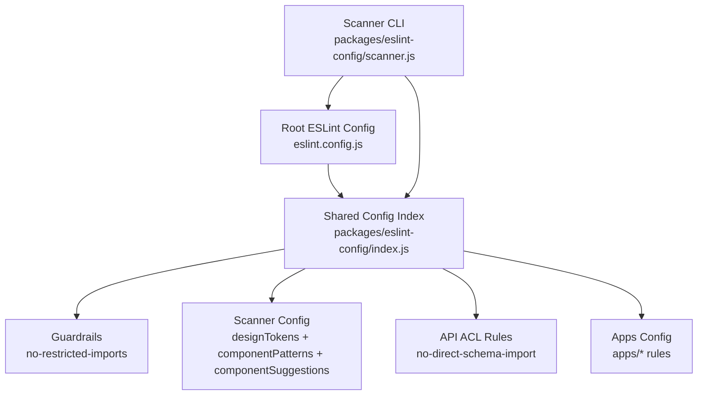
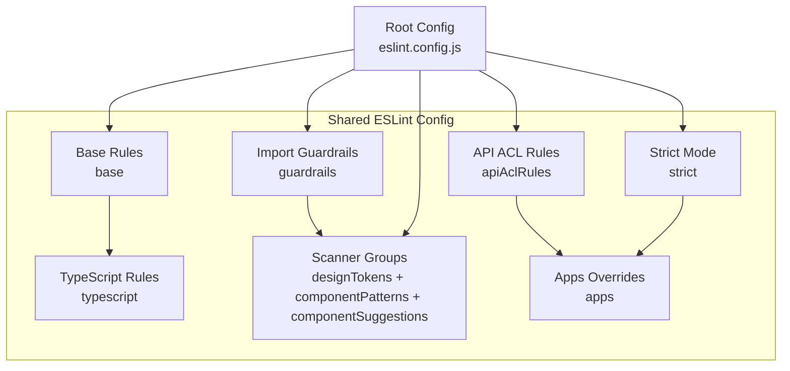
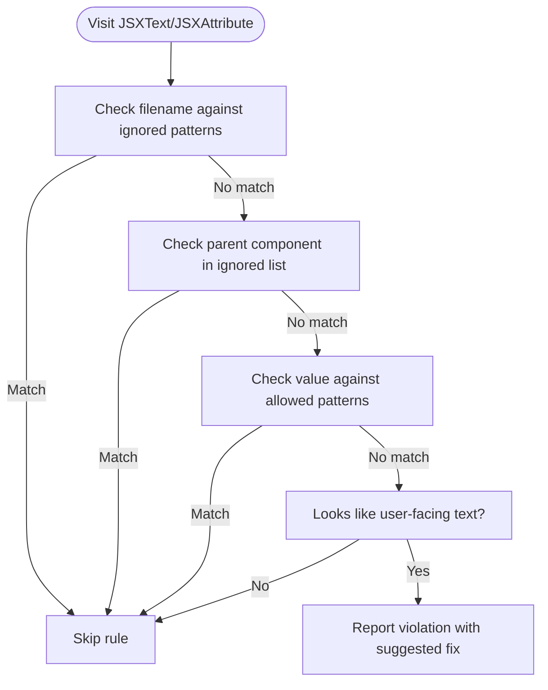
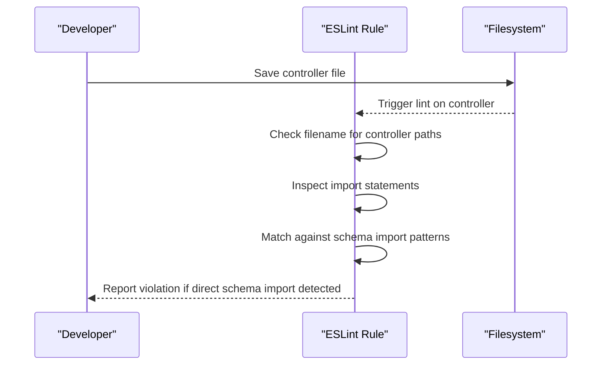
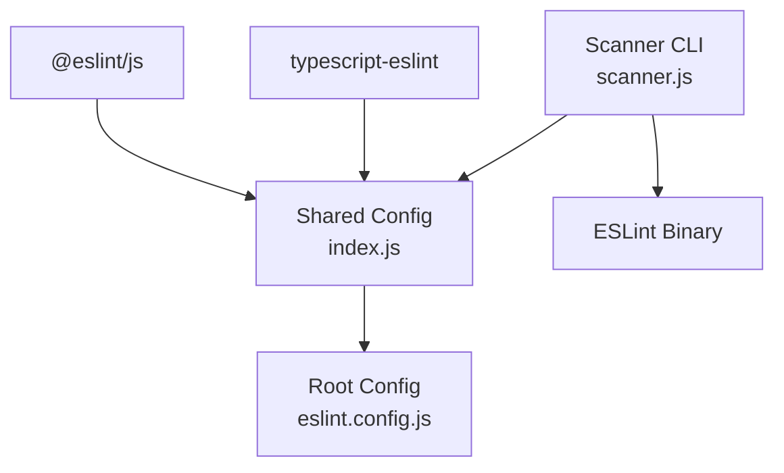
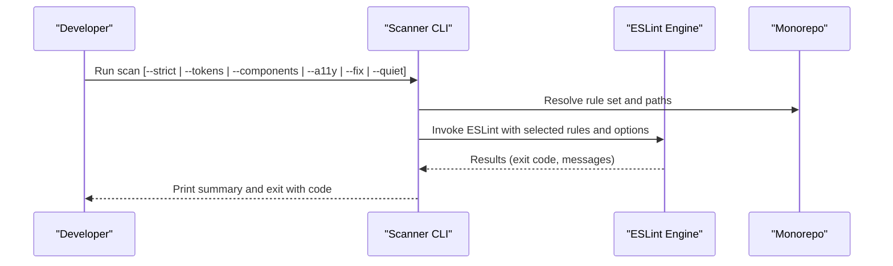

# ESLint Configuration

<cite>
**Referenced Files in This Document**
- [eslint.config.js](file://eslint.config.js)
- [index.js](file://packages/eslint-config/index.js)
- [scanner.js](file://packages/eslint-config/scanner.js)
- [package.json](file://packages/eslint-config/package.json)
- [rules/index.js](file://packages/eslint-config/rules/index.js)
- [i18n-no-hardcoded-strings.js](file://packages/eslint-config/rules/i18n-no-hardcoded-strings.js)
- [no-direct-schema-import.js](file://packages/eslint-config/rules/no-direct-schema-import.js)
- [prefer-ds-components.js](file://packages/eslint-config/rules/prefer-ds-components.js)
- [no-hardcoded-colors.js](file://packages/eslint-config/rules/no-hardcoded-colors.js)
- [require-provider.js](file://packages/eslint-config/rules/require-provider.js)
- [require-button-type.js](file://packages/eslint-config/rules/require-button-type.js)
- [package.json](file://package.json)
- [turbo.json](file://turbo.json)
</cite>

## Table of Contents
1. [Introduction](#introduction)
2. [Project Structure](#project-structure)
3. [Core Components](#core-components)
4. [Architecture Overview](#architecture-overview)
5. [Detailed Component Analysis](#detailed-component-analysis)
6. [Dependency Analysis](#dependency-analysis)
7. [Performance Considerations](#performance-considerations)
8. [Troubleshooting Guide](#troubleshooting-guide)
9. [Conclusion](#conclusion)
10. [Appendices](#appendices)

## Introduction
This document describes the shared ESLint configuration and enforcement strategy across the monorepo. It covers:
- Shared linting rules and categories (design tokens, component patterns, accessibility, import guardrails, API ACL enforcement, and i18n).
- Custom rules: i18n string validation, direct schema import prevention, and design system component preference.
- Rule rationale, violation examples, correct implementation patterns, configuration options, and exception handling.
- Code scanning integration, automated linting processes, and CI enforcement.
- Guidance for evolving rules, team consensus, and maintaining consistency across multiple applications.

## Project Structure
The ESLint configuration is centralized in a dedicated package and consumed by the monorepo’s root configuration. A scanner CLI provides focused scanning modes and auto-fix support.

**Diagram sources**
- [eslint.config.js](file://eslint.config.js#L1-L17)
- [index.js](file://packages/eslint-config/index.js#L1-L220)
- [scanner.js](file://packages/eslint-config/scanner.js#L1-L211)

**Section sources**
- [eslint.config.js](file://eslint.config.js#L1-L17)
- [index.js](file://packages/eslint-config/index.js#L1-L220)
- [scanner.js](file://packages/eslint-config/scanner.js#L1-L211)

## Core Components
- Root ESLint configuration aggregates shared presets and scanners.
- Shared configuration exports modular pieces: base, TypeScript, guardrails, design token rules, component pattern rules, component usage suggestions, API ACL rules, and strict mode.
- Scanner CLI provides multiple rule sets and auto-fix support.

Key highlights:
- Base and TypeScript presets enable modern JS/TS linting with recommended defaults.
- Guardrails restrict direct imports of external design system CSS and theme packages, with targeted exceptions.
- Scanner groups enforce design tokens, component patterns, and component usage suggestions.
- API ACL rules prevent direct schema imports in controllers.
- Strict mode elevates suggestions to errors for comprehensive enforcement.

**Section sources**
- [index.js](file://packages/eslint-config/index.js#L14-L220)
- [scanner.js](file://packages/eslint-config/scanner.js#L24-L53)

## Architecture Overview
The configuration architecture separates concerns into reusable modules and exposes them via a single index. Applications consume the shared configuration and can override selectively.

**Diagram sources**
- [index.js](file://packages/eslint-config/index.js#L14-L220)
- [eslint.config.js](file://eslint.config.js#L3-L16)

## Detailed Component Analysis

### i18n String Validation Rule
Purpose:
- Prevent hardcoded user-facing strings in JSX and attributes, enforcing translation keys from the i18n package.

Rationale:
- Ensures consistent internationalization and avoids missed translations.
- Reduces maintenance overhead by centralizing text handling.

Violation examples (conceptual):
- Using plain text in JSX text nodes or attributes like placeholder, aria-label.
- Using template literals that embed plain text without translation keys.

Correct implementation patterns:
- Wrap user-facing text with translation functions from the i18n package.
- Use translation keys for labels, placeholders, and accessible attributes.

Configuration options:
- ignoreComponents: Additional JSX components to ignore.
- ignoreAttributes: Additional attributes to ignore.
- ignorePatterns: Regex patterns to exclude from violations.

Exception handling:
- Test files, stories, configs, and utility setups are automatically ignored.
- Certain technical attributes and patterns are allowed by default.

**Diagram sources**
- [i18n-no-hardcoded-strings.js](file://packages/eslint-config/rules/i18n-no-hardcoded-strings.js#L168-L342)

**Section sources**
- [i18n-no-hardcoded-strings.js](file://packages/eslint-config/rules/i18n-no-hardcoded-strings.js#L1-L342)
- [rules/index.js](file://packages/eslint-config/rules/index.js#L15-L16)

### Direct Schema Import Prevention (API ACL Enforcement)
Purpose:
- Enforce Anti-Corruption Layer (ACL) by preventing controllers from importing database schema directly.

Rationale:
- Keeps controllers decoupled from raw database types.
- Encourages use of ACL mappers for data shaping and validation.

Violation examples (conceptual):
- Controllers importing schema files directly.
- Modules referencing schema types without ACL wrappers.

Correct implementation patterns:
- Import ACL mappers for data access and transformation.
- Keep schema imports scoped to appropriate layers (e.g., database, migrations).

**Diagram sources**
- [no-direct-schema-import.js](file://packages/eslint-config/rules/no-direct-schema-import.js#L38-L71)

**Section sources**
- [no-direct-schema-import.js](file://packages/eslint-config/rules/no-direct-schema-import.js#L1-L72)
- [index.js](file://packages/eslint-config/index.js#L151-L163)

### Design System Component Preference
Purpose:
- Suggest using @xala/ds components instead of native HTML elements when DS equivalents exist.

Rationale:
- Ensures consistent styling, behavior, and accessibility across the design system.
- Reduces visual and behavioral inconsistencies.

Violation examples (conceptual):
- Using native button, input, select, textarea, a, table, dialog, details, fieldset, label, ul, ol.
- Ignoring DS alternatives unnecessarily.

Correct implementation patterns:
- Replace native elements with DS components (e.g., Button, Textfield, Select, Link, Table, Modal, Accordion, Fieldset, Label, List).
- Use ignore option sparingly for cases where native elements are intentional.

Configuration options:
- ignore: Array of elements to ignore from warnings.

**Section sources**
- [prefer-ds-components.js](file://packages/eslint-config/rules/prefer-ds-components.js#L1-L114)
- [rules/index.js](file://packages/eslint-config/rules/index.js#L13-L13)

### Additional Custom Rules Overview
- No Hardcoded Colors: Enforce CSS variables for colors in style objects and JSX.
- Require Provider: Warn when DS components are used without the DesignsystemetProvider in entry files.
- Require Button Type: Require explicit type attribute on button elements to avoid unintended form submissions.

**Section sources**
- [no-hardcoded-colors.js](file://packages/eslint-config/rules/no-hardcoded-colors.js#L1-L137)
- [require-provider.js](file://packages/eslint-config/rules/require-provider.js#L1-L113)
- [require-button-type.js](file://packages/eslint-config/rules/require-button-type.js#L1-L52)

## Dependency Analysis
The shared configuration depends on ESLint and TypeScript ESlint packages. The scanner CLI depends on the shared configuration and invokes ESLint under the hood.

**Diagram sources**
- [package.json](file://packages/eslint-config/package.json#L7-L13)
- [index.js](file://packages/eslint-config/index.js#L1-L4)
- [scanner.js](file://packages/eslint-config/scanner.js#L17-L183)

**Section sources**
- [package.json](file://packages/eslint-config/package.json#L1-L15)
- [index.js](file://packages/eslint-config/index.js#L1-L4)
- [scanner.js](file://packages/eslint-config/scanner.js#L1-L211)

## Performance Considerations
- Scanner CLI supports auto-fix and quiet modes to reduce friction during development.
- Ignored paths (node_modules, dist, build, coverage, .turbo) minimize unnecessary scanning.
- Rule sets can be narrowed (tokens, components, accessibility) for faster feedback loops.

[No sources needed since this section provides general guidance]

## Troubleshooting Guide
Common issues and resolutions:
- TypeScript project parsing errors: Ensure tsconfig includes all relevant files.
- Conflicting rules: Override selectively in local configurations.
- Scanner CLI exit codes: Non-zero indicates violations; zero indicates clean run.

**Section sources**
- [package.json](file://package.json#L59-L630)

## Conclusion
The monorepo’s ESLint configuration enforces design system consistency, accessibility, import discipline, and internationalization through a combination of shared presets, custom rules, and a powerful scanner CLI. By leveraging strict mode and targeted rule sets, teams can maintain high code quality across multiple applications while preserving flexibility for exceptions.

[No sources needed since this section summarizes without analyzing specific files]

## Appendices

### Code Scanning Integration and Automated Processes
- Root ESLint config aggregates shared rules and ignores common directories.
- Scanner CLI supports multiple modes: default, strict, tokens-only, components-only, accessibility-only, and auto-fix.
- Turbo tasks define linting inputs and caching behavior.
- Root package.json scripts expose convenient commands for scanning and linting.

**Diagram sources**
- [scanner.js](file://packages/eslint-config/scanner.js#L151-L197)
- [eslint.config.js](file://eslint.config.js#L3-L16)
- [package.json](file://package.json#L26-L31)

**Section sources**
- [eslint.config.js](file://eslint.config.js#L1-L17)
- [scanner.js](file://packages/eslint-config/scanner.js#L1-L211)
- [package.json](file://package.json#L5-L54)
- [turbo.json](file://turbo.json#L1-L19)

### Continuous Integration Enforcement
- CI jobs can run the shared linting pipeline via the root script that triggers ESLint across the monorepo.
- Contract compliance and duplicate scans can be integrated into CI workflows.

**Section sources**
- [package.json](file://package.json#L56-L74)

### Adding New Rules and Modifying Existing Ones
Guidelines:
- Add new rules to the shared rules index and export them from the package.
- Introduce rule sets in the shared index (e.g., designTokens, componentPatterns, componentSuggestions).
- Provide scanner modes to toggle rule sets.
- Use strict mode to elevate suggestions to errors for critical consistency checks.
- Document rationale, configuration options, and exceptions for each rule.
- Coordinate rule changes through team consensus and communicate migration paths.

**Section sources**
- [rules/index.js](file://packages/eslint-config/rules/index.js#L1-L33)
- [index.js](file://packages/eslint-config/index.js#L96-L220)
- [scanner.js](file://packages/eslint-config/scanner.js#L24-L53)