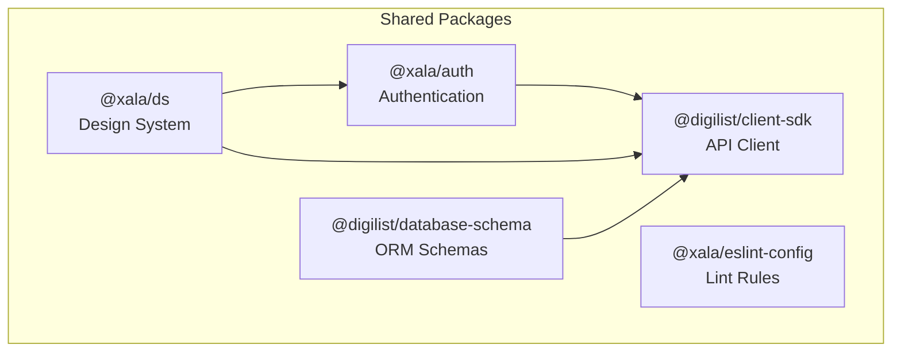
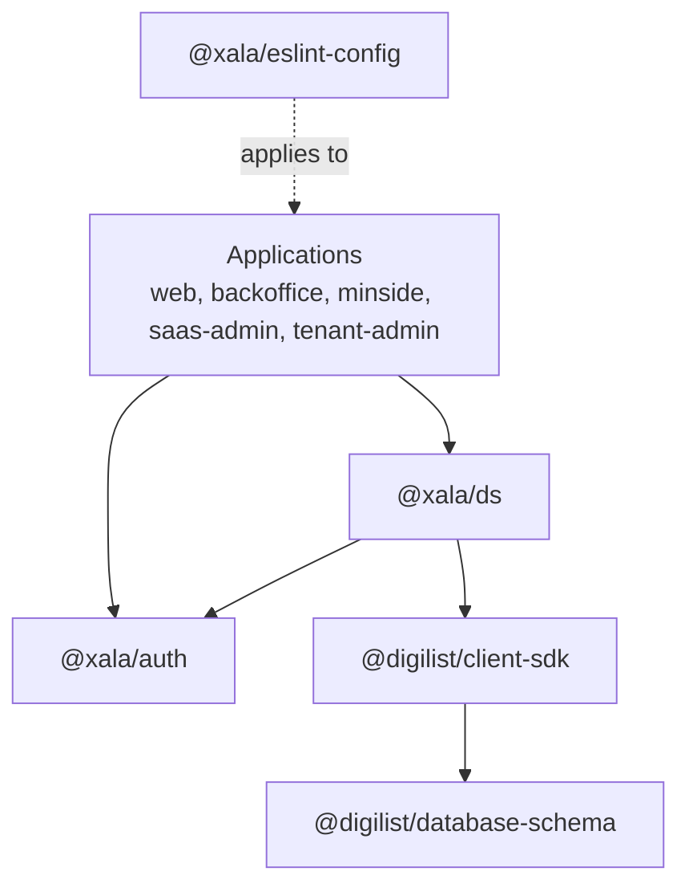
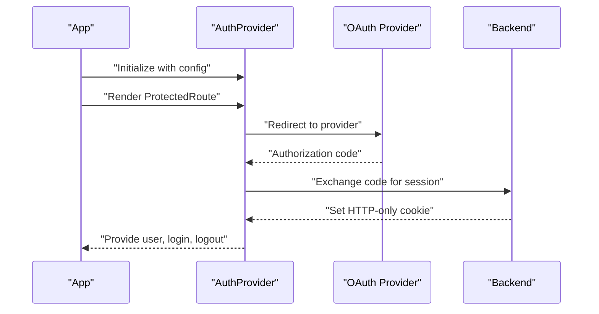
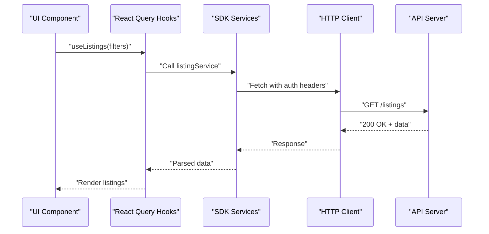
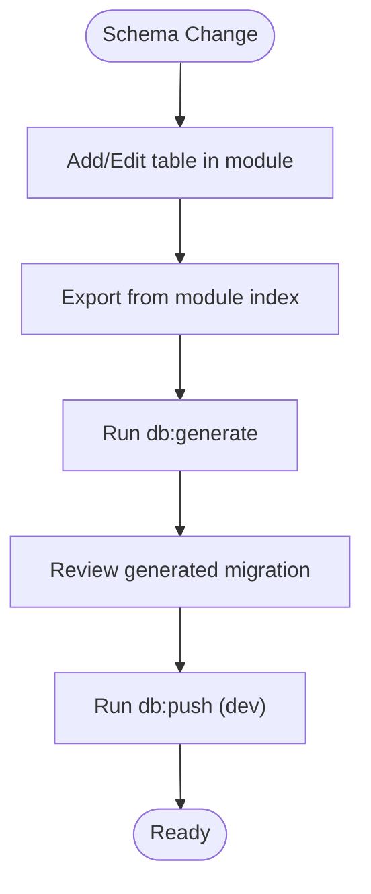
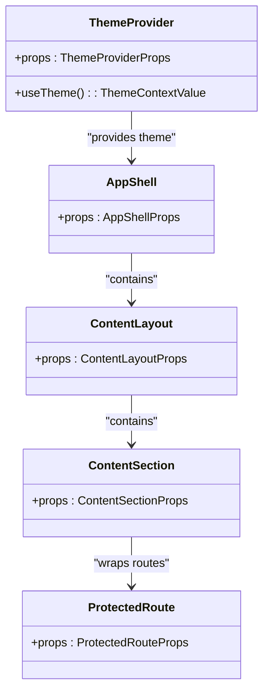
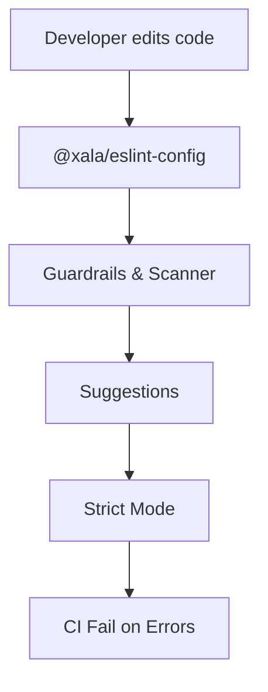
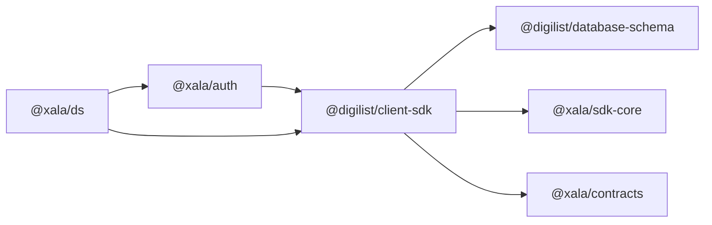

# Shared Packages

<cite>
**Referenced Files in This Document**
- [packages/auth/package.json](file://packages/auth/package.json)
- [packages/auth/src/index.ts](file://packages/auth/src/index.ts)
- [packages/auth/README.md](file://packages/auth/README.md)
- [packages/client-sdk/package.json](file://packages/client-sdk/package.json)
- [packages/client-sdk/src/index.ts](file://packages/client-sdk/src/index.ts)
- [packages/client-sdk/README.md](file://packages/client-sdk/README.md)
- [packages/database-schema/package.json](file://packages/database-schema/package.json)
- [packages/database-schema/src/index.ts](file://packages/database-schema/src/index.ts)
- [packages/database-schema/README.md](file://packages/database-schema/README.md)
- [packages/eslint-config/package.json](file://packages/eslint-config/package.json)
- [packages/eslint-config/index.js](file://packages/eslint-config/index.js)
- [packages/eslint-config/rules/index.js](file://packages/eslint-config/rules/index.js)
- [packages/ds/package.json](file://packages/ds/package.json)
- [packages/ds/src/index.ts](file://packages/ds/src/index.ts)
- [packages/ds/STRUCTURE.md](file://packages/ds/STRUCTURE.md)
</cite>

## Table of Contents
1. [Introduction](#introduction)
2. [Project Structure](#project-structure)
3. [Core Components](#core-components)
4. [Architecture Overview](#architecture-overview)
5. [Detailed Component Analysis](#detailed-component-analysis)
6. [Dependency Analysis](#dependency-analysis)
7. [Performance Considerations](#performance-considerations)
8. [Troubleshooting Guide](#troubleshooting-guide)
9. [Conclusion](#conclusion)
10. [Appendices](#appendices)

## Introduction
This document describes the shared packages that power the Xala/Digilist monorepo. It covers:
- Authentication package architecture and integration
- Client SDK implementation, export patterns, and usage
- Design system components and guardrails
- Database schema package organization and module boundaries
- ESLint configuration and enforcement rules

The goal is to provide a practical guide for consuming, extending, and upgrading these packages while maintaining consistent UI patterns and robust backend contracts.

## Project Structure
The shared packages live under packages/ and are organized by domain:
- @xala/auth: centralized authentication and RBAC
- @digilist/client-sdk: type-safe API client with 24 services, React Query hooks, and WebSocket real-time
- @digilist/database-schema: Drizzle ORM schemas grouped by domain modules
- @xala/ds: design system built on Digdir Designsystemet with guardrails
- @xala/eslint-config: shared linting rules and plugin for design system enforcement

**Diagram sources**
- [packages/auth/package.json](file://packages/auth/package.json#L1-L41)
- [packages/client-sdk/package.json](file://packages/client-sdk/package.json#L1-L101)
- [packages/database-schema/package.json](file://packages/database-schema/package.json#L1-L69)
- [packages/ds/package.json](file://packages/ds/package.json#L1-L42)
- [packages/eslint-config/package.json](file://packages/eslint-config/package.json#L1-L15)

**Section sources**
- [packages/auth/package.json](file://packages/auth/package.json#L1-L41)
- [packages/client-sdk/package.json](file://packages/client-sdk/package.json#L1-L101)
- [packages/database-schema/package.json](file://packages/database-schema/package.json#L1-L69)
- [packages/ds/package.json](file://packages/ds/package.json#L1-L42)
- [packages/eslint-config/package.json](file://packages/eslint-config/package.json#L1-L15)

## Core Components
This section outlines the primary responsibilities and export patterns of each shared package.

- @xala/auth
  - Provides AuthProvider, useAuth, OAuth handlers, ProtectedRoute, and configuration types.
  - Exports nested namespaces for providers, hooks, components, types, and config.
  - Peer dependencies: react, react-router-dom.
  - Internal dependency: @digilist/client-sdk.

- @digilist/client-sdk
  - Exposes client factory, HTTP client interface, 24+ services, React Query hooks, realtime client, utilities, DAL, providers, and localization.
  - Supports React and @tanstack/react-query as optional peer dependencies.
  - Dependencies: @xala/contracts, @xala/sdk-core, browser-image-compression.

- @digilist/database-schema
  - Exports schemas and domain modules: core, domain, platform, saas, compliance.
  - Provides typed table definitions and module-level exports for safe imports.
  - Scripts for typecheck, db:generate, db:push, seed.

- @xala/ds
  - Re-exports @digdir/designsystemet-react primitives and adds custom primitives, composed, blocks, shells, providers, and utilities.
  - Enforces CSS import policy: applications must import styles via @xala/ds/styles.
  - Private package with internal dependencies on @xala/auth, @xala/ds-themes, @xala/i18n, @digilist/client-sdk.

- @xala/eslint-config
  - Defines base, TypeScript, guardrails, design tokens, component patterns, API ACL rules, and strict modes.
  - Provides a digdir plugin with custom rules for design tokens and component usage.

**Section sources**
- [packages/auth/src/index.ts](file://packages/auth/src/index.ts#L1-L52)
- [packages/client-sdk/src/index.ts](file://packages/client-sdk/src/index.ts#L1-L168)
- [packages/database-schema/src/index.ts](file://packages/database-schema/src/index.ts#L1-L32)
- [packages/ds/src/index.ts](file://packages/ds/src/index.ts#L1-L596)
- [packages/eslint-config/index.js](file://packages/eslint-config/index.js#L1-L220)

## Architecture Overview
The shared packages form a cohesive layer that:
- Centralizes authentication and RBAC across applications
- Provides a type-safe API surface for frontend consumption
- Establishes consistent UI patterns and theme management
- Enforces schema governance and migration hygiene
- Applies lint-time guardrails to maintain design system discipline

**Diagram sources**
- [packages/auth/package.json](file://packages/auth/package.json#L1-L41)
- [packages/client-sdk/package.json](file://packages/client-sdk/package.json#L1-L101)
- [packages/database-schema/package.json](file://packages/database-schema/package.json#L1-L69)
- [packages/ds/package.json](file://packages/ds/package.json#L1-L42)
- [packages/eslint-config/package.json](file://packages/eslint-config/package.json#L1-L15)

## Detailed Component Analysis

### Authentication Package (@xala/auth)
- Purpose: Single source of truth for authentication across Xala/Digilist applications with cross-tab sync, OAuth providers, and RBAC per app type.
- Key exports:
  - AuthProvider, useAuth, useOAuthCallback, ProtectedRoute
  - Config types and provider factories (idportenProvider, vippsProvider, microsoftProvider, demoProvider)
  - App-specific configs (webAuthConfig, minsideAuthConfig, backofficeAuthConfig, saasAdminAuthConfig)
- Integration:
  - Wrap application root with AuthProvider and configure appType and optional overrides.
  - Use useAuth for authentication state and ProtectedRoute for route protection.
- Security model:
  - HTTP-only cookies, OAuth code exchange, cross-tab synchronization, and no mock auth.

**Diagram sources**
- [packages/auth/src/index.ts](file://packages/auth/src/index.ts#L17-L51)
- [packages/auth/README.md](file://packages/auth/README.md#L1-L214)

**Section sources**
- [packages/auth/src/index.ts](file://packages/auth/src/index.ts#L1-L52)
- [packages/auth/package.json](file://packages/auth/package.json#L1-L41)
- [packages/auth/README.md](file://packages/auth/README.md#L1-L214)

### Client SDK (@digilist/client-sdk)
- Purpose: Enterprise-grade, type-safe SDK for the Digilist API with 24+ services, React Query hooks, and WebSocket real-time.
- Key exports:
  - Client factory: initializeClient, getClient, updateClientConfig, setAuthToken, resetClient
  - Services: listingService, bookingService, organizationService, userService, storageService, and many others
  - React Query hooks: useListings, useBookings, useCreateBooking, etc.
  - Realtime client: realtimeClient with event subscriptions
  - Utilities: date/time formatting, geocoding, upload progress helpers
  - Providers: RealtimeProvider
  - Localization: translation key constants
- Integration:
  - Initialize once at app startup with baseUrl and tenantId.
  - Use services directly or React Query hooks for data fetching.
  - Connect realtimeClient for live updates.
- Peer dependencies:
  - @tanstack/react-query, react, react-router-dom are optional to preserve SDK flexibility.

**Diagram sources**
- [packages/client-sdk/src/index.ts](file://packages/client-sdk/src/index.ts#L30-L101)
- [packages/client-sdk/README.md](file://packages/client-sdk/README.md#L1-L872)

**Section sources**
- [packages/client-sdk/src/index.ts](file://packages/client-sdk/src/index.ts#L1-L168)
- [packages/client-sdk/package.json](file://packages/client-sdk/package.json#L1-L101)
- [packages/client-sdk/README.md](file://packages/client-sdk/README.md#L1-L872)

### Database Schema Package (@digilist/database-schema)
- Purpose: Single source of truth for Drizzle ORM schemas with module-based organization and automated migrations.
- Modules:
  - core: tenants, organizations, users
  - domain: rental-objects, bookings
  - platform: sessions, memberships, permissions
  - saas: entitlements, plans, route/nav policies
  - compliance: audit-logs
- Usage:
  - Import tables directly or from module namespaces.
  - Generate and push migrations via provided scripts.
  - Seed data via seed scripts.

**Diagram sources**
- [packages/database-schema/src/index.ts](file://packages/database-schema/src/index.ts#L15-L31)
- [packages/database-schema/README.md](file://packages/database-schema/README.md#L1-L145)

**Section sources**
- [packages/database-schema/src/index.ts](file://packages/database-schema/src/index.ts#L1-L32)
- [packages/database-schema/package.json](file://packages/database-schema/package.json#L1-L69)
- [packages/database-schema/README.md](file://packages/database-schema/README.md#L1-L145)

### Design System (@xala/ds)
- Purpose: Production-ready components built on Digdir Designsystemet with enforced guardrails.
- Component hierarchy:
  - Primitives: low-level building blocks (Container, Grid, Stack, re-exported Digdir components)
  - Composed: mid-level components (ContentLayout, ContentSection, PageHeader, ProtectedRoute, etc.)
  - Blocks: business logic components (GDPR, ErrorBoundary, Status badges, Charts, Auth screens)
  - Shells: application-level layouts (AppShell, AppLayout)
- Provider and theming:
  - ThemeProvider and useTheme for theme switching
  - Provider re-exports for global setup
- Guardrails:
  - Applications must import styles via @xala/ds/styles to avoid CSS duplication and ensure theme switching works.
  - ESLint rules enforce design tokens and component usage patterns.

**Diagram sources**
- [packages/ds/src/index.ts](file://packages/ds/src/index.ts#L58-L188)

**Section sources**
- [packages/ds/src/index.ts](file://packages/ds/src/index.ts#L1-L596)
- [packages/ds/package.json](file://packages/ds/package.json#L1-L42)
- [packages/ds/STRUCTURE.md](file://packages/ds/STRUCTURE.md#L1-L154)

### ESLint Configuration (@xala/eslint-config)
- Purpose: Shared lint rules and plugin to enforce design tokens, component patterns, and API ACL discipline.
- Configurations:
  - base: recommended JS rules
  - typescript: TypeScript-specific rules
  - guardrails: import restrictions (e.g., disallow direct @digdir CSS imports)
  - designTokens: rules for color, spacing, typography, border radius
  - componentPatterns: component usage rules (e.g., require-button-type)
  - componentSuggestions: suggestions to prefer DS components and providers
  - apiAclRules: restrict direct schema imports in API modules
  - apps: combined rules for applications
  - strict: all rules as errors
- Plugin:
  - @xala/eslint-plugin-digdir with custom rules for design system enforcement

**Diagram sources**
- [packages/eslint-config/index.js](file://packages/eslint-config/index.js#L64-L216)
- [packages/eslint-config/rules/index.js](file://packages/eslint-config/rules/index.js#L1-L33)

**Section sources**
- [packages/eslint-config/package.json](file://packages/eslint-config/package.json#L1-L15)
- [packages/eslint-config/index.js](file://packages/eslint-config/index.js#L1-L220)
- [packages/eslint-config/rules/index.js](file://packages/eslint-config/rules/index.js#L1-L33)

## Dependency Analysis
- Internal dependencies:
  - @xala/auth depends on @digilist/client-sdk
  - @xala/ds depends on @xala/auth, @xala/ds-themes, @xala/i18n, @digilist/client-sdk
  - @digilist/client-sdk depends on @xala/contracts and @xala/sdk-core
  - @digilist/database-schema is consumed by @digilist/client-sdk for types and migrations
- External dependencies:
  - @digilist/client-sdk depends on browser-image-compression
  - @xala/ds depends on @digdir/designsystemet-css, @digdir/designsystemet-react, mapbox-gl, react-map-gl
- Peer dependencies:
  - @xala/auth: react, react-router-dom
  - @digilist/client-sdk: @tanstack/react-query, react, react-router-dom (optional)
  - @xala/ds: react, react-dom, react-router-dom

**Diagram sources**
- [packages/auth/package.json](file://packages/auth/package.json#L21-L27)
- [packages/client-sdk/package.json](file://packages/client-sdk/package.json#L60-L64)
- [packages/ds/package.json](file://packages/ds/package.json#L22-L34)

**Section sources**
- [packages/auth/package.json](file://packages/auth/package.json#L1-L41)
- [packages/client-sdk/package.json](file://packages/client-sdk/package.json#L1-L101)
- [packages/database-schema/package.json](file://packages/database-schema/package.json#L1-L69)
- [packages/ds/package.json](file://packages/ds/package.json#L1-L42)

## Performance Considerations
- Client SDK
  - React Query caching reduces redundant network calls; tune queryKey and staleTime appropriately.
  - Image compression options reduce payload sizes for uploads; adjust maxSizeMB and maxWidthOrHeight based on UX requirements.
  - WebSocket connections should auto-reconnect; ensure backoff strategies are configured.
- Database Schema
  - Use module-level imports to avoid loading unnecessary tables.
  - Keep migrations minimal and incremental; run db:generate and review before pushing.
- Design System
  - Prefer DS components to leverage optimized rendering and consistent styles.
  - Avoid direct CSS imports; use @xala/ds/styles to prevent duplicate styles and improve theme switching performance.

[No sources needed since this section provides general guidance]

## Troubleshooting Guide
- Authentication
  - If login redirects loop, verify appType and provider configuration in AuthProvider.
  - For cross-tab issues, ensure HTTP-only cookies and SameSite attributes are correctly set server-side.
- Client SDK
  - If React Query hooks fail, confirm client initialization and tenantId.
  - For upload failures, check file validation and compression options; inspect ApiError codes.
  - Realtime events not received: verify WebSocket URL and autoReconnect settings.
- Database Schema
  - If migrations stall, split changes into smaller commits and regenerate migrations.
  - For seed import issues, ensure DATABASE_URL is exported and run seed script from package directory.
- Design System
  - If styles appear inconsistent, ensure @xala/ds/styles is imported once in the app entry point.
  - ESLint errors about hardcoded tokens: replace with design tokens and DS utilities.
- ESLint
  - If guardrail rules conflict with legitimate imports, whitelist only the specific file (e.g., styles.ts) as permitted.

**Section sources**
- [packages/auth/README.md](file://packages/auth/README.md#L156-L214)
- [packages/client-sdk/README.md](file://packages/client-sdk/README.md#L546-L777)
- [packages/database-schema/README.md](file://packages/database-schema/README.md#L115-L145)
- [packages/ds/src/index.ts](file://packages/ds/src/index.ts#L589-L596)
- [packages/eslint-config/index.js](file://packages/eslint-config/index.js#L64-L194)

## Conclusion
The shared packages establish a consistent, type-safe, and maintainable foundation across the monorepo:
- Authentication is centralized and secure
- The API client is comprehensive and developer-friendly
- The database schema is modular and governed
- The design system enforces UI consistency with strong guardrails
- ESLint rules ensure adherence to design and architecture principles

Adhering to the integration guidelines and upgrade procedures outlined here will keep applications aligned with the platform’s standards and reduce technical debt.

[No sources needed since this section summarizes without analyzing specific files]

## Appendices

### Usage Examples and Extension Points
- Authentication
  - Wrap app with AuthProvider and configure appType and redirects.
  - Use useAuth for authentication state and ProtectedRoute for protected routes.
- Client SDK
  - Initialize client at startup; consume services or React Query hooks; connect realtimeClient for live updates.
  - Extend by adding new service wrappers and updating types.
- Database Schema
  - Add tables to appropriate modules and export from module index; regenerate migrations.
- Design System
  - Import components from @xala/ds; use ThemeProvider; extend via custom primitives or composed components.
- ESLint
  - Apply @xala/eslint-config to projects; use guardrails and strict modes for stricter enforcement.

**Section sources**
- [packages/auth/README.md](file://packages/auth/README.md#L24-L87)
- [packages/client-sdk/README.md](file://packages/client-sdk/README.md#L14-L41)
- [packages/database-schema/README.md](file://packages/database-schema/README.md#L99-L130)
- [packages/ds/STRUCTURE.md](file://packages/ds/STRUCTURE.md#L69-L93)
- [packages/eslint-config/index.js](file://packages/eslint-config/index.js#L165-L194)

### Version Management and Upgrade Procedures
- Monorepo workspace dependencies
  - Use workspace:* for internal packages to ensure consistent versions across apps.
- Breaking changes
  - Review changelogs and migration guides for major updates to @xala/auth, @digilist/client-sdk, @xala/ds, and @xala/eslint-config.
- Build and test
  - Run package-specific tests and coverage; ensure lint passes with @xala/eslint-config.
- Database schema upgrades
  - Generate and review migrations; push only after testing in staging.

**Section sources**
- [packages/auth/package.json](file://packages/auth/package.json#L22-L22)
- [packages/client-sdk/package.json](file://packages/client-sdk/package.json#L61-L62)
- [packages/database-schema/package.json](file://packages/database-schema/package.json#L54-L56)
- [packages/ds/package.json](file://packages/ds/package.json#L25-L29)
- [packages/eslint-config/package.json](file://packages/eslint-config/package.json#L7-L13)