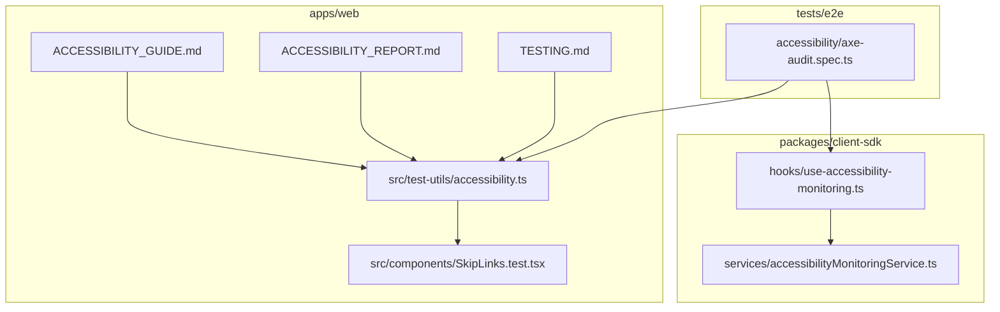
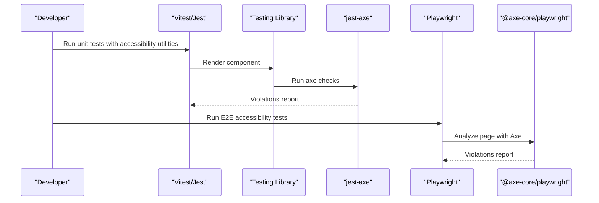
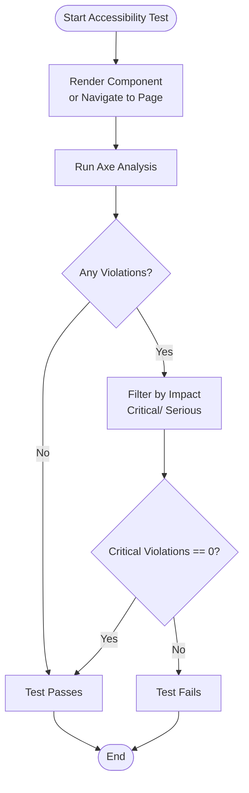
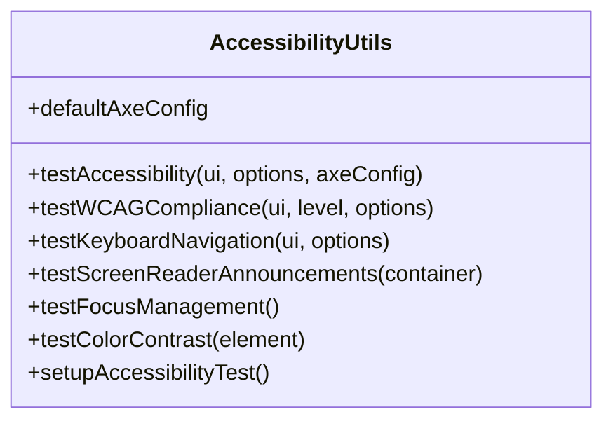
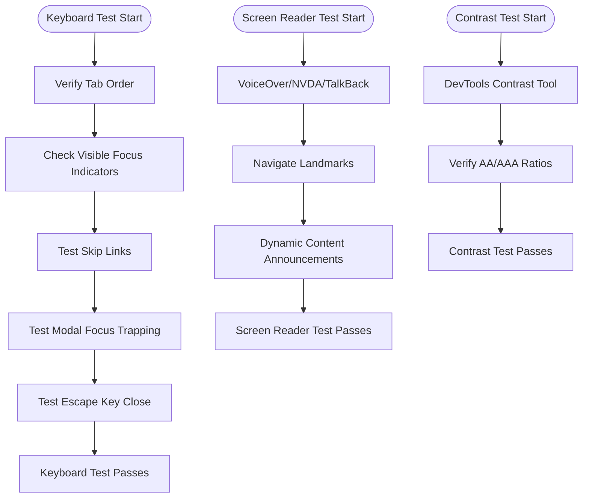
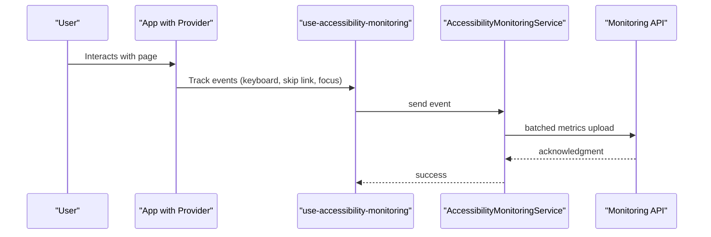
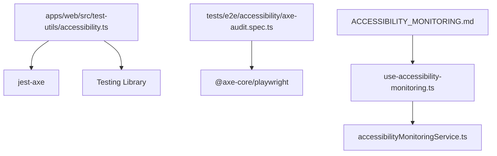

# Accessibility Testing

<cite>
**Referenced Files in This Document**
- [ACCESSIBILITY_GUIDE.md](file://apps/web/ACCESSIBILITY_GUIDE.md)
- [ACCESSIBILITY_MONITORING.md](file://apps/web/ACCESSIBILITY_MONITORING.md)
- [ACCESSIBILITY_REPORT.md](file://apps/web/ACCESSIBILITY_REPORT.md)
- [TESTING.md](file://apps/web/TESTING.md)
- [accessibility.ts](file://apps/web/src/test-utils/accessibility.ts)
- [axe-audit.spec.ts](file://tests/e2e/accessibility/axe-audit.spec.ts)
- [SkipLinks.test.tsx](file://apps/web/src/components/SkipLinks.test.tsx)
- [use-accessibility-monitoring.ts](file://packages/client-sdk/src/hooks/use-accessibility-monitoring.ts)
- [accessibilityMonitoringService.ts](file://packages/client-sdk/src/services/accessibilityMonitoringService.ts)
</cite>

## Table of Contents
1. [Introduction](#introduction)
2. [Project Structure](#project-structure)
3. [Core Components](#core-components)
4. [Architecture Overview](#architecture-overview)
5. [Detailed Component Analysis](#detailed-component-analysis)
6. [Dependency Analysis](#dependency-analysis)
7. [Performance Considerations](#performance-considerations)
8. [Troubleshooting Guide](#troubleshooting-guide)
9. [Conclusion](#conclusion)
10. [Appendices](#appendices)

## Introduction
This document provides comprehensive accessibility testing guidance for WCAG 2.1 AA compliance across all applications and components in the monorepo. It covers automated accessibility audits using Axe, manual verification procedures, keyboard navigation testing, screen reader compatibility checks, color contrast validation, and ongoing monitoring. It also documents the accessibility testing framework, test utilities, and reporting mechanisms used in the apps/web application.

## Project Structure
The accessibility testing framework is centered around the apps/web application and integrates with Playwright E2E tests, Vitest unit tests, and a dedicated test utilities module. Monitoring is supported through a client SDK and a monitoring provider.

**Diagram sources**
- [ACCESSIBILITY_GUIDE.md](file://apps/web/ACCESSIBILITY_GUIDE.md#L1-L630)
- [ACCESSIBILITY_REPORT.md](file://apps/web/ACCESSIBILITY_REPORT.md#L1-L342)
- [TESTING.md](file://apps/web/TESTING.md#L1-L492)
- [accessibility.ts](file://apps/web/src/test-utils/accessibility.ts#L1-L315)
- [axe-audit.spec.ts](file://tests/e2e/accessibility/axe-audit.spec.ts#L1-L349)
- [SkipLinks.test.tsx](file://apps/web/src/components/SkipLinks.test.tsx#L1-L191)
- [use-accessibility-monitoring.ts](file://packages/client-sdk/src/hooks/use-accessibility-monitoring.ts)
- [accessibilityMonitoringService.ts](file://packages/client-sdk/src/services/accessibilityMonitoringService.ts)

**Section sources**
- [ACCESSIBILITY_GUIDE.md](file://apps/web/ACCESSIBILITY_GUIDE.md#L1-L630)
- [ACCESSIBILITY_REPORT.md](file://apps/web/ACCESSIBILITY_REPORT.md#L1-L342)
- [TESTING.md](file://apps/web/TESTING.md#L1-L492)
- [accessibility.ts](file://apps/web/src/test-utils/accessibility.ts#L1-L315)
- [axe-audit.spec.ts](file://tests/e2e/accessibility/axe-audit.spec.ts#L1-L349)
- [SkipLinks.test.tsx](file://apps/web/src/components/SkipLinks.test.tsx#L1-L191)
- [use-accessibility-monitoring.ts](file://packages/client-sdk/src/hooks/use-accessibility-monitoring.ts)
- [accessibilityMonitoringService.ts](file://packages/client-sdk/src/services/accessibilityMonitoringService.ts)

## Core Components
- Automated accessibility testing with Axe in E2E tests using Playwright and in unit tests using jest-axe.
- A comprehensive test utilities module providing helper functions for accessibility, keyboard navigation, screen reader announcements, focus management, and color contrast checks.
- Manual testing procedures for keyboard navigation, screen reader compatibility, and color contrast validation.
- Accessibility monitoring system for production metrics collection and dashboard visualization.
- Reporting and compliance validation documentation for WCAG 2.1 AA and AAA levels.

**Section sources**
- [accessibility.ts](file://apps/web/src/test-utils/accessibility.ts#L1-L315)
- [axe-audit.spec.ts](file://tests/e2e/accessibility/axe-audit.spec.ts#L1-L349)
- [TESTING.md](file://apps/web/TESTING.md#L1-L492)
- [ACCESSIBILITY_MONITORING.md](file://apps/web/ACCESSIBILITY_MONITORING.md#L1-L540)
- [ACCESSIBILITY_REPORT.md](file://apps/web/ACCESSIBILITY_REPORT.md#L1-L342)

## Architecture Overview
The accessibility testing architecture combines unit-level checks with jest-axe, E2E checks with @axe-core/playwright, and production monitoring via a client SDK.

**Diagram sources**
- [accessibility.ts](file://apps/web/src/test-utils/accessibility.ts#L65-L111)
- [axe-audit.spec.ts](file://tests/e2e/accessibility/axe-audit.spec.ts#L21-L35)

**Section sources**
- [accessibility.ts](file://apps/web/src/test-utils/accessibility.ts#L1-L315)
- [axe-audit.spec.ts](file://tests/e2e/accessibility/axe-audit.spec.ts#L1-L349)

## Detailed Component Analysis

### Automated Accessibility Testing with Axe
- Unit tests: The test utilities module exposes functions to run accessibility checks and WCAG compliance tests at A, AA, and AAA levels. It configures axe rules and integrates with Testing Library.
- E2E tests: Playwright tests use @axe-core/playwright to analyze pages for WCAG 2.1 AA compliance, filter critical violations, and validate keyboard navigation, ARIA labels, and color contrast.

**Diagram sources**
- [accessibility.ts](file://apps/web/src/test-utils/accessibility.ts#L65-L111)
- [axe-audit.spec.ts](file://tests/e2e/accessibility/axe-audit.spec.ts#L21-L35)

**Section sources**
- [accessibility.ts](file://apps/web/src/test-utils/accessibility.ts#L16-L111)
- [axe-audit.spec.ts](file://tests/e2e/accessibility/axe-audit.spec.ts#L42-L101)

### Test Utilities Module
The test utilities module centralizes accessibility testing patterns:
- testAccessibility: Runs axe checks with default WCAG 2.1 rules.
- testWCAGCompliance: Filters axe rules by WCAG level (A/AA/AAA).
- testKeyboardNavigation: Provides keyboard interaction helpers (Tab, Enter, Space, Escape, arrows).
- testScreenReaderAnnouncements: Finds aria-live regions, alerts, and statuses.
- testFocusManagement: Verifies focus state and visible focus indicators.
- testColorContrast: Returns computed styles for contrast validation.

**Diagram sources**
- [accessibility.ts](file://apps/web/src/test-utils/accessibility.ts#L19-L315)

**Section sources**
- [accessibility.ts](file://apps/web/src/test-utils/accessibility.ts#L1-L315)

### Manual Accessibility Verification Procedures
Manual testing covers:
- Keyboard navigation: Tab order, focus indicators, skip links, modal focus trapping, Escape key behavior.
- Screen reader compatibility: VoiceOver/NVDA/TalkBack testing, landmark navigation, dynamic content announcements.
- Color contrast: Using browser devtools and external tools to verify AA/AAA ratios.

**Diagram sources**
- [ACCESSIBILITY_GUIDE.md](file://apps/web/ACCESSIBILITY_GUIDE.md#L420-L460)

**Section sources**
- [ACCESSIBILITY_GUIDE.md](file://apps/web/ACCESSIBILITY_GUIDE.md#L418-L460)

### Accessibility Monitoring System
The monitoring system tracks real-time accessibility metrics in production and provides a dashboard:
- Metrics include keyboard navigation, screen reader detection, skip link usage, focus management, ARIA announcements, and page load performance.
- Compliance scoring is calculated from weighted factors across metrics.
- Privacy-preserving data collection with anonymous sessions and aggregate reporting.
- SDK hooks and service for enabling monitoring, tracking events, and fetching reports.

**Diagram sources**
- [ACCESSIBILITY_MONITORING.md](file://apps/web/ACCESSIBILITY_MONITORING.md#L27-L87)
- [use-accessibility-monitoring.ts](file://packages/client-sdk/src/hooks/use-accessibility-monitoring.ts)
- [accessibilityMonitoringService.ts](file://packages/client-sdk/src/services/accessibilityMonitoringService.ts)

**Section sources**
- [ACCESSIBILITY_MONITORING.md](file://apps/web/ACCESSIBILITY_MONITORING.md#L1-L540)
- [use-accessibility-monitoring.ts](file://packages/client-sdk/src/hooks/use-accessibility-monitoring.ts)
- [accessibilityMonitoringService.ts](file://packages/client-sdk/src/services/accessibilityMonitoringService.ts)

### Example Test Scenarios and Remediation Strategies
- Skip Links: Ensure descriptive links to main content and navigation landmarks; verify keyboard accessibility and high z-index display on focus.
- Landmarks and Headings: Validate proper ARIA landmarks and heading hierarchy.
- Buttons and Forms: Confirm accessible names, labels, autocomplete attributes, and error announcements.
- Images: Provide alt text or role="presentation".
- Color Contrast: Use design tokens to maintain AA/AAA ratios; avoid hardcoded colors.

**Section sources**
- [SkipLinks.test.tsx](file://apps/web/src/components/SkipLinks.test.tsx#L22-L82)
- [TESTING.md](file://apps/web/TESTING.md#L293-L372)
- [ACCESSIBILITY_REPORT.md](file://apps/web/ACCESSIBILITY_REPORT.md#L188-L236)

## Dependency Analysis
The accessibility testing stack depends on:
- Testing libraries: @testing-library/react, @testing-library/user-event, vitest.
- Accessibility engines: jest-axe, @axe-core/playwright.
- Monitoring SDK: client SDK hooks and services for metrics collection and reporting.

**Diagram sources**
- [accessibility.ts](file://apps/web/src/test-utils/accessibility.ts#L9-L11)
- [axe-audit.spec.ts](file://tests/e2e/accessibility/axe-audit.spec.ts#L10-L11)
- [ACCESSIBILITY_MONITORING.md](file://apps/web/ACCESSIBILITY_MONITORING.md#L27-L87)
- [use-accessibility-monitoring.ts](file://packages/client-sdk/src/hooks/use-accessibility-monitoring.ts)
- [accessibilityMonitoringService.ts](file://packages/client-sdk/src/services/accessibilityMonitoringService.ts)

**Section sources**
- [accessibility.ts](file://apps/web/src/test-utils/accessibility.ts#L1-L315)
- [axe-audit.spec.ts](file://tests/e2e/accessibility/axe-audit.spec.ts#L1-L349)
- [ACCESSIBILITY_MONITORING.md](file://apps/web/ACCESSIBILITY_MONITORING.md#L1-L540)

## Performance Considerations
- Use sampling and batching in the monitoring service to reduce server load.
- Prefer lightweight selectors and minimal DOM mutations in tests to improve speed.
- Run automated accessibility checks in CI with caching and parallelization strategies.

[No sources needed since this section provides general guidance]

## Troubleshooting Guide
Common issues and resolutions:
- Automated tests failing due to missing async/await patterns—ensure test utilities are awaited.
- Testing implementation details instead of accessibility semantics—use semantic queries and roles.
- Ignoring keyboard navigation and screen reader announcements—include dedicated helpers and assertions.
- Monitoring metrics not appearing—verify provider enabled, SDK initialized, and network requests succeed.

**Section sources**
- [TESTING.md](file://apps/web/TESTING.md#L375-L431)
- [ACCESSIBILITY_MONITORING.md](file://apps/web/ACCESSIBILITY_MONITORING.md#L484-L525)

## Conclusion
The monorepo’s accessibility testing framework provides robust automated and manual verification aligned with WCAG 2.1 AA and AAA standards. By leveraging jest-axe and @axe-core/playwright, maintaining comprehensive test utilities, and implementing continuous monitoring, teams can ensure inclusive experiences across all applications and components.

[No sources needed since this section summarizes without analyzing specific files]

## Appendices

### WCAG Compliance Matrix and Reporting
- Compliance status and matrix are documented in the accessibility report, including current achievements and recommendations for further enhancements.

**Section sources**
- [ACCESSIBILITY_REPORT.md](file://apps/web/ACCESSIBILITY_REPORT.md#L240-L268)

### Testing Framework References
- Development guide, testing guide, and monitoring documentation provide detailed patterns, tools, and best practices.

**Section sources**
- [ACCESSIBILITY_GUIDE.md](file://apps/web/ACCESSIBILITY_GUIDE.md#L535-L630)
- [TESTING.md](file://apps/web/TESTING.md#L468-L492)
- [ACCESSIBILITY_MONITORING.md](file://apps/web/ACCESSIBILITY_MONITORING.md#L476-L540)