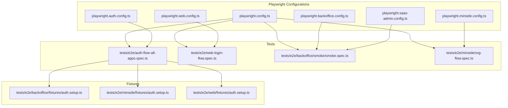
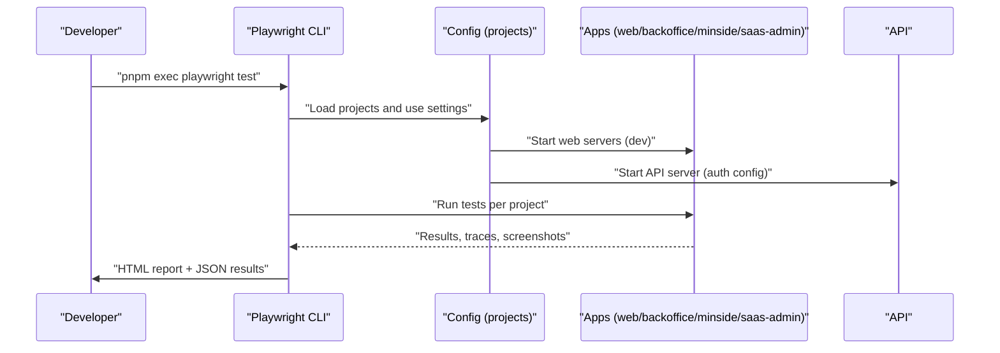
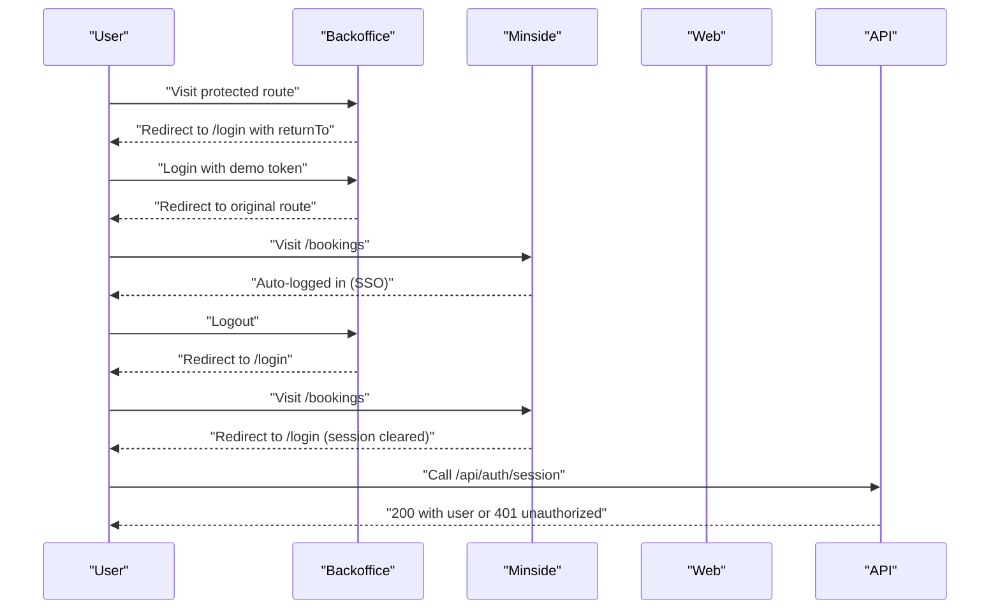
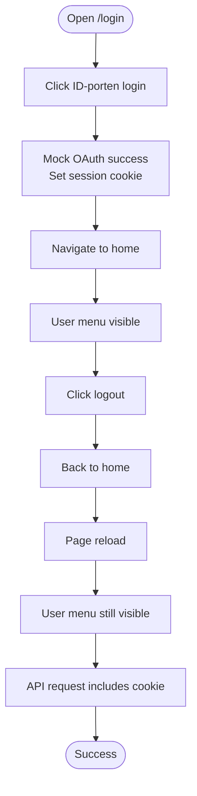
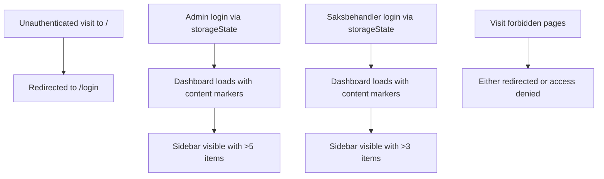
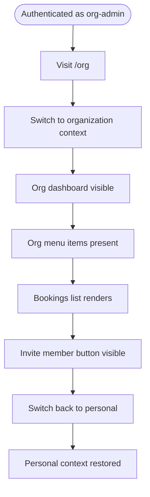
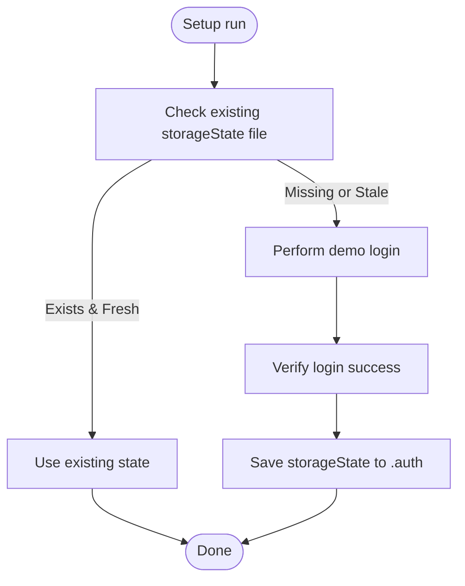
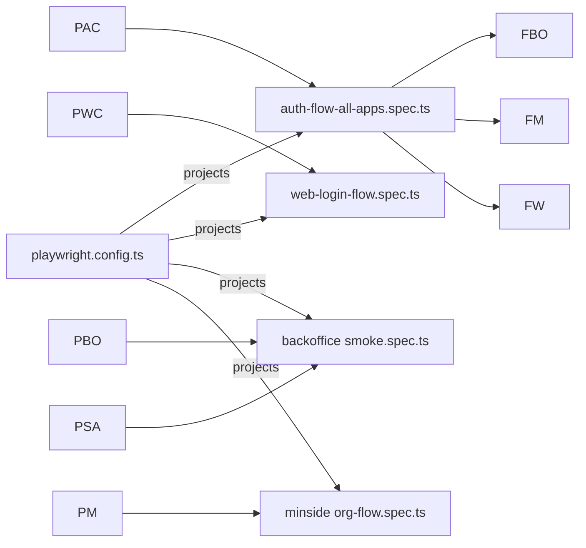

# End-to-End Testing

<cite>
**Referenced Files in This Document**
- [playwright.config.ts](file://playwright.config.ts)
- [playwright.auth.config.ts](file://playwright.auth.config.ts)
- [playwright.web.config.ts](file://playwright.web.config.ts)
- [playwright.backoffice.config.ts](file://playwright.backoffice.config.ts)
- [playwright.minside.config.ts](file://playwright.minside.config.ts)
- [playwright.saas-admin.config.ts](file://playwright.saas-admin.config.ts)
- [tests/e2e/auth-flow-all-apps.spec.ts](file://tests/e2e/auth-flow-all-apps.spec.ts)
- [tests/e2e/web-login-flow.spec.ts](file://tests/e2e/web-login-flow.spec.ts)
- [tests/e2e/backoffice/fixtures/auth.setup.ts](file://tests/e2e/backoffice/fixtures/auth.setup.ts)
- [tests/e2e/minside/fixtures/auth.setup.ts](file://tests/e2e/minside/fixtures/auth.setup.ts)
- [tests/e2e/web/fixtures/auth.setup.ts](file://tests/e2e/web/fixtures/auth.setup.ts)
- [tests/e2e/backoffice/smoke/smoke.spec.ts](file://tests/e2e/backoffice/smoke/smoke.spec.ts)
- [tests/e2e/minside/org-flow.spec.ts](file://tests/e2e/minside/org-flow.spec.ts)
</cite>

## Table of Contents
1. [Introduction](#introduction)
2. [Project Structure](#project-structure)
3. [Core Components](#core-components)
4. [Architecture Overview](#architecture-overview)
5. [Detailed Component Analysis](#detailed-component-analysis)
6. [Dependency Analysis](#dependency-analysis)
7. [Performance Considerations](#performance-considerations)
8. [Troubleshooting Guide](#troubleshooting-guide)
9. [Conclusion](#conclusion)
10. [Appendices](#appendices)

## Introduction
This document describes the end-to-end testing architecture built with Playwright across the entire platform. It covers multi-application E2E test configuration, cross-application authentication and session behavior, and comprehensive workflows spanning the web portal, backoffice, minside (user portal), and SaaS admin applications. It also documents artifact management, screenshots, debugging strategies, accessibility and localization testing, and performance regression approaches.

## Project Structure
The E2E testing system is organized around dedicated Playwright configuration files per application and a shared monorepo-wide configuration. Tests are grouped by application under tests/e2e/<app>, with shared fixtures and helpers supporting authentication and cross-app journeys.

**Diagram sources**
- [playwright.config.ts](file://playwright.config.ts#L1-L116)
- [playwright.auth.config.ts](file://playwright.auth.config.ts#L1-L102)
- [playwright.web.config.ts](file://playwright.web.config.ts#L1-L74)
- [playwright.backoffice.config.ts](file://playwright.backoffice.config.ts#L1-L117)
- [playwright.minside.config.ts](file://playwright.minside.config.ts#L1-L100)
- [playwright.saas-admin.config.ts](file://playwright.saas-admin.config.ts#L1-L87)
- [tests/e2e/auth-flow-all-apps.spec.ts](file://tests/e2e/auth-flow-all-apps.spec.ts#L1-L424)
- [tests/e2e/web-login-flow.spec.ts](file://tests/e2e/web-login-flow.spec.ts#L1-L696)
- [tests/e2e/backoffice/smoke/smoke.spec.ts](file://tests/e2e/backoffice/smoke/smoke.spec.ts#L1-L161)
- [tests/e2e/minside/org-flow.spec.ts](file://tests/e2e/minside/org-flow.spec.ts#L1-L274)
- [tests/e2e/backoffice/fixtures/auth.setup.ts](file://tests/e2e/backoffice/fixtures/auth.setup.ts#L1-L85)
- [tests/e2e/minside/fixtures/auth.setup.ts](file://tests/e2e/minside/fixtures/auth.setup.ts#L1-L141)
- [tests/e2e/web/fixtures/auth.setup.ts](file://tests/e2e/web/fixtures/auth.setup.ts#L1-L71)

**Section sources**
- [playwright.config.ts](file://playwright.config.ts#L1-L116)
- [playwright.auth.config.ts](file://playwright.auth.config.ts#L1-L102)
- [playwright.web.config.ts](file://playwright.web.config.ts#L1-L74)
- [playwright.backoffice.config.ts](file://playwright.backoffice.config.ts#L1-L117)
- [playwright.minside.config.ts](file://playwright.minside.config.ts#L1-L100)
- [playwright.saas-admin.config.ts](file://playwright.saas-admin.config.ts#L1-L87)

## Core Components
- Monorepo-wide configuration orchestrating parallel execution, tracing, screenshots, and multiple browser targets.
- Application-specific configurations for web, backoffice, minside, SaaS admin, and a specialized auth configuration.
- Authentication fixtures that persist storage state per role and application.
- Cross-application journey tests validating SSO behavior, session persistence, and endpoint headers.
- Application smoke and role-specific tests ensuring critical paths and access control.

Key capabilities:
- Multi-app authentication and session sharing across subdomains.
- Role-based access control verification in backoffice and minside.
- Real-world user flows including booking context preservation and organization context switching.
- Artifact collection (HTML reports, JSON results, screenshots, videos) with configurable retention.

**Section sources**
- [playwright.config.ts](file://playwright.config.ts#L12-L116)
- [playwright.auth.config.ts](file://playwright.auth.config.ts#L11-L102)
- [playwright.web.config.ts](file://playwright.web.config.ts#L8-L74)
- [playwright.backoffice.config.ts](file://playwright.backoffice.config.ts#L8-L117)
- [playwright.minside.config.ts](file://playwright.minside.config.ts#L6-L100)
- [playwright.saas-admin.config.ts](file://playwright.saas-admin.config.ts#L9-L87)

## Architecture Overview
The E2E architecture uses Playwright’s project model to target multiple applications and roles concurrently. Each configuration defines:
- Test directories and match patterns.
- Browser devices and viewport targets.
- Base URLs and environment overrides.
- Storage state for authenticated sessions.
- Web server commands for local development.
- Reporting and artifact output locations.

**Diagram sources**
- [playwright.config.ts](file://playwright.config.ts#L94-L116)
- [playwright.auth.config.ts](file://playwright.auth.config.ts#L74-L101)
- [playwright.web.config.ts](file://playwright.web.config.ts#L68-L73)
- [playwright.backoffice.config.ts](file://playwright.backoffice.config.ts#L110-L116)
- [playwright.minside.config.ts](file://playwright.minside.config.ts#L93-L99)
- [playwright.saas-admin.config.ts](file://playwright.saas-admin.config.ts#L79-L86)

## Detailed Component Analysis

### Authentication and Cross-Application Session Behavior
This suite validates:
- Protected routes redirect to login with returnTo.
- Successful login redirects back to the original route.
- Cookie attributes and security headers.
- Session persistence across refreshes and browser compatibility.
- Cross-application session sharing (SSO) and logout propagation.
- Manual token refresh and session endpoint validation.

**Diagram sources**
- [tests/e2e/auth-flow-all-apps.spec.ts](file://tests/e2e/auth-flow-all-apps.spec.ts#L117-L305)
- [tests/e2e/auth-flow-all-apps.spec.ts](file://tests/e2e/auth-flow-all-apps.spec.ts#L308-L351)

**Section sources**
- [tests/e2e/auth-flow-all-apps.spec.ts](file://tests/e2e/auth-flow-all-apps.spec.ts#L1-L424)

### Web App Login Flow and Session Management
This suite focuses on:
- Happy-path login via ID-porten with OAuth callback mocking.
- Session persistence across reloads and localStorage fallback.
- API request cookie propagation.
- Graceful handling of expired sessions, error callbacks, and corrupted localStorage.
- Keyboard accessibility and dropdown UX.
- Flow context preservation during booking flows.

**Diagram sources**
- [tests/e2e/web-login-flow.spec.ts](file://tests/e2e/web-login-flow.spec.ts#L118-L278)
- [tests/e2e/web-login-flow.spec.ts](file://tests/e2e/web-login-flow.spec.ts#L284-L369)
- [tests/e2e/web-login-flow.spec.ts](file://tests/e2e/web-login-flow.spec.ts#L375-L491)
- [tests/e2e/web-login-flow.spec.ts](file://tests/e2e/web-login-flow.spec.ts#L497-L630)
- [tests/e2e/web-login-flow.spec.ts](file://tests/e2e/web-login-flow.spec.ts#L636-L693)

**Section sources**
- [tests/e2e/web-login-flow.spec.ts](file://tests/e2e/web-login-flow.spec.ts#L1-L696)

### Backoffice Smoke and Role-Based Access
Smoke tests validate:
- Login page presence and redirection for unauthenticated users.
- Admin and saksbehandler dashboards and navigation.
- Critical page checks (forbidden terms, JS errors).
- Role-specific navigation counts and access to work queues.

**Diagram sources**
- [tests/e2e/backoffice/smoke/smoke.spec.ts](file://tests/e2e/backoffice/smoke/smoke.spec.ts#L10-L161)

**Section sources**
- [tests/e2e/backoffice/smoke/smoke.spec.ts](file://tests/e2e/backoffice/smoke/smoke.spec.ts#L1-L161)

### MinSide Organization Context and Access Control
This suite verifies:
- Organization context switching (personal ↔ organization).
- Organization dashboard and menu visibility.
- Booking list rendering and creation affordances.
- Member management visibility and access control for non-admins.

**Diagram sources**
- [tests/e2e/minside/org-flow.spec.ts](file://tests/e2e/minside/org-flow.spec.ts#L13-L127)
- [tests/e2e/minside/org-flow.spec.ts](file://tests/e2e/minside/org-flow.spec.ts#L129-L157)
- [tests/e2e/minside/org-flow.spec.ts](file://tests/e2e/minside/org-flow.spec.ts#L159-L190)
- [tests/e2e/minside/org-flow.spec.ts](file://tests/e2e/minside/org-flow.spec.ts#L192-L234)
- [tests/e2e/minside/org-flow.spec.ts](file://tests/e2e/minside/org-flow.spec.ts#L236-L272)

**Section sources**
- [tests/e2e/minside/org-flow.spec.ts](file://tests/e2e/minside/org-flow.spec.ts#L1-L274)

### Authentication Fixtures and Storage State
Authentication fixtures streamline role-based testing by:
- Attempting to reuse recent storage state files.
- Performing demo login flows when state is missing or stale.
- Saving authenticated contexts to disk for subsequent tests.

**Diagram sources**
- [tests/e2e/backoffice/fixtures/auth.setup.ts](file://tests/e2e/backoffice/fixtures/auth.setup.ts#L11-L84)
- [tests/e2e/minside/fixtures/auth.setup.ts](file://tests/e2e/minside/fixtures/auth.setup.ts#L31-L85)
- [tests/e2e/minside/fixtures/auth.setup.ts](file://tests/e2e/minside/fixtures/auth.setup.ts#L87-L140)
- [tests/e2e/web/fixtures/auth.setup.ts](file://tests/e2e/web/fixtures/auth.setup.ts#L23-L70)

**Section sources**
- [tests/e2e/backoffice/fixtures/auth.setup.ts](file://tests/e2e/backoffice/fixtures/auth.setup.ts#L1-L85)
- [tests/e2e/minside/fixtures/auth.setup.ts](file://tests/e2e/minside/fixtures/auth.setup.ts#L1-L141)
- [tests/e2e/web/fixtures/auth.setup.ts](file://tests/e2e/web/fixtures/auth.setup.ts#L1-L71)

## Dependency Analysis
- Playwright configurations define projects and device targets; tests depend on these projects for baseURLs, storageState, and timeouts.
- Cross-application tests depend on shared authentication fixtures and environment variables for URLs.
- Reports and artifacts are configured per project; HTML reports and JSON results are written to dedicated output directories.

**Diagram sources**
- [playwright.config.ts](file://playwright.config.ts#L46-L92)
- [playwright.auth.config.ts](file://playwright.auth.config.ts#L11-L102)
- [playwright.web.config.ts](file://playwright.web.config.ts#L31-L62)
- [playwright.backoffice.config.ts](file://playwright.backoffice.config.ts#L55-L108)
- [playwright.minside.config.ts](file://playwright.minside.config.ts#L47-L84)
- [playwright.saas-admin.config.ts](file://playwright.saas-admin.config.ts#L49-L77)
- [tests/e2e/auth-flow-all-apps.spec.ts](file://tests/e2e/auth-flow-all-apps.spec.ts#L1-L424)
- [tests/e2e/web-login-flow.spec.ts](file://tests/e2e/web-login-flow.spec.ts#L1-L696)
- [tests/e2e/backoffice/smoke/smoke.spec.ts](file://tests/e2e/backoffice/smoke/smoke.spec.ts#L1-L161)
- [tests/e2e/minside/org-flow.spec.ts](file://tests/e2e/minside/org-flow.spec.ts#L1-L274)
- [tests/e2e/backoffice/fixtures/auth.setup.ts](file://tests/e2e/backoffice/fixtures/auth.setup.ts#L1-L85)
- [tests/e2e/minside/fixtures/auth.setup.ts](file://tests/e2e/minside/fixtures/auth.setup.ts#L1-L141)
- [tests/e2e/web/fixtures/auth.setup.ts](file://tests/e2e/web/fixtures/auth.setup.ts#L1-L71)

**Section sources**
- [playwright.config.ts](file://playwright.config.ts#L1-L116)
- [playwright.auth.config.ts](file://playwright.auth.config.ts#L1-L102)
- [playwright.web.config.ts](file://playwright.web.config.ts#L1-L74)
- [playwright.backoffice.config.ts](file://playwright.backoffice.config.ts#L1-L117)
- [playwright.minside.config.ts](file://playwright.minside.config.ts#L1-L100)
- [playwright.saas-admin.config.ts](file://playwright.saas-admin.config.ts#L1-L87)

## Performance Considerations
- Parallelization: Fully parallel execution reduces total runtime; adjust workers and retries according to CI capacity.
- Artifacts: Screenshots and videos are captured on failure; enable video on first retry for deeper debugging.
- Timeouts: Increase navigation and action timeouts for complex flows; keep expectations short to reduce flakiness.
- Local dev servers: Reuse existing servers in CI to avoid cold starts; otherwise, configure appropriate timeouts.

[No sources needed since this section provides general guidance]

## Troubleshooting Guide
Common issues and remedies:
- Authentication failures: Use setup fixtures to regenerate storage state; verify environment variables for emails/tokens.
- Cross-app SSO not working: Confirm cookie domains and SameSite settings; ensure baseURLs align with subdomain structure.
- Flaky tests due to timing: Add explicit waits for content markers; avoid brittle selectors; leverage expect timeouts.
- Trace and artifacts: Inspect HTML reports and JSON results; collect screenshots and videos on failure for debugging.
- Session endpoint headers: Validate cache-control and pragma headers to prevent caching of sensitive endpoints.

**Section sources**
- [tests/e2e/auth-flow-all-apps.spec.ts](file://tests/e2e/auth-flow-all-apps.spec.ts#L101-L114)
- [tests/e2e/web-login-flow.spec.ts](file://tests/e2e/web-login-flow.spec.ts#L375-L491)
- [playwright.config.ts](file://playwright.config.ts#L33-L40)

## Conclusion
The Playwright-based E2E testing framework provides robust, multi-application coverage across web, backoffice, minside, and SaaS admin. With role-specific fixtures, cross-application session validation, and comprehensive reporting, it supports reliable regression detection, accessibility and localization checks, and performance regression monitoring.

[No sources needed since this section summarizes without analyzing specific files]

## Appendices

### Accessibility Testing
- Backoffice includes WCAG-focused projects and smoke tests verifying page content and errors.
- Web and SaaS admin configurations support accessibility specs and localized content checks.

**Section sources**
- [playwright.backoffice.config.ts](file://playwright.backoffice.config.ts#L98-L107)
- [playwright.web.config.ts](file://playwright.web.config.ts#L36-L37)
- [playwright.saas-admin.config.ts](file://playwright.saas-admin.config.ts#L71-L76)

### Localization Testing
- Backoffice sets Accept-Language headers; web and minside set locale/timezone for deterministic tests.
- SaaS admin includes an internationalization project for localized content validation.

**Section sources**
- [playwright.backoffice.config.ts](file://playwright.backoffice.config.ts#L49-L52)
- [playwright.web.config.ts](file://playwright.web.config.ts#L27-L28)
- [playwright.minside.config.ts](file://playwright.minside.config.ts#L42-L44)
- [playwright.saas-admin.config.ts](file://playwright.saas-admin.config.ts#L71-L76)

### Test Artifact Management
- HTML reports and JSON results are written per project; screenshots and videos are captured on failure.
- Output directories are configured per application; ensure CI stores artifacts for postmortem analysis.

**Section sources**
- [playwright.config.ts](file://playwright.config.ts#L24-L27)
- [playwright.web.config.ts](file://playwright.web.config.ts#L16-L20)
- [playwright.backoffice.config.ts](file://playwright.backoffice.config.ts#L22-L26)
- [playwright.minside.config.ts](file://playwright.minside.config.ts#L22-L26)
- [playwright.saas-admin.config.ts](file://playwright.saas-admin.config.ts#L29-L33)