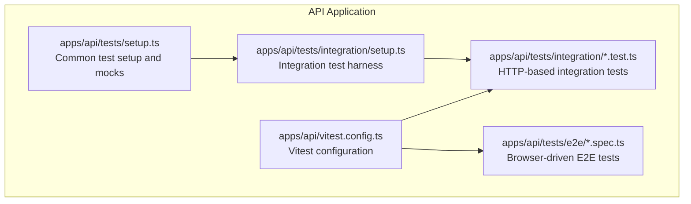
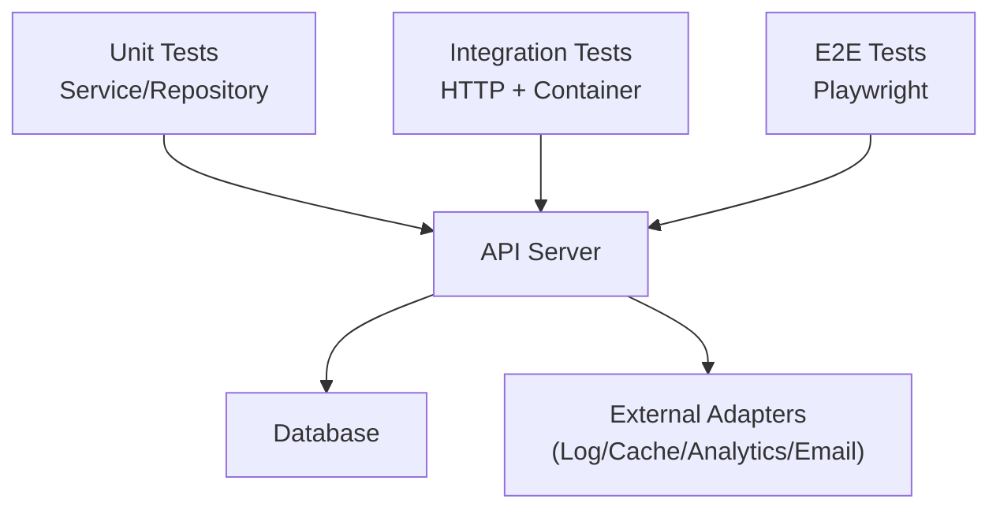
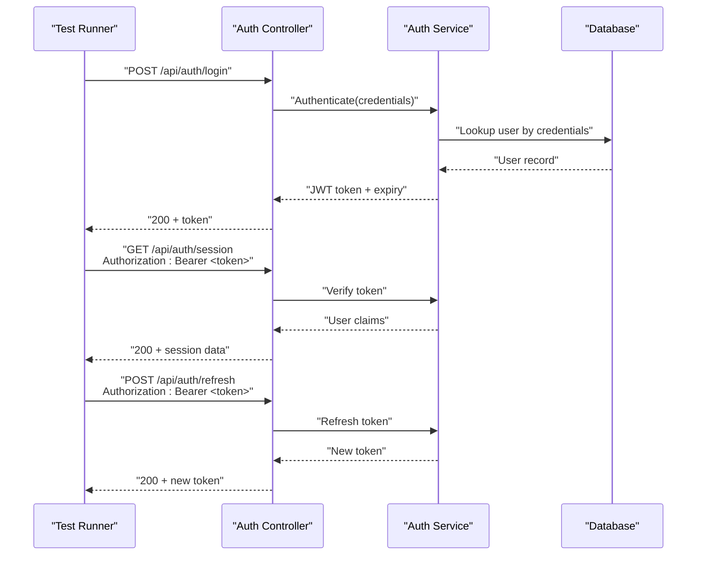
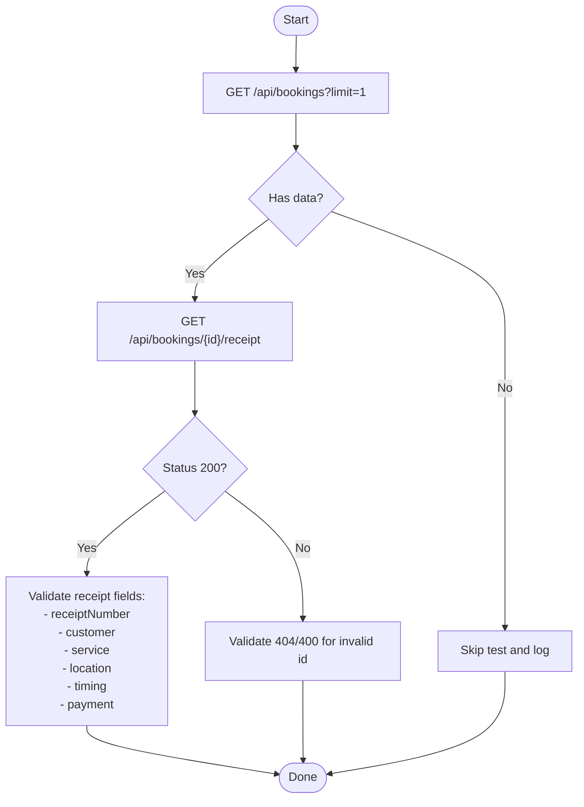
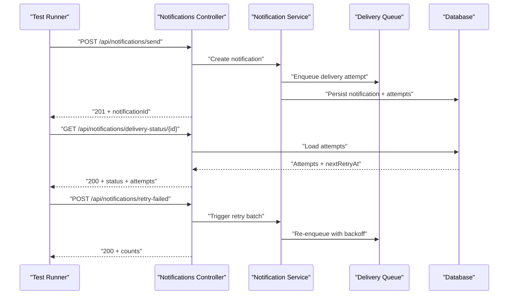
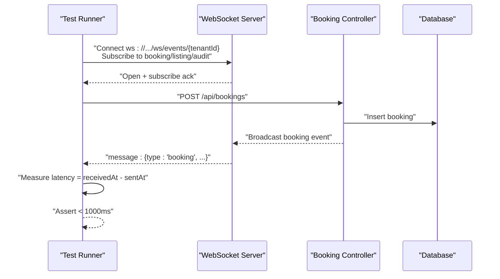
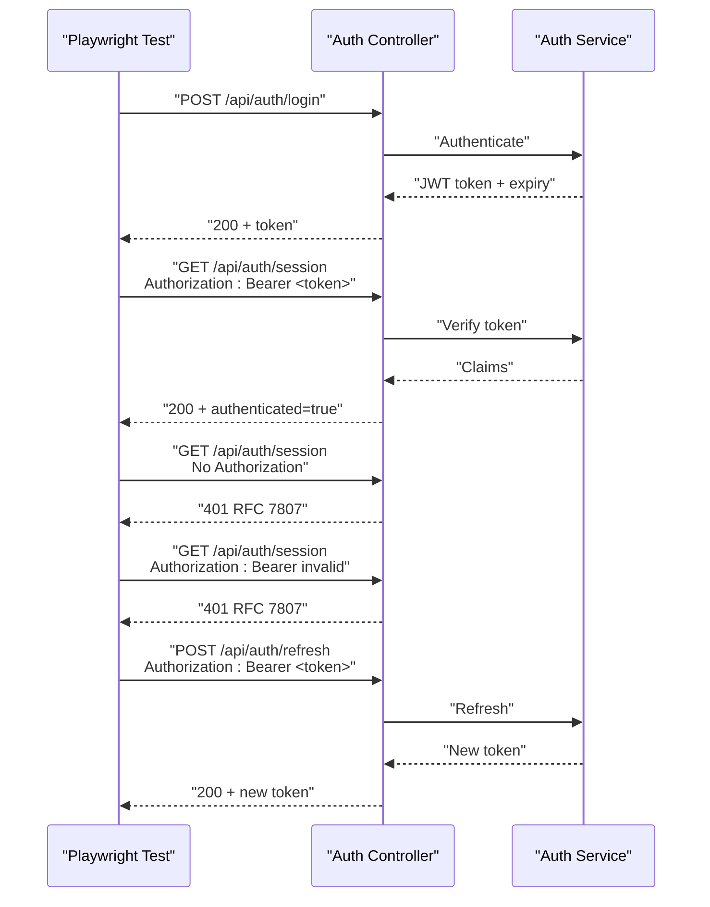
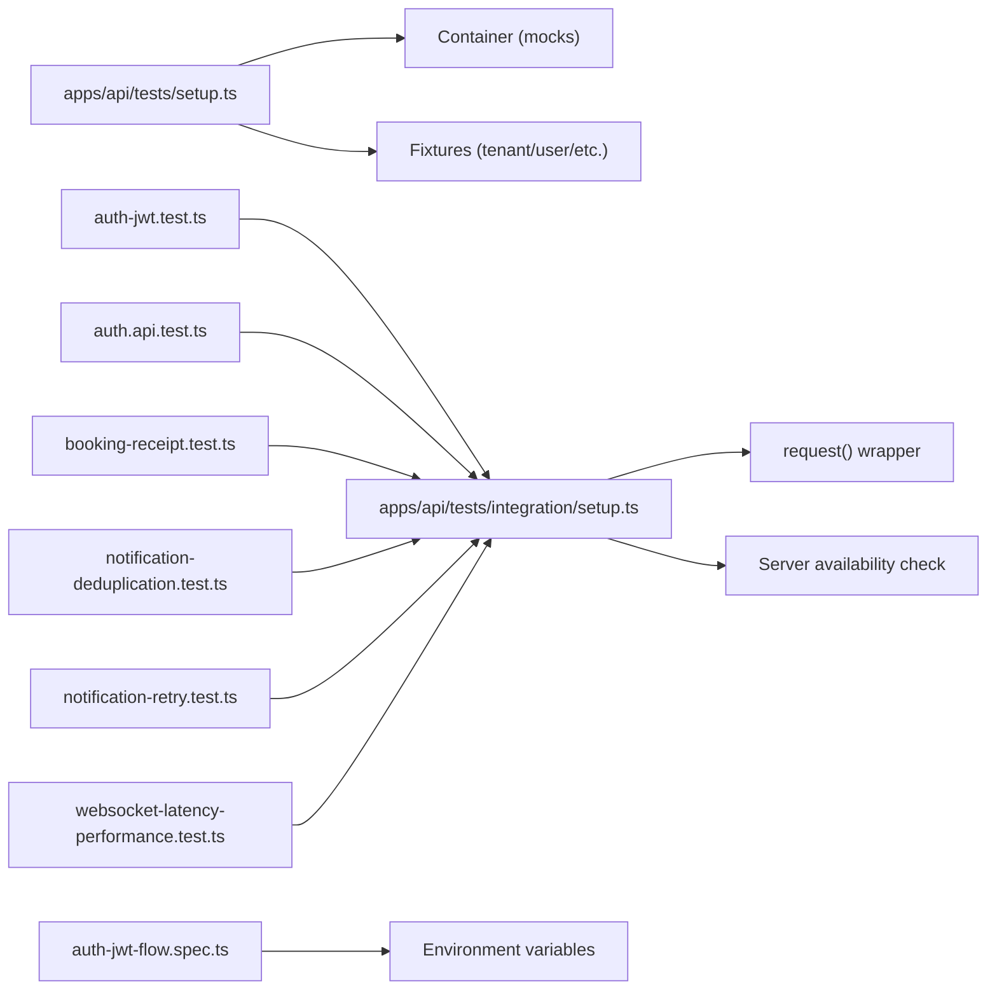

# Integration Testing

<cite>
**Referenced Files in This Document**
- [apps/api/tests/setup.ts](file://apps/api/tests/setup.ts)
- [apps/api/tests/integration/setup.ts](file://apps/api/tests/integration/setup.ts)
- [apps/api/tests/integration/auth-jwt.test.ts](file://apps/api/tests/integration/auth-jwt.test.ts)
- [apps/api/tests/integration/auth.api.test.ts](file://apps/api/tests/integration/auth.api.test.ts)
- [apps/api/tests/integration/booking-receipt.test.ts](file://apps/api/tests/integration/booking-receipt.test.ts)
- [apps/api/tests/integration/tenant.api.test.ts](file://apps/api/tests/integration/tenant.api.test.ts)
- [apps/api/tests/integration/user.api.test.ts](file://apps/api/tests/integration/user.api.test.ts)
- [apps/api/tests/integration/notification-deduplication.test.ts](file://apps/api/tests/integration/notification-deduplication.test.ts)
- [apps/api/tests/integration/notification-retry.test.ts](file://apps/api/tests/integration/notification-retry.test.ts)
- [apps/api/tests/integration/websocket-latency-performance.test.ts](file://apps/api/tests/integration/websocket-latency-performance.test.ts)
- [apps/api/tests/e2e/auth-jwt-flow.spec.ts](file://apps/api/tests/e2e/auth-jwt-flow.spec.ts)
- [apps/api/vitest.config.ts](file://apps/api/vitest.config.ts)
</cite>

## Table of Contents
1. [Introduction](#introduction)
2. [Project Structure](#project-structure)
3. [Core Components](#core-components)
4. [Architecture Overview](#architecture-overview)
5. [Detailed Component Analysis](#detailed-component-analysis)
6. [Dependency Analysis](#dependency-analysis)
7. [Performance Considerations](#performance-considerations)
8. [Troubleshooting Guide](#troubleshooting-guide)
9. [Conclusion](#conclusion)

## Introduction
This document describes the integration testing architecture and patterns used in the API application. It focuses on end-to-end API testing, service-layer integration verification, database operation validation, and real-time communication testing. It also documents how to test authentication flows, booking workflows, and notification systems, along with guidance for test fixtures, environment setup, and cross-component interactions.

## Project Structure
The integration tests are organized under the API application’s test suite:
- Shared test setup and mocks live in a common setup file.
- Integration tests target the API server via HTTP requests and validate controller endpoints, service behavior, and cross-domain workflows.
- End-to-end tests use Playwright to validate browser-driven flows.

**Diagram sources**
- [apps/api/tests/setup.ts](file://apps/api/tests/setup.ts#L1-L110)
- [apps/api/tests/integration/setup.ts](file://apps/api/tests/integration/setup.ts#L1-L91)
- [apps/api/vitest.config.ts](file://apps/api/vitest.config.ts#L1-L23)

**Section sources**
- [apps/api/tests/setup.ts](file://apps/api/tests/setup.ts#L1-L110)
- [apps/api/tests/integration/setup.ts](file://apps/api/tests/integration/setup.ts#L1-L91)
- [apps/api/vitest.config.ts](file://apps/api/vitest.config.ts#L1-L23)

## Core Components
- Test harness and utilities:
  - Global mocks for database and adapters are registered per test via a container.
  - Shared fixtures provide realistic tenant, user, listing, and booking entities.
- Integration test runner:
  - A lightweight HTTP client wraps fetch with standardized headers and convenience methods.
  - A server availability check allows tests to gracefully skip when the API is not running.
- Vitest configuration:
  - Node environment, coverage reporting, and module aliases enable efficient test runs.

Key responsibilities:
- Isolation: Each test clears mocks and resets container/singletons before and after execution.
- Consistency: Standardized headers and request builder reduce duplication and improve reliability.
- Observability: Coverage configuration ensures visibility into test impact.

**Section sources**
- [apps/api/tests/setup.ts](file://apps/api/tests/setup.ts#L1-L110)
- [apps/api/tests/integration/setup.ts](file://apps/api/tests/integration/setup.ts#L1-L91)
- [apps/api/vitest.config.ts](file://apps/api/vitest.config.ts#L1-L23)

## Architecture Overview
The integration testing architecture separates concerns across layers:
- Unit layer: Service and repository unit tests validate logic in isolation.
- Integration layer: HTTP-based tests exercise controllers and services through the API server.
- E2E layer: Browser-based tests validate full user journeys.

[No sources needed since this diagram shows conceptual workflow, not actual code structure]

## Detailed Component Analysis

### Authentication Integration Tests
These tests validate JWT login, session access, token refresh, and rejection of malformed or tampered tokens.

**Diagram sources**
- [apps/api/tests/integration/auth-jwt.test.ts](file://apps/api/tests/integration/auth-jwt.test.ts#L1-L193)
- [apps/api/tests/integration/auth.api.test.ts](file://apps/api/tests/integration/auth.api.test.ts#L1-L83)

**Section sources**
- [apps/api/tests/integration/auth-jwt.test.ts](file://apps/api/tests/integration/auth-jwt.test.ts#L1-L193)
- [apps/api/tests/integration/auth.api.test.ts](file://apps/api/tests/integration/auth.api.test.ts#L1-L83)

### Booking Workflow Integration Tests
These tests validate receipt generation and field completeness for booking-related endpoints.

**Diagram sources**
- [apps/api/tests/integration/booking-receipt.test.ts](file://apps/api/tests/integration/booking-receipt.test.ts#L1-L120)

**Section sources**
- [apps/api/tests/integration/booking-receipt.test.ts](file://apps/api/tests/integration/booking-receipt.test.ts#L1-L120)

### Notification System Integration Tests
These tests validate deduplication and retry mechanisms with exponential backoff, including delivery status retrieval and retry scheduling.

**Diagram sources**
- [apps/api/tests/integration/notification-deduplication.test.ts](file://apps/api/tests/integration/notification-deduplication.test.ts#L1-L341)
- [apps/api/tests/integration/notification-retry.test.ts](file://apps/api/tests/integration/notification-retry.test.ts#L1-L422)

**Section sources**
- [apps/api/tests/integration/notification-deduplication.test.ts](file://apps/api/tests/integration/notification-deduplication.test.ts#L1-L341)
- [apps/api/tests/integration/notification-retry.test.ts](file://apps/api/tests/integration/notification-retry.test.ts#L1-L422)

### Real-Time Communication and Latency Tests
These tests validate WebSocket event delivery latency under single and concurrent clients, ensuring sub-second updates.

**Diagram sources**
- [apps/api/tests/integration/websocket-latency-performance.test.ts](file://apps/api/tests/integration/websocket-latency-performance.test.ts#L1-L580)

**Section sources**
- [apps/api/tests/integration/websocket-latency-performance.test.ts](file://apps/api/tests/integration/websocket-latency-performance.test.ts#L1-L580)

### E2E Authentication Flow (Playwright)
End-to-end validation of the JWT authentication flow across login, session validation, token tampering, and refresh.

**Diagram sources**
- [apps/api/tests/e2e/auth-jwt-flow.spec.ts](file://apps/api/tests/e2e/auth-jwt-flow.spec.ts#L1-L212)

**Section sources**
- [apps/api/tests/e2e/auth-jwt-flow.spec.ts](file://apps/api/tests/e2e/auth-jwt-flow.spec.ts#L1-L212)

## Dependency Analysis
- Test setup depends on:
  - Container for registering mocks and singletons.
  - Environment variables for API URL and tenant ID.
  - Request helper for standardized HTTP calls.
- Integration tests depend on:
  - API server availability check.
  - Consistent headers (tenant ID) across requests.
- E2E tests depend on:
  - Playwright configuration and environment variables for URLs.

**Diagram sources**
- [apps/api/tests/setup.ts](file://apps/api/tests/setup.ts#L1-L110)
- [apps/api/tests/integration/setup.ts](file://apps/api/tests/integration/setup.ts#L1-L91)
- [apps/api/tests/integration/auth-jwt.test.ts](file://apps/api/tests/integration/auth-jwt.test.ts#L1-L193)
- [apps/api/tests/integration/auth.api.test.ts](file://apps/api/tests/integration/auth.api.test.ts#L1-L83)
- [apps/api/tests/integration/booking-receipt.test.ts](file://apps/api/tests/integration/booking-receipt.test.ts#L1-L120)
- [apps/api/tests/integration/notification-deduplication.test.ts](file://apps/api/tests/integration/notification-deduplication.test.ts#L1-L341)
- [apps/api/tests/integration/notification-retry.test.ts](file://apps/api/tests/integration/notification-retry.test.ts#L1-L422)
- [apps/api/tests/integration/websocket-latency-performance.test.ts](file://apps/api/tests/integration/websocket-latency-performance.test.ts#L1-L580)
- [apps/api/tests/e2e/auth-jwt-flow.spec.ts](file://apps/api/tests/e2e/auth-jwt-flow.spec.ts#L1-L212)

**Section sources**
- [apps/api/tests/setup.ts](file://apps/api/tests/setup.ts#L1-L110)
- [apps/api/tests/integration/setup.ts](file://apps/api/tests/integration/setup.ts#L1-L91)

## Performance Considerations
- WebSocket latency targets sub-second update times for single and concurrent clients.
- Retry mechanisms use exponential backoff to balance throughput and reliability.
- Deduplication prevents redundant processing within a short time window.
- Tests avoid long-running waits by focusing on immediate and deterministic assertions.

[No sources needed since this section provides general guidance]

## Troubleshooting Guide
Common issues and resolutions:
- API server not running:
  - Integration tests include a server availability check and skip gracefully when the server is unreachable.
  - Ensure the API dev server is started before running integration tests.
- Missing environment variables:
  - Confirm API_URL and tenant headers are set for integration tests.
  - For E2E tests, ensure WS_URL and API_URL are configured for WebSocket and HTTP endpoints.
- Authentication failures:
  - Verify JWT token format and expiration.
  - Ensure Authorization headers are correctly set for protected routes.
- WebSocket connection timeouts:
  - Confirm WebSocket server is reachable and listening on the expected port.
  - Validate subscription messages and event types.

**Section sources**
- [apps/api/tests/integration/setup.ts](file://apps/api/tests/integration/setup.ts#L1-L91)
- [apps/api/tests/integration/auth-jwt.test.ts](file://apps/api/tests/integration/auth-jwt.test.ts#L1-L193)
- [apps/api/tests/integration/websocket-latency-performance.test.ts](file://apps/api/tests/integration/websocket-latency-performance.test.ts#L1-L580)

## Conclusion
The integration testing suite provides robust coverage for authentication, booking workflows, notifications, and real-time communication. By combining HTTP-based integration tests with E2E validations and performance-focused WebSocket tests, the suite ensures reliable cross-component behavior. The shared setup and containerized mocking facilitate maintainable and isolated tests, while environment-aware configurations support flexible local and CI execution.