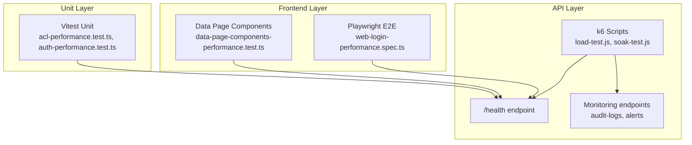
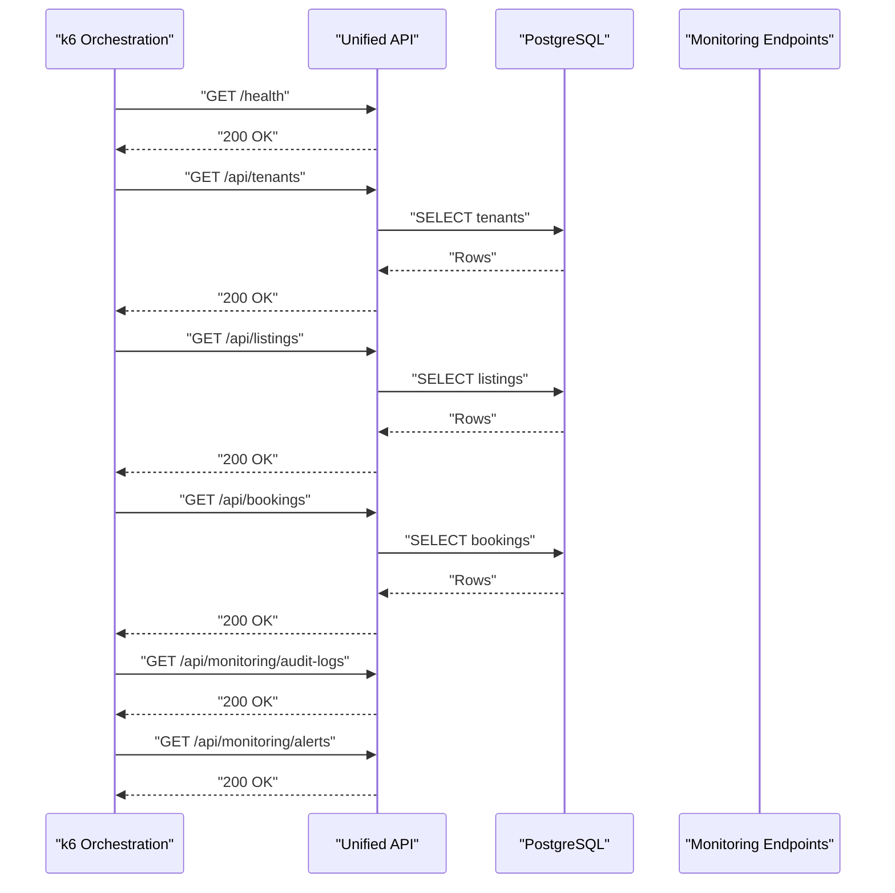
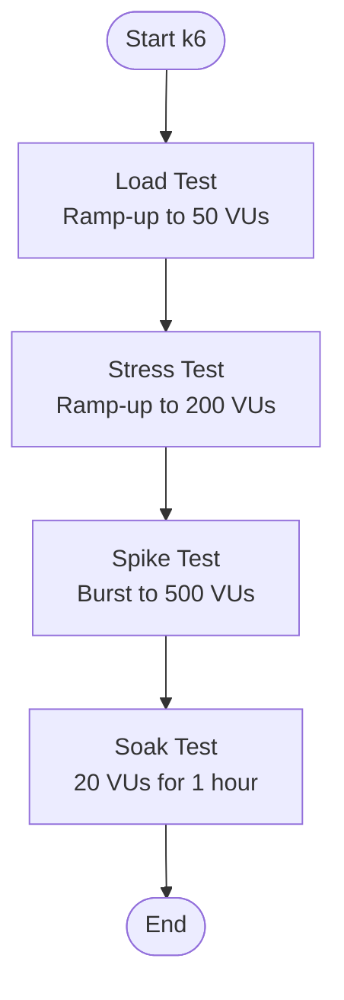
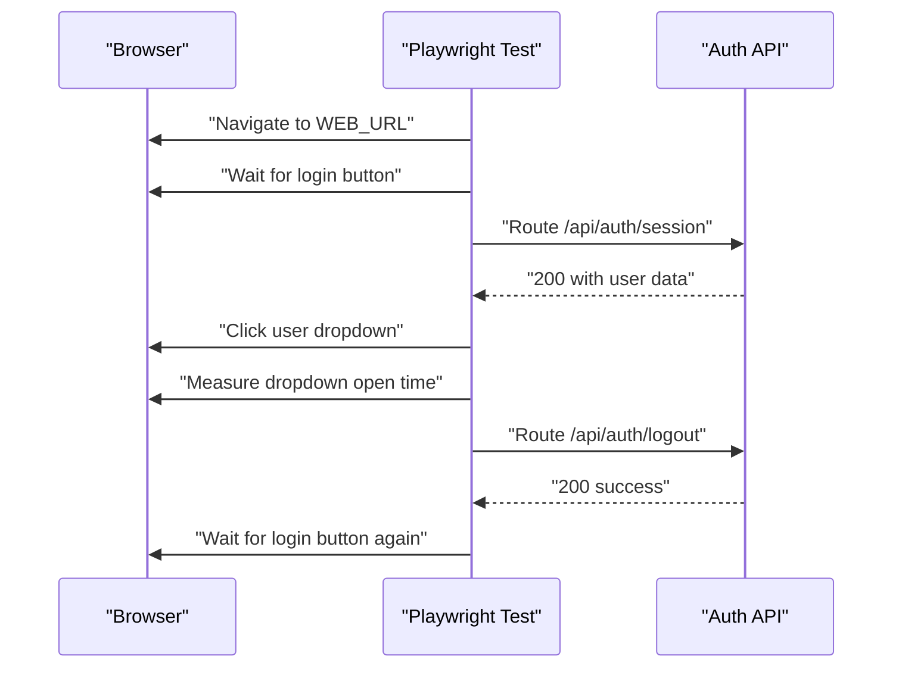
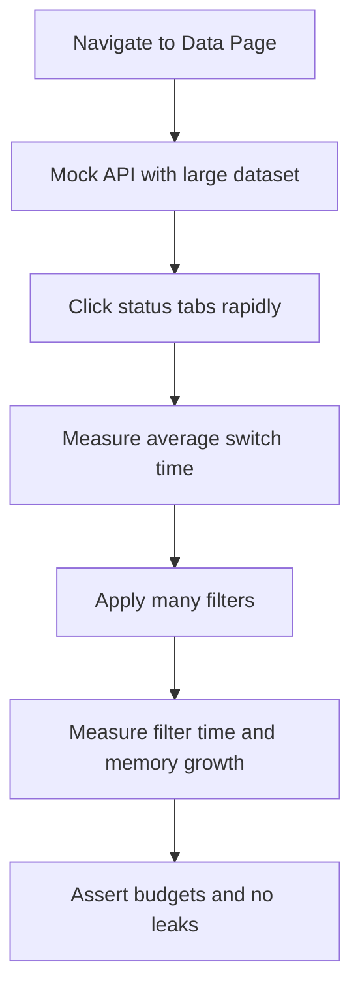
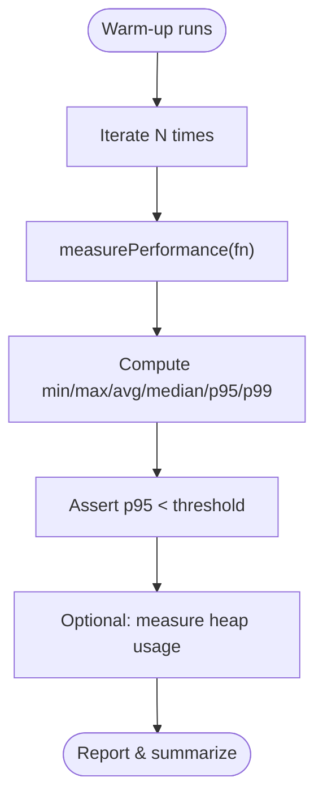
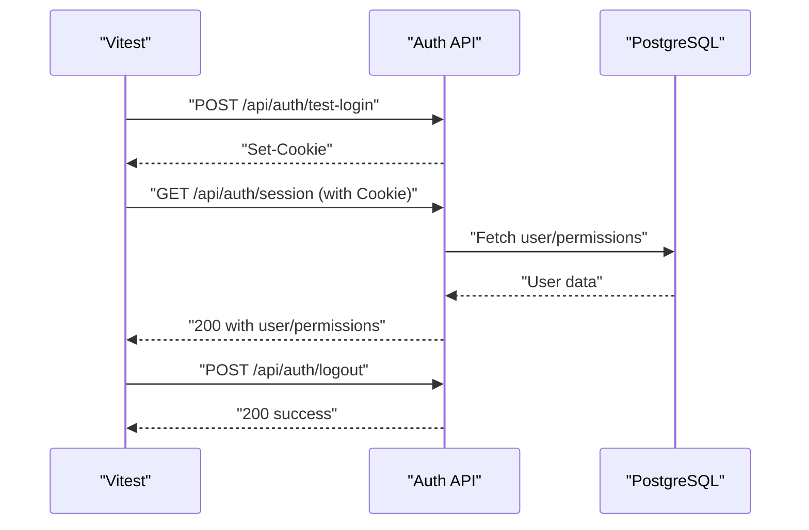
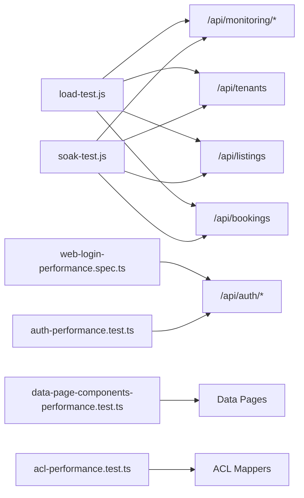

# Performance Testing

<cite>
**Referenced Files in This Document**
- [load-test.js](file://apps/api/tests/performance/load-test.js)
- [soak-test.js](file://apps/api/tests/performance/soak-test.js)
- [web-login-performance.spec.ts](file://tests/e2e/web-login-performance.spec.ts)
- [DATA_PAGE_COMPONENTS_PERFORMANCE.md](file://tests/performance/DATA_PAGE_COMPONENTS_PERFORMANCE.md)
- [acl-performance.test.ts](file://tests/performance/acl-performance.test.ts)
- [auth-performance.test.ts](file://tests/performance/auth-performance.test.ts)
- [data-page-components-performance.test.ts](file://tests/performance/data-page-components-performance.test.ts)
</cite>

## Table of Contents
1. [Introduction](#introduction)
2. [Project Structure](#project-structure)
3. [Core Components](#core-components)
4. [Architecture Overview](#architecture-overview)
5. [Detailed Component Analysis](#detailed-component-analysis)
6. [Dependency Analysis](#dependency-analysis)
7. [Performance Considerations](#performance-considerations)
8. [Troubleshooting Guide](#troubleshooting-guide)
9. [Conclusion](#conclusion)
10. [Appendices](#appendices)

## Introduction
This document describes the performance testing strategy and implementation in the monorepo. It covers load testing, stress testing, soak testing, and synthetic monitoring for the API and frontend applications. It also documents how to test API response times, database-backed operations, and real-time communication scalability, along with practical guidance for establishing baselines, identifying bottlenecks, and integrating performance regression detection into CI.

## Project Structure
Performance testing spans multiple layers:
- API performance tests using k6 for load/stress/spike and soak tests
- Frontend E2E performance tests using Playwright for user journey timings and memory behavior
- Unit-level performance tests using Vitest for CPU-bound transformations and authentication latency
- Synthetic monitoring endpoints exposed by the API for health and operational insights

**Diagram sources**
- [load-test.js](file://apps/api/tests/performance/load-test.js#L30-L76)
- [soak-test.js](file://apps/api/tests/performance/soak-test.js#L19-L32)
- [web-login-performance.spec.ts](file://tests/e2e/web-login-performance.spec.ts#L30-L347)
- [data-page-components-performance.test.ts](file://tests/performance/data-page-components-performance.test.ts#L55-L111)
- [acl-performance.test.ts](file://tests/performance/acl-performance.test.ts#L204-L259)
- [auth-performance.test.ts](file://tests/performance/auth-performance.test.ts#L56-L131)

**Section sources**
- [load-test.js](file://apps/api/tests/performance/load-test.js#L1-L181)
- [soak-test.js](file://apps/api/tests/performance/soak-test.js#L1-L66)
- [web-login-performance.spec.ts](file://tests/e2e/web-login-performance.spec.ts#L1-L350)
- [DATA_PAGE_COMPONENTS_PERFORMANCE.md](file://tests/performance/DATA_PAGE_COMPONENTS_PERFORMANCE.md#L1-L156)
- [acl-performance.test.ts](file://tests/performance/acl-performance.test.ts#L1-L597)
- [auth-performance.test.ts](file://tests/performance/auth-performance.test.ts#L1-L449)
- [data-page-components-performance.test.ts](file://tests/performance/data-page-components-performance.test.ts#L1-L319)

## Core Components
- API k6 performance suite: load, stress, spike, and soak tests with custom metrics and thresholds
- Frontend Playwright performance suite: user journey timings, memory checks, and concurrent navigation
- Unit-level Vitest suites: ACL transformation latency, authentication throughput, and resource usage
- Synthetic monitoring: health, audit logs, and alert endpoints for continuous operational visibility

Key capabilities:
- End-to-end API load/stress/spike testing with realistic tenant/listing/booking operations
- Soak testing for long-term stability and memory leak detection
- Frontend performance budgets for render times, interaction latency, and memory growth
- Unit-level CPU and memory performance baselines for ACL and auth operations

**Section sources**
- [load-test.js](file://apps/api/tests/performance/load-test.js#L30-L76)
- [soak-test.js](file://apps/api/tests/performance/soak-test.js#L19-L32)
- [web-login-performance.spec.ts](file://tests/e2e/web-login-performance.spec.ts#L30-L347)
- [DATA_PAGE_COMPONENTS_PERFORMANCE.md](file://tests/performance/DATA_PAGE_COMPONENTS_PERFORMANCE.md#L11-L26)
- [acl-performance.test.ts](file://tests/performance/acl-performance.test.ts#L1-L14)
- [auth-performance.test.ts](file://tests/performance/auth-performance.test.ts#L1-L19)
- [data-page-components-performance.test.ts](file://tests/performance/data-page-components-performance.test.ts#L55-L111)

## Architecture Overview
The performance testing architecture integrates synthetic workloads, user-centric E2E tests, and unit-level microbenchmarks. k6 orchestrates sustained and burst traffic against the API, while Playwright validates frontend UX metrics. Vitest measures backend CPU and memory characteristics.

**Diagram sources**
- [load-test.js](file://apps/api/tests/performance/load-test.js#L94-L169)

## Detailed Component Analysis

### API Load, Stress, Spike, and Soak Testing
- Purpose: Validate API responsiveness and stability under sustained load, stress beyond capacity, sudden spikes, and long-running conditions.
- Execution: k6 scenarios define ramping VUs, staged durations, and thresholds for p95/p99 response times and error rates.
- Metrics: Custom trends per operation type and global error rate; thresholds enforce SLIs.
- Artifacts: Summary JSON via k6 handleSummary for post-run analysis.

**Diagram sources**
- [load-test.js](file://apps/api/tests/performance/load-test.js#L30-L67)
- [soak-test.js](file://apps/api/tests/performance/soak-test.js#L19-L26)

**Section sources**
- [load-test.js](file://apps/api/tests/performance/load-test.js#L1-L181)
- [soak-test.js](file://apps/api/tests/performance/soak-test.js#L1-L66)

### Frontend E2E Performance: Web Login Flow
- Purpose: Measure homepage load, session persistence, dropdown interactions, page transitions, and logout latency; detect memory growth over repeated interactions.
- Methodology: Route mocking for session and logout endpoints; timing measurements; concurrent page loads; memory usage checks via performance APIs.
- Thresholds: Hard-coded budgets for load times, interaction latency, and memory growth.

**Diagram sources**
- [web-login-performance.spec.ts](file://tests/e2e/web-login-performance.spec.ts#L30-L169)

**Section sources**
- [web-login-performance.spec.ts](file://tests/e2e/web-login-performance.spec.ts#L1-L350)

### Frontend E2E Performance: Data Page Components
- Purpose: Validate render and interaction performance for status tabs, filter chips, empty states, and large dataset filtering; track memory growth.
- Methodology: Programmatic filter activation, large dataset generation, and performance metric extraction via browser APIs.
- Thresholds: Render budgets for tabs, chips, empty state, and filtering; memory increase limits.

**Diagram sources**
- [data-page-components-performance.test.ts](file://tests/performance/data-page-components-performance.test.ts#L55-L111)
- [DATA_PAGE_COMPONENTS_PERFORMANCE.md](file://tests/performance/DATA_PAGE_COMPONENTS_PERFORMANCE.md#L11-L26)

**Section sources**
- [data-page-components-performance.test.ts](file://tests/performance/data-page-components-performance.test.ts#L1-L319)
- [DATA_PAGE_COMPONENTS_PERFORMANCE.md](file://tests/performance/DATA_PAGE_COMPONENTS_PERFORMANCE.md#L1-L156)

### Unit-Level Performance: ACL Transformations
- Purpose: Establish CPU latency baselines for ACL mapping operations and memory efficiency for bulk transformations.
- Methodology: Microbenchmarks with warm-ups, percentile calculations, and memory usage checks; concurrent transformation simulation.
- Targets: p95 thresholds for single and batch operations; memory budgets per object.

**Diagram sources**
- [acl-performance.test.ts](file://tests/performance/acl-performance.test.ts#L40-L98)

**Section sources**
- [acl-performance.test.ts](file://tests/performance/acl-performance.test.ts#L1-L597)

### Unit-Level Performance: Authentication and RBAC
- Purpose: Validate login, session validation, permission retrieval, logout, and throughput targets; assess cookie parsing overhead and DB-backed user data retrieval.
- Methodology: Latency measurement with percentiles; concurrent request simulations; throughput calculation; memory checks.
- Targets: P50/P95/P99 thresholds for session validation; RPS targets and error rates.

**Diagram sources**
- [auth-performance.test.ts](file://tests/performance/auth-performance.test.ts#L59-L73)
- [auth-performance.test.ts](file://tests/performance/auth-performance.test.ts#L133-L204)

**Section sources**
- [auth-performance.test.ts](file://tests/performance/auth-performance.test.ts#L1-L449)

## Dependency Analysis
- API performance tests depend on synthetic monitoring endpoints and tenant/listing/booking resources.
- Frontend E2E tests rely on local storage/session mocking and route interception to isolate network variability.
- Unit tests depend on internal mappers and auth endpoints; they assert CPU and memory characteristics.

**Diagram sources**
- [load-test.js](file://apps/api/tests/performance/load-test.js#L94-L169)
- [soak-test.js](file://apps/api/tests/performance/soak-test.js#L34-L59)
- [web-login-performance.spec.ts](file://tests/e2e/web-login-performance.spec.ts#L14-L137)
- [data-page-components-performance.test.ts](file://tests/performance/data-page-components-performance.test.ts#L60-L200)
- [acl-performance.test.ts](file://tests/performance/acl-performance.test.ts#L17-L24)
- [auth-performance.test.ts](file://tests/performance/auth-performance.test.ts#L61-L72)

**Section sources**
- [load-test.js](file://apps/api/tests/performance/load-test.js#L1-L181)
- [soak-test.js](file://apps/api/tests/performance/soak-test.js#L1-L66)
- [web-login-performance.spec.ts](file://tests/e2e/web-login-performance.spec.ts#L1-L350)
- [data-page-components-performance.test.ts](file://tests/performance/data-page-components-performance.test.ts#L1-L319)
- [acl-performance.test.ts](file://tests/performance/acl-performance.test.ts#L1-L597)
- [auth-performance.test.ts](file://tests/performance/auth-performance.test.ts#L1-L449)

## Performance Considerations
- Establish baselines: Use unit-level tests to capture p95/p99 CPU latency and memory usage for ACL and auth operations.
- Define budgets: Adopt hard thresholds for frontend render times, interaction latency, and memory growth.
- Monitor continuously: Use synthetic monitoring endpoints for health and operational signals.
- Validate end-to-end: Combine k6 load/stress/spike tests with frontend E2E flows to catch UI/API integration bottlenecks.
- Regression detection: Integrate thresholds and summaries into CI to fail builds on performance regressions.

[No sources needed since this section provides general guidance]

## Troubleshooting Guide
Common issues and remedies:
- Excessive error rates in k6: Review thresholds and environment configuration; validate tenant headers and endpoint availability.
- Frontend timeouts: Confirm route mocks are active and network idle states are awaited before assertions.
- Memory growth in E2E: Ensure event listeners and timers are cleaned up; avoid retaining references to DOM nodes.
- CPU spikes in unit tests: Reduce iteration counts during development; focus on warm-up runs and percentile reporting.
- Throughput below target: Investigate database connection pooling, query plans, and external service latencies.

**Section sources**
- [load-test.js](file://apps/api/tests/performance/load-test.js#L68-L76)
- [soak-test.js](file://apps/api/tests/performance/soak-test.js#L27-L32)
- [web-login-performance.spec.ts](file://tests/e2e/web-login-performance.spec.ts#L240-L289)
- [auth-performance.test.ts](file://tests/performance/auth-performance.test.ts#L364-L411)

## Conclusion
The repository provides a comprehensive performance testing framework spanning API, frontend, and unit layers. By combining k6-driven synthetic load testing, Playwright E2E performance validation, and targeted unit benchmarks, teams can establish robust baselines, detect regressions early, and maintain responsive user experiences under varying loads.

[No sources needed since this section summarizes without analyzing specific files]

## Appendices

### Performance Test Execution Examples
- Run API load/stress/spike tests with k6:
  - Set environment variables for API_URL and tenant headers
  - Execute k6 with the load test script and review built-in thresholds
- Run API soak tests:
  - Execute k6 with the soak test script for 1-hour continuous load
  - Inspect summary JSON for trends and anomalies
- Run frontend E2E performance tests:
  - Use Playwright to execute web-login-performance.spec.ts and data-page-components-performance.test.ts
  - Review console logs for measured timings and budgets
- Run unit-level performance tests:
  - Execute Vitest suites for ACL and auth performance tests
  - Review percentile outputs and memory usage metrics

**Section sources**
- [load-test.js](file://apps/api/tests/performance/load-test.js#L15-L21)
- [soak-test.js](file://apps/api/tests/performance/soak-test.js#L13-L17)
- [web-login-performance.spec.ts](file://tests/e2e/web-login-performance.spec.ts#L9-L347)
- [data-page-components-performance.test.ts](file://tests/performance/data-page-components-performance.test.ts#L13-L319)
- [acl-performance.test.ts](file://tests/performance/acl-performance.test.ts#L40-L98)
- [auth-performance.test.ts](file://tests/performance/auth-performance.test.ts#L29-L54)