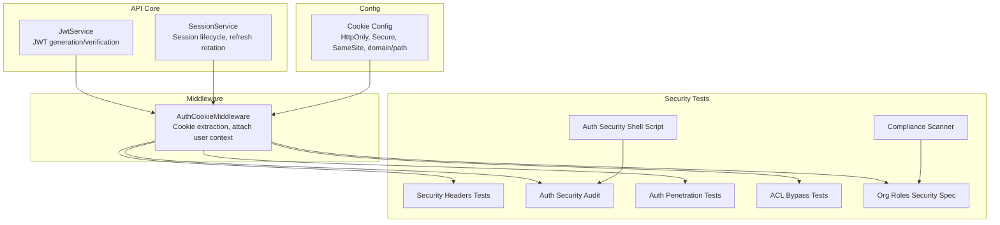
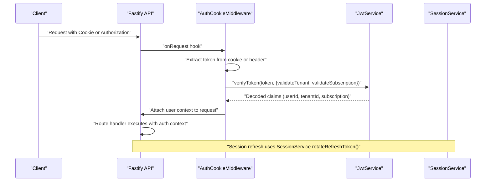
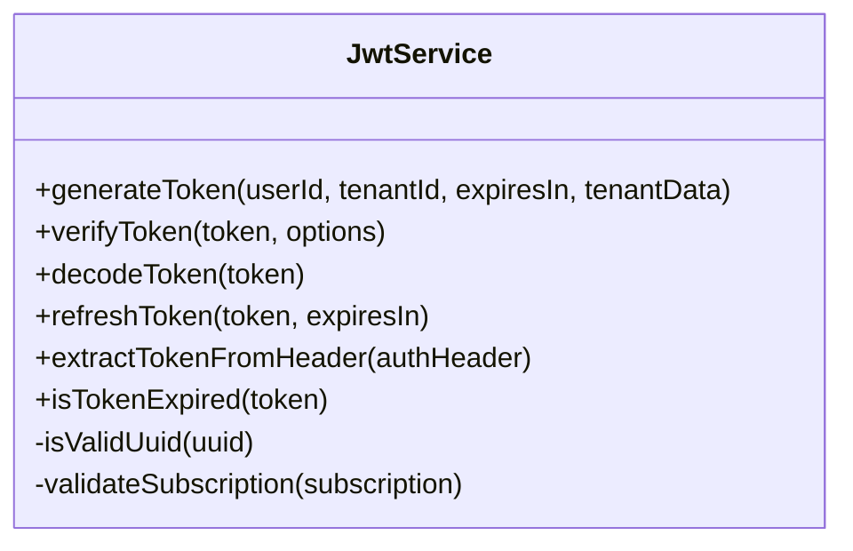
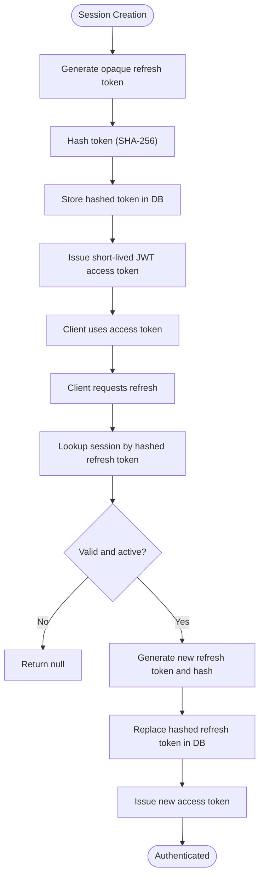
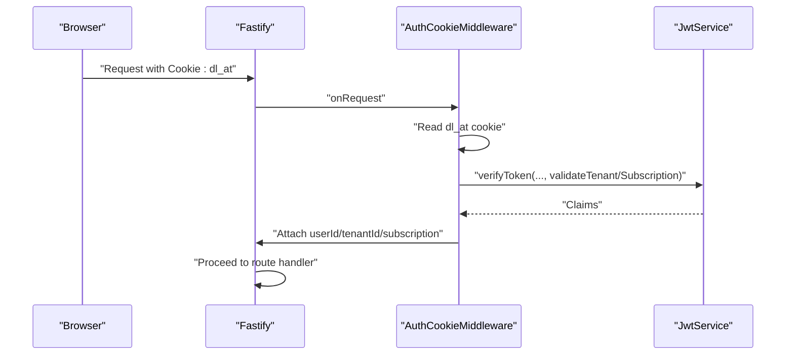
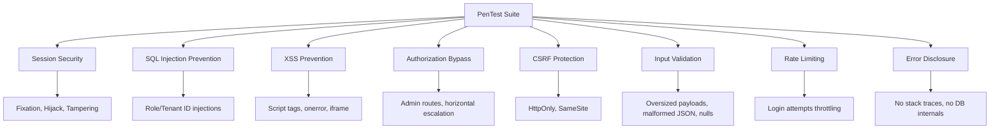
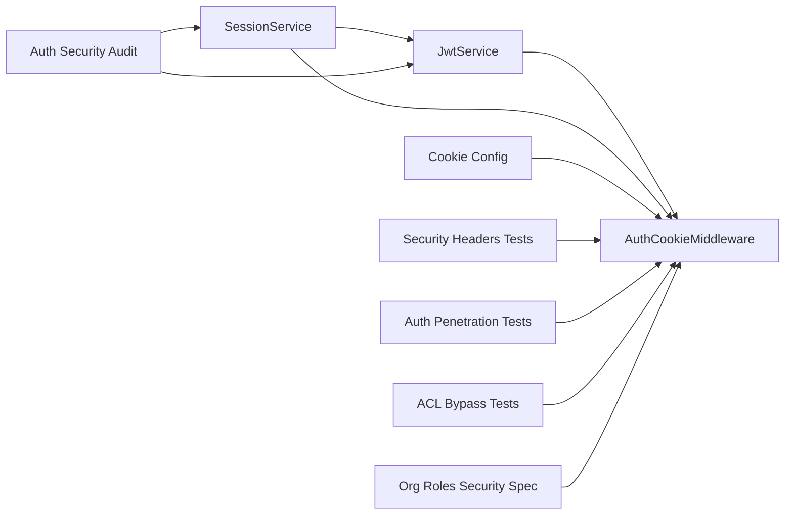

# Security Testing

<cite>
**Referenced Files in This Document**
- [apps/api/src/core/auth/jwt.service.ts](file://apps/api/src/core/auth/jwt.service.ts)
- [apps/api/src/modules/auth/session.service.ts](file://apps/api/src/modules/auth/session.service.ts)
- [apps/api/src/middleware/auth-cookie.middleware.ts](file://apps/api/src/middleware/auth-cookie.middleware.ts)
- [apps/api/src/config/cookies.ts](file://apps/api/src/config/cookies.ts)
- [apps/api/tests/security/headers.test.ts](file://apps/api/tests/security/headers.test.ts)
- [scripts/test-auth-security.sh](file://scripts/test-auth-security.sh)
- [scripts/scan-compliance.mjs](file://scripts/scan-compliance.mjs)
- [tests/security/auth-security-audit.test.ts](file://tests/security/auth-security-audit.test.ts)
- [tests/security/auth-penetration.test.ts](file://tests/security/auth-penetration.test.ts)
- [tests/security/acl-bypass-attempts.test.ts](file://tests/security/acl-bypass-attempts.test.ts)
- [tests/security/org-roles.security.spec.ts](file://tests/security/org-roles.security.spec.ts)
</cite>

## Table of Contents
1. [Introduction](#introduction)
2. [Project Structure](#project-structure)
3. [Core Components](#core-components)
4. [Architecture Overview](#architecture-overview)
5. [Detailed Component Analysis](#detailed-component-analysis)
6. [Dependency Analysis](#dependency-analysis)
7. [Performance Considerations](#performance-considerations)
8. [Troubleshooting Guide](#troubleshooting-guide)
9. [Conclusion](#conclusion)
10. [Appendices](#appendices)

## Introduction
This document describes the security testing framework and practices implemented in the monorepo, focusing on authentication security, authorization testing, and penetration testing approaches. It explains how JWT authentication, Role-Based Access Control (RBAC), and access control mechanisms are tested, along with vulnerability assessment strategies, compliance scanning, and security regression testing. The goal is to provide a practical guide for executing security tests, integrating automated scanners, and maintaining robust security controls across the API, middleware, and client SDK layers.

## Project Structure
Security testing spans multiple layers:
- API core services for JWT and session management
- Middleware for cookie-based authentication extraction and validation
- Cookie configuration for secure defaults
- Security-focused unit and integration tests
- Shell scripts for enterprise authentication security audits
- Compliance scanning for design system and codebase adherence
- E2E and RBAC-focused security specs

**Diagram sources**
- [apps/api/src/core/auth/jwt.service.ts](file://apps/api/src/core/auth/jwt.service.ts#L45-L258)
- [apps/api/src/modules/auth/session.service.ts](file://apps/api/src/modules/auth/session.service.ts#L56-L322)
- [apps/api/src/middleware/auth-cookie.middleware.ts](file://apps/api/src/middleware/auth-cookie.middleware.ts#L32-L113)
- [apps/api/src/config/cookies.ts](file://apps/api/src/config/cookies.ts#L12-L77)
- [apps/api/tests/security/headers.test.ts](file://apps/api/tests/security/headers.test.ts#L40-L184)
- [tests/security/auth-security-audit.test.ts](file://tests/security/auth-security-audit.test.ts#L11-L486)
- [tests/security/auth-penetration.test.ts](file://tests/security/auth-penetration.test.ts#L22-L566)
- [tests/security/acl-bypass-attempts.test.ts](file://tests/security/acl-bypass-attempts.test.ts#L64-L527)
- [tests/security/org-roles.security.spec.ts](file://tests/security/org-roles.security.spec.ts#L25-L305)
- [scripts/scan-compliance.mjs](file://scripts/scan-compliance.mjs#L1-L743)
- [scripts/test-auth-security.sh](file://scripts/test-auth-security.sh#L1-L486)

**Section sources**
- [apps/api/src/core/auth/jwt.service.ts](file://apps/api/src/core/auth/jwt.service.ts#L45-L258)
- [apps/api/src/modules/auth/session.service.ts](file://apps/api/src/modules/auth/session.service.ts#L56-L322)
- [apps/api/src/middleware/auth-cookie.middleware.ts](file://apps/api/src/middleware/auth-cookie.middleware.ts#L32-L113)
- [apps/api/src/config/cookies.ts](file://apps/api/src/config/cookies.ts#L12-L77)
- [apps/api/tests/security/headers.test.ts](file://apps/api/tests/security/headers.test.ts#L40-L184)
- [tests/security/auth-security-audit.test.ts](file://tests/security/auth-security-audit.test.ts#L11-L486)
- [tests/security/auth-penetration.test.ts](file://tests/security/auth-penetration.test.ts#L22-L566)
- [tests/security/acl-bypass-attempts.test.ts](file://tests/security/acl-bypass-attempts.test.ts#L64-L527)
- [tests/security/org-roles.security.spec.ts](file://tests/security/org-roles.security.spec.ts#L25-L305)
- [scripts/scan-compliance.mjs](file://scripts/scan-compliance.mjs#L1-L743)
- [scripts/test-auth-security.sh](file://scripts/test-auth-security.sh#L1-L486)

## Core Components
- JWT Service: Generates and verifies signed tokens with issuer, audience, and tenant/subscriber claims. Validates UUID tenant IDs and subscription structures when required.
- Session Service: Manages session creation, refresh token rotation (one-time use), revocation, and cleanup. Stores refresh tokens as SHA-256 hashes.
- Auth Cookie Middleware: Extracts JWT from HTTP-only cookies or Authorization header, validates tokens, and attaches user context to requests.
- Cookie Configuration: Defines secure defaults (HttpOnly, Secure in production, SameSite=Lax, cross-subdomain domain, path-scoped refresh token).

**Section sources**
- [apps/api/src/core/auth/jwt.service.ts](file://apps/api/src/core/auth/jwt.service.ts#L45-L258)
- [apps/api/src/modules/auth/session.service.ts](file://apps/api/src/modules/auth/session.service.ts#L56-L322)
- [apps/api/src/middleware/auth-cookie.middleware.ts](file://apps/api/src/middleware/auth-cookie.middleware.ts#L32-L113)
- [apps/api/src/config/cookies.ts](file://apps/api/src/config/cookies.ts#L12-L77)

## Architecture Overview
The authentication and authorization pipeline integrates cookie-based JWT extraction, middleware validation, and layered access control.

**Diagram sources**
- [apps/api/src/middleware/auth-cookie.middleware.ts](file://apps/api/src/middleware/auth-cookie.middleware.ts#L32-L113)
- [apps/api/src/core/auth/jwt.service.ts](file://apps/api/src/core/auth/jwt.service.ts#L112-L158)
- [apps/api/src/modules/auth/session.service.ts](file://apps/api/src/modules/auth/session.service.ts#L141-L198)

## Detailed Component Analysis

### JWT Authentication Security
- Token generation includes issuer, audience, and optional tenant/subscriber data.
- Verification validates signature, expiration, issuer, audience, and optionally UUID tenant format and subscription completeness.
- Token refresh preserves claims and tenant data.
- Tests cover secret length requirements, algorithm selection, signature verification, and tenant/subscriber validation.

**Diagram sources**
- [apps/api/src/core/auth/jwt.service.ts](file://apps/api/src/core/auth/jwt.service.ts#L45-L258)

**Section sources**
- [apps/api/src/core/auth/jwt.service.ts](file://apps/api/src/core/auth/jwt.service.ts#L45-L258)
- [tests/security/auth-security-audit.test.ts](file://tests/security/auth-security-audit.test.ts#L70-L183)
- [tests/security/auth-penetration.test.ts](file://tests/security/auth-penetration.test.ts#L134-L186)

### Session Management and Refresh Flow
- Cryptographically secure random tokens generated using crypto APIs.
- Refresh tokens stored as SHA-256 hashes; rotation invalidates previous refresh tokens (one-time use).
- Revocation reasons supported; expired session cleanup routine; session statistics.

**Diagram sources**
- [apps/api/src/modules/auth/session.service.ts](file://apps/api/src/modules/auth/session.service.ts#L88-L198)

**Section sources**
- [apps/api/src/modules/auth/session.service.ts](file://apps/api/src/modules/auth/session.service.ts#L56-L322)
- [tests/security/auth-security-audit.test.ts](file://tests/security/auth-security-audit.test.ts#L188-L228)

### Cookie Security and Middleware Extraction
- Access and refresh cookies configured as HttpOnly; CSRF cookie readable by JS for double-submit.
- Secure flag enabled in production; SameSite=Lax; cross-subdomain domain for SSO.
- Middleware extracts tokens from cookies or Authorization header, validates, and attaches user context.

**Diagram sources**
- [apps/api/src/middleware/auth-cookie.middleware.ts](file://apps/api/src/middleware/auth-cookie.middleware.ts#L32-L113)
- [apps/api/src/config/cookies.ts](file://apps/api/src/config/cookies.ts#L41-L77)

**Section sources**
- [apps/api/src/config/cookies.ts](file://apps/api/src/config/cookies.ts#L12-L77)
- [apps/api/src/middleware/auth-cookie.middleware.ts](file://apps/api/src/middleware/auth-cookie.middleware.ts#L32-L113)
- [tests/security/auth-security-audit.test.ts](file://tests/security/auth-security-audit.test.ts#L233-L259)

### Security Headers and Transport Protections
- Tests verify presence and correctness of security headers (X-Content-Type-Options, X-Frame-Options, X-Download-Options, HSTS, Referrer-Policy, X-DNS-Prefetch-Control).
- API endpoints and error responses are checked for consistent header application.

**Section sources**
- [apps/api/tests/security/headers.test.ts](file://apps/api/tests/security/headers.test.ts#L40-L184)

### Authentication Security Audit and Penetration Testing
- Audit tests validate cookie configuration, JWT security, session management, and best practices.
- Penetration tests simulate session fixation, CSRF protections, XSS prevention, SQL injection, privilege escalation, and brute-force timing analysis.

**Diagram sources**
- [tests/security/auth-penetration.test.ts](file://tests/security/auth-penetration.test.ts#L22-L566)

**Section sources**
- [tests/security/auth-security-audit.test.ts](file://tests/security/auth-security-audit.test.ts#L11-L486)
- [tests/security/auth-penetration.test.ts](file://tests/security/auth-penetration.test.ts#L22-L566)

### ACL and Access Control Testing
- Focus on preventing authorization bypass, injection attacks, mass assignment, sensitive data exposure, and enforcing access control boundaries.
- Demonstrates separation of concerns: ACL transforms data; RBAC enforces permissions; service layer validates business rules.

**Section sources**
- [tests/security/acl-bypass-attempts.test.ts](file://tests/security/acl-bypass-attempts.test.ts#L64-L527)

### Organization Roles and Sensitive Data Handling
- Tests cover injection handling in organization name, booking notes, and search parameters.
- Verifies output encoding, absence of stack traces, security headers, PII leakage prevention, rate limit awareness, and audit trail correlation IDs.

**Section sources**
- [tests/security/org-roles.security.spec.ts](file://tests/security/org-roles.security.spec.ts#L25-L305)

### Compliance Scanning
- Automated scanner detects hardcoded design tokens, typography, spacing, SVG colors, touch targets, missing button types, inline !important, and other design system violations.
- Generates a structured report and supports strict mode for CI gating.

**Section sources**
- [scripts/scan-compliance.mjs](file://scripts/scan-compliance.mjs#L1-L743)

### Enterprise Authentication Security Shell Script
- Validates cookie security, JWT configuration, session management, middleware, CORS, rate limiting, OAuth callback, tenant validation, and SDK integration.
- Optionally performs live API checks for health, RFC 7807 error format, and CORS headers.

**Section sources**
- [scripts/test-auth-security.sh](file://scripts/test-auth-security.sh#L1-L486)

## Dependency Analysis
- JwtService depends on jsonwebtoken and is used by SessionService and AuthCookieMiddleware.
- SessionService depends on container resolution for JwtService and database access for session persistence.
- AuthCookieMiddleware depends on JwtService and Cookie configuration to extract and validate tokens.
- Security tests depend on the runtime availability of the API server for live header checks.

**Diagram sources**
- [apps/api/src/core/auth/jwt.service.ts](file://apps/api/src/core/auth/jwt.service.ts#L45-L258)
- [apps/api/src/modules/auth/session.service.ts](file://apps/api/src/modules/auth/session.service.ts#L56-L322)
- [apps/api/src/middleware/auth-cookie.middleware.ts](file://apps/api/src/middleware/auth-cookie.middleware.ts#L32-L113)
- [apps/api/src/config/cookies.ts](file://apps/api/src/config/cookies.ts#L12-L77)
- [apps/api/tests/security/headers.test.ts](file://apps/api/tests/security/headers.test.ts#L40-L184)
- [tests/security/auth-security-audit.test.ts](file://tests/security/auth-security-audit.test.ts#L11-L486)
- [tests/security/auth-penetration.test.ts](file://tests/security/auth-penetration.test.ts#L22-L566)
- [tests/security/acl-bypass-attempts.test.ts](file://tests/security/acl-bypass-attempts.test.ts#L64-L527)
- [tests/security/org-roles.security.spec.ts](file://tests/security/org-roles.security.spec.ts#L25-L305)

**Section sources**
- [apps/api/src/core/auth/jwt.service.ts](file://apps/api/src/core/auth/jwt.service.ts#L45-L258)
- [apps/api/src/modules/auth/session.service.ts](file://apps/api/src/modules/auth/session.service.ts#L56-L322)
- [apps/api/src/middleware/auth-cookie.middleware.ts](file://apps/api/src/middleware/auth-cookie.middleware.ts#L32-L113)
- [apps/api/src/config/cookies.ts](file://apps/api/src/config/cookies.ts#L12-L77)

## Performance Considerations
- Short-lived access tokens reduce exposure window; refresh token rotation mitigates reuse risks.
- Parameterized queries and ORM usage protect against injection; ensure consistent use across handlers.
- Middleware performs lightweight verification; avoid heavy operations in onRequest hooks.
- Rate limiting and input validation prevent resource exhaustion; configure appropriately per environment.

## Troubleshooting Guide
Common issues and resolutions:
- Missing or incorrect security headers: verify server configuration and ensure tests run against a reachable API instance.
- Cookie configuration mismatches: confirm production environment variables and domain settings align with cookie options.
- JWT verification failures: ensure issuer/audience claims match, token not expired, and tenant/subscriber validation flags are set as needed.
- Session invalidation after logout: confirm cookie clearing options and middleware behavior.
- Compliance violations: address hardcoded values flagged by the scanner and adopt design tokens.

**Section sources**
- [apps/api/tests/security/headers.test.ts](file://apps/api/tests/security/headers.test.ts#L14-L22)
- [apps/api/src/config/cookies.ts](file://apps/api/src/config/cookies.ts#L93-L119)
- [apps/api/src/core/auth/jwt.service.ts](file://apps/api/src/core/auth/jwt.service.ts#L112-L158)
- [apps/api/src/middleware/auth-cookie.middleware.ts](file://apps/api/src/middleware/auth-cookie.middleware.ts#L92-L102)
- [scripts/scan-compliance.mjs](file://scripts/scan-compliance.mjs#L514-L742)

## Conclusion
The repository implements a comprehensive security testing framework with dedicated JWT and session services, secure cookie configuration, middleware-driven authentication, and extensive test suites covering authentication, authorization, and penetration testing. Compliance scanning and shell scripts further strengthen security posture. Adopting these practices ensures robust authentication, RBAC enforcement, and resilient access control across environments.

## Appendices

### Security Test Execution
- Run security headers tests against a running API instance.
- Execute authentication security audit and penetration tests locally or in CI.
- Use the enterprise authentication shell script for environment-specific validations.
- Integrate compliance scanning into CI with optional strict mode.

**Section sources**
- [apps/api/tests/security/headers.test.ts](file://apps/api/tests/security/headers.test.ts#L8-L22)
- [tests/security/auth-security-audit.test.ts](file://tests/security/auth-security-audit.test.ts#L15-L17)
- [tests/security/auth-penetration.test.ts](file://tests/security/auth-penetration.test.ts#L17-L22)
- [scripts/test-auth-security.sh](file://scripts/test-auth-security.sh#L457-L482)
- [scripts/scan-compliance.mjs](file://scripts/scan-compliance.mjs#L672-L742)

### Vulnerability Scanning Integration
- Use the compliance scanner to detect design system violations and generate reports.
- Gate merges with strict mode when high-severity issues are present.

**Section sources**
- [scripts/scan-compliance.mjs](file://scripts/scan-compliance.mjs#L672-L742)

### Security Regression Testing
- Maintain focused regression suites for JWT, session, middleware, headers, ACL, and organization roles.
- Automate shell-based enterprise authentication checks in CI.

**Section sources**
- [tests/security/auth-security-audit.test.ts](file://tests/security/auth-security-audit.test.ts#L11-L486)
- [tests/security/acl-bypass-attempts.test.ts](file://tests/security/acl-bypass-attempts.test.ts#L64-L527)
- [tests/security/org-roles.security.spec.ts](file://tests/security/org-roles.security.spec.ts#L25-L305)
- [scripts/test-auth-security.sh](file://scripts/test-auth-security.sh#L457-L482)