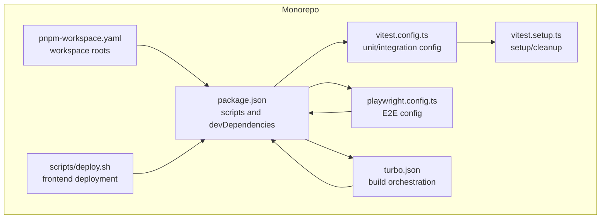
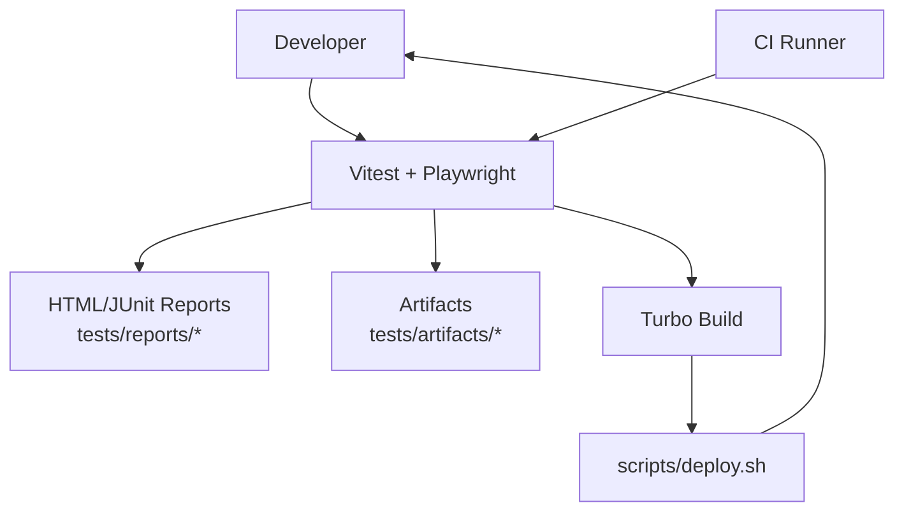
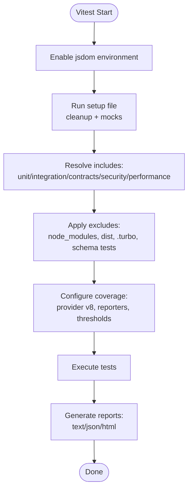
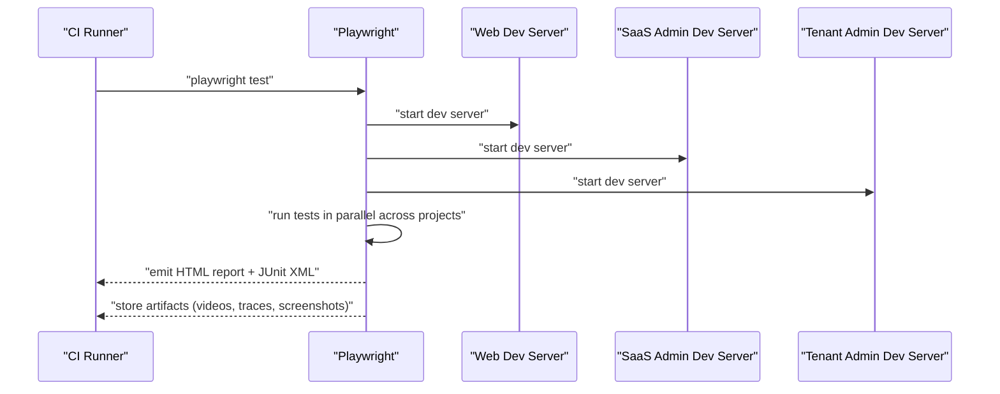
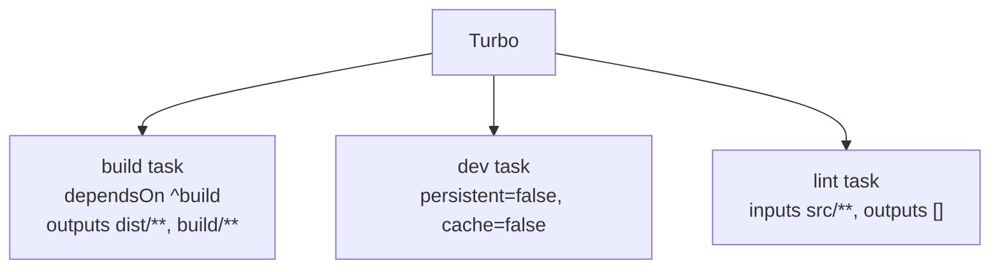
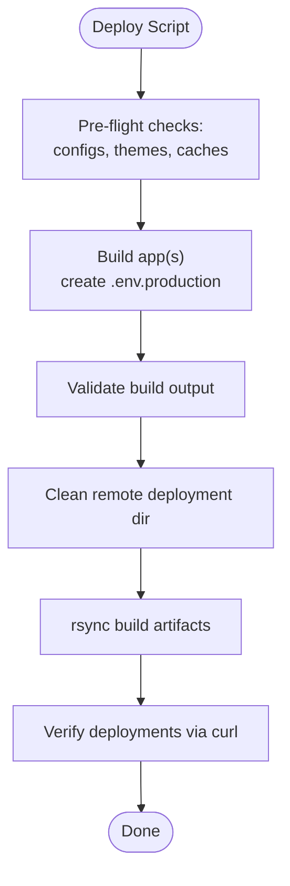
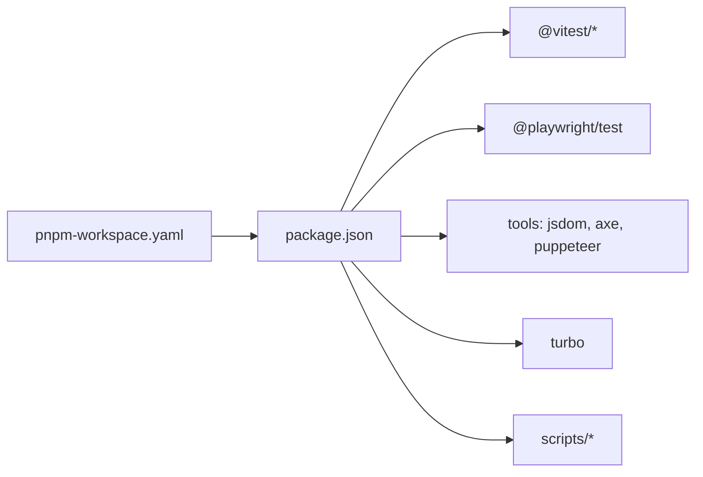

# Test Automation & CI/CD

<cite>
**Referenced Files in This Document**
- [package.json](file://package.json)
- [vitest.config.ts](file://vitest.config.ts)
- [playwright.config.ts](file://playwright.config.ts)
- [turbo.json](file://turbo.json)
- [pnpm-workspace.yaml](file://pnpm-workspace.yaml)
- [vitest.setup.ts](file://vitest.setup.ts)
- [scripts/deploy.sh](file://scripts/deploy.sh)
- [tests/README.md](file://tests/README.md)
- [docs/guides/02-testing.md](file://docs/guides/02-testing.md)
- [docs/guides/03-deployment.md](file://docs/guides/03-deployment.md)
</cite>

## Table of Contents
1. [Introduction](#introduction)
2. [Project Structure](#project-structure)
3. [Core Components](#core-components)
4. [Architecture Overview](#architecture-overview)
5. [Detailed Component Analysis](#detailed-component-analysis)
6. [Dependency Analysis](#dependency-analysis)
7. [Performance Considerations](#performance-considerations)
8. [Troubleshooting Guide](#troubleshooting-guide)
9. [Conclusion](#conclusion)
10. [Appendices](#appendices)

## Introduction
This document describes the test automation and CI/CD architecture for the monorepo. It covers continuous integration pipelines, automated testing workflows, and deployment testing strategies. It explains how to configure automated testing in CI/CD environments, report test results, handle failures, optimize pipelines, execute tests in parallel, manage artifacts, and operate across development, staging, and production environments. It also documents test coverage reporting, quality gates, and automated test maintenance.

## Project Structure
The monorepo uses pnpm workspaces and Turbo for build orchestration. Testing is split into:
- Unit and integration tests powered by Vitest
- End-to-end tests powered by Playwright
- Dedicated test categories: performance, security, accessibility, and fixtures/helpers

Key configuration and scripts:
- Root package scripts define test commands and deployment targets
- Vitest config sets up the testing environment, coverage, and include/exclude patterns
- Playwright config defines parallelism, retries, reporters, and multi-project support
- Turbo config orchestrates build tasks and caching
- Deployment script automates building and syncing frontend apps to a VPS

**Diagram sources**
- [package.json](file://package.json#L1-L115)
- [vitest.config.ts](file://vitest.config.ts#L1-L57)
- [playwright.config.ts](file://playwright.config.ts#L1-L116)
- [turbo.json](file://turbo.json#L1-L19)
- [pnpm-workspace.yaml](file://pnpm-workspace.yaml#L1-L6)
- [vitest.setup.ts](file://vitest.setup.ts#L1-L70)
- [scripts/deploy.sh](file://scripts/deploy.sh#L1-L450)

**Section sources**
- [package.json](file://package.json#L1-L115)
- [vitest.config.ts](file://vitest.config.ts#L1-L57)
- [playwright.config.ts](file://playwright.config.ts#L1-L116)
- [turbo.json](file://turbo.json#L1-L19)
- [pnpm-workspace.yaml](file://pnpm-workspace.yaml#L1-L6)
- [vitest.setup.ts](file://vitest.setup.ts#L1-L70)
- [scripts/deploy.sh](file://scripts/deploy.sh#L1-L450)

## Core Components
- Test runner and coverage
  - Vitest runs unit and integration tests with jsdom environment, setup files, and coverage reporting.
  - Coverage targets selected packages/apps and excludes tests and config files.
- End-to-end test framework
  - Playwright executes E2E tests in parallel across multiple browsers and devices, with retries and CI-friendly worker settings.
  - Reports are emitted to HTML and JUnit, with artifacts stored under tests/artifacts.
- Build and orchestration
  - Turbo manages build dependencies and caching across packages.
  - pnpm workspaces define package roots for monorepo-wide operations.
- Deployment and verification
  - A shell script builds and syncs frontend apps to a VPS, verifies deployment health, and cleans caches.

**Section sources**
- [vitest.config.ts](file://vitest.config.ts#L18-L55)
- [playwright.config.ts](file://playwright.config.ts#L15-L27)
- [turbo.json](file://turbo.json#L3-L16)
- [pnpm-workspace.yaml](file://pnpm-workspace.yaml#L1-L6)
- [scripts/deploy.sh](file://scripts/deploy.sh#L133-L159)

## Architecture Overview
The testing and CI/CD architecture integrates:
- Local developer workflows (watch mode, coverage, UI)
- CI pipelines (parallel workers, retries, artifact publishing)
- Multi-environment deployment (staging and production)
- Quality gates (coverage thresholds, forbidden-only enforcement, test reports)

**Diagram sources**
- [package.json](file://package.json#L5-L25)
- [vitest.config.ts](file://vitest.config.ts#L42-L54)
- [playwright.config.ts](file://playwright.config.ts#L24-L27)
- [turbo.json](file://turbo.json#L3-L16)
- [scripts/deploy.sh](file://scripts/deploy.sh#L328-L396)

## Detailed Component Analysis

### Vitest Configuration and Test Execution
- Environment and setup
  - Global flags enable DOM APIs and jsdom environment.
  - Setup file performs cleanup and mocks for responsive and dialog features.
- Test inclusion and coverage
  - Includes unit, integration, contracts, security, and performance tests across packages and apps.
  - Coverage targets specific source folders and excludes tests and config files.
- Scripts and commands
  - npm-style scripts run unit, integration, contract, security, and combined suites.
  - Coverage is produced in text, JSON, and HTML formats.

**Diagram sources**
- [vitest.config.ts](file://vitest.config.ts#L18-L55)
- [vitest.setup.ts](file://vitest.setup.ts#L1-L70)

**Section sources**
- [vitest.config.ts](file://vitest.config.ts#L18-L55)
- [vitest.setup.ts](file://vitest.setup.ts#L1-L70)
- [package.json](file://package.json#L10-L25)

### Playwright Configuration and E2E Workflows
- Parallelism and retries
  - Fully parallel execution; enforce retries on CI; limit workers on CI for stability.
- Reporting and artifacts
  - HTML and list reporters; output artifacts to tests/artifacts (videos, traces, screenshots).
- Projects and devices
  - Chromium, Firefox, WebKit desktop and mobile devices; separate projects for SaaS Admin and Tenant Admin apps.
- Local dev servers
  - Starts multiple dev servers for web, SaaS Admin, and Tenant Admin apps before tests.

**Diagram sources**
- [playwright.config.ts](file://playwright.config.ts#L15-L27)
- [playwright.config.ts](file://playwright.config.ts#L46-L92)
- [playwright.config.ts](file://playwright.config.ts#L95-L114)

**Section sources**
- [playwright.config.ts](file://playwright.config.ts#L15-L27)
- [playwright.config.ts](file://playwright.config.ts#L46-L92)
- [playwright.config.ts](file://playwright.config.ts#L95-L114)
- [tests/README.md](file://tests/README.md#L106-L111)

### Build Orchestration with Turbo
- Tasks
  - Build depends on upstream packages; outputs cached under dist/build.
  - Dev task is persistent and not cached.
  - Lint task declares inputs and outputs for incremental linting.
- Workspace roots
  - pnpm workspaces include apps and packages.

**Diagram sources**
- [turbo.json](file://turbo.json#L3-L16)
- [pnpm-workspace.yaml](file://pnpm-workspace.yaml#L1-L6)

**Section sources**
- [turbo.json](file://turbo.json#L3-L16)
- [pnpm-workspace.yaml](file://pnpm-workspace.yaml#L1-L6)

### Deployment Script and Post-Deployment Verification
- Pre-flight checks
  - Duplicate Vite configs detection, theme CSS copying, cache clearing.
- Build and environment creation
  - Creates per-app production environment files and validates build output.
- Server sync and verification
  - Cleans remote deployment directories, rsyncs built assets, and verifies URLs.
- Rollback and troubleshooting
  - Provides guidance for circular dependency issues, missing styles, and API process checks.

**Diagram sources**
- [scripts/deploy.sh](file://scripts/deploy.sh#L87-L159)
- [scripts/deploy.sh](file://scripts/deploy.sh#L252-L278)
- [scripts/deploy.sh](file://scripts/deploy.sh#L398-L447)

**Section sources**
- [scripts/deploy.sh](file://scripts/deploy.sh#L87-L159)
- [scripts/deploy.sh](file://scripts/deploy.sh#L252-L278)
- [scripts/deploy.sh](file://scripts/deploy.sh#L398-L447)
- [docs/guides/03-deployment.md](file://docs/guides/03-deployment.md#L134-L164)

## Dependency Analysis
- Internal dependencies
  - Vitest relies on jsdom and setup files; Playwright drives multiple dev servers; Turbo orchestrates builds.
- External dependencies
  - Playwright, @playwright/test, vitest, @vitest/ui, axe-core, jest-axe, puppeteer, and related testing libraries.
- Workspace and scripts
  - pnpm workspaces define package roots; package.json scripts expose test and deploy commands.

**Diagram sources**
- [package.json](file://package.json#L75-L104)
- [pnpm-workspace.yaml](file://pnpm-workspace.yaml#L1-L6)

**Section sources**
- [package.json](file://package.json#L75-L104)
- [pnpm-workspace.yaml](file://pnpm-workspace.yaml#L1-L6)

## Performance Considerations
- Parallel E2E execution
  - Playwright enables fully parallel test execution across projects and devices to reduce total runtime.
- CI worker tuning
  - On CI, workers are limited to improve stability; retries are enabled to reduce flakiness.
- Coverage scope
  - Vitest coverage targets only source code, excluding tests and config, to keep coverage meaningful.
- Build caching
  - Turbo caches build outputs; pre-flight cache clearing prevents stale artifacts during critical deployments.

**Section sources**
- [playwright.config.ts](file://playwright.config.ts#L15-L27)
- [playwright.config.ts](file://playwright.config.ts#L22-L22)
- [vitest.config.ts](file://vitest.config.ts#L42-L54)
- [turbo.json](file://turbo.json#L3-L16)
- [scripts/deploy.sh](file://scripts/deploy.sh#L133-L147)

## Troubleshooting Guide
- E2E failures
  - Use Playwright’s HTML and list reporters; collect videos, traces, and screenshots under tests/artifacts.
  - Adjust workers and retries for CI stability.
- Unit test failures
  - Review Vitest HTML coverage and text reports; confirm setup file mocks and cleanup behavior.
- Deployment issues
  - Circular chunk dependency errors indicate Vite manualChunks problems; remove duplicate vite.config files and clear caches.
  - Missing theme CSS leads to broken layouts; ensure theme files are copied to public folders.
  - API process issues: check PM2 status and logs; restart process if needed.

**Section sources**
- [tests/README.md](file://tests/README.md#L106-L111)
- [playwright.config.ts](file://playwright.config.ts#L24-L27)
- [playwright.config.ts](file://playwright.config.ts#L22-L22)
- [vitest.config.ts](file://vitest.config.ts#L42-L54)
- [docs/guides/03-deployment.md](file://docs/guides/03-deployment.md#L358-L382)
- [docs/guides/03-deployment.md](file://docs/guides/03-deployment.md#L333-L442)

## Conclusion
The monorepo’s testing and CI/CD stack combines Vitest for unit and integration tests, Playwright for E2E workflows, Turbo for build orchestration, and a robust deployment script for environment validation. CI settings emphasize reliability with retries and controlled parallelism, while coverage and reporting provide quality insights. The deployment script ensures reproducible, cache-clean builds and post-deployment verification, supporting safe rollouts across environments.

## Appendices

### CI/CD Pipeline Configuration and Quality Gates
- CI behavior
  - Enforce “forbidOnly” in CI; enable retries; limit workers for stability.
  - Publish HTML and JUnit reports; store artifacts for diagnostics.
- Quality gates
  - Coverage thresholds configured in Vitest; enforce “only-on-failure” screenshots and traces on CI.
  - Use scripts to validate builds and detect circular dependencies.

**Section sources**
- [playwright.config.ts](file://playwright.config.ts#L17-L22)
- [playwright.config.ts](file://playwright.config.ts#L24-L27)
- [vitest.config.ts](file://vitest.config.ts#L42-L54)
- [package.json](file://package.json#L10-L25)

### Test Execution Commands and Examples
- Unit tests
  - Run watch mode, single run, coverage, and UI.
- E2E tests
  - Run all E2E tests or filter by feature; use project-specific base URLs.
- Combined suites
  - Run unit + integration + contracts in CI; run all tests together.

**Section sources**
- [tests/README.md](file://tests/README.md#L151-L175)
- [package.json](file://package.json#L10-L25)

### Environments and Deployment Testing Strategies
- Development
  - Local dev servers started by Playwright; fast feedback loops.
- Staging
  - Use the deployment script to build and sync to staging hosts; verify via curl checks.
- Production
  - Follow pre-deployment checklist, clear caches, and verify API health and PM2 status.

**Section sources**
- [playwright.config.ts](file://playwright.config.ts#L95-L114)
- [docs/guides/03-deployment.md](file://docs/guides/03-deployment.md#L134-L164)
- [docs/guides/03-deployment.md](file://docs/guides/03-deployment.md#L228-L293)

### Test Data Management and Maintenance
- Fixtures and helpers
  - Centralized fixtures and helpers under tests; maintainers can reuse and extend for new tests.
- Artifact management
  - Store E2E videos, traces, and screenshots under tests/artifacts; publish reports to tests/reports.

**Section sources**
- [tests/README.md](file://tests/README.md#L138-L150)
- [tests/README.md](file://tests/README.md#L106-L111)