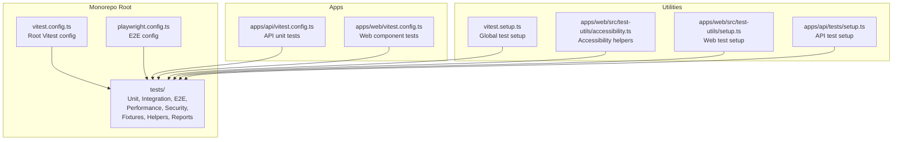
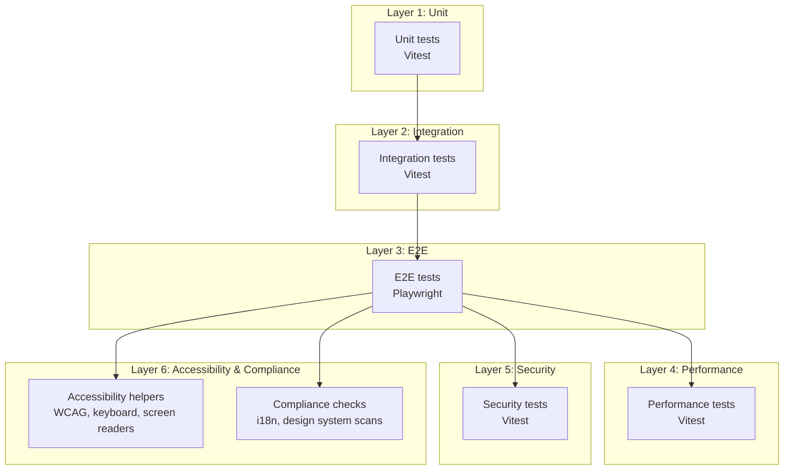
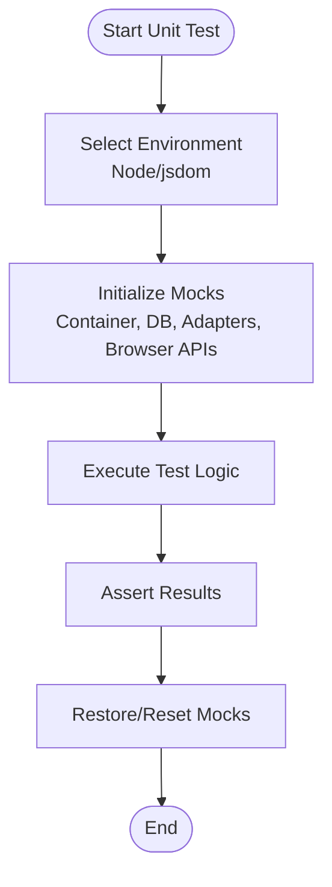
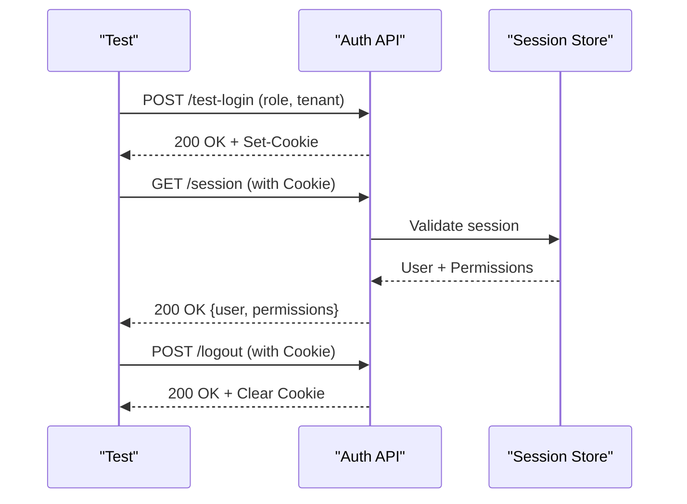
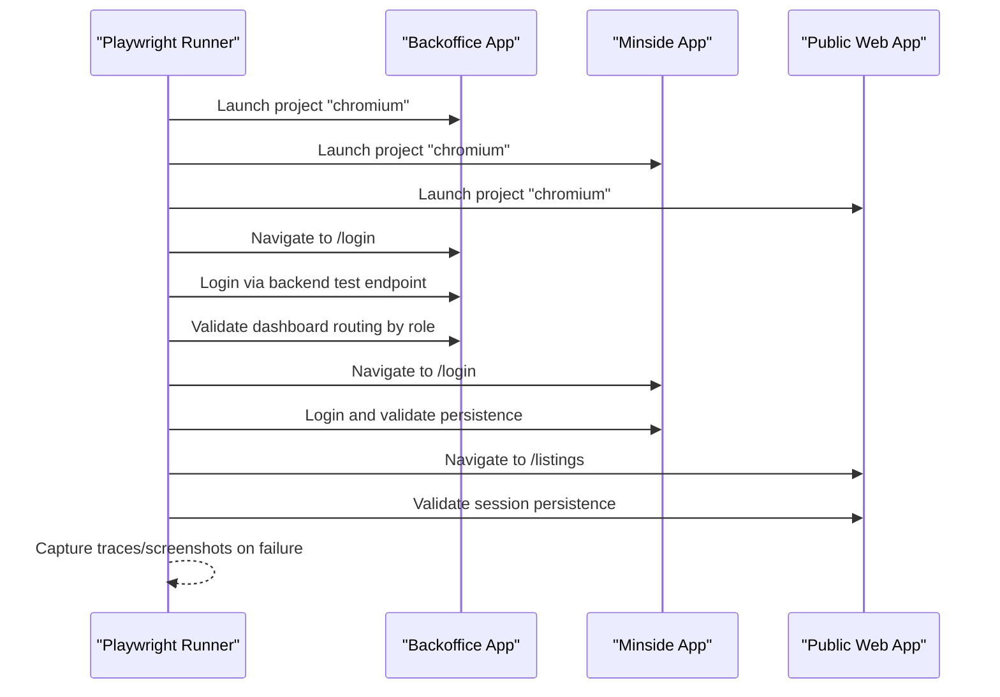
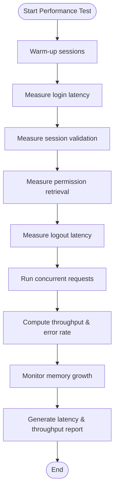
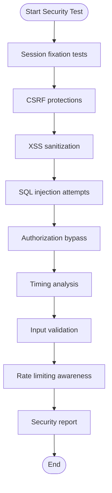
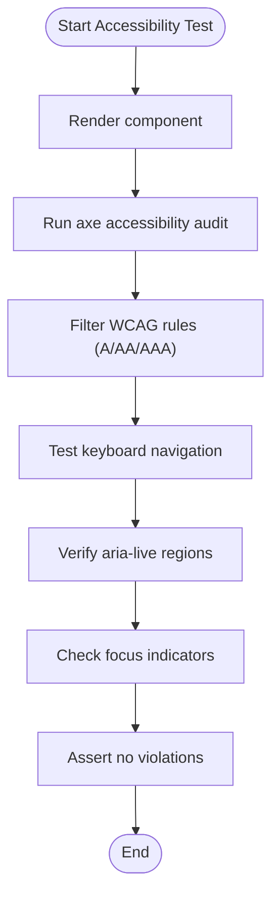
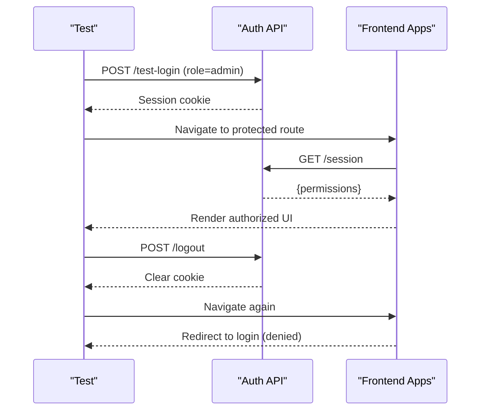
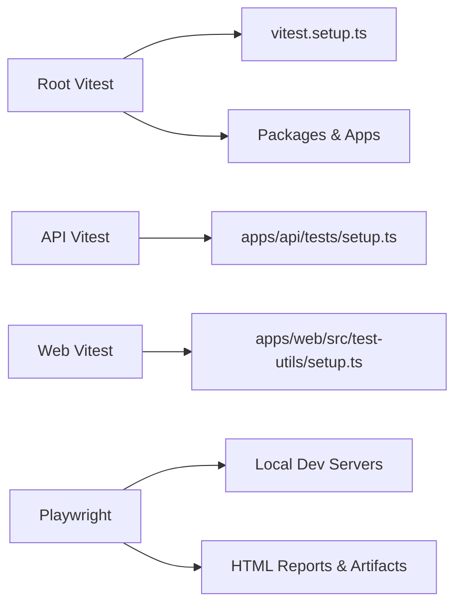

# Testing Strategy

<cite>
**Referenced Files in This Document**
- [vitest.config.ts](file://vitest.config.ts)
- [vitest.config.ts](file://apps/web/vitest.config.ts)
- [vitest.config.ts](file://apps/api/vitest.config.ts)
- [playwright.config.ts](file://playwright.config.ts)
- [tests/README.md](file://tests/README.md)
- [tests/RUN_TESTS_SUMMARY.md](file://tests/RUN_TESTS_SUMMARY.md)
- [tests/TEST_COVERAGE_SUMMARY.md](file://tests/TEST_COVERAGE_SUMMARY.md)
- [vitest.setup.ts](file://vitest.setup.ts)
- [apps/web/src/test-utils/accessibility.ts](file://apps/web/src/test-utils/accessibility.ts)
- [apps/web/src/test-utils/setup.ts](file://apps/web/src/test-utils/setup.ts)
- [apps/api/tests/setup.ts](file://apps/api/tests/setup.ts)
- [tests/unit/capabilities.test.ts](file://tests/unit/capabilities.test.ts)
- [tests/integration/rbac-flow.test.ts](file://tests/integration/rbac-flow.test.ts)
- [tests/security/auth-penetration.test.ts](file://tests/security/auth-penetration.test.ts)
- [tests/performance/auth-performance.test.ts](file://tests/performance/auth-performance.test.ts)
- [tests/journeys/auth-rbac.spec.ts](file://tests/journeys/auth-rbac.spec.ts)
</cite>

## Table of Contents
1. [Introduction](#introduction)
2. [Project Structure](#project-structure)
3. [Core Components](#core-components)
4. [Architecture Overview](#architecture-overview)
5. [Detailed Component Analysis](#detailed-component-analysis)
6. [Dependency Analysis](#dependency-analysis)
7. [Performance Considerations](#performance-considerations)
8. [Troubleshooting Guide](#troubleshooting-guide)
9. [Conclusion](#conclusion)
10. [Appendices](#appendices)

## Introduction
This document defines the comprehensive testing strategy for the monorepo, detailing the multi-layered testing approach spanning unit, integration, end-to-end (E2E), performance, and security testing. It explains the testing architecture, test organization, continuous integration practices, and provides guidance on best practices, mock strategies, and test data management. Specialized topics include accessibility testing, RBAC testing, and compliance testing.

## Project Structure
The testing system is organized across:
- Monorepo-wide Vitest configuration for unit and integration tests
- Application-specific Vitest configurations for API and Web
- Playwright configuration for E2E tests across multiple apps
- A centralized tests/ directory with structured categories for unit, integration, E2E, performance, security, fixtures, helpers, and reports

**Diagram sources**
- [vitest.config.ts](file://vitest.config.ts#L1-L57)
- [playwright.config.ts](file://playwright.config.ts#L1-L116)
- [tests/README.md](file://tests/README.md#L1-L230)

**Section sources**
- [tests/README.md](file://tests/README.md#L1-L230)
- [vitest.config.ts](file://vitest.config.ts#L1-L57)
- [playwright.config.ts](file://playwright.config.ts#L1-L116)

## Core Components
- Root Vitest configuration orchestrates:
  - Global environment and aliases
  - Coverage reporting and inclusion/exclusion rules
  - Inclusion of unit, integration, contracts, security, and performance tests across packages and apps
- Application-specific Vitest configs:
  - API: Node environment, global mocks, and database adapter mocks
  - Web: jsdom environment, React plugin, and test utilities
- Playwright configuration:
  - Parallel E2E runs, multiple browser targets, project-specific base URLs, and artifact outputs
  - Local dev server orchestration for multiple apps
- Test utilities:
  - Accessibility helpers for WCAG compliance and keyboard/screen reader testing
  - Global setup for React tests and API test containers

**Section sources**
- [vitest.config.ts](file://vitest.config.ts#L1-L57)
- [apps/api/vitest.config.ts](file://apps/api/vitest.config.ts#L1-L23)
- [apps/web/vitest.config.ts](file://apps/web/vitest.config.ts#L1-L21)
- [playwright.config.ts](file://playwright.config.ts#L1-L116)
- [apps/web/src/test-utils/accessibility.ts](file://apps/web/src/test-utils/accessibility.ts#L1-L315)
- [vitest.setup.ts](file://vitest.setup.ts#L1-L70)
- [apps/web/src/test-utils/setup.ts](file://apps/web/src/test-utils/setup.ts#L1-L130)
- [apps/api/tests/setup.ts](file://apps/api/tests/setup.ts#L1-L110)

## Architecture Overview
The testing architecture follows a layered pyramid:
- Unit tests validate pure logic and component behavior
- Integration tests validate service and API interactions
- E2E tests validate cross-app workflows and user journeys
- Performance tests validate latency, throughput, and resource usage
- Security tests validate robustness against OWASP-style threats
- Accessibility and compliance tests ensure inclusive and policy-aligned experiences

**Diagram sources**
- [tests/README.md](file://tests/README.md#L69-L137)
- [tests/TEST_COVERAGE_SUMMARY.md](file://tests/TEST_COVERAGE_SUMMARY.md#L1-L422)

## Detailed Component Analysis

### Unit Testing with Vitest
- Scope and coverage:
  - Root Vitest includes unit, integration, contracts, security, and performance tests across packages and apps
  - API Vitest focuses on Node environment and database/adapter mocking
  - Web Vitest targets jsdom with React plugin and test utilities
- Mock strategies:
  - API tests use a DI container and mock database/adapter layers
  - Web tests mock browser APIs (matchMedia, ResizeObserver, IntersectionObserver, localStorage, sessionStorage)
- Best practices:
  - Use co-located tests for packages and organized tests for integration
  - Leverage setup files to initialize mocks and clean up after each test

**Diagram sources**
- [apps/api/tests/setup.ts](file://apps/api/tests/setup.ts#L1-L110)
- [vitest.setup.ts](file://vitest.setup.ts#L1-L70)
- [apps/web/src/test-utils/setup.ts](file://apps/web/src/test-utils/setup.ts#L1-L130)

**Section sources**
- [vitest.config.ts](file://vitest.config.ts#L18-L55)
- [apps/api/vitest.config.ts](file://apps/api/vitest.config.ts#L4-L22)
- [apps/web/vitest.config.ts](file://apps/web/vitest.config.ts#L5-L20)
- [apps/api/tests/setup.ts](file://apps/api/tests/setup.ts#L92-L110)
- [vitest.setup.ts](file://vitest.setup.ts#L1-L70)
- [apps/web/src/test-utils/setup.ts](file://apps/web/src/test-utils/setup.ts#L1-L130)

### Integration Testing Patterns
- RBAC flow integration validates:
  - Session creation and validation
  - Logout and cookie invalidation
  - Permission-based access control
  - Multi-tenant isolation and security headers
- Test patterns:
  - Use a test login endpoint to establish sessions
  - Validate session cookies and permissions
  - Assert error handling and RFC 7807 compliance

**Diagram sources**
- [tests/integration/rbac-flow.test.ts](file://tests/integration/rbac-flow.test.ts#L34-L78)

**Section sources**
- [tests/integration/rbac-flow.test.ts](file://tests/integration/rbac-flow.test.ts#L1-L447)

### End-to-End Testing with Playwright
- Projects and browsers:
  - Chromium, Firefox, Safari desktop and mobile targets
  - Dedicated projects for SaaS Admin and Tenant Admin apps
- Orchestration:
  - Local dev servers started per app
  - Trace and screenshot capture on failure
- Test categories:
  - Authentication and RBAC journeys
  - Cross-app session management
  - Error handling and performance bounds

**Diagram sources**
- [playwright.config.ts](file://playwright.config.ts#L46-L114)
- [tests/journeys/auth-rbac.spec.ts](file://tests/journeys/auth-rbac.spec.ts#L1-L496)

**Section sources**
- [playwright.config.ts](file://playwright.config.ts#L1-L116)
- [tests/journeys/auth-rbac.spec.ts](file://tests/journeys/auth-rbac.spec.ts#L1-L496)

### Performance Testing
- Benchmarks include:
  - Login latency (P95 targets)
  - Session validation throughput
  - RBAC permission retrieval
  - Logout latency
  - Cookie parsing overhead
  - Database query performance
  - Throughput and memory usage
- Measurement:
  - Latency statistics (avg, p50, p95, p99)
  - Concurrent request patterns
  - Iterative performance sampling

**Diagram sources**
- [tests/performance/auth-performance.test.ts](file://tests/performance/auth-performance.test.ts#L29-L54)

**Section sources**
- [tests/performance/auth-performance.test.ts](file://tests/performance/auth-performance.test.ts#L1-L449)

### Security Testing
- Coverage includes:
  - Session fixation and hijacking protections
  - CSRF mitigation via cookie attributes
  - XSS sanitization and error sanitization
  - SQL injection prevention
  - Authorization bypass attempts
  - Input validation and rate limiting awareness
- Approach:
  - Payload injection tests
  - Timing analysis to prevent side-channel leakage
  - RBAC enforcement verification across protected routes

**Diagram sources**
- [tests/security/auth-penetration.test.ts](file://tests/security/auth-penetration.test.ts#L24-L132)

**Section sources**
- [tests/security/auth-penetration.test.ts](file://tests/security/auth-penetration.test.ts#L1-L567)

### Accessibility Testing
- Tools and patterns:
  - jest-axe matchers extended to Vitest expect
  - WCAG 2.1 rules configured for A, AA, AAA
  - Keyboard navigation helpers and screen reader region testing
  - Focus management and color contrast utilities
- Setup:
  - Global setup for matchMedia and dialog polyfills
  - Test utilities re-exported for easy imports

**Diagram sources**
- [apps/web/src/test-utils/accessibility.ts](file://apps/web/src/test-utils/accessibility.ts#L65-L111)
- [apps/web/src/test-utils/accessibility.ts](file://apps/web/src/test-utils/accessibility.ts#L130-L149)
- [apps/web/src/test-utils/accessibility.ts](file://apps/web/src/test-utils/accessibility.ts#L168-L196)
- [apps/web/src/test-utils/accessibility.ts](file://apps/web/src/test-utils/accessibility.ts#L214-L240)

**Section sources**
- [apps/web/src/test-utils/accessibility.ts](file://apps/web/src/test-utils/accessibility.ts#L1-L315)
- [apps/web/src/test-utils/setup.ts](file://apps/web/src/test-utils/setup.ts#L1-L130)

### RBAC Testing
- Capability validation:
  - Anonymous vs user vs admin vs saksbehandler vs case_handler
  - Naming convention and consistency checks
  - Feature flags and capability helpers exported from SDK hooks
- Integration and E2E:
  - Backend test login endpoint enables realistic RBAC flows
  - E2E journeys validate role-based routing and access denial

**Diagram sources**
- [tests/unit/capabilities.test.ts](file://tests/unit/capabilities.test.ts#L15-L144)
- [tests/journeys/auth-rbac.spec.ts](file://tests/journeys/auth-rbac.spec.ts#L44-L118)

**Section sources**
- [tests/unit/capabilities.test.ts](file://tests/unit/capabilities.test.ts#L1-L189)
- [tests/journeys/auth-rbac.spec.ts](file://tests/journeys/auth-rbac.spec.ts#L1-L496)

### Compliance Testing Approaches
- i18n and design system scans are integrated into reports
- Accessibility utilities support WCAG compliance checks
- Security tests ensure error sanitization and protection against disclosure

**Section sources**
- [tests/README.md](file://tests/README.md#L138-L150)
- [apps/web/src/test-utils/accessibility.ts](file://apps/web/src/test-utils/accessibility.ts#L19-L48)

## Dependency Analysis
- Test configuration dependencies:
  - Root Vitest depends on aliases and setup files
  - API and Web Vitest configs depend on their respective environments and plugins
  - Playwright depends on local dev servers and project-specific base URLs
- Coupling and cohesion:
  - Test utilities are cohesive and reusable across unit and E2E layers
  - API and Web test setups isolate concerns (container vs DOM mocks)

**Diagram sources**
- [vitest.config.ts](file://vitest.config.ts#L1-L57)
- [apps/api/vitest.config.ts](file://apps/api/vitest.config.ts#L1-L23)
- [apps/web/vitest.config.ts](file://apps/web/vitest.config.ts#L1-L21)
- [playwright.config.ts](file://playwright.config.ts#L95-L114)

**Section sources**
- [vitest.config.ts](file://vitest.config.ts#L1-L57)
- [apps/api/vitest.config.ts](file://apps/api/vitest.config.ts#L1-L23)
- [apps/web/vitest.config.ts](file://apps/web/vitest.config.ts#L1-L21)
- [playwright.config.ts](file://playwright.config.ts#L1-L116)

## Performance Considerations
- Favor lightweight unit tests for fast feedback loops
- Use integration tests to validate cross-service behavior without full E2E overhead
- Employ performance tests to establish baselines and guardrails for latency and throughput
- Keep E2E tests scoped and deterministic; leverage tracing and screenshots for diagnostics

[No sources needed since this section provides general guidance]

## Troubleshooting Guide
- Coverage and reports:
  - Use root Vitest coverage configuration to generate reports
  - Ensure coverage excludes test files and third-party modules
- E2E artifacts:
  - Review Playwright HTML reports and traces for failures
  - Inspect screenshots and videos for visual regressions
- Common issues:
  - Missing mocks: ensure setup files are included and executed
  - Environment mismatches: verify API_URL and NODE_ENV in CI
  - Browser compatibility: run multiple Playwright projects to validate

**Section sources**
- [vitest.config.ts](file://vitest.config.ts#L42-L54)
- [playwright.config.ts](file://playwright.config.ts#L24-L43)
- [tests/RUN_TESTS_SUMMARY.md](file://tests/RUN_TESTS_SUMMARY.md#L1-L137)

## Conclusion
The monorepo’s testing strategy employs a robust, multi-layered approach integrating unit, integration, E2E, performance, and security testing. Centralized configurations and utilities enable consistent, maintainable tests across applications. Accessibility and compliance are embedded into the pipeline, ensuring inclusive and secure user experiences. The documented patterns and best practices provide a foundation for scalable and reliable testing.

[No sources needed since this section summarizes without analyzing specific files]

## Appendices

### Continuous Integration Practices
- Automated test execution on pull requests, main branch commits, and release tags
- Reports published to dedicated folders for unit, E2E, and coverage outputs

**Section sources**
- [tests/README.md](file://tests/README.md#L177-L188)

### Test Organization and Naming Conventions
- Unit tests: *.test.ts or *.spec.ts
- E2E tests: *.spec.ts under tests/e2e/
- Integration tests: organized under tests/integration/
- Use shared helpers and fixtures from tests/helpers/ and tests/fixtures/

**Section sources**
- [tests/README.md](file://tests/README.md#L208-L214)

### Example Test Categories and Commands
- Unit tests: pnpm test, pnpm test:run, pnpm test:coverage
- E2E tests: pnpm test:e2e, pnpm test:e2e tests/e2e/auth/
- Performance tests: pnpm test -- tests/performance/auth-performance.test.ts
- Security tests: pnpm test -- tests/security/auth-penetration.test.ts

**Section sources**
- [tests/README.md](file://tests/README.md#L151-L175)